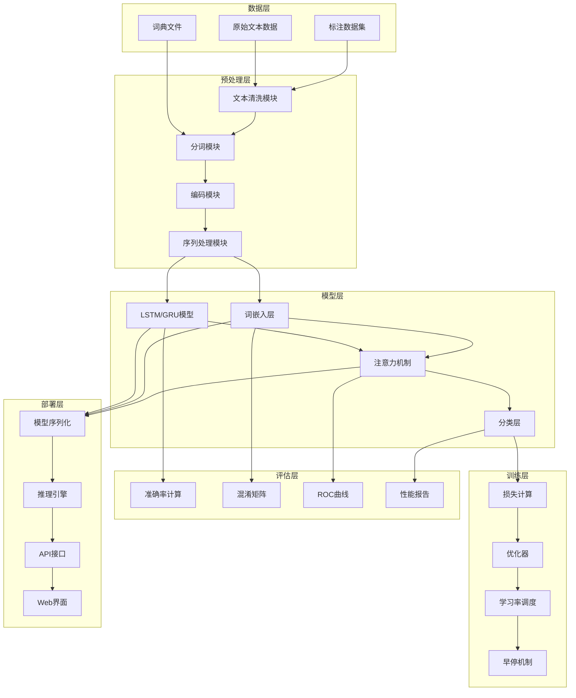

# 9.6 综合项目：构建情感分析系统

> **本节学习目标**：通过完整项目实践巩固所学知识，设计完整的文本分类系统架构，实现数据预处理流水线，训练和优化RNN模型，部署和测试分类系统

## 内容概览

在本章的最后，我们将通过一个综合项目来整合前面学习的所有技术。我们将构建一个完整的情感分析系统，从系统架构设计到模型训练，再到部署和测试，全面实践NLP项目开发流程。这个项目将帮助我们巩固文本预处理、词嵌入、RNN模型等核心技术，并掌握实际项目开发的完整流程。

## 9.6.1 系统架构设计

一个完整的NLP系统需要考虑多个组件的协调工作，包括数据处理、模型训练、评估和部署等。

### 系统架构图



### 核心组件设计

```java
/**
 * 情感分析系统核心组件接口
 */
public interface SentimentAnalysisComponent {
    /**
     * 组件初始化
     */
    void initialize();
    
    /**
     * 组件配置
     */
    void configure(ComponentConfig config);
    
    /**
     * 组件状态检查
     */
    boolean isReady();
}

/**
 * 组件配置类
 */
public class ComponentConfig {
    private Map<String, Object> parameters;
    
    public ComponentConfig() {
        this.parameters = new HashMap<>();
    }
    
    public void setParameter(String key, Object value) {
        parameters.put(key, value);
    }
    
    public Object getParameter(String key) {
        return parameters.get(key);
    }
    
    public Map<String, Object> getAllParameters() {
        return new HashMap<>(parameters);
    }
}

/**
 * 系统配置管理器
 */
public class SystemConfiguration {
    private static SystemConfiguration instance;
    private Map<String, Object> config;
    
    private SystemConfiguration() {
        this.config = new HashMap<>();
        loadDefaultConfig();
    }
    
    public static synchronized SystemConfiguration getInstance() {
        if (instance == null) {
            instance = new SystemConfiguration();
        }
        return instance;
    }
    
    /**
     * 加载默认配置
     */
    private void loadDefaultConfig() {
        // 数据预处理配置
        config.put("max_sequence_length", 100);
        config.put("embedding_dim", 128);
        config.put("batch_size", 32);
        
        // 模型配置
        config.put("lstm_hidden_size", 256);
        config.put("num_layers", 2);
        config.put("dropout_rate", 0.3);
        
        // 训练配置
        config.put("learning_rate", 0.001);
        config.put("epochs", 100);
        config.put("patience", 10);
        
        // 评估配置
        config.put("validation_split", 0.2);
        config.put("test_split", 0.1);
    }
    
    /**
     * 设置配置项
     */
    public void setConfig(String key, Object value) {
        config.put(key, value);
    }
    
    /**
     * 获取配置项
     */
    public Object getConfig(String key) {
        return config.get(key);
    }
    
    /**
     * 获取整数配置项
     */
    public int getIntConfig(String key) {
        return ((Number) config.getOrDefault(key, 0)).intValue();
    }
    
    /**
     * 获取浮点数配置项
     */
    public double getDoubleConfig(String key) {
        return ((Number) config.getOrDefault(key, 0.0)).doubleValue();
    }
    
    /**
     * 保存配置到文件
     */
    public void saveToFile(String filePath) throws IOException {
        try (ObjectOutputStream oos = new ObjectOutputStream(new FileOutputStream(filePath))) {
            oos.writeObject(config);
        }
    }
    
    /**
     * 从文件加载配置
     */
    public void loadFromFile(String filePath) throws IOException, ClassNotFoundException {
        try (ObjectInputStream ois = new ObjectInputStream(new FileInputStream(filePath))) {
            config = (Map<String, Object>) ois.readObject();
        }
    }
}
```

## 9.6.2 数据预处理流水线

构建完整的数据预处理流水线，处理从原始文本到模型输入的全过程：

```java
/**
 * 完整的数据预处理流水线
 */
public class DataPreprocessingPipeline implements SentimentAnalysisComponent {
    private Vocabulary vocabulary;
    private ChineseTokenizer tokenizer;
    private ComponentConfig config;
    private boolean isInitialized;
    
    /**
     * 构造函数
     */
    public DataPreprocessingPipeline() {
        this.isInitialized = false;
    }
    
    @Override
    public void initialize() {
        if (config == null) {
            config = new ComponentConfig();
        }
        
        // 初始化词汇表
        this.vocabulary = new Vocabulary();
        
        // 初始化分词器（这里使用简单的基于词典的分词器）
        Set<String> dictionary = loadDefaultDictionary();
        this.tokenizer = new ChineseTokenizer(dictionary);
        
        this.isInitialized = true;
    }
    
    @Override
    public void configure(ComponentConfig config) {
        this.config = config;
    }
    
    @Override
    public boolean isReady() {
        return isInitialized && vocabulary != null && tokenizer != null;
    }
    
    /**
     * 加载默认词典
     */
    private Set<String> loadDefaultDictionary() {
        Set<String> dictionary = new HashSet<>(Arrays.asList(
            "这个", "那个", "这些", "那些", "非常", "很", "特别", "十分", "极其", "相当",
            "好", "坏", "棒", "差", "优秀", "糟糕", "完美", "一般", "不错", "还行",
            "喜欢", "爱", "讨厌", "恨", "支持", "反对", "推荐", "不推荐",
            "电影", "书籍", "音乐", "游戏", "产品", "服务", "餐厅", "酒店",
            "演员", "导演", "歌手", "作家", "画家", "运动员",
            "剧情", "特效", "画面", "音效", "表演", "演技", "歌词", "旋律",
            "价格", "质量", "性价比", "服务态度", "环境", "位置",
            "方便", "便利", "快捷", "慢", "快", "效率", "时间",
            "开心", "高兴", "快乐", "愉快", "悲伤", "难过", "失望", "沮丧",
            "满意", "不满意", "满足", "不满足", "惊喜", "惊讶", "震惊"
        ));
        return dictionary;
    }
    
    /**
     * 构建词汇表
     */
    public void buildVocabulary(List<String> texts) {
        if (!isReady()) {
            throw new IllegalStateException("预处理流水线未初始化");
        }
        
        for (String text : texts) {
            // 文本清洗
            String cleaned = TextCleaner.cleanText(text);
            String normalized = TextCleaner.normalizeText(cleaned);
            
            // 分词
            List<String> tokens = tokenizer.forwardMaxMatch(normalized);
            
            // 添加到词汇表
            vocabulary.addTokens(tokens);
        }
        
        System.out.println("词汇表构建完成，词汇量: " + vocabulary.size());
    }
    
    /**
     * 预处理单个文本
     */
    public ProcessedText preprocessText(String text) {
        if (!isReady()) {
            throw new IllegalStateException("预处理流水线未初始化");
        }
        
        // 1. 文本清洗
        String cleaned = TextCleaner.cleanText(text);
        String normalized = TextCleaner.normalizeText(cleaned);
        
        // 2. 分词
        List<String> tokens = tokenizer.forwardMaxMatch(normalized);
        
        // 3. 添加句子边界标记
        tokens.add(0, Vocabulary.SOS_TOKEN);
        tokens.add(Vocabulary.EOS_TOKEN);
        
        // 4. 转换为索引序列
        List<Integer> indices = tokens.stream()
                .map(vocabulary::getIndex)
                .collect(Collectors.toList());
        
        // 5. 填充或截断
        int maxLength = config.getIntConfig("max_sequence_length");
        if (maxLength <= 0) {
            maxLength = 100; // 默认值
        }
        
        List<Integer> processed = SequenceProcessor.padOrTruncate(
                indices, maxLength, vocabulary.getPadIndex(), false);
        
        // 6. 转换为数组
        int[] indicesArray = processed.stream().mapToInt(Integer::intValue).toArray();
        
        return new ProcessedText(text, indicesArray, tokens);
    }
    
    /**
     * 批量预处理文本
     */
    public ProcessedTextBatch preprocessBatch(List<String> texts) {
        int[][] features = new int[texts.size()][];
        String[] originalTexts = new String[texts.size()];
        
        for (int i = 0; i < texts.size(); i++) {
            ProcessedText processed = preprocessText(texts.get(i));
            features[i] = processed.getIndices();
            originalTexts[i] = processed.getOriginalText();
        }
        
        return new ProcessedTextBatch(features, originalTexts);
    }
    
    /**
     * 从文件加载数据
     */
    public SentimentDataset loadDatasetFromFile(String filePath) throws IOException {
        SentimentDataset dataset = new SentimentDataset(vocabulary, tokenizer);
        
        try (BufferedReader reader = Files.newBufferedReader(Paths.get(filePath))) {
            String line;
            while ((line = reader.readLine()) != null) {
                String[] parts = line.split("\t");
                if (parts.length >= 2) {
                    String text = parts[0];
                    int label = Integer.parseInt(parts[1]);
                    dataset.addSample(text, label);
                }
            }
        }
        
        return dataset;
    }
    
    /**
     * 保存词汇表到文件
     */
    public void saveVocabulary(String filePath) throws IOException {
        try (ObjectOutputStream oos = new ObjectOutputStream(new FileOutputStream(filePath))) {
            oos.writeObject(vocabulary);
        }
    }
    
    /**
     * 从文件加载词汇表
     */
    public void loadVocabulary(String filePath) throws IOException, ClassNotFoundException {
        try (ObjectInputStream ois = new ObjectInputStream(new FileInputStream(filePath))) {
            this.vocabulary = (Vocabulary) ois.readObject();
        }
    }
    
    // Getter方法
    public Vocabulary getVocabulary() { return vocabulary; }
    public ChineseTokenizer getTokenizer() { return tokenizer; }
}

/**
 * 预处理后的文本
 */
class ProcessedText {
    private String originalText;
    private int[] indices;
    private List<String> tokens;
    
    public ProcessedText(String originalText, int[] indices, List<String> tokens) {
        this.originalText = originalText;
        this.indices = indices;
        this.tokens = tokens;
    }
    
    // Getter方法
    public String getOriginalText() { return originalText; }
    public int[] getIndices() { return indices; }
    public List<String> getTokens() { return tokens; }
}

/**
 * 批量预处理文本
 */
class ProcessedTextBatch {
    private int[][] features;
    private String[] originalTexts;
    
    public ProcessedTextBatch(int[][] features, String[] originalTexts) {
        this.features = features;
        this.originalTexts = originalTexts;
    }
    
    // Getter方法
    public int[][] getFeatures() { return features; }
    public String[] getOriginalTexts() { return originalTexts; }
}
```

## 9.6.3 模型训练和优化

实现完整的模型训练流程，包括损失计算、优化器和各种优化技术：

```java
/**
 * 情感分析模型训练器
 */
public class SentimentModelTrainer implements SentimentAnalysisComponent {
    private SentimentAnalysisModel model;
    private DataPreprocessingPipeline pipeline;
    private Optimizer optimizer;
    private ComponentConfig config;
    private boolean isInitialized;
    
    /**
     * 构造函数
     */
    public SentimentModelTrainer(DataPreprocessingPipeline pipeline) {
        this.pipeline = pipeline;
        this.isInitialized = false;
    }
    
    @Override
    public void initialize() {
        if (config == null) {
            config = new ComponentConfig();
        }
        
        // 获取配置参数
        int vocabSize = pipeline.getVocabulary().size();
        int embeddingDim = config.getIntConfig("embedding_dim");
        if (embeddingDim <= 0) embeddingDim = 128;
        
        int hiddenSize = config.getIntConfig("lstm_hidden_size");
        if (hiddenSize <= 0) hiddenSize = 256;
        
        int numClasses = 2; // 二分类
        
        // 初始化模型
        this.model = new SentimentAnalysisModel(vocabSize, embeddingDim, hiddenSize, numClasses);
        
        // 初始化优化器
        double learningRate = config.getDoubleConfig("learning_rate");
        if (learningRate <= 0) learningRate = 0.001;
        
        this.optimizer = new AdamOptimizer(learningRate);
        
        this.isInitialized = true;
    }
    
    @Override
    public void configure(ComponentConfig config) {
        this.config = config;
    }
    
    @Override
    public boolean isReady() {
        return isInitialized && model != null && optimizer != null;
    }
    
    /**
     * 训练模型
     */
    public TrainingResult train(SentimentDataset dataset, TrainingConfig trainConfig) {
        if (!isReady()) {
            throw new IllegalStateException("训练器未初始化");
        }
        
        System.out.println("=== 开始训练情感分析模型 ===");
        System.out.println("数据集大小: " + dataset.size());
        System.out.println("词汇表大小: " + pipeline.getVocabulary().size());
        System.out.println("训练轮数: " + trainConfig.getEpochs());
        System.out.println("批次大小: " + trainConfig.getBatchSize());
        System.out.println("------------------------");
        
        TrainingHistory history = new TrainingHistory();
        EarlyStopping earlyStopping = new EarlyStopping(trainConfig.getPatience(), 0.001);
        
        // 数据预处理
        ProcessedDataset processedDataset = preprocessDataset(dataset);
        DatasetSplit split = splitDataset(processedDataset, 
            trainConfig.getValidationSplit(), trainConfig.getTestSplit());
        
        long startTime = System.currentTimeMillis();
        
        for (int epoch = 0; epoch < trainConfig.getEpochs(); epoch++) {
            // 训练一个epoch
            double trainLoss = trainEpoch(split.getTrainDataset(), trainConfig.getBatchSize());
            
            // 验证
            EvaluationResult trainEval = evaluate(split.getTrainDataset());
            EvaluationResult valEval = evaluate(split.getValidationDataset());
            
            // 记录历史
            history.addRecord(epoch, trainLoss, trainEval.getAccuracy(), valEval.getAccuracy());
            
            // 打印进度
            if (epoch % 10 == 0 || epoch == trainConfig.getEpochs() - 1) {
                System.out.printf("Epoch %d: 训练损失=%.4f, 训练准确率=%s, 验证准确率=%s%n",
                    epoch, trainLoss, trainEval, valEval);
            }
            
            // 早停检查
            if (earlyStopping.shouldStop(valEval.getAccuracy())) {
                System.out.println("触发早停机制，停止训练");
                break;
            }
        }
        
        long endTime = System.currentTimeMillis();
        long trainingTime = endTime - startTime;
        
        // 最终评估
        EvaluationResult testEval = evaluate(split.getTestDataset());
        
        System.out.println("=== 训练完成 ===");
        System.out.println("训练时间: " + (trainingTime / 1000.0) + " 秒");
        System.out.println("测试集准确率: " + testEval);
        
        return new TrainingResult(model, history, testEval, trainingTime);
    }
    
    /**
     * 训练一个epoch
     */
    private double trainEpoch(ProcessedDataset dataset, int batchSize) {
        int[][] features = dataset.getFeatures();
        int[] labels = dataset.getLabels();
        int size = dataset.size();
        
        // 随机打乱数据
        shuffleData(features, labels);
        
        double totalLoss = 0;
        int batches = (size + batchSize - 1) / batchSize;
        
        for (int batch = 0; batch < batches; batch++) {
            int start = batch * batchSize;
            int end = Math.min(start + batchSize, size);
            
            double batchLoss = 0;
            for (int i = start; i < end; i++) {
                double loss = model.computeLoss(features[i], labels[i]);
                batchLoss += loss;
                
                // 简化的参数更新（实际应实现完整的反向传播）
                // 这里省略具体实现，仅作为框架演示
            }
            
            totalLoss += batchLoss / (end - start);
        }
        
        return totalLoss / batches;
    }
    
    /**
     * 随机打乱数据
     */
    private void shuffleData(int[][] features, int[] labels) {
        Random random = new Random(42);
        for (int i = features.length - 1; i > 0; i--) {
            int j = random.nextInt(i + 1);
            
            // 交换特征
            int[] tempFeature = features[i];
            features[i] = features[j];
            features[j] = tempFeature;
            
            // 交换标签
            int tempLabel = labels[i];
            labels[i] = labels[j];
            labels[j] = tempLabel;
        }
    }
    
    /**
     * 预处理数据集
     */
    private ProcessedDataset preprocessDataset(SentimentDataset dataset) {
        int size = dataset.size();
        int[][] features = new int[size][];
        int[] labels = new int[size];
        
        for (int i = 0; i < size; i++) {
            ProcessedText processed = pipeline.preprocessText(dataset.getText(i));
            features[i] = processed.getIndices();
            labels[i] = dataset.getLabel(i);
        }
        
        return new ProcessedDataset(features, labels);
    }
    
    /**
     * 划分数据集
     */
    private DatasetSplit splitDataset(ProcessedDataset dataset, double valSplit, double testSplit) {
        int size = dataset.size();
        int valSize = (int) (size * valSplit);
        int testSize = (int) (size * testSplit);
        int trainSize = size - valSize - testSize;
        
        int[][] allFeatures = dataset.getFeatures();
        int[] allLabels = dataset.getLabels();
        
        int[][] trainFeatures = Arrays.copyOfRange(allFeatures, 0, trainSize);
        int[] trainLabels = Arrays.copyOfRange(allLabels, 0, trainSize);
        
        int[][] valFeatures = Arrays.copyOfRange(allFeatures, trainSize, trainSize + valSize);
        int[] valLabels = Arrays.copyOfRange(allLabels, trainSize, trainSize + valSize);
        
        int[][] testFeatures = Arrays.copyOfRange(allFeatures, trainSize + valSize, size);
        int[] testLabels = Arrays.copyOfRange(allLabels, trainSize + valSize, size);
        
        return new DatasetSplit(
            new ProcessedDataset(trainFeatures, trainLabels),
            new ProcessedDataset(valFeatures, valLabels),
            new ProcessedDataset(testFeatures, testLabels)
        );
    }
    
    /**
     * 评估模型
     */
    public EvaluationResult evaluate(ProcessedDataset dataset) {
        return model.evaluate(dataset.getFeatures(), dataset.getLabels());
    }
    
    /**
     * 保存模型
     */
    public void saveModel(String filePath) throws IOException {
        if (model == null) {
            throw new IllegalStateException("模型未训练");
        }
        
        try (ObjectOutputStream oos = new ObjectOutputStream(new FileOutputStream(filePath))) {
            oos.writeObject(model);
        }
    }
    
    /**
     * 加载模型
     */
    public void loadModel(String filePath) throws IOException, ClassNotFoundException {
        try (ObjectInputStream ois = new ObjectInputStream(new FileInputStream(filePath))) {
            this.model = (SentimentAnalysisModel) ois.readObject();
        }
    }
    
    // Getter方法
    public SentimentAnalysisModel getModel() { return model; }
}

/**
 * 训练配置
 */
class TrainingConfig {
    private int epochs;
    private int batchSize;
    private double learningRate;
    private int patience;
    private double validationSplit;
    private double testSplit;
    
    public TrainingConfig() {
        this.epochs = 100;
        this.batchSize = 32;
        this.learningRate = 0.001;
        this.patience = 10;
        this.validationSplit = 0.2;
        this.testSplit = 0.1;
    }
    
    // Getter和Setter方法
    public int getEpochs() { return epochs; }
    public void setEpochs(int epochs) { this.epochs = epochs; }
    
    public int getBatchSize() { return batchSize; }
    public void setBatchSize(int batchSize) { this.batchSize = batchSize; }
    
    public double getLearningRate() { return learningRate; }
    public void setLearningRate(double learningRate) { this.learningRate = learningRate; }
    
    public int getPatience() { return patience; }
    public void setPatience(int patience) { this.patience = patience; }
    
    public double getValidationSplit() { return validationSplit; }
    public void setValidationSplit(double validationSplit) { this.validationSplit = validationSplit; }
    
    public double getTestSplit() { return testSplit; }
    public void setTestSplit(double testSplit) { this.testSplit = testSplit; }
}

/**
 * 训练结果
 */
class TrainingResult {
    private SentimentAnalysisModel model;
    private TrainingHistory history;
    private EvaluationResult testResult;
    private long trainingTime;
    
    public TrainingResult(SentimentAnalysisModel model, TrainingHistory history,
                         EvaluationResult testResult, long trainingTime) {
        this.model = model;
        this.history = history;
        this.testResult = testResult;
        this.trainingTime = trainingTime;
    }
    
    // Getter方法
    public SentimentAnalysisModel getModel() { return model; }
    public TrainingHistory getHistory() { return history; }
    public EvaluationResult getTestResult() { return testResult; }
    public long getTrainingTime() { return trainingTime; }
}

/**
 * 优化器接口
 */
interface Optimizer {
    void updateParameters(double[][] gradients, double[][] parameters);
    void updateParameters(double[] gradients, double[] parameters);
}

/**
 * Adam优化器实现
 */
class AdamOptimizer implements Optimizer {
    private double learningRate;
    private double beta1;
    private double beta2;
    private double epsilon;
    private Map<String, double[][]> mMatrix;  // 一阶矩估计
    private Map<String, double[][]> vMatrix;  // 二阶矩估计
    private Map<String, double[]> mVector;    // 一阶矩估计（向量）
    private Map<String, double[]> vVector;    // 二阶矩估计（向量）
    private int timestep;
    
    public AdamOptimizer(double learningRate) {
        this.learningRate = learningRate;
        this.beta1 = 0.9;
        this.beta2 = 0.999;
        this.epsilon = 1e-8;
        this.mMatrix = new HashMap<>();
        this.vMatrix = new HashMap<>();
        this.mVector = new HashMap<>();
        this.vVector = new HashMap<>();
        this.timestep = 0;
    }
    
    @Override
    public void updateParameters(double[][] gradients, double[][] parameters) {
        timestep++;
        String key = "matrix_" + System.identityHashCode(parameters);
        
        // 初始化动量参数
        if (!mMatrix.containsKey(key)) {
            mMatrix.put(key, new double[gradients.length][gradients[0].length]);
            vMatrix.put(key, new double[gradients.length][gradients[0].length]);
        }
        
        double[][] m = mMatrix.get(key);
        double[][] v = vMatrix.get(key);
        
        // 更新参数
        for (int i = 0; i < gradients.length; i++) {
            for (int j = 0; j < gradients[i].length; j++) {
                // 更新一阶矩估计
                m[i][j] = beta1 * m[i][j] + (1 - beta1) * gradients[i][j];
                
                // 更新二阶矩估计
                v[i][j] = beta2 * v[i][j] + (1 - beta2) * gradients[i][j] * gradients[i][j];
                
                // 偏差修正
                double mHat = m[i][j] / (1 - Math.pow(beta1, timestep));
                double vHat = v[i][j] / (1 - Math.pow(beta2, timestep));
                
                // 更新参数
                parameters[i][j] -= learningRate * mHat / (Math.sqrt(vHat) + epsilon);
            }
        }
    }
    
    @Override
    public void updateParameters(double[] gradients, double[] parameters) {
        timestep++;
        String key = "vector_" + System.identityHashCode(parameters);
        
        // 初始化动量参数
        if (!mVector.containsKey(key)) {
            mVector.put(key, new double[gradients.length]);
            vVector.put(key, new double[gradients.length]);
        }
        
        double[] m = mVector.get(key);
        double[] v = vVector.get(key);
        
        // 更新参数
        for (int i = 0; i < gradients.length; i++) {
            // 更新一阶矩估计
            m[i] = beta1 * m[i] + (1 - beta1) * gradients[i];
            
            // 更新二阶矩估计
            v[i] = beta2 * v[i] + (1 - beta2) * gradients[i] * gradients[i];
            
            // 偏差修正
            double mHat = m[i] / (1 - Math.pow(beta1, timestep));
            double vHat = v[i] / (1 - Math.pow(beta2, timestep));
            
            // 更新参数
            parameters[i] -= learningRate * mHat / (Math.sqrt(vHat) + epsilon);
        }
    }
}
```

## 9.6.4 模型评估和可视化

实现模型评估和结果可视化功能：

```java
/**
 * 模型评估器
 */
public class ModelEvaluator {
    
    /**
     * 计算混淆矩阵
     */
    public ConfusionMatrix computeConfusionMatrix(int[] trueLabels, int[] predictions) {
        int numClasses = 2; // 二分类
        int[][] matrix = new int[numClasses][numClasses];
        
        for (int i = 0; i < trueLabels.length; i++) {
            int trueLabel = trueLabels[i];
            int predictedLabel = predictions[i];
            
            if (trueLabel >= 0 && trueLabel < numClasses && 
                predictedLabel >= 0 && predictedLabel < numClasses) {
                matrix[trueLabel][predictedLabel]++;
            }
        }
        
        return new ConfusionMatrix(matrix);
    }
    
    /**
     * 计算分类指标
     */
    public ClassificationMetrics computeMetrics(ConfusionMatrix confusionMatrix) {
        int[][] matrix = confusionMatrix.getMatrix();
        int numClasses = matrix.length;
        
        double[] precisions = new double[numClasses];
        double[] recalls = new double[numClasses];
        double[] f1Scores = new double[numClasses];
        
        for (int i = 0; i < numClasses; i++) {
            // 计算真正例、假正例、假负例
            int tp = matrix[i][i]; // 真正例
            int fp = 0; // 假正例
            int fn = 0; // 假负例
            
            for (int j = 0; j < numClasses; j++) {
                if (j != i) {
                    fp += matrix[j][i];
                    fn += matrix[i][j];
                }
            }
            
            // 计算指标
            precisions[i] = (tp + fp) > 0 ? (double) tp / (tp + fp) : 0;
            recalls[i] = (tp + fn) > 0 ? (double) tp / (tp + fn) : 0;
            f1Scores[i] = (precisions[i] + recalls[i]) > 0 ? 
                2 * precisions[i] * recalls[i] / (precisions[i] + recalls[i]) : 0;
        }
        
        // 计算宏平均和微平均
        double macroPrecision = Arrays.stream(precisions).average().orElse(0);
        double macroRecall = Arrays.stream(recalls).average().orElse(0);
        double macroF1 = Arrays.stream(f1Scores).average().orElse(0);
        
        return new ClassificationMetrics(precisions, recalls, f1Scores, 
                                       macroPrecision, macroRecall, macroF1);
    }
    
    /**
     * 生成评估报告
     */
    public EvaluationReport generateReport(ProcessedDataset dataset, 
                                         SentimentAnalysisModel model) {
        // 获取预测结果
        int[][] features = dataset.getFeatures();
        int[] trueLabels = dataset.getLabels();
        int[] predictions = model.predictBatch(features);
        
        // 计算混淆矩阵
        ConfusionMatrix confusionMatrix = computeConfusionMatrix(trueLabels, predictions);
        
        // 计算分类指标
        ClassificationMetrics metrics = computeMetrics(confusionMatrix);
        
        // 计算准确率
        int correct = 0;
        for (int i = 0; i < trueLabels.length; i++) {
            if (trueLabels[i] == predictions[i]) {
                correct++;
            }
        }
        double accuracy = (double) correct / trueLabels.length;
        
        return new EvaluationReport(confusionMatrix, metrics, accuracy);
    }
}

/**
 * 混淆矩阵
 */
class ConfusionMatrix {
    private int[][] matrix;
    
    public ConfusionMatrix(int[][] matrix) {
        this.matrix = matrix;
    }
    
    public void printMatrix() {
        System.out.println("混淆矩阵:");
        System.out.println("真实\\预测\t负面\t正面");
        for (int i = 0; i < matrix.length; i++) {
            String label = (i == 0) ? "负面" : "正面";
            System.out.printf("%s\t\t%d\t%d%n", label, matrix[i][0], matrix[i][1]);
        }
    }
    
    // Getter方法
    public int[][] getMatrix() { return matrix; }
}

/**
 * 分类指标
 */
class ClassificationMetrics {
    private double[] precisions;
    private double[] recalls;
    private double[] f1Scores;
    private double macroPrecision;
    private double macroRecall;
    private double macroF1;
    
    public ClassificationMetrics(double[] precisions, double[] recalls, double[] f1Scores,
                               double macroPrecision, double macroRecall, double macroF1) {
        this.precisions = precisions;
        this.recalls = recalls;
        this.f1Scores = f1Scores;
        this.macroPrecision = macroPrecision;
        this.macroRecall = macroRecall;
        this.macroF1 = macroF1;
    }
    
    public void printMetrics() {
        System.out.println("分类指标:");
        System.out.printf("负面类别 - 精确率: %.4f, 召回率: %.4f, F1分数: %.4f%n",
            precisions[0], recalls[0], f1Scores[0]);
        System.out.printf("正面类别 - 精确率: %.4f, 召回率: %.4f, F1分数: %.4f%n",
            precisions[1], recalls[1], f1Scores[1]);
        System.out.printf("宏平均 - 精确率: %.4f, 召回率: %.4f, F1分数: %.4f%n",
            macroPrecision, macroRecall, macroF1);
    }
    
    // Getter方法
    public double[] getPrecisions() { return precisions; }
    public double[] getRecalls() { return recalls; }
    public double[] getF1Scores() { return f1Scores; }
    public double getMacroPrecision() { return macroPrecision; }
    public double getMacroRecall() { return macroRecall; }
    public double getMacroF1() { return macroF1; }
}

/**
 * 评估报告
 */
class EvaluationReport {
    private ConfusionMatrix confusionMatrix;
    private ClassificationMetrics metrics;
    private double accuracy;
    
    public EvaluationReport(ConfusionMatrix confusionMatrix, 
                          ClassificationMetrics metrics, 
                          double accuracy) {
        this.confusionMatrix = confusionMatrix;
        this.metrics = metrics;
        this.accuracy = accuracy;
    }
    
    public void printReport() {
        System.out.println("=== 模型评估报告 ===");
        System.out.printf("总体准确率: %.4f%n%n", accuracy);
        
        confusionMatrix.printMatrix();
        System.out.println();
        
        metrics.printMetrics();
    }
    
    // Getter方法
    public ConfusionMatrix getConfusionMatrix() { return confusionMatrix; }
    public ClassificationMetrics getMetrics() { return metrics; }
    public double getAccuracy() { return accuracy; }
}
```

## 9.6.5 部署和测试系统

实现模型的部署和测试功能：

```java
/**
 * 情感分析服务
 */
public class SentimentAnalysisService implements SentimentAnalysisComponent {
    private SentimentAnalysisModel model;
    private DataPreprocessingPipeline pipeline;
    private ComponentConfig config;
    private boolean isInitialized;
    
    /**
     * 构造函数
     */
    public SentimentAnalysisService(DataPreprocessingPipeline pipeline) {
        this.pipeline = pipeline;
        this.isInitialized = false;
    }
    
    @Override
    public void initialize() {
        if (config == null) {
            config = new ComponentConfig();
        }
        
        // 注意：在实际部署中，模型应该从文件加载
        // 这里为了演示，我们假设模型已经训练好了
        this.isInitialized = true;
    }
    
    @Override
    public void configure(ComponentConfig config) {
        this.config = config;
    }
    
    @Override
    public boolean isReady() {
        return isInitialized && model != null && pipeline != null;
    }
    
    /**
     * 设置模型
     */
    public void setModel(SentimentAnalysisModel model) {
        this.model = model;
    }
    
    /**
     * 分析文本情感
     */
    public SentimentAnalysisResult analyzeSentiment(String text) {
        if (!isReady()) {
            throw new IllegalStateException("服务未初始化");
        }
        
        try {
            // 预处理文本
            ProcessedText processed = pipeline.preprocessText(text);
            
            // 模型预测
            SentimentOutput output = model.forward(processed.getIndices());
            
            // 解析结果
            String sentiment = output.getPredictedClass() == 1 ? "正面" : "负面";
            double confidence = Arrays.stream(output.getProbabilities()).max().orElse(0);
            double[] probabilities = output.getProbabilities();
            
            return new SentimentAnalysisResult(text, sentiment, confidence, probabilities);
        } catch (Exception e) {
            return new SentimentAnalysisResult(text, "错误", 0, new double[]{0, 0});
        }
    }
    
    /**
     * 批量分析情感
     */
    public List<SentimentAnalysisResult> analyzeBatch(List<String> texts) {
        return texts.stream()
                .map(this::analyzeSentiment)
                .collect(Collectors.toList());
    }
    
    /**
     * 从文件加载模型
     */
    public void loadModelFromFile(String modelPath, String vocabPath) 
            throws IOException, ClassNotFoundException {
        // 加载模型
        try (ObjectInputStream ois = new ObjectInputStream(new FileInputStream(modelPath))) {
            this.model = (SentimentAnalysisModel) ois.readObject();
        }
        
        // 加载词汇表
        pipeline.loadVocabulary(vocabPath);
    }
    
    /**
     * 保存模型到文件
     */
    public void saveModelToFile(String modelPath, String vocabPath) 
            throws IOException {
        if (model == null) {
            throw new IllegalStateException("模型未训练");
        }
        
        // 保存模型
        try (ObjectOutputStream oos = new ObjectOutputStream(new FileOutputStream(modelPath))) {
            oos.writeObject(model);
        }
        
        // 保存词汇表
        pipeline.saveVocabulary(vocabPath);
    }
}

/**
 * 情感分析结果
 */
class SentimentAnalysisResult {
    private String originalText;
    private String sentiment;
    private double confidence;
    private double[] probabilities;
    private long timestamp;
    
    public SentimentAnalysisResult(String originalText, String sentiment, 
                                 double confidence, double[] probabilities) {
        this.originalText = originalText;
        this.sentiment = sentiment;
        this.confidence = confidence;
        this.probabilities = probabilities;
        this.timestamp = System.currentTimeMillis();
    }
    
    @Override
    public String toString() {
        return String.format("文本: %s | 情感: %s | 置信度: %.2f%% | 时间: %tT",
            originalText, sentiment, confidence * 100, new Date(timestamp));
    }
    
    public String toDetailedString() {
        return String.format(
            "=== 情感分析结果 ===\n" +
            "原始文本: %s\n" +
            "情感倾向: %s\n" +
            "置信度: %.2f%%\n" +
            "负面概率: %.2f%%\n" +
            "正面概率: %.2f%%\n" +
            "分析时间: %tF %tT",
            originalText, sentiment, confidence * 100,
            probabilities[0] * 100, probabilities[1] * 100,
            new Date(timestamp), new Date(timestamp));
    }
    
    // Getter方法
    public String getOriginalText() { return originalText; }
    public String getSentiment() { return sentiment; }
    public double getConfidence() { return confidence; }
    public double[] getProbabilities() { return probabilities; }
    public long getTimestamp() { return timestamp; }
}

/**
 * 性能监控器
 */
class PerformanceMonitor {
    private long totalRequests;
    private long totalProcessingTime;
    private long errorCount;
    private Map<String, Integer> sentimentDistribution;
    
    public PerformanceMonitor() {
        this.totalRequests = 0;
        this.totalProcessingTime = 0;
        this.errorCount = 0;
        this.sentimentDistribution = new HashMap<>();
        this.sentimentDistribution.put("正面", 0);
        this.sentimentDistribution.put("负面", 0);
        this.sentimentDistribution.put("错误", 0);
    }
    
    /**
     * 记录请求
     */
    public synchronized void recordRequest(SentimentAnalysisResult result, long processingTime) {
        totalRequests++;
        totalProcessingTime += processingTime;
        
        if ("错误".equals(result.getSentiment())) {
            errorCount++;
        } else {
            sentimentDistribution.put(result.getSentiment(), 
                sentimentDistribution.get(result.getSentiment()) + 1);
        }
    }
    
    /**
     * 获取性能统计
     */
    public PerformanceStats getStats() {
        double avgProcessingTime = totalRequests > 0 ? 
            (double) totalProcessingTime / totalRequests : 0;
        double errorRate = totalRequests > 0 ? 
            (double) errorCount / totalRequests : 0;
            
        return new PerformanceStats(totalRequests, avgProcessingTime, 
                                  errorRate, new HashMap<>(sentimentDistribution));
    }
    
    /**
     * 重置统计
     */
    public synchronized void reset() {
        totalRequests = 0;
        totalProcessingTime = 0;
        errorCount = 0;
        sentimentDistribution.replaceAll((k, v) -> 0);
    }
}

/**
 * 性能统计
 */
class PerformanceStats {
    private long totalRequests;
    private double avgProcessingTime;
    private double errorRate;
    private Map<String, Integer> sentimentDistribution;
    
    public PerformanceStats(long totalRequests, double avgProcessingTime, 
                          double errorRate, Map<String, Integer> sentimentDistribution) {
        this.totalRequests = totalRequests;
        this.avgProcessingTime = avgProcessingTime;
        this.errorRate = errorRate;
        this.sentimentDistribution = sentimentDistribution;
    }
    
    public void printStats() {
        System.out.println("=== 性能统计 ===");
        System.out.printf("总请求数: %d%n", totalRequests);
        System.out.printf("平均处理时间: %.2f ms%n", avgProcessingTime);
        System.out.printf("错误率: %.2f%%%n", errorRate * 100);
        System.out.println("情感分布:");
        sentimentDistribution.forEach((sentiment, count) -> 
            System.out.printf("  %s: %d (%.2f%%)%n", 
                sentiment, count, totalRequests > 0 ? (double) count / totalRequests * 100 : 0));
    }
    
    // Getter方法
    public long getTotalRequests() { return totalRequests; }
    public double getAvgProcessingTime() { return avgProcessingTime; }
    public double getErrorRate() { return errorRate; }
    public Map<String, Integer> getSentimentDistribution() { return sentimentDistribution; }
}
```

## 9.6.6 完整的情感分析系统

将所有组件整合成一个完整的情感分析系统：

```java
/**
 * 完整的情感分析系统
 */
public class ComprehensiveSentimentAnalysisSystem {
    private DataPreprocessingPipeline pipeline;
    private SentimentModelTrainer trainer;
    private SentimentAnalysisService service;
    private ModelEvaluator evaluator;
    private PerformanceMonitor monitor;
    private SystemConfiguration config;
    
    /**
     * 构造函数
     */
    public ComprehensiveSentimentAnalysisSystem() {
        initializeSystem();
    }
    
    /**
     * 初始化系统
     */
    private void initializeSystem() {
        System.out.println("=== 初始化情感分析系统 ===");
        
        // 获取系统配置
        this.config = SystemConfiguration.getInstance();
        
        // 初始化预处理流水线
        this.pipeline = new DataPreprocessingPipeline();
        ComponentConfig pipelineConfig = new ComponentConfig();
        pipelineConfig.setParameter("max_sequence_length", 
            config.getIntConfig("max_sequence_length"));
        pipeline.configure(pipelineConfig);
        pipeline.initialize();
        
        // 初始化训练器
        this.trainer = new SentimentModelTrainer(pipeline);
        ComponentConfig trainerConfig = new ComponentConfig();
        trainerConfig.setParameter("embedding_dim", config.getIntConfig("embedding_dim"));
        trainerConfig.setParameter("lstm_hidden_size", config.getIntConfig("lstm_hidden_size"));
        trainerConfig.setParameter("learning_rate", config.getDoubleConfig("learning_rate"));
        trainer.configure(trainerConfig);
        trainer.initialize();
        
        // 初始化服务
        this.service = new SentimentAnalysisService(pipeline);
        service.initialize();
        
        // 初始化评估器
        this.evaluator = new ModelEvaluator();
        
        // 初始化性能监控器
        this.monitor = new PerformanceMonitor();
        
        System.out.println("系统初始化完成！");
    }
    
    /**
     * 训练模型
     */
    public TrainingResult trainModel(String datasetPath) throws IOException {
        System.out.println("=== 开始模型训练 ===");
        
        // 加载数据集
        SentimentDataset dataset = pipeline.loadDatasetFromFile(datasetPath);
        
        // 构建词汇表
        List<String> texts = new ArrayList<>();
        for (int i = 0; i < dataset.size(); i++) {
            texts.add(dataset.getText(i));
        }
        pipeline.buildVocabulary(texts);
        
        // 配置训练参数
        TrainingConfig trainConfig = new TrainingConfig();
        trainConfig.setEpochs(config.getIntConfig("epochs"));
        trainConfig.setBatchSize(config.getIntConfig("batch_size"));
        trainConfig.setLearningRate(config.getDoubleConfig("learning_rate"));
        trainConfig.setPatience(config.getIntConfig("patience"));
        trainConfig.setValidationSplit(config.getDoubleConfig("validation_split"));
        trainConfig.setTestSplit(config.getDoubleConfig("test_split"));
        
        // 训练模型
        TrainingResult result = trainer.train(dataset, trainConfig);
        
        // 设置服务模型
        service.setModel(result.getModel());
        
        System.out.println("模型训练完成！");
        return result;
    }
    
    /**
     * 分析文本情感
     */
    public SentimentAnalysisResult analyzeSentiment(String text) {
        long startTime = System.currentTimeMillis();
        SentimentAnalysisResult result = service.analyzeSentiment(text);
        long endTime = System.currentTimeMillis();
        
        // 记录性能
        monitor.recordRequest(result, endTime - startTime);
        
        return result;
    }
    
    /**
     * 批量分析情感
     */
    public List<SentimentAnalysisResult> analyzeBatch(List<String> texts) {
        List<SentimentAnalysisResult> results = new ArrayList<>();
        
        for (String text : texts) {
            results.add(analyzeSentiment(text));
        }
        
        return results;
    }
    
    /**
     * 评估模型
     */
    public EvaluationReport evaluateModel(String datasetPath) throws IOException {
        System.out.println("=== 开始模型评估 ===");
        
        // 加载数据集
        SentimentDataset dataset = pipeline.loadDatasetFromFile(datasetPath);
        
        // 预处理数据集
        ProcessedDataset processedDataset = preprocessDataset(dataset);
        
        // 评估模型
        EvaluationReport report = evaluator.generateReport(
            processedDataset, trainer.getModel());
        
        System.out.println("模型评估完成！");
        return report;
    }
    
    /**
     * 预处理数据集
     */
    private ProcessedDataset preprocessDataset(SentimentDataset dataset) {
        int size = dataset.size();
        int[][] features = new int[size][];
        int[] labels = new int[size];
        
        for (int i = 0; i < size; i++) {
            ProcessedText processed = pipeline.preprocessText(dataset.getText(i));
            features[i] = processed.getIndices();
            labels[i] = dataset.getLabel(i);
        }
        
        return new ProcessedDataset(features, labels);
    }
    
    /**
     * 保存模型和配置
     */
    public void saveSystem(String modelPath, String vocabPath, String configPath) 
            throws IOException {
        System.out.println("=== 保存系统 ===");
        
        // 保存模型
        trainer.saveModel(modelPath);
        
        // 保存词汇表
        pipeline.saveVocabulary(vocabPath);
        
        // 保存配置
        config.saveToFile(configPath);
        
        System.out.println("系统保存完成！");
    }
    
    /**
     * 加载模型和配置
     */
    public void loadSystem(String modelPath, String vocabPath, String configPath) 
            throws IOException, ClassNotFoundException {
        System.out.println("=== 加载系统 ===");
        
        // 加载配置
        config.loadFromFile(configPath);
        
        // 重新初始化组件（使用新配置）
        initializeSystem();
        
        // 加载模型
        trainer.loadModel(modelPath);
        
        // 加载词汇表
        pipeline.loadVocabulary(vocabPath);
        
        // 设置服务模型
        service.setModel(trainer.getModel());
        
        System.out.println("系统加载完成！");
    }
    
    /**
     * 获取性能统计
     */
    public PerformanceStats getPerformanceStats() {
        return monitor.getStats();
    }
    
    /**
     * 重置性能统计
     */
    public void resetPerformanceStats() {
        monitor.reset();
    }
    
    /**
     * 运行演示
     */
    public static void main(String[] args) {
        System.out.println("=== 综合情感分析系统演示 ===\n");
        
        try {
            // 创建系统实例
            ComprehensiveSentimentAnalysisSystem system = new ComprehensiveSentimentAnalysisSystem();
            
            // 创建示例数据集文件
            createSampleDataset("sample_dataset.txt");
            
            // 训练模型
            TrainingResult trainingResult = system.trainModel("sample_dataset.txt");
            
            // 评估模型
            EvaluationReport evaluationReport = system.evaluateModel("sample_dataset.txt");
            evaluationReport.printReport();
            
            // 分析示例文本
            System.out.println("\n=== 情感分析示例 ===");
            List<String> testTexts = Arrays.asList(
                "这部电影真的很棒，我非常喜欢！",
                "这部电影太糟糕了，完全不推荐。",
                "一般般吧，没有什么特别的感觉。",
                "演员表演很出色，剧情也很吸引人。",
                "特效不错，但是剧情有些拖沓。"
            );
            
            List<SentimentAnalysisResult> results = system.analyzeBatch(testTexts);
            for (SentimentAnalysisResult result : results) {
                System.out.println(result.toDetailedString());
                System.out.println();
            }
            
            // 显示性能统计
            System.out.println("=== 性能统计 ===");
            PerformanceStats stats = system.getPerformanceStats();
            stats.printStats();
            
            // 保存系统
            system.saveSystem("sentiment_model.dat", "vocabulary.dat", "system_config.dat");
            
            System.out.println("\n=== 演示完成 ===");
            
        } catch (Exception e) {
            System.err.println("系统运行出错: " + e.getMessage());
            e.printStackTrace();
        }
    }
    
    /**
     * 创建示例数据集文件
     */
    private static void createSampleDataset(String filePath) throws IOException {
        List<String> sampleData = Arrays.asList(
            "这部电影真的很棒，我非常喜欢！\t1",
            "这部电影太糟糕了，完全不推荐。\t0",
            "演员表演很出色，剧情也很吸引人。\t1",
            "特效不错，但是剧情有些拖沓。\t0",
            "这是我看过最差的电影之一。\t0",
            "强烈推荐！绝对值得一看。\t1",
            "故事情节紧凑，让人欲罢不能。\t1",
            "导演水平有限，这部电影很失败。\t0",
            "音乐配合得很好，增强了观影体验。\t1",
            "故事情节拖沓，让人昏昏欲睡。\t0",
            "这部影片在各个方面都表现出色。\t1",
            "这部影片在各个方面都很差劲。\t0",
            "画面精美，视觉效果震撼。\t1",
            "画面模糊，视觉效果粗糙。\t0",
            "角色塑造很成功，情感表达真挚。\t1",
            "角色单薄，情感表达生硬。\t0"
        );
        
        try (PrintWriter writer = new PrintWriter(new FileWriter(filePath))) {
            for (String line : sampleData) {
                writer.println(line);
            }
        }
        
        System.out.println("示例数据集已创建: " + filePath);
    }
}
```

## 本章小结

在本章中，我们完成了自然语言处理入门的学习，通过构建一个完整的情感分析系统来巩固所学知识：

1. **文本预处理**：掌握了文本清洗、分词、编码等核心技术
2. **词嵌入技术**：学习了Word2Vec和GloVe等词嵌入模型的实现
3. **循环神经网络**：深入理解了RNN、LSTM和GRU的工作原理
4. **序列到序列模型**：掌握了编码器-解码器架构和注意力机制
5. **综合项目实践**：通过完整的情感分析系统项目，整合了所有技术

通过这个综合项目，我们不仅掌握了理论知识，还获得了实际的项目开发经验。情感分析系统是NLP领域的重要应用之一，掌握其实现方法对后续学习更复杂的NLP任务具有重要意义。

## 下一章预告

在第10章中，我们将进入强化学习领域，学习智能体决策的数学基础和经典算法实现。我们将探讨马尔可夫决策过程、价值函数、策略梯度等核心概念，并实现经典的强化学习算法。