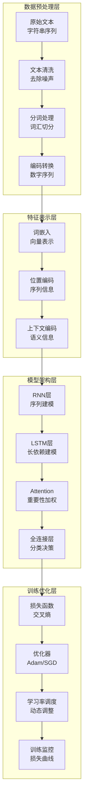

# 第9章：自然语言处理入门

> **设计思想**：为语言模型学习奠定基础，理解文本处理的核心技术

## 章节概述

自然语言处理（Natural Language Processing, NLP）是人工智能领域的重要分支，致力于让计算机理解和生成人类语言。随着深度学习技术的发展，NLP领域取得了突破性进展，从早期的基于规则和统计的方法，发展到现在的基于深度神经网络的预训练语言模型。

本章将带领Java程序员深入理解NLP的基础知识，从文本预处理到词嵌入技术，再到循环神经网络的应用。我们将基于TinyAI框架，通过实际的代码示例和项目实践，帮助读者掌握NLP的核心技术。

## 学习目标

完成本章学习后，你将：

- ✅ **掌握文本处理基础**：理解文本数据的预处理和编码技术
- ✅ **理解词嵌入原理**：掌握词嵌入的数学原理和实现方法
- ✅ **学习RNN核心技术**：理解循环神经网络的结构和应用
- ✅ **实现完整NLP系统**：构建从数据预处理到模型训练的完整流程
- ✅ **具备NLP应用能力**：能够开发基本的文本分类和情感分析系统

## 章节内容

### 9.1 文本预处理：分词与编码
**学习重点**：掌握文本数据的预处理技术和编码方法
- 文本清洗和标准化
- 分词算法：基于规则、统计、神经网络
- 词汇表构建和管理
- 序列填充和截断

### 9.2 词嵌入技术：Word2Vec与GloVe
**学习重点**：理解词嵌入的数学原理和实现方法
- 词嵌入的基本概念和意义
- Word2Vec的CBOW和Skip-gram模型
- GloVe的全局统计信息利用
- 预训练词向量的使用

### 9.3 循环神经网络：RNN、LSTM与GRU
**学习重点**：掌握循环神经网络的核心结构和实现
- RNN的基本结构和梯度消失问题
- LSTM的门控机制设计
- GRU的简化改进
- 双向RNN和深层RNN

### 9.4 文本分类实战：情感分析挑战
**学习重点**：实现完整的文本分类系统并进行性能优化
- 文本数据集介绍和分析
- 完整的分类流程实现
- 模型性能优化技巧
- 结果分析和可视化

### 9.5 序列到序列模型：机器翻译基础
**学习重点**：掌握序列到序列模型的基本原理和实现
- 编码器-解码器架构
- 注意力机制原理
- 机器翻译任务实现
- 模型评估和改进

### 9.6 综合项目：构建情感分析系统
**学习重点**：通过完整项目实践巩固所学知识
- 设计完整的文本分类系统架构
- 实现数据预处理流水线
- 训练和优化RNN模型
- 部署和测试分类系统

## 技术架构图

## 实践项目

**项目名称**：基于TinyAI的情感分析系统

**项目目标**：
- 实现完整的文本分类流水线：数据预处理、模型训练、结果评估
- 构建多种RNN架构并比较性能
- 实现模型可视化和解释功能
- 优化训练过程，提升分类准确率

**技术要求**：
- 代码质量：完整注释、单元测试覆盖率>90%
- 性能指标：情感分类准确率>85%
- 功能完整性：支持训练、评估、预测全流程

**预期成果**：
- 可运行的完整情感分析系统
- 性能测试报告和对比分析
- 模型可视化结果展示
- 技术文档和使用说明

## 本章小结

第9章将为读者建立起自然语言处理领域的完整知识体系，从基础的文本处理技术到先进的深度学习模型，再到实际的项目应用。通过本章的学习，读者将具备独立开发NLP应用的能力，为后续章节中大语言模型的学习奠定坚实基础。

---

**下一章预告**：第10章我们将进入强化学习领域，学习智能体决策的数学基础和经典算法实现。