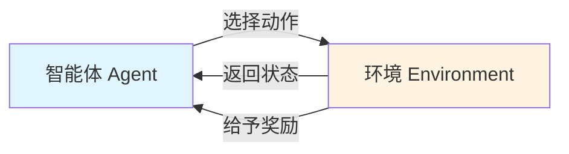
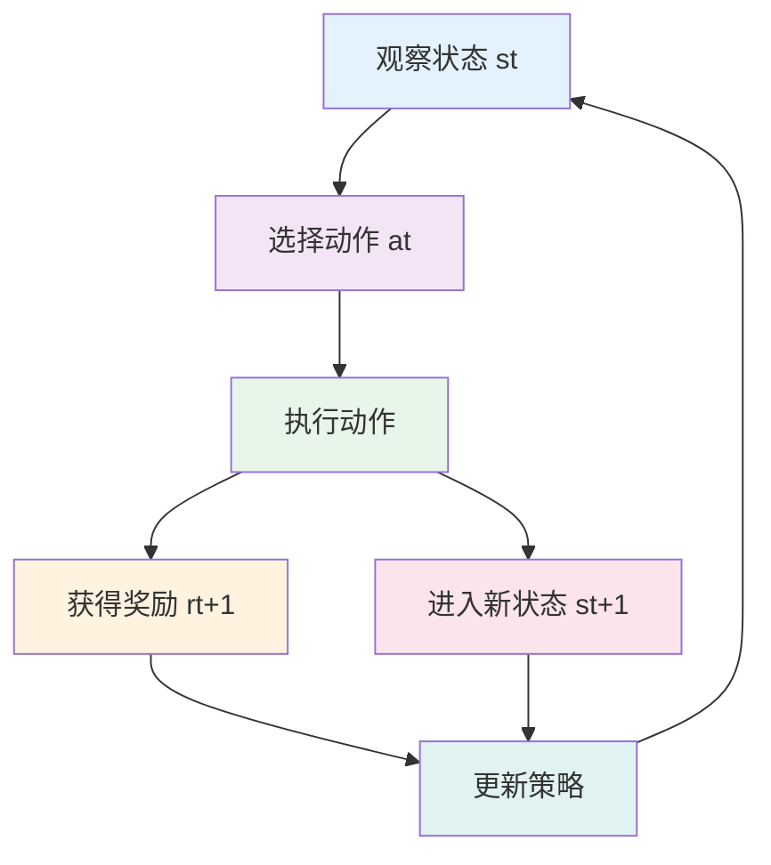
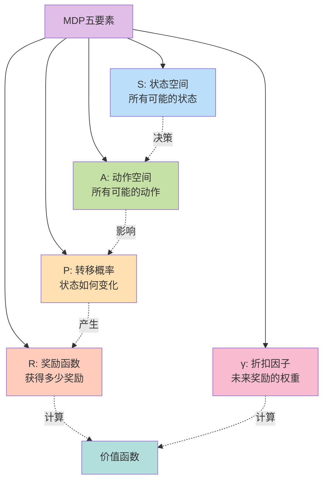
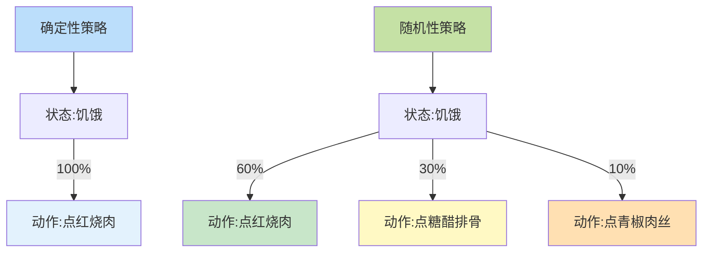
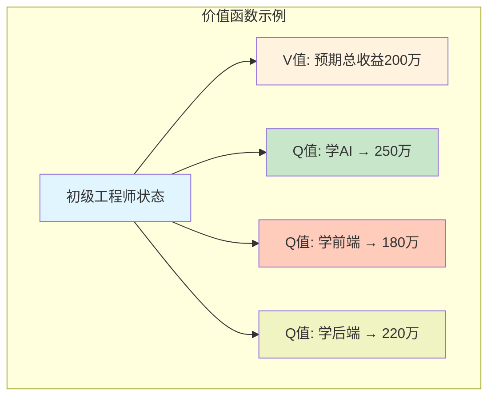
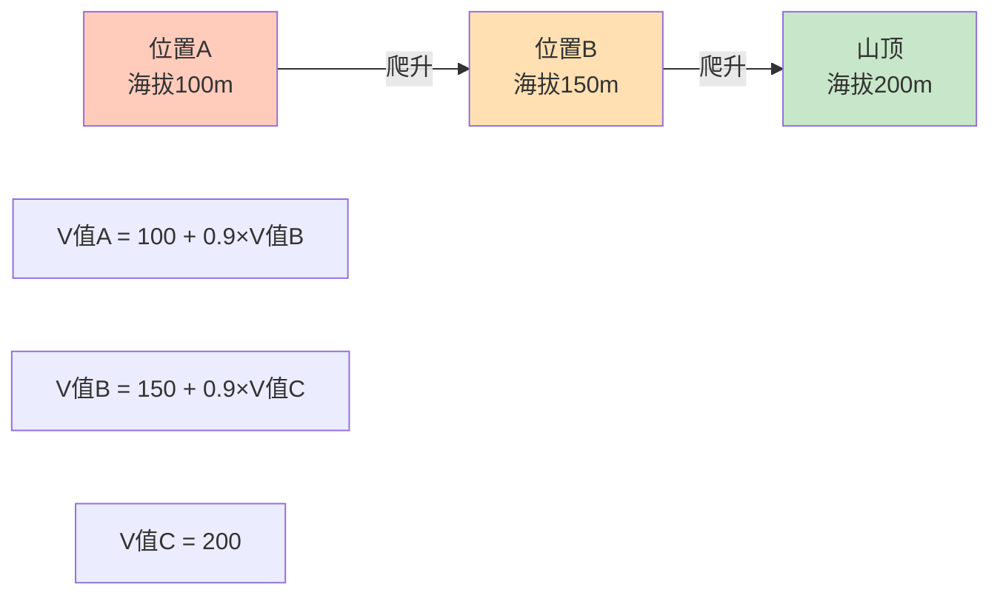
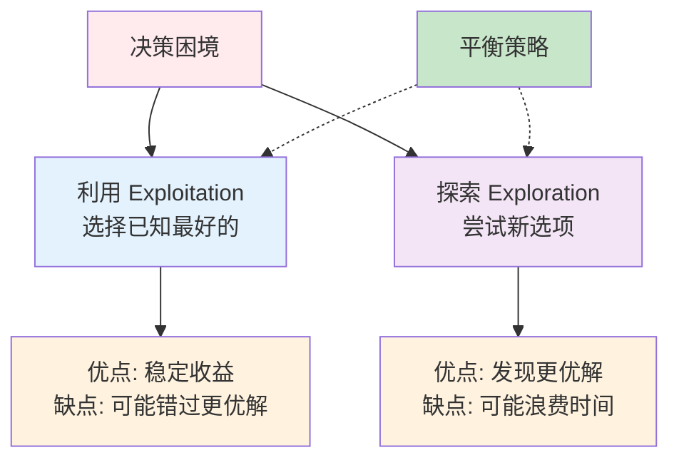
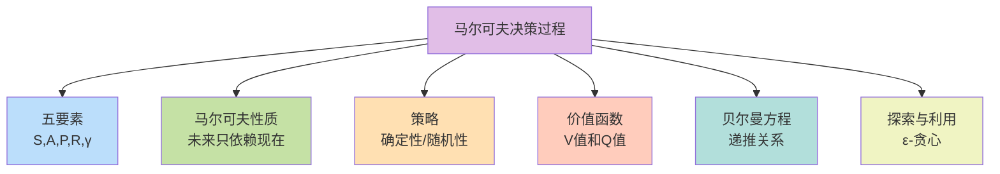

# 10.1 马尔可夫决策过程:强化学习的数学框架

> **本节学习目标**:理解强化学习的数学基础和MDP框架,掌握MDP的基本要素、贝尔曼方程和价值函数的数学定义

## 内容概览

马尔可夫决策过程(Markov Decision Process, MDP)是强化学习的数学基础,就像建筑的地基一样重要。想象一下,如果说深度学习是教计算机"看"和"听",那么强化学习就是教计算机"思考"和"决策"。MDP为我们提供了一套严谨的数学工具,让我们可以精确地描述和解决决策问题。

## 10.1.1 强化学习基本概念

### 什么是强化学习?

让我们通过一个生活中的例子来理解强化学习。想象你在学习骑自行车:

- **你(智能体)**:正在学习骑车的人
- **环境**:道路、坡度、风力等外部条件
- **状态**:你当前的速度、平衡状态、位置
- **动作**:向左转、向右转、加速、刹车
- **奖励**:保持平衡(正奖励)、摔倒(负奖励)

在这个过程中,你不断尝试不同的动作,根据结果(奖励)调整策略,最终学会骑车。这就是强化学习的核心思想!

### 强化学习的核心要素



**1. 智能体(Agent)**
- 学习和决策的主体
- 就像游戏中的玩家,需要做出各种选择

**2. 环境(Environment)**  
- 智能体交互的外部世界
- 类似游戏的关卡,会对玩家的动作做出反应

**3. 状态(State)**
- 环境的描述信息
- 比如游戏中角色的位置、血量、装备等

**4. 动作(Action)**
- 智能体可以执行的操作  
- 就像游戏中的上下左右、攻击、防御等按键

**5. 奖励(Reward)**
- 环境对智能体动作的反馈
- 类似游戏中的得分、经验值

**6. 策略(Policy)**
- 智能体选择动作的规则
- 可以理解为"游戏攻略"或"行为准则"

**7. 价值函数(Value Function)**
- 衡量状态或动作的长期价值
- 类似"这个位置有多好"的评估标准

### 交互循环

强化学习的交互过程是一个连续的循环:



## 10.1.2 马尔可夫决策过程定义

### 什么是马尔可夫性质?

马尔可夫性质有一个有趣的特点——"无记忆性"。让我们用一个生活例子来理解:

**下棋的例子**:
- 当你在下象棋时,要做出下一步决策,你只需要看当前的棋盘布局
- 不需要记住是怎么走到这个局面的
- 无论是经过10步还是100步走到当前局面,只要棋盘一样,下一步的最优走法就一样

这就是马尔可夫性质的精髓:**未来只依赖于现在,与过去无关**。

### MDP的五要素

MDP可以用一个五元组来完整描述: **M = (S, A, P, R, γ)**



让我们用**开车去目的地**的例子来理解这五个要素:

**S (状态空间)**  
- 你所在的每个路口位置、车速、油量
- 比如:"在A路口,时速60km/h,油量50%"

**A (动作空间)**
- 可以选择的行动:直行、左转、右转、加速、减速
  
**P (转移概率)**  
- 执行动作后到达新状态的可能性
- 比如:在路口左转,有90%概率顺利转弯,10%概率遇到红灯

**R (奖励函数)**
- 每个动作获得的即时反馈
- 靠近目的地:+10分,走错路:-5分,违章:-20分

**γ (折扣因子,0<γ≤1)**  
- 未来奖励的重要程度
- γ=0.9意味着:10分钟后的10分奖励,现在只值9分

### 核心代码实现

```java
/**
 * 离散马尔可夫决策过程
 * 核心数据结构,用于表示MDP问题
 */
public class DiscreteMDP {
    private int numStates;           // 状态数量
    private int numActions;          // 动作数量
    private double[][][] transition; // 转移概率 P[s][a][s']
    private double[][] reward;       // 奖励函数 R[s][a]
    private double discountFactor;   // 折扣因子 γ
    
    public DiscreteMDP(int numStates, int numActions, double discountFactor) {
        this.numStates = numStates;
        this.numActions = numActions;
        this.discountFactor = discountFactor;
        this.transition = new double[numStates][numActions][numStates];
        this.reward = new double[numStates][numActions];
    }
    
    // ... 省略getter/setter方法
}
```

## 10.1.3 策略:智能体的"行动指南"

策略(Policy)定义了智能体在每个状态下应该如何选择动作。

### 确定性策略 vs 随机性策略

让我们用**餐厅点餐**来类比:

**确定性策略** - 每次都点一样的
- 数学表达:π(s) = a  
- 生活例子:每次去这家餐厅都点红烧肉
- 优点:简单明确
- 缺点:可能错过更好的选择

**随机性策略** - 按概率选择
- 数学表达:π(a|s) = 概率值
- 生活例子:60%概率点红烧肉,30%点糖醋排骨,10%点青椒肉丝
- 优点:可以探索不同选项
- 缺点:相对复杂



### 简化的策略实现

```java
/**
 * 确定性策略 - 每个状态对应一个固定动作
 */
public class DeterministicPolicy {
    private int[] policy; // policy[s] = a
    
    public int getAction(int state) {
        return policy[state];
    }
}

/**
 * 随机性策略 - 每个状态对应动作的概率分布
 */
public class StochasticPolicy {
    private double[][] policy; // policy[s][a] = 概率
    
    public int sampleAction(int state) {
        // 按概率分布随机采样动作
        double rand = Math.random();
        double cumulative = 0;
        for (int a = 0; a < policy[state].length; a++) {
            cumulative += policy[state][a];
            if (rand <= cumulative) return a;
        }
        return 0;
    }
}
```

## 10.1.4 价值函数:评估"有多好"

价值函数用来评估状态或动作的长期价值,就像给每个选择打分。

### 生活中的价值函数

想象你在规划职业发展:

**状态价值函数 V(s)**: "在这个状态下,未来总共能获得多少收益?"
- 当前是初级工程师(状态s),预期未来总收入是多少?
- 包括当前收入、升职加薪、技能成长带来的所有未来收益

**动作价值函数 Q(s,a)**: "在这个状态下,采取某个行动,未来总共能获得多少收益?"
- 作为初级工程师(状态s),选择学习AI(动作a),未来总收益是多少?
- vs 选择学习前端开发,未来总收益是多少?



### 累积折扣奖励

为什么需要折扣因子γ?用**金钱的时间价值**来理解:

- 今天的100元 > 明年的100元(可以拿去投资)
- γ = 0.9意味着:1年后的100元 = 现在的90元
- γ越小,越重视眼前利益;γ越大,越重视长远利益

数学表达:
```
G_t = r_{t+1} + γ*r_{t+2} + γ²*r_{t+3} + ...
    = r_{t+1} + γ*G_{t+1}
```

### 价值函数计算示例

```java
/**
 * 状态价值函数计算器(简化版)
 */
public class StateValueFunction {
    private double[] values; // values[s] = V(s)
    
    /**
     * 策略评估:迭代计算状态价值
     * 核心思想:不断更新直到收敛
     */
    public void policyEvaluation(DiscreteMDP mdp, StochasticPolicy policy) {
        // 迭代更新价值函数
        for (int iter = 0; iter < maxIterations; iter++) {
            for (int s = 0; s < numStates; s++) {
                // 贝尔曼方程:V(s) = Σ π(a|s) * Σ P(s'|s,a) * [R + γ*V(s')]
                values[s] = computeBellmanUpdate(s, mdp, policy);
            }
            // 检查是否收敛
            if (converged()) break;
        }
    }
}
```

## 10.1.5 贝尔曼方程:价值函数的"递推公式"

贝尔曼方程建立了当前状态价值与未来状态价值之间的关系,就像数学中的递推公式。

### 用爬山来理解贝尔曼方程

想象你要爬到山顶(最大化总奖励):

**当前位置的价值 = 当前的高度 + 从这里到山顶还能爬升的高度**

```
V(当前位置) = 即时奖励 + γ * V(下一个位置)
```



### 贝尔曼最优方程

最优价值函数满足:
```
V*(s) = max_a [ R(s,a) + γ * Σ P(s'|s,a) * V*(s') ]
```

**白话翻译**: 最优状态价值 = 选择最好的动作,考虑即时奖励和未来价值

### 贝尔曼方程求解示例

```java
/**
 * 价值迭代算法(Value Iteration)
 * 直接求解最优价值函数
 */
public double[] solveOptimalValue(DiscreteMDP mdp) {
    double[] values = new double[numStates];
    
    // 迭代更新
    for (int iter = 0; iter < maxIterations; iter++) {
        for (int s = 0; s < numStates; s++) {
            double maxValue = Double.NEGATIVE_INFINITY;
            
            // 尝试所有动作,选择最大值
            for (int a = 0; a < numActions; a++) {
                double actionValue = 0;
                // 计算这个动作的期望价值
                for (int sNext = 0; sNext < numStates; sNext++) {
                    double prob = mdp.getTransitionProbability(s, a, sNext);
                    double reward = mdp.getReward(s, a);
                    actionValue += prob * (reward + γ * values[sNext]);
                }
                maxValue = Math.max(maxValue, actionValue);
            }
            
            values[s] = maxValue;
        }
    }
    
    return values;
}
```

## 10.1.6 探索与利用的权衡

这是强化学习中的经典难题,类似于生活中的选择困境。

### 生活中的探索与利用

**餐厅选择的困境**:
- **利用(Exploitation)**:去你最喜欢的那家餐厅(已知最好)
- **探索(Exploration)**:尝试新餐厅(可能发现更好的)

如果只利用:永远吃同一家,可能错过更好的餐厅  
如果只探索:一直尝新,无法享受最喜欢的美食



### ε-贪心策略

最常用的平衡方法:

- 以ε的概率随机探索(如10%)
- 以1-ε的概率贪心利用(如90%)  
- 随时间逐渐减小ε(探索→利用)

```java
/**
 * ε-贪心策略:平衡探索与利用
 */
public class EpsilonGreedyPolicy {
    private double epsilon; // 探索概率
    
    public int selectAction(int state, double[] qValues) {
        // ε概率随机探索
        if (Math.random() < epsilon) {
            return randomAction();
        }
        // 1-ε概率选择最优动作
        return argmax(qValues);
    }
    
    // 随时间衰减探索率
    public void decayEpsilon() {
        epsilon = Math.max(0.01, epsilon * 0.995);
    }
}
```

## 10.1.7 完整示例:网格世界

让我们通过一个4×4的网格世界来综合运用MDP的概念。

### 问题设定

```mermaid
graph TB
    subgraph 4×4网格世界
        S0[起点<br/>0,0] --> S1[1,0]
        S1 --> S2[2,0]
        S2 --> S3[3,0]
        
        S0 --> S4[0,1]
        S4 --> S5[1,1]
        S5 --> S6[2,1]
        S6 --> S7[3,1]
        
        S4 --> S8[0,2]
        S8 --> S9[1,2]
        S9 --> S10[X<br/>障碍]
        S10 --> S11[3,2]
        
        S8 --> S12[0,3]
        S12 --> S13[1,3]
        S13 --> S14[2,3]
        S14 --> S15[★<br/>目标]
    end
    
    style S0 fill:#e3f2fd
    style S15 fill:#c8e6c9
    style S10 fill:#ffcdd2
```

**规则**:
- 动作:上下左右4个方向
- 到达目标(★):+10奖励,游戏结束
- 碰到障碍(X):-10奖励
- 撞墙:-1奖励
- 每步移动:-0.1奖励(鼓励快速到达)

### 关键代码片段

```java
/**
 * 网格世界示例 - 展示MDP完整流程
 */
public class GridWorldExample {
    public static void main(String[] args) {
        // 1. 创建MDP环境
        int gridSize = 4;
        DiscreteMDP mdp = createGridWorld(gridSize);
        
        // 2. 求解最优价值函数
        BellmanSolver solver = new BellmanSolver(mdp);
        double[] optimalValues = solver.solveOptimalValue();
        
        // 3. 提取最优策略
        DeterministicPolicy optimalPolicy = 
            solver.deriveOptimalPolicy(optimalValues);
        
        // 4. 可视化结果
        visualizePolicy(optimalPolicy, gridSize);
    }
}
```

## 本节小结

通过本节学习,我们掌握了强化学习的数学基础——马尔可夫决策过程:

### 核心概念回顾



### 关键要点

1. **MDP是什么**: 描述序贯决策问题的数学框架
2. **核心思想**: 通过与环境交互,学习最优决策策略
3. **价值函数**: 评估状态/动作的长期价值,指导决策
4. **贝尔曼方程**: 建立当前与未来的递推关系,求解最优策略
5. **探索利用**: 平衡尝试新事物和利用已知最优选择

### 生活启示

MDP不仅是数学工具,更反映了生活中的决策智慧:
- 做决策时要考虑长远影响(价值函数)
- 当前选择会影响未来机会(状态转移)
- 要敢于尝新但不能忽视已验证的好方法(探索利用)

下一节,我们将学习如何用蒙特卡洛和时序差分方法来估计价值函数,以及策略梯度方法来直接优化策略。

---

**练习思考**:
1. 想一个你生活中的决策场景,尝试用MDP五要素来建模
2. 思考:为什么折扣因子γ通常设置在0.9-0.99之间?
3. 在什么情况下应该更多地探索?什么情况下应该更多地利用?
