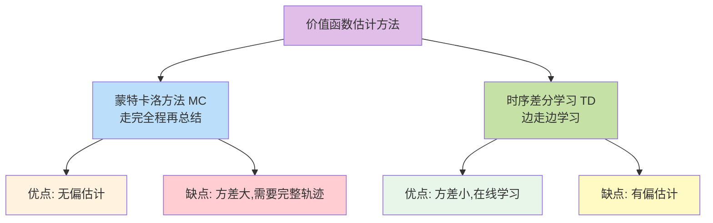
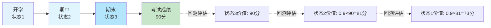
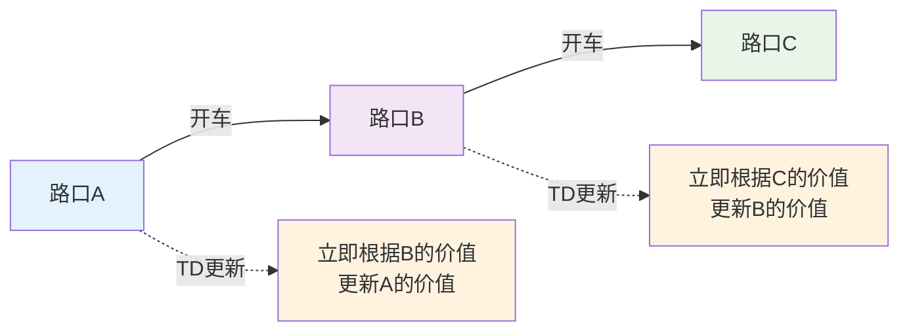
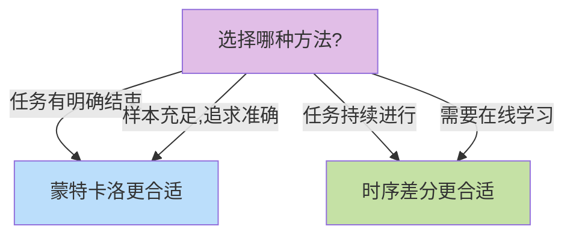
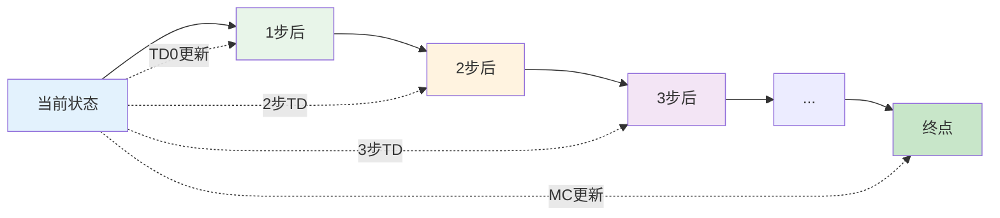
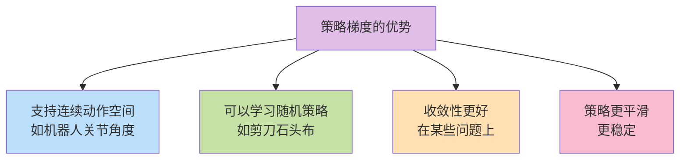
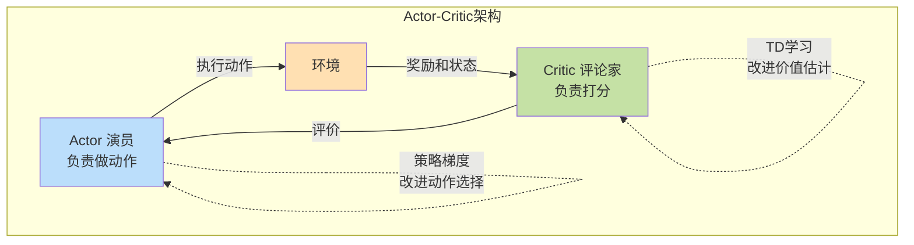
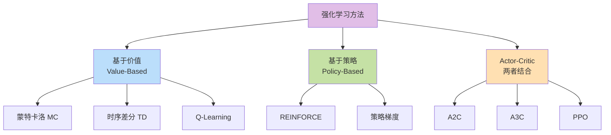
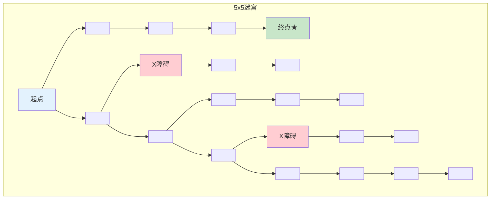
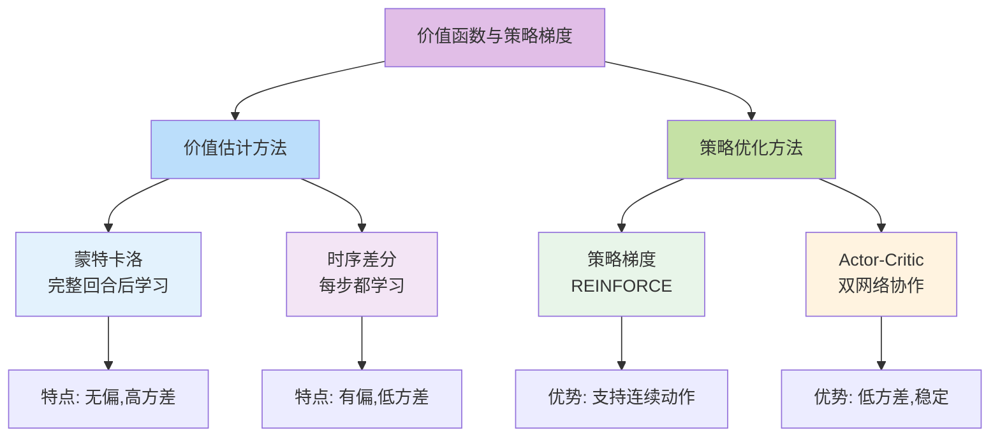

# 10.2 价值函数与策略梯度

> **本节学习目标**:掌握价值函数计算和策略优化方法,理解蒙特卡洛方法、时序差分学习和策略梯度定理

## 内容概览

在上一节,我们学习了MDP的数学框架。本节将学习如何**估计价值函数**和**优化策略**——这是强化学习的两大核心任务。我们会用生活化的例子帮助你理解这些看似复杂的算法。

## 10.2.1 价值函数估计:如何给状态"打分"?

### 为什么需要估计价值函数?

在实际问题中,我们通常不知道环境的转移概率P和奖励函数R,就像:
- 你不知道下棋时对手会如何应对
- 你不知道股票明天会涨还是跌
- 你不知道学习某项技能未来会带来多少收益

所以我们需要通过**实际体验**(与环境交互)来估计价值函数。

### 两大估计方法



## 10.2.2 蒙特卡洛方法:完整经历后再评价

### 生活类比:考试成绩

想象你在学习备考:

**蒙特卡洛的思路**:
1. 完整地学完一个学期
2. 参加期末考试,得到最终成绩
3. 用这个成绩来评估整个学期的学习状态



### 核心思想

蒙特卡洛方法的精髓:**用实际获得的总回报来估计价值**

$$V(s) ≈ 平均回报 = \frac{1}{N}\sum_{i=1}^{N}G_t^{(i)}$$

**白话翻译**: 多次从状态s开始玩游戏,把每次获得的总分求平均值

### 两种变体

**首次访问 vs 每次访问**

用旅游类比:
- **首次访问**: 一次旅行中,第一次到达某个景点时记录体验
- **每次访问**: 一次旅行中,每次到达某个景点都记录体验

### 代码实现(简化版)

```java
/**
 * 蒙特卡洛价值估计器
 */
public class MonteCarloEstimator {
    private double[] values;        // 价值估计
    private List<Double>[] returns; // 每个状态的回报记录
    
    /**
     * 从一次完整游戏中学习
     */
    public void learnFromEpisode(List<Step> episode) {
        double G = 0; // 累积回报
        
        // 从后往前计算回报
        for (int t = episode.size() - 1; t >= 0; t--) {
            Step step = episode.get(t);
            G = step.reward + gamma * G; // 递推计算
            
            // 记录这个状态的回报
            returns[step.state].add(G);
            
            // 更新价值估计(求平均)
            values[step.state] = average(returns[step.state]);
        }
    }
}
```

### 优缺点分析

✅ **优点**:
- 简单直观,容易理解
- 无偏估计,最终会收敛到真实值
- 不需要知道环境模型

❌ **缺点**:
- 必须等一局游戏结束才能学习
- 方差大,需要大量样本
- 学习速度慢

## 10.2.3 时序差分学习:边走边学

### 生活类比:驾驶学习

**蒙特卡洛**: 开完整趟车,到终点后总结这趟开得怎么样  
**时序差分**: 每开一段路就及时调整,比如看到红灯就预判要刹车



### TD(0)算法核心

**更新公式**:
$$V(S_t) ← V(S_t) + α[R_{t+1} + γV(S_{t+1}) - V(S_t)]$$

**白话翻译**:
```
新估计 = 旧估计 + 学习率 × (实际体验 - 旧估计)
                           \_____TD误差______/
```

### 直观理解TD误差

TD误差 = 实际体验 - 之前的预期

**例子**: 
- 你之前认为学习AI能加薪5000元(旧估计)
- 实际上第一年加薪2000元,未来预期还有4000元(实际体验 = 2000 + 0.9×4000 = 5600)
- TD误差 = 5600 - 5000 = 600元
- 更新估计 = 5000 + 0.1×600 = 5060元

### 代码实现(简化版)

```java
/**
 * TD(0)价值估计器
 */
public class TDEstimator {
    private double[] values;      // 价值估计
    private double alpha = 0.1;   // 学习率
    private double gamma = 0.9;   // 折扣因子
    
    /**
     * 从一步经验中学习(在线更新)
     */
    public void learnFromStep(int state, double reward, int nextState) {
        // 计算TD误差
        double tdError = reward + gamma * values[nextState] - values[state];
        
        // 更新价值估计
        values[state] += alpha * tdError;
    }
}
```

### MC vs TD 对比

| 特性 | 蒙特卡洛(MC) | 时序差分(TD) |
|------|-------------|-------------|
| 学习时机 | 回合结束后 | 每一步都可学习 |
| 方差 | 高(路径随机性大) | 低(只依赖一步) |
| 偏差 | 无偏 | 有偏(用估计值更新) |
| 收敛速度 | 慢 | 快 |
| 是否需要终止 | 是 | 否 |
| 适用场景 | 回合制游戏 | 持续任务 |



## 10.2.4 N步时序差分:折中方案

### 融合MC和TD的智慧

- **TD(0)**: 只看下一步 → 偏差大,方差小
- **MC**: 看到最后 → 偏差小,方差大  
- **N步TD**: 看未来N步 → 平衡偏差和方差



**N步回报**:
$$G_t^{(n)} = R_{t+1} + γR_{t+2} + ... + γ^{n-1}R_{t+n} + γ^nV(S_{t+n})$$

## 10.2.5 策略梯度:直接优化策略

前面我们学的都是**先估计价值,再根据价值选动作**。策略梯度方法则是**直接学习选动作的策略**。

### 生活类比:学习打篮球

**基于价值的方法**(Q-Learning等):
1. 评估每个位置投篮的成功率(价值)
2. 选择成功率最高的位置投篮

**策略梯度方法**:
1. 直接学习"在这个位置应该以多大力度、什么角度投篮"
2. 通过实践不断调整投篮策略

### 为什么需要策略梯度?



### REINFORCE算法

最经典的策略梯度算法,思想很直观:

**核心思路**:
- 好的动作(获得高回报) → 增加选择概率
- 坏的动作(获得低回报) → 降低选择概率

**更新公式**:
$$θ ← θ + α × ∇_θ log π_θ(a|s) × G_t$$

**白话翻译**:
```
策略参数调整 = 学习率 × 动作梯度 × 实际回报

实际回报高 → 参数往增加这个动作概率的方向调
实际回报低 → 参数往减少这个动作概率的方向调
```

### 形象理解

想象你在训练一只狗:
- 狗做对了(高回报) → 给零食,强化这个行为
- 狗做错了(低回报) → 不给零食,减弱这个行为

策略梯度就是通过调整策略参数,让好行为出现得更频繁!

### 代码实现(简化版)

```java
/**
 * REINFORCE策略梯度算法
 */
public class REINFORCE {
    private NeuralNetwork policyNetwork; // 策略网络
    private double alpha = 0.01;         // 学习率
    
    /**
     * 从一次游戏中学习
     */
    public void learnFromEpisode(List<Step> episode) {
        // 计算每步的累积回报
        double[] returns = computeReturns(episode);
        
        // 对每一步进行策略更新
        for (int t = 0; t < episode.size(); t++) {
            Step step = episode.get(t);
            double G = returns[t];
            
            // 计算策略梯度
            double[] gradient = policyNetwork.computeGradient(
                step.state, step.action);
            
            // 更新策略参数(梯度上升)
            policyNetwork.updateParameters(alpha * G * gradient);
        }
    }
    
    /**
     * 计算累积回报
     */
    private double[] computeReturns(List<Step> episode) {
        double[] returns = new double[episode.size()];
        double G = 0;
        
        // 从后往前计算
        for (int t = episode.size() - 1; t >= 0; t--) {
            G = episode.get(t).reward + gamma * G;
            returns[t] = G;
        }
        
        return returns;
    }
}
```

## 10.2.6 Actor-Critic方法:两全其美

结合价值函数和策略梯度的优点!

### 双角色协作



**生活类比:演员和导演**

- **Actor(演员)**: 负责表演,决定怎么演
- **Critic(导演)**: 负责评价,告诉演员表演得好不好

演员根据导演的评价调整表演,导演根据最终效果调整评价标准。

### 优势

✅ **结合了两种方法的优点**:
- 比纯策略梯度方差更小(用价值函数做基准)
- 比纯价值方法更灵活(可处理连续动作)
- 可以在线学习,不需要等回合结束

### 简化实现

```java
/**
 * Actor-Critic算法
 */
public class ActorCritic {
    private NeuralNetwork actor;  // 策略网络(演员)
    private NeuralNetwork critic; // 价值网络(评论家)
    
    /**
     * 从一步经验中学习
     */
    public void learnFromStep(int state, int action, 
                              double reward, int nextState) {
        // Critic评估TD误差
        double tdError = reward + gamma * critic.getValue(nextState) 
                       - critic.getValue(state);
        
        // Critic学习:更新价值估计
        critic.update(state, tdError);
        
        // Actor学习:根据TD误差调整策略
        actor.update(state, action, tdError);
    }
}
```

## 10.2.7 方法对比与选择

### 全景对比



### 选择建议

| 场景 | 推荐方法 | 原因 |
|------|---------|------|
| 离散动作空间,简单环境 | Q-Learning/TD | 效率高,易实现 |
| 连续动作空间 | 策略梯度/AC | 支持连续动作 |
| 需要随机策略 | 策略梯度 | 天然支持随机性 |
| 样本效率要求高 | TD方法 | 可在线学习 |
| 稳定性要求高 | Actor-Critic | 方差小,更稳定 |
| 学习复杂任务 | PPO/A3C | 先进,效果好 |

## 10.2.8 实战示例:简单游戏

### 场景:走迷宫



### 三种方法对比实现

```java
/**
 * 迷宫游戏 - 对比三种方法
 */
public class MazeGame {
    
    // 方法1: 蒙特卡洛
    public void solveMazeMC() {
        MonteCarloEstimator mc = new MonteCarloEstimator();
        
        for (int episode = 0; episode < 1000; episode++) {
            List<Step> path = playOneGame(); // 玩一局
            mc.learnFromEpisode(path);       // 学习
        }
    }
    
    // 方法2: TD学习
    public void solveMazeTD() {
        TDEstimator td = new TDEstimator();
        
        for (int episode = 0; episode < 1000; episode++) {
            int state = START;
            while (!isTerminal(state)) {
                int action = chooseAction(state);
                int nextState = step(state, action);
                double reward = getReward(nextState);
                
                td.learnFromStep(state, reward, nextState); // 每步学习
                state = nextState;
            }
        }
    }
    
    // 方法3: Actor-Critic
    public void solveMazeAC() {
        ActorCritic ac = new ActorCritic();
        
        for (int episode = 0; episode < 1000; episode++) {
            int state = START;
            while (!isTerminal(state)) {
                int action = ac.selectAction(state);
                int nextState = step(state, action);
                double reward = getReward(nextState);
                
                ac.learnFromStep(state, action, reward, nextState);
                state = nextState;
            }
        }
    }
}
```

## 本节小结

### 知识图谱



### 核心要点

1. **蒙特卡洛**: 用完整经历的实际回报估计价值,简单但方差大
2. **时序差分**: 用下一步的估计值更新当前值,快速但有偏差
3. **策略梯度**: 直接优化策略,适合连续动作和随机策略
4. **Actor-Critic**: 结合价值和策略的优点,性能更稳定

### 实践建议

💡 **入门推荐**: 先实现TD(0),理解在线学习的精髓  
💡 **进阶学习**: 掌握Actor-Critic,这是现代强化学习的基础  
💡 **实战应用**: 根据具体问题选择合适方法,没有银弹

### 生活启示

这些算法反映了学习的不同模式:
- **MC**: 考完试总结经验 → 长期规划
- **TD**: 做完作业就反思 → 及时反馈  
- **策略梯度**: 直接练习技能 → 动作导向
- **AC**: 边练边请教导师 → 双重反馈

下一节,我们将学习Q-Learning算法,这是强化学习中最经典的算法之一!

---

**练习思考**:
1. 你学习新技能时,更像MC(学完再总结)还是TD(边学边调整)?
2. 尝试用伪代码实现一个简单的TD(0)算法
3. 思考:为什么游戏AI通常用TD方法而不是MC?
