# 10.3 Q-Learning算法实现

> **本节学习目标**: 实现经典的Q-Learning算法并深入理解其原理,掌握Q表更新、ε-贪心策略和实际应用技巧

## 内容概览

Q-Learning是强化学习领域的"明星算法",它让计算机像人类一样通过试错来学习最优策略。本节我们将用生活化的例子帮你理解Q-Learning的精髓,并实现一个可以实际运行的Q-Learning系统。

## 10.3.1 Q-Learning核心思想

### 什么是Q-Learning?

想象你在学习打游戏:
- **Q值** = 在某个关卡(状态)选择某个操作(动作)的"预期得分"
- **Q-Learning** = 通过不断尝试,学习每个"状态-动作"组合的得分

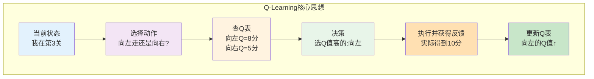

### 生活类比: 餐厅选择

假设你在学习选餐厅:

**Q表记录经验**:
```
状态(肚子饿程度) | 动作(餐厅) | Q值(预期满意度)
----------------------------------------------
非常饿          | 快餐店    | 7.5分
非常饿          | 高档餐厅  | 6.0分 (太慢)
一般饿          | 快餐店    | 5.0分
一般饿          | 高档餐厅  | 9.0分
```

**学习过程**:
1. 非常饿时去了高档餐厅,等太久很难受 → Q值从6.0降到5.5
2. 一般饿时去高档餐厅,体验很棒 → Q值从9.0升到9.5
3. 逐渐学会"非常饿选快餐,悠闲时选高档餐厅"的策略

### Q-Learning的核心公式

$$Q(s,a) ← Q(s,a) + α[r + γ \max_{a'} Q(s',a') - Q(s,a)]$$

**白话翻译**:
```
新Q值 = 旧Q值 + 学习率 × [实际体验 - 旧估计]
                        └─────TD误差────┘

实际体验 = 即时奖励 + 折扣 × 下个状态最好的Q值
```

### 形象理解更新公式

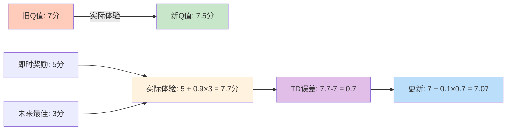

### Q-Learning的三大特点

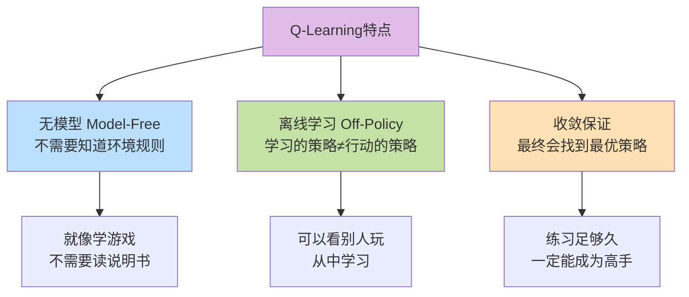

## 10.3.2 Q表: 记录经验的"小本本"

### Q表是什么?

Q表就是一个二维表格,记录了每个"状态-动作"组合的价值评分。

**形象比喻**: 
- 学生的**错题本** → 记录哪些题容易错
- Q-Learning的**Q表** → 记录哪些动作价值高

### Q表结构

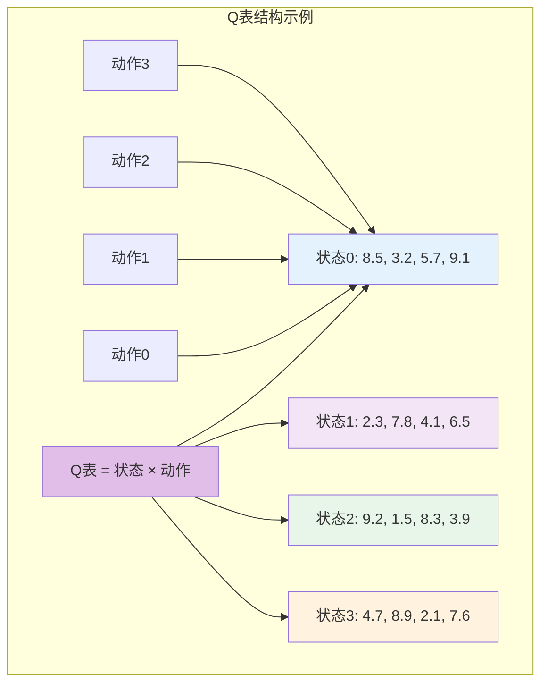

### 简化实现

```java
/**
 * Q表 - 记录每个状态-动作对的价值
 */
public class QTable {
    private double[][] qValues; // Q[状态][动作] = 价值
    
    public QTable(int numStates, int numActions) {
        this.qValues = new double[numStates][numActions];
        // 初始化为小随机值,打破对称性
        initializeRandomly();
    }
    
    /**
     * Q-Learning核心更新
     */
    public void update(int state, int action, double reward, 
                      int nextState, double alpha, double gamma) {
        // 当前Q值
        double currentQ = qValues[state][action];
        
        // 下一状态的最大Q值
        double maxNextQ = getMaxQValue(nextState);
        
        // Q-Learning更新公式
        double tdError = reward + gamma * maxNextQ - currentQ;
        qValues[state][action] = currentQ + alpha * tdError;
    }
    
    /**
     * 获取状态下最大的Q值
     */
    public double getMaxQValue(int state) {
        return Arrays.stream(qValues[state]).max().orElse(0.0);
    }
    
    /**
     * 获取最优动作(Q值最大的动作)
     */
    public int getBestAction(int state) {
        int bestAction = 0;
        for (int a = 1; a < qValues[state].length; a++) {
            if (qValues[state][a] > qValues[state][bestAction]) {
                bestAction = a;
            }
        }
        return bestAction;
    }
}
```

## 10.3.3 ε-贪心策略: 探索与利用的平衡

### 为什么需要ε-贪心?

如果只选Q值最高的动作(纯贪心):
- ❌ 可能陷入局部最优
- ❌ 错过更好的选择
- ❌ 像只吃一种菜的美食家

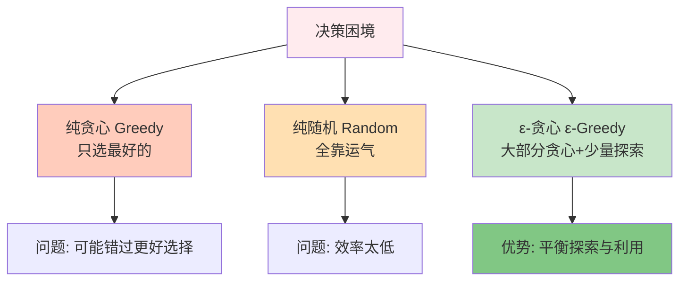

### ε-贪心策略原理

**策略描述**:
- **ε概率**(如10%): 随机选择动作 → 探索新可能
- **1-ε概率**(如90%): 选择Q值最大的动作 → 利用已知最优

**生活例子**: 选电影
- 90%时间: 看评分最高的电影(利用)
- 10%时间: 随机尝试新类型(探索)

### ε衰减策略

随着学习进展,逐渐减少探索:

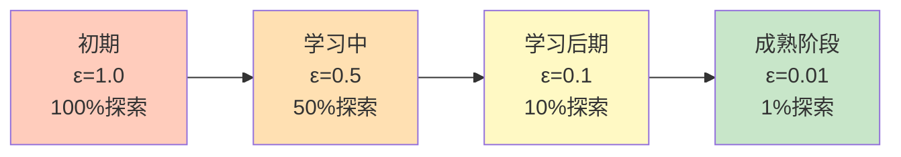

**类比**: 
- 新手司机: 多尝试不同路线(高探索率)
- 老司机: 固定走最熟悉的路(低探索率)

### 代码实现

```java
/**
 * ε-贪心策略
 */
public class EpsilonGreedy {
    private double epsilon;       // 探索概率
    private double epsilonDecay;  // 衰减率
    private double minEpsilon;    // 最小探索率
    
    public EpsilonGreedy(double epsilon) {
        this.epsilon = epsilon;
        this.epsilonDecay = 0.995;
        this.minEpsilon = 0.01;
    }
    
    /**
     * 选择动作
     */
    public int selectAction(QTable qTable, int state, int numActions) {
        // ε概率随机探索
        if (Math.random() < epsilon) {
            return (int)(Math.random() * numActions);
        }
        // 1-ε概率贪心利用
        return qTable.getBestAction(state);
    }
    
    /**
     * 衰减ε
     */
    public void decay() {
        epsilon = Math.max(minEpsilon, epsilon * epsilonDecay);
    }
}
```

## 10.3.4 完整Q-Learning算法

### 算法流程图

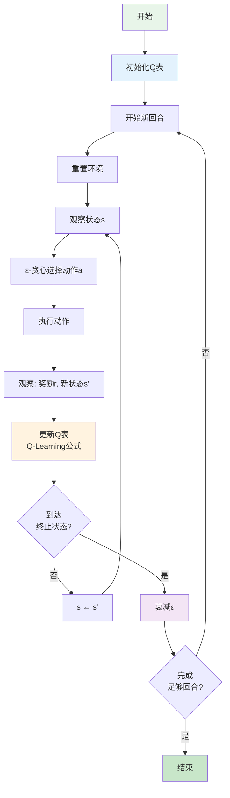

### 伪代码

```
算法: Q-Learning

初始化:
  - Q表所有值设为0(或小随机值)
  - 设置学习率α, 折扣因子γ, 探索率ε

重复 (每个回合):
  初始化状态 s
  
  重复 (每个时间步):
    用ε-贪心从Q表选择动作 a
    执行动作 a, 观察奖励 r 和新状态 s'
    
    更新Q表:
      Q(s,a) ← Q(s,a) + α[r + γ max_a' Q(s',a') - Q(s,a)]
    
    s ← s'
  
  直到 s 是终止状态
  
  衰减 ε
  
直到 收敛或达到最大回合数
```

### 完整实现示例

```java
/**
 * Q-Learning完整实现
 */
public class QLearning {
    private QTable qTable;
    private EpsilonGreedy policy;
    private double alpha = 0.1;    // 学习率
    private double gamma = 0.99;   // 折扣因子
    
    /**
     * 训练Q-Learning智能体
     */
    public void train(Environment env, int numEpisodes) {
        for (int episode = 0; episode < numEpisodes; episode++) {
            int state = env.reset();
            double totalReward = 0;
            
            while (!env.isTerminal()) {
                // 1. 选择动作
                int action = policy.selectAction(qTable, state, env.getNumActions());
                
                // 2. 执行动作
                int nextState = env.step(action);
                double reward = env.getReward();
                
                // 3. 更新Q表
                qTable.update(state, action, reward, nextState, alpha, gamma);
                
                // 4. 转移到新状态
                state = nextState;
                totalReward += reward;
            }
            
            // 5. 衰减探索率
            policy.decay();
            
            // 打印训练进度
            if (episode % 100 == 0) {
                System.out.printf("Episode %d, Reward: %.2f, ε: %.3f%n", 
                    episode, totalReward, policy.getEpsilon());
            }
        }
    }
}
```

## 10.3.5 参数调优艺术

### 关键参数的影响

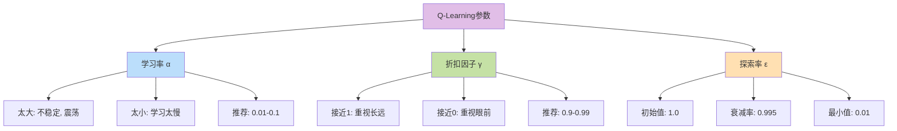

### 参数选择建议

| 参数 | 推荐范围 | 作用 | 调优提示 |
|------|---------|------|----------|
| 学习率α | 0.01-0.1 | 控制更新幅度 | 问题复杂→调小 |
| 折扣因子γ | 0.9-0.99 | 未来权重 | 长期任务→接近1 |
| 初始ε | 0.5-1.0 | 初始探索 | 环境复杂→调大 |
| ε衰减率 | 0.99-0.999 | 探索减少速度 | 学习慢→调大 |
| 最小ε | 0.01-0.05 | 保持探索 | 保持好奇心 |

## 10.3.6 实战案例: 走迷宫

### 问题描述

5×5网格迷宫,从起点走到终点:

```mermaid
graph TB
    subgraph 迷宫布局
        S[S起点<br/>0,0] --> R1[ ] --> R2[ ] --> R3[ ] --> G[G目标<br/>4,4]
        S --> W1[█墙] --> R4[ ] --> R5[ ] --> R6[ ]
        W1 --> R7[ ] --> W2[█墙] --> R8[ ] --> R9[ ]
        R7 --> R10[ ] --> R11[ ] --> W3[█墙] --> R12[ ]
        R10 --> R13[ ] --> R14[ ] --> R15[ ] --> G
    end
    
    style S fill:#e3f2fd
    style G fill:#c8e6c9
    style W1 fill:#424242
    style W2 fill:#424242
    style W3 fill:#424242
```

**奖励设计**:
- 到达目标: +100
- 撞墙: -10
- 每步: -1 (鼓励快速到达)

### 学习过程可视化

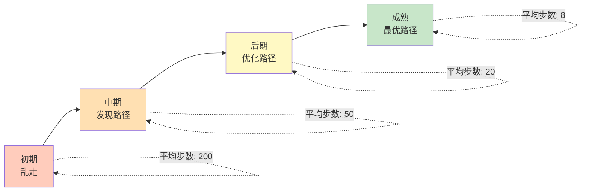

### 训练代码

```java
/**
 * 迷宫Q-Learning示例
 */
public class MazeQLearning {
    public static void main(String[] args) {
        // 创建迷宫环境
        MazeEnvironment env = new MazeEnvironment(5, 5);
        env.setStart(0, 0);
        env.setGoal(4, 4);
        env.addWall(1, 0);
        env.addWall(2, 2);
        env.addWall(3, 3);
        
        // 创建Q-Learning智能体
        int numStates = 25;  // 5×5网格
        int numActions = 4;  // 上下左右
        QTable qTable = new QTable(numStates, numActions);
        EpsilonGreedy policy = new EpsilonGreedy(1.0);
        QLearning agent = new QLearning(qTable, policy);
        
        // 训练
        System.out.println("开始训练...");
        agent.train(env, 1000);
        
        // 测试最优策略
        System.out.println("\n测试学到的策略:");
        testPolicy(env, qTable);
    }
    
    /**
     * 测试学到的策略
     */
    private static void testPolicy(MazeEnvironment env, QTable qTable) {
        int state = env.reset();
        int steps = 0;
        
        while (!env.isTerminal() && steps < 100) {
            int action = qTable.getBestAction(state);
            state = env.step(action);
            env.render();  // 可视化当前位置
            steps++;
        }
        
        System.out.printf("到达目标用了 %d 步%n", steps);
    }
}
```

## 10.3.7 Q-Learning的优势与局限

### 优势 ✅

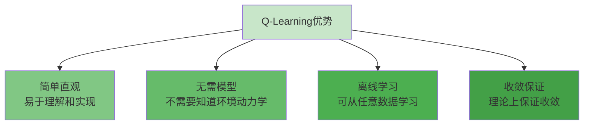

### 局限 ⚠️

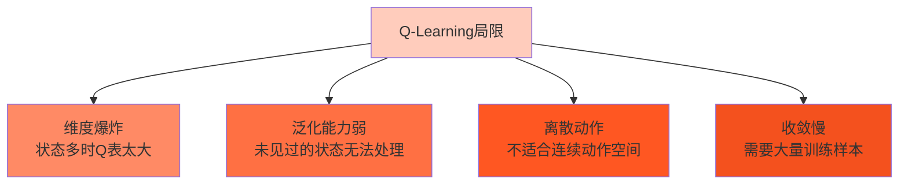

### 解决方案

| 局限 | 解决方案 |
|------|---------|
| 维度爆炸 | → 使用深度Q网络(DQN) |
| 泛化能力弱 | → 函数近似,神经网络 |
| 离散动作 | → 策略梯度方法 |
| 收敛慢 | → 经验回放,目标网络 |

**下一节预告**: 我们将学习DQN,用深度神经网络来近似Q函数,突破Q表的维度限制!

## 本节小结

### 知识结构

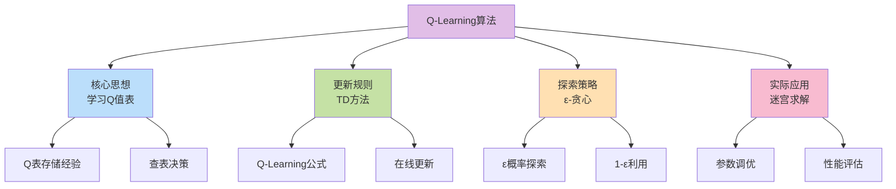

### 核心要点

1. **Q-Learning本质**: 通过试错学习"状态-动作"的价值评分
2. **更新机制**: 用TD方法在线更新Q值,无需等回合结束
3. **探索利用**: ε-贪心策略平衡探索新可能和利用已知最优
4. **参数调优**: 学习率、折扣因子、探索率需要仔细调整
5. **应用场景**: 适合状态空间不太大的离散决策问题

### 实践建议

💡 **先从简单问题入手**: 如网格世界、井字棋等  
💡 **可视化学习过程**: 观察Q值变化和策略改进  
💡 **调试技巧**: 打印Q表,检查是否合理收敛  
💡 **性能监控**: 记录每回合奖励,绘制学习曲线

### 生活启示

Q-Learning教会我们:
- 经验积累很重要(Q表)
- 要敢于尝试新事物(探索)
- 但也要善用已知最优方案(利用)
- 从错误中学习,不断调整策略

下一节,我们将学习DQN算法,看看如何用深度学习突破Q-Learning的限制!

---

**练习任务**:
1. 实现一个3×3的井字棋Q-Learning智能体
2. 调整不同的ε衰减策略,观察对学习速度的影响
3. 思考: 为什么Q-Learning被称为"off-policy"算法?
