# 10.4 深度Q网络(DQN): 深度学习遇见强化学习

> **本节学习目标**: 掌握DQN的核心技术,理解如何用神经网络突破Q表的限制,学会经验回放和目标网络的精髓

## 内容概览

如果说Q-Learning是用"小本本"记录经验,那么DQN就是用"大脑"来学习!DQN是强化学习领域的里程碑,它让AI学会了玩Atari游戏,甚至超越人类。本节我们将揭秘DQN的三大法宝。

## 10.4.1 从Q表到神经网络: 一次革命性飞跃

### Q-Learning的困境

想象你在学习围棋:
- **Q表方法**: 为每个棋盘局面记录一个分数
- **问题**: 围棋有10^170种局面,宇宙原子才10^80个!

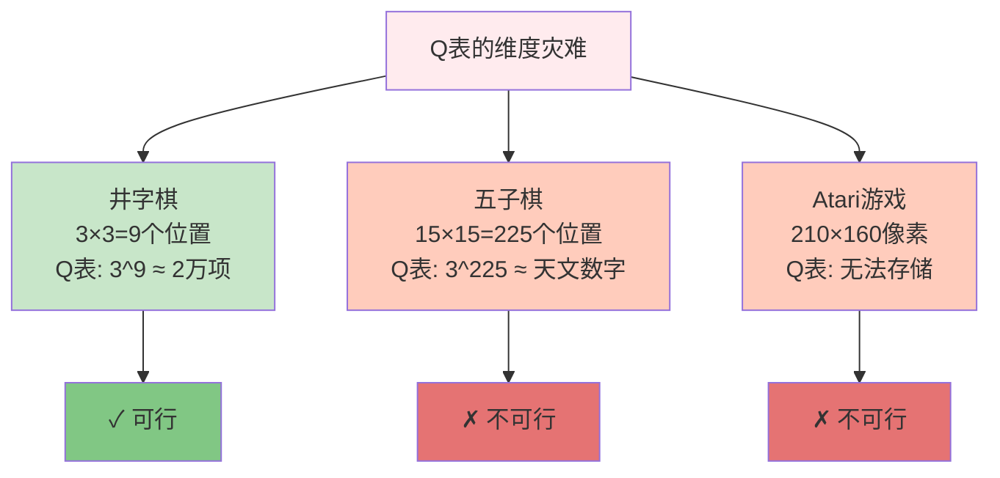

### DQN的突破性思想

**核心创意**: 用神经网络来"近似"Q函数

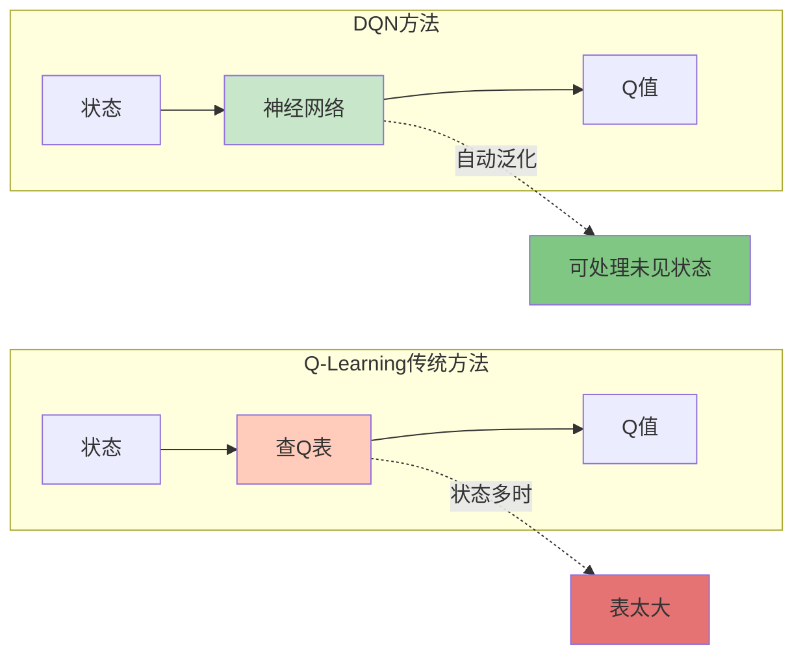

### 生活类比: 查字典 vs 理解语言

**Q表**: 像查字典
- 见过的词: 能查到意思 ✓
- 没见过的词: 查不到 ✗

**DQN**: 像理解语言
- 见过的句子: 能理解 ✓
- 没见过的句子: 根据语法推测 ✓

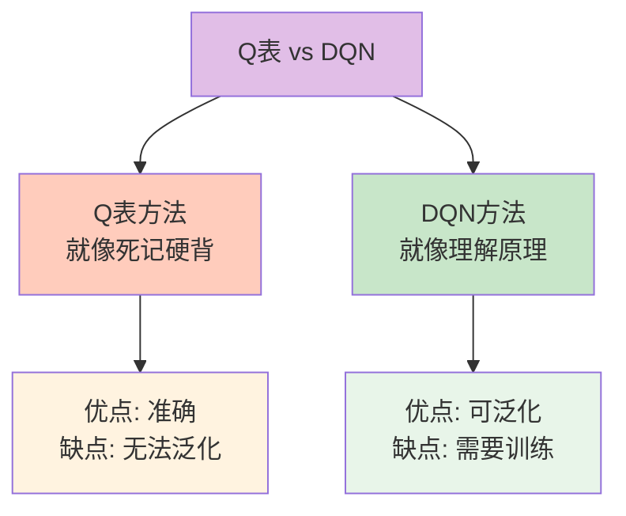

## 10.4.2 DQN三大法宝

DQN成功的秘诀在于三个关键技术创新:

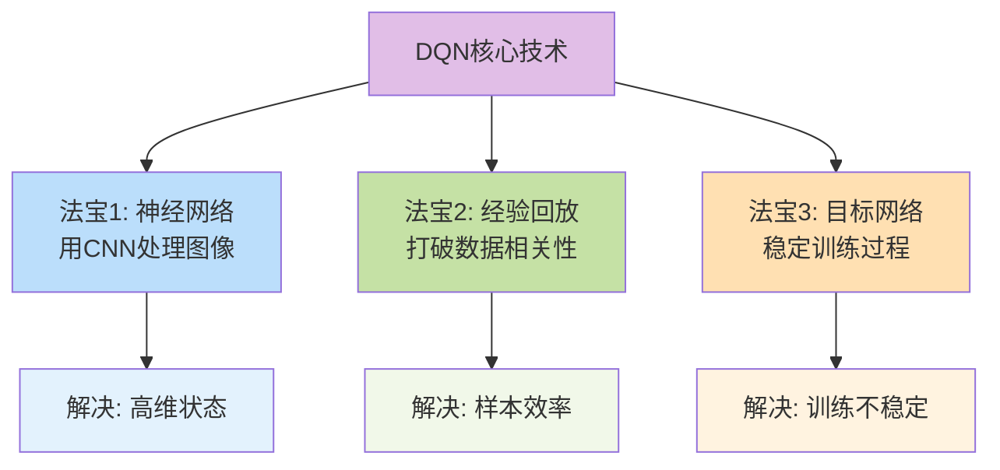

## 10.4.3 法宝1: 神经网络架构

### 为什么用卷积神经网络(CNN)?

玩Atari游戏,输入是游戏画面(图像),CNN最擅长处理图像!

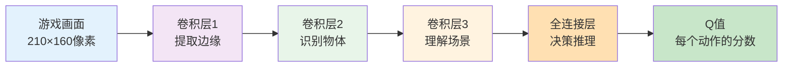

### 网络结构示意

**输入**: 游戏屏幕 → **输出**: 每个动作的Q值

```
输入层: [84×84×4] 图像  (4帧叠加,感知运动)
   ↓
卷积层1: 32个8×8滤波器 → [20×20×32]
   ↓  
卷积层2: 64个4×4滤波器 → [9×9×64]
   ↓
卷积层3: 64个3×3滤波器 → [7×7×64]
   ↓
全连接层: 512个神经元
   ↓
输出层: 动作数量个神经元 (如Atari游戏有18个动作)
```

### 简化代码实现

```java
/**
 * DQN神经网络(简化版)
 */
public class DQNNetwork {
    private NeuralNetwork network;
    
    /**
     * 构建网络架构
     */
    public DQNNetwork(int stateSize, int actionSize) {
        network = new NeuralNetwork();
        
        // 输入层
        network.addLayer(new InputLayer(stateSize));
        
        // 隐藏层
        network.addLayer(new DenseLayer(64, "relu"));
        network.addLayer(new DenseLayer(64, "relu"));
        
        // 输出层(每个动作一个Q值)
        network.addLayer(new DenseLayer(actionSize, "linear"));
    }
    
    /**
     * 前向传播: 状态 → Q值
     */
    public double[] predict(double[] state) {
        return network.forward(state);
    }
    
    /**
     * 获取最优动作
     */
    public int getBestAction(double[] state) {
        double[] qValues = predict(state);
        return argmax(qValues);
    }
}
```

## 10.4.4 法宝2: 经验回放(Experience Replay)

### 为什么需要经验回放?

**问题**: 直接用当前经验训练会有两个致命缺陷:

1. **数据相关性强**: 连续的游戏帧非常相似
2. **样本利用率低**: 每个经验只用一次就扔了

### 生活类比: 学习方法对比

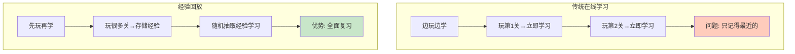

**形象比喻**:
- **在线学习**: 像边看电影边做笔记,只记得最后的情节
- **经验回放**: 像录下电影,反复观看学习,每次随机选片段

### 经验回放机制

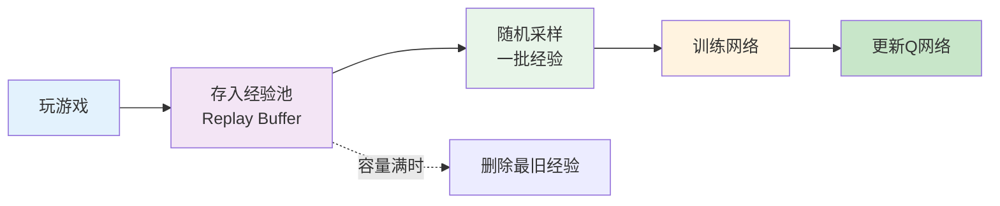

### 经验池数据结构

每条经验包含5元组: **(s, a, r, s', done)**
- s: 当前状态
- a: 执行的动作
- r: 获得的奖励
- s': 下一状态
- done: 是否结束

### 代码实现

```java
/**
 * 经验回放缓冲区
 */
public class ReplayBuffer {
    private List<Experience> buffer;
    private int capacity;
    
    public ReplayBuffer(int capacity) {
        this.capacity = capacity;
        this.buffer = new ArrayList<>();
    }
    
    /**
     * 存储经验
     */
    public void store(double[] state, int action, double reward, 
                     double[] nextState, boolean done) {
        Experience exp = new Experience(state, action, reward, nextState, done);
        
        // 如果满了,删除最旧的
        if (buffer.size() >= capacity) {
            buffer.remove(0);
        }
        
        buffer.add(exp);
    }
    
    /**
     * 随机采样一批经验
     */
    public List<Experience> sample(int batchSize) {
        List<Experience> batch = new ArrayList<>();
        Random rand = new Random();
        
        for (int i = 0; i < batchSize; i++) {
            int idx = rand.nextInt(buffer.size());
            batch.add(buffer.get(idx));
        }
        
        return batch;
    }
}

/**
 * 经验数据结构
 */
class Experience {
    double[] state;
    int action;
    double reward;
    double[] nextState;
    boolean done;
    
    // 构造函数和getter方法...
}
```

### 经验回放的优势

✅ **打破相关性**: 随机采样让数据更独立  
✅ **提高样本效率**: 每个经验可以重复使用  
✅ **稳定训练**: 减少方差,训练更平滑  
✅ **离线学习**: 可以从别人的经验中学习

## 10.4.5 法宝3: 目标网络(Target Network)

### 为什么需要目标网络?

**问题**: 用同一个网络计算当前Q值和目标Q值,会导致"追逐移动目标"

### 生活类比: 考试目标的稳定性

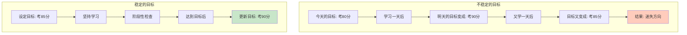

### 目标网络机制

维护**两个网络**:
- **主网络**(Q-Network): 经常更新,用于选择动作
- **目标网络**(Target Network): 延迟更新,用于计算目标Q值

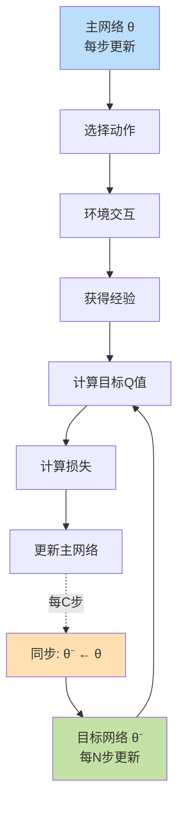

### 更新公式对比

**不用目标网络**:
```
目标 = r + γ max Q(s', a'; θ)
         └─ 用同一个网络θ,目标会一直变
```

**使用目标网络**:
```
目标 = r + γ max Q(s', a'; θ⁻)
         └─ 用固定的θ⁻,目标更稳定
```

### 代码实现

```java
/**
 * DQN with目标网络
 */
public class DQN {
    private DQNNetwork mainNetwork;    // 主网络
    private DQNNetwork targetNetwork;  // 目标网络
    private int updateCounter = 0;
    private int targetUpdateFreq = 100; // 每100步同步一次
    
    /**
     * 训练网络
     */
    public void train(List<Experience> batch) {
        for (Experience exp : batch) {
            // 1. 用主网络预测当前Q值
            double[] currentQ = mainNetwork.predict(exp.state);
            
            // 2. 用目标网络计算目标Q值
            double targetQ;
            if (exp.done) {
                targetQ = exp.reward;
            } else {
                double[] nextQ = targetNetwork.predict(exp.nextState);
                targetQ = exp.reward + gamma * max(nextQ);
            }
            
            // 3. 更新Q值
            currentQ[exp.action] = targetQ;
            
            // 4. 训练主网络
            mainNetwork.fit(exp.state, currentQ);
        }
        
        // 5. 定期同步目标网络
        updateCounter++;
        if (updateCounter % targetUpdateFreq == 0) {
            syncTargetNetwork();
        }
    }
    
    /**
     * 同步目标网络
     */
    private void syncTargetNetwork() {
        targetNetwork.copyWeightsFrom(mainNetwork);
        System.out.println("目标网络已同步");
    }
}
```

## 10.4.6 完整DQN算法流程

### 算法全景图

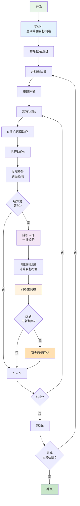

### 伪代码

```
算法: DQN

初始化:
  - 初始化主网络Q(s,a;θ)
  - 初始化目标网络Q(s,a;θ⁻) = Q(s,a;θ)
  - 初始化经验池D,容量N
  - 设置参数: α(学习率), γ(折扣), ε(探索率), C(目标网络更新频率)

重复 (每个回合):
  初始化状态 s
  
  重复 (每个时间步):
    // 1. 选择动作
    用ε-贪心从Q(s,a;θ)选择动作a
    
    // 2. 执行动作
    执行a, 观察r和s'
    
    // 3. 存储经验
    将(s,a,r,s',done)存入D
    
    // 4. 训练网络
    if |D| >= batch_size:
      从D随机采样batch
      
      for 每条经验(s,a,r,s',done):
        if done:
          y = r
        else:
          y = r + γ max_a' Q(s',a';θ⁻)  // 用目标网络
        
        用梯度下降最小化 (y - Q(s,a;θ))²
    
    // 5. 更新目标网络
    每C步: θ⁻ ← θ
    
    s ← s'
  
  直到回合结束
  
  衰减ε
  
直到收敛
```

## 10.4.7 DQN训练技巧

### 超参数配置建议

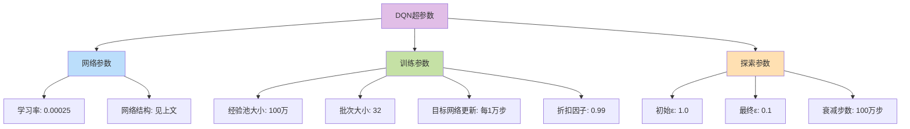

### 训练稳定性技巧

| 技巧 | 作用 | 推荐值 |
|------|------|--------|
| 梯度裁剪 | 防止梯度爆炸 | [-1, 1] |
| Reward裁剪 | 归一化奖励 | [-1, 1] |
| 帧叠加 | 感知运动信息 | 4帧 |
| 跳帧 | 提高效率 | 每4帧1次 |
| 预训练 | 加速收敛 | 5万步 |

### 性能监控指标

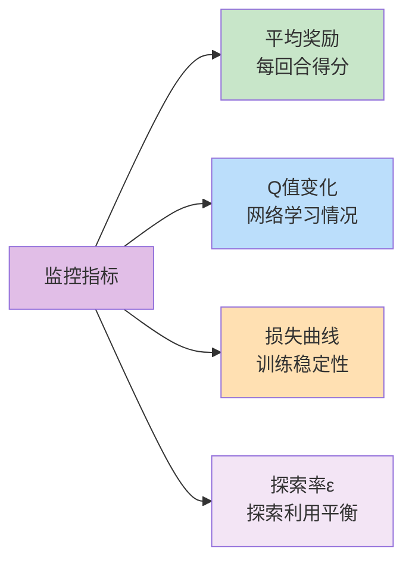

## 10.4.8 DQN成功案例: Atari游戏

### 突破性成果

2015年,DeepMind的DQN在49款Atari游戏中:
- 29款游戏超越人类水平
- Breakout(打砖块)游戏得分是人类的10倍!

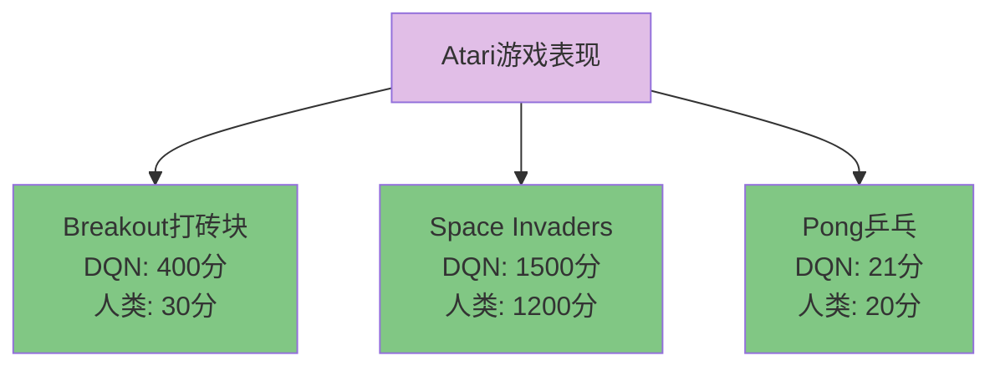

### 学习过程可视化

以Breakout游戏为例:

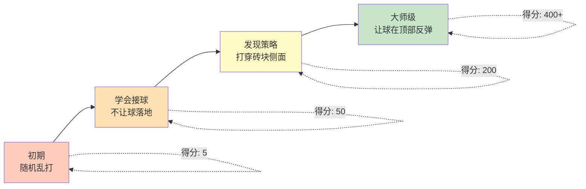

## 10.4.9 DQN优势与局限

### 优势 ✅

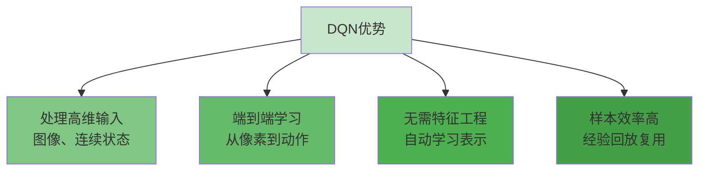

### 局限 ⚠️

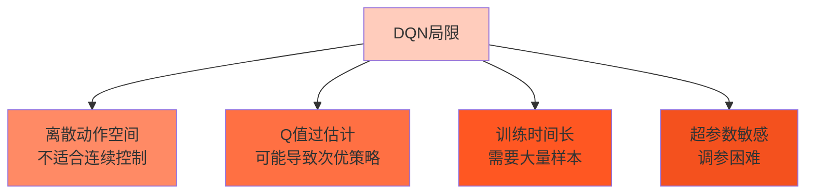

### 改进方向

下一节我们将学习DQN的改进版本:
- **Double DQN**: 解决Q值过估计
- **Dueling DQN**: 分离状态价值和优势函数
- **Prioritized Replay**: 优先回放重要经验

## 本节小结

### 知识结构图

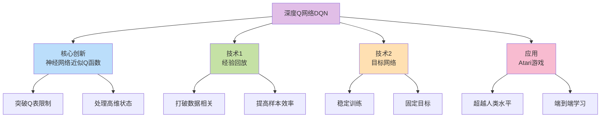

### 核心要点

1. **神经网络**: 用深度学习近似Q函数,突破维度限制
2. **经验回放**: 随机采样历史经验,打破数据相关性
3. **目标网络**: 延迟更新目标,稳定训练过程
4. **应用价值**: 在Atari游戏中达到或超越人类水平
5. **里程碑意义**: 开启深度强化学习时代

### DQN vs Q-Learning对比

| 特性 | Q-Learning | DQN |
|------|-----------|-----|
| 状态表示 | Q表 | 神经网络 |
| 适用场景 | 低维离散状态 | 高维连续状态 |
| 泛化能力 | 弱 | 强 |
| 样本效率 | 一般 | 高(经验回放) |
| 训练稳定性 | 好 | 需要技巧 |
| 实现复杂度 | 简单 | 较复杂 |

### 实践建议

💡 **从简单环境开始**: 如CartPole,先验证DQN能跑通  
💡 **监控学习曲线**: 观察奖励、Q值、损失的变化趋势  
💡 **调试经验池**: 确保存储和采样逻辑正确  
💡 **耐心等待**: DQN训练可能需要数小时甚至数天

### 生活启示

DQN告诉我们:
- **大脑胜过笔记本**: 理解原理比死记硬背重要
- **温故知新**: 反复学习过去的经验(经验回放)
- **稳扎稳打**: 不要频繁改变目标(目标网络)
- **循序渐进**: 从探索到利用的逐步转变(ε衰减)

下一节,我们将学习DQN的各种改进算法,看看研究者们如何让DQN变得更强!

---

**练习任务**:
1. 用伪代码实现一个简化的DQN训练循环
2. 思考: 为什么经验回放能提高样本效率?
3. 尝试调整目标网络更新频率,观察对训练的影响
