# 10.5 DQN变体和改进: 让算法更强大

> **本节学习目标**: 掌握DQN的主要改进版本,理解Double DQN、Dueling DQN、优先经验回放等先进技术的原理和应用

## 内容概览

DQN虽然强大,但研究者们发现了它的一些问题并提出了改进方案。本节我们将学习DQN的"升级版本",就像手机从iPhone 1升级到iPhone 15,每一代都有新特性!

## 10.5.1 DQN的问题与改进路线

### DQN存在的主要问题

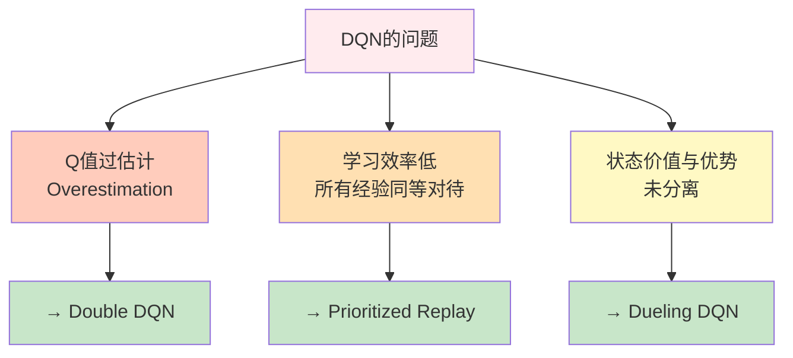

### 改进技术演进图

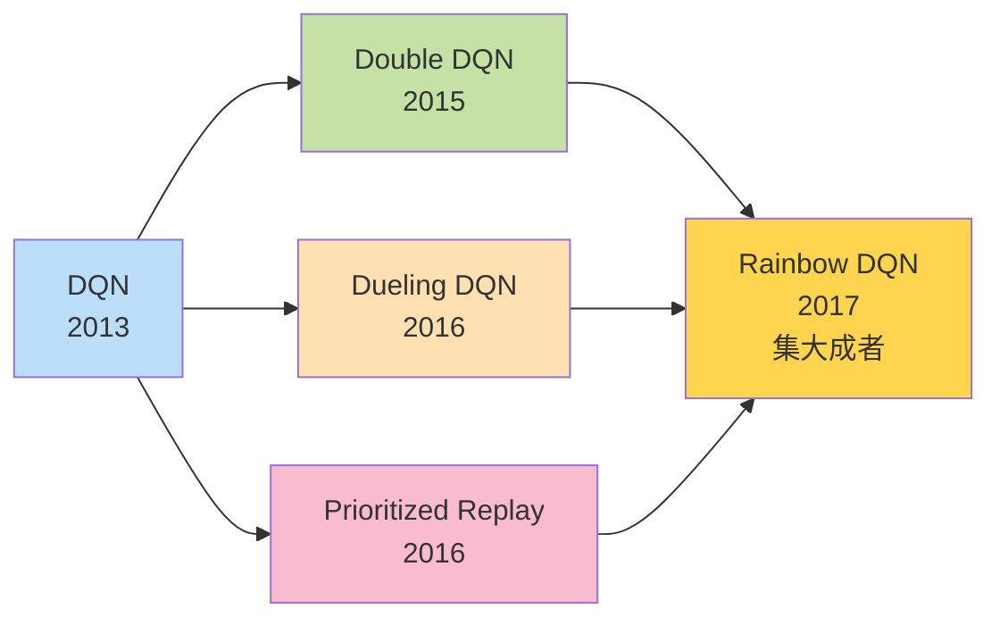

## 10.5.2 Double DQN: 解决Q值过估计

### 什么是Q值过估计?

**生活类比**: 盲目乐观的投资者

想象你在选股票投资:
- **DQN的做法**: "我觉得A股票最好,而且我估计它能涨到100元!" (自己选择+自己评估)
- **问题**: 倾向于高估自己看好的股票

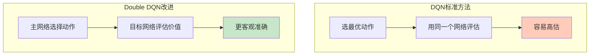

### 核心思想: 选择与评估分离

**关键改变**: 用主网络选动作,用目标网络评估价值

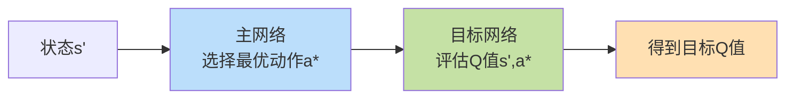

### 公式对比

**标准DQN**:
```
目标 = r + γ max_a' Q(s', a'; θ⁻)
         └─ 选择和评估都用θ⁻
```

**Double DQN**:
```
a* = argmax_a' Q(s', a'; θ)  ← 主网络选择
目标 = r + γ Q(s', a*; θ⁻)    ← 目标网络评估
```

**白话翻译**:
- DQN: 自己选择并夸自己
- Double DQN: 自己选择,让别人评价

### 代码实现

```java
/**
 * Double DQN实现
 */
public class DoubleDQN extends DQN {
    
    /**
     * 计算目标Q值(Double DQN方式)
     */
    @Override
    protected double computeTargetQ(Experience exp) {
        if (exp.done) {
            return exp.reward;
        }
        
        // 1. 主网络选择最优动作
        double[] mainQ = mainNetwork.predict(exp.nextState);
        int bestAction = argmax(mainQ);
        
        // 2. 目标网络评估该动作的价值
        double[] targetQ = targetNetwork.predict(exp.nextState);
        double nextValue = targetQ[bestAction];
        
        return exp.reward + gamma * nextValue;
    }
}
```

### 效果对比

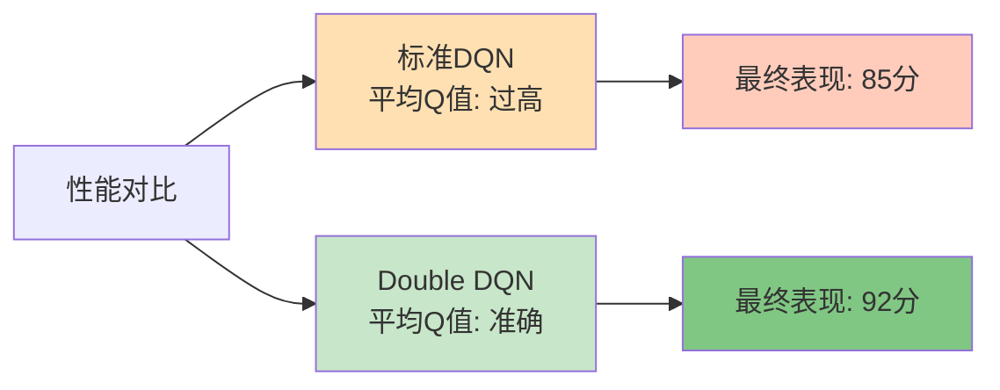

## 10.5.3 Dueling DQN: 分离状态价值和优势

### 核心洞察: 不是所有动作都重要

**生活例子**: 开车的决策

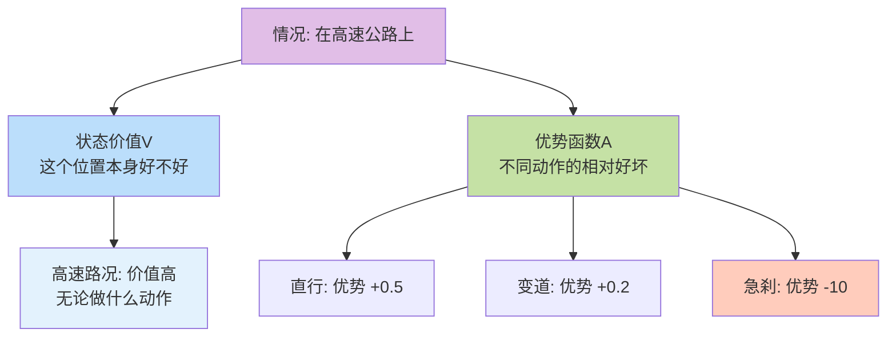

**关键思想**: 
- **V(s)**: 这个状态本身有多好
- **A(s,a)**: 在这个状态下,某个动作比平均好多少

### Q值的分解

```
Q(s,a) = V(s) + A(s,a)
```

**形象理解**:
```
动作总分 = 状态基础分 + 动作额外分
```

### 网络架构对比

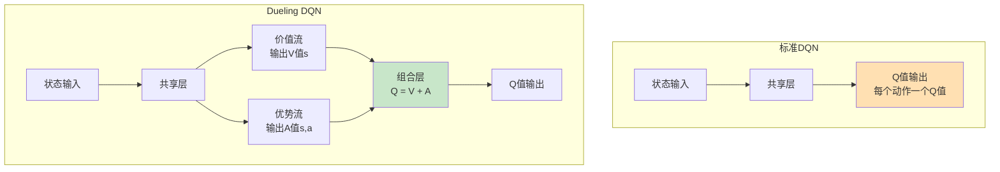

### 实际网络结构

```
输入层: [84×84×4]
   ↓
卷积层 (共享特征提取)
   ↓
  / \
 /   \
V流  A流
│    │
│    └→ 全连接 → [动作数]
└────→ 全连接 → [1]
       \      /
        \    /
    组合: Q = V + (A - mean(A))
           ↓
        Q值输出
```

**为什么要减去mean(A)?** 
- 保证可识别性: V和A的分解是唯一的
- **类比**: 考试成绩 = 班级平均分 + 个人与平均的差距

### 代码实现

```java
/**
 * Dueling DQN网络
 */
public class DuelingNetwork {
    private ConvLayers sharedLayers;  // 共享卷积层
    private DenseLayer valueStream;   // 价值流
    private DenseLayer advantageStream; // 优势流
    
    /**
     * 前向传播
     */
    public double[] forward(double[] state) {
        // 1. 共享特征提取
        double[] features = sharedLayers.forward(state);
        
        // 2. 计算状态价值V(s)
        double value = valueStream.forward(features)[0];
        
        // 3. 计算优势函数A(s,a)
        double[] advantages = advantageStream.forward(features);
        
        // 4. 组合得到Q值
        double meanAdvantage = mean(advantages);
        double[] qValues = new double[advantages.length];
        
        for (int a = 0; a < advantages.length; a++) {
            qValues[a] = value + (advantages[a] - meanAdvantage);
        }
        
        return qValues;
    }
}
```

### 优势体现

✅ **更好的状态价值估计**: 即使动作选择不佳,V(s)也能学好  
✅ **更快的学习速度**: 分离学习,互不干扰  
✅ **更鲁棒**: 在动作价值相近时表现更好

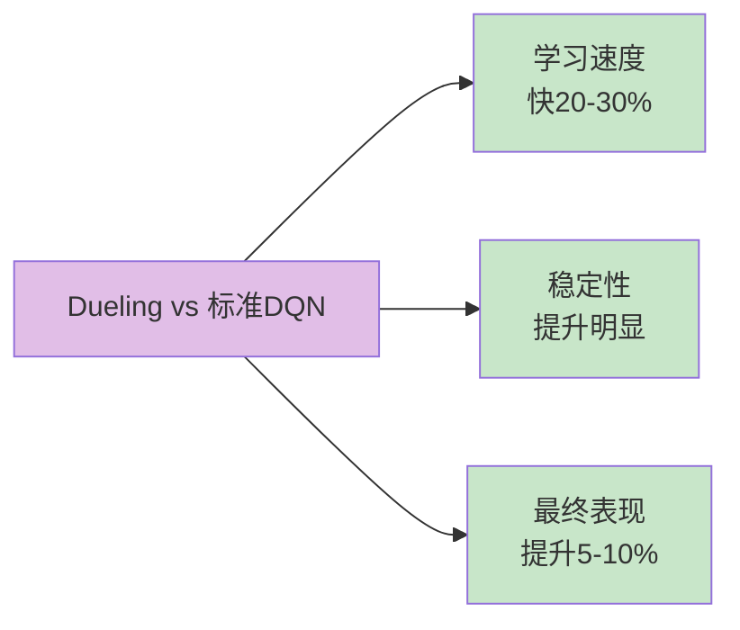

## 10.5.4 优先经验回放(Prioritized Experience Replay)

### 标准经验回放的问题

**生活类比**: 错题本的使用

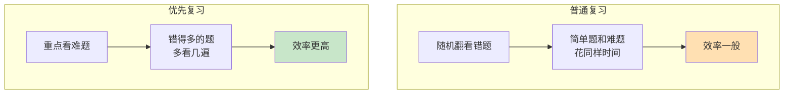

### 核心思想: 重要的经验多学几次

不是所有经验都同等重要!
- **TD误差大**: 说明这个经验"意外",值得多学
- **TD误差小**: 说明已经学会了,可以少看

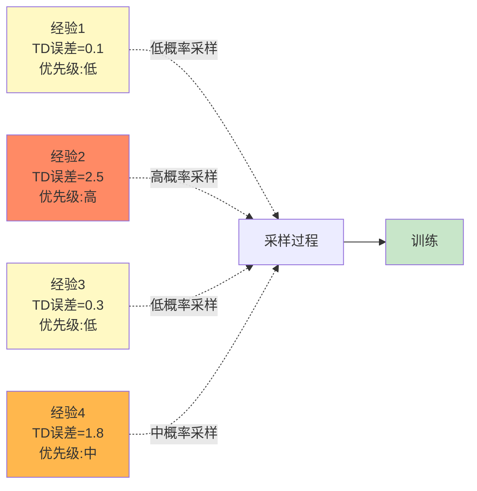

### 优先级计算

**方法1: 基于TD误差**
```
优先级 = |TD误差| + ε
       = |r + γ max Q(s',a') - Q(s,a)| + ε
```
ε是小常数,防止某些经验永远不被采样

**方法2: 基于TD误差的α次方**
```
优先级 = (|TD误差| + ε)^α
```
α控制优先级的强度(通常0.6-0.7)

### 采样概率

```
采样概率 P(i) = (优先级_i)^β / Σ(优先级_j)^β
```

β控制优先级的使用程度:
- β=0: 均匀采样(退化为标准经验回放)
- β=1: 完全按优先级采样

### 代码实现(简化版)

```java
/**
 * 优先经验回放缓冲区
 */
public class PrioritizedReplayBuffer {
    private List<Experience> buffer;
    private double[] priorities;  // 优先级
    private double alpha = 0.6;   // 优先级指数
    private double beta = 0.4;    // 重要性采样指数
    
    /**
     * 存储经验(带初始优先级)
     */
    public void store(Experience exp, double tdError) {
        buffer.add(exp);
        
        // 计算优先级
        double priority = Math.pow(Math.abs(tdError) + 1e-5, alpha);
        priorities[buffer.size() - 1] = priority;
    }
    
    /**
     * 按优先级采样
     */
    public List<Experience> sample(int batchSize) {
        // 1. 计算采样概率
        double[] probs = computeSamplingProbs();
        
        // 2. 按概率采样
        List<Experience> batch = new ArrayList<>();
        for (int i = 0; i < batchSize; i++) {
            int idx = sampleIndex(probs);
            batch.add(buffer.get(idx));
        }
        
        return batch;
    }
    
    /**
     * 更新经验的优先级
     */
    public void updatePriority(int idx, double newTdError) {
        priorities[idx] = Math.pow(Math.abs(newTdError) + 1e-5, alpha);
    }
    
    /**
     * 计算采样概率
     */
    private double[] computeSamplingProbs() {
        double sum = 0;
        for (double p : priorities) {
            sum += Math.pow(p, beta);
        }
        
        double[] probs = new double[priorities.length];
        for (int i = 0; i < priorities.length; i++) {
            probs[i] = Math.pow(priorities[i], beta) / sum;
        }
        
        return probs;
    }
}
```

### 重要性采样校正

因为改变了采样分布,需要校正偏差:

```
权重 w_i = (1 / (N × P(i)))^β
```

训练时用这个权重调整梯度

### 效果提升

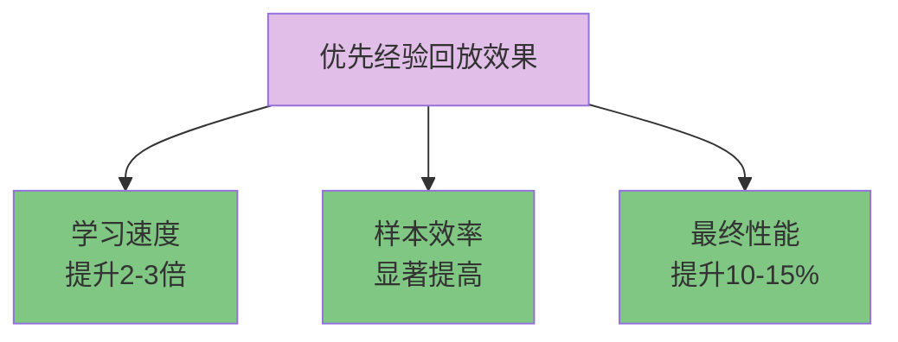

## 10.5.5 其他重要改进

### N步学习(Multi-step Learning)

**思想**: 看未来N步,而不只是1步

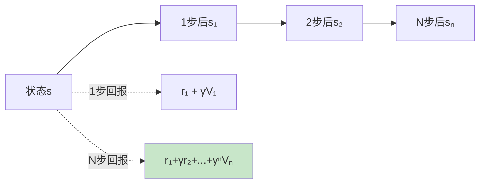

**优势**: 平衡偏差和方差,加速学习

### Noisy Networks

**思想**: 在网络参数中加入噪声,替代ε-贪心探索

```java
// 噪声权重
W = μ + σ ⊙ ε
```

**优势**: 
- 状态相关的探索
- 更智能的探索策略

### 分布式DQN(Categorical DQN)

**思想**: 不学习Q值的期望,而是学习Q值的分布

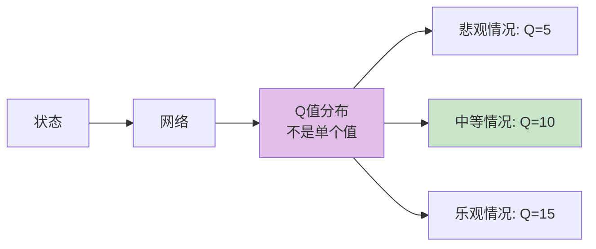

**优势**: 更丰富的价值表示,更鲁棒

## 10.5.6 Rainbow DQN: 集大成者

### 组合多种改进

Rainbow将6种改进技术结合:

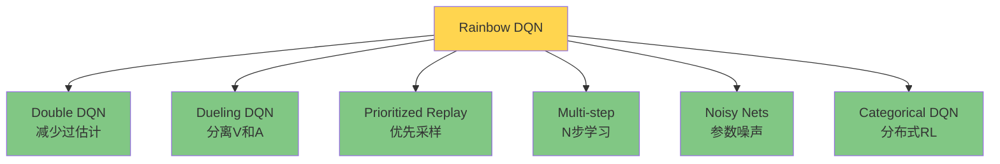

### 性能对比

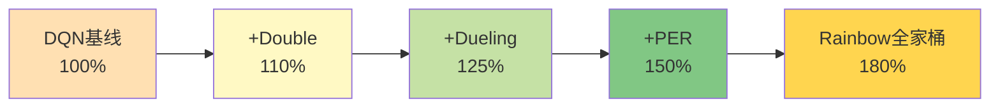

### 实现建议

```java
/**
 * Rainbow DQN (概念性实现)
 */
public class RainbowDQN {
    private DuelingNetwork network;        // Dueling架构
    private PrioritizedReplayBuffer buffer; // 优先经验回放
    private int nStep = 3;                 // 3步学习
    
    /**
     * 训练一批数据
     */
    public void train() {
        // 1. 优先采样
        List<Experience> batch = buffer.sample(batchSize);
        
        for (Experience exp : batch) {
            // 2. 计算N步回报
            double nStepReturn = computeNStepReturn(exp);
            
            // 3. Double DQN目标
            int bestAction = network.getBestAction(exp.nextState);
            double targetQ = targetNetwork.getQValue(exp.nextState, bestAction);
            
            // 4. 更新网络
            double tdError = nStepReturn + gamma * targetQ - currentQ;
            network.update(tdError);
            
            // 5. 更新优先级
            buffer.updatePriority(exp.idx, tdError);
        }
    }
}
```

## 10.5.7 各改进技术对比

### 性能提升对比表

| 技术 | 训练速度 | 最终性能 | 稳定性 | 实现难度 |
|------|---------|---------|--------|----------|
| Double DQN | ↑10% | ↑5-10% | ↑↑ | ⭐ |
| Dueling DQN | ↑20% | ↑8-12% | ↑ | ⭐⭐ |
| Prioritized Replay | ↑100% | ↑10-15% | ↑↑ | ⭐⭐⭐ |
| Multi-step | ↑30% | ↑5-8% | ↑ | ⭐⭐ |
| Rainbow (全部) | ↑150% | ↑50-80% | ↑↑↑ | ⭐⭐⭐⭐ |

### 应用场景建议

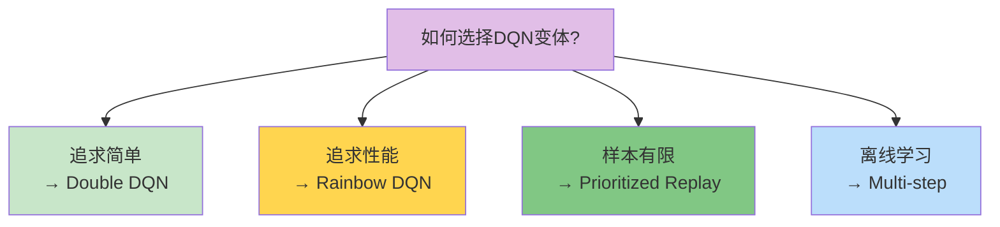

## 本节小结

### 改进技术图谱

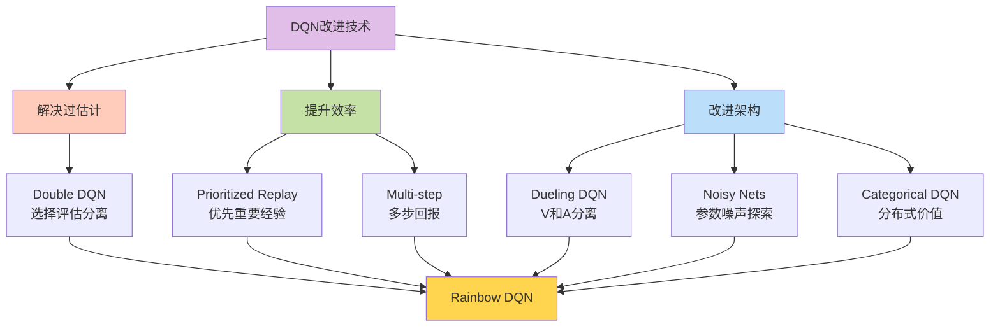

### 核心要点

1. **Double DQN**: 用双网络解决Q值过估计,简单有效
2. **Dueling DQN**: 分离状态价值和优势函数,学习更高效
3. **优先经验回放**: 重要经验多学习,样本效率大幅提升
4. **Rainbow DQN**: 组合多种技术,达到最佳性能
5. **选择策略**: 根据需求权衡性能和复杂度

### 实践建议

💡 **循序渐进**: 先实现Double DQN,再逐步加入其他技术  
💡 **重点优化**: Prioritized Replay提升最明显,优先考虑  
💡 **权衡复杂度**: Rainbow很强但复杂,简单任务不必要  
💡 **调试技巧**: 每加一个改进都要验证效果

### 生活启示

DQN的改进历程告诉我们:
- **专注核心问题**: Double DQN针对性解决过估计
- **效率至上**: 优先经验回放提高学习效率
- **分而治之**: Dueling DQN分离关注点
- **集成创新**: Rainbow组合优势

下一节,我们将通过一个完整的CartPole项目,综合运用这些技术!

---

**练习任务**:
1. 用伪代码实现Double DQN的核心逻辑
2. 思考: 为什么Dueling DQN要减去优势函数的均值?
3. 设计一个实验,对比标准DQN和优先经验回放的效果
