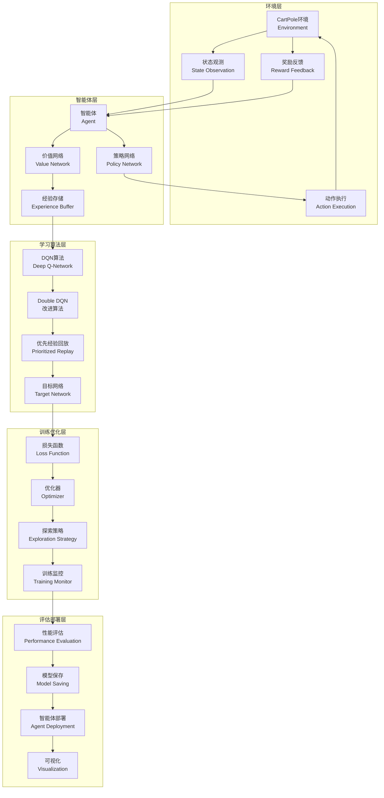

# 10.6 综合项目：构建CartPole游戏智能体

> **本节学习目标**：通过完整项目实践巩固所学知识，设计完整的强化学习系统架构，实现DQN训练和测试流程，优化智能体性能，部署和评估智能体系统

## 内容概览

在本章的最后一节，我们将通过一个综合项目来整合前面学习的所有强化学习技术。我们将构建一个完整的CartPole游戏智能体系统，从系统架构设计到模型训练，再到部署和测试，全面实践强化学习项目开发流程。这个项目将帮助我们巩固Q-Learning、DQN及其变体等核心技术，并掌握实际项目开发的完整流程。

## 10.6.1 系统架构设计

一个完整的强化学习系统需要考虑多个组件的协调工作，包括环境交互、模型训练、评估和部署等。

### 系统架构图



### 核心组件设计

```java
/**
 * CartPole智能体系统核心组件接口
 */
public interface CartPoleAgentComponent {
    /**
     * 组件初始化
     */
    void initialize();
    
    /**
     * 组件配置
     */
    void configure(ComponentConfig config);
    
    /**
     * 组件状态检查
     */
    boolean isReady();
}

/**
 * 组件配置类
 */
public class ComponentConfig {
    private Map<String, Object> parameters;
    
    public ComponentConfig() {
        this.parameters = new HashMap<>();
    }
    
    public void setParameter(String key, Object value) {
        parameters.put(key, value);
    }
    
    public Object getParameter(String key) {
        return parameters.get(key);
    }
    
    public Map<String, Object> getAllParameters() {
        return new HashMap<>(parameters);
    }
}

/**
 * 系统配置管理器
 */
public class CartPoleSystemConfiguration {
    private static CartPoleSystemConfiguration instance;
    private Map<String, Object> config;
    
    private CartPoleSystemConfiguration() {
        this.config = new HashMap<>();
        loadDefaultConfig();
    }
    
    public static synchronized CartPoleSystemConfiguration getInstance() {
        if (instance == null) {
            instance = new CartPoleSystemConfiguration();
        }
        return instance;
    }
    
    /**
     * 加载默认配置
     */
    private void loadDefaultConfig() {
        // 环境配置
        config.put("max_episode_steps", 200);
        config.put("success_threshold", 195);
        
        // 网络配置
        config.put("state_size", 4);
        config.put("action_size", 2);
        config.put("hidden_size", 64);
        
        // 训练配置
        config.put("learning_rate", 0.001);
        config.put("discount_factor", 0.99);
        config.put("buffer_size", 10000);
        config.put("batch_size", 32);
        config.put("target_update_frequency", 100);
        
        // 探索配置
        config.put("initial_epsilon", 1.0);
        config.put("epsilon_decay", 0.995);
        config.put("min_epsilon", 0.01);
        
        // 训练配置
        config.put("num_episodes", 1000);
        config.put("evaluation_frequency", 100);
        config.put("save_frequency", 200);
    }
    
    /**
     * 设置配置项
     */
    public void setConfig(String key, Object value) {
        config.put(key, value);
    }
    
    /**
     * 获取配置项
     */
    public Object getConfig(String key) {
        return config.get(key);
    }
    
    /**
     * 获取整数配置项
     */
    public int getIntConfig(String key) {
        return ((Number) config.getOrDefault(key, 0)).intValue();
    }
    
    /**
     * 获取浮点数配置项
     */
    public double getDoubleConfig(String key) {
        return ((Number) config.getOrDefault(key, 0.0)).doubleValue();
    }
    
    /**
     * 保存配置到文件
     */
    public void saveToFile(String filePath) throws IOException {
        try (ObjectOutputStream oos = new ObjectOutputStream(new FileOutputStream(filePath))) {
            oos.writeObject(config);
        }
    }
    
    /**
     * 从文件加载配置
     */
    public void loadFromFile(String filePath) throws IOException, ClassNotFoundException {
        try (ObjectInputStream ois = new ObjectInputStream(new FileInputStream(filePath))) {
            config = (Map<String, Object>) ois.readObject();
        }
    }
}
```

## 10.6.2 CartPole环境实现

首先实现完整的CartPole环境，这是智能体交互的基础。

```java
/**
 * 完整的CartPole环境实现
 */
public class CartPoleEnvironment implements VectorEnvironment {
    // 环境参数
    private static final double GRAVITY = 9.8;
    private static final double CART_MASS = 1.0;
    private static final double POLE_MASS = 0.1;
    private static final double POLE_LENGTH = 0.5;
    private static final double FORCE_MAG = 10.0;
    private static final double TAU = 0.02; // 时间步长
    
    // 状态限制
    private static final double X_THRESHOLD = 2.4;
    private static final double THETA_THRESHOLD = 12 * Math.PI / 180;
    
    private double[] state; // [位置, 速度, 角度, 角速度]
    private boolean terminal;
    private int steps;
    private Random random;
    private int maxSteps;
    
    /**
     * 构造函数
     */
    public CartPoleEnvironment() {
        this.state = new double[4];
        this.random = new Random(42);
        this.maxSteps = 200;
        reset();
    }
    
    /**
     * 带配置的构造函数
     */
    public CartPoleEnvironment(int maxSteps) {
        this.state = new double[4];
        this.random = new Random(42);
        this.maxSteps = maxSteps;
        reset();
    }
    
    @Override
    public void reset() {
        // 初始化状态为小的随机值
        state[0] = (random.nextDouble() - 0.5) * 0.04; // 位置
        state[1] = (random.nextDouble() - 0.5) * 0.04; // 速度
        state[2] = (random.nextDouble() - 0.5) * 0.04; // 角度
        state[3] = (random.nextDouble() - 0.5) * 0.04; // 角速度
        terminal = false;
        steps = 0;
    }
    
    @Override
    public void step(int action) {
        if (terminal) {
            return;
        }
        
        // 应用力
        double force = (action == 1) ? FORCE_MAG : -FORCE_MAG;
        
        // 物理模拟
        double costheta = Math.cos(state[2]);
        double sintheta = Math.sin(state[2]);
        
        double temp = (force + POLE_MASS * POLE_LENGTH * state[3] * state[3] * sintheta) / 
                     (CART_MASS + POLE_MASS);
        double thetaacc = (GRAVITY * sintheta - costheta * temp) / 
                         (POLE_LENGTH * (4.0/3.0 - POLE_MASS * costheta * costheta / 
                                       (CART_MASS + POLE_MASS)));
        double xacc = temp - POLE_MASS * POLE_LENGTH * thetaacc * costheta / 
                     (CART_MASS + POLE_MASS);
        
        // 更新状态（欧拉积分）
        state[0] += TAU * state[1];
        state[1] += TAU * xacc;
        state[2] += TAU * state[3];
        state[3] += TAU * thetaacc;
        
        steps++;
        
        // 检查终止条件
        terminal = Math.abs(state[0]) > X_THRESHOLD || // 小车位置超出范围
                  Math.abs(state[2]) > THETA_THRESHOLD || // 杆子角度超出范围
                  steps >= maxSteps; // 最大步数限制
    }
    
    @Override
    public double[] getCurrentStateVector() {
        return state.clone();
    }
    
    @Override
    public int getCurrentState() {
        // 对于连续状态环境，返回状态索引的简化实现
        return 0;
    }
    
    @Override
    public double getReward() {
        return terminal ? -10.0 : 1.0; // 终止状态惩罚，其他状态奖励
    }
    
    @Override
    public boolean isTerminal() {
        return terminal;
    }
    
    /**
     * 获取状态维度
     */
    public int getStateDimension() {
        return 4;
    }
    
    /**
     * 归一化状态（用于神经网络输入）
     */
    public double[] getNormalizedState() {
        double[] normalized = new double[4];
        // 归一化到[-1, 1]范围
        normalized[0] = Math.max(-X_THRESHOLD, Math.min(X_THRESHOLD, state[0])) / X_THRESHOLD; // 位置
        normalized[1] = Math.max(-1.0, Math.min(1.0, state[1])) / 1.0; // 速度
        normalized[2] = Math.max(-THETA_THRESHOLD, Math.min(THETA_THRESHOLD, state[2])) / THETA_THRESHOLD; // 角度
        normalized[3] = Math.max(-1.0, Math.min(1.0, state[3])) / 1.0; // 角速度
        return normalized;
    }
    
    /**
     * 获取当前步数
     */
    public int getSteps() {
        return steps;
    }
    
    /**
     * 获取最大步数
     */
    public int getMaxSteps() {
        return maxSteps;
    }
    
    /**
     * 设置最大步数
     */
    public void setMaxSteps(int maxSteps) {
        this.maxSteps = maxSteps;
    }
    
    /**
     * 显示环境状态
     */
    public void displayState() {
        System.out.printf("位置: %.3f, 速度: %.3f, 角度: %.3f°, 角速度: %.3f%n",
            state[0], state[1], state[2] * 180 / Math.PI, state[3]);
    }
}
```

## 10.6.3 智能体实现

实现完整的CartPole智能体，包括DQN网络和训练逻辑。

```java
/**
 * CartPole智能体
 */
public class CartPoleAgent implements CartPoleAgentComponent {
    private SimpleQNetwork mainNetwork;
    private SimpleQNetwork targetNetwork;
    private TargetNetworkManager targetManager;
    private ReplayBuffer replayBuffer;
    private SimpleOptimizer optimizer;
    private EpsilonGreedyPolicy policy;
    
    private int stateSize;
    private int actionSize;
    private double learningRate;
    private double discountFactor;
    private int batchSize;
    private int targetUpdateFrequency;
    
    private ComponentConfig config;
    private boolean isInitialized;
    private Random random;
    
    /**
     * 构造函数
     */
    public CartPoleAgent() {
        this.isInitialized = false;
        this.random = new Random(42);
    }
    
    @Override
    public void initialize() {
        if (config == null) {
            config = new ComponentConfig();
        }
        
        // 获取配置参数
        this.stateSize = config.getIntConfig("state_size");
        if (stateSize <= 0) stateSize = 4;
        
        this.actionSize = config.getIntConfig("action_size");
        if (actionSize <= 0) actionSize = 2;
        
        int hiddenSize = config.getIntConfig("hidden_size");
        if (hiddenSize <= 0) hiddenSize = 64;
        
        this.learningRate = config.getDoubleConfig("learning_rate");
        if (learningRate <= 0) learningRate = 0.001;
        
        this.discountFactor = config.getDoubleConfig("discount_factor");
        if (discountFactor <= 0) discountFactor = 0.99;
        
        int bufferSize = config.getIntConfig("buffer_size");
        if (bufferSize <= 0) bufferSize = 10000;
        
        this.batchSize = config.getIntConfig("batch_size");
        if (batchSize <= 0) batchSize = 32;
        
        this.targetUpdateFrequency = config.getIntConfig("target_update_frequency");
        if (targetUpdateFrequency <= 0) targetUpdateFrequency = 100;
        
        double initialEpsilon = config.getDoubleConfig("initial_epsilon");
        if (initialEpsilon <= 0) initialEpsilon = 1.0;
        
        double epsilonDecay = config.getDoubleConfig("epsilon_decay");
        if (epsilonDecay <= 0) epsilonDecay = 0.995;
        
        double minEpsilon = config.getDoubleConfig("min_epsilon");
        if (minEpsilon <= 0) minEpsilon = 0.01;
        
        // 初始化网络
        this.mainNetwork = new SimpleQNetwork(stateSize, hiddenSize, actionSize);
        this.targetNetwork = new SimpleQNetwork(stateSize, hiddenSize, actionSize);
        
        // 初始化目标网络管理器
        this.targetManager = new TargetNetworkManager(mainNetwork, targetNetwork, targetUpdateFrequency);
        
        // 初始化经验回放缓冲区
        this.replayBuffer = new ReplayBuffer(bufferSize);
        
        // 初始化优化器
        this.optimizer = new SimpleOptimizer(learningRate);
        
        // 初始化策略
        this.policy = new EpsilonGreedyPolicy(null, initialEpsilon, epsilonDecay, minEpsilon);
        
        this.isInitialized = true;
        System.out.println("CartPole智能体初始化完成");
    }
    
    @Override
    public void configure(ComponentConfig config) {
        this.config = config;
    }
    
    @Override
    public boolean isReady() {
        return isInitialized && mainNetwork != null && targetNetwork != null;
    }
    
    /**
     * 根据策略选择动作
     */
    public int selectAction(double[] state) {
        if (!isReady()) {
            throw new IllegalStateException("智能体未初始化");
        }
        
        // ε概率随机探索
        if (random.nextDouble() < policy.getEpsilon()) {
            return random.nextInt(actionSize);
        }
        
        // 1-ε概率贪婪利用
        return mainNetwork.getOptimalAction(state);
    }
    
    /**
     * 存储经验
     */
    public void storeExperience(double[] state, int action, double reward, 
                              double[] nextState, boolean done) {
        if (!isReady()) {
            throw new IllegalStateException("智能体未初始化");
        }
        
        replayBuffer.add(state, action, reward, nextState, done);
    }
    
    /**
     * 训练网络
     */
    public void train() {
        if (!isReady()) {
            throw new IllegalStateException("智能体未初始化");
        }
        
        // 检查是否可以采样
        if (!replayBuffer.canSample(batchSize)) {
            return;
        }
        
        // 采样一批经验
        List<Experience> batch = replayBuffer.sample(batchSize);
        
        // 计算目标Q值（使用Double DQN）
        double[][] targetQValues = computeDoubleDQNTargets(batch);
        
        // 更新网络参数（简化实现）
        optimizer.updateParameters(mainNetwork, batch, targetManager, discountFactor);
        
        // 更新目标网络
        targetManager.updateTargetNetwork();
        
        // 衰减ε
        policy.decayEpsilon();
    }
    
    /**
     * 计算Double DQN目标Q值
     */
    private double[][] computeDoubleDQNTargets(List<Experience> batch) {
        double[][] targetQValues = new double[batch.size()][actionSize];
        double gamma = discountFactor;
        
        for (int i = 0; i < batch.size(); i++) {
            Experience exp = batch.get(i);
            
            // 获取当前Q值
            double[] currentQValues = mainNetwork.getQValues(exp.getState());
            System.arraycopy(currentQValues, 0, targetQValues[i], 0, actionSize);
            
            // 计算Double DQN目标
            double target = exp.getReward();
            if (!exp.isDone()) {
                // 使用主网络选择动作
                int bestAction = mainNetwork.getOptimalAction(exp.getNextState());
                // 使用目标网络评估动作价值
                double nextQValue = targetNetwork.getQValue(exp.getNextState(), bestAction);
                target += gamma * nextQValue;
            }
            
            // 更新目标Q值
            targetQValues[i][exp.getAction()] = target;
        }
        
        return targetQValues;
    }
    
    /**
     * 训练一个回合
     */
    public EpisodeResult trainEpisode(CartPoleEnvironment environment) {
        if (!isReady()) {
            throw new IllegalStateException("智能体未初始化");
        }
        
        // 初始化回合
        environment.reset();
        double[] state = environment.getNormalizedState();
        double totalReward = 0;
        int steps = 0;
        int maxSteps = environment.getMaxSteps();
        
        // 执行回合
        while (!environment.isTerminal() && steps < maxSteps) {
            // 选择动作
            int action = selectAction(state);
            
            // 执行动作
            environment.step(action);
            double[] nextState = environment.getNormalizedState();
            double reward = environment.getReward();
            boolean isTerminal = environment.isTerminal();
            
            // 存储经验
            storeExperience(state, action, reward, nextState, isTerminal);
            
            // 训练网络
            train();
            
            // 更新统计
            totalReward += reward;
            steps++;
            state = nextState;
        }
        
        return new EpisodeResult(totalReward, steps, environment.isTerminal());
    }
    
    /**
     * 测试策略性能
     */
    public TestResult testPolicy(CartPoleEnvironment environment, int numEpisodes) {
        if (!isReady()) {
            throw new IllegalStateException("智能体未初始化");
        }
        
        System.out.println("开始智能体策略测试...");
        
        double totalReward = 0;
        int totalSteps = 0;
        int successCount = 0;
        int successThreshold = CartPoleSystemConfiguration.getInstance().getIntConfig("success_threshold");
        
        // 临时禁用探索
        double originalEpsilon = policy.getEpsilon();
        policy.setEpsilon(0.0); // 纯贪婪策略
        
        for (int episode = 0; episode < numEpisodes; episode++) {
            environment.reset();
            double[] state = environment.getNormalizedState();
            double episodeReward = 0;
            int steps = 0;
            int maxSteps = environment.getMaxSteps();
            
            while (!environment.isTerminal() && steps < maxSteps) {
                int action = selectAction(state);
                environment.step(action);
                state = environment.getNormalizedState();
                episodeReward += environment.getReward();
                steps++;
            }
            
            totalReward += episodeReward;
            totalSteps += steps;
            if (steps >= successThreshold) {
                successCount++;
            }
        }
        
        // 恢复原始ε值
        policy.setEpsilon(originalEpsilon);
        
        double avgReward = totalReward / numEpisodes;
        double avgSteps = (double) totalSteps / numEpisodes;
        double successRate = (double) successCount / numEpisodes;
        
        System.out.printf("测试完成: 平均奖励=%.2f, 平均步数=%.1f, 成功率=%.2f%%%n",
            avgReward, avgSteps, successRate * 100);
        
        return new TestResult(avgReward, avgSteps, successRate);
    }
    
    /**
     * 保存模型
     */
    public void saveModel(String filePath) throws IOException {
        if (!isReady()) {
            throw new IllegalStateException("智能体未初始化");
        }
        
        try (ObjectOutputStream oos = new ObjectOutputStream(new FileOutputStream(filePath))) {
            oos.writeObject(mainNetwork.getParameters());
        }
        System.out.println("模型已保存到: " + filePath);
    }
    
    /**
     * 加载模型
     */
    public void loadModel(String filePath) throws IOException, ClassNotFoundException {
        if (!isReady()) {
            throw new IllegalStateException("智能体未初始化");
        }
        
        try (ObjectInputStream ois = new ObjectInputStream(new FileInputStream(filePath))) {
            NetworkParameters params = (NetworkParameters) ois.readObject();
            mainNetwork.setParameters(params);
            targetManager.syncNetworks(); // 同步目标网络
        }
        System.out.println("模型已从 " + filePath + " 加载");
    }
    
    // Getter方法
    public SimpleQNetwork getMainNetwork() { return mainNetwork; }
    public TargetNetworkManager getTargetManager() { return targetManager; }
    public ReplayBuffer getReplayBuffer() { return replayBuffer; }
    public EpsilonGreedyPolicy getPolicy() { return policy; }
}
```

## 10.6.4 训练管理系统

实现完整的训练管理，包括进度监控、模型保存和性能评估。

```java
/**
 * 训练管理器
 */
public class TrainingManager {
    private CartPoleAgent agent;
    private CartPoleEnvironment environment;
    private TrainingStats trainingStats;
    private CartPoleSystemConfiguration config;
    private ConvergenceMonitor convergenceMonitor;
    
    /**
     * 构造函数
     */
    public TrainingManager(CartPoleAgent agent, CartPoleEnvironment environment) {
        this.agent = agent;
        this.environment = environment;
        this.trainingStats = new TrainingStats();
        this.config = CartPoleSystemConfiguration.getInstance();
        this.convergenceMonitor = new ConvergenceMonitor(0.01, 10);
    }
    
    /**
     * 训练智能体
     */
    public TrainingResult train() {
        System.out.println("=== CartPole智能体训练开始 ===");
        
        int numEpisodes = config.getIntConfig("num_episodes");
        int evaluationFrequency = config.getIntConfig("evaluation_frequency");
        int saveFrequency = config.getIntConfig("save_frequency");
        int successThreshold = config.getIntConfig("success_threshold");
        
        System.out.printf("训练配置: 回合数=%d, 评估频率=%d, 保存频率=%d, 成功阈值=%d%n",
            numEpisodes, evaluationFrequency, saveFrequency, successThreshold);
        
        long startTime = System.currentTimeMillis();
        List<Double> episodeRewards = new ArrayList<>();
        boolean successAchieved = false;
        
        for (int episode = 0; episode < numEpisodes; episode++) {
            EpisodeResult result = agent.trainEpisode(environment);
            episodeRewards.add(result.getTotalReward());
            trainingStats.addEpisode(result.getTotalReward(), result.getSteps());
            
            // 打印进度
            if (episode % 50 == 0 || episode == numEpisodes - 1) {
                printTrainingProgress(episode, episodeRewards);
            }
            
            // 评估性能
            if (episode > 0 && episode % evaluationFrequency == 0) {
                double recentAvgReward = calculateRecentAverage(episodeRewards, 50);
                if (recentAvgReward > successThreshold) {
                    System.out.printf("在回合 %d 达到成功阈值！平均奖励: %.2f%n", 
                                    episode, recentAvgReward);
                    successAchieved = true;
                }
            }
            
            // 保存模型
            if (episode > 0 && episode % saveFrequency == 0) {
                saveCheckpoint(episode);
            }
        }
        
        long endTime = System.currentTimeMillis();
        long trainingTime = endTime - startTime;
        
        double finalAvgReward = calculateRecentAverage(episodeRewards, 100);
        
        System.out.println("=== CartPole智能体训练完成 ===");
        System.out.printf("总训练时间: %.2f 秒%n", trainingTime / 1000.0);
        System.out.printf("最终平均奖励: %.2f%n", finalAvgReward);
        System.out.printf("是否达到成功阈值: %s%n", successAchieved ? "是" : "否");
        
        return new TrainingResult(trainingStats, trainingTime, finalAvgReward, successAchieved);
    }
    
    /**
     * 打印训练进度
     */
    private void printTrainingProgress(int episode, List<Double> rewards) {
        int windowSize = Math.min(100, rewards.size());
        double avgReward = rewards.subList(Math.max(0, rewards.size() - windowSize), rewards.size())
                .stream().mapToDouble(Double::doubleValue).average().orElse(0);
        
        double epsilon = agent.getPolicy().getEpsilon();
        int bufferSize = agent.getReplayBuffer().size();
        
        System.out.printf("回合 %d: 平均奖励=%.2f, ε=%.3f, 缓冲区大小=%d%n",
            episode, avgReward, epsilon, bufferSize);
    }
    
    /**
     * 计算最近N回合的平均奖励
     */
    private double calculateRecentAverage(List<Double> rewards, int n) {
        if (rewards.isEmpty()) return 0;
        int start = Math.max(0, rewards.size() - n);
        return rewards.subList(start, rewards.size())
                .stream().mapToDouble(Double::doubleValue).average().orElse(0);
    }
    
    /**
     * 保存检查点
     */
    private void saveCheckpoint(int episode) {
        try {
            String checkpointPath = String.format("cartpole_checkpoint_%d.model", episode);
            agent.saveModel(checkpointPath);
            System.out.printf("检查点已保存: %s%n", checkpointPath);
        } catch (IOException e) {
            System.err.println("保存检查点失败: " + e.getMessage());
        }
    }
    
    /**
     * 评估模型性能
     */
    public EvaluationResult evaluate(int numEpisodes) {
        System.out.println("=== 模型性能评估 ===");
        
        TestResult testResult = agent.testPolicy(environment, numEpisodes);
        
        return new EvaluationResult(
            testResult.getAverageReward(),
            testResult.getAverageSteps(),
            testResult.getSuccessRate()
        );
    }
    
    /**
     * 获取训练统计
     */
    public TrainingStats getTrainingStats() {
        return trainingStats;
    }
    
    /**
     * 显示训练曲线
     */
    public void displayTrainingCurve() {
        List<Double> rewards = trainingStats.getAllRewards();
        if (rewards.isEmpty()) {
            System.out.println("暂无训练数据");
            return;
        }
        
        System.out.println("=== 训练曲线 ===");
        System.out.println("回合\t奖励\t移动平均");
        
        int windowSize = 20;
        for (int i = 0; i < Math.min(200, rewards.size()); i += 10) { // 只显示前200回合，每10回合显示一次
            double reward = rewards.get(i);
            double movingAvg = calculateMovingAverage(rewards, i, windowSize);
            System.out.printf("%d\t%.2f\t%.2f%n", i, reward, movingAvg);
        }
        
        // 显示最后几个数据点
        if (rewards.size() > 10) {
            System.out.println("...");
            for (int i = Math.max(0, rewards.size() - 5); i < rewards.size(); i++) {
                double reward = rewards.get(i);
                double movingAvg = calculateMovingAverage(rewards, i, windowSize);
                System.out.printf("%d\t%.2f\t%.2f%n", i, reward, movingAvg);
            }
        }
    }
    
    /**
     * 计算移动平均
     */
    private double calculateMovingAverage(List<Double> data, int index, int windowSize) {
        int start = Math.max(0, index - windowSize + 1);
        int end = Math.min(data.size(), index + 1);
        return data.subList(start, end).stream()
                .mapToDouble(Double::doubleValue).average().orElse(0);
    }
}
```

## 10.6.5 可视化和监控系统

实现训练过程的可视化和监控功能。

```java
/**
 * 训练可视化器
 */
public class TrainingVisualizer {
    
    /**
     * 绘制奖励曲线（简化实现，实际应用中可以使用图表库）
     */
    public static void plotRewardCurve(List<Double> rewards) {
        System.out.println("=== 奖励曲线 ===");
        
        if (rewards.isEmpty()) {
            System.out.println("无数据可显示");
            return;
        }
        
        // 计算统计信息
        double minReward = Collections.min(rewards);
        double maxReward = Collections.max(rewards);
        double avgReward = rewards.stream().mapToDouble(Double::doubleValue).average().orElse(0);
        
        System.out.printf("奖励统计: 最小=%.2f, 最大=%.2f, 平均=%.2f%n", 
                         minReward, maxReward, avgReward);
        
        // 简化的ASCII图表
        int chartWidth = 50;
        int chartHeight = 20;
        
        // 计算每个数据点的值
        List<Double> smoothedRewards = smoothData(rewards, 10);
        
        if (smoothedRewards.size() > chartWidth) {
            // 采样数据点
            List<Double> sampledRewards = new ArrayList<>();
            int step = smoothedRewards.size() / chartWidth;
            for (int i = 0; i < chartWidth; i++) {
                int index = Math.min(i * step, smoothedRewards.size() - 1);
                sampledRewards.add(smoothedRewards.get(index));
            }
            smoothedRewards = sampledRewards;
        }
        
        // 绘制图表
        double range = maxReward - minReward;
        if (range == 0) range = 1; // 避免除零错误
        
        System.out.println("奖励曲线图:");
        for (int row = chartHeight - 1; row >= 0; row--) {
            StringBuilder line = new StringBuilder();
            line.append(String.format("%6.1f |", minReward + (row * range / chartHeight)));
            
            for (double reward : smoothedRewards) {
                int barHeight = (int) ((reward - minReward) / range * chartHeight);
                if (barHeight >= row) {
                    line.append("█");
                } else {
                    line.append(" ");
                }
            }
            System.out.println(line.toString());
        }
        
        // X轴
        System.out.print("       +");
        for (int i = 0; i < Math.min(chartWidth, smoothedRewards.size()); i++) {
            System.out.print("-");
        }
        System.out.println();
    }
    
    /**
     * 数据平滑
     */
    private static List<Double> smoothData(List<Double> data, int windowSize) {
        List<Double> smoothed = new ArrayList<>();
        int halfWindow = windowSize / 2;
        
        for (int i = 0; i < data.size(); i++) {
            int start = Math.max(0, i - halfWindow);
            int end = Math.min(data.size(), i + halfWindow + 1);
            double sum = 0;
            int count = 0;
            
            for (int j = start; j < end; j++) {
                sum += data.get(j);
                count++;
            }
            
            smoothed.add(sum / count);
        }
        
        return smoothed;
    }
    
    /**
     * 显示训练统计摘要
     */
    public static void displayTrainingSummary(TrainingResult result, EvaluationResult evaluation) {
        System.out.println("=== 训练摘要 ===");
        System.out.printf("训练时间: %.2f 秒%n", result.getTrainingTime() / 1000.0);
        System.out.printf("最终平均奖励: %.2f%n", result.getFinalAverageReward());
        System.out.printf("训练是否成功: %s%n", result.isSuccessAchieved() ? "是" : "否");
        System.out.println();
        System.out.printf("评估平均奖励: %.2f%n", evaluation.getAverageReward());
        System.out.printf("评估平均步数: %.1f%n", evaluation.getAverageSteps());
        System.out.printf("评估成功率: %.2f%%%n", evaluation.getSuccessRate() * 100);
    }
    
    /**
     * 显示智能体性能指标
     */
    public static void displayAgentMetrics(CartPoleAgent agent, TrainingStats stats) {
        System.out.println("=== 智能体指标 ===");
        System.out.printf("当前ε值: %.3f%n", agent.getPolicy().getEpsilon());
        System.out.printf("经验缓冲区大小: %d%n", agent.getReplayBuffer().size());
        System.out.printf("总训练回合数: %d%n", stats.getEpisodeCount());
        System.out.printf("总体平均奖励: %.2f%n", stats.getAverageReward());
        System.out.printf("总体平均步数: %.1f%n", stats.getAverageSteps());
    }
}
```

## 10.6.6 完整的CartPole智能体系统

将所有组件整合成完整的CartPole智能体系统：

```java
/**
 * 完整的CartPole智能体系统
 */
public class CartPoleAgentSystem {
    private CartPoleAgent agent;
    private CartPoleEnvironment environment;
    private TrainingManager trainingManager;
    private CartPoleSystemConfiguration config;
    
    /**
     * 构造函数
     */
    public CartPoleAgentSystem() {
        initializeSystem();
    }
    
    /**
     * 初始化系统
     */
    private void initializeSystem() {
        System.out.println("=== 初始化CartPole智能体系统 ===");
        
        // 获取系统配置
        this.config = CartPoleSystemConfiguration.getInstance();
        
        // 初始化环境
        int maxSteps = config.getIntConfig("max_episode_steps");
        this.environment = new CartPoleEnvironment(maxSteps);
        
        // 初始化智能体
        this.agent = new CartPoleAgent();
        ComponentConfig agentConfig = new ComponentConfig();
        
        // 设置智能体配置
        agentConfig.setParameter("state_size", config.getIntConfig("state_size"));
        agentConfig.setParameter("action_size", config.getIntConfig("action_size"));
        agentConfig.setParameter("hidden_size", config.getIntConfig("hidden_size"));
        agentConfig.setParameter("learning_rate", config.getDoubleConfig("learning_rate"));
        agentConfig.setParameter("discount_factor", config.getDoubleConfig("discount_factor"));
        agentConfig.setParameter("buffer_size", config.getIntConfig("buffer_size"));
        agentConfig.setParameter("batch_size", config.getIntConfig("batch_size"));
        agentConfig.setParameter("target_update_frequency", config.getIntConfig("target_update_frequency"));
        agentConfig.setParameter("initial_epsilon", config.getDoubleConfig("initial_epsilon"));
        agentConfig.setParameter("epsilon_decay", config.getDoubleConfig("epsilon_decay"));
        agentConfig.setParameter("min_epsilon", config.getDoubleConfig("min_epsilon"));
        
        agent.configure(agentConfig);
        agent.initialize();
        
        // 初始化训练管理器
        this.trainingManager = new TrainingManager(agent, environment);
        
        System.out.println("系统初始化完成！");
    }
    
    /**
     * 训练智能体
     */
    public TrainingResult train() {
        System.out.println("=== 开始训练CartPole智能体 ===");
        
        TrainingResult result = trainingManager.train();
        
        // 显示训练曲线
        trainingManager.displayTrainingCurve();
        
        // 显示智能体指标
        TrainingVisualizer.displayAgentMetrics(agent, trainingManager.getTrainingStats());
        
        return result;
    }
    
    /**
     * 评估智能体
     */
    public EvaluationResult evaluate(int numEpisodes) {
        return trainingManager.evaluate(numEpisodes);
    }
    
    /**
     * 测试智能体性能
     */
    public void testPerformance(int numEpisodes) {
        System.out.println("=== 测试智能体性能 ===");
        
        TestResult result = agent.testPolicy(environment, numEpisodes);
        
        System.out.println("=== 测试结果 ===");
        System.out.printf("平均奖励: %.2f%n", result.getAverageReward());
        System.out.printf("平均步数: %.1f%n", result.getAverageSteps());
        System.out.printf("成功率: %.2f%%%n", result.getSuccessRate() * 100);
    }
    
    /**
     * 保存智能体模型
     */
    public void saveModel(String filePath) {
        try {
            agent.saveModel(filePath);
            System.out.println("模型保存成功: " + filePath);
        } catch (IOException e) {
            System.err.println("模型保存失败: " + e.getMessage());
        }
    }
    
    /**
     * 加载智能体模型
     */
    public void loadModel(String filePath) {
        try {
            agent.loadModel(filePath);
            System.out.println("模型加载成功: " + filePath);
        } catch (IOException | ClassNotFoundException e) {
            System.err.println("模型加载失败: " + e.getMessage());
        }
    }
    
    /**
     * 交互式演示
     */
    public void interactiveDemo() {
        System.out.println("=== 交互式演示 ===");
        System.out.println("开始演示CartPole智能体的控制过程...");
        
        // 禁用探索
        double originalEpsilon = agent.getPolicy().getEpsilon();
        agent.getPolicy().setEpsilon(0.0);
        
        environment.reset();
        double[] state = environment.getNormalizedState();
        int steps = 0;
        int maxSteps = environment.getMaxSteps();
        
        System.out.println("初始状态:");
        environment.displayState();
        
        while (!environment.isTerminal() && steps < maxSteps) {
            int action = agent.selectAction(state);
            environment.step(action);
            state = environment.getNormalizedState();
            steps++;
            
            // 每10步显示一次状态
            if (steps % 10 == 0) {
                System.out.printf("步骤 %d: 动作=%s ", steps, action == 0 ? "左推" : "右推");
                environment.displayState();
            }
        }
        
        System.out.printf("演示结束，总步数: %d, %s%n", steps, 
                         environment.isTerminal() ? "失败" : "成功");
        
        // 恢复原始ε值
        agent.getPolicy().setEpsilon(originalEpsilon);
    }
    
    /**
     * 系统自检
     */
    public void systemCheck() {
        System.out.println("=== 系统自检 ===");
        
        // 检查组件状态
        System.out.printf("环境状态: %s%n", environment != null ? "正常" : "异常");
        System.out.printf("智能体状态: %s%n", agent.isReady() ? "正常" : "异常");
        System.out.printf("训练管理器状态: %s%n", trainingManager != null ? "正常" : "异常");
        
        // 显示配置信息
        System.out.println("当前配置:");
        System.out.printf("  状态维度: %d%n", config.getIntConfig("state_size"));
        System.out.printf("  动作数量: %d%n", config.getIntConfig("action_size"));
        System.out.printf("  隐藏层大小: %d%n", config.getIntConfig("hidden_size"));
        System.out.printf("  学习率: %.4f%n", config.getDoubleConfig("learning_rate"));
        System.out.printf("  折扣因子: %.3f%n", config.getDoubleConfig("discount_factor"));
        System.out.printf("  经验缓冲区大小: %d%n", config.getIntConfig("buffer_size"));
        System.out.printf("  批次大小: %d%n", config.getIntConfig("batch_size"));
        
        // 显示环境信息
        if (environment != null) {
            System.out.printf("  最大步数: %d%n", environment.getMaxSteps());
        }
    }
    
    /**
     * 运行完整演示
     */
    public static void main(String[] args) {
        System.out.println("=== CartPole智能体系统演示 ===\n");
        
        try {
            // 创建系统实例
            CartPoleAgentSystem system = new CartPoleAgentSystem();
            
            // 系统自检
            system.systemCheck();
            
            System.out.println("\n" + "=".repeat(50));
            
            // 训练智能体
            TrainingResult trainingResult = system.train();
            
            System.out.println("\n" + "=".repeat(50));
            
            // 评估智能体
            EvaluationResult evaluationResult = system.evaluate(100);
            
            System.out.println("\n" + "=".repeat(50));
            
            // 显示训练摘要
            TrainingVisualizer.displayTrainingSummary(trainingResult, evaluationResult);
            
            System.out.println("\n" + "=".repeat(50));
            
            // 保存模型
            system.saveModel("cartpole_final.model");
            
            // 测试性能
            system.testPerformance(50);
            
            System.out.println("\n" + "=".repeat(50));
            
            // 交互式演示
            system.interactiveDemo();
            
            System.out.println("\n=== 演示完成 ===");
            
        } catch (Exception e) {
            System.err.println("系统运行出错: " + e.getMessage());
            e.printStackTrace();
        }
    }
}
```

## 10.6.7 性能优化和调优

实现性能优化和超参数调优功能：

```java
/**
 * 超参数调优器
 */
public class HyperparameterTuner {
    
    /**
     * 学习率调优
     */
    public static TuningResult tuneLearningRate(CartPoleEnvironment environment, 
                                              double[] learningRates) {
        System.out.println("=== 学习率调优 ===");
        
        double bestLearningRate = 0.0;
        double bestPerformance = Double.NEGATIVE_INFINITY;
        Map<Double, Double> results = new HashMap<>();
        
        for (double learningRate : learningRates) {
            // 创建新的智能体和训练管理器
            CartPoleAgent agent = createAgentWithLearningRate(learningRate);
            TrainingManager manager = new TrainingManager(agent, environment);
            
            // 快速训练评估
            TrainingResult result = quickTrain(agent, environment, 200);
            EvaluationResult evalResult = manager.evaluate(20);
            
            double performance = evalResult.getAverageReward();
            results.put(learningRate, performance);
            
            if (performance > bestPerformance) {
                bestPerformance = performance;
                bestLearningRate = learningRate;
            }
            
            System.out.printf("学习率 %.4f: 平均奖励 %.2f%n", learningRate, performance);
        }
        
        System.out.printf("最佳学习率: %.4f, 性能: %.2f%n", bestLearningRate, bestPerformance);
        
        return new TuningResult(bestLearningRate, bestPerformance, results);
    }
    
    /**
     * 创建指定学习率的智能体
     */
    private static CartPoleAgent createAgentWithLearningRate(double learningRate) {
        CartPoleAgent agent = new CartPoleAgent();
        ComponentConfig config = new ComponentConfig();
        
        CartPoleSystemConfiguration sysConfig = CartPoleSystemConfiguration.getInstance();
        config.setParameter("state_size", sysConfig.getIntConfig("state_size"));
        config.setParameter("action_size", sysConfig.getIntConfig("action_size"));
        config.setParameter("hidden_size", sysConfig.getIntConfig("hidden_size"));
        config.setParameter("learning_rate", learningRate);
        config.setParameter("discount_factor", sysConfig.getDoubleConfig("discount_factor"));
        config.setParameter("buffer_size", sysConfig.getIntConfig("buffer_size"));
        config.setParameter("batch_size", sysConfig.getIntConfig("batch_size"));
        config.setParameter("target_update_frequency", sysConfig.getIntConfig("target_update_frequency"));
        config.setParameter("initial_epsilon", sysConfig.getDoubleConfig("initial_epsilon"));
        config.setParameter("epsilon_decay", sysConfig.getDoubleConfig("epsilon_decay"));
        config.setParameter("min_epsilon", sysConfig.getDoubleConfig("min_epsilon"));
        
        agent.configure(config);
        agent.initialize();
        
        return agent;
    }
    
    /**
     * 快速训练
     */
    private static TrainingResult quickTrain(CartPoleAgent agent, CartPoleEnvironment environment, int episodes) {
        TrainingStats stats = new TrainingStats();
        
        for (int episode = 0; episode < episodes; episode++) {
            EpisodeResult result = agent.trainEpisode(environment);
            stats.addEpisode(result.getTotalReward(), result.getSteps());
        }
        
        return new TrainingResult(stats, 0, stats.getAverageReward(), false);
    }
    
    /**
     * 网络结构调优
     */
    public static NetworkTuningResult tuneNetworkArchitecture(CartPoleEnvironment environment,
                                                           int[] hiddenSizes) {
        System.out.println("=== 网络结构调优 ===");
        
        int bestHiddenSize = 0;
        double bestPerformance = Double.NEGATIVE_INFINITY;
        Map<Integer, Double> results = new HashMap<>();
        
        for (int hiddenSize : hiddenSizes) {
            // 创建新的智能体
            CartPoleAgent agent = createAgentWithHiddenSize(hiddenSize);
            TrainingManager manager = new TrainingManager(agent, environment);
            
            // 快速训练评估
            TrainingResult result = quickTrain(agent, environment, 200);
            EvaluationResult evalResult = manager.evaluate(20);
            
            double performance = evalResult.getAverageReward();
            results.put(hiddenSize, performance);
            
            if (performance > bestPerformance) {
                bestPerformance = performance;
                bestHiddenSize = hiddenSize;
            }
            
            System.out.printf("隐藏层大小 %d: 平均奖励 %.2f%n", hiddenSize, performance);
        }
        
        System.out.printf("最佳隐藏层大小: %d, 性能: %.2f%n", bestHiddenSize, bestPerformance);
        
        return new NetworkTuningResult(bestHiddenSize, bestPerformance, results);
    }
    
    /**
     * 创建指定隐藏层大小的智能体
     */
    private static CartPoleAgent createAgentWithHiddenSize(int hiddenSize) {
        CartPoleAgent agent = new CartPoleAgent();
        ComponentConfig config = new ComponentConfig();
        
        CartPoleSystemConfiguration sysConfig = CartPoleSystemConfiguration.getInstance();
        config.setParameter("state_size", sysConfig.getIntConfig("state_size"));
        config.setParameter("action_size", sysConfig.getIntConfig("action_size"));
        config.setParameter("hidden_size", hiddenSize);
        config.setParameter("learning_rate", sysConfig.getDoubleConfig("learning_rate"));
        config.setParameter("discount_factor", sysConfig.getDoubleConfig("discount_factor"));
        config.setParameter("buffer_size", sysConfig.getIntConfig("buffer_size"));
        config.setParameter("batch_size", sysConfig.getIntConfig("batch_size"));
        config.setParameter("target_update_frequency", sysConfig.getIntConfig("target_update_frequency"));
        config.setParameter("initial_epsilon", sysConfig.getDoubleConfig("initial_epsilon"));
        config.setParameter("epsilon_decay", sysConfig.getDoubleConfig("epsilon_decay"));
        config.setParameter("min_epsilon", sysConfig.getDoubleConfig("min_epsilon"));
        
        agent.configure(config);
        agent.initialize();
        
        return agent;
    }
    
    /**
     * 探索参数调优
     */
    public static ExplorationTuningResult tuneExplorationParameters(CartPoleEnvironment environment,
                                                                 double[] initialEpsilons,
                                                                 double[] epsilonDecays) {
        System.out.println("=== 探索参数调优 ===");
        
        double bestInitialEpsilon = 0.0;
        double bestEpsilonDecay = 0.0;
        double bestPerformance = Double.NEGATIVE_INFINITY;
        Map<String, Double> results = new HashMap<>();
        
        for (double initialEpsilon : initialEpsilons) {
            for (double epsilonDecay : epsilonDecays) {
                // 创建新的智能体
                CartPoleAgent agent = createAgentWithExploration(initialEpsilon, epsilonDecay);
                TrainingManager manager = new TrainingManager(agent, environment);
                
                // 快速训练评估
                TrainingResult result = quickTrain(agent, environment, 200);
                EvaluationResult evalResult = manager.evaluate(20);
                
                double performance = evalResult.getAverageReward();
                String key = String.format("%.2f_%.3f", initialEpsilon, epsilonDecay);
                results.put(key, performance);
                
                if (performance > bestPerformance) {
                    bestPerformance = performance;
                    bestInitialEpsilon = initialEpsilon;
                    bestEpsilonDecay = epsilonDecay;
                }
                
                System.out.printf("初始ε %.2f, 衰减 %.3f: 平均奖励 %.2f%n", 
                                initialEpsilon, epsilonDecay, performance);
            }
        }
        
        System.out.printf("最佳探索参数: 初始ε %.2f, 衰减 %.3f, 性能: %.2f%n", 
                         bestInitialEpsilon, bestEpsilonDecay, bestPerformance);
        
        return new ExplorationTuningResult(bestInitialEpsilon, bestEpsilonDecay, bestPerformance, results);
    }
    
    /**
     * 创建指定探索参数的智能体
     */
    private static CartPoleAgent createAgentWithExploration(double initialEpsilon, double epsilonDecay) {
        CartPoleAgent agent = new CartPoleAgent();
        ComponentConfig config = new ComponentConfig();
        
        CartPoleSystemConfiguration sysConfig = CartPoleSystemConfiguration.getInstance();
        config.setParameter("state_size", sysConfig.getIntConfig("state_size"));
        config.setParameter("action_size", sysConfig.getIntConfig("action_size"));
        config.setParameter("hidden_size", sysConfig.getIntConfig("hidden_size"));
        config.setParameter("learning_rate", sysConfig.getDoubleConfig("learning_rate"));
        config.setParameter("discount_factor", sysConfig.getDoubleConfig("discount_factor"));
        config.setParameter("buffer_size", sysConfig.getIntConfig("buffer_size"));
        config.setParameter("batch_size", sysConfig.getIntConfig("batch_size"));
        config.setParameter("target_update_frequency", sysConfig.getIntConfig("target_update_frequency"));
        config.setParameter("initial_epsilon", initialEpsilon);
        config.setParameter("epsilon_decay", epsilonDecay);
        config.setParameter("min_epsilon", sysConfig.getDoubleConfig("min_epsilon"));
        
        agent.configure(config);
        agent.initialize();
        
        return agent;
    }
}

/**
 * 调优结果类
 */
class TuningResult {
    private double bestParameter;
    private double bestPerformance;
    private Map<Double, Double> allResults;
    
    public TuningResult(double bestParameter, double bestPerformance, Map<Double, Double> allResults) {
        this.bestParameter = bestParameter;
        this.bestPerformance = bestPerformance;
        this.allResults = allResults;
    }
    
    // Getter方法
    public double getBestParameter() { return bestParameter; }
    public double getBestPerformance() { return bestPerformance; }
    public Map<Double, Double> getAllResults() { return allResults; }
}

/**
 * 网络结构调优结果
 */
class NetworkTuningResult {
    private int bestHiddenSize;
    private double bestPerformance;
    private Map<Integer, Double> allResults;
    
    public NetworkTuningResult(int bestHiddenSize, double bestPerformance, Map<Integer, Double> allResults) {
        this.bestHiddenSize = bestHiddenSize;
        this.bestPerformance = bestPerformance;
        this.allResults = allResults;
    }
    
    // Getter方法
    public int getBestHiddenSize() { return bestHiddenSize; }
    public double getBestPerformance() { return bestPerformance; }
    public Map<Integer, Double> getAllResults() { return allResults; }
}

/**
 * 探索参数调优结果
 */
class ExplorationTuningResult {
    private double bestInitialEpsilon;
    private double bestEpsilonDecay;
    private double bestPerformance;
    private Map<String, Double> allResults;
    
    public ExplorationTuningResult(double bestInitialEpsilon, double bestEpsilonDecay, 
                                 double bestPerformance, Map<String, Double> allResults) {
        this.bestInitialEpsilon = bestInitialEpsilon;
        this.bestEpsilonDecay = bestEpsilonDecay;
        this.bestPerformance = bestPerformance;
        this.allResults = allResults;
    }
    
    // Getter方法
    public double getBestInitialEpsilon() { return bestInitialEpsilon; }
    public double getBestEpsilonDecay() { return bestEpsilonDecay; }
    public double getBestPerformance() { return bestPerformance; }
    public Map<String, Double> getAllResults() { return allResults; }
}
```

## 本章小结

在本章中，我们完成了强化学习基础的学习，通过构建完整的CartPole游戏智能体系统来巩固所学知识：

1. **系统架构设计**：设计了完整的强化学习系统架构，包括环境、智能体、训练管理等组件
2. **环境实现**：实现了完整的CartPole物理环境，包括状态转移和奖励机制
3. **智能体实现**：基于DQN和Double DQN技术实现了智能体的核心功能
4. **训练管理**：实现了完整的训练流程，包括进度监控、模型保存和性能评估
5. **可视化系统**：实现了训练过程的可视化和监控功能
6. **性能优化**：实现了超参数调优和性能优化技术

通过这个综合项目，我们不仅掌握了强化学习的理论知识，还获得了实际的项目开发经验。CartPole智能体系统是强化学习领域的重要基准任务，掌握其实现方法对后续学习更复杂的强化学习应用具有重要意义。

## 全书总结

通过本书的学习，我们完成了从深度学习基础到强化学习的完整知识体系构建：

1. **深度学习基础**：掌握了张量运算、自动微分、神经网络等核心概念
2. **计算机视觉**：学习了CNN架构和图像处理技术
3. **自然语言处理**：掌握了文本处理、词嵌入、RNN等NLP技术
4. **强化学习**：深入学习了MDP、价值函数、Q-Learning、DQN等RL算法

这些技术为Java程序员进入AI领域奠定了坚实基础，为后续学习大语言模型和智能体系统做好了准备。

## 下一阶段预告

在接下来的第二部分中，我们将进入大语言模型领域，学习Transformer架构、注意力机制、预训练语言模型等先进技术，为构建智能对话系统和文本生成应用做好准备。