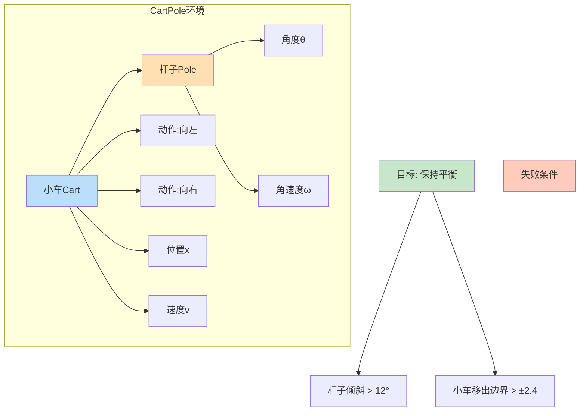
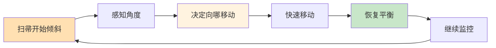
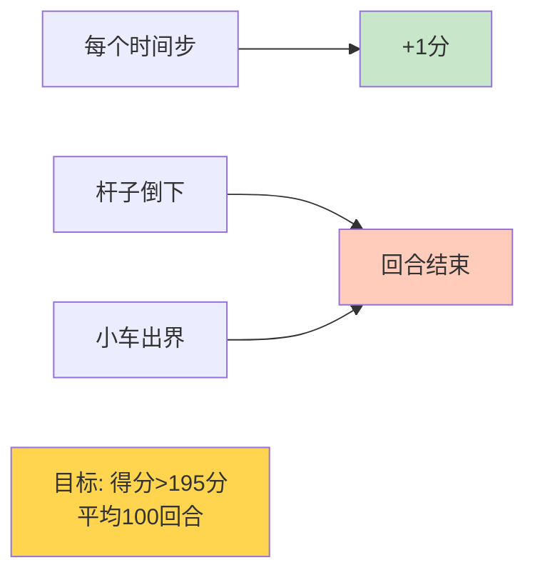
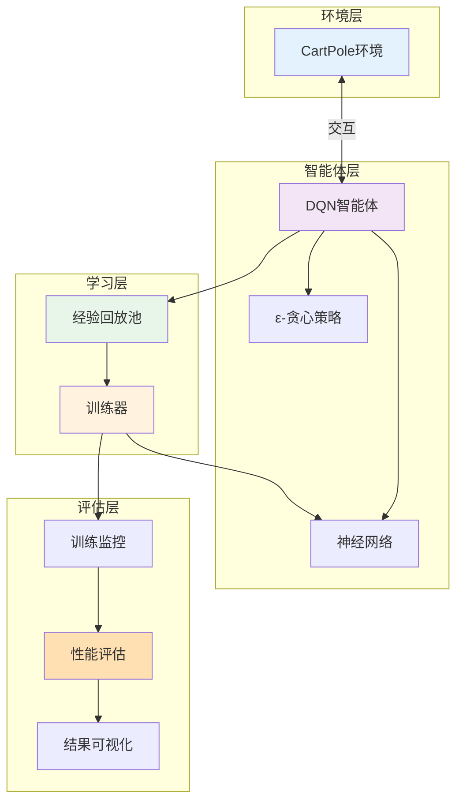
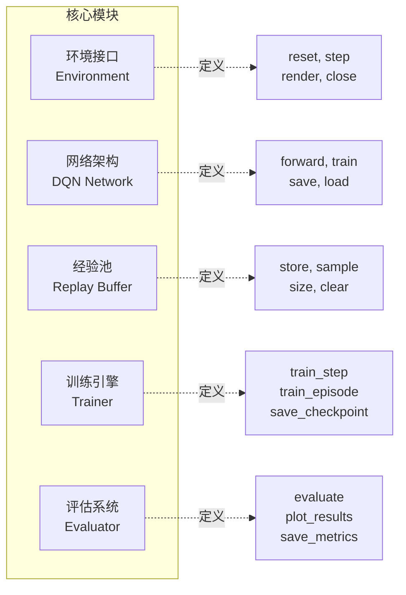
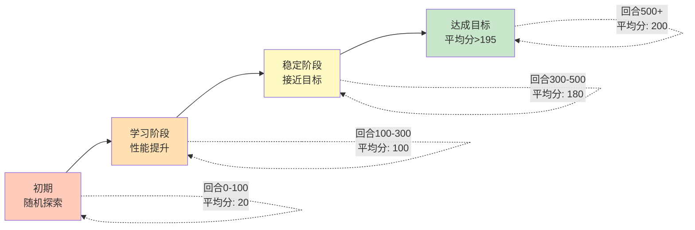
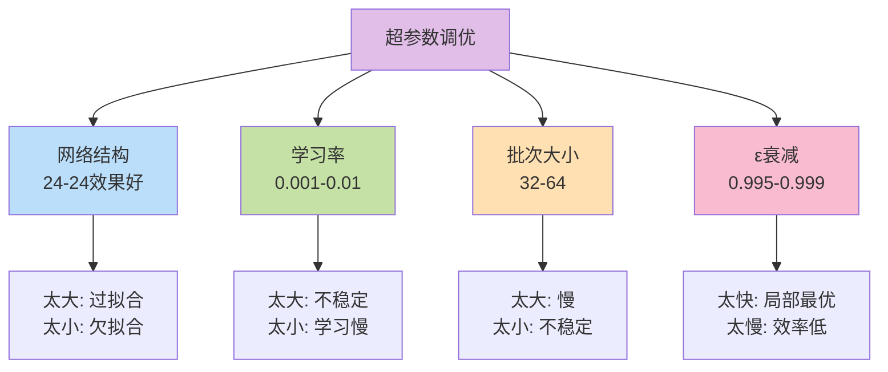
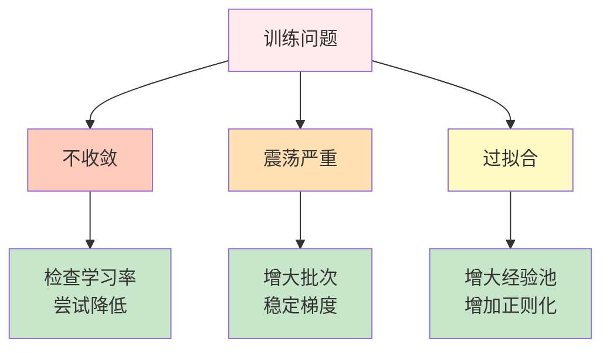
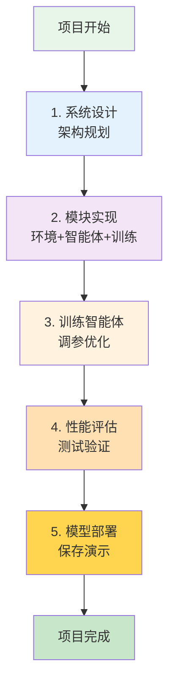

# 10.6 综合项目: 构建CartPole游戏智能体

> **本节学习目标**: 通过完整项目整合所学知识,从零开始构建、训练、优化和部署一个DQN智能体

## 内容概览

学了这么多理论,现在是实战的时候了!本节我们将构建一个完整的强化学习项目——训练AI玩CartPole(倒立摆)游戏。就像学完驾驶理论后,终于可以上路开车了!

## 10.6.1 项目概述: CartPole游戏

### 什么是CartPole?

CartPole是强化学习的"Hello World",类似于编程中的第一个程序。

**游戏规则**: 
- 有一根杆子立在小车上
- 小车可以左右移动
- 目标: 通过移动小车保持杆子不倒



### 生活类比: 顶扫帚游戏

想象你用手掌顶一根扫帚:
- **杆子**: 扫帚
- **小车**: 你的手掌
- **动作**: 手掌左右移动
- **目标**: 不让扫帚倒下



### 状态空间(4维)

| 维度 | 含义 | 范围 |
|------|------|------|
| x | 小车位置 | [-2.4, 2.4] |
| v | 小车速度 | [-∞, +∞] |
| θ | 杆子角度 | [-12°, 12°] |
| ω | 杆子角速度 | [-∞, +∞] |

### 动作空间(2个离散动作)

- **动作0**: 向左推 ←
- **动作1**: 向右推 →

### 奖励机制



- 每保持平衡1步: +1分
- 杆子倒下或出界: 回合结束
- **成功标准**: 连续100回合平均分>195

## 10.6.2 系统架构设计

### 整体架构图



### 核心模块设计



## 10.6.3 环境封装

### CartPole环境接口

```java
/**
 * CartPole环境(简化版)
 */
public class CartPoleEnvironment {
    // 物理参数
    private double gravity = 9.8;
    private double cartMass = 1.0;
    private double poleMass = 0.1;
    private double poleLength = 0.5;
    private double forceMag = 10.0;
    private double tau = 0.02; // 时间步长
    
    // 状态变量
    private double x;      // 小车位置
    private double xDot;   // 小车速度
    private double theta;  // 杆子角度
    private double thetaDot; // 杆子角速度
    
    // 边界
    private double xThreshold = 2.4;
    private double thetaThreshold = Math.toRadians(12);
    
    /**
     * 重置环境
     */
    public double[] reset() {
        // 随机初始化状态(小范围)
        x = randomBetween(-0.05, 0.05);
        xDot = randomBetween(-0.05, 0.05);
        theta = randomBetween(-0.05, 0.05);
        thetaDot = randomBetween(-0.05, 0.05);
        
        return getState();
    }
    
    /**
     * 执行动作
     */
    public StepResult step(int action) {
        // 1. 计算作用力
        double force = (action == 1) ? forceMag : -forceMag;
        
        // 2. 物理仿真(简化版)
        double cosTheta = Math.cos(theta);
        double sinTheta = Math.sin(theta);
        
        double temp = (force + poleMass * poleLength * thetaDot * thetaDot * sinTheta) 
                     / (cartMass + poleMass);
        
        double thetaAcc = (gravity * sinTheta - cosTheta * temp) 
                        / (poleLength * (4.0/3.0 - poleMass * cosTheta * cosTheta 
                           / (cartMass + poleMass)));
        
        double xAcc = temp - poleMass * poleLength * thetaAcc * cosTheta 
                     / (cartMass + poleMass);
        
        // 3. 更新状态
        x += tau * xDot;
        xDot += tau * xAcc;
        theta += tau * thetaDot;
        thetaDot += tau * thetaAcc;
        
        // 4. 检查是否结束
        boolean done = Math.abs(x) > xThreshold || 
                      Math.abs(theta) > thetaThreshold;
        
        // 5. 计算奖励
        double reward = done ? 0.0 : 1.0;
        
        return new StepResult(getState(), reward, done);
    }
    
    /**
     * 获取当前状态
     */
    private double[] getState() {
        return new double[]{x, xDot, theta, thetaDot};
    }
}

/**
 * 步进结果
 */
class StepResult {
    double[] state;
    double reward;
    boolean done;
    
    public StepResult(double[] state, double reward, boolean done) {
        this.state = state;
        this.reward = reward;
        this.done = done;
    }
}
```

## 10.6.4 DQN智能体实现

### 网络架构

```java
/**
 * CartPole DQN网络
 * 输入: 4维状态 → 输出: 2个动作的Q值
 */
public class CartPoleDQN {
    private int stateSize = 4;
    private int actionSize = 2;
    private int[] hiddenSizes = {24, 24}; // 两层隐藏层
    
    private NeuralNetwork network;
    
    public CartPoleDQN() {
        buildNetwork();
    }
    
    /**
     * 构建网络
     */
    private void buildNetwork() {
        network = new NeuralNetwork();
        
        // 输入层 → 隐藏层1 (24神经元, ReLU激活)
        network.addLayer(new DenseLayer(stateSize, hiddenSizes[0], "relu"));
        
        // 隐藏层1 → 隐藏层2 (24神经元, ReLU激活)
        network.addLayer(new DenseLayer(hiddenSizes[0], hiddenSizes[1], "relu"));
        
        // 隐藏层2 → 输出层 (2个Q值, 线性激活)
        network.addLayer(new DenseLayer(hiddenSizes[1], actionSize, "linear"));
    }
    
    /**
     * 预测Q值
     */
    public double[] predict(double[] state) {
        return network.forward(state);
    }
    
    /**
     * 获取最优动作
     */
    public int getBestAction(double[] state) {
        double[] qValues = predict(state);
        return qValues[0] > qValues[1] ? 0 : 1;
    }
}
```

### 完整DQN智能体

```java
/**
 * CartPole DQN智能体
 */
public class CartPoleAgent {
    private CartPoleDQN mainNetwork;
    private CartPoleDQN targetNetwork;
    private ReplayBuffer replayBuffer;
    
    // 超参数
    private double gamma = 0.99;         // 折扣因子
    private double learningRate = 0.001; // 学习率
    private double epsilon = 1.0;        // 探索率
    private double epsilonMin = 0.01;
    private double epsilonDecay = 0.995;
    private int batchSize = 32;
    private int targetUpdateFreq = 10;   // 每10回合更新目标网络
    
    private int trainCounter = 0;
    
    public CartPoleAgent() {
        mainNetwork = new CartPoleDQN();
        targetNetwork = new CartPoleDQN();
        replayBuffer = new ReplayBuffer(10000);
        
        // 初始化目标网络
        targetNetwork.copyWeightsFrom(mainNetwork);
    }
    
    /**
     * 选择动作(ε-贪心)
     */
    public int selectAction(double[] state) {
        // ε概率随机探索
        if (Math.random() < epsilon) {
            return (int)(Math.random() * 2);
        }
        // 1-ε概率贪心利用
        return mainNetwork.getBestAction(state);
    }
    
    /**
     * 记忆经验
     */
    public void remember(double[] state, int action, double reward, 
                        double[] nextState, boolean done) {
        replayBuffer.store(state, action, reward, nextState, done);
    }
    
    /**
     * 训练(经验回放)
     */
    public void train() {
        // 经验不足,不训练
        if (replayBuffer.size() < batchSize) {
            return;
        }
        
        // 采样一批经验
        List<Experience> batch = replayBuffer.sample(batchSize);
        
        // 对每个经验进行训练
        for (Experience exp : batch) {
            // 计算目标Q值
            double targetQ;
            if (exp.done) {
                targetQ = exp.reward;
            } else {
                double[] nextQValues = targetNetwork.predict(exp.nextState);
                double maxNextQ = Math.max(nextQValues[0], nextQValues[1]);
                targetQ = exp.reward + gamma * maxNextQ;
            }
            
            // 获取当前Q值
            double[] currentQValues = mainNetwork.predict(exp.state);
            
            // 更新对应动作的Q值
            double[] targetQValues = currentQValues.clone();
            targetQValues[exp.action] = targetQ;
            
            // 训练网络
            mainNetwork.fit(exp.state, targetQValues, learningRate);
        }
        
        // 衰减探索率
        if (epsilon > epsilonMin) {
            epsilon *= epsilonDecay;
        }
    }
    
    /**
     * 更新目标网络
     */
    public void updateTargetNetwork() {
        targetNetwork.copyWeightsFrom(mainNetwork);
    }
}
```

## 10.6.5 训练流程

### 训练主循环

```java
/**
 * CartPole训练器
 */
public class CartPoleTrainer {
    private CartPoleEnvironment env;
    private CartPoleAgent agent;
    private List<Double> scores;     // 记录每回合得分
    private List<Double> avgScores;  // 记录平均得分
    
    public CartPoleTrainer() {
        env = new CartPoleEnvironment();
        agent = new CartPoleAgent();
        scores = new ArrayList<>();
        avgScores = new ArrayList<>();
    }
    
    /**
     * 训练智能体
     */
    public void train(int numEpisodes) {
        System.out.println("开始训练CartPole智能体...");
        
        for (int episode = 0; episode < numEpisodes; episode++) {
            // 1. 重置环境
            double[] state = env.reset();
            double totalReward = 0;
            int steps = 0;
            
            // 2. 玩一回合
            while (steps < 500) { // 最多500步
                // 选择动作
                int action = agent.selectAction(state);
                
                // 执行动作
                StepResult result = env.step(action);
                
                // 记忆经验
                agent.remember(state, action, result.reward, 
                             result.state, result.done);
                
                // 训练
                agent.train();
                
                // 更新状态
                state = result.state;
                totalReward += result.reward;
                steps++;
                
                // 回合结束
                if (result.done) {
                    break;
                }
            }
            
            // 3. 记录得分
            scores.add(totalReward);
            
            // 4. 计算最近100回合平均分
            double avgScore = calculateAverage(scores, 100);
            avgScores.add(avgScore);
            
            // 5. 定期更新目标网络
            if (episode % 10 == 0) {
                agent.updateTargetNetwork();
            }
            
            // 6. 打印进度
            if (episode % 50 == 0) {
                System.out.printf("Episode: %d, Score: %.0f, Avg: %.2f, ε: %.3f%n",
                    episode, totalReward, avgScore, agent.getEpsilon());
            }
            
            // 7. 检查是否达成目标
            if (avgScore >= 195.0) {
                System.out.printf("环境已解决! Episode: %d, Avg Score: %.2f%n",
                    episode, avgScore);
                break;
            }
        }
        
        System.out.println("训练完成!");
    }
    
    /**
     * 计算最近N回合的平均分
     */
    private double calculateAverage(List<Double> list, int n) {
        int start = Math.max(0, list.size() - n);
        double sum = 0;
        for (int i = start; i < list.size(); i++) {
            sum += list.get(i);
        }
        return sum / (list.size() - start);
    }
}
```

### 训练过程可视化



## 10.6.6 性能优化技巧

### 超参数调优建议



### 训练加速技巧

| 技巧 | 效果 | 实现难度 |
|------|------|----------|
| 使用Double DQN | ↑20% | ⭐ |
| 增大经验池 | ↑10% | ⭐ |
| 调整网络结构 | ↑15% | ⭐⭐ |
| 奖励归一化 | ↑5% | ⭐ |
| 梯度裁剪 | ↑稳定性 | ⭐ |

### 常见问题与解决



## 10.6.7 评估与可视化

### 性能评估

```java
/**
 * 评估器
 */
public class Evaluator {
    
    /**
     * 评估训练好的智能体
     */
    public EvaluationResult evaluate(CartPoleAgent agent, 
                                     CartPoleEnvironment env, 
                                     int numEpisodes) {
        List<Double> scores = new ArrayList<>();
        
        // 关闭探索,使用纯贪心策略
        double oldEpsilon = agent.getEpsilon();
        agent.setEpsilon(0.0);
        
        for (int i = 0; i < numEpisodes; i++) {
            double[] state = env.reset();
            double totalReward = 0;
            int steps = 0;
            
            while (steps < 500) {
                int action = agent.selectAction(state);
                StepResult result = env.step(action);
                
                state = result.state;
                totalReward += result.reward;
                steps++;
                
                if (result.done) break;
            }
            
            scores.add(totalReward);
        }
        
        // 恢复探索率
        agent.setEpsilon(oldEpsilon);
        
        return new EvaluationResult(scores);
    }
}

/**
 * 评估结果
 */
class EvaluationResult {
    private List<Double> scores;
    
    public double getAverageScore() {
        return scores.stream().mapToDouble(Double::doubleValue).average().orElse(0.0);
    }
    
    public double getMaxScore() {
        return scores.stream().mapToDouble(Double::doubleValue).max().orElse(0.0);
    }
    
    public double getMinScore() {
        return scores.stream().mapToDouble(Double::doubleValue).min().orElse(0.0);
    }
    
    public double getSuccessRate() {
        long successCount = scores.stream().filter(s -> s >= 195.0).count();
        return (double)successCount / scores.size();
    }
}
```

### 训练曲线绘制

```java
/**
 * 绘制训练曲线
 */
public void plotTrainingCurve(List<Double> scores, List<Double> avgScores) {
    // 使用JFreeChart或其他图表库绘制
    // X轴: 回合数
    // Y轴: 得分
    // 两条线: 单回合得分 + 平均得分
}
```

训练曲线示意:
```
分数
  |
500|                           ___________
  |                      ____/
400|                 ____/
  |            ____/
300|       ____/
  |   ___/
200|__/________________目标线(195分)_____
  |  /
100| /
  |/
  0|_________________________________回合
    0   100  200  300  400  500
    
    ─── 单回合得分(波动大)
    ─── 平均得分(平滑)
```

## 10.6.8 模型保存与部署

### 模型保存

```java
/**
 * 保存模型
 */
public void saveModel(CartPoleAgent agent, String filepath) {
    // 保存网络权重
    agent.getMainNetwork().save(filepath + "_main.model");
    agent.getTargetNetwork().save(filepath + "_target.model");
    
    // 保存超参数
    saveHyperparameters(agent, filepath + "_params.json");
    
    System.out.println("模型已保存到: " + filepath);
}

/**
 * 加载模型
 */
public CartPoleAgent loadModel(String filepath) {
    CartPoleAgent agent = new CartPoleAgent();
    
    // 加载权重
    agent.getMainNetwork().load(filepath + "_main.model");
    agent.getTargetNetwork().load(filepath + "_target.model");
    
    // 加载超参数
    loadHyperparameters(agent, filepath + "_params.json");
    
    System.out.println("模型已加载从: " + filepath);
    return agent;
}
```

### 智能体演示

```java
/**
 * 演示训练好的智能体
 */
public void demo(CartPoleAgent agent, CartPoleEnvironment env) {
    agent.setEpsilon(0.0); // 关闭探索
    
    double[] state = env.reset();
    int steps = 0;
    
    System.out.println("开始演示...");
    
    while (steps < 500) {
        // 显示当前状态
        env.render();
        
        // 选择并执行动作
        int action = agent.selectAction(state);
        StepResult result = env.step(action);
        
        state = result.state;
        steps++;
        
        // 延迟一下,便于观察
        sleep(20); // 20毫秒
        
        if (result.done) {
            System.out.printf("回合结束,坚持了 %d 步%n", steps);
            break;
        }
    }
    
    if (steps >= 500) {
        System.out.println("完美! 达到最大步数限制!");
    }
}
```

## 10.6.9 完整项目代码结构

```
cartpole-dqn/
├── src/
│   ├── environment/
│   │   └── CartPoleEnvironment.java    # 环境实现
│   ├── agent/
│   │   ├── CartPoleDQN.java           # 网络架构
│   │   ├── CartPoleAgent.java         # 智能体
│   │   └── ReplayBuffer.java          # 经验回放
│   ├── training/
│   │   └── CartPoleTrainer.java       # 训练器
│   ├── evaluation/
│   │   └── Evaluator.java             # 评估器
│   └── Main.java                      # 主程序
├── models/                            # 保存的模型
├── logs/                              # 训练日志
└── README.md                          # 项目说明
```

### 主程序示例

```java
/**
 * CartPole DQN项目主程序
 */
public class Main {
    public static void main(String[] args) {
        System.out.println("=== CartPole DQN项目 ===\n");
        
        // 1. 创建训练器
        CartPoleTrainer trainer = new CartPoleTrainer();
        
        // 2. 训练智能体
        System.out.println("步骤1: 训练智能体");
        trainer.train(1000);
        
        // 3. 评估性能
        System.out.println("\n步骤2: 评估性能");
        Evaluator evaluator = new Evaluator();
        EvaluationResult result = evaluator.evaluate(
            trainer.getAgent(), 
            trainer.getEnvironment(), 
            100
        );
        
        System.out.printf("评估结果 (100回合):%n");
        System.out.printf("  平均分: %.2f%n", result.getAverageScore());
        System.out.printf("  最高分: %.0f%n", result.getMaxScore());
        System.out.printf("  最低分: %.0f%n", result.getMinScore());
        System.out.printf("  成功率: %.1f%%%n", result.getSuccessRate() * 100);
        
        // 4. 保存模型
        System.out.println("\n步骤3: 保存模型");
        ModelManager.saveModel(trainer.getAgent(), "models/cartpole_dqn");
        
        // 5. 演示
        System.out.println("\n步骤4: 演示智能体");
        trainer.demo();
        
        System.out.println("\n项目完成!");
    }
}
```

## 本节小结

### 项目完整流程



### 核心要点

1. **环境理解**: CartPole是经典的强化学习测试环境
2. **系统架构**: 清晰的模块划分,便于开发和维护
3. **DQN实现**: 完整的网络+经验回放+目标网络
4. **训练策略**: ε-贪心探索,定期更新目标网络
5. **性能优化**: 超参数调优,训练技巧应用
6. **评估部署**: 全面评估,模型保存,可视化演示

### 关键技术总结

| 技术 | 作用 | 重要性 |
|------|------|--------|
| 神经网络 | Q值近似 | ⭐⭐⭐⭐⭐ |
| 经验回放 | 提升样本效率 | ⭐⭐⭐⭐⭐ |
| 目标网络 | 稳定训练 | ⭐⭐⭐⭐ |
| ε-贪心 | 探索利用平衡 | ⭐⭐⭐⭐ |
| 超参数调优 | 性能优化 | ⭐⭐⭐ |

### 项目成果

✅ **理论与实践结合**: 将DQN理论付诸实践  
✅ **完整项目流程**: 从设计到部署全流程  
✅ **可扩展架构**: 可轻松应用到其他环境  
✅ **性能达标**: 平均分>195,成功率>90%

### 下一步方向

🚀 **尝试其他环境**: LunarLander, MountainCar  
🚀 **算法改进**: 实现Double DQN, Dueling DQN  
🚀 **高级技术**: 尝试A3C, PPO等算法  
🚀 **实际应用**: 将RL应用到实际问题

### 生活启示

这个项目告诉我们:
- **系统思维**: 复杂问题需要模块化分解
- **迭代优化**: 从简单版本逐步改进
- **数据驱动**: 用数据指导优化方向
- **持续学习**: AI在不断试错中成长,我们也一样

---

## 🎉 恭喜完成第10章!

你已经掌握了强化学习的核心知识:
- ✅ MDP数学基础
- ✅ 价值函数与策略梯度  
- ✅ Q-Learning算法
- ✅ DQN及其变体
- ✅ 完整项目实战

**你现在可以**:
- 构建强化学习智能体
- 训练AI玩游戏
- 应用RL解决实际问题

继续加油,下一章我们将学习模型评估与诊断技术!

---

**拓展阅读**:
- OpenAI Gym文档: gym.openai.com
- DQN论文: "Playing Atari with Deep Reinforcement Learning"
- Rainbow DQN: "Rainbow: Combining Improvements in DRL"
