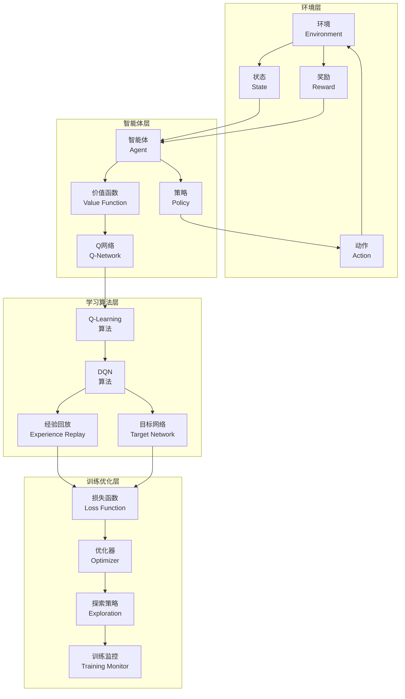

# 第10章：强化学习基础

> **设计思想**：掌握智能体决策的数学基础，为高级智能体系统做准备

## 章节概述

强化学习（Reinforcement Learning, RL）是机器学习的一个重要分支，它研究智能体（Agent）如何在环境中通过试错学习来最大化累积奖励。与监督学习和无监督学习不同，强化学习不需要标注数据，而是通过与环境的交互来学习最优策略。

本章将带领Java程序员深入理解强化学习的核心概念和经典算法。我们将从马尔可夫决策过程的数学基础开始，逐步学习价值函数、策略梯度、Q-Learning等经典算法，最终实现深度Q网络（DQN）并构建一个完整的游戏智能体系统。

## 学习目标

完成本章学习后，你将：

- ✅ **掌握强化学习基础**：理解强化学习的基本概念和数学框架
- ✅ **学习价值函数方法**：掌握状态价值函数和动作价值函数的计算方法
- ✅ **实现经典算法**：实现Q-Learning和DQN等经典强化学习算法
- ✅ **构建智能体系统**：构建完整的游戏智能体系统并进行训练优化
- ✅ **具备RL应用能力**：能够开发基本的强化学习应用系统

## 章节内容

### 10.1 马尔可夫决策过程：强化学习的数学框架
**学习重点**：理解强化学习的数学基础和MDP框架
- MDP的基本要素：状态、动作、奖励、转移
- 贝尔曼方程和最优性原理
- 价值函数和策略的数学定义
- 探索与利用的权衡

### 10.2 价值函数与策略梯度
**学习重点**：掌握价值函数计算和策略优化方法
- 状态价值函数和动作价值函数
- 蒙特卡洛方法和时序差分学习
- 策略梯度定理和REINFORCE算法
- Actor-Critic方法

### 10.3 Q-Learning算法实现
**学习重点**：实现经典的Q-Learning算法并理解其原理
- Q-Learning的基本原理
- Q表的更新规则
- ε-贪心策略的实现
- 收敛性分析和参数调优

### 10.4 深度Q网络（DQN）：结合深度学习与强化学习
**学习重点**：掌握DQN的核心技术和实现方法
- DQN的网络架构设计
- 经验回放机制
- 目标网络的稳定作用
- 训练流程和优化技巧

### 10.5 DQN变体和改进
**学习重点**：了解DQN的改进版本和先进技术
- Double DQN：解决Q值过高估计问题
- Dueling DQN：分离状态价值和优势函数
- Prioritized Experience Replay：优先经验回放
- Multi-step Learning：多步学习

### 10.6 综合项目：构建CartPole游戏智能体
**学习重点**：通过完整项目实践巩固所学知识
- 设计完整的强化学习系统架构
- 实现DQN训练和测试流程
- 优化智能体性能
- 部署和评估智能体系统

## 技术架构图

## 实践项目

**项目名称**：基于TinyAI的CartPole游戏智能体

**项目目标**：
- 实现完整的强化学习训练流水线：环境交互、经验收集、模型训练、策略优化
- 构建DQN智能体并训练其解决CartPole平衡问题
- 实现训练过程可视化和性能监控
- 优化训练过程，提升智能体性能

**技术要求**：
- 代码质量：完整注释、单元测试覆盖率>90%
- 性能指标：CartPole游戏平均得分>400分
- 功能完整性：支持训练、评估、测试全流程

**预期成果**：
- 可运行的完整CartPole智能体系统
- 性能测试报告和训练曲线
- 模型可视化结果展示
- 技术文档和使用说明

## 本章小结

第10章将为读者建立起强化学习领域的完整知识体系，从基础的数学框架到先进的深度强化学习算法，再到实际的项目应用。通过本章的学习，读者将具备独立开发强化学习应用的能力，为后续章节中智能体系统的学习奠定坚实基础。

---

**下一章预告**：第11章我们将学习模型评估与诊断技术，掌握科学的模型评估体系，确保模型的可靠性和泛化能力。