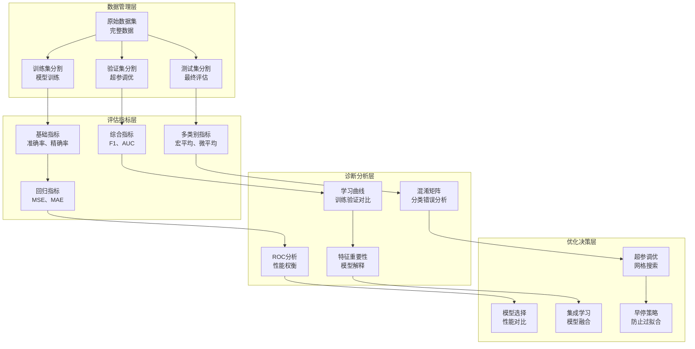

# 第11章：模型评估与诊断

> **设计思想**：构建科学的模型评估体系，确保模型的可靠性和泛化能力

## 章节概述

模型评估与诊断是机器学习工程中至关重要的一环，它帮助我们理解模型的性能、识别潜在问题并指导模型改进。一个好的模型不仅要在这次训练中表现良好，更要具备良好的泛化能力，在未见过的数据上也能保持稳定的性能。

本章将深入探讨模型评估的科学方法和诊断技术，从基础的评估指标到高级的交叉验证技术，从学习曲线分析到过拟合诊断。我们将基于TinyAI框架，通过实际的代码示例和项目实践，帮助读者掌握科学的模型评估方法。

## 学习目标

完成本章学习后，你将：

- ✅ **掌握评估指标**：理解各种评估指标的含义和适用场景
- ✅ **学会交叉验证**：掌握K折交叉验证等验证技术
- ✅ **诊断模型问题**：能够识别过拟合、欠拟合等问题
- ✅ **分析学习曲线**：通过学习曲线分析模型性能
- ✅ **优化模型性能**：基于诊断结果改进模型设计

## 章节内容

### 11.1 评估指标设计：准确率、召回率与F1分数
**学习重点**：掌握分类问题的评估指标体系
- 分类问题的评估指标体系
- 精确率、召回率的权衡
- F1分数和其他综合指标
- 多分类和多标签评估

### 11.2 交叉验证与数据分割策略
**学习重点**：掌握科学的数据验证方法
- K折交叉验证的实现
- 分层采样和时间序列验证
- 训练集、验证集、测试集的划分
- 数据泄露的预防

### 11.3 过拟合诊断：学习曲线分析
**学习重点**：掌握模型诊断的核心技术
- 训练曲线和验证曲线
- 过拟合和欠拟合的识别
- 学习曲线的绘制和分析
- 模型复杂度的调优

### 11.4 混淆矩阵与ROC分析
**学习重点**：深入理解分类模型的性能表现
- 混淆矩阵的构建和解读
- ROC曲线和AUC指标
- PR曲线和平衡点分析
- 多类别分类的评估方法

### 11.5 模型选择与超参数调优
**学习重点**：掌握模型选择和优化方法
- 网格搜索和随机搜索
- 贝叶斯优化基础
- 早停策略和模型选择
- 集成学习和模型融合

### 11.6 综合项目：模型评估与优化系统
**学习重点**：通过完整项目实践巩固所学知识
- 设计完整的模型评估系统
- 实现多种评估指标计算
- 构建可视化分析工具
- 自动化模型优化流程

## 技术架构图

## 实践项目

**项目名称**：基于TinyAI的模型评估与优化系统

**项目目标**：
- 实现完整的模型评估流水线：数据分割、指标计算、结果分析
- 构建多种评估指标计算工具
- 实现学习曲线分析和可视化
- 构建自动化超参数调优系统

**技术要求**：
- 代码质量：完整注释、单元测试覆盖率>90%
- 功能完整性：支持多种评估方法和可视化功能
- 性能要求：能够处理大规模数据集的评估
- 易用性：提供简洁的API和配置接口

**预期成果**：
- 可运行的完整模型评估系统
- 详细的评估报告和可视化图表
- 自动化优化建议和实现
- 技术文档和使用说明

## 本章小结

第11章将为读者建立起科学的模型评估与诊断知识体系，从基础的评估指标到高级的诊断技术，再到实际的项目应用。通过本章的学习，读者将具备独立进行模型评估和优化的能力，确保开发的AI系统具有良好的性能和可靠性。

---

**下一章预告**：第12章我们将学习深度学习进阶技巧，掌握现代深度学习的高级技术，进一步提升模型性能。