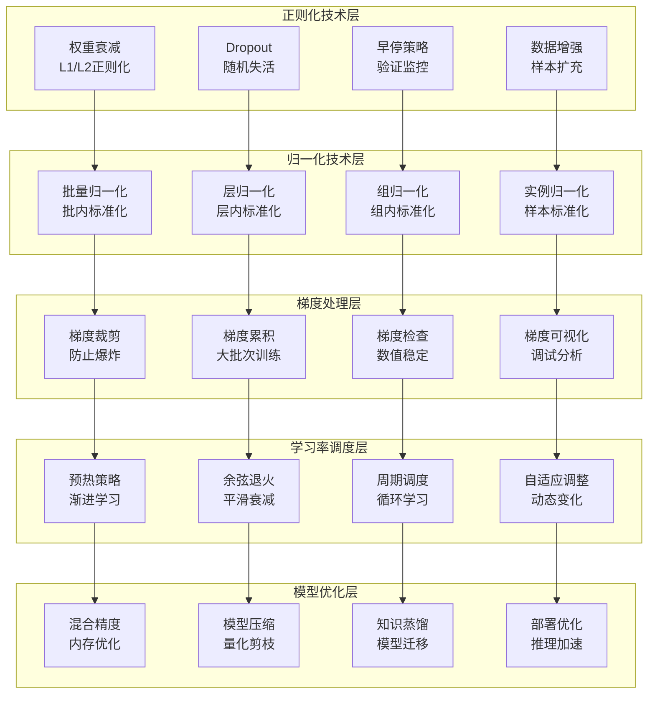

# 第12章：深度学习进阶技巧

> **设计思想**：掌握现代深度学习的高级技术，提升模型性能

## 章节概述

在掌握了深度学习的基础知识后，我们需要学习一些进阶技巧来进一步提升模型的性能和稳定性。这些技术包括正则化方法、归一化技术、梯度处理等，它们在现代深度学习系统中发挥着重要作用。

本章将深入探讨这些进阶技巧的原理和实现，从经典的Dropout正则化到现代的批量归一化，从梯度裁剪到梯度累积。我们将基于TinyAI框架，通过实际的代码示例和项目实践，帮助读者掌握这些提升模型性能的关键技术。

## 学习目标

完成本章学习后，你将：

- ✅ **掌握正则化技术**：理解Dropout、权重衰减等正则化方法
- ✅ **学会归一化技术**：掌握批量归一化及其变种的实现
- ✅ **处理梯度问题**：能够解决梯度爆炸和梯度消失问题
- ✅ **优化训练过程**：掌握梯度累积和学习率预热等技巧
- ✅ **提升模型性能**：能够应用这些技巧优化实际模型

## 章节内容

### 12.1 正则化技术：Dropout、Weight Decay与Early Stopping
**学习重点**：掌握防止过拟合的核心正则化方法
- L1和L2权重衰减
- Dropout的随机失活机制
- 早停策略的实现
- 数据增强作为正则化

### 12.2 批量归一化：加速训练与提升稳定性
**学习重点**：掌握现代深度学习中的归一化技术
- 批归一化的数学原理
- 训练和推理模式的区别
- 层归一化和组归一化
- 归一化层的参数更新

### 12.3 梯度裁剪：解决梯度爆炸问题
**学习重点**：掌握梯度处理的关键技术
- 梯度爆炸的原因分析
- 梯度裁剪的实现方法
- 自适应梯度裁剪
- 梯度累积技术

### 12.4 学习率预热与余弦退火
**学习重点**：掌握现代学习率调度策略
- 学习率预热技术
- 余弦退火调度
- 周期性学习率
- 自适应学习率调整

### 12.5 混合精度训练与模型压缩
**学习重点**：掌握模型训练和部署的优化技术
- 混合精度训练原理
- 模型量化和剪枝
- 知识蒸馏技术
- 模型部署优化

### 12.6 综合项目：模型优化与性能提升
**学习重点**：通过完整项目实践巩固所学知识
- 设计模型优化实验
- 实现多种优化技术
- 对比不同优化方法的效果
- 构建自动化优化流程

## 技术架构图

## 实践项目

**项目名称**：基于TinyAI的模型优化与性能提升系统

**项目目标**：
- 实现完整的模型优化流水线：正则化、归一化、梯度处理
- 构建多种优化技术的实现和对比
- 实现学习率调度和混合精度训练
- 构建自动化模型优化工具

**技术要求**：
- 代码质量：完整注释、单元测试覆盖率>90%
- 功能完整性：支持多种优化技术和配置选项
- 性能要求：能够显著提升模型训练效率和稳定性
- 易用性：提供简洁的API和可视化配置界面

**预期成果**：
- 可运行的完整模型优化系统
- 详细的优化效果对比报告
- 自动化优化建议和实现
- 技术文档和使用说明

## 本章小结

第12章将为读者建立起深度学习进阶技巧的完整知识体系，从经典的正则化方法到现代的优化技术，再到实际的项目应用。通过本章的学习，读者将具备独立进行模型优化和性能提升的能力，开发出更高效、更稳定的AI系统。

---

**第一部分总结**：我们即将完成深度学习基础篇的学习，为后续的大语言模型和智能体学习打下坚实基础。