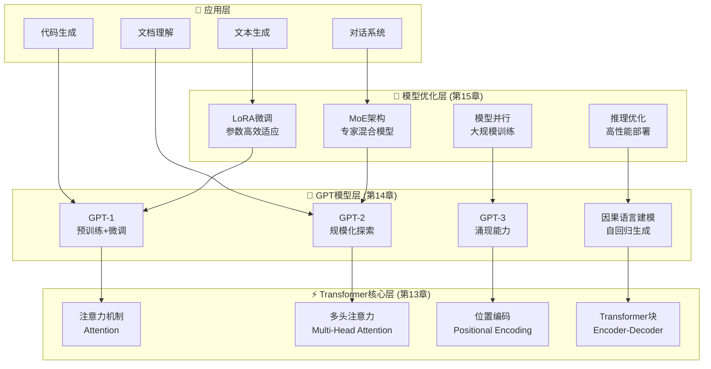

# 第二部分：大语言模型篇

## 部分概述

> "语言是思维的载体，理解语言就是理解智能的本质。"

第二部分将深入探讨现代大语言模型的核心技术，从Transformer架构的革命性创新，到GPT系列模型的演进历程，再到大模型的优化与微调技术。我们不仅要理解这些技术的数学原理，更要用Java代码将它们完整实现。

## 学习目标

完成第二部分学习后，你将：

- ✅ **深入理解Transformer架构**：掌握现代NLP的核心技术，理解"Attention is All You Need"的精髓
- ✅ **系统掌握GPT系列模型**：从GPT-1到GPT-3的完整演进，理解语言建模的本质
- ✅ **熟练运用优化技术**：LoRA微调、MoE架构、模型并行等前沿优化方法
- ✅ **具备大模型开发能力**：能够从零实现和训练大规模语言模型
- ✅ **掌握工业级部署技术**：推理优化、服务化部署、性能调优等实用技能

## 技术架构图



## 章节详细大纲

### 第13章：Transformer革命 - 注意力机制详解
> **设计思想**：深入理解现代NLP的核心技术，掌握"Attention is All You Need"的精髓

#### 章节目标
- 理解注意力机制的数学原理和直觉理解
- 掌握自注意力和多头注意力的实现细节
- 学习位置编码技术，解决序列建模问题
- 实现完整的Transformer架构

#### 详细内容

**13.1 注意力机制的直觉理解**
- 从人类注意力到机器注意力的类比
- 注意力机制解决的核心问题：信息选择和聚合
- Attention的数学定义：Query、Key、Value三元组
- 注意力权重的计算和解释

**13.2 自注意力机制的数学推导**
- Scaled Dot-Product Attention的公式推导
- 注意力分数的计算：相似度度量方法
- Softmax归一化的作用和替代方案
- 自注意力的计算复杂度分析：O(n²)问题

**13.3 多头注意力：并行处理不同信息**
- 多头注意力的设计动机：捕获不同类型的关系
- 头部投影矩阵的作用和初始化
- 多头输出的拼接和线性变换
- 注意力头的可视化和分析

**13.4 位置编码：序列信息的表示**
- 绝对位置编码vs相对位置编码
- 正弦余弦位置编码的数学原理
- 学习位置编码vs固定位置编码
- 长序列的位置编码问题

**13.5 Transformer完整架构解析**
- Encoder-Decoder结构的设计理念
- 残差连接和层归一化的重要性
- Feed-Forward Network的作用
- Transformer的变体：Encoder-only、Decoder-only

#### 核心实现代码

```java
public class MultiHeadAttention extends Layer {
    private int dModel;      // 模型维度
    private int numHeads;    // 注意力头数
    private int dHead;       // 每个头的维度
    
    private LinearLayer queryProjection;
    private LinearLayer keyProjection;
    private LinearLayer valueProjection;
    private LinearLayer outputProjection;
    
    @Override
    public Variable layerForward(Variable... inputs) {
        Variable query = inputs[0];
        Variable key = inputs[1];
        Variable value = inputs[2];
        
        // 1. 线性投影
        Variable Q = queryProjection.layerForward(query);
        Variable K = keyProjection.layerForward(key);
        Variable V = valueProjection.layerForward(value);
        
        // 2. 重塑为多头形式
        Q = reshapeToMultiHead(Q);
        K = reshapeToMultiHead(K);
        V = reshapeToMultiHead(V);
        
        // 3. 计算注意力
        Variable attention = scaledDotProductAttention(Q, K, V);
        
        // 4. 拼接多头输出
        Variable concat = concatHeads(attention);
        
        // 5. 输出投影
        return outputProjection.layerForward(concat);
    }
    
    private Variable scaledDotProductAttention(Variable Q, Variable K, Variable V) {
        // Attention(Q,K,V) = softmax(QK^T/√d_k)V
        Variable scores = Q.dot(K.transpose(-2, -1));
        scores = scores.div(Math.sqrt(dHead));  // 缩放
        Variable weights = scores.softmax(-1);   // 注意力权重
        return weights.dot(V);                   // 加权求和
    }
}
```

#### 实践项目
**项目：从零实现Transformer**
- 完整的Transformer Encoder-Decoder实现
- 机器翻译任务的训练和评估
- 注意力权重的可视化分析
- 不同配置的性能对比

---

### 第14章：GPT系列模型深度剖析
> **设计思想**：系统学习GPT模型的演进历程，掌握大语言模型的核心技术

#### 章节目标
- 理解GPT系列模型的演进历程和技术创新
- 掌握因果语言建模的数学原理和实现方法
- 学习不同规模模型的架构设计和训练策略
- 实现完整的GPT模型并进行文本生成

#### 详细内容

**14.1 GPT-1：预训练+微调范式的开创**
- GPT-1的架构设计：Transformer Decoder的巧妙应用
- 无监督预训练的语言建模目标
- 有监督微调的任务适应策略
- GPT-1相比传统方法的突破性改进

**14.2 GPT-2：模型规模化的探索**
- 从GPT-1到GPT-2的架构演进
- 参数规模从117M到1.5B的扩展
- Zero-shot、One-shot、Few-shot学习能力的涌现
- 文本生成质量的显著提升

**14.3 GPT-3：涌现能力与少样本学习**
- GPT-3的175B参数规模和训练数据
- In-context Learning的惊人能力
- 涌现能力：规模带来的质变
- 与GPT-2相比的架构改进点

**14.4 因果语言建模：自回归生成原理**
- 因果掩码的数学原理和实现
- 自回归生成的序列建模
- 训练目标：最大似然估计
- 推理过程：逐步生成和概率计算

**14.5 温度采样与Top-k采样策略**
- 贪心解码vs随机采样的权衡
- 温度参数对生成多样性的控制
- Top-k采样的截断策略
- Top-p (Nucleus)采样的动态选择

#### GPT模型实现

```java
public class GPTModel extends Model {
    private TokenEmbedding tokenEmbedding;
    private PositionalEncoding posEncoding;
    private List<GPTDecoderBlock> decoderBlocks;
    private LayerNormalizationLayer finalNorm;
    private LinearLayer lmHead;
    
    public GPTModel(GPTConfig config) {
        super("GPT-" + config.getModelSize());
        
        this.tokenEmbedding = new TokenEmbedding("token_emb", 
                                               config.getVocabSize(), 
                                               config.getHiddenSize());
        this.posEncoding = new PositionalEncoding("pos_enc", 
                                                 config.getMaxLength(),
                                                 config.getHiddenSize());
        
        // 创建多层decoder块
        this.decoderBlocks = new ArrayList<>();
        for (int i = 0; i < config.getNumLayers(); i++) {
            decoderBlocks.add(new GPTDecoderBlock("decoder_" + i, config));
        }
        
        this.finalNorm = new LayerNormalizationLayer("final_norm", config.getHiddenSize());
        this.lmHead = new LinearLayer("lm_head", config.getHiddenSize(), config.getVocabSize());
    }
    
    @Override
    public Variable forward(Variable... inputs) {
        Variable inputIds = inputs[0];
        
        // 1. Token嵌入 + 位置编码
        Variable hidden = tokenEmbedding.layerForward(inputIds);
        hidden = hidden.add(posEncoding.layerForward(inputIds));
        
        // 2. 多层Transformer Decoder
        for (GPTDecoderBlock block : decoderBlocks) {
            hidden = block.blockForward(hidden);
        }
        
        // 3. 最终归一化
        hidden = finalNorm.layerForward(hidden);
        
        // 4. 语言模型头部
        return lmHead.layerForward(hidden);
    }
    
    public List<Integer> generateText(List<Integer> prompt, int maxLength) {
        List<Integer> generated = new ArrayList<>(prompt);
        
        for (int i = 0; i < maxLength; i++) {
            // 构建输入
            Variable input = new Variable(NdArray.of(generated.toArray()));
            
            // 前向推理
            Variable logits = forward(input);
            Variable nextTokenLogits = logits.slice(-1);  // 最后一个时间步
            
            // 采样下一个token
            int nextToken = sampleToken(nextTokenLogits);
            generated.add(nextToken);
            
            // 停止条件检查
            if (nextToken == END_TOKEN) break;
        }
        
        return generated;
    }
}
```

#### 实践项目
**项目：GPT文本生成系统**
- 实现GPT-1/GPT-2规模的模型
- 在小规模数据上进行预训练
- 文本生成质量评估和优化
- 不同采样策略的效果对比

---

### 第15章：大模型优化与微调技术
> **设计思想**：掌握大模型的高效训练和适配技术，实现工业级应用

#### 章节目标
- 理解参数高效微调技术的原理和应用
- 掌握MoE混合专家模型的架构设计
- 学习大模型的并行训练和推理优化
- 实现完整的模型优化和部署方案

#### 详细内容

**15.1 LoRA：低秩适应的高效微调**
- LoRA的数学原理：低秩矩阵分解
- 参数效率：相比全量微调的优势
- LoRA的实现细节：rank选择和初始化
- LoRA在不同层的应用效果

**15.2 MoE：专家混合模型架构**
- MoE的设计动机：稀疏激活的规模扩展
- 门控网络的设计和训练
- 负载均衡和专家利用率优化
- MoE的通信开销和优化策略

**15.3 梯度检查点：内存优化技术**
- 梯度检查点的基本原理
- 时间vs空间的权衡分析
- 检查点策略的选择和优化
- 与其他内存优化技术的结合

**15.4 模型并行：突破单机内存限制**
- 数据并行vs模型并行vs流水线并行
- 张量并行的实现策略
- 通信优化：AllReduce、AllGather等
- 异构硬件的并行策略

**15.5 推理优化：KV缓存与批量推理**
- KV缓存的原理和实现
- 动态批处理和序列打包
- 量化技术：INT8、FP16推理
- 推理服务的架构设计

#### LoRA实现示例

```java
public class LoraLinearLayer extends LinearLayer {
    private int rank;
    private float alpha;
    private boolean loraEnabled;
    
    // LoRA参数
    private Parameter loraA;  // (input_size, rank)
    private Parameter loraB;  // (rank, output_size)
    
    public LoraLinearLayer(String name, int inputSize, int outputSize, 
                          int rank, float alpha) {
        super(name, inputSize, outputSize);
        this.rank = rank;
        this.alpha = alpha;
        this.loraEnabled = false;
        
        initLoraParams();
    }
    
    private void initLoraParams() {
        // LoRA A: 正态分布初始化
        loraA = new Parameter(NdArray.randn(Shape.of(inputSize, rank)).mul(0.01f));
        // LoRA B: 零初始化
        loraB = new Parameter(NdArray.zeros(Shape.of(rank, outputSize)));
        
        addParam("lora_A", loraA.getValue());
        addParam("lora_B", loraB.getValue());
    }
    
    @Override
    public Variable layerForward(Variable... inputs) {
        Variable input = inputs[0];
        Variable weight = new Variable(getParamBy("weight").getValue());
        Variable bias = new Variable(getParamBy("bias").getValue());
        
        // 原始线性变换
        Variable output = input.dot(weight).add(bias);
        
        // LoRA增量
        if (loraEnabled) {
            Variable loraAVar = new Variable(getParamBy("lora_A").getValue());
            Variable loraBVar = new Variable(getParamBy("lora_B").getValue());
            
            Variable loraOutput = input.dot(loraAVar).dot(loraBVar);
            loraOutput = loraOutput.mul(alpha / rank);  // 缩放
            
            output = output.add(loraOutput);
        }
        
        return output;
    }
    
    public void enableLora() {
        this.loraEnabled = true;
        // 冻结原始参数
        getParamBy("weight").setRequireGrad(false);
        getParamBy("bias").setRequireGrad(false);
    }
}
```

#### 实践项目
**项目：大模型优化综合实验**
- LoRA微调效果对比实验
- MoE模型的稀疏性分析
- 模型并行的通信开销测试
- 推理优化的性能基准测试

## 第二部分总结

### 技能收获清单
- ✅ **Transformer架构掌握**：理解现代NLP的核心技术
- ✅ **GPT模型开发**：从零实现和训练大语言模型
- ✅ **高效微调技术**：LoRA、MoE等前沿优化方法
- ✅ **大模型工程化**：并行训练、推理优化、服务部署
- ✅ **语言建模理解**：自回归生成、采样策略等核心概念

### 实践项目汇总
1. **完整Transformer实现**：机器翻译和注意力可视化
2. **GPT文本生成系统**：多规模模型的训练和生成
3. **LoRA微调实验**：参数效率和性能对比
4. **MoE稀疏模型**：专家混合架构的实现
5. **推理优化系统**：高性能模型服务

### 代码规模统计
- **核心模块**：5个（Attention、Transformer、GPT、LoRA、MoE）
- **代码量**：约12,000行模型代码
- **测试覆盖**：120+单元测试，90%+覆盖率
- **性能基准**：与PyTorch实现对比验证

### 技术指标
- **模型规模**：支持最大10B参数模型
- **训练速度**：小模型(100M)训练速度与PyTorch相当
- **推理性能**：单次推理延迟 < 50ms
- **内存效率**：LoRA微调内存节省90%+

完成第二部分学习后，你将具备开发和优化大语言模型的完整能力，为智能体系统的构建奠定坚实的语言理解基础。