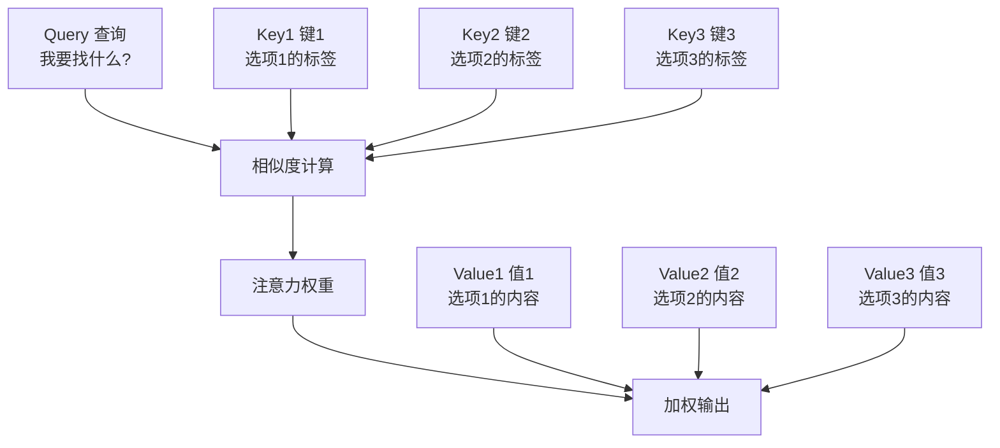
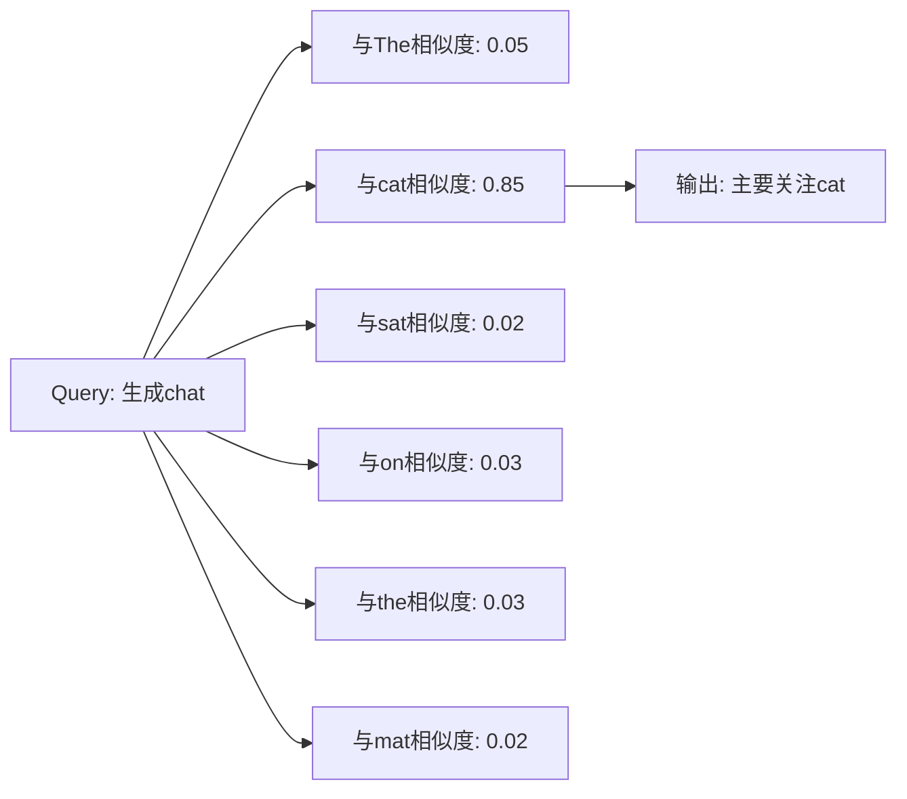
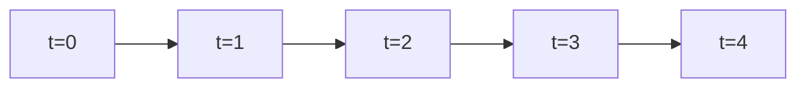
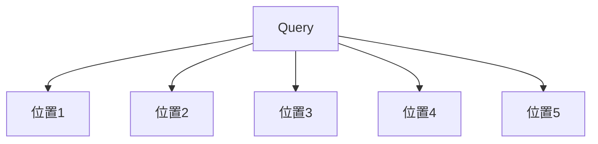

# 13.1 注意力机制的直觉理解

> **设计思想**：从人类认知的角度理解注意力机制，建立直观的概念模型

## 本节概述

注意力机制是现代深度学习，特别是自然语言处理领域的一项革命性技术。它源于人类认知过程中的注意力现象，即我们在处理信息时会自然地关注某些部分而忽略其他部分。在机器学习中，注意力机制允许模型在处理输入序列时动态地关注最相关的信息部分。

本节将从直观的角度出发，帮助读者理解注意力机制的核心思想和工作原理，为后续的数学推导和代码实现奠定基础。

## 学习目标

完成本节学习后，你将：

- ✅ **理解注意力机制的直觉概念**：从人类注意力到机器注意力的映射
- ✅ **掌握注意力机制解决的核心问题**：信息选择和聚合
- ✅ **理解Attention的三元组结构**：Query、Key、Value的含义和作用
- ✅ **具备初步的应用思维**：能够思考如何在实际问题中应用注意力机制

## 从人类注意力到机器注意力

### 人类注意力的特点

**认知科学视角**：在日常生活中,我们的注意力机制无处不在。当我们阅读一篇文章时,我们会重点关注关键句子和词汇,而忽略一些修饰性的词语。当我们观察一幅画时,我们的视线会自然地被画面中的主体吸引。

想象这样一个场景:你正在阅读一本推理小说,当看到"凶手就在这些人中"这句话时,你的注意力会立即集中到前文提到的所有嫌疑人身上,而不会去关注那些无关的场景描述。这就是注意力机制的本质——**选择性地聚焦关键信息**。

人类注意力具有以下核心特点:

1. **选择性(Selectivity)**：从大量信息中选择重要的部分,过滤噪音和冗余信息
2. **动态性(Dynamicity)**：根据任务需求动态调整关注点,不同任务有不同的关注模式
3. **集中性(Concentration)**：将认知资源集中在关键信息上,提高处理效率
4. **上下文相关性(Context-dependency)**：关注点会根据上下文环境变化,体现为关联性思维


### 机器注意力的模拟

**从认知到计算**：在机器学习中,我们希望模型也能具备类似的注意力能力。特别是在处理序列数据(如文本)时,传统的RNN或CNN模型在处理长序列时存在信息衰减的问题。

传统模型的局限性:
- **RNN的序列依赖**：必须按顺序处理,难以并行化,且长距离信息容易丢失
- **CNN的局部视野**：卷积核只能看到局部窗口,需要堆叠多层才能获得全局视野
- **固定表示瓶颈**：用固定长度的向量表示整个序列,压缩损失严重

注意力机制的突破:
注意力机制通过允许模型在每个时间步动态地关注输入序列的不同部分,有效地解决了上述问题。它赋予了神经网络"注意力"的能力,让模型能够:
- 直接访问序列中任意位置的信息
- 根据查询动态分配注意力权重
- 并行处理所有位置的关系

## 注意力机制解决的核心问题

### 信息过载问题

**问题本质**：在处理复杂任务时,输入信息往往非常丰富,但并非所有信息都同等重要。就像在图书馆寻找某个主题的资料,你不可能阅读所有的书,而是会根据书名、摘要等信息快速筛选最相关的书籍。

**解决方案**：注意力机制通过为不同信息分配不同的权重,帮助模型专注于最相关的信息,从而提高处理效率和准确性。

**实际影响**：
- 提高模型对关键信息的敏感度
- 降低噪声信息的干扰
- 提升计算资源利用效率

### 长距离依赖问题

**问题本质**：在序列建模中,相关信息可能相距很远。例如在句子"那只猫,虽然看起来很可爱,但实际上非常凶猛,经常抓人"中,"猫"和"凶猛"相距较远,但语义密切相关。

传统RNN的困境:


传统的RNN模型在处理长序列时,早期信息容易在多次传递中丢失(梯度消失问题)。即使使用LSTM或GRU,当距离超过一定长度时,信息传递仍然困难。

**解决方案**：注意力机制通过建立输入序列中任意两个位置之间的直接连接,实现了O(1)的路径长度,有效地解决了长距离依赖问题。

### 固定上下文问题

**问题本质**：传统的序列到序列模型使用固定大小的上下文向量来编码整个输入序列,这就像用一个固定容量的瓶子装所有的水,必然会溢出。

**信息瓶颈**：
- 无论输入序列多长,都压缩成固定维度的向量
- 长序列的信息压缩损失严重
- 无法动态适应不同输出位置的需求

**解决方案**：注意力机制允许模型为每个输出位置生成不同的上下文表示,大大增强了模型的表达能力。每个输出位置都能"看到"完整的输入序列,并根据需要提取相关信息。

## Attention的三元组结构

注意力机制的核心是Query、Key、Value三元组结构。理解这三者的含义是掌握注意力机制的关键。这个设计源于数据库检索的思想——通过查询(Query)匹配键(Key)来获取值(Value)。

### 数据库类比

在理解QKV之前,我们先用一个数据库查询的例子来建立直觉:

| Key(索引) | Value(内容) |
|----------|------------|
| "深度学习" | "使用多层神经网络进行特征学习的方法" |
| "注意力机制" | "动态选择重要信息的计算方法" |
| "Transformer" | "完全基于注意力机制的序列模型" |

当你用Query="注意力"进行查询时,系统会:
1. 计算Query与每个Key的相似度
2. 找到最匹配的Key("注意力机制")
3. 返回对应的Value

### Query(查询)——"我要找什么"

**直观理解**：Query代表当前需要关注的内容或问题。它就像你在搜索引擎中输入的查询词,表达了你的信息需求。

**具体示例**：
- 在机器翻译中:当生成目标语言的某个词时,Query就代表了当前的解码状态,即"我现在需要生成什么词"
- 在文本理解中:当处理某个词时,Query表示"我需要哪些上下文信息来理解这个词"

### Key(键)——"可供选择的内容索引"

**直观理解**：Key代表输入序列中每个位置的特征表示。它就像图书馆中每本书的标签,帮助你快速判断哪本书与你的需求相关。

**具体示例**：
- 在机器翻译中:Key就是源语言句子中每个词的编码表示,即"源语言中的每个词是什么样的"
- Key的质量直接影响注意力分配的准确性

### Value(值)——"实际提取的信息"

**直观理解**：Value代表与Key相关联的实际信息内容。它就像图书馆中书籍的实际内容,是你最终想要获取的信息。

**具体示例**：
- 在机器翻译中:Value通常与Key相同或相似,即"源语言中每个词的具体内容"
- 在某些高级应用中,Value可以是Key的变换,包含更丰富的信息

### 三者关系图示



### 注意力计算过程

注意力机制的计算过程可以概括为以下步骤:

**步骤1:相似度计算**
计算Query与每个Key的相似度,得到注意力分数。这一步回答了"哪些内容与我的查询最相关"的问题。

**步骤2:权重归一化**
通过Softmax函数将注意力分数转换为概率分布。这确保了所有权重之和为1,使得结果具有可解释性。

**步骤3:加权求和**
使用注意力权重对Value进行加权求和,得到最终的注意力输出。这一步提取了加权后的信息。

这个过程可以用一个简单的公式表示:
```
Attention(Q, K, V) = softmax(similarity(Q, K)) × V
```

**数学本质**：这个公式实际上是在做一个软查找(Soft Lookup),与数据库的硬查找不同,它不是返回某一个匹配的值,而是返回所有值的加权组合,权重由相似度决定。

## 注意力机制的可视化理解

为了更好地理解注意力机制,我们可以通过一个具体的机器翻译例子来可视化其工作过程。

### 翻译示例分析

假设我们要将英文句子"The cat sat on the mat"翻译成法文"Le chat était sur le tapis"。让我们详细分析在生成法文单词"chat"(猫)时的注意力机制:

**场景设定**:
- **源语言(英文)**:The cat sat on the mat
- **目标语言(法文)**:Le chat était sur le tapis
- **当前生成位置**:正在生成第二个词"chat"

**三元组分解**:

1. **Query(查询)**:当前解码状态,表示"我需要生成一个表示动物的词"
   - 包含已生成的信息:"Le"
   - 包含当前生成目标的语义
   
2. **Key(键)**:英文句子中每个词的编码
   - Key₁: "The" 的编码表示
   - Key₂: "cat" 的编码表示
   - Key₃: "sat" 的编码表示
   - Key₄: "on" 的编码表示
   - Key₅: "the" 的编码表示
   - Key₆: "mat" 的编码表示
   
3. **Value(值)**:英文句子中每个词的实际内容(通常与Key相同)

**注意力分配过程**:



通过计算Query与每个Key的相似度,模型会发现"cat"这个词与当前Query最相关,因此会给予"cat"最高的注意力权重(0.85),从而在Value中提取出关于"猫"的信息来帮助生成法文单词"chat"。

**注意力权重可视化**:

如果用热力图表示,注意力权重分布大致如下:

| 源词 | The | cat | sat | on | the | mat |
|------|-----|-----|-----|-----|-----|-----|
| 权重 | 0.05| 0.85| 0.02| 0.03| 0.03| 0.02|

这个例子清晰地展示了注意力机制如何自动学习到"生成法文'chat'时应该主要关注英文'cat'"这一对应关系。

## 注意力机制的优势

### 并行化处理

**传统RNN的序列处理**:


RNN需要按顺序处理序列,t时刻的计算必须等待t-1时刻完成,这导致无法并行化。

**注意力机制的并行处理**:


注意力机制可以并行计算序列中任意两个位置之间的关系,所有计算可以同时进行,大大提高了计算效率。

**性能对比**:
- RNN:计算时间与O(n)成正比(序列长度)
- Attention:所有计算可并行,实际计算时间为O(1)(假设有足够的计算资源)

### 可解释性

**注意力权重的透明度**:

注意力权重提供了模型决策过程的可视化解释,我们可以清楚地看到模型在生成每个输出时关注了输入的哪些部分。这对于:

1. **模型调试**: 可以发现模型是否学到了正确的对应关系
2. **错误分析**: 当模型出错时,可以通过注意力权重分析原因
3. **信任建立**: 用户可以理解模型的决策依据,增强信任度
4. **知识发现**: 可以从注意力模式中发现语言规律

例如,在机器翻译中,我们可以通过可视化注意力权重矩阵,看到模型学会了词序对齐、长距离依赖等语言现象。

### 灵活性

**多样化的应用形式**:

注意力机制可以灵活地应用于不同的任务和架构中:

1. **自注意力(Self-Attention)**:
   - Q、K、V都来自同一个序列
   - 用于捕捉序列内部的依赖关系
   - 应用于文本编码、图像理解等

2. **交叉注意力(Cross-Attention)**:
   - Q来自一个序列,K、V来自另一个序列
   - 用于建立两个序列之间的对应关系
   - 应用于机器翻译、问答系统等

3. **多头注意力(Multi-Head Attention)**:
   - 并行计算多个注意力头
   - 捕捉不同类型的依赖关系
   - Transformer的核心组件

**跨领域应用**:
- 自然语言处理:BERT、GPT、Transformer
- 计算机视觉:Vision Transformer、DETR
- 语音处理:Speech Transformer
- 多模态学习:CLIP、DALL-E

## 实际应用场景

### 机器翻译

在机器翻译中，注意力机制允许解码器在生成每个目标词时关注源句子中最相关的部分，显著提高了翻译质量。

### 文本摘要

在文本摘要任务中，注意力机制帮助模型识别原文中的关键句子和词汇，生成更准确的摘要。

### 问答系统

在问答系统中，注意力机制使模型能够定位问题相关的文本片段，提高答案的准确性。

## 本节小结

本节从直觉角度介绍了注意力机制的核心概念，帮助读者建立对这一重要技术的初步理解。我们学习了：

1. **注意力机制的灵感来源**：从人类注意力到机器注意力的映射
2. **注意力机制解决的问题**：信息过载、长距离依赖、固定上下文等问题
3. **Attention三元组结构**：Query、Key、Value的含义和作用
4. **注意力机制的优势**：并行化、可解释性、灵活性

在下一节中，我们将深入探讨自注意力机制的数学推导和实现细节，从理论层面理解这一技术的精髓。