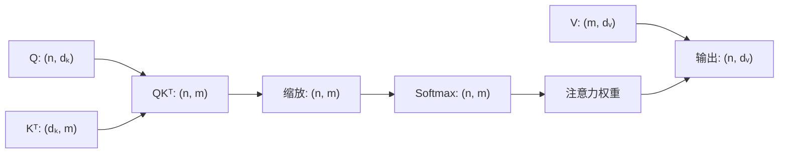
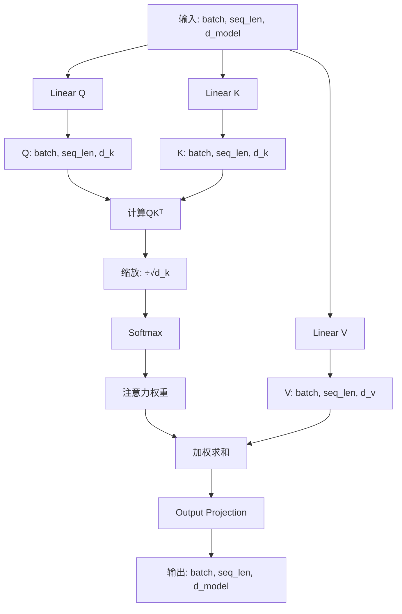
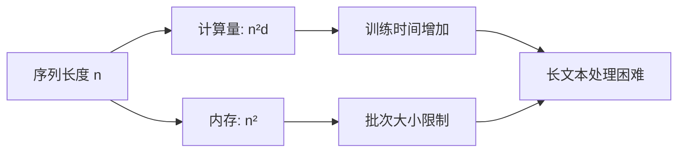

# 13.2 自注意力机制的数学推导

> **设计思想**：深入理解自注意力机制的数学原理，掌握Scaled Dot-Product Attention的实现

## 本节概述

在上一节中，我们从直觉角度理解了注意力机制的基本概念。本节将深入探讨自注意力机制的数学原理，详细推导Scaled Dot-Product Attention的计算过程，并分析其复杂度和优化策略。

自注意力机制是Transformer架构的核心组件，它允许序列中的每个位置关注序列中的所有位置（包括自己），从而捕获序列内部的复杂依赖关系。

## 学习目标

完成本节学习后，你将：

- ✅ **掌握自注意力机制的数学公式**：理解Scaled Dot-Product Attention的数学推导
- ✅ **理解注意力分数的计算方法**：掌握相似度度量的不同方式
- ✅ **掌握Softmax归一化的作用**：理解概率分布的生成过程
- ✅ **分析自注意力的计算复杂度**：理解O(n²)问题及其影响
- ✅ **实现基础的自注意力机制**：能够编写简单的自注意力代码

## Scaled Dot-Product Attention公式推导

### 基本定义

Scaled Dot-Product Attention是Transformer中使用的注意力机制,其核心思想是通过缩放的点积来计算注意力分数。其数学定义如下:

```
Attention(Q, K, V) = softmax(QKᵀ/√dₖ) V
```

**参数解释**:
- **Q(Query矩阵)**: 形状为(n, dₖ),其中n是query序列的长度,dₖ是key的维度
- **K(Key矩阵)**: 形状为(m, dₖ),其中m是key/value序列的长度
- **V(Value矩阵)**: 形状为(m, dᵥ),其中dᵥ是value的维度
- **dₖ**: Key的维度,也是缩放因子的根据

**矩阵维度变化**:


### 详细计算步骤

**步骤1: 矩阵乘法 - 计算注意力分数**

首先计算QKᵀ,得到形状为(n, m)的注意力分数矩阵。这一步的物理意义是计算每个query与每个key之间的相似度。

**数学推导**:

对于第i个query和第j个key:
```
scoreᵢⱼ = qᵢ · kⱼ = Σₖ(qᵢₖ × kⱼₖ)
```

这是一个点积计算,当两个向量方向一致且模长较大时,点积值较大;当方向正交时,点积值接近0。

**步骤2: 缩放操作 - 方差稳定**

将注意力分数除以√dₖ,防止softmax函数进入饱和区域。这是一个关键的技术细节。

**为什么需要缩放**(详细分析见下一节):
- 点积的方差与dₖ成正比
- 当dₖ较大时,点积值的方差也很大
- 大的方差会导致softmax输入值过大或过小
- 除以√dₖ可以将方差控制到1左右

**步骤3: Softmax归一化 - 概率分布**

对每一行应用softmax函数,得到注意力权重矩阵。这一步将原始分数转换为概率分布。

对于第i个query:
```
αᵢⱼ = softmax(scoreᵢⱼ/√dₖ) = exp(scoreᵢⱼ/√dₖ) / Σⱼ exp(scoreᵢⱼ/√dₖ)
```

此时满足: Σⱼ αᵢⱼ = 1, 且 0 ≤ αᵢⱼ ≤ 1

**步骤4: 加权求和 - 信息聚合**

将注意力权重矩阵与V相乘,得到最终的输出。这一步实际上是对value进行加权求和。

对于第i个query的输出:
```
outputᵢ = Σⱼ αᵢⱼ × vⱼ
```

这是所有value的加权平均,权重由注意力分数决定。

### 为什么需要缩放因子

这是Scaled Dot-Product Attention中最重要的设计细节,需要深入理解。

**问题分析**:

假设查询向量q和键向量k的各个维度都是独立同分布的随机变量,均值为0,方差为1。

点积值的期望值:
```
E[q · k] = E[Σᵢ qᵢkᵢ] = Σᵢ E[qᵢ]E[kᵢ] = 0
```

点积值的方差:
```
Var[q · k] = Var[Σᵢ qᵢkᵢ] = Σᵢ Var[qᵢkᵢ] = dₖ × Var[q₁]Var[k₁] = dₖ
```

**关键发现**: 点积值的方差与dₖ成正比!

**Softmax饱和问题**:

当输入softmax的值方差较大时:
```
softmax([0.1, 0.2, 10.0]) ≈ [0.0000, 0.0000, 1.0000]
```

此时softmax饱和,梯度接近0,导致训练困难。

**解决方案**:

除以√dₖ后,点积值的方差变为:
```
Var[q · k / √dₖ] = Var[q · k] / dₖ = dₖ / dₖ = 1
```

这样就将方差稳定在1左右,使softmax函数工作在梯度较大的区域。

**实验验证**:
```
当dₖ=64时:
- 不缩放: 点积值范围 [-25, 25], 方差=64
- 缩放后: 点积值范围 [-3.1, 3.1], 方差=1

当dₖ=512时:
- 不缩放: 点种值范围 [-72, 72], 方差=512
- 缩放后: 点积值范围 [-3.2, 3.2], 方差=1
```

## 注意力分数的计算方法

注意力分数是衡量Query和Key相似度的关键,不同的计算方法会影响模型的表达能力和计算效率。

### 点积注意力(Dot-Product Attention)

**数学形式**:
```
score(q, k) = q · k = Σᵢ qᵢ × kᵢ
```

**优势**:
1. **计算简单高效**: 可以利用高度优化的矩阵乘法库(BLAS)
2. **并行化支持**: 矩阵运算天然适合GPU加速
3. **内存友好**: 不需要额外的参数存储

**局限性**:
- 对向量长度敏感,需要缩放处理
- 无法学习更复杂的相似度度量

**几何解释**:
点积值与两个向量的夹角余弦值和模长相关:
```
q · k = |q| × |k| × cos(θ)
```
- 当两个向量方向一致(θ=0)时,cos(θ)=1,点积最大
- 当两个向量正交(θ=90°)时,cos(θ)=0,点积为0
- 当两个向量方向相反(θ=180°)时,cos(θ)=-1,点积最小

### 加性注意力(Additive Attention)

**数学形式**:
```
score(q, k) = vᵀ tanh(W⦑ q + Wₖ k)
```

其中W⦑、Wₖ和v是可学习的参数。这种方法最早由Bahdanau等人在2015年提出。

**优势**:
1. **表达能力强**: 通过可学习的参数可以学习复杂的相似度度量
2. **灵活性高**: 可以处理不同维度的query和key
3. **理论基础**: 在理论上更强大(通用逗近定理)

**局限性**:
- 计算复杂度较高
- 需要额外的参数存储
- 训练速度较慢

**实际应用**:
在Transformer之前的序列模型中广泛使用,但现在基本被点积注意力取代。

### 余弦相似度注意力(Cosine Similarity Attention)

**数学形式**:
```
score(q, k) = (q · k) / (||q|| × ||k||) = cos(θ)
```

**优势**:
1. **对长度不敏感**: 只关注方向,不关注模长
2. **数值稳定**: 相似度值始终在[-1, 1]范围内
3. **不需缩放**: 不受维度影响

**局限性**:
- 需要额外计算范数(平方根)
- 丢失了模长信息
- 实践中效果不如Scaled Dot-Product

### 三种方法对比

| 特性 | 点积注意力 | 加性注意力 | 余弦相似度 |
|------|------------|------------|------------|
| 计算复杂度 | O(n²d) | O(n²d) | O(n²d) |
| 参数量 | 0 | 2d²+d | 0 |
| 表达能力 | 中 | 强 | 弱 |
| 计算效率 | 高 | 低 | 中 |
| 实际使用 | ★★★★★ | ★★ | ★ |

**结论**: Transformer选择点积注意力是综合考虑了计算效率、表达能力和实际效果后的最优选择。

## Softmax归一化的作用

### 概率分布生成

Softmax函数将任意实数向量转换为概率分布，确保所有注意力权重的和为1：

```
softmax(x_i) = exp(x_i) / Σ_j exp(x_j)
```

### 梯度特性

Softmax函数具有良好的梯度特性，便于反向传播训练。当某个元素的值远大于其他元素时，其对应的概率接近1，其他元素的概率接近0。

### 温度参数

可以通过引入温度参数T来控制Softmax的"锐度"：

```
softmax(x_i/T) = exp(x_i/T) / Σ_j exp(x_j/T)
```

当T较小时，概率分布更加尖锐；当T较大时，概率分布更加平滑。

## 自注意力机制的实现

### 架构设计

自注意力机制的实现包含以下几个关键组件:



**核心组件说明**:

1. **投影矩阵(Wₑ, Wₖ, Wᵥ)**: 将输入映射到Query、Key、Value空间
2. **注意力计算核心**: 计算相似度、归一化、加权求和
3. **输出投影(Wₒ)**: 将注意力输出映射回原始维度

### 核心代码示例

为了更好地理解自注意力的实现,下面给出简化的核心代码(已省略详细的异常处理和优化):

```java
public Variable forward(Variable input) {
    // 步骤1: 线性投影 - 生成Q, K, V
    Variable Q = wQ.forward(input);  // (batch, seq_len, d_key)
    Variable K = wK.forward(input);  
    Variable V = wV.forward(input);  // (batch, seq_len, d_value)
    
    // 步骤2: 计算注意力分数 = Q × Kᵀ
    Variable scores = Q.dot(K.transpose(-2, -1));  
    
    // 步骤3: 缩放
    scores = scores.div(Math.sqrt(dKey));          
    
    // 步骤4: Softmax归一化
    Variable weights = scores.softmax(-1);
    
    // 步骤5: 加权求和
    Variable output = weights.dot(V);      
    
    // 步骤6: 输出投影
    return wO.forward(output);
}
```

**关键设计说明**:

- **共享输入**: Q、K、V都来自同一个输入序列(自注意力的特征)
- **可学习投影**: 通过不同的线性投影矩阵学习不同的表示
- **缩放因子**: 保证梯度稳定性的关键
- **输出投影**: 将注意力结果映射回模型维度

## 计算复杂度分析

### 时间复杂度详细分析

自注意力机制的时间复杂度为**O(n²d)**,其中n是序列长度,d是向量维度。让我们详细分析每个计算步骤的复杂度:

**步骤1: QKᵀ计算**
```
Q: (n, d) × Kᵀ: (d, n) = (n, n)
时间复杂度: O(n²d)
```
这是主要的计算开销,需要n²次点积,每次点积需要d次乘法。

**步骤2: Softmax计算**
```
输入: (n, n)
时间复杂度: O(n²)
```
需要对n²个元素计算exp和归一化。

**步骤3: 与V相乘**
```
Weights: (n, n) × V: (n, d) = (n, d)
时间复杂度: O(n²d)
```
同样需要n²次点积操作。

**总计**:
```
T(n) = O(n²d) + O(n²) + O(n²d) = O(n²d)
```

### 空间复杂度分析

自注意力机制的空间复杂度主要来自于存储**注意力权重矩阵**:

```
注意力权重矩阵: (n, n)
空间复杂度: O(n²)
```

**存储需求示例**:
| 序列长度 | 注意力矩阵大小 | 存储需求(float32) |
|---------|--------------|------------------|
| 128 | 128×128 | 64 KB |
| 512 | 512×512 | 1 MB |
| 1024 | 1024×1024 | 4 MB |
| 4096 | 4096×4096 | 64 MB |
| 16384 | 16384×16384 | 1 GB |

### O(n²)问题的影响

**实际影响**:

随着序列长度的增加,自注意力机制的计算和存储开销会**二次方增长**:



**具体限制**:

1. **GPU内存限制**: 
   - 12GB GPU可处理的最大序列长度约为4096
   - 超过此长度需要特殊优化

2. **训练速度**: 
   - 序列长度翻倍,训练时间增加4倍
   - 限制了模型在长文本任务上的应用

3. **推理延迟**: 
   - 生成式任务需要多步自回归,每步都要计算注意力
   - 长序列会导致明显的延迟

### 与RNN的复杂度对比

| 模型 | 时间复杂度 | 空间复杂度 | 最小序列操作 | 长距离路径 |
|------|----------|----------|--------------|------------|
| RNN | O(nd²) | O(d) | O(n) | O(n) |
| Self-Attention | O(n²d) | O(n²) | O(1) | O(1) |

**关键观察**:
- Self-Attention在序列较短时（n < d）效率更高
- RNN在序列较长时（n > d）内存效率更高
- Self-Attention的最大优势是长距离路径为O(1)

## 优化策略

### 1. 稀疏注意力(Sparse Attention)

**核心思想**: 不计算所有位置之间的注意力,只计算部分重要的关系。

**常见模式**:

1. **局部注意力**: 每个位置只关注固定窗口内的位置
   ```
   复杂度: O(n²d) → O(nwd) (其中w是窗口大小)
   ```

2. **步长注意力**: 每个位置关注固定步长的位置
   ```
   复杂度: O(n²d) → O(nd√n)
   ```

3. **全局+局部**: 部分位置关注全局,其余只关注局部
   ```
   代表模型: Longformer, BigBird
   ```

### 2. 线性注意力(Linear Attention)

**核心思想**: 通过数学变换将复杂度从O(n²)降低到O(n)。

**数学原理**:
利用结合律改变计算顺序:
```
Attention(Q, K, V) = softmax(QKᵀ)V
                   ≈ Q · φ(K)ᵀ · φ(V)  // 线性化
```

**代表工作**:
- Performer (使用FAVOR+算法)
- Linear Transformer
- FNet (使用傅里叶变换)

### 3. 内存优化

**梯度检查点(Gradient Checkpointing)**:
- 不存储中间激活值,反向传播时重计算
- 以计算换存储,可处理更长序列

**分块计算**:
- 将序列分块处理,减少峰值内存
- Flash Attention等高效实现

**混合精度**:
- 使用FP16或BF16减少内存占用
- 配合梯度缩放保证训练稳定性

## 本节小结

本节深入探讨了自注意力机制的数学原理和实现细节，我们学习了：

1. **Scaled Dot-Product Attention的数学推导**：理解了注意力计算的核心公式
2. **注意力分数的计算方法**：掌握了点积、加性、余弦相似度等不同计算方式
3. **Softmax归一化的作用**：理解了概率分布生成和梯度特性
4. **自注意力机制的实现**：掌握了基础的代码实现方法
5. **计算复杂度分析**：理解了O(n²)问题及其影响

在下一节中，我们将学习多头注意力机制，了解如何通过并行处理不同类型的注意力信息来提升模型性能。