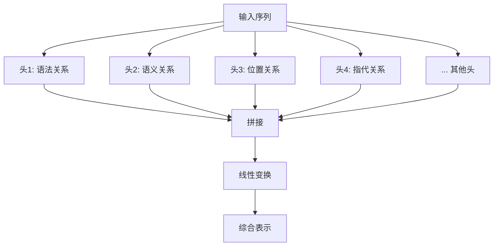
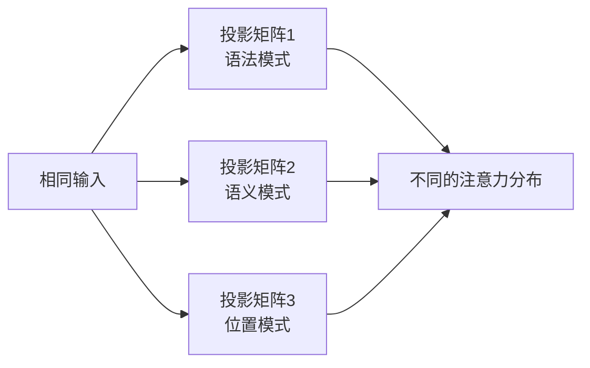
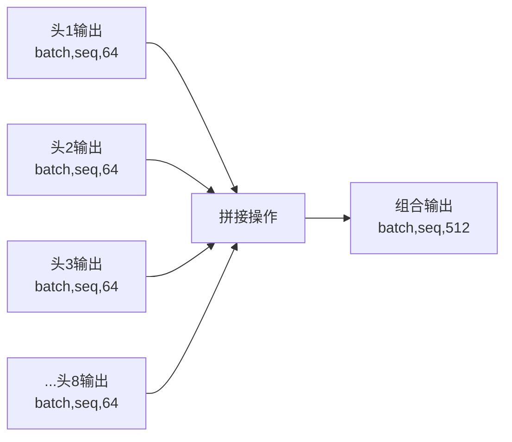
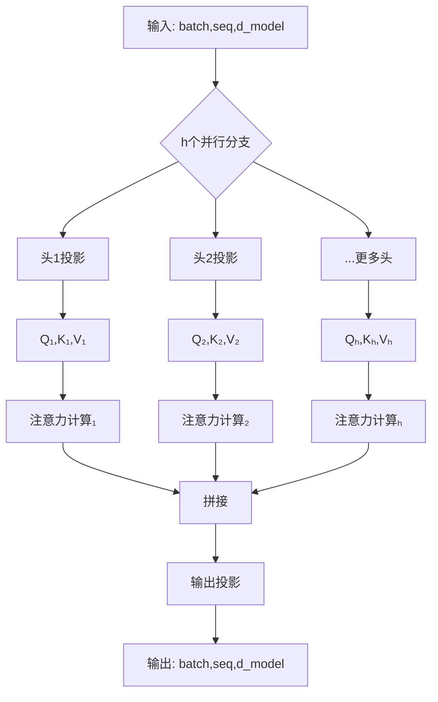

# 13.3 多头注意力：并行处理不同信息

> **设计思想**：掌握多头注意力的设计思想，理解并行处理不同类型关系的优势

## 本节概述

单头注意力机制虽然强大，但只能捕获序列中的一种类型的依赖关系。为了增强模型的表达能力，Transformer引入了多头注意力机制，通过并行计算多个注意力头来捕获不同类型的信息。本节将深入探讨多头注意力的设计动机、实现细节和优势。

## 学习目标

完成本节学习后，你将：

- ✅ **理解多头注意力的设计动机**：掌握捕获不同类型关系的需求
- ✅ **掌握多头注意力的实现细节**：理解头部投影矩阵的作用和初始化
- ✅ **学会多头输出的处理方法**：掌握拼接和线性变换的过程
- ✅ **具备注意力头分析能力**：能够可视化和分析不同注意力头的作用
- ✅ **实现完整的多头注意力机制**：能够编写多头注意力的完整代码

## 多头注意力的设计动机

### 单头注意力的局限性

**表达能力的瓶颈**:

单头注意力机制虽然强大,但其表达能力有限。它只能学习一种类型的注意力模式,难以同时捕捉不同类型的依赖关系。

**具体限制**:

1. **语法依赖**: 主谓宾、定语从句等语法结构关系
   - 例如: "我们昨天讨论的那个**问题**已经**解决**了"
   - 需要关注"问题"和"解决"的主谓关系

2. **语义依赖**: 同义词、反义词、上下位等语义关系
   - 例如: "这辆**车**非常快,那辆**汽车**也不错"
   - 需要关注"车"和"汽车"的同义关系

3. **位置依赖**: 相邻词、固定距离等位置关系
   - 例如: 短语结构"kick the bucket"
   - 需要关注相邻词的组合关系

4. **指代依赖**: 代词与其指代对象的关系
   - 例如: "John说**他**很累"
   - 需要关注"他"和"John"的指代关系

**为什么单头难以兼顾**:

单个注意力头只有一组投影矩阵(Wₑ, Wₖ, Wᵥ),在优化过程中往往会收敛到某种占主导地位的模式,而忽略其他类型的关系。这就像一个人只能专注于一件事情,难以分心处理多个任务。

### 多头注意力的优势

**核心思想**: 通过并行计算多个注意力头,每个头可以专注于捕捉特定类型的依赖关系。



**多头机制的四大优势**:

1. **并行处理多样性**
   - 多个头可以并行计算,提高计算效率
   - 利用GPU的并行计算能力
   - 理论上可以达到线性加速

2. **多样性捕捉能力**
   - 不同头可以学习不同类型的依赖关系
   - 提供了模型的"多视角"理解能力
   - 实现了一种集成学习的效果

3. **鲁棒性增强**
   - 即使某些头失效,其他头仍能提供有效信息
   - 类似于集成学习中的投票机制
   - 提高了模型的稳定性

4. **表示能力提升**
   - 组合多个头的信息可以表示更复杂的模式
   - 相当于增加了模型的表达维度
   - 不增加计算复杂度的情况下提升性能

### 设计灵感来源

多头注意力的设计灵感来源于多个方面:

1. **计算机视觉**: CNN中的多通道卷积
2. **集成学习**: 多个弱分类器的组合
3. **神经科学**: 大脑中不同区域并行处理信息

## 多头注意力的实现细节

### 架构设计

多头注意力的基本架构包括以下几个步骤：

1. **线性投影**：将输入分别投影到多个头的Query、Key、Value空间
2. **并行计算**：在每个头上独立计算注意力
3. **输出拼接**：将所有头的输出拼接在一起
4. **线性变换**：通过线性变换将拼接后的输出映射到目标维度

### 数学表示

多头注意力的数学表示如下：

```
MultiHead(Q, K, V) = Concat(head_1, head_2, ..., head_h)W^O

其中 head_i = Attention(QW_i^Q, KW_i^K, VW_i^V)

W_i^Q ∈ R^{d_model × d_k}
W_i^K ∈ R^{d_model × d_k}
W_i^V ∈ R^{d_model × d_v}
W^O ∈ R^{hd_v × d_model}
```

### 参数设置

在标准的Transformer中，通常设置：
- h = 8（头数）
- d_model = 512（模型维度）
- d_k = d_v = 64（每个头的Key和Value维度）

这样每个头的参数数量为512×64×3=98,304，总参数数量与单头注意力相当。

## 头部投影矩阵的作用和初始化

### 投影矩阵的三大作用

每个注意力头都有独立的投影矩阵(Wᵢᵠ, Wᵢᴷ, Wᵢⱽ),这些矩阵在多头注意力机制中扮演关键角色:

**1. 特征空间变换**
- 将输入从d_model维度映射到d_k维度的子空间
- 每个头学习不同的特征表示
- 类似于在不同角度观察同一个对象

**2. 关注模式分化**


不同的投影矩阵会产生不同的注意力关注模式:
- 头1可能关注相邻词的关系
- 头2可能关注主谓关系
- 头3可能关注远距离依赖

**3. 信息提取专业化**
- 每个头可以专注于提取特定类型的信息
- 形成功能分工,类似专家系统
- 提高整体模型的表达能力

### 初始化策略详解

**Xavier/Glorot初始化**:

投影矩阵通常使用Xavier初始化,其数学原理是:
```
W ~ U(-√(6/(d_in + d_out)), √(6/(d_in + d_out)))
```

**为什么使用Xavier初始化**:
1. **保持方差稳定**: 确保前向传播时激活值的方差不变
2. **避免梯度消失/爆炸**: 反向传播时梯度方差也保持稳定
3. **加速收敛**: 良好的初始化可以显著加快训练速度

**核心实现思路**(简化示例):
```java
// 为每个头创建独立的投影层
for (int i = 0; i < numHeads; i++) {
    queryProjections.add(new LinearLayer(dModel, dHead));
    keyProjections.add(new LinearLayer(dModel, dHead));
    valueProjections.add(new LinearLayer(dModel, dHead));
}
```

## 多头输出的拼接和线性变换

### 输出拼接过程

**拼接操作的意义**:

在计算完所有头的注意力输出后,需要将它们拼接在一起。这个操作的本质是将多个视角的信息融合到一个统一的表示中。



**维度变化**:
- 输入: h个(batch, seq_len, d_head)的张量
- 输出: 一个(batch, seq_len, h × d_head)的张量
- 以Transformer基本配置为例: 8个(batch,seq,64) → (batch,seq,512)

**简化实现思路**:
```java
// 将所有头的输出沿最后一个维度拼接
Variable concatenated = Variable.concat(headOutputs, -1);
```

### 线性变换的必要性

**为什么需要线性变换**:

1. **维度匹配**: 
   - 拼接后的维度为h × d_head
   - 需要映射回原始的d_model维度
   - 保证模型各层维度一致性

2. **信息融合**:
   - 学习如何组合不同头的信息
   - 不是简单的直接拼接,而是加权组合
   - 增加了模型的表达能力

3. **参数学习**:
   - 输出投影矩阵Wᴼ可以学习最优的组合方式
   - 类似于集成学习中的加权投票
   - 让模型自动决定每个头的重要性

**变换公式**:
```
Output = Concat(head₁, ..., headₕ) × Wᴼ
其中 Wᴼ ∈ ℝ^(h×d_v × d_model)
```

**简化实现**:
```java
// 通过线性层映射回目标维度
return outputProjection.forward(concatenated);
```
```

## 完整的多头注意力实现

### 核心架构流程



### 简化代码示例

以下是多头注意力的核心实现逻辑(已精简):

```java
public Variable forward(Variable... inputs) {
    Variable query = inputs[0];
    Variable key = inputs[1];
    Variable value = inputs[2];
    
    List<Variable> headOutputs = new ArrayList<>();
    
    // 步骤1: 并行计算每个头的注意力
    for (int i = 0; i < numHeads; i++) {
        // 线性投影
        Variable Q = queryProjections.get(i).forward(query);
        Variable K = keyProjections.get(i).forward(key);
        Variable V = valueProjections.get(i).forward(value);
        
        // 计算注意力
        Variable headOutput = computeAttention(Q, K, V);
        headOutputs.add(headOutput);
    }
    
    // 步骤2: 拼接所有头的输出
    Variable concatenated = Variable.concat(headOutputs, -1);
    
    // 步骤3: 输出投影
    return outputProjection.forward(concatenated);
}

private Variable computeAttention(Variable Q, Variable K, Variable V) {
    // Scaled Dot-Product Attention
    Variable scores = Q.dot(K.transpose(-2, -1)).div(Math.sqrt(dHead));
    Variable weights = scores.softmax(-1);
    return weights.dot(V);
}
```

**关键设计要点**:
1. 每个头独立计算,可以并行化
2. 所有头共享相同的输入
3. 拼接后通过线性层融合信息
4. 总计算量与单头相当
```

## 注意力头的可视化和分析

### 可视化方法

通过可视化注意力权重矩阵，我们可以分析不同头的关注模式：

```java
public void visualizeAttentionHeads(Variable attentionWeights) {
    // attentionWeights: (batch, num_heads, seq_len, seq_len)
    for (int head = 0; head < numHeads; head++) {
        // 提取第head个头的注意力权重
        Variable headWeights = attentionWeights.slice(1, head);
        
        // 可视化热力图
        plotHeatmap(headWeights.getData(), "Head " + head + " Attention");
    }
}
```

### 头部功能分析

研究表明，不同的注意力头确实会关注不同类型的信息：

1. **语法头**：关注语法结构，如主谓宾关系
2. **指代头**：关注代词与其指代对象的关系
3. **语义头**：关注语义相似的词
4. **位置头**：关注相邻或特定位置的词

## 性能优化策略

### 并行计算优化

多头注意力天然支持并行计算，可以通过以下方式优化：

1. **批量处理**：将多个头的计算合并为批量操作
2. **内存优化**：合理管理中间变量的内存分配
3. **计算融合**：将多个操作融合为单个内核

### 稀疏化策略

对于某些头，可以采用稀疏化策略：

1. **局部注意力**：只关注局部窗口内的位置
2. **稀疏模式**：预定义稀疏的关注模式
3. **自适应稀疏**：根据输入动态调整稀疏模式

## 本节小结

本节深入探讨了多头注意力机制的设计思想和实现细节，我们学习了：

1. **多头注意力的设计动机**：理解了捕获不同类型依赖关系的需求
2. **多头注意力的实现细节**：掌握了线性投影、并行计算、输出拼接等过程
3. **头部投影矩阵的作用**：理解了特征变换和关注模式的形成
4. **多头输出的处理方法**：掌握了拼接和线性变换的技术
5. **注意力头的分析方法**：学会了可视化和分析不同头的作用

多头注意力机制通过并行处理多个注意力头，显著增强了模型的表达能力，是Transformer架构成功的关键因素之一。在下一节中，我们将学习位置编码技术，解决序列建模中的位置信息表示问题。