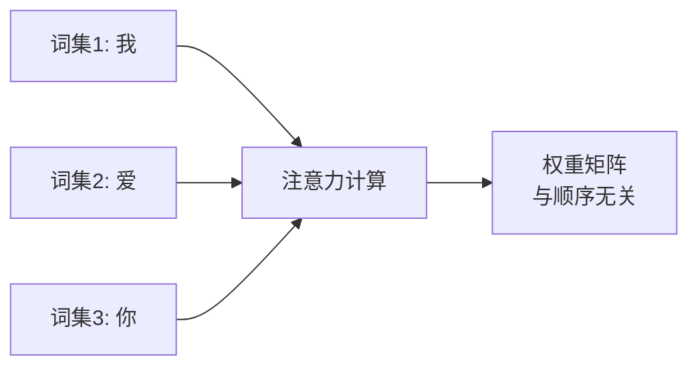
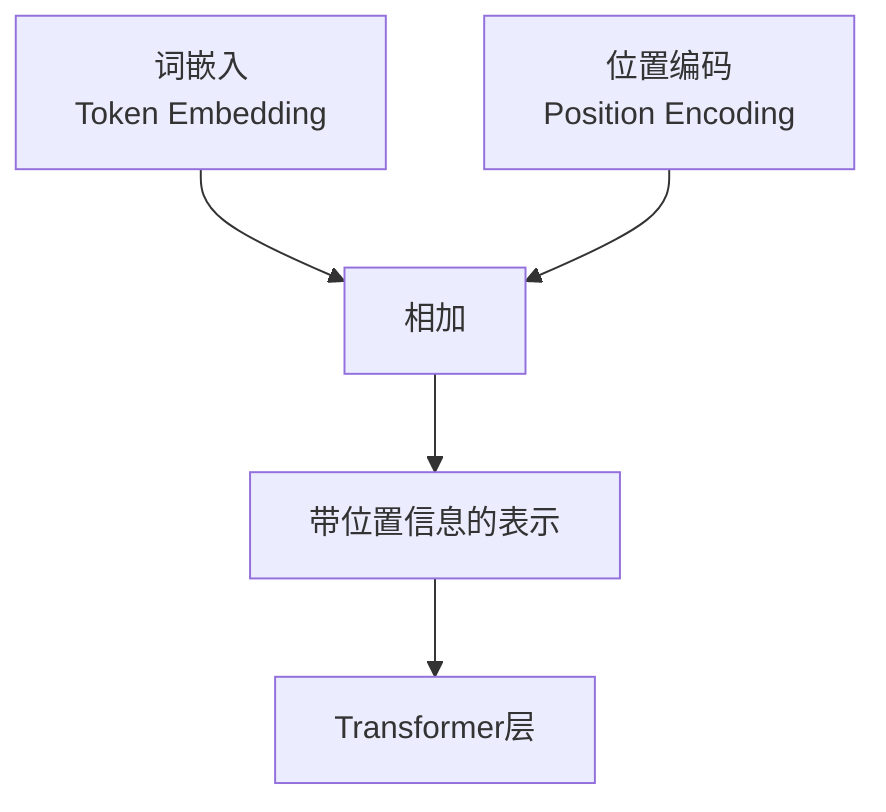
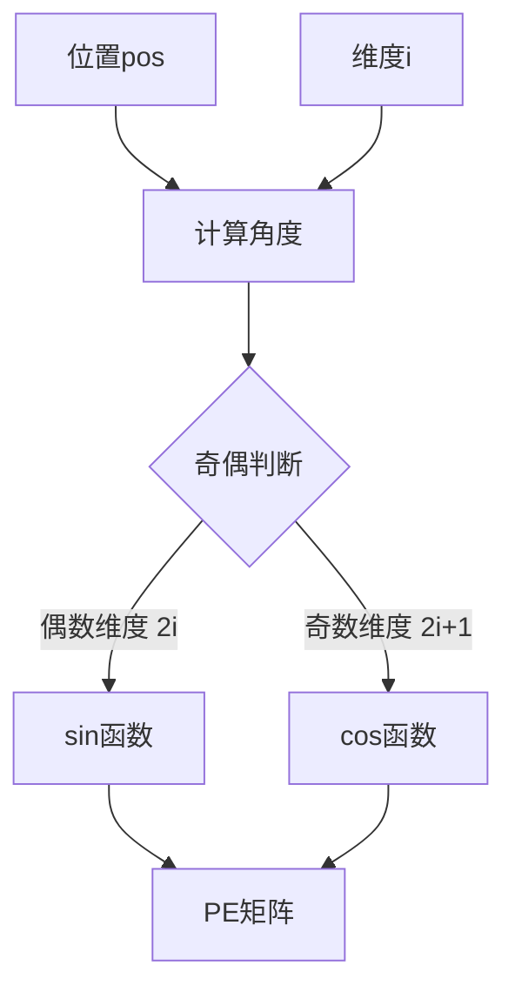

# 13.4 位置编码：序列信息的表示

> **设计思想**：掌握序列建模中的位置信息表示技术，理解Transformer如何处理序列顺序

## 本节概述

Transformer模型完全基于注意力机制，摒弃了传统的循环和卷积结构，这使得它无法像RNN那样通过时间步的顺序来建模序列信息。为了使模型能够利用序列中元素的顺序信息，Transformer引入了位置编码技术。本节将深入探讨位置编码的设计思想、实现方法和优化策略。

## 学习目标

完成本节学习后，你将：

- ✅ **理解位置编码的必要性**：掌握为什么Transformer需要位置编码
- ✅ **掌握正弦余弦位置编码的原理**：理解数学公式和实现细节
- ✅ **学会学习位置编码的实现**：掌握可学习位置编码的方法
- ✅ **理解不同位置编码的比较**：掌握固定vs学习位置编码的优劣
- ✅ **解决长序列位置编码问题**：掌握处理长序列位置编码的策略

## 位置编码的必要性

### Transformer的排列不变性问题

**核心问题**: 注意力机制本身具有**排列不变性**(Permutation Invariance),即对于任意的输入序列排列,注意力计算的结果都是相同的。

**具体示例**:

考虑两个不同顺序的句子:
```
句子1: [我, 爱, 你]  →  表达情感
句子2: [你, 爱, 我]  →  完全不同的意思！
```

但如果没有位置信息,纯粹的自注意力计算会产生相同的注意力权重矩阵，因为:



注意力权重只依赖于词与词之间的相似度,而不依赖于它们的位置。

### 序列信息的重要性

在自然语言处理任务中,序列顺序信息至关重要:

**1. 语法结构依赖顺序**
```
正确: “小明吃了苹果” (主谓宾结构)
错误: “苹果吃了小明” (语义完全不同)
```

**2. 语义理解依赖上下文**
```
句子1: “他先吃饭,然后睡觉” (时间顺序)
句子2: “他先睡觉,然后吃饭” (不同的行为顺序)
```

**3. 指代消解需要位置**
```
“John说他很累”
- “他”通常指代前面出现的“John”
- 位置关系是关键线索
```

**4. 时序关系表达**
```
事件发生顺序:
“首先…然后…最后…”
位置信息帮助理解时间线
```

### 位置编码的解决方案

**核心思想**: 将位置信息直接编码到输入表示中



**设计要求**:
1. 为每个位置分配唯一的编码
2. 编码能够表达相对位置关系
3. 支持外推到更长的序列
4. 与词嵌入的维度匹配

## 正弦余弦位置编码

### 设计思想

正弦余弦位置编码是Transformer论文中提出的经典位置编码方法,其核心设计思想包括:

1. **唯一性**: 为每个位置分配唯一的编码向量
2. **相对位置**: 编码向量能够表达相对位置关系  
3. **外推性**: 支持外推到训练时未见过的序列长度
4. **连续性**: 相邻位置的编码相似,远距离位置的编码差异较大

### 数学公式详解

对于位置pos和维度i,位置编码的计算公式为:

```
PE(pos, 2i)   = sin(pos / 10000^(2i/d_model))
PE(pos, 2i+1) = cos(pos / 10000^(2i/d_model))
```

**参数说明**:
- **pos**: 位置索引,范围为[0, 1, 2, ..., max_len-1]
- **i**: 维度索引,范围为[0, 1, 2, ..., d_model/2-1]
- **d_model**: 模型维度(如512)
- **10000**: 温度参数,控制频率范围

**公式解读**:



**频率分析**:

不同维度使用不同的频率:
- **低维度**(i小): 频率高,变化快,捕捉短距离关系
- **高维度**(i大): 频率低,变化慢,捕捉长距离关系

```
维度0: 频率 = 1/10000^0 = 1      (最快)
维度2: 频率 = 1/10000^(2/512) ≈ 0.97
维度4: 频率 = 1/10000^(4/512) ≈ 0.94
...
维度510: 频率 = 1/10000^(510/512) ≈ 0.0001 (最慢)
```

### 为什么使用正弦和余弦函数

**1. 周期性和唯一性**

正弦和余弦函数的组合可以为每个位置生成唯一的编码:
```
对于位置pos₁ ≠ pos₂,
PE(pos₁) ≠ PE(pos₂)
```

**2. 相对位置的线性表示**

这是最关键的数学性质!根据三角函数的和差公式:
```
sin(α + β) = sin(α)cos(β) + cos(α)sin(β)
cos(α + β) = cos(α)cos(β) - sin(α)sin(β)
```

因此,PE(pos+k)可以表示为PE(pos)的线性函数:
```
PE(pos+k, 2i)   = sin((pos+k)·θᵢ)
                = sin(pos·θᵢ)cos(k·θᵢ) + cos(pos·θᵢ)sin(k·θᵢ)
                = PE(pos,2i)·cos(k·θᵢ) + PE(pos,2i+1)·sin(k·θᵢ)
```

这意味着模型可以学习到**相对位置关系**,而不仅仅是绝对位置。

**3. 有界性**

正弦和余弦函数的值域都是[-1, 1],确保了位置编码的数值稳定性,不会出现过大或过小的值。

**4. 平滑性**

正弦和余弦函数连续且平滑,相邻位置的编码向量相似,这符合自然语言的局部连续性假设。

### 核心实现思路

以下是生成位置编码的核心逻辑(精简版):

```java
private Variable generatePositionalEncoding() {
    float[][] pe = new float[maxLength][dModel];
    
    for (int pos = 0; pos < maxLength; pos++) {
        for (int i = 0; i < dModel; i++) {
            // 计算角度
            double angle = pos / Math.pow(10000, 2.0 * (i / 2) / dModel);
            
            // 偶数维度用sin,奇数维度用cos
            pe[pos][i] = (i % 2 == 0) ? 
                (float) Math.sin(angle) : 
                (float) Math.cos(angle);
        }
    }
    return new Variable(NdArray.of(pe));
}
```

### 位置编码的可视化

正弦余弦位置编码具有美丽的波浪形特征:

```
维度特征可视化:
- 低维度(快速震荡): ～～～～～～～～～～
- 中维度(中速震荡): ∼∿∼∿∼∿∼∿∼∿
- 高维度(缓慢变化): ___∿∿∿∿___
```

**关键观察**:
1. 每个维度都有不同的频率
2. 低维度捕捉短距离模式
3. 高维度捕捉长距离模式
4. 组合起来形成丰富的位置表示


## 学习位置编码

**设计思想**: 将位置编码作为可学习的参数,通过训练来优化位置表示。

### 主要优势
1. **灵活性**: 可以学习最适合任务的位置表示
2. **适应性**: 能够适应特定数据集的特点
3. **表达能力**: 不受固定函数形式的限制

### 核心实现(精简)
```java
// 初始化可学习的位置嵌入
NdArray embeddings = NdArray.randn(new Shape(maxLength, dModel)).mul(0.02f);
this.positionEmbeddings = new Parameter(embeddings);
```


## 固定vs学习位置编码的比较

### 固定位置编码的优势

1. **外推性**：可以处理超过训练序列长度的输入
2. **计算效率**：无需额外的参数和计算
3. **确定性**：相同的输入总是产生相同的位置编码

### 学习位置编码的优势

1. **任务适应性**：可以学习最适合特定任务的位置表示
2. **表达能力**：不受固定函数形式的限制
3. **优化潜力**：可以通过训练进一步优化

### 实验比较

在实际应用中，两种方法的性能往往相当，选择哪种方法主要取决于具体的应用场景：

```java
// 使用固定位置编码
PositionalEncoding fixedPE = new PositionalEncoding("fixed_pe", 1024, 512);

// 使用学习位置编码
LearnedPositionalEncoding learnedPE = new LearnedPositionalEncoding("learned_pe", 1024, 512);
```

## 长序列位置编码问题

### 问题描述

当序列长度超过训练时的最大长度时，固定位置编码可能无法很好地处理。特别是正弦余弦位置编码，在很长的位置上会出现重复模式。

### 解决方案

#### 1. 插值方法

对于学习位置编码，可以通过插值来扩展到更长的序列：

```java
public Variable interpolateToLength(Variable posEmbeddings, int newLength) {
    // 使用线性插值将位置嵌入扩展到新长度
    return interpolate(posEmbeddings, new Shape(newLength, dModel));
}
```

#### 2. 相对位置编码

相对位置编码关注元素之间的相对距离，而不是绝对位置：

```java
public class RelativePositionalEncoding extends Layer {
    private int maxRelativeDistance;
    private Parameter relativeEmbeddings;
    
    public RelativePositionalEncoding(String name, int maxRelativeDistance, int dModel) {
        super(name);
        this.maxRelativeDistance = maxRelativeDistance;
        
        // 初始化相对位置嵌入
        NdArray embeddings = NdArray.randn(new Shape(2 * maxRelativeDistance + 1, dModel)).mul(0.02f);
        this.relativeEmbeddings = new Parameter(embeddings);
        addParam("relative_embeddings", relativeEmbeddings);
    }
    
    // 在注意力计算中使用相对位置信息
    private Variable computeRelativeAttention(Variable Q, Variable K) {
        // 计算相对位置矩阵
        // ... 实现细节
    }
}
```

#### 3. 旋转位置编码（RoPE）

旋转位置编码通过旋转矩阵来编码位置信息，具有良好的外推性：

```java
public class RotaryPositionalEncoding extends Layer {
    // 旋转位置编码实现
    // 通过复数旋转来编码位置信息
}
```

## 位置编码在Transformer中的应用

### 编码器中的应用

在Transformer编码器中，位置编码被添加到词嵌入上：

```java
public class TransformerEncoder extends Layer {
    private TokenEmbedding tokenEmbedding;
    private PositionalEncoding positionalEncoding;
    private List<EncoderLayer> encoderLayers;
    
    @Override
    public Variable forward(Variable... inputs) {
        Variable inputIds = inputs[0];
        
        // 1. 词嵌入
        Variable embeddings = tokenEmbedding.forward(inputIds);
        
        // 2. 位置编码
        Variable posEncoded = positionalEncoding.forward(embeddings);
        
        // 3. 编码器层
        Variable output = posEncoded;
        for (EncoderLayer layer : encoderLayers) {
            output = layer.forward(output);
        }
        
        return output;
    }
}
```

### 解码器中的应用

在Transformer解码器中，位置编码同样被应用到词嵌入上：

```java
public class TransformerDecoder extends Layer {
    private TokenEmbedding tokenEmbedding;
    private PositionalEncoding positionalEncoding;
    private List<DecoderLayer> decoderLayers;
    
    @Override
    public Variable forward(Variable... inputs) {
        Variable inputIds = inputs[0];
        
        // 1. 词嵌入
        Variable embeddings = tokenEmbedding.forward(inputIds);
        
        // 2. 位置编码
        Variable posEncoded = positionalEncoding.forward(embeddings);
        
        // 3. 解码器层
        Variable output = posEncoded;
        for (DecoderLayer layer : decoderLayers) {
            output = layer.forward(output, inputs[1]); // 编码器输出
        }
        
        return output;
    }
}
```

## 本节小结

本节深入探讨了位置编码技术的设计思想和实现方法，我们学习了：

1. **位置编码的必要性**：理解了Transformer为什么需要位置编码
2. **正弦余弦位置编码**：掌握了固定位置编码的数学原理和实现
3. **学习位置编码**：学会了可学习位置编码的实现方法
4. **位置编码的比较**：理解了固定vs学习位置编码的优劣
5. **长序列处理**：掌握了处理长序列位置编码的策略

位置编码是Transformer架构成功的关键技术之一，它使得模型能够在摒弃循环结构的情况下仍然有效处理序列信息。在下一节中，我们将学习Transformer的完整架构，理解各个组件如何协同工作。