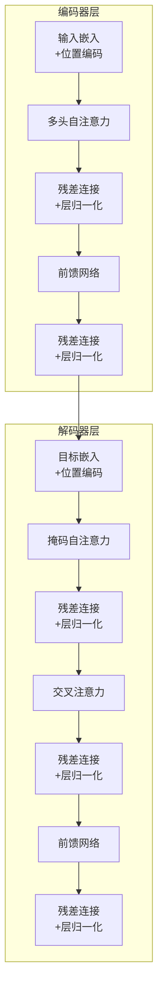

# 13.5 Transformer完整架构解析

> **设计思想**：掌握Transformer的完整架构设计，理解各组件的协同工作机制

## 本节概述

在前面的章节中，我们学习了注意力机制、多头注意力和位置编码等核心技术。本节将把这些技术整合起来，深入解析Transformer的完整架构，包括编码器-解码器结构、残差连接、层归一化、前馈网络等关键组件。通过本节的学习，读者将能够理解并实现完整的Transformer模型。

## 学习目标

完成本节学习后，你将：

- ✅ **掌握Transformer的整体架构**：理解编码器-解码器结构的设计理念
- ✅ **理解残差连接的重要性**：掌握梯度流动和深度网络训练的原理
- ✅ **掌握层归一化的作用**：理解稳定性保障和训练加速的机制
- ✅ **学会前馈网络的实现**：掌握特征变换和非线性增强的技术
- ✅ **实现完整的Transformer架构**：能够编写完整的Transformer模型代码

## Transformer整体架构

### 编码器-解码器结构

Transformer采用经典的编码器-解码器架构，但与传统的RNN或CNN不同，它完全基于注意力机制：

```
输入序列 → 编码器 → 编码表示 → 解码器 → 输出序列
```

#### 编码器结构

编码器由N个相同的层堆叠而成，每层包含两个子层：
1. **多头自注意力层**：捕获输入序列内部的依赖关系
2. **前馈神经网络层**：进行特征变换和非线性增强

#### 解码器结构

解码器也由N个相同的层堆叠而成，但每层包含三个子层：
1. **掩码多头自注意力层**：防止位置关注后续位置
2. **多头交叉注意力层**：关注编码器的输出
3. **前馈神经网络层**：进行特征变换

### 架构图示



## 残差连接和层归一化

### 残差连接的设计思想

残差连接是深度学习中的重要技术，它通过将输入直接添加到输出中，解决了深度网络训练中的梯度消失问题：

```
Output = Layer(Input) + Input
```

#### 梯度流动优化

在反向传播过程中，残差连接提供了梯度的直接通路，使得梯度能够更容易地流向网络的早期层：

```java
// 残差连接的梯度计算
// ∂L/∂Input = ∂L/∂Output × ∂Output/∂Input
//           = ∂L/∂Output × (∂Layer/∂Input + 1)
```

### 层归一化的实现

层归一化通过对每个样本的特征维度进行归一化，减少了内部协变量偏移问题：

```java
public class LayerNormalization extends Layer {
    private int normalizedShape;
    private Parameter weight;
    private Parameter bias;
    
    public LayerNormalization(String name, int normalizedShape) {
        super(name);
        this.normalizedShape = normalizedShape;
        
        // 初始化参数
        this.weight = new Parameter(NdArray.ones(new Shape(normalizedShape)));
        this.bias = new Parameter(NdArray.zeros(new Shape(normalizedShape)));
        
        addParam("weight", weight);
        addParam("bias", bias);
    }
    
    @Override
    public Variable forward(Variable... inputs) {
        Variable input = inputs[0];
        
        // 计算均值和方差
        Variable mean = input.mean(-1, true);  // 保持维度
        Variable var = input.variance(-1, true);  // 保持维度
        
        // 归一化
        Variable normalized = input.sub(mean).div(var.add(1e-5f).sqrt());
        
        // 缩放和平移
        return normalized.mul(weight.getValue()).add(bias.getValue());
    }
}
```

### 子层连接结构

在Transformer中，每个子层都采用以下结构：

```java
public class SublayerConnection extends Layer {
    private LayerNormalization layerNorm;
    private Dropout dropout;
    
    public SublayerConnection(String name, int size) {
        super(name);
        this.layerNorm = new LayerNormalization("layer_norm", size);
        this.dropout = new Dropout("dropout", 0.1f);
    }
    
    public Variable forward(Variable input, Function<Variable, Variable> sublayer) {
        // 残差连接 + 层归一化
        return input.add(dropout.forward(sublayer.apply(layerNorm.forward(input))));
    }
}
```

## 前馈神经网络

### 设计思想

前馈神经网络是Transformer中的重要组件，它通过对每个位置独立地应用相同的变换来增强模型的表达能力：

```
FFN(x) = max(0, xW_1 + b_1)W_2 + b_2
```

### 实现细节

```java
public class PositionwiseFeedForward extends Layer {
    private LinearLayer w1;
    private LinearLayer w2;
    private Dropout dropout;
    
    public PositionwiseFeedForward(String name, int dModel, int dFF, float dropoutRate) {
        super(name);
        // 通常 dFF = 4 * dModel
        this.w1 = new LinearLayer(dModel, dFF);
        this.w2 = new LinearLayer(dFF, dModel);
        this.dropout = new Dropout("dropout", dropoutRate);
    }
    
    @Override
    public Variable forward(Variable... inputs) {
        Variable x = inputs[0];
        
        // 第一层线性变换 + ReLU激活
        x = w1.forward(x).relu();
        
        // Dropout
        x = dropout.forward(x);
        
        // 第二层线性变换
        return w2.forward(x);
    }
}
```

## 编码器实现

### 编码器层

```java
public class EncoderLayer extends Layer {
    private MultiHeadAttention selfAttention;
    private PositionwiseFeedForward feedForward;
    private SublayerConnection[] sublayerConnections;
    
    public EncoderLayer(String name, int size, int numHeads, int dFF, float dropoutRate) {
        super(name);
        
        this.selfAttention = new MultiHeadAttention("self_attn", numHeads, size);
        this.feedForward = new PositionwiseFeedForward("ff", size, dFF, dropoutRate);
        this.sublayerConnections = new SublayerConnection[] {
            new SublayerConnection("sublayer_0", size),
            new SublayerConnection("sublayer_1", size)
        };
    }
    
    @Override
    public Variable forward(Variable... inputs) {
        Variable x = inputs[0];
        Variable mask = inputs[1];
        
        // 多头自注意力子层
        x = sublayerConnections[0].forward(x, 
            input -> selfAttention.forward(input, input, input, mask));
        
        // 前馈网络子层
        x = sublayerConnections[1].forward(x, 
            input -> feedForward.forward(input));
        
        return x;
    }
}
```

### 完整编码器

```java
public class TransformerEncoder extends Layer {
    private List<EncoderLayer> layers;
    private LayerNormalization norm;
    
    public TransformerEncoder(String name, int numLayers, int dModel, int numHeads, 
                            int dFF, float dropoutRate) {
        super(name);
        
        this.layers = new ArrayList<>();
        for (int i = 0; i < numLayers; i++) {
            layers.add(new EncoderLayer("layer_" + i, dModel, numHeads, dFF, dropoutRate));
        }
        
        this.norm = new LayerNormalization("norm", dModel);
    }
    
    @Override
    public Variable forward(Variable... inputs) {
        Variable x = inputs[0];
        Variable mask = inputs[1];
        
        // 逐层处理
        for (EncoderLayer layer : layers) {
            x = layer.forward(x, mask);
        }
        
        // 最终归一化
        return norm.forward(x);
    }
}
```

## 解码器实现

### 解码器层

```java
public class DecoderLayer extends Layer {
    private MultiHeadAttention selfAttention;
    private MultiHeadAttention srcAttention;
    private PositionwiseFeedForward feedForward;
    private SublayerConnection[] sublayerConnections;
    
    public DecoderLayer(String name, int size, int numHeads, int dFF, float dropoutRate) {
        super(name);
        
        this.selfAttention = new MultiHeadAttention("self_attn", numHeads, size);
        this.srcAttention = new MultiHeadAttention("src_attn", numHeads, size);
        this.feedForward = new PositionwiseFeedForward("ff", size, dFF, dropoutRate);
        this.sublayerConnections = new SublayerConnection[] {
            new SublayerConnection("sublayer_0", size),
            new SublayerConnection("sublayer_1", size),
            new SublayerConnection("sublayer_2", size)
        };
    }
    
    @Override
    public Variable forward(Variable... inputs) {
        Variable x = inputs[0];
        Variable memory = inputs[1];  // 编码器输出
        Variable srcMask = inputs[2];
        Variable tgtMask = inputs[3];
        
        // 掩码自注意力子层
        x = sublayerConnections[0].forward(x, 
            input -> selfAttention.forward(input, input, input, tgtMask));
        
        // 交叉注意力子层
        x = sublayerConnections[1].forward(x, 
            input -> srcAttention.forward(input, memory, memory, srcMask));
        
        // 前馈网络子层
        x = sublayerConnections[2].forward(x, 
            input -> feedForward.forward(input));
        
        return x;
    }
}
```

### 完整解码器

```java
public class TransformerDecoder extends Layer {
    private List<DecoderLayer> layers;
    private LayerNormalization norm;
    
    public TransformerDecoder(String name, int numLayers, int dModel, int numHeads, 
                            int dFF, float dropoutRate) {
        super(name);
        
        this.layers = new ArrayList<>();
        for (int i = 0; i < numLayers; i++) {
            layers.add(new DecoderLayer("layer_" + i, dModel, numHeads, dFF, dropoutRate));
        }
        
        this.norm = new LayerNormalization("norm", dModel);
    }
    
    @Override
    public Variable forward(Variable... inputs) {
        Variable x = inputs[0];
        Variable memory = inputs[1];  // 编码器输出
        Variable srcMask = inputs[2];
        Variable tgtMask = inputs[3];
        
        // 逐层处理
        for (DecoderLayer layer : layers) {
            x = layer.forward(x, memory, srcMask, tgtMask);
        }
        
        // 最终归一化
        return norm.forward(x);
    }
}
```

## Transformer变体

### Encoder-only架构

BERT等模型采用Encoder-only架构，适用于理解任务：

```java
public class BERTModel extends Model {
    private TransformerEncoder encoder;
    
    public BERTModel(BERTConfig config) {
        super("BERT");
        this.encoder = new TransformerEncoder("encoder", config.getNumLayers(), 
                                            config.getHiddenSize(), config.getNumHeads(), 
                                            config.getIntermediateSize(), config.getDropoutRate());
    }
    
    @Override
    public Variable forward(Variable... inputs) {
        Variable inputIds = inputs[0];
        Variable attentionMask = inputs[1];
        
        // 词嵌入 + 位置编码
        Variable embeddings = embedding.forward(inputIds);
        embeddings = positionalEncoding.forward(embeddings);
        
        // 编码器处理
        return encoder.forward(embeddings, attentionMask);
    }
}
```

### Decoder-only架构

GPT等模型采用Decoder-only架构，适用于生成任务：

```java
public class GPTModel extends Model {
    private TransformerDecoder decoder;
    
    public GPTModel(GPTConfig config) {
        super("GPT");
        // 注意：这里使用解码器实现，但不使用交叉注意力
        this.decoder = new TransformerDecoder("decoder", config.getNumLayers(), 
                                            config.getHiddenSize(), config.getNumHeads(), 
                                            config.getIntermediateSize(), config.getDropoutRate());
    }
    
    @Override
    public Variable forward(Variable... inputs) {
        Variable inputIds = inputs[0];
        
        // 词嵌入 + 位置编码
        Variable embeddings = embedding.forward(inputIds);
        embeddings = positionalEncoding.forward(embeddings);
        
        // 因果掩码
        Variable causalMask = createCausalMask(inputIds.getShape());
        
        // 解码器处理（只使用自注意力）
        return decoder.forward(embeddings, null, null, causalMask);
    }
}
```

## 实践项目：Transformer机器翻译系统

### 项目架构

```java
public class TransformerTranslator extends Model {
    private TokenEmbedding srcEmbedding;
    private TokenEmbedding tgtEmbedding;
    private PositionalEncoding srcPosEncoding;
    private PositionalEncoding tgtPosEncoding;
    private TransformerEncoder encoder;
    private TransformerDecoder decoder;
    private LinearLayer outputLayer;
    
    public TransformerTranslator(TransformerConfig config) {
        super("TransformerTranslator");
        
        // 源语言嵌入
        this.srcEmbedding = new TokenEmbedding("src_embedding", 
                                             config.getSrcVocabSize(), config.getDModel());
        this.srcPosEncoding = new PositionalEncoding("src_pos_encoding", 
                                                   config.getMaxSeqLen(), config.getDModel());
        
        // 目标语言嵌入
        this.tgtEmbedding = new TokenEmbedding("tgt_embedding", 
                                             config.getTgtVocabSize(), config.getDModel());
        this.tgtPosEncoding = new PositionalEncoding("tgt_pos_encoding", 
                                                   config.getMaxSeqLen(), config.getDModel());
        
        // 编码器和解码器
        this.encoder = new TransformerEncoder("encoder", config.getNumLayers(), 
                                            config.getDModel(), config.getNumHeads(), 
                                            config.getDFF(), config.getDropoutRate());
        this.decoder = new TransformerDecoder("decoder", config.getNumLayers(), 
                                            config.getDModel(), config.getNumHeads(), 
                                            config.getDFF(), config.getDropoutRate());
        
        // 输出层
        this.outputLayer = new LinearLayer(config.getDModel(), config.getTgtVocabSize());
    }
    
    @Override
    public Variable forward(Variable... inputs) {
        Variable srcIds = inputs[0];
        Variable tgtIds = inputs[1];
        
        // 源语言处理
        Variable srcEmbeds = srcEmbedding.forward(srcIds);
        srcEmbeds = srcPosEncoding.forward(srcEmbeds);
        Variable srcMask = createPaddingMask(srcIds);
        Variable encoderOutput = encoder.forward(srcEmbeds, srcMask);
        
        // 目标语言处理
        Variable tgtEmbeds = tgtEmbedding.forward(tgtIds);
        tgtEmbeds = tgtPosEncoding.forward(tgtEmbeds);
        Variable tgtMask = createCombinedMask(tgtIds);
        Variable decoderOutput = decoder.forward(tgtEmbeds, encoderOutput, srcMask, tgtMask);
        
        // 输出预测
        return outputLayer.forward(decoderOutput);
    }
}
```

## 本节小结

本节深入解析了Transformer的完整架构，我们学习了：

1. **Transformer整体架构**：理解了编码器-解码器结构的设计理念
2. **残差连接和层归一化**：掌握了梯度流动优化和稳定性保障机制
3. **前馈神经网络**：学会了特征变换和非线性增强的实现
4. **编码器和解码器实现**：掌握了完整Transformer组件的代码实现
5. **Transformer变体**：理解了Encoder-only和Decoder-only架构的应用

通过本节的学习，我们已经掌握了Transformer架构的核心技术，为后续学习GPT系列模型奠定了坚实基础。Transformer的模块化设计和并行化处理能力使其成为现代深度学习架构的重要基石。

在下一章中，我们将深入学习GPT系列模型，掌握大语言模型的核心技术。