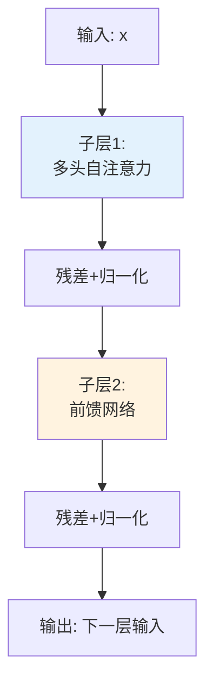
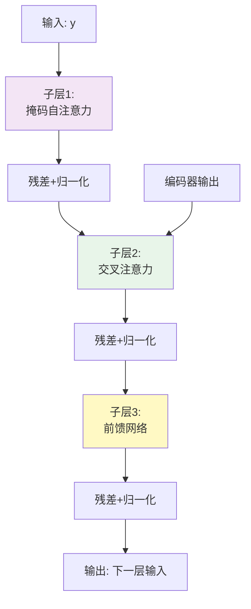
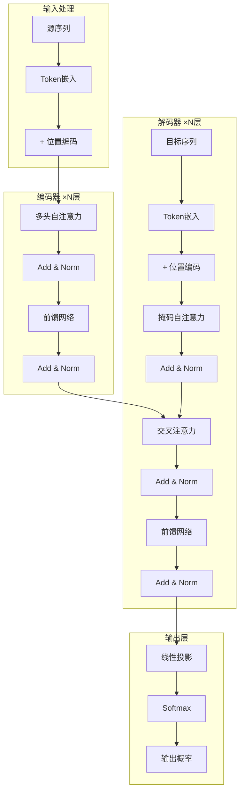
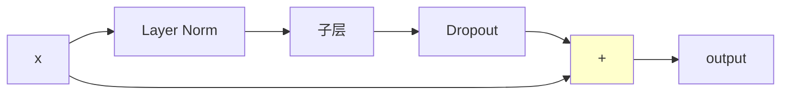
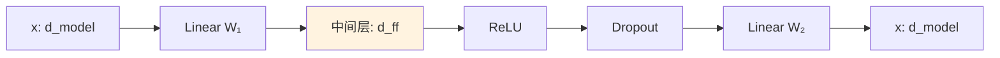

# 13.5 Transformer完整架构解析

> **设计思想**：掌握Transformer的完整架构设计，理解各组件的协同工作机制

## 本节概述

在前面的章节中，我们学习了注意力机制、多头注意力和位置编码等核心技术。本节将把这些技术整合起来，深入解析Transformer的完整架构，包括编码器-解码器结构、残差连接、层归一化、前馈网络等关键组件。通过本节的学习，读者将能够理解并实现完整的Transformer模型。

## 学习目标

完成本节学习后，你将：

- ✅ **掌握Transformer的整体架构**：理解编码器-解码器结构的设计理念
- ✅ **理解残差连接的重要性**：掌握梯度流动和深度网络训练的原理
- ✅ **掌握层归一化的作用**：理解稳定性保障和训练加速的机制
- ✅ **学会前馈网络的实现**：掌握特征变换和非线性增强的技术
- ✅ **实现完整的Transformer架构**：能够编写完整的Transformer模型代码

## Transformer整体架构

### 编码器-解码器结构设计理念

Transformer采用经典的**编码器-解码器(Encoder-Decoder)**架构，但与传统的RNN或CNN根本不同，它完全基于注意力机制，实现了真正的并行化处理。

**核心设计理念**:
```
输入序列 → 编码器(理解) → 上下文表示 → 解码器(生成) → 输出序列
```

**为什么需要编码器-解码器分离**:

1. **功能分工明确**
   - 编码器: 专注于理解和编码输入信息
   - 解码器: 专注于生成和输出目标序列
   - 类比: 翻译时的"理解"和"表达"两个独立过程

2. **灵活性增强**
   - 编码器可以并行处理整个输入序列
   - 解码器采用自回归方式逐步生成
   - 两者可以独立优化和扩展

3. **信息流控制**
   - 编码器提供全局上下文信息
   - 解码器通过交叉注意力选择性提取
   - 实现了灵活的信息传递机制

### 编码器结构详解

**层级组织**: 编码器由N个相同的层堆叠而成(通常N=6或12)

每个编码器层包含**两个主要子层**:



**子层1 - 多头自注意力层**:
- **作用**: 捕获输入序列内部的依赖关系
- **机制**: Self-Attention(x, x, x)
- **特点**: Query、Key、Value都来自同一输入
- **效果**: 每个位置都能看到整个序列的信息

**子层2 - 前馈神经网络层**:
- **作用**: 对每个位置独立进行特征变换
- **结构**: FFN(x) = ReLU(xW₁ + b₁)W₂ + b₂
- **特点**: 位置无关，参数共享
- **维度**: d_model → d_ff(通常4×d_model) → d_model

### 解码器结构详解

解码器同样由N个相同的层堆叠，但每层包含**三个子层**:



**子层1 - 掩码多头自注意力层**:
- **作用**: 捕获目标序列的依赖，但防止看到未来信息
- **机制**: Masked Self-Attention(y, y, y)
- **掩码**: 确保位置i只能关注位置≤i的信息
- **目的**: 保持自回归生成的因果性

**子层2 - 多头交叉注意力层**:
- **作用**: 从编码器输出中提取相关信息
- **机制**: Cross-Attention(Q=decoder, K=encoder, V=encoder)
- **特点**: Query来自解码器，Key和Value来自编码器
- **效果**: 实现编码器到解码器的信息传递

**子层3 - 前馈神经网络层**:
- **作用**: 与编码器中的前馈网络相同
- **结构**: 位置独立的特征变换

### 完整架构可视化



## 残差连接和层归一化

### 残差连接的设计思想

残差连接(Residual Connection)是深度学习中的重要技术，最早由He Kaiming在ResNet中提出。在Transformer中，残差连接解决了深度网络训练中的**梯度消失问题**。

**核心公式**:
```
Output = Layer(Input) + Input
```

**为什么有效**:

```mermaid
graph LR
    A[输入x] --> B[Layer F]
    A --> C[直接连接]
    B --> D["+"]
    C --> D
    D --> E[输出: F(x)+x]
    
    style C stroke:#f00,stroke-width:3px
```

1. **梯度流动优化**

在反向传播过程中，残差连接提供了梯度的**直接通路**:

```
∂L/∂Input = ∂L/∂Output × ∂Output/∂Input
            = ∂L/∂Output × (∂F/∂Input + 1)
            = ∂L/∂Output × ∂F/∂Input + ∂L/∂Output
                                          ↑
                                    直接梯度通路
```

关键观察: 即使∂F/∂Input很小（梯度消失），仍然有∂L/∂Output的直接梯度传递！

2. **缓解梯度消失**

传统深度网络问题:
```
梯度 = ∂L/∂xₙ = (∂fₙ/∂xₙ) × (∂fₙ₋₁/∂xₙ₋₁) × ... × (∂f₁/∂x₁)
         ↓
      多个小于1的数相乘 → 梯度消失
```

残差连接后:
```
梯度 = ∂L/∂xₙ = 1 + (∂fₙ/∂xₙ) + ... 
         ↑
      始终有"1"保证梯度不会消失
```

3. **网络集成效应**

残差网络可以看作多个不同深度网络的集成:
- 每条路径都是一个子网络
- 残差连接创建了指数级的路径
- 提供了模型集成的效果

### 层归一化的作用

层归一化(Layer Normalization)通过对每个样本的特征维度进行归一化，减少了**内部协变量偏移**(Internal Covariate Shift)问题。

**核心公式**:
```
LN(x) = γ × (x - μ) / √(σ² + ε) + β

其中:
μ = mean(x)     # 均值
σ² = var(x)      # 方差  
γ, β             # 可学习参数
ε = 1e-5          # 数值稳定性
```

**与Batch Normalization的对比**:

| 特征 | Layer Norm | Batch Norm |
|------|------------|------------|
| 归一化维度 | 特征维度 | 批次维度 |
| 适用场景 | RNN/Transformer | CNN |
| 批次大小依赖 | 无 | 强 |
| 序列长度依赖 | 无 | 无 |
| 训练/推理一致性 | 完全一致 | 需要调整 |

**为什么Transformer使用Layer Norm**:

1. **与序列长度无关**: 不同长度的序列都能正常处理
2. **与批次大小无关**: batch_size=1时也能正常工作
3. **训练推理一致**: 无需维护移动平均统计量

### Add & Norm子层连接结构

Transformer中的标准子层连接模式:



**实现逻辑**(精简版):
```java
// Pre-LN版本(更常用)
public Variable sublayerConnection(Variable x, Function<Variable, Variable> layer) {
    return x.add(dropout(layer.apply(layerNorm(x))));
}
```

**Pre-LN vs Post-LN**:

```
Pre-LN:  x + Sublayer(LN(x))       # 先归一化再计算
Post-LN: LN(x + Sublayer(x))       # 先计算再归一化

优势对比:
- Pre-LN: 训练更稳定,不需要warmup
- Post-LN: 原始论文的做法,需要小心调参
```

## 前馈网络(Feed-Forward Network)

### 设计思想和作用

前馈神经网络是Transformer中的重要组件，它对每个位置**独立地**应用相同的变换，增强模型的表达能力。

**核心公式**:
```
FFN(x) = ReLU(xW₁ + b₁)W₂ + b₂
      = max(0, xW₁ + b₁)W₂ + b₂
```

**架构特点**:



**维度变化**:
```
d_model → d_ff → d_model
  512   → 2048 →   512     (Transformer Base)
  768   → 3072 →   768     (BERT Base)
  
通常: d_ff = 4 × d_model
```

### 为什么需要前馈网络

1. **增加非线性**
   - 注意力机制本身是线性变换(加权求和)
   - ReLU激活函数引入非线性
   - 提升模型拟合复杂函数的能力

2. **特征变换和提取**
   - 第一层: 将特征扩展到高维空间(d_ff)
   - 第二层: 将高维特征压缩回原始维度
   - 类似于“编码-解码”过程

3. **位置独立处理**
   - 对每个位置应用相同的变换
   - 参数在所有位置共享
   - 类似CNN中的1×1卷积

### 核心实现逻辑

```java
public Variable forward(Variable x) {
    // 扩展: d_model → d_ff
    x = w1.forward(x).relu();
    
    // Dropout正则化
    x = dropout.forward(x);
    
    // 压缩: d_ff → d_model
    return w2.forward(x);
}
```

### 激活函数选择

Transformer中常用的激活函数:

**1. ReLU** (原始论文)
```
ReLU(x) = max(0, x)
优点: 简单高效
缺点: 负值区域梯度为0
```

**2. GELU** (现代模型常用)
```
GELU(x) ≈ x × Φ(x)  # Φ是高斯分布的CDF
优点: 平滑、性能更好
应用: BERT, GPT-2/3
```

**3. Swish/SiLU**
```
Swish(x) = x × sigmoid(x)
优点: 自门控、性能优秀
```

### FFN的变体

**GLU (Gated Linear Units)**:
```
GLU(x, W, V, b, c) = (xW + b) ⊗ σ(xV + c)
应用: GPT-3, PaLM
优势: 门控机制提供更强表达能力
```

**Mixture of Experts (MoE)**:
```
根据输入动态选择不同FFN
应用: Switch Transformer, GShard
优势: 扩展模型容量同时控制计算量
```

## 编码器实现

### 编码器层

```java
public class EncoderLayer extends Layer {
    private MultiHeadAttention selfAttention;
    private PositionwiseFeedForward feedForward;
    private SublayerConnection[] sublayerConnections;
    
    public EncoderLayer(String name, int size, int numHeads, int dFF, float dropoutRate) {
        super(name);
        
        this.selfAttention = new MultiHeadAttention("self_attn", numHeads, size);
        this.feedForward = new PositionwiseFeedForward("ff", size, dFF, dropoutRate);
        this.sublayerConnections = new SublayerConnection[] {
            new SublayerConnection("sublayer_0", size),
            new SublayerConnection("sublayer_1", size)
        };
    }
    
    @Override
    public Variable forward(Variable... inputs) {
        Variable x = inputs[0];
        Variable mask = inputs[1];
        
        // 多头自注意力子层
        x = sublayerConnections[0].forward(x, 
            input -> selfAttention.forward(input, input, input, mask));
        
        // 前馈网络子层
        x = sublayerConnections[1].forward(x, 
            input -> feedForward.forward(input));
        
        return x;
    }
}
```

### 完整编码器

```java
public class TransformerEncoder extends Layer {
    private List<EncoderLayer> layers;
    private LayerNormalization norm;
    
    public TransformerEncoder(String name, int numLayers, int dModel, int numHeads, 
                            int dFF, float dropoutRate) {
        super(name);
        
        this.layers = new ArrayList<>();
        for (int i = 0; i < numLayers; i++) {
            layers.add(new EncoderLayer("layer_" + i, dModel, numHeads, dFF, dropoutRate));
        }
        
        this.norm = new LayerNormalization("norm", dModel);
    }
    
    @Override
    public Variable forward(Variable... inputs) {
        Variable x = inputs[0];
        Variable mask = inputs[1];
        
        // 逐层处理
        for (EncoderLayer layer : layers) {
            x = layer.forward(x, mask);
        }
        
        // 最终归一化
        return norm.forward(x);
    }
}
```

## 解码器实现

### 解码器层

```java
public class DecoderLayer extends Layer {
    private MultiHeadAttention selfAttention;
    private MultiHeadAttention srcAttention;
    private PositionwiseFeedForward feedForward;
    private SublayerConnection[] sublayerConnections;
    
    public DecoderLayer(String name, int size, int numHeads, int dFF, float dropoutRate) {
        super(name);
        
        this.selfAttention = new MultiHeadAttention("self_attn", numHeads, size);
        this.srcAttention = new MultiHeadAttention("src_attn", numHeads, size);
        this.feedForward = new PositionwiseFeedForward("ff", size, dFF, dropoutRate);
        this.sublayerConnections = new SublayerConnection[] {
            new SublayerConnection("sublayer_0", size),
            new SublayerConnection("sublayer_1", size),
            new SublayerConnection("sublayer_2", size)
        };
    }
    
    @Override
    public Variable forward(Variable... inputs) {
        Variable x = inputs[0];
        Variable memory = inputs[1];  // 编码器输出
        Variable srcMask = inputs[2];
        Variable tgtMask = inputs[3];
        
        // 掩码自注意力子层
        x = sublayerConnections[0].forward(x, 
            input -> selfAttention.forward(input, input, input, tgtMask));
        
        // 交叉注意力子层
        x = sublayerConnections[1].forward(x, 
            input -> srcAttention.forward(input, memory, memory, srcMask));
        
        // 前馈网络子层
        x = sublayerConnections[2].forward(x, 
            input -> feedForward.forward(input));
        
        return x;
    }
}
```

### 完整解码器

```java
public class TransformerDecoder extends Layer {
    private List<DecoderLayer> layers;
    private LayerNormalization norm;
    
    public TransformerDecoder(String name, int numLayers, int dModel, int numHeads, 
                            int dFF, float dropoutRate) {
        super(name);
        
        this.layers = new ArrayList<>();
        for (int i = 0; i < numLayers; i++) {
            layers.add(new DecoderLayer("layer_" + i, dModel, numHeads, dFF, dropoutRate));
        }
        
        this.norm = new LayerNormalization("norm", dModel);
    }
    
    @Override
    public Variable forward(Variable... inputs) {
        Variable x = inputs[0];
        Variable memory = inputs[1];  // 编码器输出
        Variable srcMask = inputs[2];
        Variable tgtMask = inputs[3];
        
        // 逐层处理
        for (DecoderLayer layer : layers) {
            x = layer.forward(x, memory, srcMask, tgtMask);
        }
        
        // 最终归一化
        return norm.forward(x);
    }
}
```

## Transformer变体

### Encoder-only架构

BERT等模型采用Encoder-only架构，适用于理解任务：

```java
public class BERTModel extends Model {
    private TransformerEncoder encoder;
    
    public BERTModel(BERTConfig config) {
        super("BERT");
        this.encoder = new TransformerEncoder("encoder", config.getNumLayers(), 
                                            config.getHiddenSize(), config.getNumHeads(), 
                                            config.getIntermediateSize(), config.getDropoutRate());
    }
    
    @Override
    public Variable forward(Variable... inputs) {
        Variable inputIds = inputs[0];
        Variable attentionMask = inputs[1];
        
        // 词嵌入 + 位置编码
        Variable embeddings = embedding.forward(inputIds);
        embeddings = positionalEncoding.forward(embeddings);
        
        // 编码器处理
        return encoder.forward(embeddings, attentionMask);
    }
}
```

### Decoder-only架构

GPT等模型采用Decoder-only架构，适用于生成任务：

```java
public class GPTModel extends Model {
    private TransformerDecoder decoder;
    
    public GPTModel(GPTConfig config) {
        super("GPT");
        // 注意：这里使用解码器实现，但不使用交叉注意力
        this.decoder = new TransformerDecoder("decoder", config.getNumLayers(), 
                                            config.getHiddenSize(), config.getNumHeads(), 
                                            config.getIntermediateSize(), config.getDropoutRate());
    }
    
    @Override
    public Variable forward(Variable... inputs) {
        Variable inputIds = inputs[0];
        
        // 词嵌入 + 位置编码
        Variable embeddings = embedding.forward(inputIds);
        embeddings = positionalEncoding.forward(embeddings);
        
        // 因果掩码
        Variable causalMask = createCausalMask(inputIds.getShape());
        
        // 解码器处理（只使用自注意力）
        return decoder.forward(embeddings, null, null, causalMask);
    }
}
```

## 实践项目：Transformer机器翻译系统

### 项目架构

```java
public class TransformerTranslator extends Model {
    private TokenEmbedding srcEmbedding;
    private TokenEmbedding tgtEmbedding;
    private PositionalEncoding srcPosEncoding;
    private PositionalEncoding tgtPosEncoding;
    private TransformerEncoder encoder;
    private TransformerDecoder decoder;
    private LinearLayer outputLayer;
    
    public TransformerTranslator(TransformerConfig config) {
        super("TransformerTranslator");
        
        // 源语言嵌入
        this.srcEmbedding = new TokenEmbedding("src_embedding", 
                                             config.getSrcVocabSize(), config.getDModel());
        this.srcPosEncoding = new PositionalEncoding("src_pos_encoding", 
                                                   config.getMaxSeqLen(), config.getDModel());
        
        // 目标语言嵌入
        this.tgtEmbedding = new TokenEmbedding("tgt_embedding", 
                                             config.getTgtVocabSize(), config.getDModel());
        this.tgtPosEncoding = new PositionalEncoding("tgt_pos_encoding", 
                                                   config.getMaxSeqLen(), config.getDModel());
        
        // 编码器和解码器
        this.encoder = new TransformerEncoder("encoder", config.getNumLayers(), 
                                            config.getDModel(), config.getNumHeads(), 
                                            config.getDFF(), config.getDropoutRate());
        this.decoder = new TransformerDecoder("decoder", config.getNumLayers(), 
                                            config.getDModel(), config.getNumHeads(), 
                                            config.getDFF(), config.getDropoutRate());
        
        // 输出层
        this.outputLayer = new LinearLayer(config.getDModel(), config.getTgtVocabSize());
    }
    
    @Override
    public Variable forward(Variable... inputs) {
        Variable srcIds = inputs[0];
        Variable tgtIds = inputs[1];
        
        // 源语言处理
        Variable srcEmbeds = srcEmbedding.forward(srcIds);
        srcEmbeds = srcPosEncoding.forward(srcEmbeds);
        Variable srcMask = createPaddingMask(srcIds);
        Variable encoderOutput = encoder.forward(srcEmbeds, srcMask);
        
        // 目标语言处理
        Variable tgtEmbeds = tgtEmbedding.forward(tgtIds);
        tgtEmbeds = tgtPosEncoding.forward(tgtEmbeds);
        Variable tgtMask = createCombinedMask(tgtIds);
        Variable decoderOutput = decoder.forward(tgtEmbeds, encoderOutput, srcMask, tgtMask);
        
        // 输出预测
        return outputLayer.forward(decoderOutput);
    }
}
```

## 本节小结

本节深入解析了Transformer的完整架构，我们学习了：

1. **Transformer整体架构**：理解了编码器-解码器结构的设计理念
2. **残差连接和层归一化**：掌握了梯度流动优化和稳定性保障机制
3. **前馈神经网络**：学会了特征变换和非线性增强的实现
4. **编码器和解码器实现**：掌握了完整Transformer组件的代码实现
5. **Transformer变体**：理解了Encoder-only和Decoder-only架构的应用

通过本节的学习，我们已经掌握了Transformer架构的核心技术，为后续学习GPT系列模型奠定了坚实基础。Transformer的模块化设计和并行化处理能力使其成为现代深度学习架构的重要基石。

在下一章中，我们将深入学习GPT系列模型，掌握大语言模型的核心技术。