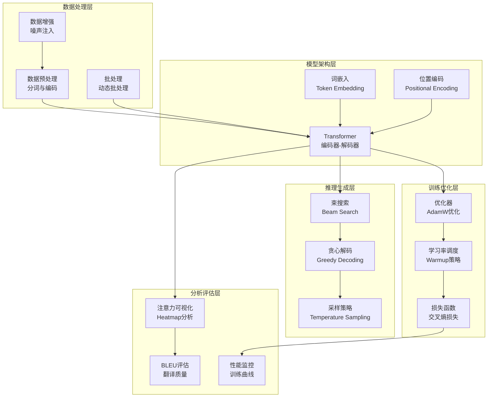

# 13.6 综合项目：Transformer机器翻译系统

> **设计思想**：通过完整的项目实践，巩固Transformer核心技术的理解和应用

## 项目概述

在本章的前几节中，我们学习了注意力机制、多头注意力、位置编码和Transformer完整架构等核心技术。为了将这些理论知识转化为实际应用能力，本项目将指导读者实现一个完整的Transformer机器翻译系统。

该项目将涵盖从数据预处理、模型实现、训练流程到推理部署的完整机器翻译流水线，帮助读者深入理解Transformer在实际应用中的各种技术细节和优化策略。

## 项目目标

完成本项目后，你将：

- ✅ **实现完整的Transformer架构**：掌握编码器-解码器结构的完整实现
- ✅ **构建机器翻译训练流程**：理解数据预处理、批处理、训练循环等关键环节
- ✅ **实现推理和生成功能**：掌握束搜索、贪心解码等生成策略
- ✅ **进行注意力可视化分析**：理解模型的决策过程和关注模式
- ✅ **优化模型性能**：掌握训练和推理过程中的性能优化技术

## 项目架构设计

### 系统组件



## 核心实现

### 1. 数据预处理模块

```java
public class TranslationDataProcessor {
    private Tokenizer srcTokenizer;
    private Tokenizer tgtTokenizer;
    
    public TranslationDataProcessor(String srcVocabPath, String tgtVocabPath) {
        this.srcTokenizer = new Tokenizer(srcVocabPath);
        this.tgtTokenizer = new Tokenizer(tgtVocabPath);
    }
    
    public TranslationBatch processBatch(List<TranslationExample> examples) {
        // 1. 分词和编码
        List<int[]> srcTokens = examples.stream()
            .map(ex -> srcTokenizer.encode(ex.getSource()))
            .collect(Collectors.toList());
            
        List<int[]> tgtTokens = examples.stream()
            .map(ex -> tgtTokenizer.encode(ex.getTarget()))
            .collect(Collectors.toList());
        
        // 2. 填充和截断
        int[][] srcPadded = padSequences(srcTokens, MAX_SEQ_LEN);
        int[][] tgtPadded = padSequences(tgtTokens, MAX_SEQ_LEN);
        
        // 3. 创建输入和目标序列
        int[][] decoderInputs = getDecoderInputs(tgtPadded);
        int[][] decoderTargets = getDecoderTargets(tgtPadded);
        
        // 4. 创建掩码
        Variable srcMask = createPaddingMask(srcPadded);
        Variable tgtMask = createCombinedMask(decoderInputs);
        
        return new TranslationBatch(
            new Variable(NdArray.of(srcPadded)),
            new Variable(NdArray.of(decoderInputs)),
            new Variable(NdArray.of(decoderTargets)),
            srcMask,
            tgtMask
        );
    }
}
```

### 2. Transformer模型实现

```java
public class TransformerTranslator extends Model {
    private EmbeddingLayer srcEmbedding;
    private EmbeddingLayer tgtEmbedding;
    private PositionalEncoding srcPosEncoding;
    private PositionalEncoding tgtPosEncoding;
    private TransformerEncoder encoder;
    private TransformerDecoder decoder;
    private LinearLayer outputProjection;
    
    public TransformerTranslator(TransformerConfig config) {
        super("TransformerTranslator");
        
        // 嵌入层
        this.srcEmbedding = new EmbeddingLayer("src_embedding", 
                                             config.getSrcVocabSize(), 
                                             config.getDModel());
        this.tgtEmbedding = new EmbeddingLayer("tgt_embedding", 
                                             config.getTgtVocabSize(), 
                                             config.getDModel());
        
        // 位置编码
        this.srcPosEncoding = new PositionalEncoding("src_pos_encoding", 
                                                   config.getMaxSeqLen(), 
                                                   config.getDModel());
        this.tgtPosEncoding = new PositionalEncoding("tgt_pos_encoding", 
                                                   config.getMaxSeqLen(), 
                                                   config.getDModel());
        
        // 编码器和解码器
        this.encoder = new TransformerEncoder("encoder", 
                                            config.getNumLayers(),
                                            config.getDModel(), 
                                            config.getNumHeads(), 
                                            config.getDFF(), 
                                            config.getDropoutRate());
        this.decoder = new TransformerDecoder("decoder", 
                                            config.getNumLayers(),
                                            config.getDModel(), 
                                            config.getNumHeads(), 
                                            config.getDFF(), 
                                            config.getDropoutRate());
        
        // 输出投影
        this.outputProjection = new LinearLayer("output_projection",
                                              config.getDModel(), 
                                              config.getTgtVocabSize());
    }
    
    @Override
    public Variable forward(Variable... inputs) {
        Variable srcIds = inputs[0];
        Variable tgtIds = inputs[1];
        Variable srcMask = inputs[2];
        Variable tgtMask = inputs[3];
        
        // 源语言处理
        Variable srcEmbeds = srcEmbedding.forward(srcIds);
        srcEmbeds = srcEmbeds.mul(Math.sqrt(dModel)); // 缩放
        srcEmbeds = srcPosEncoding.forward(srcEmbeds);
        
        // 目标语言处理
        Variable tgtEmbeds = tgtEmbedding.forward(tgtIds);
        tgtEmbeds = tgtEmbeds.mul(Math.sqrt(dModel)); // 缩放
        tgtEmbeds = tgtPosEncoding.forward(tgtEmbeds);
        
        // 编码器
        Variable encoderOutput = encoder.forward(srcEmbeds, srcMask);
        
        // 解码器
        Variable decoderOutput = decoder.forward(tgtEmbeds, encoderOutput, srcMask, tgtMask);
        
        // 输出投影
        Variable logits = outputProjection.forward(decoderOutput);
        
        return logits;
    }
}
```

### 3. 训练流程实现

```java
public class TranslationTrainer {
    private TransformerTranslator model;
    private Optimizer optimizer;
    private LossFunction lossFunction;
    private DataLoader dataLoader;
    private Logger logger;
    
    public TranslationTrainer(TransformerConfig config) {
        this.model = new TransformerTranslator(config);
        this.optimizer = new AdamWOptimizer(config.getLearningRate(), 
                                          config.getBeta1(), 
                                          config.getBeta2(), 
                                          config.getWeightDecay());
        this.lossFunction = new LabelSmoothingCrossEntropy(config.getLabelSmoothing());
        this.logger = new Logger("translation_training.log");
    }
    
    public void train(int epochs) {
        for (int epoch = 0; epoch < epochs; epoch++) {
            logger.info("Epoch {}/{}", epoch + 1, epochs);
            
            double totalLoss = 0.0;
            int batchCount = 0;
            
            for (TranslationBatch batch : dataLoader) {
                // 前向传播
                Variable logits = model.forward(
                    batch.getSrcIds(),
                    batch.getTgtIds(),
                    batch.getSrcMask(),
                    batch.getTgtMask()
                );
                
                // 计算损失
                Variable loss = lossFunction.forward(logits, batch.getTargets());
                
                // 反向传播
                loss.backward();
                
                // 优化步骤
                optimizer.step(model.getParameters());
                optimizer.zeroGrad();
                
                totalLoss += loss.getData().getFloat();
                batchCount++;
                
                if (batchCount % 100 == 0) {
                    logger.info("Batch {}: Loss = {:.4f}", 
                              batchCount, totalLoss / batchCount);
                }
            }
            
            logger.info("Epoch {} completed. Average Loss: {:.4f}", 
                      epoch + 1, totalLoss / batchCount);
            
            // 保存模型检查点
            if (epoch % config.getSaveInterval() == 0) {
                saveCheckpoint(epoch, totalLoss / batchCount);
            }
        }
    }
}
```

### 4. 推理和生成实现

```java
public class TranslationGenerator {
    private TransformerTranslator model;
    private Tokenizer srcTokenizer;
    private Tokenizer tgtTokenizer;
    
    public TranslationGenerator(TransformerTranslator model, 
                              String srcVocabPath, 
                              String tgtVocabPath) {
        this.model = model;
        this.srcTokenizer = new Tokenizer(srcVocabPath);
        this.tgtTokenizer = new Tokenizer(tgtVocabPath);
    }
    
    public String translate(String sourceText, GenerationConfig config) {
        // 1. 预处理输入
        int[] srcTokens = srcTokenizer.encode(sourceText);
        Variable srcIds = new Variable(NdArray.of(new int[][]{srcTokens}));
        Variable srcMask = createPaddingMask(new int[][]{srcTokens});
        
        // 2. 编码器前向传播
        Variable encoderOutput = model.encode(srcIds, srcMask);
        
        // 3. 解码生成
        List<Integer> generatedTokens = generateTokens(
            encoderOutput, srcMask, config
        );
        
        // 4. 后处理输出
        return tgtTokenizer.decode(generatedTokens.stream()
            .mapToInt(Integer::intValue)
            .toArray());
    }
    
    private List<Integer> generateTokens(Variable encoderOutput, 
                                       Variable srcMask, 
                                       GenerationConfig config) {
        List<Integer> generated = new ArrayList<>();
        generated.add(BOS_TOKEN); // 添加开始标记
        
        for (int i = 0; i < config.getMaxLength(); i++) {
            // 构建当前输入
            int[] currentTokens = generated.stream()
                .mapToInt(Integer::intValue)
                .toArray();
            Variable tgtIds = new Variable(NdArray.of(new int[][]{currentTokens}));
            Variable tgtMask = createCombinedMask(new int[][]{currentTokens});
            
            // 前向传播
            Variable logits = model.decode(tgtIds, encoderOutput, srcMask, tgtMask);
            
            // 获取最后一个时间步的logits
            Variable lastLogits = logits.slice(-1);
            
            // 根据配置选择生成策略
            int nextToken = selectNextToken(lastLogits, config);
            generated.add(nextToken);
            
            // 检查结束条件
            if (nextToken == EOS_TOKEN) {
                break;
            }
        }
        
        return generated;
    }
    
    private int selectNextToken(Variable logits, GenerationConfig config) {
        switch (config.getStrategy()) {
            case GREEDY:
                return greedySelect(logits);
            case BEAM_SEARCH:
                return beamSearchSelect(logits, config.getBeamWidth());
            case SAMPLING:
                return samplingSelect(logits, config.getTemperature());
            default:
                return greedySelect(logits);
        }
    }
}
```

## 注意力可视化分析

### 注意力权重提取

```java
public class AttentionVisualizer {
    public void visualizeAttention(Variable attentionWeights, 
                                 String[] srcTokens, 
                                 String[] tgtTokens) {
        // attentionWeights: (batch, num_heads, tgt_len, src_len)
        
        for (int head = 0; head < attentionWeights.getShape().get(1); head++) {
            // 提取特定头的注意力权重
            Variable headWeights = attentionWeights.slice(1, head);
            
            // 绘制热力图
            plotAttentionHeatmap(
                headWeights.getData().toFloatArray4D()[0][0],
                srcTokens,
                tgtTokens,
                "Attention Head " + head
            );
        }
    }
    
    private void plotAttentionHeatmap(float[][] attentionMatrix, 
                                    String[] srcTokens, 
                                    String[] tgtTokens, 
                                    String title) {
        // 使用图表库绘制注意力热力图
        Heatmap heatmap = new Heatmap.Builder()
            .data(attentionMatrix)
            .xLabels(srcTokens)
            .yLabels(tgtTokens)
            .title(title)
            .build();
            
        heatmap.show();
    }
}
```

## 性能优化策略

### 1. 梯度检查点

```java
public class GradientCheckpointing {
    public Variable checkpointedForward(Function<Variable, Variable> layer, 
                                     Variable input) {
        if (isTraining()) {
            return CheckpointFunction.apply(layer, input);
        } else {
            return layer.apply(input);
        }
    }
}
```

### 2. 混合精度训练

```java
public class MixedPrecisionTrainer {
    private boolean useMixedPrecision;
    private GradScaler gradScaler;
    
    public void trainStep(Variable... inputs) {
        if (useMixedPrecision) {
            // 前向传播（FP16）
            Variable outputs = model.forward(inputs);
            
            // 损失计算（FP16）
            Variable loss = lossFunction.forward(outputs, targets);
            
            // 缩放损失
            Variable scaledLoss = gradScaler.scale(loss);
            
            // 反向传播（FP16）
            scaledLoss.backward();
            
            // 梯度缩放和优化
            gradScaler.unscale(optimizer);
            gradScaler.step(optimizer);
            gradScaler.update();
        } else {
            // 标准训练流程
            // ... 
        }
    }
}
```

## 项目评估

### 1. BLEU评估指标

```java
public class BLEUEvaluator {
    public double calculateBLEU(List<String> references, List<String> candidates) {
        double bleuScore = 0.0;
        
        for (int i = 0; i < references.size(); i++) {
            String reference = references.get(i);
            String candidate = candidates.get(i);
            
            // 计算n-gram精度
            double[] precisions = calculateNGramPrecisions(reference, candidate);
            
            // 计算 brevity penalty
            double bp = calculateBrevityPenalty(reference, candidate);
            
            // 计算BLEU分数
            double logSum = 0.0;
            for (double precision : precisions) {
                logSum += Math.log(precision);
            }
            
            bleuScore += bp * Math.exp(logSum / precisions.length);
        }
        
        return bleuScore / references.size();
    }
}
```

### 2. 训练监控

```java
public class TrainingMonitor {
    private List<Double> trainLosses;
    private List<Double> valLosses;
    private List<Double> bleuScores;
    
    public void logEpoch(int epoch, double trainLoss, double valLoss, double bleu) {
        trainLosses.add(trainLoss);
        valLosses.add(valLoss);
        bleuScores.add(bleu);
        
        // 绘制训练曲线
        plotTrainingCurves();
        
        // 保存日志
        saveLog(epoch, trainLoss, valLoss, bleu);
    }
    
    private void plotTrainingCurves() {
        // 绘制损失曲线
        LineChart lossChart = new LineChart.Builder()
            .addSeries("Train Loss", trainLosses)
            .addSeries("Validation Loss", valLosses)
            .title("Training and Validation Loss")
            .build();
            
        lossChart.show();
        
        // 绘制BLEU分数曲线
        LineChart bleuChart = new LineChart.Builder()
            .addSeries("BLEU Score", bleuScores)
            .title("BLEU Score Over Time")
            .build();
            
        bleuChart.show();
    }
}
```

## 项目总结

通过本项目的完整实现，我们深入理解了Transformer在机器翻译任务中的应用：

1. **数据处理**：掌握了分词、编码、批处理等预处理技术
2. **模型实现**：实现了完整的Transformer编码器-解码器架构
3. **训练优化**：学习了优化器、学习率调度、损失函数等训练技术
4. **推理生成**：掌握了多种生成策略和束搜索算法
5. **分析评估**：学会了注意力可视化和BLEU评估等分析方法

这个项目不仅巩固了理论知识，更重要的是培养了实际的AI系统开发能力，为后续学习更复杂的语言模型奠定了坚实基础。

## 扩展思考

1. **多语言翻译**：如何扩展系统支持多种语言间的翻译
2. **领域适应**：如何针对特定领域（如医学、法律）优化翻译质量
3. **实时翻译**：如何实现低延迟的实时翻译系统
4. **模型压缩**：如何在保持性能的同时减小模型大小

通过不断实践和优化，我们可以构建出更加高效、准确的机器翻译系统，为实际应用提供强大的技术支持。