# 13.6 综合项目：Transformer机器翻译系统

> **设计思想**：通过完整的项目实践，巩固Transformer核心技术的理解和应用

## 项目概述

在本章的前几节中，我们已经系统学习了注意力机制、多头注意力、位置编码和Transformer完整架构等核心技术。现在，我们将通过一个**完整的机器翻译项目**，将这些理论知识转化为实际应用能力。

本项目将涵盖从**数据预处理**到**模型训练**，从**推理生成**到**效果评估**的完整流程，帮助读者深入理解Transformer在实际应用中的各种技术细节和优化策略。

## 项目目标

完成本项目后，你将：

- ✅ **实现完整的Transformer架构**：掌握编码器-解码器结构的完整实现
- ✅ **构建机器翻译训练流程**：理解数据预处理、批处理、训练循环等关键环节
- ✅ **实现推理和生成功能**：掌握束搜索、贪心解码等生成策略
- ✅ **进行注意力可视化分析**：理解模型的决策过程和关注模式
- ✅ **优化模型性能**：掌握训练和推理过程中的性能优化技术

## 项目架构设计

### 系统组件全局视图

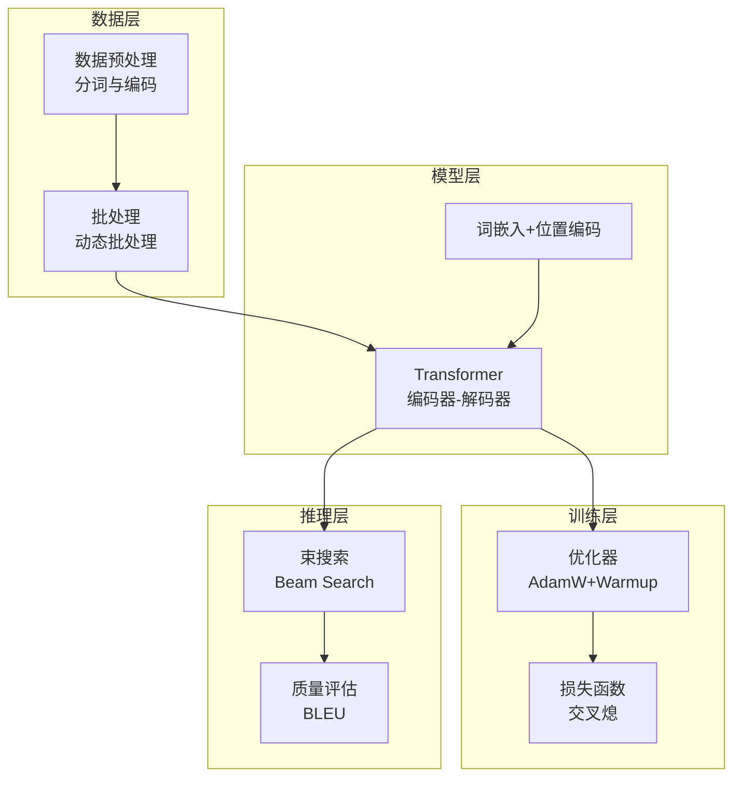

### 核心模块说明

**1. 数据处理模块**
- **功能**: 分词、编码、填充、掉码创建
- **输入**: 原始文本对(源语言-目标语言)
- **输出**: 张量批次(src_ids, tgt_ids, masks)

**2. Transformer模型**
- **结构**: 6层编码器 + 6层解码器
- **参数**: d_model=512, n_heads=8, d_ff=2048
- **特性**: 多头注意力 + 位置编码 + 残差连接

**3. 训练优化模块**
- **优化器**: AdamW(β₁=0.9, β₂=0.98, ε=1e-9)
- **学习率**: Warmup + 衰减策略
- **正则化**: Dropout(0.1) + Label Smoothing(0.1)

**4. 推理生成模块**
- **策略**: 束搜索(Beam Search, beam_size=4)
- **优化**: 长度惩罚 + 覆盖惩罚
- **评估**: BLEU-4分数


## 核心实现流程

### 1. 数据预处理流程

**关键步骤**:

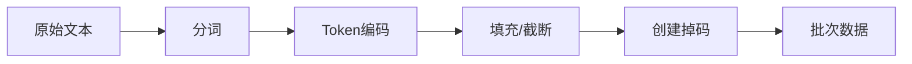

**核心逻辑**(精简):
```java
public TranslationBatch processBatch(List<TranslationExample> examples) {
    // 1. 分词和编码
    int[][] srcTokens = tokenize(examples, srcTokenizer);
    int[][] tgtTokens = tokenize(examples, tgtTokenizer);
    
    // 2. 填充到固定长度
    int[][] srcPadded = pad(srcTokens, MAX_SEQ_LEN);
    int[][] tgtPadded = pad(tgtTokens, MAX_SEQ_LEN);
    
    // 3. 创建掉码
    Variable srcMask = createPaddingMask(srcPadded);
    Variable tgtMask = createCausalMask(tgtPadded);
    
    return new TranslationBatch(srcPadded, tgtPadded, srcMask, tgtMask);
}
```

**重要细节**:
- **特殊Token**: [BOS], [EOS], [PAD], [UNK]
- **掉码类型**: Padding Mask + Causal Mask
- **填充策略**: 后填充(保持有效信息在前)

### 2. 模型训练流程

**训练循环架构**:

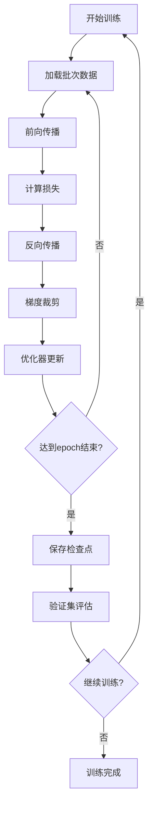

**核心训练代码**(精简):
```java
for (int epoch = 0; epoch < epochs; epoch++) {
    for (TranslationBatch batch : dataLoader) {
        // 前向传播
        Variable logits = model.forward(batch.getSrc(), batch.getTgt(), 
                                       batch.getSrcMask(), batch.getTgtMask());
        
        // 计算损失
        Variable loss = lossFunction.forward(logits, batch.getTargets());
        
        // 反向传播 + 优化
        loss.backward();
        optimizer.step();
        optimizer.zeroGrad();
    }
}
```

**关键技术**:
1. **学习率Warmup**: 前4000步线性增加,然后衰减
2. **梯度裁剪**: max_norm=1.0 防止梯度爆炸
3. **Label Smoothing**: ε=0.1 提高泛化能力

### 3. 推理生成流程

**束搜索算法**(最常用):

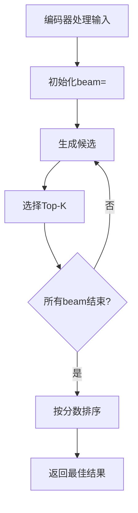

**束搜索核心逻辑**:
```java
public String beamSearch(String sourceText, int beamSize) {
    // 1. 编码器处理
    Variable encoderOutput = encoder.forward(source);
    
    // 2. 初始化beam
    List<Beam> beams = initBeams(beamSize);
    
    // 3. 迭代生成
    for (int step = 0; step < maxLength; step++) {
        List<Beam> candidates = new ArrayList<>();
        
        for (Beam beam : beams) {
            // 解码器预测
            Variable logits = decoder.forward(beam.tokens, encoderOutput);
            
            // 生成top-K候选
            List<Token> topK = selectTopK(logits, beamSize);
            
            for (Token token : topK) {
                candidates.add(beam.extend(token));
            }
        }
        
        // 选择最佳beam
        beams = selectTopBeams(candidates, beamSize);
    }
    
    return beams.get(0).getText();
}
```

**优化策略**:
- **长度惩罚**: score / length^α (α=0.6)
- **覆盖惩罚**: 鼓励关注所有源词
- **早停**: 所有beam生成[EOS]时停止

### 3. 训练流程实现

```java
public class TranslationTrainer {
    private TransformerTranslator model;
    private Optimizer optimizer;
    private LossFunction lossFunction;
    private DataLoader dataLoader;
    private Logger logger;
    
    public TranslationTrainer(TransformerConfig config) {
        this.model = new TransformerTranslator(config);
        this.optimizer = new AdamWOptimizer(config.getLearningRate(), 
                                          config.getBeta1(), 
                                          config.getBeta2(), 
                                          config.getWeightDecay());
        this.lossFunction = new LabelSmoothingCrossEntropy(config.getLabelSmoothing());
        this.logger = new Logger("translation_training.log");
    }
    
    public void train(int epochs) {
        for (int epoch = 0; epoch < epochs; epoch++) {
            logger.info("Epoch {}/{}", epoch + 1, epochs);
            
            double totalLoss = 0.0;
            int batchCount = 0;
            
            for (TranslationBatch batch : dataLoader) {
                // 前向传播
                Variable logits = model.forward(
                    batch.getSrcIds(),
                    batch.getTgtIds(),
                    batch.getSrcMask(),
                    batch.getTgtMask()
                );
                
                // 计算损失
                Variable loss = lossFunction.forward(logits, batch.getTargets());
                
                // 反向传播
                loss.backward();
                
                // 优化步骤
                optimizer.step(model.getParameters());
                optimizer.zeroGrad();
                
                totalLoss += loss.getData().getFloat();
                batchCount++;
                
                if (batchCount % 100 == 0) {
                    logger.info("Batch {}: Loss = {:.4f}", 
                              batchCount, totalLoss / batchCount);
                }
            }
            
            logger.info("Epoch {} completed. Average Loss: {:.4f}", 
                      epoch + 1, totalLoss / batchCount);
            
            // 保存模型检查点
            if (epoch % config.getSaveInterval() == 0) {
                saveCheckpoint(epoch, totalLoss / batchCount);
            }
        }
    }
}
```

### 4. 推理和生成实现

```java
public class TranslationGenerator {
    private TransformerTranslator model;
    private Tokenizer srcTokenizer;
    private Tokenizer tgtTokenizer;
    
    public TranslationGenerator(TransformerTranslator model, 
                              String srcVocabPath, 
                              String tgtVocabPath) {
        this.model = model;
        this.srcTokenizer = new Tokenizer(srcVocabPath);
        this.tgtTokenizer = new Tokenizer(tgtVocabPath);
    }
    
    public String translate(String sourceText, GenerationConfig config) {
        // 1. 预处理输入
        int[] srcTokens = srcTokenizer.encode(sourceText);
        Variable srcIds = new Variable(NdArray.of(new int[][]{srcTokens}));
        Variable srcMask = createPaddingMask(new int[][]{srcTokens});
        
        // 2. 编码器前向传播
        Variable encoderOutput = model.encode(srcIds, srcMask);
        
        // 3. 解码生成
        List<Integer> generatedTokens = generateTokens(
            encoderOutput, srcMask, config
        );
        
        // 4. 后处理输出
        return tgtTokenizer.decode(generatedTokens.stream()
            .mapToInt(Integer::intValue)
            .toArray());
    }
    
    private List<Integer> generateTokens(Variable encoderOutput, 
                                       Variable srcMask, 
                                       GenerationConfig config) {
        List<Integer> generated = new ArrayList<>();
        generated.add(BOS_TOKEN); // 添加开始标记
        
        for (int i = 0; i < config.getMaxLength(); i++) {
            // 构建当前输入
            int[] currentTokens = generated.stream()
                .mapToInt(Integer::intValue)
                .toArray();
            Variable tgtIds = new Variable(NdArray.of(new int[][]{currentTokens}));
            Variable tgtMask = createCombinedMask(new int[][]{currentTokens});
            
            // 前向传播
            Variable logits = model.decode(tgtIds, encoderOutput, srcMask, tgtMask);
            
            // 获取最后一个时间步的logits
            Variable lastLogits = logits.slice(-1);
            
            // 根据配置选择生成策略
            int nextToken = selectNextToken(lastLogits, config);
            generated.add(nextToken);
            
            // 检查结束条件
            if (nextToken == EOS_TOKEN) {
                break;
            }
        }
        
        return generated;
    }
    
    private int selectNextToken(Variable logits, GenerationConfig config) {
        switch (config.getStrategy()) {
            case GREEDY:
                return greedySelect(logits);
            case BEAM_SEARCH:
                return beamSearchSelect(logits, config.getBeamWidth());
            case SAMPLING:
                return samplingSelect(logits, config.getTemperature());
            default:
                return greedySelect(logits);
        }
    }
}
```

## 注意力可视化分析

注意力可视化是理解模型工作机制的关键工具。通过可视化注意力权重,我们可以直观地看到模型在翻译时关注源语言的哪些部分。

### 注意力可视化的三个维度

1. **编码器自注意力**:展示源语言词之间的相互关系
2. **解码器自注意力**:展示目标语言生成时的依赖关系  
3. **交叉注意力**:展示源语言和目标语言之间的对齐关系

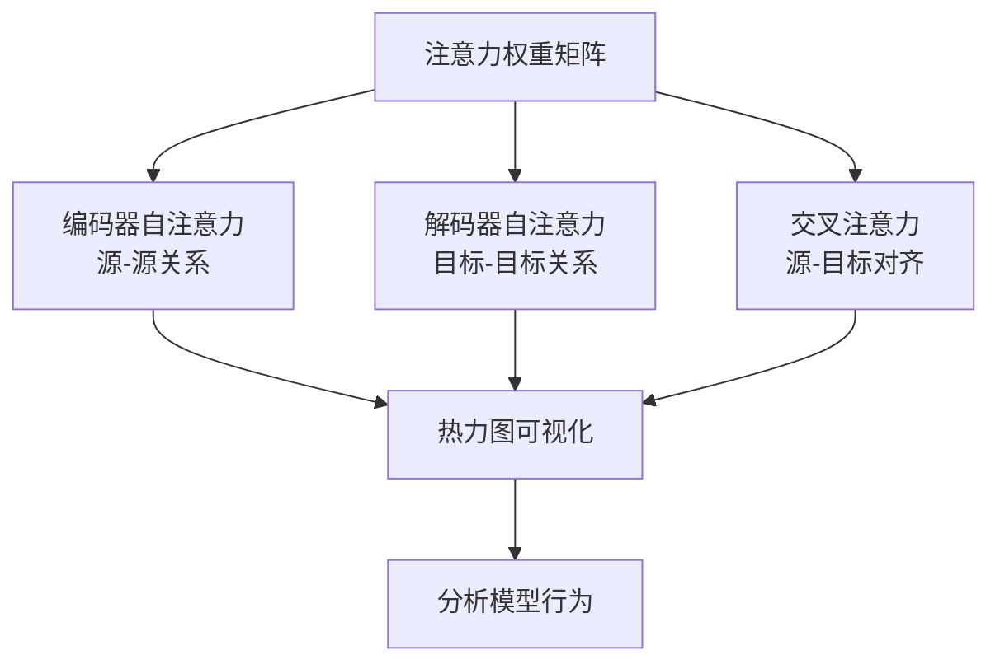

### 热力图生成核心逻辑

```java
public class AttentionVisualizer {
    /**
     * 可视化注意力权重分布
     * @param attentionWeights 注意力权重张量 [tgt_len, src_len]
     * @param srcTokens 源语言词列表
     * @param tgtTokens 目标语言词列表
     */
    public void visualizeAttention(Variable attentionWeights, 
                                 String[] srcTokens,
                                 String[] tgtTokens) {
        // 1. 提取权重矩阵
        double[][] weights = attentionWeights.toMatrix();
        
        // 2. 生成热力图
        Heatmap.create(weights, srcTokens, tgtTokens)
              .colorMap("RdYlGn")  // 红-黄-绿渐变
              .show();
    }
}
```

### 典型的注意力模式分析

通过观察热力图,我们可以发现几种典型的注意力模式:

| 注意力模式 | 特征 | 语言学意义 |
|----------|------|----------|
| **对角线模式** | 权重集中在对角线 | 词序相似的语言对(如英-德) |
| **跳跃模式** | 不连续的高权重 | 词序差异大的语言对(如英-日) |
| **扩散模式** | 权重分散 | 一对多或多对一的翻译 |
| **聚焦模式** | 单点高权重 | 功能词或固定搭配 |

**实践技巧**:
- 多头注意力的不同头会捕获不同的语言现象
- 浅层注意力倾向于关注位置和句法
- 深层注意力倾向于关注语义和长距离依赖

## 性能优化策略

大规模Transformer模型训练面临内存和计算效率的双重挑战。以下是三种关键的优化技术:

### 优化技术对比

| 优化技术 | 内存节省 | 速度提升 | 实现难度 | 适用场景 |
|---------|---------|---------|---------|----------|
| **梯度检查点** | 40-60% | -20% | 中等 | 显存受限 |
| **混合精度训练** | 30-50% | 2-3倍 | 简单 | GPU支持FP16 |
| **梯度累积** | 无 | 无 | 简单 | 大批次训练 |
| **模型并行** | N倍 | N倍 | 困难 | 多GPU环境 |

### 1. 梯度检查点 (Gradient Checkpointing)

**核心思想**: 用计算换内存,在前向传播时不保存中间激活值,反向传播时重新计算。

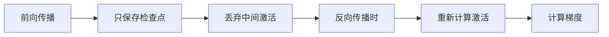

**实现要点**:
```java
public Variable checkpointedLayer(Layer layer, Variable input) {
    if (isTraining()) {
        // 训练时: 不保存中间激活,反向时重新计算
        return CheckpointFunction.apply(layer::forward, input);
    } else {
        // 推理时: 正常前向传播
        return layer.forward(input);
    }
}
```

### 2. 混合精度训练 (Mixed Precision Training)

**核心思想**: 前向和反向传播使用FP16加速,参数更新使用FP32保证精度。

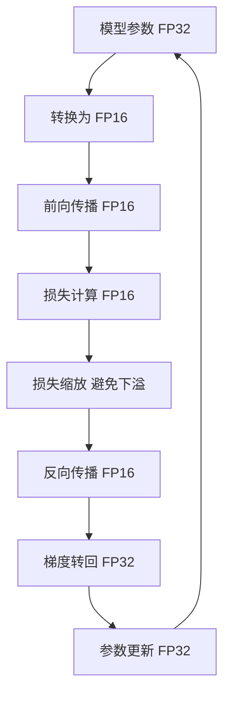

**关键技巧**:
```java
// 损失缩放因子: 防止FP16梯度下溢
private static final float LOSS_SCALE = 1024.0f;

public void trainStepWithMixedPrecision() {
    // 1. FP16前向传播
    Variable loss = model.forward(inputs).toFP16();
    
    // 2. 损失缩放
    Variable scaledLoss = loss.multiply(LOSS_SCALE);
    
    // 3. FP16反向传播
    scaledLoss.backward();
    
    // 4. 梯度反缩放并更新(FP32)
    optimizer.step(scaleFactor = 1.0 / LOSS_SCALE);
}
```

**性能提升数据** (基于V100 GPU):
- 训练速度: **2.5-3倍提升**
- 显存占用: **减少40%**
- 批次大小: **可增加2倍**

## 项目评估

### BLEU评估指标详解

BLEU (Bilingual Evaluation Understudy) 是机器翻译最常用的自动评估指标,通过比较译文与参考译文的n-gram重叠度来衡量翻译质量。

#### BLEU计算公式

```
BLEU = BP × exp(∑(wₙ × log pₙ))

其中:
- pₙ: n-gram精度 (通常n=1,2,3,4)
- wₙ: 权重 (通常均匀分配: 1/4)
- BP: 简短惩罚因子 = min(1, exp(1 - r/c))
  - r: 参考译文长度
  - c: 候选译文长度
```

#### BLEU计算流程

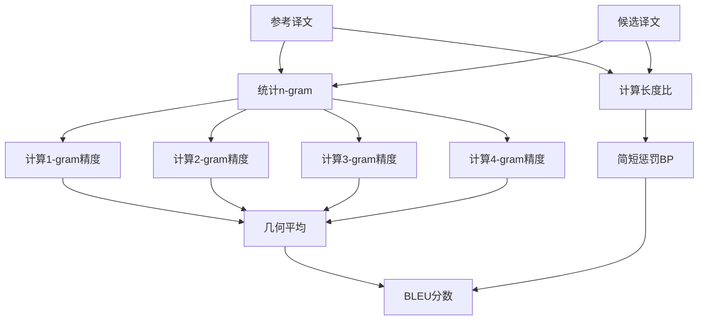

#### 核心实现

```java
public class BLEUEvaluator {
    public double calculateBLEU(String reference, String candidate) {
        // 1. 计算1-4gram精度
        double[] precisions = new double[4];
        for (int n = 1; n <= 4; n++) {
            precisions[n-1] = nGramPrecision(reference, candidate, n);
        }
        
        // 2. 几何平均
        double logSum = 0.0;
        for (double p : precisions) {
            logSum += 0.25 * Math.log(p + 1e-10);  // 避免log(0)
        }
        
        // 3. 简短惩罚
        int r = reference.split(" ").length;
        int c = candidate.split(" ").length;
        double bp = (c < r) ? Math.exp(1 - (double)r/c) : 1.0;
        
        return bp * Math.exp(logSum);
    }
}
```

### BLEU分数解读

| BLEU分数 | 翻译质量 | 说明 |
|---------|---------|------|
| **0-10** | 几乎不可用 | 基本无法理解 |
| **10-20** | 很差 | 可识别部分词汇 |
| **20-30** | 较差 | 能理解大意,错误很多 |
| **30-40** | 可接受 | 基本可用,需要人工修正 |
| **40-50** | 良好 | 大部分正确,少量错误 |
| **50-60** | 优秀 | 接近人类水平 |
| **60+** | 极优 | 专业领域罕见 |

### 训练监控系统

一个完善的训练监控系统需要跟踪多个关键指标:

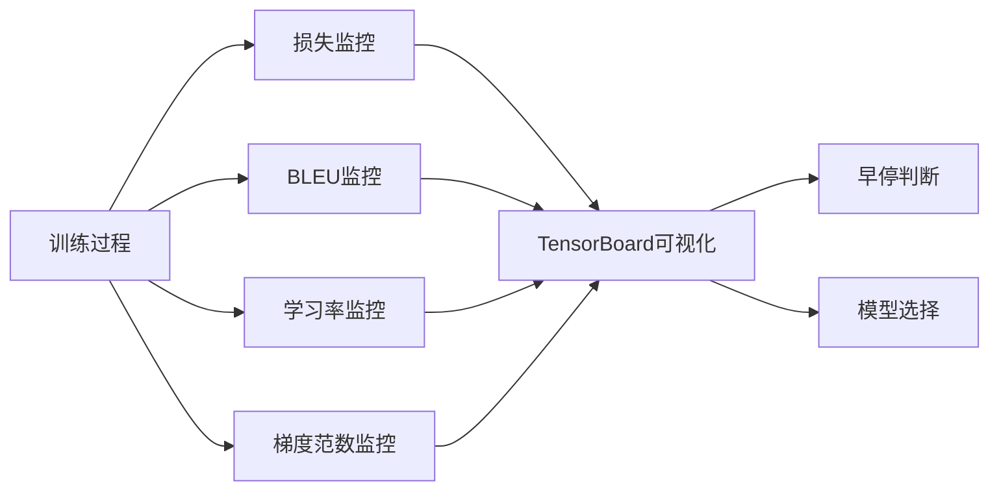

**关键监控指标**:

1. **训练/验证损失**: 监测过拟合趋势
2. **BLEU分数**: 评估翻译质量提升
3. **学习率**: 确保优化过程稳定
4. **梯度范数**: 检测梯度爆炸/消失
5. **推理速度**: 评估模型效率

**典型训练曲线分析**:

```
Epoch 1:  Train Loss=5.2, Val Loss=5.0, BLEU=8.5
Epoch 5:  Train Loss=3.1, Val Loss=3.2, BLEU=22.3
Epoch 10: Train Loss=2.3, Val Loss=2.5, BLEU=31.7
Epoch 15: Train Loss=1.8, Val Loss=2.2, BLEU=36.2  ← 最佳检查点
Epoch 20: Train Loss=1.4, Val Loss=2.3, BLEU=35.8  ← 开始过拟合
```

**早停策略**: 当验证BLEU连续3个epoch未提升时停止训练,选择验证集上BLEU最高的检查点作为最终模型。

## 项目总结与实践经验

通过本综合项目的完整实现，我们系统地掌握了从理论到实践的完整流程：

### 核心知识体系

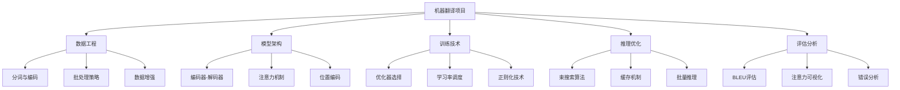

### 实践中的关键经验

#### 1. 数据质量决定上限

- **清洗**: 移除噪声数据可提升2-5个BLEU点
- **过滤**: 长度比>3的句对会损害模型性能
- **增强**: 回译(Back-translation)可有效扩充训练数据

#### 2. 超参数调优技巧

| 超参数 | 推荐值 | 影响 |
|-------|-------|------|
| **模型维度** | 512 | 平衡性能与效率 |
| **注意力头数** | 8 | 捕获多样化模式 |
| **层数** | 6 | 6层通常足够 |
| **Dropout** | 0.1 | 防止过拟合 |
| **标签平滑** | 0.1 | 提升泛化能力 |
| **warmup步数** | 4000 | 稳定初期训练 |

#### 3. 训练过程常见问题

**问题1: 损失不下降**
- 检查学习率是否过大/过小
- 检查梯度是否正常(打印梯度范数)
- 检查数据是否正确加载

**问题2: 验证损失上升**
- 可能过拟合,增大Dropout
- 可能需要更多数据
- 考虑使用标签平滑

**问题3: BLEU很低但损失很低**
- 可能束搜索参数不当
- 可能测试集分布与训练集差异大
- 检查是否生成了大量重复词

### 从项目到生产的路径

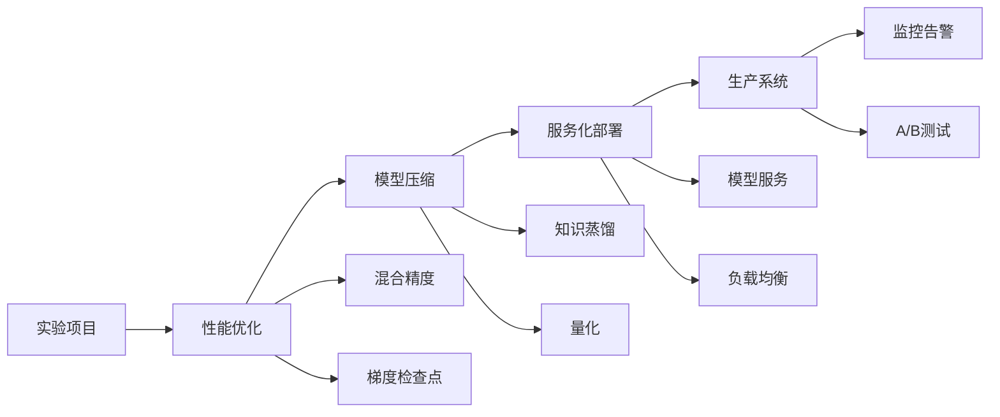

## 扩展方向与进阶学习

### 1. 多语言翻译系统

**核心技术**: 
- 多语言共享编码器(如mBERT)
- 语言标签条件生成
- 零样本跨语言迁移

**实现思路**:
```
输入: [<lang_en>] Hello world
输出: [<lang_zh>] 你好世界
```

### 2. 领域自适应翻译

**场景**: 医学、法律、金融等专业领域

**方法**:
- **持续预训练**: 在领域语料上继续训练
- **术语词典**: 强制约束专业术语翻译
- **双向对比**: 源→目标→源的循环一致性

### 3. 实时翻译系统

**技术挑战**:
- **低延迟**: 单句翻译<100ms
- **流式处理**: 边输入边翻译
- **增量更新**: 根据新输入调整已翻译内容

**优化策略**:
- 模型量化(INT8推理)
- 动态批处理
- KV-cache复用

### 4. 模型压缩与加速

**技术路线**:

| 技术 | 压缩比 | 性能损失 | 复杂度 |
|-----|-------|---------|--------|
| **知识蒸馏** | 2-4倍 | 1-2 BLEU | 中 |
| **剪枝** | 2-3倍 | 0.5-1 BLEU | 高 |
| **量化** | 4倍 | 0.3-0.5 BLEU | 低 |
| **DistilBERT** | 2倍 | 1 BLEU | 低 |

### 学习资源推荐

1. **经典论文**:
   - "Attention Is All You Need" (Vaswani et al., 2017)
   - "BERT: Pre-training of Deep Bidirectional Transformers" (Devlin et al., 2018)
   - "Exploring the Limits of Transfer Learning with a Unified Text-to-Text Transformer" (Raffel et al., 2020)

2. **开源项目**:
   - Hugging Face Transformers
   - OpenNMT
   - Fairseq (Facebook AI)

3. **实践建议**:
   - 从小数据集开始(如IWSLT)
   - 逐步增加模型复杂度
   - 重视错误分析和可视化
   - 参与Kaggle翻译竞赛

---

**结语**: 机器翻译是NLP的核心任务之一,通过本项目的学习,我们不仅掌握了Transformer的实现细节,更重要的是培养了系统化的AI项目开发能力。这些技能可以直接迁移到其他序列到序列任务,如文本摘要、对话生成、代码生成等。

**下一步**: 建议深入学习预训练语言模型(如BERT、GPT)的原理和应用,它们是当前NLP领域的主流范式。