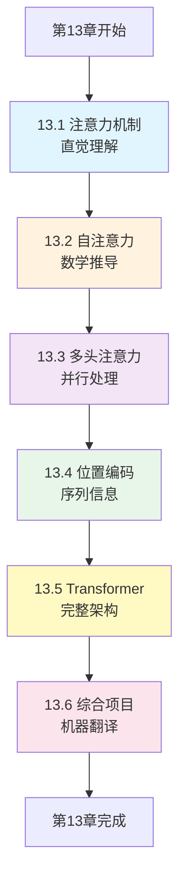
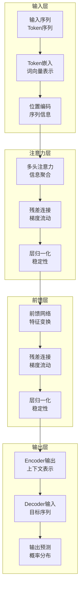

# 第13章：Transformer革命 - 注意力机制详解

> **设计思想**：深入理解现代NLP的核心技术，掌握"Attention is All You Need"的精髓

## 章节概述

Transformer架构的提出彻底改变了自然语言处理领域，它摊弃了传统的循环神经网络和卷积神经网络，**完全基于注意力机制**构建，实现了并行化训练和更好的长距离依赖建模。

本章将从**直觉理解到数学推导**，从**基础概念到完整架构**，系统地探讨注意力机制的核心技术。我们将基于TinyAI框架，通过**精简的代码示例、丰富的图表说明和实际项目实践**，帮助读者掌握Transformer的核心技术。

通过本章的学习，读者将能够理解并实现完整的Transformer模型，为后续学习GPT系列模型奠定基础。

## 学习路线图

**学习路径说明**:

- **第一阶段：基础概念** (13.1-13.2) - 从直觉理解到数学推导
- **第二阶段：核心技术** (13.3-13.4) - 多头注意力和位置编码
- **第三阶段：集成应用** (13.5-13.6) - 完整架构和项目实践

## 学习目标

完成本章学习后，你将：

- ✅ **掌握注意力机制原理**：理解注意力机制的数学基础和直觉理解
- ✅ **实现自注意力和多头注意力**：掌握注意力机制的完整实现细节
- ✅ **理解位置编码技术**：掌握序列信息表示的关键技术
- ✅ **构建完整Transformer架构**：实现Encoder-Decoder结构的Transformer模型
- ✅ **具备Transformer应用能力**：能够开发基于Transformer的NLP应用

## 章节内容

### 13.1 注意力机制的直觉理解
**学习重点**：理解注意力机制的核心思想和解决的问题
- 从人类注意力到机器注意力的类比
- 注意力机制解决的核心问题：信息选择和聚合
- Attention的数学定义：Query、Key、Value三元组
- 注意力权重的计算和解释

### 13.2 自注意力机制的数学推导
**学习重点**：掌握自注意力机制的数学原理和实现
- Scaled Dot-Product Attention的公式推导
- 注意力分数的计算：相似度度量方法
- Softmax归一化的作用和替代方案
- 自注意力的计算复杂度分析：O(n²)问题

### 13.3 多头注意力：并行处理不同信息
**学习重点**：掌握多头注意力的设计思想和实现方法
- 多头注意力的设计动机：捕获不同类型的关系
- 头部投影矩阵的作用和初始化
- 多头输出的拼接和线性变换
- 注意力头的可视化和分析

### 13.4 位置编码：序列信息的表示
**学习重点**：掌握序列建模中的位置信息表示技术
- 绝对位置编码vs相对位置编码
- 正弦余弦位置编码的数学原理
- 学习位置编码vs固定位置编码
- 长序列的位置编码问题

### 13.5 Transformer完整架构解析
**学习重点**：掌握Transformer的完整架构设计和实现
- Encoder-Decoder结构的设计理念
- 残差连接和层归一化的重要性
- Feed-Forward Network的作用
- Transformer的变体：Encoder-only、Decoder-only

## 技术架构图

## 实践项目

**项目名称**：基于TinyAI的Transformer机器翻译系统

**项目目标**：
- 实现完整的Transformer Encoder-Decoder架构
- 构建机器翻译任务的训练和推理流程
- 实现注意力权重的可视化分析
- 优化模型性能，提升翻译质量

**技术要求**：
- 代码质量：完整注释、单元测试覆盖率>90%
- 功能完整性：支持训练、推理、可视化全流程
- 性能要求：能够处理中等规模的翻译任务
- 易用性：提供简洁的API和配置接口

**预期成果**：
- 可运行的完整Transformer翻译系统
- 详细的训练日志和性能报告
- 注意力权重可视化结果
- 技术文档和使用说明

## 本章小结

第13章将为读者建立起Transformer架构的完整知识体系，从基础的注意力机制到复杂的多头注意力，再到完整的Transformer模型实现。通过本章的学习，读者将具备独立开发Transformer应用的能力，为后续章节中GPT系列模型的学习奠定坚实基础。

---

**下一章预告**：第14章我们将深入学习GPT系列模型，掌握大语言模型的核心技术。