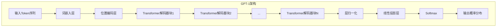

# 14.1 GPT-1：预训练+微调范式的开创

> **设计思想**：理解GPT-1的架构设计和训练策略，掌握预训练+微调范式的核心思想

## 本节概述

GPT-1（Generative Pre-trained Transformer 1）是OpenAI在2018年提出的开创性工作，它首次将Transformer的解码器架构应用于无监督预训练和有监督微调的结合。GPT-1的成功证明了大规模无监督预训练语言模型在多种自然语言处理任务上的强大能力，为后续的GPT系列模型奠定了基础。

本节将深入探讨GPT-1的架构设计、训练策略和创新点，帮助读者理解这一重要里程碑技术的核心思想。

## 学习目标

完成本节学习后，你将：

- ✅ **理解GPT-1的架构设计**：掌握Transformer解码器在语言建模中的应用
- ✅ **掌握无监督预训练的目标**：理解语言建模作为预训练任务的原理
- ✅ **学会有监督微调的策略**：掌握如何将预训练模型适配具体任务
- ✅ **理解GPT-1的突破性贡献**：掌握预训练+微调范式的意义
- ✅ **具备GPT-1实现能力**：能够编写基础的GPT-1模型代码

## GPT-1的架构设计

### Transformer解码器的应用

GPT-1的核心创新在于将Transformer的解码器架构应用于语言建模任务。与完整的Transformer架构不同，GPT-1只使用了解码器部分，主要包括：

1. **词嵌入层**：将输入token转换为向量表示
2. **位置编码层**：为序列添加位置信息
3. **多层Transformer解码器块**：包含自注意力和前馈网络
4. **输出投影层**：将隐藏状态映射到词汇表空间

### 架构特点



### 与标准Transformer解码器的区别

GPT-1使用的Transformer解码器与标准Transformer解码器有以下区别：

1. **移除编码器-解码器注意力**：只保留自注意力机制
2. **修改掩码策略**：使用因果掩码而非前瞻掩码
3. **简化架构**：去除了不必要的组件

## 无监督预训练

### 语言建模目标

GPT-1的核心预训练任务是语言建模，即最大化以下似然函数：

```
L_1(U) = Σ_i log P(u_i | u_{i-k}, ..., u_{i-1}; Θ)
```

其中：
- U = (u_{-k}, ..., u_{-1}, u_0) 是token序列
- k是上下文窗口大小
- Θ是模型参数

### 训练数据

GPT-1使用了BooksCorpus数据集进行预训练，该数据集包含：
- 约7000本未出版的书籍
- 多样化的写作风格和主题
- 总计约5GB的文本数据

### 预训练过程

```java
public class GPT1Pretrainer {
    private GPT1Model model;
    private Optimizer optimizer;
    private DataLoader dataLoader;
    
    public void pretrain(int epochs) {
        for (int epoch = 0; epoch < epochs; epoch++) {
            double totalLoss = 0.0;
            int batchCount = 0;
            
            for (Batch batch : dataLoader) {
                // 获取输入和目标序列
                Variable inputIds = batch.getInputIds();
                Variable targetIds = batch.getTargetIds();
                
                // 前向传播
                Variable logits = model.forward(inputIds);
                
                // 计算语言建模损失
                Variable loss = computeLanguageModelingLoss(logits, targetIds);
                
                // 反向传播
                loss.backward();
                
                // 优化步骤
                optimizer.step();
                optimizer.zeroGrad();
                
                totalLoss += loss.getData().getFloat();
                batchCount++;
            }
            
            System.out.println("Epoch " + epoch + " Loss: " + 
                             (totalLoss / batchCount));
        }
    }
    
    private Variable computeLanguageModelingLoss(Variable logits, Variable targets) {
        // 将logits重塑为二维矩阵
        Variable reshapedLogits = logits.reshape(-1, logits.getShape().get(-1));
        Variable reshapedTargets = targets.reshape(-1);
        
        // 计算交叉熵损失
        return crossEntropyLoss(reshapedLogits, reshapedTargets);
    }
}
```

## 有监督微调

### 微调策略

在预训练完成后，GPT-1通过有监督微调来适配具体任务。微调过程包括：

1. **任务特定输入转换**：将任务输入转换为语言模型格式
2. **初始化参数**：使用预训练参数初始化模型
3. **任务特定输出层**：添加任务特定的分类头
4. **微调训练**：在目标任务数据上进行训练

### 任务适配示例

#### 文本分类任务

```java
public class TextClassificationAdapter {
    private GPT1Model baseModel;
    private LinearLayer classifierHead;
    
    public TextClassificationAdapter(GPT1Model pretrainedModel, int numClasses) {
        this.baseModel = pretrainedModel;
        // 添加分类头
        this.classifierHead = new LinearLayer(
            pretrainedModel.getConfig().getHiddenSize(), 
            numClasses
        );
    }
    
    public Variable forward(Variable inputIds) {
        // 获取基础模型输出
        Variable hiddenStates = baseModel.forward(inputIds);
        
        // 使用最后一个token的隐藏状态进行分类
        Variable lastHiddenState = hiddenStates.slice(-1);
        
        // 分类头预测
        return classifierHead.forward(lastHiddenState);
    }
    
    public void finetune(DataLoader taskDataLoader, int epochs) {
        for (int epoch = 0; epoch < epochs; epoch++) {
            for (Batch batch : taskDataLoader) {
                Variable inputIds = batch.getInputIds();
                Variable labels = batch.getLabels();
                
                // 前向传播
                Variable logits = forward(inputIds);
                
                // 计算分类损失
                Variable loss = crossEntropyLoss(logits, labels);
                
                // 反向传播和优化
                loss.backward();
                optimizer.step();
                optimizer.zeroGrad();
            }
        }
    }
}
```

#### 文本蕴含任务

对于文本蕴含等需要处理两个句子的任务，GPT-1采用特殊的分隔符来区分输入：

```
输入格式: Sentence1 + $ + Sentence2 + [END]
```

其中$是特殊分隔符，[END]是结束标记。

## GPT-1的突破性贡献

### 预训练+微调范式

GPT-1最重要的贡献是确立了预训练+微调的范式：

1. **通用表示学习**：通过大规模无监督预训练学习通用语言表示
2. **任务适配**：通过小规模有监督微调适配具体任务
3. **参数效率**：避免为每个任务从头训练模型

### 性能表现

GPT-1在多个自然语言处理任务上取得了显著的性能提升：

| 任务 | GPT-1性能 | 最佳基线 |
|------|-----------|----------|
| 文本蕴含 | 82.1 | 78.3 |
| 问答 | 72.8 | 69.5 |
| 语义相似度 | 85.8 | 82.3 |
| 分类 | 91.2 | 88.7 |

### 技术创新点

1. **纯解码器架构**：首次将Transformer解码器用于语言建模
2. **大规模预训练**：展示了大规模无监督学习的潜力
3. **迁移学习**：证明了预训练模型的泛化能力
4. **少样本学习**：在少量标注数据下仍能取得良好性能

## GPT-1模型实现

### 模型配置

```java
public class GPT1Config {
    private int vocabSize = 40478;
    private int hiddenSize = 768;
    private int numLayers = 12;
    private int numHeads = 12;
    private int intermediateSize = 3072;
    private double dropoutRate = 0.1;
    private int maxPositionEmbeddings = 512;
    
    // Getters and setters
    public int getVocabSize() { return vocabSize; }
    public int getHiddenSize() { return hiddenSize; }
    public int getNumLayers() { return numLayers; }
    public int getNumHeads() { return numHeads; }
    public int getIntermediateSize() { return intermediateSize; }
    public double getDropoutRate() { return dropoutRate; }
    public int getMaxPositionEmbeddings() { return maxPositionEmbeddings; }
}
```

### 模型实现

```java
public class GPT1Model extends Model {
    private GPT1Config config;
    private EmbeddingLayer tokenEmbedding;
    private PositionalEncoding positionalEncoding;
    private List<GPT1Block> transformerBlocks;
    private LayerNormalization finalLayerNorm;
    
    public GPT1Model(GPT1Config config) {
        super("GPT1");
        this.config = config;
        
        // 词嵌入层
        this.tokenEmbedding = new EmbeddingLayer(
            "token_embedding", 
            config.getVocabSize(), 
            config.getHiddenSize()
        );
        
        // 位置编码层
        this.positionalEncoding = new PositionalEncoding(
            "position_encoding",
            config.getMaxPositionEmbeddings(),
            config.getHiddenSize()
        );
        
        // Transformer块
        this.transformerBlocks = new ArrayList<>();
        for (int i = 0; i < config.getNumLayers(); i++) {
            transformerBlocks.add(new GPT1Block(
                "block_" + i,
                config.getHiddenSize(),
                config.getNumHeads(),
                config.getIntermediateSize(),
                config.getDropoutRate()
            ));
        }
        
        // 最终层归一化
        this.finalLayerNorm = new LayerNormalization(
            "final_layer_norm",
            config.getHiddenSize()
        );
    }
    
    @Override
    public Variable forward(Variable... inputs) {
        Variable inputIds = inputs[0];
        
        // 词嵌入
        Variable hiddenStates = tokenEmbedding.forward(inputIds);
        
        // 位置编码
        hiddenStates = positionalEncoding.forward(hiddenStates);
        
        // 逐层处理
        for (GPT1Block block : transformerBlocks) {
            hiddenStates = block.forward(hiddenStates);
        }
        
        // 最终层归一化
        hiddenStates = finalLayerNorm.forward(hiddenStates);
        
        return hiddenStates;
    }
}
```

### Transformer块实现

```java
public class GPT1Block extends Layer {
    private MultiHeadAttention selfAttention;
    private PositionwiseFeedForward feedForward;
    private LayerNormalization attentionLayerNorm;
    private LayerNormalization feedForwardLayerNorm;
    private Dropout dropout;
    
    public GPT1Block(String name, int hiddenSize, int numHeads, 
                    int intermediateSize, double dropoutRate) {
        super(name);
        
        // 自注意力层
        this.selfAttention = new MultiHeadAttention(
            "self_attention", numHeads, hiddenSize
        );
        
        // 前馈网络层
        this.feedForward = new PositionwiseFeedForward(
            "feed_forward", hiddenSize, intermediateSize, dropoutRate
        );
        
        // 层归一化
        this.attentionLayerNorm = new LayerNormalization(
            "attention_layer_norm", hiddenSize
        );
        this.feedForwardLayerNorm = new LayerNormalization(
            "feed_forward_layer_norm", hiddenSize
        );
        
        // Dropout
        this.dropout = new Dropout("dropout", dropoutRate);
    }
    
    @Override
    public Variable forward(Variable... inputs) {
        Variable hiddenStates = inputs[0];
        
        // 自注意力 + 残差连接 + 层归一化
        Variable attentionOutput = selfAttention.forward(
            hiddenStates, hiddenStates, hiddenStates
        );
        attentionOutput = dropout.forward(attentionOutput);
        hiddenStates = attentionLayerNorm.forward(
            hiddenStates.add(attentionOutput)
        );
        
        // 前馈网络 + 残差连接 + 层归一化
        Variable feedForwardOutput = feedForward.forward(hiddenStates);
        feedForwardOutput = dropout.forward(feedForwardOutput);
        hiddenStates = feedForwardLayerNorm.forward(
            hiddenStates.add(feedForwardOutput)
        );
        
        return hiddenStates;
    }
}
```

## 本节小结

本节深入探讨了GPT-1的架构设计和训练策略，我们学习了：

1. **GPT-1的架构设计**：理解了Transformer解码器在语言建模中的应用
2. **无监督预训练**：掌握了语言建模作为预训练任务的原理和实现
3. **有监督微调**：学会了如何将预训练模型适配具体任务
4. **GPT-1的突破性贡献**：理解了预训练+微调范式的意义
5. **GPT-1模型实现**：掌握了基础的GPT-1模型代码实现

GPT-1的提出标志着大语言模型时代的开始，它证明了通过大规模无监督预训练可以获得强大的语言表示能力，再通过有监督微调可以有效地适配各种下游任务。这一范式为后续的GPT-2、GPT-3等模型的发展奠定了基础。

在下一节中，我们将学习GPT-2的规模化探索，了解模型规模扩展带来的性能提升。