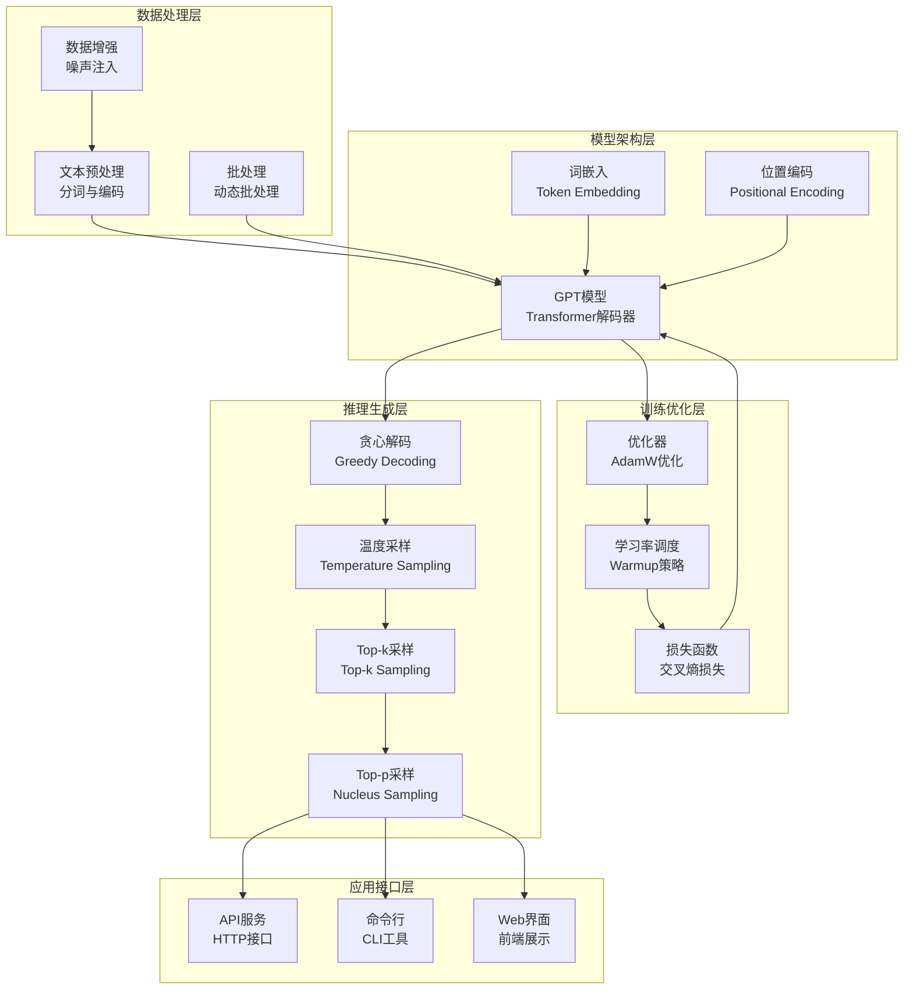

# 14.6 综合项目：GPT文本生成系统

> **设计思想**：通过完整的项目实践，巩固GPT系列模型核心技术的理解和应用

## 项目概述

在本章的前几节中，我们学习了GPT-1到GPT-3的演进历程、因果语言建模、自回归生成原理以及各种采样策略。为了将这些理论知识转化为实际应用能力，本项目将指导读者实现一个完整的GPT文本生成系统。

该项目将涵盖从模型实现、训练流程、推理生成到采样策略控制的完整文本生成流水线，帮助读者深入理解GPT模型在实际应用中的各种技术细节和优化策略。

## 项目目标

完成本项目后，你将：

- ✅ **实现完整的GPT模型架构**：掌握GPT系列模型的核心组件实现
- ✅ **构建文本生成训练流程**：理解数据预处理、批处理、训练循环等关键环节
- ✅ **实现多种推理生成策略**：掌握贪心解码、温度采样、Top-k采样等生成策略
- ✅ **进行性能优化**：掌握批处理、缓存等性能优化技术
- ✅ **构建完整的应用系统**：掌握从模型到应用的完整开发流程

## 项目架构设计

### 系统组件



## 核心实现

### 1. GPT模型实现

```java
public class GPTModel extends Model {
    private GPTConfig config;
    private EmbeddingLayer tokenEmbedding;
    private PositionalEncoding positionalEncoding;
    private List<GPTBlock> transformerBlocks;
    private LayerNormalization finalLayerNorm;
    private LinearLayer lmHead;
    
    public GPTModel(GPTConfig config) {
        super("GPT");
        this.config = config;
        
        // 词嵌入层
        this.tokenEmbedding = new EmbeddingLayer(
            "token_embedding",
            config.getVocabSize(),
            config.getHiddenSize()
        );
        
        // 位置编码层
        this.positionalEncoding = new PositionalEncoding(
            "position_encoding",
            config.getMaxPositionEmbeddings(),
            config.getHiddenSize()
        );
        
        // Transformer块
        this.transformerBlocks = new ArrayList<>();
        for (int i = 0; i < config.getNumLayers(); i++) {
            transformerBlocks.add(new GPTBlock(
                "block_" + i,
                config.getHiddenSize(),
                config.getNumHeads(),
                config.getIntermediateSize(),
                config.getDropoutRate()
            ));
        }
        
        // 最终层归一化
        this.finalLayerNorm = new LayerNormalization(
            "final_layer_norm",
            config.getHiddenSize()
        );
        
        // 语言模型头部
        this.lmHead = new LinearLayer(
            "lm_head",
            config.getHiddenSize(),
            config.getVocabSize()
        );
    }
    
    @Override
    public Variable forward(Variable... inputs) {
        Variable inputIds = inputs[0];
        Variable attentionMask = inputs.length > 1 ? inputs[1] : null;
        
        // 词嵌入
        Variable hiddenStates = tokenEmbedding.forward(inputIds);
        
        // 位置编码
        hiddenStates = positionalEncoding.forward(hiddenStates);
        
        // 逐层处理
        for (GPTBlock block : transformerBlocks) {
            hiddenStates = block.forward(hiddenStates, attentionMask);
        }
        
        // 最终层归一化
        hiddenStates = finalLayerNorm.forward(hiddenStates);
        
        // 语言模型头部
        Variable logits = lmHead.forward(hiddenStates);
        
        return logits;
    }
    
    public List<Integer> generate(String prompt, GenerationConfig config) {
        GPTGenerator generator = new GPTGenerator(this, config);
        return generator.generate(prompt);
    }
}
```

### 2. 数据预处理模块

```java
public class GPTDataProcessor {
    private Tokenizer tokenizer;
    private int maxSeqLength;
    
    public GPTDataProcessor(Tokenizer tokenizer, int maxSeqLength) {
        this.tokenizer = tokenizer;
        this.maxSeqLength = maxSeqLength;
    }
    
    public GPTBatch processBatch(List<String> texts) {
        List<int[]> tokenizedTexts = new ArrayList<>();
        
        // 1. 分词和编码
        for (String text : texts) {
            int[] tokens = tokenizer.encode(text);
            tokenizedTexts.add(tokens);
        }
        
        // 2. 创建输入-目标对
        List<int[]> inputs = new ArrayList<>();
        List<int[]> targets = new ArrayList<>();
        
        for (int[] tokens : tokenizedTexts) {
            // 输入是除了最后一个token的所有token
            int[] input = Arrays.copyOf(tokens, tokens.length - 1);
            // 目标是除了第一个token的所有token
            int[] target = Arrays.copyOfRange(tokens, 1, tokens.length);
            
            // 截断或填充到最大序列长度
            input = padOrTruncate(input, maxSeqLength - 1);
            target = padOrTruncate(target, maxSeqLength - 1);
            
            inputs.add(input);
            targets.add(target);
        }
        
        // 3. 创建注意力掩码
        Variable attentionMask = createAttentionMask(inputs);
        
        return new GPTBatch(
            new Variable(NdArray.of(inputs.toArray(new int[0][]))),
            new Variable(NdArray.of(targets.toArray(new int[0][]))),
            attentionMask
        );
    }
    
    private int[] padOrTruncate(int[] tokens, int targetLength) {
        if (tokens.length >= targetLength) {
            return Arrays.copyOf(tokens, targetLength);
        } else {
            int[] padded = new int[targetLength];
            System.arraycopy(tokens, 0, padded, 0, tokens.length);
            // 填充0作为padding token
            return padded;
        }
    }
    
    private Variable createAttentionMask(List<int[]> inputs) {
        int batchSize = inputs.size();
        int seqLength = inputs.get(0).length;
        
        float[][] mask = new float[batchSize][seqLength];
        
        for (int i = 0; i < batchSize; i++) {
            int[] tokens = inputs.get(i);
            for (int j = 0; j < seqLength; j++) {
                // 0表示padding token，1表示有效token
                mask[i][j] = (tokens[j] != 0) ? 1.0f : 0.0f;
            }
        }
        
        return new Variable(NdArray.of(mask));
    }
}
```

### 3. 训练流程实现

```java
public class GPTTrainer {
    private GPTModel model;
    private Optimizer optimizer;
    private LossFunction lossFunction;
    private DataLoader dataLoader;
    private Logger logger;
    
    public GPTTrainer(GPTConfig config) {
        this.model = new GPTModel(config);
        this.optimizer = new AdamWOptimizer(
            config.getLearningRate(),
            config.getBeta1(),
            config.getBeta2(),
            config.getWeightDecay()
        );
        this.lossFunction = new LabelSmoothingCrossEntropy(config.getLabelSmoothing());
        this.logger = new Logger("gpt_training.log");
    }
    
    public void train(int epochs, String trainDataPath, String valDataPath) {
        // 加载训练数据
        DataLoader trainLoader = createDataLoader(trainDataPath, true);
        DataLoader valLoader = createDataLoader(valDataPath, false);
        
        for (int epoch = 0; epoch < epochs; epoch++) {
            logger.info("Epoch {}/{}", epoch + 1, epochs);
            
            // 训练阶段
            double trainLoss = trainEpoch(trainLoader);
            
            // 验证阶段
            double valLoss = validateEpoch(valLoader);
            
            logger.info("Epoch {} completed. Train Loss: {:.4f}, Val Loss: {:.4f}", 
                      epoch + 1, trainLoss, valLoss);
            
            // 保存检查点
            if (epoch % config.getSaveInterval() == 0) {
                saveCheckpoint(epoch, trainLoss, valLoss);
            }
            
            // 生成示例文本
            if (epoch % config.getEvalInterval() == 0) {
                generateSampleText();
            }
        }
    }
    
    private double trainEpoch(DataLoader dataLoader) {
        model.train();
        double totalLoss = 0.0;
        int batchCount = 0;
        
        for (GPTBatch batch : dataLoader) {
            // 前向传播
            Variable logits = model.forward(batch.getInputIds(), batch.getAttentionMask());
            
            // 计算损失
            Variable loss = computeLoss(logits, batch.getTargets());
            
            // 反向传播
            loss.backward();
            
            // 梯度裁剪
            clipGradients(model.getParameters(), config.getMaxGradientNorm());
            
            // 优化步骤
            optimizer.step();
            optimizer.zeroGrad();
            
            totalLoss += loss.getData().getFloat();
            batchCount++;
            
            if (batchCount % 100 == 0) {
                logger.info("Batch {}: Loss = {:.4f}", 
                          batchCount, totalLoss / batchCount);
            }
        }
        
        return totalLoss / batchCount;
    }
    
    private double validateEpoch(DataLoader dataLoader) {
        model.eval();
        double totalLoss = 0.0;
        int batchCount = 0;
        
        try (NoGradGuard noGrad = new NoGradGuard()) {
            for (GPTBatch batch : dataLoader) {
                Variable logits = model.forward(batch.getInputIds(), batch.getAttentionMask());
                Variable loss = computeLoss(logits, batch.getTargets());
                
                totalLoss += loss.getData().getFloat();
                batchCount++;
            }
        }
        
        return totalLoss / batchCount;
    }
    
    private Variable computeLoss(Variable logits, Variable targets) {
        // 重塑为二维矩阵
        Variable reshapedLogits = logits.reshape(-1, logits.getShape().get(-1));
        Variable reshapedTargets = targets.reshape(-1);
        
        return lossFunction.forward(reshapedLogits, reshapedTargets);
    }
}
```

### 4. 推理生成实现

```java
public class GPTGenerator {
    private GPTModel model;
    private Tokenizer tokenizer;
    private GenerationConfig config;
    
    public GPTGenerator(GPTModel model, GenerationConfig config) {
        this.model = model;
        this.tokenizer = new Tokenizer(); // 假设已初始化
        this.config = config;
    }
    
    public String generate(String prompt) {
        // 1. 编码提示文本
        int[] inputIds = tokenizer.encode(prompt);
        List<Integer> generatedTokens = new ArrayList<>();
        
        // 将输入token添加到生成列表
        for (int tokenId : inputIds) {
            generatedTokens.add(tokenId);
        }
        
        // 2. 逐步生成
        for (int i = 0; i < config.getMaxTokens(); i++) {
            // 构建当前输入
            int[] currentInput = getCurrentInput(generatedTokens);
            
            // 前向传播
            Variable inputTensor = new Variable(NdArray.of(new int[][]{currentInput}));
            Variable logits = model.forward(inputTensor);
            
            // 获取最后一个位置的logits
            Variable lastLogits = logits.slice(-1);
            
            // 根据配置选择下一个token
            int nextToken = selectNextToken(lastLogits);
            generatedTokens.add(nextToken);
            
            // 检查停止条件
            if (nextToken == tokenizer.getEosTokenId() || 
                isStopSequence(generatedTokens)) {
                break;
            }
        }
        
        // 3. 解码生成的token
        return tokenizer.decode(generatedTokens.stream()
            .mapToInt(Integer::intValue)
            .toArray());
    }
    
    private int[] getCurrentInput(List<Integer> generatedTokens) {
        int maxLength = model.getConfig().getMaxPositionEmbeddings();
        
        if (generatedTokens.size() <= maxLength) {
            return generatedTokens.stream().mapToInt(Integer::intValue).toArray();
        } else {
            // 如果超过最大长度，只保留最后maxLength个token
            return generatedTokens.subList(
                generatedTokens.size() - maxLength, 
                generatedTokens.size()
            ).stream().mapToInt(Integer::intValue).toArray();
        }
    }
    
    private int selectNextToken(Variable logits) {
        switch (config.getSamplingStrategy()) {
            case GREEDY:
                return greedySample(logits);
            case TEMPERATURE:
                return temperatureSample(logits, config.getTemperature());
            case TOP_K:
                return topKSample(logits, config.getTopK());
            case TOP_P:
                return topPSample(logits, config.getTopP());
            case TEMPERATURE_TOP_K:
                return temperatureTopKSample(logits, config.getTemperature(), config.getTopK());
            case TEMPERATURE_TOP_P:
                return temperatureTopPSample(logits, config.getTemperature(), config.getTopP());
            default:
                return greedySample(logits);
        }
    }
    
    private int greedySample(Variable logits) {
        return logits.argmax(-1).getData().toInt();
    }
    
    private int temperatureSample(Variable logits, double temperature) {
        Variable adjustedLogits = logits.div(temperature);
        Variable probs = adjustedLogits.softmax(-1);
        return sampleFromDistribution(probs);
    }
    
    private int topKSample(Variable logits, int k) {
        Variable topKLogits = getTopKLogits(logits, k);
        Variable probs = topKLogits.softmax(-1);
        return sampleFromDistribution(probs);
    }
    
    private int topPSample(Variable logits, double p) {
        Variable probs = logits.softmax(-1);
        Variable nucleusProbs = getNucleusProbs(probs, p);
        return sampleFromDistribution(nucleusProbs);
    }
    
    private int temperatureTopKSample(Variable logits, double temperature, int k) {
        Variable adjustedLogits = logits.div(temperature);
        Variable topKLogits = getTopKLogits(adjustedLogits, k);
        Variable probs = topKLogits.softmax(-1);
        return sampleFromDistribution(probs);
    }
    
    private int temperatureTopPSample(Variable logits, double temperature, double p) {
        Variable adjustedLogits = logits.div(temperature);
        Variable probs = adjustedLogits.softmax(-1);
        Variable nucleusProbs = getNucleusProbs(probs, p);
        return sampleFromDistribution(nucleusProbs);
    }
}
```

## 性能优化

### 1. 批处理优化

```java
public class BatchedGenerator {
    private GPTModel model;
    private GenerationConfig config;
    
    public List<String> batchGenerate(List<String> prompts) {
        List<String> results = new ArrayList<>();
        int batchSize = config.getBatchSize();
        
        // 动态批处理
        for (int i = 0; i < prompts.size(); i += batchSize) {
            int endIndex = Math.min(i + batchSize, prompts.size());
            List<String> batchPrompts = prompts.subList(i, endIndex);
            
            List<String> batchResults = generateBatch(batchPrompts);
            results.addAll(batchResults);
        }
        
        return results;
    }
    
    private List<String> generateBatch(List<String> prompts) {
        // 1. 批量编码
        List<int[]> inputIdsList = new ArrayList<>();
        int maxLen = 0;
        
        for (String prompt : prompts) {
            int[] ids = tokenizer.encode(prompt);
            inputIdsList.add(ids);
            maxLen = Math.max(maxLen, ids.length);
        }
        
        // 2. 填充到相同长度
        int[][] batchInputIds = new int[prompts.size()][maxLen];
        for (int i = 0; i < prompts.size(); i++) {
            int[] ids = inputIdsList.get(i);
            System.arraycopy(ids, 0, batchInputIds[i], 0, ids.length);
            // 填充0
            Arrays.fill(batchInputIds[i], ids.length, maxLen, 0);
        }
        
        // 3. 批量生成（简化实现）
        List<String> results = new ArrayList<>();
        for (int i = 0; i < prompts.size(); i++) {
            // 这里应该实现真正的批量生成逻辑
            // 为简化，我们逐个生成
            results.add(generate(prompts.get(i)));
        }
        
        return results;
    }
}
```

### 2. KV缓存优化

```java
public class KVCache {
    private List<Variable> keyCache;
    private List<Variable> valueCache;
    private int maxLength;
    
    public KVCache(int numLayers, int maxLength) {
        this.keyCache = new ArrayList<>(numLayers);
        this.valueCache = new ArrayList<>(numLayers);
        this.maxLength = maxLength;
        
        // 初始化缓存
        for (int i = 0; i < numLayers; i++) {
            keyCache.add(null);
            valueCache.add(null);
        }
    }
    
    public void updateCache(int layerIdx, Variable keys, Variable values) {
        if (keyCache.get(layerIdx) == null) {
            keyCache.set(layerIdx, keys);
            valueCache.set(layerIdx, values);
        } else {
            // 拼接新的key和value
            Variable existingKeys = keyCache.get(layerIdx);
            Variable existingValues = valueCache.get(layerIdx);
            
            keyCache.set(layerIdx, existingKeys.concat(keys, -2));
            valueCache.set(layerIdx, existingValues.concat(values, -2));
        }
    }
    
    public Variable getKeys(int layerIdx) {
        return keyCache.get(layerIdx);
    }
    
    public Variable getValues(int layerIdx) {
        return valueCache.get(layerIdx);
    }
}
```

## 应用接口实现

### 1. HTTP API服务

```java
@RestController
@RequestMapping("/api/gpt")
public class GPTController {
    private GPTModel model;
    private GPTGenerator generator;
    
    @PostMapping("/generate")
    public ResponseEntity<GenerationResponse> generateText(
            @RequestBody GenerationRequest request) {
        
        try {
            String result = generator.generate(
                request.getPrompt(), 
                request.getConfig()
            );
            
            GenerationResponse response = new GenerationResponse();
            response.setText(result);
            response.setSuccess(true);
            
            return ResponseEntity.ok(response);
        } catch (Exception e) {
            GenerationResponse response = new GenerationResponse();
            response.setSuccess(false);
            response.setError(e.getMessage());
            
            return ResponseEntity.status(500).body(response);
        }
    }
    
    @PostMapping("/batch-generate")
    public ResponseEntity<BatchGenerationResponse> batchGenerateText(
            @RequestBody BatchGenerationRequest request) {
        
        try {
            List<String> results = generator.batchGenerate(
                request.getPrompts(),
                request.getConfig()
            );
            
            BatchGenerationResponse response = new BatchGenerationResponse();
            response.setTexts(results);
            response.setSuccess(true);
            
            return ResponseEntity.ok(response);
        } catch (Exception e) {
            BatchGenerationResponse response = new BatchGenerationResponse();
            response.setSuccess(false);
            response.setError(e.getMessage());
            
            return ResponseEntity.status(500).body(response);
        }
    }
}
```

### 2. 命令行工具

```java
public class GPTCommandLine {
    private GPTModel model;
    private GPTGenerator generator;
    
    public static void main(String[] args) {
        GPTCommandLine cli = new GPTCommandLine();
        cli.run(args);
    }
    
    public void run(String[] args) {
        // 解析命令行参数
        CommandLineParser parser = new CommandLineParser();
        GPTCommandLineOptions options = parser.parse(args);
        
        // 加载模型
        loadModel(options.getModelPath());
        
        // 根据参数执行不同操作
        if (options.isInteractiveMode()) {
            runInteractiveMode();
        } else if (options.getInputFile() != null) {
            runBatchMode(options.getInputFile(), options.getOutputFile());
        } else {
            System.out.println("Please specify input method");
        }
    }
    
    private void runInteractiveMode() {
        Scanner scanner = new Scanner(System.in);
        System.out.println("GPT Text Generator (type 'quit' to exit)");
        
        while (true) {
            System.out.print("> ");
            String input = scanner.nextLine();
            
            if ("quit".equals(input)) {
                break;
            }
            
            if (!input.trim().isEmpty()) {
                long startTime = System.currentTimeMillis();
                String result = generator.generate(input);
                long endTime = System.currentTimeMillis();
                
                System.out.println(result);
                System.out.printf("(Generated in %d ms)%n%n", endTime - startTime);
            }
        }
    }
    
    private void runBatchMode(String inputFile, String outputFile) {
        try {
            List<String> prompts = readPromptsFromFile(inputFile);
            List<String> results = new ArrayList<>();
            
            for (String prompt : prompts) {
                String result = generator.generate(prompt);
                results.add(result);
            }
            
            writeResultsToFile(results, outputFile);
            System.out.println("Batch generation completed. Results saved to " + outputFile);
        } catch (IOException e) {
            System.err.println("Error in batch generation: " + e.getMessage());
        }
    }
}
```

## 项目评估

### 1. 性能基准测试

```java
public class PerformanceBenchmark {
    private GPTModel model;
    
    public void runBenchmark() {
        System.out.println("Running GPT Performance Benchmark...");
        
        // 测试不同序列长度的推理时间
        int[] seqLengths = {64, 128, 256, 512};
        for (int seqLen : seqLengths) {
            double avgTime = benchmarkSequenceLength(seqLen, 10);
            System.out.printf("Sequence Length %d: %.2f ms/token%n", seqLen, avgTime);
        }
        
        // 测试不同批处理大小的吞吐量
        int[] batchSizes = {1, 2, 4, 8};
        for (int batchSize : batchSizes) {
            double throughput = benchmarkBatchSize(batchSize, 10);
            System.out.printf("Batch Size %d: %.2f tokens/sec%n", batchSize, throughput);
        }
    }
    
    private double benchmarkSequenceLength(int seqLen, int iterations) {
        long totalTime = 0;
        int totalTokens = 0;
        
        for (int i = 0; i < iterations; i++) {
            // 生成测试输入
            int[] inputIds = generateRandomInput(seqLen);
            Variable input = new Variable(NdArray.of(new int[][]{inputIds}));
            
            long startTime = System.currentTimeMillis();
            Variable logits = model.forward(input);
            long endTime = System.currentTimeMillis();
            
            totalTime += (endTime - startTime);
            totalTokens += seqLen;
        }
        
        return (double) totalTime / totalTokens;
    }
    
    private double benchmarkBatchSize(int batchSize, int iterations) {
        long totalTime = 0;
        int totalTokens = 0;
        
        for (int i = 0; i < iterations; i++) {
            // 生成批处理输入
            int[][] batchInputIds = generateRandomBatchInput(batchSize, 128);
            Variable input = new Variable(NdArray.of(batchInputIds));
            
            long startTime = System.currentTimeMillis();
            Variable logits = model.forward(input);
            long endTime = System.currentTimeMillis();
            
            totalTime += (endTime - startTime);
            totalTokens += batchSize * 128;
        }
        
        return (double) totalTokens / (totalTime / 1000.0);
    }
}
```

### 2. 生成质量评估

```java
public class GenerationEvaluator {
    public GenerationMetrics evaluateGeneration(List<String> prompts, 
                                              List<String> generatedTexts) {
        double avgLength = calculateAverageLength(generatedTexts);
        double diversityScore = calculateDiversity(generatedTexts);
        double coherenceScore = calculateCoherence(generatedTexts);
        double repetitionScore = calculateRepetition(generatedTexts);
        
        return new GenerationMetrics(
            avgLength,
            diversityScore,
            coherenceScore,
            repetitionScore
        );
    }
    
    private double calculateAverageLength(List<String> texts) {
        return texts.stream()
            .mapToInt(String::length)
            .average()
            .orElse(0.0);
    }
    
    private double calculateDiversity(List<String> texts) {
        // 计算词汇丰富度
        Set<String> allWords = new HashSet<>();
        int totalWords = 0;
        
        for (String text : texts) {
            String[] words = text.split("\\s+");
            allWords.addAll(Arrays.asList(words));
            totalWords += words.length;
        }
        
        return (double) allWords.size() / totalWords;
    }
    
    private double calculateCoherence(List<String> texts) {
        // 使用语言模型评分计算连贯性
        double totalScore = 0.0;
        
        for (String text : texts) {
            double score = languageModel.score(text);
            totalScore += score;
        }
        
        return totalScore / texts.size();
    }
    
    private double calculateRepetition(List<String> texts) {
        // 计算n-gram重复率
        int totalRepetitions = 0;
        int totalNgrams = 0;
        
        for (String text : texts) {
            List<String> ngrams = extractNgrams(text, 4);
            Set<String> uniqueNgrams = new HashSet<>(ngrams);
            
            totalRepetitions += (ngrams.size() - uniqueNgrams.size());
            totalNgrams += ngrams.size();
        }
        
        return (double) totalRepetitions / totalNgrams;
    }
}
```

## 项目总结

通过本项目的完整实现，我们深入理解了GPT系列模型在文本生成任务中的应用：

1. **模型实现**：掌握了GPT模型的核心架构和组件实现
2. **训练流程**：理解了数据预处理、批处理、训练循环等关键环节
3. **推理生成**：学会了多种生成策略和采样技术
4. **性能优化**：掌握了批处理、缓存等性能优化技术
5. **应用开发**：具备了从模型到完整应用的开发能力

这个项目不仅巩固了理论知识，更重要的是培养了实际的AI系统开发能力，为后续学习更复杂的语言模型和应用奠定了坚实基础。

## 扩展思考

1. **模型压缩**：如何在保持性能的同时减小模型大小
2. **多模态生成**：如何扩展系统支持图像、音频等多模态内容
3. **实时生成**：如何实现低延迟的实时文本生成
4. **个性化生成**：如何根据用户偏好调整生成风格
5. **安全控制**：如何防止生成有害或不适当的内容

通过不断实践和优化，我们可以构建出更加高效、智能的文本生成系统，为实际应用提供强大的技术支持。