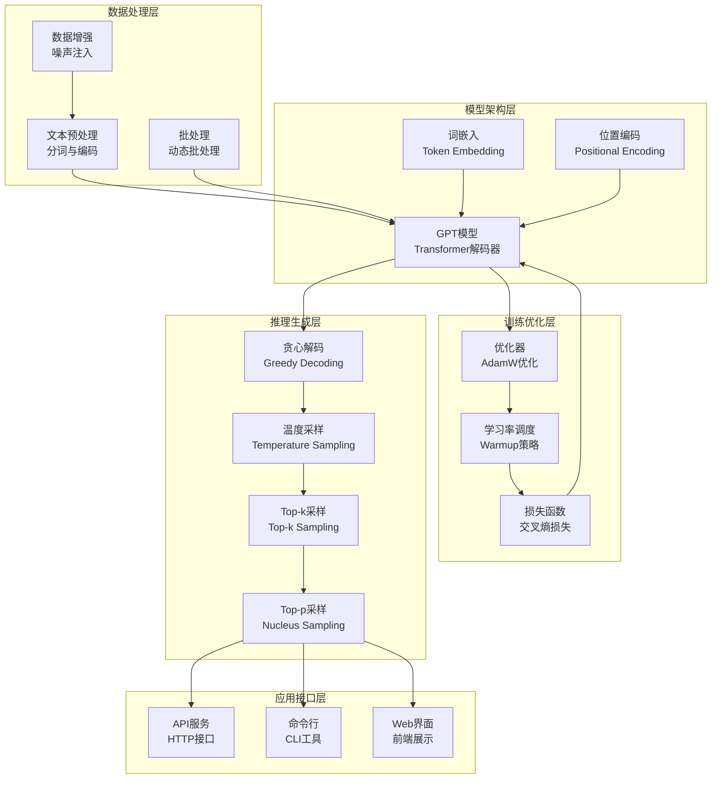

# 14.6 综合项目：GPT文本生成系统

> **设计思想**：通过完整的项目实践，巩固GPT系列模型核心技术的理解和应用

## 项目概述："把学到的知识串起来"

在本章的前几节中，我们学习了GPT系列模型的演进历程和核心技术：
- 📚 **14.1-14.3**: GPT-1到GPT-3的"成长历程" 
- 🎯 **14.4**: 因果语言建模的"预测原理"
- 🎨 **14.5**: 采样策略的"创造性控制"

现在，就像学完了零散的功夫招式，需要通过实战把它们融会贯通。本项目将指导你实现一个**完整的、可运行的GPT文本生成系统**，从数据处理到模型训练，从文本生成到性能优化，涵盖整个开发流水线。

**就像造一辆车:**
- 前面几节 = 学习引擎、轮胎、方向盘等零件
- 本节项目 = 把所有零件组装成一辆能开的车

## 项目目标：你将收获什么?

完成本项目后，你将能够:

✅ **实现完整的GPT模型架构**
   - 不是理论,是真的能运行的代码
   - 包含所有核心组件:嵌入、注意力、前馈网络等
   
✅ **构建文本生成训练流程**
   - 从原始文本到训练好的模型
   - 理解数据预处理、批处理、训练循环等关键环节
   
✅ **实现多种推理生成策略**
   - 贪心、温度、Top-k、Top-p等策略
   - 能根据场景灵活选择

✅ **进行性能优化**
   - 让模型跑得更快
   - 掌握批处理、缓存等优化技巧
   
✅ **构建完整的应用系统**
   - 不只是模型,还有API、命令行工具
   - 真正能用起来的系统

**学习成果:**
- 📝 一个完整可运行的GPT系统
- 💡 深入理解GPT的实现细节
- 🔧 掌握从理论到实践的技能
- 🎯 为开发实际AI应用打下基础

## 项目架构设计:"搭积木式"分层结构

本项目采用分层架构,每一层专注于特定功能,就像盖楼一样,一层层搭建:

### 🏗️ 五层架构

**1. 数据处理层** (地基)
- 文本预处理:清洗、分词
- 批处理:组织数据喂给模型
- 数据增强:提高模型鲁棒性

**2. 模型架构层** (主体结构)
- GPT模型:核心的Transformer解码器
- 词嵌入:把文字转成数字
- 位置编码:告诉模型词的位置

**3. 训练优化层** (电梯和管道)
- 优化器:AdamW等先进算法
- 学习率调度:动态调整学习速度
- 损失函数:衡量模型好坏

**4. 推理生成层** (智能控制)
- 贪心解码:稳定可靠
- 温度采样:调节创造性
- Top-k/p采样:平衡质量和多样性

**5. 应用接口层** (门窗和装修)
- HTTP API:供其他程序调用
- 命令行工具:开发者友好
- Web界面:普通用户友好



## 核心实现：关键代码详解

下面展示关键组件的实现。为了提高可读性，我们将:
- ✓ 保留核心逻辑代码
- ✓ 添加详细的中文注释  
- ✗ 省略部分重复性的辅助代码

### 1. GPT模型实现:"大脑"的构造

这是整个系统的核心,就像汽车的引擎。

```java
public class GPTModel extends Model {
    // 模型的四大核心组件
    private EmbeddingLayer tokenEmbedding;      // 词嵌入:"文字→数字"
    private PositionalEncoding positionalEncoding; // 位置编码:"告诉模型位置"
    private List<GPTBlock> transformerBlocks;   // Transformer块:"思考层"
    private LinearLayer lmHead;                 // 输出层:"数字→文字"
    
    public GPTModel(GPTConfig config) {
        super("GPT");
        
        // 1. 词嵌入层:将每个词转换成768维(或其他)的向量
        this.tokenEmbedding = new EmbeddingLayer(
            "token_embedding",
            config.getVocabSize(),    // 词汇表大小,如50000
            config.getHiddenSize()    // 隐藏层维度,如768
        );
        
        // 2. 位置编码:让模型知道"这是第几个词"
        this.positionalEncoding = new PositionalEncoding(
            "position_encoding",
            config.getMaxPositionEmbeddings(), // 最大序列长度,如512
            config.getHiddenSize()
        );
        
        // 3. Transformer块:堆叠多层(如12层),逐层提取特征
        this.transformerBlocks = new ArrayList<>();
        for (int i = 0; i < config.getNumLayers(); i++) {
            transformerBlocks.add(new GPTBlock(
                "block_" + i,
                config.getHiddenSize(),
                config.getNumHeads(),      // 注意力头数,如12
                config.getIntermediateSize(), // 前馈网络维度,如3072
                config.getDropoutRate()    // Dropout比率,如0.1
            ));
        }
        
        // 4. 输出层:将隐藏状态映射回词汇表空间
        this.lmHead = new LinearLayer(
            "lm_head",
            config.getHiddenSize(),  // 输入:768维
            config.getVocabSize()    // 输出:50000维(每个词一个分数)
        );
    }
    
    @Override
    public Variable forward(Variable... inputs) {
        Variable inputIds = inputs[0]; // 输入的token ID序列
        
        // 步骤1: 词嵌入 - "文字→向量"
        Variable hiddenStates = tokenEmbedding.forward(inputIds);
        
        // 步骤2: 位置编码 - "加上位置信息"
        hiddenStates = positionalEncoding.forward(hiddenStates);
        
        // 步骤3: 逐层Transformer处理 - "深度思考"
        for (GPTBlock block : transformerBlocks) {
            hiddenStates = block.forward(hiddenStates);
        }
        
        // 步骤4: 输出层 - "向量→文字分数"
        Variable logits = lmHead.forward(hiddenStates);
        
        return logits; // 返回每个词的原始分数(未归一化)
    }
}
```

**关键点理解:**
- **Embedding**: 把"猫"变成[0.2, 0.5, -0.1, ...]这样的向量
- **Position**: 告诉模型"猫"是第3个词还是第5个词
- **Transformer**: 12层神经网络,让模型"理解"语言
- **LM Head**: 把最后的向量变成50000个分数,分数最高的词最可能

### 2. 数据预处理:"喂饭"给模型

数据预处理就像给模型"做饭"——把原始文本变成模型能"吃"的格式。

```
public class GPTDataProcessor {
    private Tokenizer tokenizer;  // 分词器:"句子→词列表"
    private int maxSeqLength;     // 最大序列长度
    
    public GPTBatch processBatch(List<String> texts) {
        // 步骤1: 分词编码 - "文字→数字ID"
        List<int[]> tokenizedTexts = new ArrayList<>();
        for (String text : texts) {
            int[] tokens = tokenizer.encode(text);
            tokenizedTexts.add(tokens);
        }
        
        // 步骤2: 创建输入-目标对 - "制作训练数据"
        // 输入: "今天 天气"  →  目标: "天气 很好"
        // 模型学习: 看到"今天 天气"，预测"很好"
        List<int[]> inputs = new ArrayList<>();
        List<int[]> targets = new ArrayList<>();
        
        for (int[] tokens : tokenizedTexts) {
            // 输入 = 去掉最后一个词
            int[] input = Arrays.copyOf(tokens, tokens.length - 1);
            // 目标 = 去掉第一个词  
            int[] target = Arrays.copyOfRange(tokens, 1, tokens.length);
            
            inputs.add(input);
            targets.add(target);
        }
        
        // 步骤3: 创建批次数据
        return new GPTBatch(
            new Variable(NdArray.of(inputs.toArray(new int[0][]))),
            new Variable(NdArray.of(targets.toArray(new int[0][]))),
            attentionMask
        );
    }
}
```

**为什么这样做?**

想象教小孩说话:
- 你说"今天天气" → 小孩接"很好"
- 训练数据就是这样的"上半句→下半句"对
- 模型学习了成千上万对后,就会"接话"了

```
