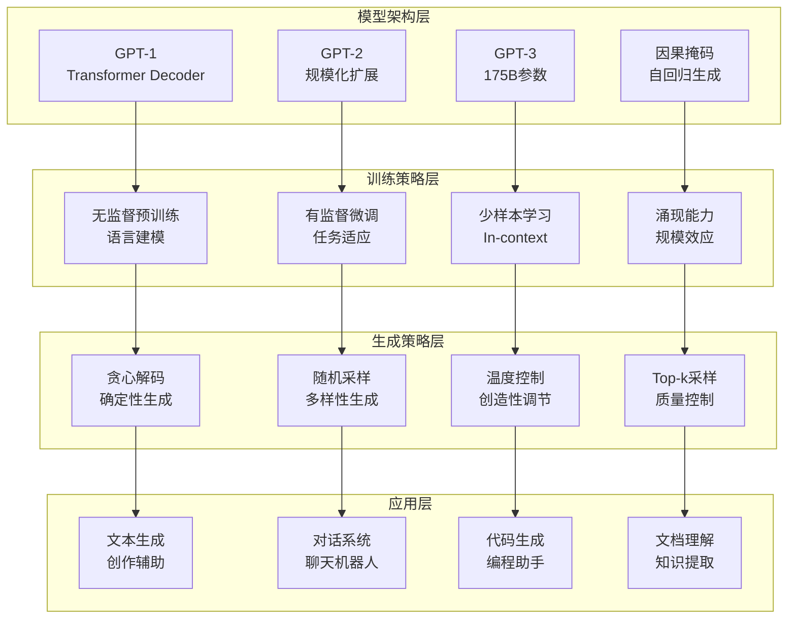

# 第14章：GPT系列模型深度剖析

> **设计思想**：系统学习GPT模型的演进历程，掌握大语言模型的核心技术

## 章节概述

GPT（Generative Pre-trained Transformer）系列模型代表了大语言模型发展的重要里程碑，从GPT-1的预训练+微调范式，到GPT-2的规模化探索，再到GPT-3的涌现能力，每一次迭代都推动了自然语言处理技术的进步。本章将深入剖析GPT系列模型的技术演进，理解因果语言建模的本质，掌握自回归生成的原理。

我们将基于TinyAI框架，通过实际的代码示例和项目实践，帮助读者掌握GPT模型的核心技术。通过本章的学习，读者将能够理解并实现GPT系列模型，具备开发大语言模型的能力。

## 学习目标

完成本章学习后，你将：

- ✅ **理解GPT模型演进**：掌握GPT-1到GPT-3的技术发展脉络
- ✅ **掌握因果语言建模**：理解自回归生成的数学原理和实现
- ✅ **实现GPT模型架构**：掌握GPT模型的完整实现细节
- ✅ **学习生成策略**：掌握温度采样、Top-k采样等生成技术
- ✅ **具备GPT应用能力**：能够开发基于GPT的文本生成应用

## 章节内容

### 14.1 GPT-1：预训练+微调范式的开创
**学习重点**：理解GPT-1的架构设计和训练策略
- GPT-1的架构设计：Transformer Decoder的巧妙应用
- 无监督预训练的语言建模目标
- 有监督微调的任务适应策略
- GPT-1相比传统方法的突破性改进

### 14.2 GPT-2：模型规模化的探索
**学习重点**：掌握GPT-2的架构演进和规模化策略
- 从GPT-1到GPT-2的架构演进
- 参数规模从117M到1.5B的扩展
- Zero-shot、One-shot、Few-shot学习能力的涌现
- 文本生成质量的显著提升

### 14.3 GPT-3：涌现能力与少样本学习
**学习重点**：理解GPT-3的规模效应和涌现能力
- GPT-3的175B参数规模和训练数据
- In-context Learning的惊人能力
- 涌现能力：规模带来的质变
- 与GPT-2相比的架构改进点

### 14.4 因果语言建模：自回归生成原理
**学习重点**：掌握因果语言建模的数学原理和实现方法
- 因果掩码的数学原理和实现
- 自回归生成的序列建模
- 训练目标：最大似然估计
- 推理过程：逐步生成和概率计算

### 14.5 温度采样与Top-k采样策略
**学习重点**：掌握文本生成的采样策略和优化技术
- 贪心解码vs随机采样的权衡
- 温度参数对生成多样性的控制
- Top-k采样的截断策略
- Top-p (Nucleus)采样的动态选择

## 技术架构图

## 实践项目

**项目名称**：基于TinyAI的GPT文本生成系统

**项目目标**：
- 实现GPT-1/GPT-2规模的模型架构
- 构建完整的文本生成训练和推理流程
- 实现多种采样策略和生成控制
- 优化模型性能，提升生成质量

**技术要求**：
- 代码质量：完整注释、单元测试覆盖率>90%
- 功能完整性：支持多种生成策略和控制参数
- 性能要求：能够处理中等规模的文本生成任务
- 易用性：提供简洁的API和配置接口

**预期成果**：
- 可运行的完整GPT文本生成系统
- 详细的训练日志和性能报告
- 多种采样策略的效果对比
- 技术文档和使用说明

## 本章小结

第14章将为读者建立起GPT系列模型的完整知识体系，从GPT-1的开创性工作到GPT-3的规模效应，再到因果语言建模和生成策略的深入理解。通过本章的学习，读者将具备独立开发大语言模型的能力，为后续章节中模型优化技术的学习奠定坚实基础。

---

**下一章预告**：第15章我们将学习大模型的优化与微调技术，掌握工业级应用的关键技术。