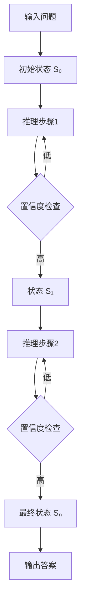
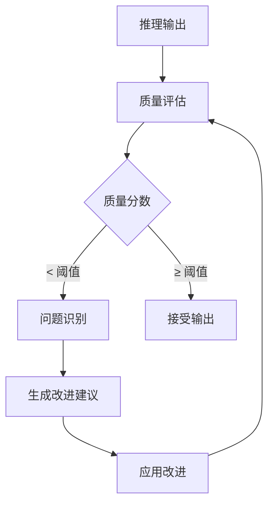

# 14.2.2 R1：推理与反思机制

> **核心主题**：让AI像人一样"思考"和"反思"

## 引言：从"死记硬背"到"理解推理" 🧠

想象两个学生在解数学题：

**学生A（死记硬背型）**：看到题目直接写答案，无法解释推理过程。

**学生B（理解推理型）**：写出完整步骤，每步都验证，最后自我检查。

DeepSeek R1就是这样的"学生B"——展示推理过程，主动进行自我检查。

## 学习目标 🎯

- ✅ 理解多步推理的核心原理
- ✅ 掌握推理状态的演化机制
- ✅ 学会置信度评估的设计思路
- ✅ 理解自我反思的工程实现
- ✅ 掌握R1的整体架构设计

## 一、多步推理机制 🔍

### 1.1 推理状态演化

**核心思想**：将推理过程建模为状态序列



### 1.2 置信度评估

**置信度机制**：

| 推理步骤 | 内容 | 置信度 | 状态 |
|---------|------|--------|------|
| 步骤1 | 识别问题类型 | 0.95 | ✅ 通过 |
| 步骤2 | 移项计算 | 0.92 | ✅ 通过 |
| 步骤3 | 求解结果 | 0.90 | ✅ 通过 |
| 步骤4 | 验证答案 | 0.97 | ✅ 通过 |

**低置信度处理**：自动触发重新推理直到置信度达标。

### 1.3 推理步骤验证

**三重验证策略**：
1. 逻辑一致性验证
2. 数值正确性验证
3. 语义合理性验证

## 二、反思机制 🔍

### 2.1 质量评分

**多维度评估**：

| 维度 | 权重 | 说明 |
|------|------|------|
| 逻辑性 | 30% | 推理步骤是否符合逻辑 |
| 完整性 | 25% | 是否遗漏关键步骤 |
| 准确性 | 25% | 结论是否正确 |
| 清晰性 | 15% | 表达是否清晰 |
| 验证性 | 5% | 是否进行了验证 |

### 2.2 问题识别与改进

**反思流程**：



### 2.3 自适应阈值

| 任务复杂度 | 质量阈值 |
|-----------|---------|
| 简单任务 | 7.5 |
| 中等任务 | 8.5 |
| 复杂任务 | 9.0 |
| 关键任务 | 9.5 |

## 三、R1整体架构 🏗️

### 3.1 架构层次

```
输入层：用户问题
  ↓
理解层：Transformer编码
  ↓
推理层：多步推理 + 置信度评估
  ↓
反思层：质量评估 + 改进建议
  ↓
输出层：推理链 + 最终答案
```

### 3.2 核心组件

**ReasoningBlock**：
- 推理状态管理
- 置信度评估
- 步骤验证
- 推理链构建

**ReflectionBlock**：
- 质量评估
- 问题识别
- 改进建议生成
- 阈值管理

## 四、应用示例 💡

### 示例1：数学问题

**问题**："求解 2x + 5 = 13"

**推理过程**：
```
步骤1：识别为一元一次方程 (置信度: 0.95)
步骤2：两边减5 → 2x = 8 (置信度: 0.92)
步骤3：两边除以2 → x = 4 (置信度: 0.90)
步骤4：验证：2×4+5 = 13 ✓ (置信度: 0.97)
```

**反思评估**：
- 质量分数：9.5/10
- 逻辑性：10分
- 完整性：10分（含验证）
- 准确性：10分

### 示例2：逻辑推理

**问题**："所有鸟都有翅膀，企鹅是鸟，企鹅能飞吗？"

**推理过程**：
```
步骤1：前提提取
  - 所有鸟都有翅膀
  - 企鹅是鸟
步骤2：逻辑推导
  - 企鹅有翅膀 ✓
步骤3：知识补充
  - 有翅膀 ≠ 能飞
  - 企鹅是不会飞的鸟
步骤4：结论
  - 企鹅不能飞
  - 理由：翅膀进化为适应游泳
```

**反思评估**：质量分数 9.2/10

## 五、技术突破 🚀

**核心创新**：

| 维度 | 传统GPT | DeepSeek R1 |
|------|---------|-------------|
| 推理方式 | 单步预测 | 多步迭代 |
| 过程可见性 | ❌ 黑盒 | ✅ 推理链 |
| 质量保证 | ❌ 无验证 | ✅ 多层验证 |
| 自我改进 | ❌ 无 | ✅ 反思机制 |

**突破点**：
1. 显式推理链
2. 置信度感知
3. 多层验证
4. 自我反思
5. 持续改进

## 六、本节总结 🎓

**核心要点**：
1. 多步推理：分解问题为可验证步骤
2. 置信度评估：每步都评估信心程度
3. 多层验证：逻辑、数值、语义三重保障
4. 自我反思：主动评估质量并改进
5. 架构集成：推理层 + 反思层协作

**设计理念**：
- 模拟人类思维过程
- 每一步都可追溯验证
- 主动发现问题并改进
- 提升准确性和可信度

## 思考题 💭

1. 为什么多步推理比单步预测更可靠？
2. 置信度评估如何提升推理质量？
3. 自我反思机制的核心价值是什么？

## 下一节预告 ⏭️

**14.2.3 V3：混合专家架构**
- MoE原理与设计
- 任务感知路由
- 专家协作机制

👉 [继续学习：14.2.3 V3混合专家架构](./14.2.3-v3-moe-architecture.md)
