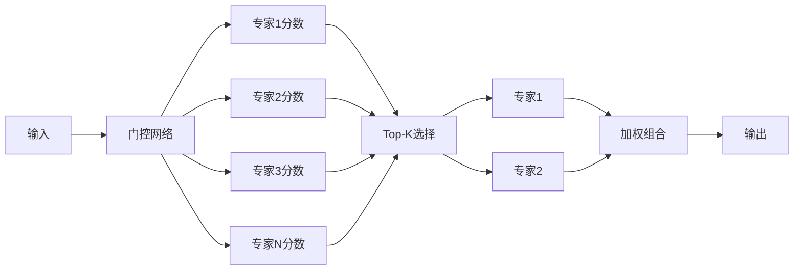
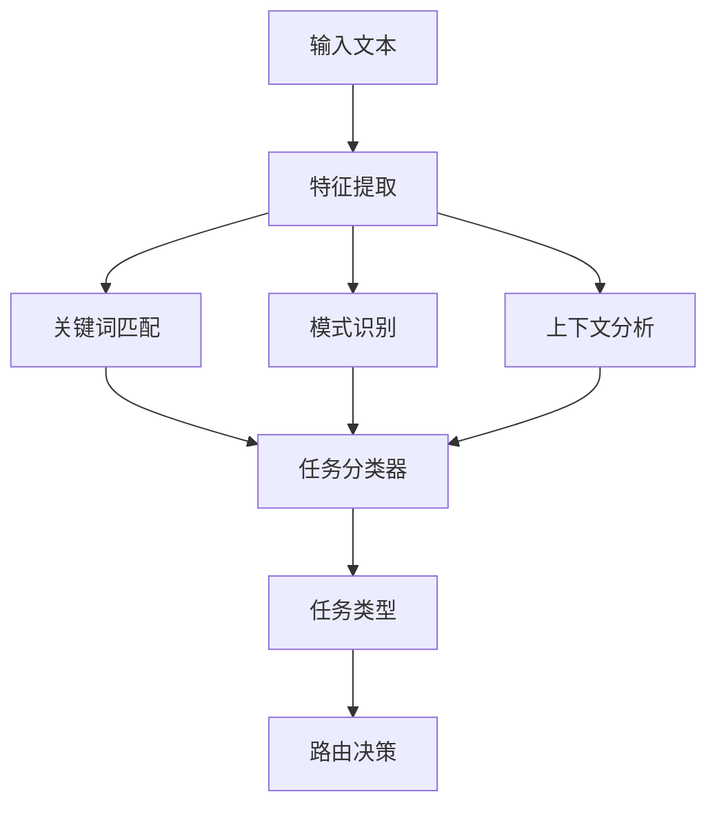
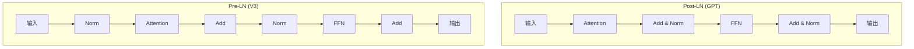
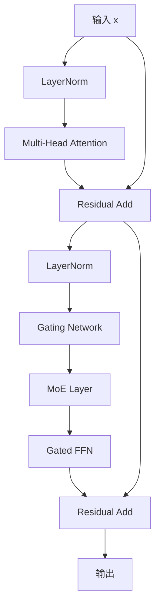

# 14.2.3 V3：混合专家架构

> **核心主题**：术业有专攻——让专家做专业的事

## 引言：专家团队的智慧 🏥

想象你去医院看病：

**传统医院（单一医生）**：
- 一个全科医生处理所有疾病
- 什么都懂一点，但不够专业
- 复杂疾病容易误诊

**现代医院（专家团队）**：
- 导诊台：根据症状引导到对应科室
- 内科专家：擅长内科疾病
- 外科专家：擅长手术治疗
- 儿科专家：擅长儿童疾病
- 复杂病例：多位专家会诊

DeepSeek V3就是这样的"专家医疗团队"——每个专家擅长特定领域，智能路由选择最合适的专家。

## 学习目标 🎯

- ✅ 理解混合专家模型（MoE）的核心原理
- ✅ 掌握任务感知路由的设计思想
- ✅ 学会专家选择和负载均衡策略
- ✅ 理解V3 Transformer块的增强设计
- ✅ 掌握MoE的工程实现要点

## 一、混合专家模型（MoE）原理 🧩

### 1.1 什么是混合专家模型？

**核心概念**：

MoE = Multiple Experts + Gating Network

- **Multiple Experts**：多个专家网络，每个擅长不同任务
- **Gating Network**：门控网络，决定激活哪些专家

**生活类比**：

| MoE组件 | 医院类比 | 功能 |
|---------|---------|------|
| 专家网络 | 各科室医生 | 处理特定类型任务 |
| 门控网络 | 导诊台 | 根据症状选择科室 |
| Top-K选择 | 会诊机制 | 多位专家联合诊断 |
| 负载均衡 | 任务分配 | 避免某科室过忙 |

### 1.2 专家路由机制

**路由流程**：



**门控网络计算**：

```
对于输入 x：
1. 计算每个专家的权重：
   w_i = Softmax(W_g · x)
   
2. 选择Top-K专家：
   选择权重最大的K个专家
   
3. 归一化权重：
   w'_i = w_i / Σ(w_j), j ∈ Top-K
   
4. 加权组合：
   输出 = Σ(w'_i · Expert_i(x))
```

**示例计算**：

假设有4个专家，输入x的门控权重为：
```
专家1: 0.45
专家2: 0.35
专家3: 0.15
专家4: 0.05
```

Top-2选择：
```
选择专家1和专家2
归一化权重：
  专家1: 0.45 / (0.45 + 0.35) = 0.5625
  专家2: 0.35 / (0.45 + 0.35) = 0.4375
  
最终输出：
  0.5625 × 专家1(x) + 0.4375 × 专家2(x)
```

### 1.3 Top-K专家选择

**为什么用Top-K？**

| 方案 | 优势 | 劣势 |
|------|------|------|
| 使用所有专家 | 信息最全面 | 计算成本高 |
| 使用Top-1专家 | 计算最快 | 信息不够全面 |
| 使用Top-K专家 | 平衡性能和成本 | 需要调优K值 |

**K值选择策略**：

```
K = 2（DeepSeek V3默认）：
- 激活参数量：约25%（8个专家中的2个）
- 性能：保留足够信息
- 效率：大幅减少计算量
```

**动态K值调整**：

| 任务复杂度 | K值 | 激活率 |
|-----------|-----|--------|
| 简单任务 | 1 | 12.5% |
| 中等任务 | 2 | 25% |
| 复杂任务 | 3 | 37.5% |
| 关键任务 | 4 | 50% |

### 1.4 负载均衡设计

**为什么需要负载均衡？**

**问题场景**：
```
专家1（编码专家）：被选中90%的时间（过载）
专家2（推理专家）：被选中8%的时间
专家3（数学专家）：被选中2%的时间（闲置）
```

**后果**：
- ❌ 专家1过拟合，泛化能力下降
- ❌ 专家2、3训练不足
- ❌ 模型整体能力不均衡

**负载均衡机制**：

**1. 均衡损失函数**

```
Load_Loss = λ × KL_Divergence(实际分布 || 均匀分布)

其中：
- 实际分布：各专家被选中的频率
- 均匀分布：理想的均匀选择
- λ：均衡权重（如0.01）
```

**2. 实际示例**

```
8个专家的理想分布：每个12.5%
实际分布：[30%, 25%, 15%, 10%, 8%, 6%, 4%, 2%]

KL散度计算：
KL = Σ p_i × log(p_i / q_i)
  = 0.30×log(0.30/0.125) + 0.25×log(0.25/0.125) + ...
  = 较大值（表示不均衡）

添加Load_Loss到训练目标：
Total_Loss = Task_Loss + λ × Load_Loss
```

**3. 均衡效果**

训练前：
```
专家选择频率：[30%, 25%, 15%, 10%, 8%, 6%, 4%, 2%]
```

训练后：
```
专家选择频率：[14%, 13%, 12%, 13%, 12%, 13%, 11%, 12%]
更加均衡 ✓
```

## 二、任务感知的专家路由 🎯

### 2.1 任务类型识别

**DeepSeek V3支持的任务类型**：

| 任务类型 | 描述 | 示例 |
|---------|------|------|
| REASONING | 逻辑推理 | "如果A>B且B>C，则A>C吗？" |
| CODING | 代码生成 | "用Java实现快速排序" |
| MATH | 数学计算 | "求解方程 x²-5x+6=0" |
| GENERAL | 通用对话 | "今天天气怎么样？" |
| MULTIMODAL | 多模态 | "描述这张图片" |

**任务识别流程**：



**关键词特征**：

```
REASONING任务关键词：
  "如果", "那么", "因此", "推理", "证明", "逻辑"
  
CODING任务关键词：
  "实现", "编写", "代码", "函数", "class", "def"
  
MATH任务关键词：
  "求解", "计算", "方程", "=", "+", "×", "数学"
  
GENERAL任务关键词：
  "是什么", "怎么样", "介绍", "描述"
```

### 2.2 专家特化映射

**专家-任务映射表**：

| 专家ID | 擅长任务 | 训练数据偏向 | 适用场景 |
|-------|---------|------------|---------|
| 专家1 | REASONING | 逻辑推理数据集 | 复杂推理问题 |
| 专家2 | CODING | 代码数据集 | 代码生成和审查 |
| 专家3 | MATH | 数学题数据集 | 数学问题求解 |
| 专家4 | GENERAL | 通用对话数据 | 日常对话 |
| 专家5 | CODING | 高级代码数据 | 复杂代码任务 |
| 专家6 | REASONING | 科学推理数据 | 科学问题推理 |
| 专家7 | GENERAL | 知识问答数据 | 知识性问答 |
| 专家8 | MULTIMODAL | 多模态数据 | 图文理解 |

**任务类型偏置**：

在门控权重基础上，根据任务类型添加偏置：

```
任务识别：CODING

原始门控权重：
专家1: 0.20
专家2(编码): 0.15
专家3: 0.18
专家4: 0.12
专家5(编码): 0.13
专家6: 0.10
专家7: 0.08
专家8: 0.04

添加CODING偏置后（+0.2给编码专家）：
专家1: 0.20
专家2(编码): 0.35 ← 增加
专家3: 0.18
专家4: 0.12
专家5(编码): 0.33 ← 增加
专家6: 0.10
专家7: 0.08
专家8: 0.04

Top-2选择：专家2和专家5（编码专家）✓
```

### 2.3 动态路由调整

**路由策略**：

1. **基础路由**：仅基于门控权重
2. **任务感知路由**：门控权重 + 任务偏置
3. **历史反馈路由**：门控权重 + 任务偏置 + 历史性能

**历史性能跟踪**：

```
专家2在CODING任务上的历史表现：
- 平均质量分数：9.2/10
- 成功率：95%
- 平均耗时：180ms

专家5在CODING任务上的历史表现：
- 平均质量分数：8.8/10
- 成功率：92%
- 平均耗时：200ms

根据历史表现微调权重：
专家2权重 × 1.05（表现更好）
专家5权重 × 1.00（标准）
```

## 三、V3 Transformer块增强设计 🔧

### 3.1 Pre-LN架构

**传统Post-LN vs Pre-LN**：

**Post-LN（GPT系列）**：
```
x → Attention → Add → LayerNorm → Output
```

**Pre-LN（DeepSeek V3）**：
```
x → LayerNorm → Attention → Add → Output
```

**Pre-LN优势**：
- ✅ 训练更稳定（梯度更平滑）
- ✅ 可以使用更大的学习率
- ✅ 更容易训练深层网络

**对比图**：



### 3.2 门控机制

**门控增强的FFN**：

传统FFN：
```
输出 = FFN(输入)
```

门控FFN：
```
门控值 = σ(W_g · 输入)
输出 = 门控值 ⊙ FFN(输入) + (1 - 门控值) ⊙ 输入
```

**作用**：
- 动态控制FFN输出和残差连接的比例
- 允许模型学习何时应用变换，何时保持原样
- 提升模型表达能力

**门控值示例**：

```
输入：[0.5, 0.3, -0.2, ...]
门控值：[0.8, 0.6, 0.2, ...]

输出 = 0.8 × FFN_1 + 0.2 × 输入_1
      0.6 × FFN_2 + 0.4 × 输入_2
      0.2 × FFN_3 + 0.8 × 输入_3
      ...
```

### 3.3 V3TransformerBlock完整架构

**组件组合**：

```
V3TransformerBlock:
├─ Pre-LayerNorm
├─ Multi-Head Attention
├─ Residual Connection
├─ Pre-LayerNorm
├─ Mixture of Experts (MoE)
│  ├─ Gating Network
│  ├─ Expert 1
│  ├─ Expert 2
│  ├─ ...
│  └─ Expert N
├─ Gated FFN
└─ Residual Connection
```

**数据流向**：



## 四、MoE的工程实现要点 ⚙️

### 4.1 参数效率分析

**传统Dense模型 vs MoE模型**：

**Dense模型（如GPT）**：
```
参数量：1B
激活参数：1B（100%）
计算量：全部参数
```

**MoE模型（DeepSeek V3）**：
```
参数量：8B（8个专家 × 1B/专家）
激活参数：2B（Top-2，25%）
计算量：仅激活的2个专家
```

**效率对比**：

| 模型类型 | 总参数 | 激活参数 | 性能 | 计算成本 |
|---------|-------|---------|------|---------|
| Dense 1B | 1B | 1B | 基准 | 1× |
| MoE 8×1B | 8B | 2B | 更强 | 2× |
| Dense 8B | 8B | 8B | 最强 | 8× |

**结论**：
- MoE用2×成本获得接近8B Dense模型的性能
- 性价比最优 ✓

### 4.2 训练与推理优化

**训练阶段优化**：

1. **负载均衡损失**
   ```
   避免专家使用不均衡
   ```

2. **专家初始化**
   ```
   不同专家使用不同初始化策略
   促进专家差异化
   ```

3. **渐进式训练**
   ```
   阶段1：训练门控网络
   阶段2：训练专家网络
   阶段3：联合微调
   ```

**推理阶段优化**：

1. **缓存机制**
   ```
   缓存Top-K专家的输出
   减少重复计算
   ```

2. **批处理优化**
   ```
   同一批次内相同专家选择的样本分组处理
   提升并行效率
   ```

3. **动态K值**
   ```
   简单查询：K=1
   复杂查询：K=2或3
   ```

### 4.3 扩展性设计

**添加新专家**：

```
当前：8个专家
扩展：增加到16个专家

步骤：
1. 初始化新专家（复制现有专家 + 扰动）
2. 扩展门控网络输出维度
3. 重新训练门控权重
4. 微调新专家
```

**专家合并**：

```
场景：2个专家功能重叠

步骤：
1. 识别功能相似的专家
2. 合并参数（加权平均）
3. 移除冗余专家
4. 微调门控网络
```

## 五、技术突破总结 🚀

### 5.1 核心创新

| 创新点 | 说明 | 价值 |
|-------|------|------|
| **混合专家架构** | 多个专家网络协作 | 提升任务专门化能力 |
| **任务感知路由** | 根据任务类型选择专家 | 提升任务性能 |
| **负载均衡** | 确保专家使用均衡 | 避免过拟合 |
| **稀疏激活** | 仅激活Top-K专家 | 大幅提升效率 |
| **Pre-LN架构** | 层归一化前置 | 训练更稳定 |

### 5.2 与传统模型对比

| 维度 | GPT（Dense） | DeepSeek V3（MoE） |
|------|-------------|-------------------|
| 参数利用 | 100%激活 | 25%激活（Top-2） |
| 任务专门化 | ❌ 弱 | ✅ 强 |
| 计算效率 | ❌ 低 | ✅ 高 |
| 扩展性 | ❌ 困难 | ✅ 容易 |
| 任务感知 | ❌ 无 | ✅ 有 |

## 六、本节总结 🎓

**核心要点**：

1. **MoE原理**：多个专家 + 门控路由 + Top-K选择
2. **任务感知**：根据任务类型智能选择专家
3. **负载均衡**：确保所有专家均衡使用
4. **Pre-LN架构**：提升训练稳定性
5. **参数效率**：稀疏激活大幅降低计算成本

**设计理念**：
- 专业化胜于通用化
- 动态适应不同任务
- 效率与性能平衡

## 思考题 💭

1. 为什么MoE能提升参数效率？
2. 任务感知路由的核心价值是什么？
3. 如何设计新的专家类型？

## 下一节预告 ⏭️

**14.2.4 代码生成专门优化**
- 编程语言识别
- 代码结构分析
- 质量评估机制

👉 [继续学习：14.2.4 代码生成优化](./14.2.4-code-generation-optimization.md)
