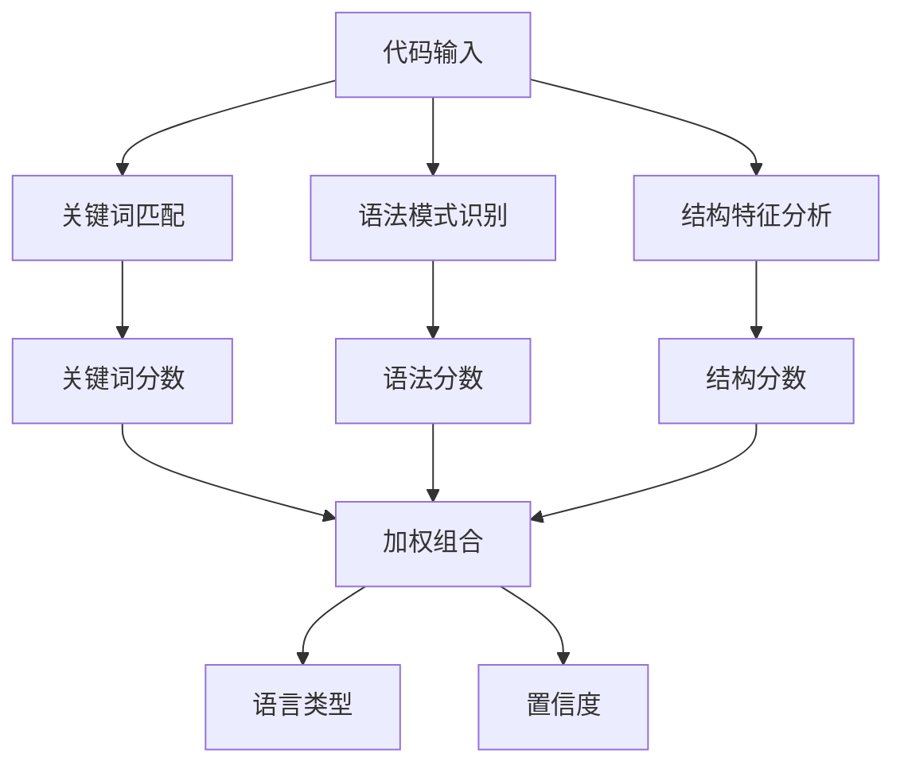
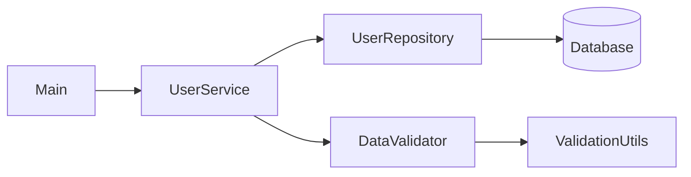
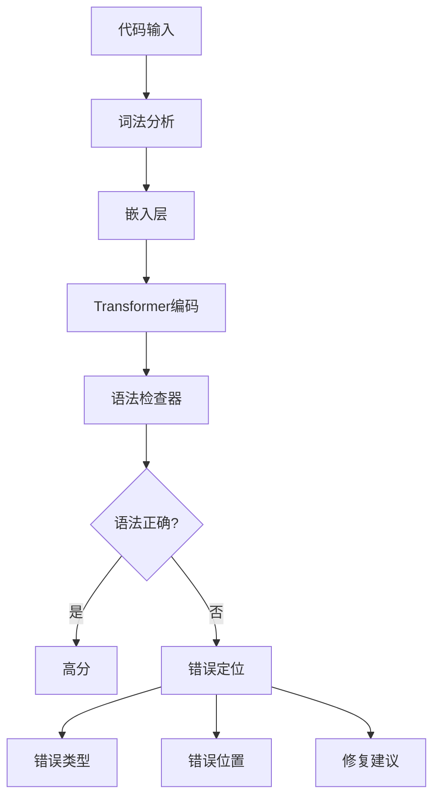
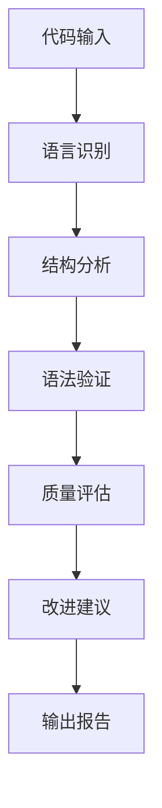

# 14.2.4 代码生成专门优化

> **核心主题**：从"会写代码"到"写好代码"

## 引言：代码质量的艺术 💻

想象两个程序员面试：

**程序员A**：
- 面试官："写一个冒泡排序"
- A：快速写出代码
- 面试官："代码能运行吗？"
- A："应该可以吧..."（未测试）

**程序员B**：
- 面试官："写一个冒泡排序"
- B：写出代码后说：
  - "这是Java实现"
  - "时间复杂度O(n²)"
  - "已添加边界检查"
  - "代码质量评分8.5/10"
  - "建议：可添加泛型支持"

哪个程序员更专业？显然是B。

DeepSeek V3的代码生成模块就像程序员B——不仅生成代码，还进行全面质量分析。

## 学习目标 🎯

- ✅ 理解编程语言识别机制
- ✅ 掌握代码结构分析方法
- ✅ 学会语法验证的设计
- ✅ 理解多维度质量评估
- ✅ 掌握代码优化建议生成

## 一、编程语言识别 🔍

### 1.1 支持的编程语言

**DeepSeek V3支持10种主流语言**：

| 语言 | 用途 | 特征关键词 |
|------|------|-----------|
| Java | 企业应用 | class, public, void, import |
| Python | AI/数据科学 | def, import, if, for |
| JavaScript | Web前端 | function, const, let, => |
| C++ | 系统编程 | #include, namespace, ::, template |
| Go | 云原生 | func, package, go, chan |
| Rust | 系统安全 | fn, let, mut, impl |
| TypeScript | 企业前端 | interface, type, extends |
| C# | .NET开发 | using, namespace, class |
| Swift | iOS开发 | func, var, let, import |
| Kotlin | Android开发 | fun, val, var, class |

### 1.2 语言识别机制

**多层识别策略**：



**关键词特征提取**：

示例：识别Java代码
```
输入代码片段：
public class BubbleSort {
    public static void sort(int[] arr) {
        ...
    }
}

关键词匹配：
- "public": Java (+0.3)
- "class": Java (+0.3), C++ (+0.1)
- "static": Java (+0.2)
- "void": Java (+0.1), C++ (+0.1)
- "int[]": Java (+0.2)

Java总分：1.1
C++总分：0.2

识别结果：Java (置信度: 85%)
```

**语法模式识别**：

| 语言 | 独特语法模式 |
|------|------------|
| Java | `public static void main(String[] args)` |
| Python | 缩进语法，`def __init__(self):` |
| JavaScript | `const func = () => {}` |
| Go | `func main() {...}` |
| Rust | `fn main() -> Result<(), Box<dyn Error>>` |

### 1.3 置信度评估

**置信度计算**：

```
置信度 = (关键词分数 × 0.4) + (语法分数 × 0.3) + (结构分数 × 0.3)
```

**置信度等级**：

| 置信度范围 | 等级 | 处理策略 |
|-----------|------|---------|
| > 90% | 极高 | 直接使用 |
| 70%-90% | 高 | 使用并标注 |
| 50%-70% | 中 | 提示用户确认 |
| < 50% | 低 | 请求用户指定 |

**示例**：

```
代码1（纯Java）：
public class Test {...}
识别：Java 98%

代码2（混合风格）：
class Test {  // 可能是Java或C++
  ...
}
识别：Java 65%, C++ 35%

代码3（伪代码）：
class Test
  method foo
识别：Unknown 30%
```

## 二、代码结构分析 🏗️

### 2.1 层次结构识别

**代码层次模型**：

```
文件层
  ├─ 包/模块声明
  ├─ 导入语句
  └─ 类/接口定义
      ├─ 类成员变量
      ├─ 构造函数
      └─ 方法定义
          ├─ 方法参数
          ├─ 局部变量
          └─ 语句块
              ├─ 控制流语句
              ├─ 表达式
              └─ 嵌套语句块
```

**结构解析示例**：

输入代码：
```java
package com.example;

public class Calculator {
    private int result;
    
    public Calculator() {
        this.result = 0;
    }
    
    public int add(int a, int b) {
        return a + b;
    }
}
```

解析结果：
```
结构树：
File
├─ Package: com.example
├─ Class: Calculator
│  ├─ Field: result (private int)
│  ├─ Constructor: Calculator()
│  │  └─ Statement: this.result = 0
│  └─ Method: add(int, int) -> int
│     └─ Return: a + b
```

### 2.2 复杂度评估

**多维度复杂度指标**：

| 指标 | 说明 | 计算方法 |
|------|------|---------|
| 圈复杂度 | 代码路径数量 | if/for/while等分支数+1 |
| 嵌套深度 | 最大嵌套层数 | 最深的语句块层级 |
| 代码行数 | 有效代码行 | 非空非注释行数 |
| 方法数量 | 方法/函数个数 | 方法定义总数 |
| 参数数量 | 方法参数个数 | 平均参数数量 |

**复杂度计算示例**：

```java
public int calculate(int x) {
    int result = 0;
    if (x > 0) {              // +1 圈复杂度
        for (int i = 0; i < x; i++) {  // +1 圈复杂度
            if (i % 2 == 0) {          // +1 圈复杂度
                result += i;
            }
        }
    }
    return result;
}

复杂度分析：
- 圈复杂度：3 (中等)
- 嵌套深度：3 (较高)
- 代码行数：8
- 参数数量：1
```

**复杂度评级**：

| 圈复杂度 | 等级 | 建议 |
|---------|------|------|
| 1-5 | 简单 | ✅ 良好 |
| 6-10 | 中等 | ⚠️ 可接受 |
| 11-20 | 复杂 | ⚠️ 建议重构 |
| > 20 | 极复杂 | ❌ 必须重构 |

### 2.3 依赖关系分析

**依赖类型**：

1. **内部依赖**：类之间的调用关系
2. **外部依赖**：第三方库的使用
3. **循环依赖**：A→B→C→A（需要警告）

**依赖图示例**：



**依赖分析输出**：

```
依赖关系：
- UserService 依赖于 UserRepository
- UserService 依赖于 DataValidator
- 外部依赖：MySQL Driver, Jackson

依赖深度：2层
循环依赖：无 ✓
```

## 三、语法验证机制 ✅

### 3.1 基于神经网络的语法检查

**为什么用神经网络？**

传统方法：
- ❌ 需要为每种语言编写解析器
- ❌ 规则复杂，难以维护
- ❌ 无法处理不完整代码

神经网络方法：
- ✅ 统一模型处理多种语言
- ✅ 从数据中学习语法规则
- ✅ 能处理部分代码片段

**语法检查流程**：



### 3.2 常见错误模式识别

**错误分类**：

| 错误类型 | 示例 | 检测方法 |
|---------|------|---------|
| 语法错误 | 缺少分号，括号不匹配 | 模式匹配 |
| 类型错误 | String传给int参数 | 类型推断 |
| 命名错误 | 变量名拼写错误 | 上下文检查 |
| 逻辑错误 | 死循环，unreachable code | 控制流分析 |

**错误检测示例**：

错误代码：
```java
public int add(int a, int b) {
    return a + b  // 缺少分号
}
```

检测结果：
```
错误类型：语法错误
错误位置：第2行末尾
错误描述：缺少分号
修复建议：在"b"后添加";"
置信度：95%
```

### 3.3 语法正确性评分

**评分维度**：

| 维度 | 权重 | 说明 |
|------|------|------|
| 词法正确性 | 20% | 关键字、标识符合法 |
| 语法正确性 | 40% | 符合语言语法规则 |
| 语义正确性 | 30% | 类型匹配、作用域正确 |
| 风格一致性 | 10% | 命名规范、缩进统一 |

**评分示例**：

```java
// 代码片段
public class Test {
    public void foo(int x) {
        System.out.println(x);
    }
}

语法评分：
- 词法正确性：10/10 (关键字正确)
- 语法正确性：10/10 (语法完全正确)
- 语义正确性：9/10 (方法命名不规范)
- 风格一致性：8/10 (缺少注释)

总分：9.1/10
```

## 四、代码质量评估 📊

### 4.1 多维度质量指标

**质量评估体系**：

| 维度 | 权重 | 评估标准 |
|------|------|---------|
| **可读性** | 25% | 命名清晰、注释充分、格式规范 |
| **可维护性** | 25% | 低复杂度、模块化、低耦合 |
| **性能** | 20% | 时间复杂度、空间复杂度 |
| **安全性** | 15% | 输入验证、异常处理 |
| **可扩展性** | 15% | 设计模式、接口抽象 |

### 4.2 可读性评估

**可读性指标**：

1. **命名质量**
   - 变量名是否有意义
   - 是否遵循命名规范
   - 是否避免缩写

2. **注释质量**
   - 关键逻辑有注释
   - 复杂算法有说明
   - 公共API有文档

3. **格式规范**
   - 缩进一致
   - 空格使用规范
   - 行长度适中

**示例对比**：

差代码：
```java
public int c(int a,int b){int r=a+b;return r;}
```

好代码：
```java
/**
 * 计算两个整数的和
 * @param first 第一个加数
 * @param second 第二个加数
 * @return 两数之和
 */
public int calculateSum(int first, int second) {
    int sum = first + second;
    return sum;
}
```

可读性评分：
- 差代码：3.5/10
- 好代码：9.0/10

### 4.3 可维护性评估

**可维护性指标**：

1. **复杂度控制**
   - 圈复杂度 < 10
   - 嵌套深度 < 4
   - 方法行数 < 50

2. **模块化设计**
   - 单一职责原则
   - 高内聚低耦合
   - 接口抽象

3. **代码重复**
   - 重复代码率 < 5%
   - 魔法数字少
   - 配置外部化

**评估示例**：

```java
// 低可维护性
public void process(int type) {
    if (type == 1) {
        // 100行代码...
    } else if (type == 2) {
        // 100行代码...
    } else if (type == 3) {
        // 100行代码...
    }
}

可维护性：4.0/10
问题：
- 圈复杂度高
- 方法过长
- 违反单一职责

// 高可维护性
public void process(int type) {
    ProcessStrategy strategy = strategyFactory.create(type);
    strategy.execute();
}

可维护性：9.0/10
优点：
- 使用策略模式
- 职责清晰
- 易于扩展
```

### 4.4 性能评估

**性能指标**：

1. **时间复杂度**
   - O(1): 常数时间（最优）
   - O(log n): 对数时间（良好）
   - O(n): 线性时间（可接受）
   - O(n²): 平方时间（需优化）
   - O(2ⁿ): 指数时间（避免）

2. **空间复杂度**
   - 是否有不必要的数据复制
   - 是否有内存泄漏风险
   - 是否合理使用缓存

**性能分析示例**：

```java
// 低性能（O(n²)）
public boolean hasDuplicate(int[] arr) {
    for (int i = 0; i < arr.length; i++) {
        for (int j = i + 1; j < arr.length; j++) {
            if (arr[i] == arr[j]) return true;
        }
    }
    return false;
}

性能评分：5.0/10
时间复杂度：O(n²)
建议：使用HashSet优化

// 高性能（O(n)）
public boolean hasDuplicate(int[] arr) {
    Set<Integer> seen = new HashSet<>();
    for (int num : arr) {
        if (!seen.add(num)) return true;
    }
    return false;
}

性能评分：9.0/10
时间复杂度：O(n)
空间复杂度：O(n)
```

### 4.5 综合质量评分

**评分算法**：

```
总分 = 可读性 × 0.25
     + 可维护性 × 0.25
     + 性能 × 0.20
     + 安全性 × 0.15
     + 可扩展性 × 0.15
```

**评分等级**：

| 分数范围 | 等级 | 说明 |
|---------|------|------|
| 9.0-10.0 | 优秀 | 生产级代码 |
| 7.5-8.9 | 良好 | 需小幅优化 |
| 6.0-7.4 | 中等 | 需明显改进 |
| < 6.0 | 较差 | 需大幅重构 |

## 五、改进建议生成 💡

### 5.1 建议分类

**建议类型**：

| 类型 | 优先级 | 示例 |
|------|-------|------|
| 错误修复 | 🔴 高 | "修复语法错误" |
| 性能优化 | 🟡 中 | "使用HashMap替代嵌套循环" |
| 可读性提升 | 🟢 低 | "添加方法注释" |
| 安全增强 | 🔴 高 | "添加输入验证" |
| 设计改进 | 🟡 中 | "提取接口抽象" |

### 5.2 建议生成策略

**基于规则的建议**：

```
IF 圈复杂度 > 10 THEN
    建议："方法复杂度过高，建议拆分为多个小方法"
    
IF 方法行数 > 50 THEN
    建议："方法过长，建议按职责拆分"
    
IF 重复代码 > 5行 THEN
    建议："检测到重复代码，建议提取为公共方法"
```

**基于模式的建议**：

```
检测到模式：多个if-else判断类型
建议：使用策略模式或多态替代

检测到模式：手动管理资源
建议：使用try-with-resources自动管理

检测到模式：字符串拼接在循环中
建议：使用StringBuilder提升性能
```

### 5.3 改进示例生成

**具体化建议**：

原代码：
```java
public void process(String type) {
    if (type.equals("A")) {
        // 处理A
    } else if (type.equals("B")) {
        // 处理B
    }
}
```

建议：
```
问题：使用字符串比较判断类型，易出错且不易扩展

建议1：使用枚举替代字符串
建议2：使用策略模式

改进示例：
// 定义枚举
enum ProcessType { A, B }

// 使用策略模式
interface ProcessStrategy {
    void execute();
}

public void process(ProcessType type) {
    ProcessStrategy strategy = strategyMap.get(type);
    strategy.execute();
}

预期效果：
- 类型安全：编译期检查
- 可扩展性：易于添加新类型
- 可维护性：职责分离
```

## 六、CodeGenerationBlock架构 🏗️

### 6.1 组件构成

```
CodeGenerationBlock
├─ 语言识别器 (LanguageDetector)
├─ 结构分析器 (StructureAnalyzer)
├─ 语法验证器 (SyntaxValidator)
├─ 质量评估器 (QualityEvaluator)
└─ 改进生成器 (ImprovementGenerator)
```

### 6.2 工作流程



### 6.3 输出格式

**完整分析报告**：

```
代码分析报告：
==================
1. 语言识别
   - 语言：Java
   - 置信度：98%

2. 结构分析
   - 类：1个
   - 方法：3个
   - 代码行数：45行
   - 圈复杂度：平均5.2

3. 语法验证
   - 语法正确性：9.5/10
   - 发现问题：1个警告

4. 质量评估
   - 可读性：8.5/10
   - 可维护性：7.8/10
   - 性能：8.0/10
   - 安全性：7.5/10
   - 可扩展性：7.0/10
   - 综合评分：7.9/10

5. 改进建议
   🔴 高优先级：
      - 添加输入参数验证
   🟡 中优先级：
      - 添加方法注释
      - 考虑使用泛型提升灵活性
   🟢 低优先级：
      - 变量命名可更具描述性
```

## 七、技术突破总结 🚀

**核心创新**：

1. **多语言统一处理**：一个模型支持10种语言
2. **深度结构分析**：不仅识别语法，还分析架构
3. **神经网络语法检查**：自动学习语法规则
4. **多维质量评估**：全方位衡量代码质量
5. **可操作的改进建议**：具体、实用的优化方案

**与传统工具对比**：

| 维度 | 传统Lint工具 | DeepSeek V3 |
|------|------------|-------------|
| 语言支持 | 单一语言 | 10种语言 |
| 检查深度 | 语法层面 | 结构+质量 |
| 建议质量 | 规则匹配 | AI生成 |
| 学习能力 | ❌ 无 | ✅ 持续学习 |

## 八、本节总结 🎓

**核心要点**：

1. **语言识别**：多层策略准确识别10种语言
2. **结构分析**：层次化解析代码架构
3. **语法验证**：神经网络自动检测错误
4. **质量评估**：5个维度全面衡量
5. **改进建议**：可操作的具体优化方案

**设计理念**：
- 从"能运行"到"高质量"
- 从"语法检查"到"架构分析"
- 从"发现问题"到"提供方案"

## 思考题 💭

1. 为什么需要多维度质量评估？
2. 神经网络语法检查相比传统方法有何优势？
3. 如何设计针对特定领域的代码质量标准？

## 下一节预告 ⏭️

**14.2.5 强化学习训练策略**
- 多维度奖励信号设计
- R1和V3的不同训练策略
- 持续改进机制

👉 [继续学习：14.2.5 强化学习训练策略](./14.2.5-reinforcement-learning.md)
