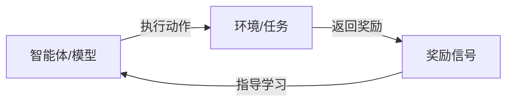
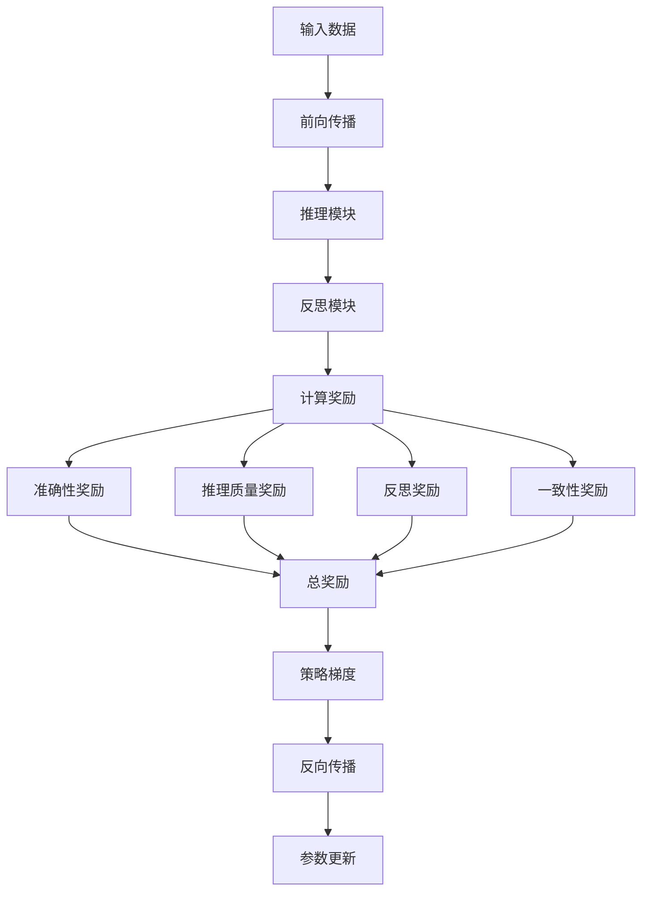

# 14.2.5 强化学习训练策略

> **核心主题**：让AI从"奖励"中学习进步

## 引言：从奖励中学习 🎯

想象训练一只宠物：
- 做对了→给零食（正奖励）
- 做错了→无奖励（负反馈）
- 不断重复→学会正确行为

DeepSeek的强化学习训练也是如此——通过多维度奖励信号指导模型持续改进。

## 学习目标 🎯

- ✅ 理解强化学习在LLM中的应用
- ✅ 掌握多维度奖励信号设计
- ✅ 学会策略梯度优化方法
- ✅ 理解R1和V3的不同训练策略
- ✅ 掌握负载均衡优化

## 一、强化学习基础 📚

### 1.1 核心概念

**强化学习三要素**：



| 要素 | LLM中的对应 | 示例 |
|------|-----------|------|
| 智能体 | DeepSeek模型 | R1/V3 |
| 动作 | 生成推理过程 | 多步推理链 |
| 状态 | 当前推理状态 | 推理步骤向量 |
| 奖励 | 质量评分 | 准确性+推理质量 |
| 策略 | 模型参数 | 神经网络权重 |

### 1.2 策略梯度方法

**核心思想**：调整参数使高奖励动作概率增加

**数学表达**：

```
梯度 = ∇_θ log π_θ(a|s) × (R - baseline)

其中：
- π_θ(a|s)：在状态s下选择动作a的概率
- R：获得的奖励
- baseline：基线值（减少方差）
```

**TinyAI实现**（基于`RLTrainer.java`）：

```java
// 计算策略梯度损失
Variable policyLoss = computePolicyLoss(
    modelOutput, 
    targetIds, 
    totalReward - runningBaseline  // 优势值
);
```

## 二、R1的强化学习训练 🎓

### 2.1 多维度奖励设计

**奖励组件**（来自`RLTrainer.java`）：

| 奖励类型 | 权重 | 计算方法 | 作用 |
|---------|------|---------|------|
| 准确性奖励 | 40% | 基于交叉熵 | 确保答案正确 |
| 推理质量奖励 | 30% | 反思模块评分 | 提升推理清晰度 |
| 反思奖励 | 20% | 是否触发改进 | 鼓励自我优化 |
| 一致性奖励 | 10% | 推理步骤一致性 | 保证逻辑连贯 |

**核心代码**：

```java
public class RLTrainer extends Trainer {
    // 奖励权重
    private float accuracyRewardWeight = 1.0f;
    private float reasoningQualityWeight = 0.3f;
    private float reflectionRewardWeight = 0.2f;
    private float consistencyRewardWeight = 0.1f;
    
    private RewardComponents computeRewardComponents(
        DeepSeekR1Result modelOutput, NdArray targetIds) {
        
        // 1. 准确性奖励
        float accuracyReward = computeAccuracyReward(
            modelOutput.getLogits(), targetIds);
        
        // 2. 推理质量奖励（来自反思模块）
        float reasoningQualityReward = 
            modelOutput.getReflectionResult().getQualityScore();
        
        // 3. 反思奖励
        float reflectionReward = 
            modelOutput.getReflectionResult().needsRefinement() 
                ? 0.5f : 1.0f;
        
        // 4. 一致性奖励
        float consistencyReward = computeConsistencyReward(modelOutput);
        
        return new RewardComponents(accuracyReward, 
            reasoningQualityReward, reflectionReward, consistencyReward);
    }
}
```

### 2.2 训练流程

**完整训练步骤**：



**关键代码**：

```java
public Map<String, Float> trainRLStep(NdArray inputIds, NdArray targetIds) {
    // 1. 前向传播
    DeepSeekR1Result modelOutput = 
        deepseekModel.inferenceWithDetails(inputIds, null);
    
    // 2. 计算奖励
    RewardComponents rewards = computeRewardComponents(modelOutput, targetIds);
    float totalReward = computeTotalReward(rewards);
    
    // 3. 更新基线（减少方差）
    runningBaseline = baselineDecay * runningBaseline 
                    + (1 - baselineDecay) * totalReward;
    
    // 4. 计算策略梯度损失
    Variable policyLoss = computePolicyLoss(
        modelOutput, targetIds, totalReward - runningBaseline);
    
    // 5. 计算价值函数损失
    Variable valueLoss = computeValueLoss(totalReward);
    
    // 6. 计算熵损失（鼓励探索）
    Variable entropyLoss = computeEntropyLoss(modelOutput.getLogits());
    
    // 7. 组合总损失
    Variable totalLoss = policyLoss
        .add(valueLoss.mulNum(valueCoefficient))
        .add(entropyLoss.mulNum(entropyCoefficient));
    
    // 8. 反向传播和梯度裁剪
    totalLoss.backward();
    clipGradients(1.0f);
    
    // 9. 更新参数
    performParameterUpdate();
    
    return metrics;
}
```

### 2.3 基线估计与方差减少

**为什么需要基线？**

```
无基线：梯度 ∝ R（方差大）
有基线：梯度 ∝ (R - baseline)（方差小，训练稳定）
```

**指数移动平均基线**：

```java
// baselineDecay = 0.99
runningBaseline = 0.99 * runningBaseline + 0.01 * totalReward;
```

**效果对比**：

| 训练步骤 | 奖励 | 无基线梯度 | 有基线梯度 |
|---------|------|-----------|-----------|
| 1 | 0.8 | 0.8 | 0.8 - 0 = 0.8 |
| 2 | 0.75 | 0.75 | 0.75 - 0.792 = -0.042 |
| 3 | 0.9 | 0.9 | 0.9 - 0.795 = 0.105 |

有基线后，梯度更稳定，训练效率提升。

## 三、V3的强化学习训练 🚀

### 3.1 额外的代码质量奖励

**V3特有奖励**（基于`V3RLTrainer.java`）：

| 奖励类型 | 权重 | 说明 |
|---------|------|------|
| 准确性奖励 | 30% | 任务完成正确性 |
| 推理质量奖励 | 30% | 推理深度和逻辑性 |
| 代码质量奖励 | 20% | 代码可读性和正确性 |
| MoE效率奖励 | 20% | 专家使用效率和平衡性 |

**代码质量评估**：

```java
private float computeCodeQualityReward(CodeGenerationResult codeResult) {
    float syntaxScore = codeResult.getSyntaxScore();
    float qualityScore = codeResult.getQualityScore();
    float confidence = codeResult.getCodeConfidence();
    
    // 综合评估
    return 0.4f * syntaxScore 
         + 0.4f * qualityScore 
         + 0.2f * confidence;
}
```

### 3.2 MoE负载均衡优化

**负载均衡惩罚**：

**问题**：某些专家过度使用，其他专家闲置

**解决**：KL散度损失

```java
private float computeLoadBalanceLoss(NdArray routerProbs) {
    // 计算每个专家的平均使用率
    float[] expertUsage = computeExpertUsage(routerProbs);
    
    // 目标：均匀分布 (1/numExperts)
    float targetUsage = 1.0f / numExperts;
    
    // KL散度
    float klLoss = 0.0f;
    for (int i = 0; i < numExperts; i++) {
        float usage = expertUsage[i] + 1e-8f; // 避免log(0)
        klLoss += usage * Math.log(usage / targetUsage);
    }
    
    return klLoss;
}
```

**总损失**：

```
Total_Loss = Task_Loss + λ_balance × LoadBalance_Loss

其中λ_balance通常为0.01
```

### 3.3 任务感知的奖励塑形

**根据任务类型调整奖励权重**：

```java
private RewardWeights getTaskSpecificWeights(TaskType taskType) {
    switch (taskType) {
        case CODING:
            return new RewardWeights(
                0.2f,  // 准确性
                0.2f,  // 推理质量
                0.5f,  // 代码质量（更高权重）
                0.1f   // MoE效率
            );
        case REASONING:
            return new RewardWeights(
                0.3f,  // 准确性
                0.5f,  // 推理质量（更高权重）
                0.1f,  // 代码质量
                0.1f   // MoE效率
            );
        default:
            return new RewardWeights(0.3f, 0.3f, 0.2f, 0.2f);
    }
}
```

## 四、训练优化技巧 ⚙️

### 4.1 梯度裁剪

**防止梯度爆炸**：

```java
private void clipGradients(float maxNorm) {
    float totalNorm = 0.0f;
    
    // 计算所有梯度的L2范数
    for (Parameter param : model.getParameters()) {
        if (param.getGrad() != null) {
            NdArray grad = param.getGrad();
            totalNorm += grad.l2Norm() * grad.l2Norm();
        }
    }
    totalNorm = (float) Math.sqrt(totalNorm);
    
    // 如果超过阈值，缩放梯度
    if (totalNorm > maxNorm) {
        float scale = maxNorm / (totalNorm + 1e-6f);
        for (Parameter param : model.getParameters()) {
            if (param.getGrad() != null) {
                param.getGrad().mulNum(scale);
            }
        }
    }
}
```

### 4.2 熵正则化

**鼓励探索，避免过早收敛**：

```
Entropy_Loss = -Σ p(a) log p(a)

总损失 = Policy_Loss + α × Entropy_Loss
```

**代码实现**：

```java
private Variable computeEntropyLoss(Variable logits) {
    // Softmax概率
    NdArray probs = logits.getValue().softMax();
    
    // 熵计算
    float entropy = 0.0f;
    for (int i = 0; i < probs.getShape().size(); i++) {
        float p = probs.getByLinearIndex(i) + 1e-8f;
        entropy -= p * Math.log(p);
    }
    
    return new Variable(NdArray.scalar(entropy));
}
```

### 4.3 经验回放（可选）

**存储历史轨迹，重复学习**：

```java
public class ExperienceReplayBuffer {
    private List<Experience> buffer;
    private int maxSize = 10000;
    
    public void add(Experience exp) {
        buffer.add(exp);
        if (buffer.size() > maxSize) {
            buffer.remove(0); // 移除最旧的
        }
    }
    
    public List<Experience> sample(int batchSize) {
        // 随机采样
        return randomSample(buffer, batchSize);
    }
}
```

## 五、训练监控与评估 📊

### 5.1 关键指标

**训练过程监控**：

| 指标 | 说明 | 期望趋势 |
|------|------|---------|
| 平均奖励 | 模型表现 | 上升 |
| 推理质量分数 | 推理清晰度 | 上升 |
| 策略损失 | 策略优化进度 | 下降后稳定 |
| 熵 | 探索程度 | 逐渐下降 |
| 专家负载均衡 | 专家使用均衡性 | KL散度下降 |

**代码实现**：

```java
private void updateTrainingMetrics(RewardComponents rewards, 
                                  Variable policyLoss,
                                  Variable valueLoss, 
                                  Variable entropyLoss,
                                  float totalReward) {
    trainingMetrics.put("total_reward", totalReward);
    trainingMetrics.put("policy_loss", policyLoss.getValue().getNumber());
    trainingMetrics.put("value_loss", valueLoss.getValue().getNumber());
    trainingMetrics.put("entropy_loss", entropyLoss.getValue().getNumber());
    trainingMetrics.put("avg_quality", rewards.getReasoningQualityReward());
    
    // 记录历史
    rewardHistory.add(totalReward);
    qualityHistory.add(rewards.getReasoningQualityReward());
}
```

### 5.2 训练曲线分析

**典型训练曲线**：

```
奖励曲线：
1.0 |                    ___________
    |               ____/
0.8 |          ____/
    |     ____/
0.6 | ___/
    |/
0.4 +--------------------------------
     0    500   1000  1500  2000  步数

推理质量曲线：
1.0 |                         -------
    |                   _____/
0.8 |              ____/
    |         ____/
0.6 |    ____/
    |___/
0.4 +--------------------------------
     0    500   1000  1500  2000  步数
```

## 六、实战示例 💡

### 6.1 R1训练示例

```java
// 创建训练器
RLTrainer trainer = new RLTrainer(
    maxEpoch,    // 100
    monitor,     // 监控器
    evaluator    // 评估器
);

// 设置奖励权重
trainer.setAccuracyRewardWeight(1.0f);
trainer.setReasoningQualityWeight(0.3f);
trainer.setReflectionRewardWeight(0.2f);
trainer.setConsistencyRewardWeight(0.1f);

// 初始化
trainer.init(dataset, deepseekR1Model, loss, optimizer);

// 训练循环
for (int epoch = 0; epoch < maxEpoch; epoch++) {
    for (Batch batch : dataset) {
        Map<String, Float> metrics = trainer.trainRLStep(
            batch.getInputIds(), 
            batch.getTargetIds()
        );
        
        // 打印指标
        System.out.printf("Epoch %d - Reward: %.3f, Quality: %.3f\n",
            epoch, metrics.get("total_reward"), metrics.get("avg_quality"));
    }
}
```

### 6.2 V3训练示例

```java
// V3训练器（包含MoE负载均衡）
V3RLTrainer v3Trainer = new V3RLTrainer(maxEpoch, monitor, evaluator);

// 设置负载均衡权重
v3Trainer.setLoadBalanceWeight(0.01f);

// 训练
v3Trainer.init(dataset, deepseekV3Model, loss, optimizer);

for (Batch batch : dataset) {
    V3TrainingMetrics metrics = v3Trainer.trainStep(
        batch.getInputIds(),
        batch.getTargetIds(),
        batch.getTaskType()  // 任务类型感知
    );
    
    System.out.printf(
        "Reward: %.3f, Code Quality: %.3f, Load Balance Loss: %.4f\n",
        metrics.getTotalReward(),
        metrics.getCodeQualityReward(),
        metrics.getLoadBalanceLoss()
    );
}
```

## 七、技术突破总结 🚀

**核心创新**：

1. **多维度奖励**：不仅优化准确性，还优化推理质量
2. **反思奖励**：鼓励模型自我改进
3. **负载均衡**：确保MoE专家均衡使用
4. **任务感知**：根据任务类型调整奖励权重
5. **基线估计**：减少梯度方差，稳定训练

**与传统方法对比**：

| 维度 | 监督学习 | DeepSeek强化学习 |
|------|---------|-----------------|
| 优化目标 | 单一损失函数 | 多维度奖励 |
| 反馈机制 | 标注数据 | 自我评估+环境反馈 |
| 探索能力 | ❌ 无 | ✅ 熵正则化 |
| 自我改进 | ❌ 无 | ✅ 反思机制 |
| 负载均衡 | ❌ 无 | ✅ KL散度惩罚 |

## 八、本节总结 🎓

**核心要点**：

1. **强化学习基础**：策略梯度方法和奖励驱动学习
2. **R1训练**：多维度奖励（准确性+推理+反思+一致性）
3. **V3训练**：额外的代码质量和MoE效率奖励
4. **负载均衡**：KL散度惩罚确保专家使用均衡
5. **训练优化**：梯度裁剪、熵正则化、基线估计

**设计理念**：
- 全面评估胜于单一指标
- 过程质量与结果质量同等重要
- 平衡多个优化目标

## 思考题 💭

1. 为什么需要多维度奖励而不是单一准确性？
2. 基线估计如何减少训练方差？
3. 负载均衡惩罚的作用机制是什么？

## 下一节预告 ⏭️

**14.2.6 综合项目：智能推理系统**
- 整合所学知识构建完整系统
- 任务路由、推理、反思的协作
- 实际应用场景演示

👉 [继续学习：14.2.6 综合项目](./14.2.6-comprehensive-project.md)
