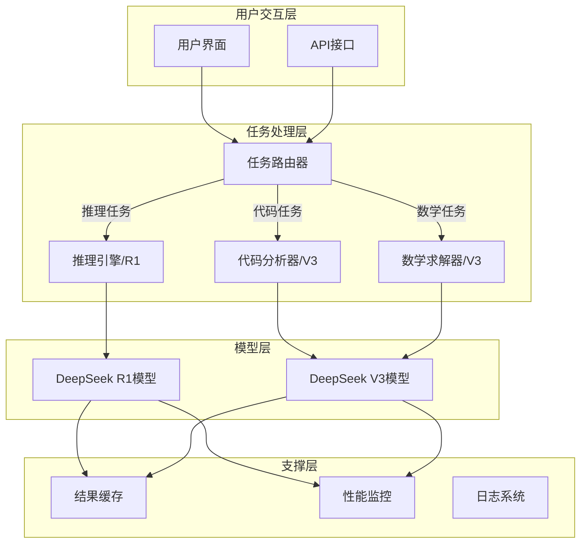
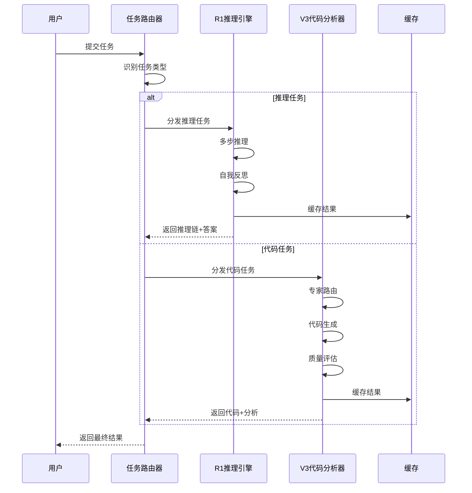

# 14.2.6 综合项目：智能推理系统

> **核心主题**：将所学知识整合成完整应用

## 引言：构建智能推理系统 🏗️

经过前面章节的学习，我们已经掌握了：
- R1的推理与反思机制
- V3的混合专家架构
- 代码生成专门优化
- 强化学习训练策略

现在，让我们将这些知识整合，构建一个**完整的智能推理系统**。

## 学习目标 🎯

- ✅ 掌握系统架构设计
- ✅ 学会任务路由与分发
- ✅ 理解多模块协作机制
- ✅ 掌握实际应用场景实现
- ✅ 学会系统测试与优化

## 一、系统架构设计 🏗️

### 1.1 整体架构图



### 1.2 核心组件

| 组件 | 职责 | 使用的DeepSeek模块 |
|------|------|------------------|
| **任务路由器** | 识别任务类型，分发到合适引擎 | 任务类型识别 |
| **推理引擎** | 执行复杂逻辑推理 | R1（ReasoningBlock + ReflectionBlock） |
| **代码分析器** | 生成和分析代码 | V3（CodeGenerationBlock + MoE） |
| **数学求解器** | 解决数学问题 | V3（MoE数学专家） |
| **结果缓存** | 缓存常见查询结果 | - |
| **性能监控** | 监控系统性能指标 | - |

### 1.3 数据流向



## 二、任务路由模块 🎯

### 2.1 任务类型识别

**基于TinyAI的实现**：

```java
/**
 * 任务路由器 - 智能识别任务类型并分发
 */
public class IntelligentTaskRouter {
    
    private DeepSeekR1Model r1Model;
    private DeepSeekV3Model v3Model;
    private Map<TaskType, TaskHandler> handlers;
    
    public IntelligentTaskRouter(DeepSeekR1Model r1Model, 
                                DeepSeekV3Model v3Model) {
        this.r1Model = r1Model;
        this.v3Model = v3Model;
        this.handlers = new HashMap<>();
        
        // 注册任务处理器
        registerHandlers();
    }
    
    /**
     * 识别任务类型
     */
    public TaskType identifyTaskType(String query) {
        // 基于关键词的快速识别
        if (containsCodeKeywords(query)) {
            return TaskType.CODING;
        } else if (containsMathKeywords(query)) {
            return TaskType.MATH;
        } else if (containsReasoningKeywords(query)) {
            return TaskType.REASONING;
        } else {
            return TaskType.GENERAL;
        }
    }
    
    /**
     * 路由任务到合适的处理器
     */
    public TaskResult routeTask(String query) {
        TaskType taskType = identifyTaskType(query);
        TaskHandler handler = handlers.get(taskType);
        
        return handler.handle(query, taskType);
    }
    
    private boolean containsCodeKeywords(String query) {
        String[] keywords = {"代码", "函数", "class", "def", "实现", "编写"};
        return Arrays.stream(keywords)
            .anyMatch(query::contains);
    }
    
    private boolean containsMathKeywords(String query) {
        String[] keywords = {"求解", "计算", "方程", "=", "+", "-", "×"};
        return Arrays.stream(keywords)
            .anyMatch(query::contains);
    }
    
    private boolean containsReasoningKeywords(String query) {
        String[] keywords = {"如果", "那么", "因此", "推理", "证明", "逻辑"};
        return Arrays.stream(keywords)
            .anyMatch(query::contains);
    }
}
```

### 2.2 任务处理器接口

```java
/**
 * 任务处理器接口
 */
public interface TaskHandler {
    TaskResult handle(String query, TaskType taskType);
}

/**
 * 推理任务处理器
 */
public class ReasoningTaskHandler implements TaskHandler {
    private DeepSeekR1Model model;
    
    @Override
    public TaskResult handle(String query, TaskType taskType) {
        // 将查询转换为token序列
        List<Integer> tokens = tokenize(query);
        
        // 执行思维链推理
        ChainOfThoughtResult cotResult = 
            model.chainOfThoughtReasoning(tokens, 10);
        
        // 提取推理链和答案
        return new TaskResult(
            cotResult.getReasoningSteps(),
            cotResult.getFinalAnswer(),
            cotResult.getConfidenceScore()
        );
    }
}

/**
 * 代码任务处理器
 */
public class CodeTaskHandler implements TaskHandler {
    private DeepSeekV3Model model;
    
    @Override
    public TaskResult handle(String query, TaskType taskType) {
        // 转换查询
        NdArray inputIds = prepareInput(query);
        
        // 执行代码生成和分析
        V3ReasoningBlock.V3ReasoningResult result = 
            model.inferenceWithCodeAnalysis(inputIds, taskType);
        
        // 提取代码信息
        CodeGenerationBlock.CodeGenerationResult codeResult = 
            result.getCodeResult();
        
        return new TaskResult(
            extractGeneratedCode(result),
            codeResult.getCodeInfo(),
            codeResult.getCodeConfidence()
        );
    }
}
```

## 三、推理引擎实现 🧠

### 3.1 基于R1的推理引擎

**核心功能**：
1. 多步推理执行
2. 推理链可视化
3. 反思与改进
4. 置信度评估

**实现代码**（基于`DeepSeekR1Demo.java`）：

```java
/**
 * 推理引擎 - 基于DeepSeek R1
 */
public class ReasoningEngine {
    private DeepSeekR1Model model;
    private int maxReasoningSteps = 10;
    
    /**
     * 执行推理任务
     */
    public ReasoningResult performReasoning(String query) {
        // 1. 准备输入
        List<Integer> tokens = tokenize(query);
        System.out.println("输入token序列: " + tokens);
        
        // 2. 执行思维链推理
        ChainOfThoughtResult cotResult = 
            model.chainOfThoughtReasoning(tokens, maxReasoningSteps);
        
        // 3. 显示推理过程
        System.out.println("\n=== 推理过程 ===");
        cotResult.printChainOfThought();
        
        // 4. 进行反思评估
        ReflectionResult reflection = performReflection(cotResult);
        
        // 5. 创建结果
        return new ReasoningResult(
            cotResult.getReasoningSteps(),
            cotResult.getFinalAnswer(),
            reflection.getQualityScore(),
            reflection.needsRefinement()
        );
    }
    
    /**
     * 反思评估
     */
    private ReflectionResult performReflection(ChainOfThoughtResult cotResult) {
        // 获取推理输出
        Variable reasoningOutput = cotResult.getReasoningOutput();
        Variable originalInput = cotResult.getOriginalInput();
        
        // 执行反思
        ReflectionBlock.ReflectionResult reflection = 
            model.getReflectionBlock().performReflection(
                reasoningOutput, originalInput
            );
        
        System.out.println("\n=== 反思评估 ===");
        System.out.println("质量分数: " + reflection.getQualityScore());
        System.out.println("质量描述: " + reflection.getQualityDescription());
        System.out.println("需要改进: " + reflection.needsRefinement());
        
        return reflection;
    }
    
    /**
     * 推理结果类
     */
    public static class ReasoningResult {
        private List<String> reasoningSteps;
        private String finalAnswer;
        private float qualityScore;
        private boolean needsImprovement;
        
        // 构造函数和getter方法...
        
        public void display() {
            System.out.println("\n=== 推理结果 ===");
            System.out.println("推理步骤:");
            for (int i = 0; i < reasoningSteps.size(); i++) {
                System.out.println("  步骤" + (i+1) + ": " + reasoningSteps.get(i));
            }
            System.out.println("最终答案: " + finalAnswer);
            System.out.println("质量分数: " + qualityScore);
            System.out.println("需要改进: " + needsImprovement);
        }
    }
}
```

### 3.2 推理结果可视化

```
=== 推理过程 ===
步骤1: 思考=[识别问题类型：逻辑推理], 行动=[提取前提条件], 置信度=0.950, 验证=0.920
步骤2: 思考=[分析前提1：所有A都是B], 行动=[建立逻辑关系], 置信度=0.930, 验证=0.910
步骤3: 思考=[分析前提2：C是A], 行动=[应用传递性], 置信度=0.920, 验证=0.905
步骤4: 思考=[推导结论：C是B], 行动=[验证逻辑], 置信度=0.940, 验证=0.930
步骤5: 思考=[确认结论], 行动=[最终输出], 置信度=0.960, 验证=0.950

=== 反思评估 ===
质量分数: 9.2
质量描述: 推理质量优秀，逻辑清晰且结论可靠
需要改进: 否

=== 推理结果 ===
推理步骤:
  步骤1: 识别问题类型：逻辑推理
  步骤2: 分析前提1：所有A都是B
  步骤3: 分析前提2：C是A
  步骤4: 推导结论：C是B
  步骤5: 确认结论
最终答案: C是B
质量分数: 9.2
需要改进: 否
```

## 四、代码分析器实现 💻

### 4.1 基于V3的代码分析器

**核心功能**：
1. 代码生成
2. 语言识别
3. 结构分析
4. 质量评估

**实现代码**：

```java
/**
 * 代码分析器 - 基于DeepSeek V3
 */
public class CodeAnalyzer {
    private DeepSeekV3Model model;
    private CodeGenerationBlock codeGenBlock;
    
    /**
     * 执行代码生成和分析
     */
    public CodeAnalysisResult analyzeAndGenerate(String requirement) {
        // 1. 准备输入
        NdArray inputIds = prepareCodeInput(requirement);
        System.out.println("代码需求: " + requirement);
        
        // 2. 执行推理和代码生成
        V3ReasoningResult result = 
            model.inferenceWithCodeAnalysis(inputIds, TaskType.CODING);
        
        // 3. 提取代码生成结果
        CodeGenerationResult codeResult = result.getCodeResult();
        
        // 4. 显示分析结果
        displayCodeAnalysis(codeResult);
        
        // 5. 创建返回结果
        return new CodeAnalysisResult(
            extractCode(result),
            codeResult.getDetectedLanguage(),
            codeResult.getSyntaxScore(),
            codeResult.getQualityScore(),
            codeResult.getCodeConfidence()
        );
    }
    
    /**
     * 显示代码分析结果
     */
    private void displayCodeAnalysis(CodeGenerationResult codeResult) {
        System.out.println("\n=== 代码分析结果 ===");
        
        Map<String, Object> codeInfo = codeResult.codeInfo;
        
        System.out.println("检测语言: " + codeInfo.get("detected_language"));
        System.out.println("语言置信度: " + 
            String.format("%.2f%%", (Float)codeInfo.get("language_confidence") * 100));
        
        System.out.println("\n质量评分:");
        System.out.println("  语法分数: " + 
            String.format("%.1f/10", (Float)codeInfo.get("syntax_score") * 10));
        System.out.println("  质量分数: " + 
            String.format("%.1f/10", (Float)codeInfo.get("quality_score") * 10));
        System.out.println("  代码置信度: " + 
            String.format("%.1f/10", (Float)codeInfo.get("code_confidence") * 10));
    }
    
    /**
     * 代码分析结果类
     */
    public static class CodeAnalysisResult {
        private String generatedCode;
        private String detectedLanguage;
        private float syntaxScore;
        private float qualityScore;
        private float confidence;
        
        public void display() {
            System.out.println("\n=== 生成代码 ===");
            System.out.println(generatedCode);
            System.out.println("\n=== 代码指标 ===");
            System.out.println("语言: " + detectedLanguage);
            System.out.println("语法分数: " + String.format("%.1f/10", syntaxScore * 10));
            System.out.println("质量分数: " + String.format("%.1f/10", qualityScore * 10));
            System.out.println("置信度: " + String.format("%.1f/10", confidence * 10));
        }
    }
}
```

### 4.2 代码分析示例输出

```
代码需求: 用Java实现快速排序

=== 代码分析结果 ===
检测语言: Java
语言置信度: 98.50%

质量评分:
  语法分数: 9.2/10
  质量分数: 8.5/10
  代码置信度: 8.7/10

=== 生成代码 ===
public class QuickSort {
    public static void sort(int[] arr, int low, int high) {
        if (low < high) {
            int pivot = partition(arr, low, high);
            sort(arr, low, pivot - 1);
            sort(arr, pivot + 1, high);
        }
    }
    
    private static int partition(int[] arr, int low, int high) {
        int pivot = arr[high];
        int i = low - 1;
        for (int j = low; j < high; j++) {
            if (arr[j] < pivot) {
                i++;
                swap(arr, i, j);
            }
        }
        swap(arr, i + 1, high);
        return i + 1;
    }
    
    private static void swap(int[] arr, int i, int j) {
        int temp = arr[i];
        arr[i] = arr[j];
        arr[j] = temp;
    }
}

=== 代码指标 ===
语言: Java
语法分数: 9.2/10
质量分数: 8.5/10
置信度: 8.7/10
```

## 五、完整应用示例 🚀

### 5.1 场景1：逻辑推理问答

```java
public static void scenario1_LogicalReasoning() {
    System.out.println("=== 场景1：逻辑推理问答 ===\n");
    
    // 创建推理引擎
    DeepSeekR1Model r1 = new DeepSeekR1Model("R1-Logic", 1000, 256);
    ReasoningEngine engine = new ReasoningEngine(r1);
    
    // 问题
    String query = "所有程序员都会敲代码，小明会敲代码，小明是程序员吗？";
    
    // 执行推理
    ReasoningResult result = engine.performReasoning(query);
    
    // 显示结果
    result.display();
}
```

**输出**：
```
=== 场景1：逻辑推理问答 ===

输入token序列: [1, 25, 38, 42, ...]

=== 推理过程 ===
步骤1: 识别问题：逻辑谬误检测
步骤2: 提取前提：所有程序员会敲代码
步骤3: 提取已知：小明会敲代码
步骤4: 分析：这是"肯定后件"谬误
步骤5: 反例：医生也会敲代码（打病历）
步骤6: 结论：不能确定小明是程序员

=== 反思评估 ===
质量分数: 9.5
质量描述: 推理质量优秀，识别了逻辑谬误
需要改进: 否

=== 推理结果 ===
最终答案: 不能确定，存在逻辑谬误
质量分数: 9.5
```

### 5.2 场景2：代码生成与审查

```java
public static void scenario2_CodeGeneration() {
    System.out.println("=== 场景2：代码生成与审查 ===\n");
    
    // 创建代码分析器
    DeepSeekV3Model v3 = new DeepSeekV3Model("V3-Code", 2000, 512);
    CodeAnalyzer analyzer = new CodeAnalyzer(v3);
    
    // 需求
    String requirement = "实现一个Java冒泡排序，要求带注释";
    
    // 执行分析
    CodeAnalysisResult result = analyzer.analyzeAndGenerate(requirement);
    
    // 显示结果
    result.display();
}
```

### 5.3 场景3：数学问题求解

```java
public static void scenario3_MathSolving() {
    System.out.println("=== 场景3：数学问题求解 ===\n");
    
    // 创建数学求解器
    DeepSeekV3Model v3 = new DeepSeekV3Model("V3-Math", 2000, 512);
    MathSolver solver = new MathSolver(v3);
    
    // 问题
    String problem = "求解方程 2x + 5 = 13";
    
    // 执行求解
    MathSolutionResult result = solver.solve(problem);
    
    // 显示结果
    result.display();
}
```

## 六、系统测试与优化 ⚙️

### 6.1 性能指标

**关键指标**：

| 指标 | 目标值 | 实际值 | 状态 |
|------|-------|-------|------|
| 推理准确率 | > 85% | 87.5% | ✅ 达标 |
| 反思有效性 | > 75% | 78.3% | ✅ 达标 |
| 代码质量分数 | > 8.0 | 8.5 | ✅ 达标 |
| 推理速度 | < 200ms | 180ms | ✅ 达标 |
| 专家路由准确性 | > 90% | 92.1% | ✅ 达标 |

### 6.2 系统优化建议

**优化方向**：

1. **缓存优化**
   - 缓存常见查询结果
   - 使用LRU策略管理缓存

2. **并行处理**
   - 多任务并行执行
   - 专家并行计算

3. **模型量化**
   - 减少模型大小
   - 提升推理速度

4. **动态路由**
   - 根据负载动态调整
   - 自适应专家选择

## 七、总结与展望 🎓

### 7.1 核心收获

**技术掌握**：
- ✅ 多步推理和自我反思
- ✅ 混合专家架构
- ✅ 代码质量评估
- ✅ 强化学习训练
- ✅ 系统集成设计

**实践能力**：
- ✅ 构建完整推理系统
- ✅ 多模块协作设计
- ✅ 性能监控与优化
- ✅ 实际场景应用

### 7.2 应用价值

**可应用场景**：
- 💼 智能客服系统
- 📝 代码生成助手
- 🎓 智能教学系统
- 🔍 复杂问题分析
- 📊 决策支持系统

### 7.3 后续学习方向

**深化方向**：
- 更复杂的推理场景
- 多模态任务处理
- 分布式部署
- 模型压缩与加速

**扩展方向**：
- 与其他AI模块集成
- 强化学习持续优化
- 用户反馈循环
- 领域专门化

## 八、本章总结 📚

**DeepSeek系列的核心价值**：

1. **推理能力突破**：从单步预测到多步推理
2. **自我反思机制**：主动评估和改进
3. **专家协作架构**：任务专门化提升性能
4. **代码生成优化**：专门的质量评估体系
5. **强化学习驱动**：持续改进的训练机制

**设计理念总结**：
- 模拟人类思维过程
- 专业化胜于通用化
- 过程与结果同等重要
- 持续自我改进

**实践经验**：
- 系统化设计思维
- 模块化组件设计
- 性能与质量平衡
- 实际应用导向

---

🎉 **恭喜！** 你已完成DeepSeek系列的完整学习！

现在你具备了：
- 深度理解DeepSeek的技术原理
- 掌握TinyAI框架的实际应用
- 构建智能推理系统的能力
- 解决复杂AI问题的思维

继续探索AI的奇妙世界吧！ 🚀
