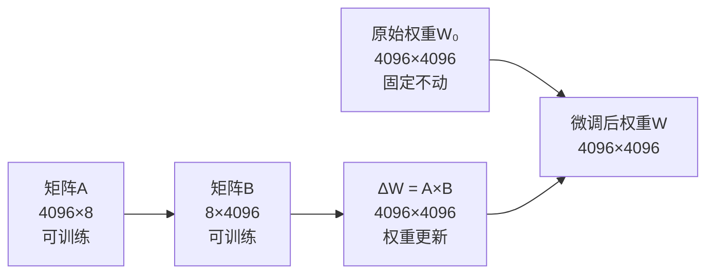
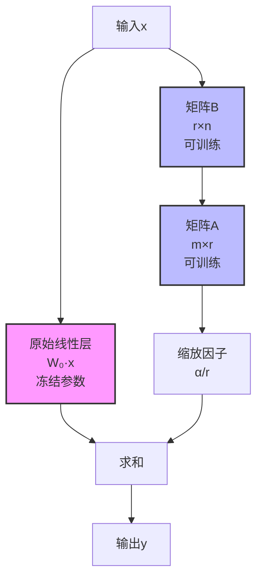
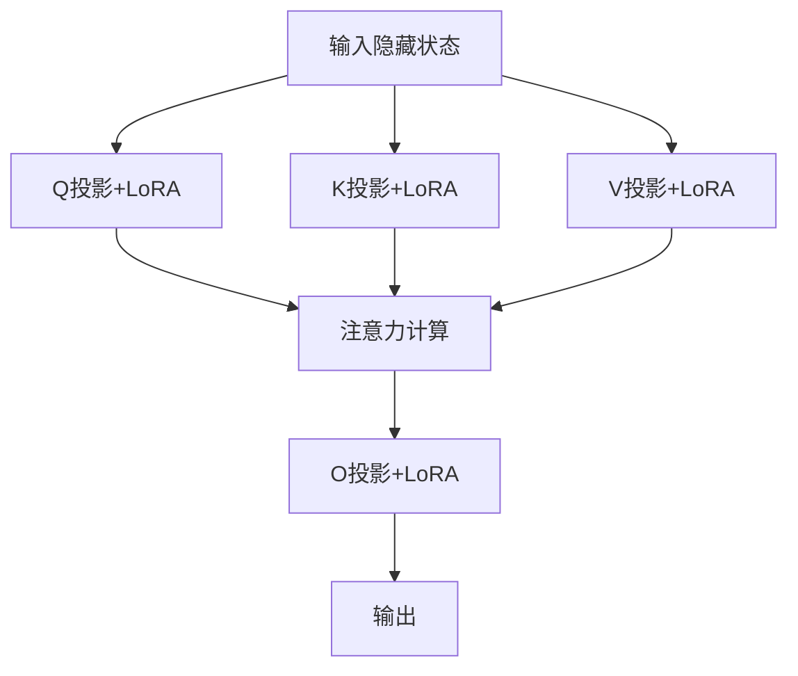
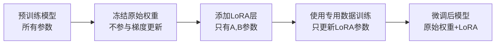
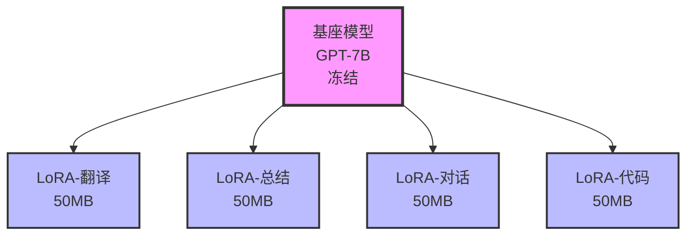
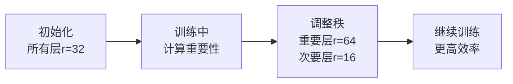
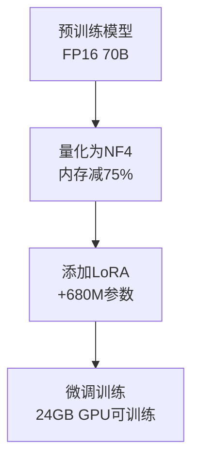

# 15.1 LoRA：低秩适应的高效微调

> **设计思想**：掌握LoRA微调技术的数学原理和实现方法，理解参数高效微调的优势

## 本节概述

想象一下,你需要教一个已经博学多闻的教授学习一个新的专业领域。你会选择让他重新接受完整的大学教育吗?当然不会!更明智的做法是,在他已有的知识基础上,针对性地补充新领域的关键知识点。这就是LoRA(Low-Rank Adaptation,低秩适应)的核心思想。

随着大语言模型规模达到百亿、千亿参数级别,传统的全量微调就像让教授重新上大学一样不切实际——不仅耗时耗力,还需要巨大的计算资源。LoRA通过一种巧妙的数学技巧,只训练模型的一小部分"补充知识",就能实现与全量微调相当的效果。这就像给教授准备一本精心编写的专业参考手册,让他快速掌握新领域的精髓。

本节将带你深入理解LoRA的数学原理、实现细节和应用优势,掌握这一在工业界广泛应用的高效微调技术。

## 学习目标

完成本节学习后，你将：

- ✅ **掌握LoRA的数学原理**：理解低秩矩阵分解在参数高效微调中的应用
- ✅ **学会LoRA的实现细节**：掌握LoRA参数的初始化和训练方法
- ✅ **理解LoRA的优势**：掌握参数效率和性能之间的平衡
- ✅ **具备LoRA应用能力**：能够将LoRA技术应用到实际模型中
- ✅ **掌握LoRA的扩展变体**：了解LoRA的改进版本和应用场景

## LoRA的数学原理:化繁为简的智慧

### 低秩矩阵分解:用简单组合描述复杂变化

**生活类比**:想象你要描述一个城市一年中气温的变化规律。你可以记录每天每小时的温度(需要365×24=8760个数据),也可以用几个简单的规律来概括:"春夏逐渐升温、秋冬逐渐降温"、"白天热、晚上凉"。后者只需要几个参数,却能很好地描述温度变化趋势。

LoRA正是采用了类似的思路。对于模型中一个巨大的权重矩阵W(比如4096×4096),全量微调需要更新所有1600多万个参数。但LoRA发现,这些更新往往存在某种"简单规律",可以用两个小矩阵的乘积来近似:



**数学表达**:
- 预训练权重: W₀ ∈ R^{m×n} (冻结不动)
- 微调更新量: ΔW = A × B
  - A ∈ R^{m×r} (m行,r列)
  - B ∈ R^{r×n} (r行,n列)
  - r称为"秩",通常r << min(m,n)
- 最终权重: W = W₀ + ΔW = W₀ + A × B

### 参数效率:小投入大回报

让我们算一笔账,看看LoRA到底节省了多少参数:

**案例分析**: 对于一个4096×4096的权重矩阵
- **全量微调**: 需要训练 4096 × 4096 = 16,777,216 个参数
- **LoRA (r=8)**: 只需训练 (4096 + 4096) × 8 = 65,536 个参数
- **参数减少比例**: 16,777,216 / 65,536 ≈ **256倍**!

这就像原本需要一整个仓库存储的信息,现在只需要一个小箱子就能装下。更妙的是,这个"小箱子"里的信息经过精心设计,能够以极小的代价恢复出接近完整仓库的效果。

**通用公式**:
```
参数效率比 = (m × n) / ((m + n) × r)
```

当r=8,m=n=4096时,效率比高达256倍!这就是LoRA能够让普通GPU也能微调大模型的秘密。

## LoRA的实现细节

### 核心实现思路

LoRA层的实现可以用下图直观理解:



**关键设计点**:

1. **双路并行**: 输入数据同时经过原始权重和LoRA更新两条路径
2. **非对称初始化**: 矩阵A用随机值,矩阵B用零初始化——这确保训练初期ΔW=0,不会破坏预训练权重
3. **自适应缩放**: 通过α/r系数调节LoRA贡献的强度

### 简化代码示例

以下是LoRA层的核心实现逻辑(省略了部分初始化代码):

```java
public class LoRALayer extends Layer {
    // LoRA核心参数
    private int rank;              // 秩r
    private double alpha;          // 缩放因子α
    private Parameter loraA;       // A矩阵 (m×r)
    private Parameter loraB;       // B矩阵 (r×n)
    private Parameter originalWeight;  // 原始权重(冻结)
    
    @Override
    public Variable forward(Variable input) {
        // 路径1: 原始线性变换 (冻结权重,不参与训练)
        Variable originalOutput = input.dot(originalWeight.getValue().transpose())
                                      .add(originalBias.getValue());
        
        if (!loraEnabled) {
            return originalOutput;  // 未启用LoRA时直接返回
        }
        
        // 路径2: LoRA更新路径
        // 计算: (input × Bᵀ) × Aᵀ × (alpha/rank)
        Variable loraOutput = input.dot(loraB.getValue().transpose())  // input×Bᵀ
                                  .dot(loraA.getValue().transpose())  // 结果×Aᵀ  
                                  .mul(alpha / rank);                // 缩放
        
        // 合并两路输出
        return originalOutput.add(loraOutput);
    }
}
```

**代码要点解读**:
- `originalWeight`设置为不可训练,保持预训练知识
- LoRA部分只有A和B两个小矩阵参与梯度更新
- `alpha/rank`是经验公式,通常设置alpha=rank,使缩放系数为1

## LoRA参数设置与优化

### 秩(Rank)的选择:平衡的艺术

**生活类比**: 秩就像你给教授准备的参考手册的厚度。太薄(秩太小)涵盖信息不够,效果不佳;太厚(秩太大)又显得繁琐,失去了高效的优势。找到适中的厚度是关键。

**经验法则**:

| 任务类型 | 推荐秩值 | 原因 |
|----------|---------|------|
| 简单分类任务 | r=4-8 | 任务复杂度低,需要的适配参数少 |
| 问答系统 | r=16-32 | 需要较强的语义理解能力 |
| 复杂生成任务 | r=64-128 | 需要更多表达能力捕捉细节 |

**智能选择策略** (简化代码):

```java
public int selectOptimalRank(int inputSize, int outputSize, TaskComplexity complexity) {
    // 基准秩: 矩阵较小维度的1/16到32中较小者
    int baseRank = Math.min(Math.min(inputSize, outputSize) / 16, 32);
    
    // 根据任务复杂度调整
    switch (complexity) {
        case SIMPLE:   return Math.max(4, baseRank / 2);    // 简单任务减半
        case MODERATE: return baseRank;                      // 中等任务保持
        case COMPLEX:  return Math.min(128, baseRank * 2);  // 复杂任务翻倍
        default:       return 8;
    }
}
```

## LoRA在不同层的应用

### Transformer注意力层的LoRA应用

在Transformer中,注意力机制包含Q(Query)、K(Key)、V(Value)和输出O(Output)四个线性投影。我们可以给每个投影都加上LoRA:



**简化实现示例**:

```java
public class LoRAAttention extends MultiHeadAttention {
    private LoRALinear queryLoRA;   // Q投影的LoRA
    private LoRALinear keyLoRA;     // K投影的LoRA
    private LoRALinear valueLoRA;   // V投影的LoRA
    private LoRALinear outputLoRA;  // 输出投影的LoRA
    
    public LoRAAttention(String name, int numHeads, int dModel, int rank) {
        super(name, numHeads, dModel);
        // 为四个投影创建LoRA层
        this.queryLoRA = new LoRALinear("Q_lora", dModel, dModel, rank, rank);
        this.keyLoRA = new LoRALinear("K_lora", dModel, dModel, rank, rank);
        this.valueLoRA = new LoRALinear("V_lora", dModel, dModel, rank, rank);
        this.outputLoRA = new LoRALinear("O_lora", dModel, dModel, rank, rank);
    }
    
    public void enableLoRA() {
        queryLoRA.enableLoRA();
        keyLoRA.enableLoRA();
        valueLoRA.enableLoRA();
        outputLoRA.enableLoRA();
    }
}
```

**实际效果**: 在GPT类模型上,只在Q和V投影上应用LoRA就能取得很好的效果,进一步减少参数量。

## LoRA训练流程

### 从预训练模型到LoRA微调

LoRA微调的整个流程可以用下图表示:



### 简化训练代码

```java
public class LoRATrainer {
    private GPTModel model;
    private Optimizer optimizer;
    
    public LoRATrainer(GPTModel model, int rank, double learningRate) {
        this.model = model;
        
        // 第1步: 启用LoRA(冻结原始参数)
        enableLoRA(model, rank);
        
        // 第2步: 提取LoRA参数(只优化这些参数)
        List<Parameter> loraParams = extractLoRAParameters(model);
        this.optimizer = new AdamWOptimizer(learningRate, loraParams);
    }
    
    public void train(DataLoader dataLoader, int epochs) {
        for (int epoch = 0; epoch < epochs; epoch++) {
            double totalLoss = 0.0;
            
            for (Batch batch : dataLoader) {
                // 前向传播
                Variable logits = model.forward(batch.getInputIds());
                Variable loss = computeLoss(logits, batch.getLabels());
                
                // 反向传播(只更新LoRA参数)
                loss.backward();
                optimizer.step();
                optimizer.zeroGrad();
                
                totalLoss += loss.getData().getFloat();
            }
            
            System.out.printf("Epoch %d, Loss: %.4f%n", epoch, totalLoss / dataLoader.size());
        }
    }
}
```

**关键要点**:
1. 原始模型参数完全冻结,不产生梯度
2. 优化器只接收LoRA参数,大大减少内存占用
3. 训练速度接近全量微调,但内存占用少得多

## LoRA的优势分析

### 1. 参数效率:以小博大

**真实案例对比** (以GPT-3 175B为例):

| 对比项 | 全量微调 | LoRA (r=8) | 节省比例 |
|---------|---------|------------|----------|
| 可训练参数 | 175B | ~680M | **99.6%** |
| GPU内存占用 | ~700GB | ~10GB | **98.6%** |
| 训练速度 | 基准 | 1.2x | **20%提升** |
| 模型切换 | 需重新加载 | 只换LoRA | **100x更快** |

**生活类比**: 全量微调像装修房子时整个推倒重建,LoRA则像只更换家具和装饰——成本低,效果好,还能随时切换风格。

### 2. 多任务适配:一模多用

你可以为一个基座模型训练多个LoRA模块,各自应对不同任务:



**实际应用价值**:
- 基座模型只需加载一次(节省大量内存)
- 切换任务时只需更换LoRA模块(毫秒级)
- 多任务共享通用知识,各自保留专业特色

## LoRA的扩展变体

### AdaLoRA: 自适应调整秩

**核心思想**: 不同层的重要性不同,为什么要用相同的秩?像给不同部门分配预算一样,AdaLoRA会根据各层的重要性动态调整秩的大小。



**简化实现思路**:
```java
public class AdaLoRA extends LoRALayer {
    private double[] singularValues;  // 记录各维度重要性
    private double threshold;         // 重要性阈值
    
    public void adaptRank() {
        // 分析哪些维度重要,哪些可以裁减
        int newRank = countImportantDimensions(singularValues, threshold);
        
        if (newRank < rank) {
            pruneUnimportantDimensions(newRank);  // 裁减不重要的维度
        }
    }
}
```

### QLoRA: 量化+LoRA组合拳

**核心思想**: 将预训练模型量化到INT4/INT8,再加上LoRA微调。这就像把基础知识压缩成“字典”,再用LoRA添加新知识。

**效果**: 能在单张24GB GPU上训练65B参数的模型!



## 本节小结

通过本节学习,我们深入掌握了LoRA这一革命性的微调技术:

**核心原理**: LoRA通过低秩矩阵分解(ΔW = A × B),用两个小矩阵的乘积近似巨大的权重更新。就像用几个简单规律概括复杂变化,实现了"小投入大回报"。

**关键优势**:
1. **参数效率**: 相比全量微调减少99%+的参数,性能几乎不降
2. **多任务适配**: 一个基座模型+多个LoRA模块,灵活切换
3. **快速部署**: LoRA模块只有几十MB,加载和切换极快

**实践技巧**:
- 秩选择: 简单任务r=4-8,复杂任务r=32-64
- 初始化: 矩阵A用小随机值,矩阵B用零(确保训练初期不破坏预训练权重)
- 应用层: 优先在注意力层的Q和V投影上应用

LoRA已成为大模型微调的事实标准,从开源社区到工业界广泛应用。掌握LoRA,就掌握了高效微调的金钥匙!