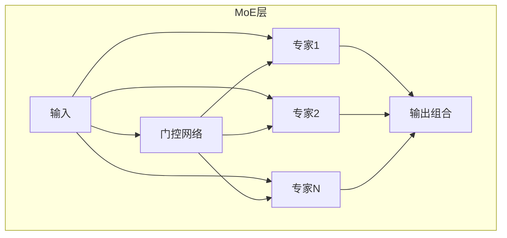

# 15.2 MoE：专家混合模型架构

> **设计思想**：掌握MoE混合专家模型的设计思想和实现方法，理解稀疏激活的规模扩展技术

## 本节概述

MoE（Mixture of Experts）是一种通过稀疏激活来扩展模型规模的技术。在传统的密集模型中，所有参数在每次前向传播时都会被激活，而MoE通过门控机制只激活部分专家，从而在保持计算成本不变的情况下大幅提升模型容量。MoE技术在现代大规模语言模型中得到了广泛应用，如Google的GLaM和Switch Transformer。

本节将深入探讨MoE的设计动机、架构实现、门控机制和优化策略，帮助读者掌握这一重要的模型扩展技术。

## 学习目标

完成本节学习后，你将：

- ✅ **理解MoE的设计动机**：掌握稀疏激活在规模扩展中的作用
- ✅ **掌握MoE的架构实现**：理解专家层和门控网络的设计
- ✅ **学会门控机制的实现**：掌握路由算法和负载均衡技术
- ✅ **理解MoE的优化策略**：掌握通信优化和训练稳定性技术
- ✅ **具备MoE实现能力**：能够编写完整的MoE模型代码

## MoE的设计动机

### 密集模型的局限性

传统的密集模型在扩展规模时面临以下挑战：

1. **计算成本**：所有参数在每次前向传播时都会被激活
2. **内存需求**：模型参数和激活值占用大量内存
3. **训练效率**：大规模模型训练时间长，资源消耗大
4. **硬件限制**：单设备内存限制模型规模

### 稀疏激活的优势

MoE通过稀疏激活解决了上述问题：

1. **计算效率**：只激活部分专家，减少计算量
2. **内存优化**：未激活的专家不需要存储激活值
3. **规模扩展**：可以在不增加计算成本的情况下增加模型容量
4. **个性化服务**：不同输入可以激活不同的专家组合

### MoE的基本架构



## MoE的核心组件

### 专家层（Experts）

专家层是MoE的基本计算单元，通常是一个前馈网络：

```java
public class Expert extends Layer {
    private int inputSize;
    private int hiddenSize;
    private int outputSize;
    private LinearLayer w1;
    private LinearLayer w2;
    private ActivationFunction activation;
    
    public Expert(String name, int inputSize, int hiddenSize, int outputSize) {
        super(name);
        this.inputSize = inputSize;
        this.hiddenSize = hiddenSize;
        this.outputSize = outputSize;
        
        // 专家网络通常是一个前馈网络
        this.w1 = new LinearLayer(name + "_w1", inputSize, hiddenSize);
        this.w2 = new LinearLayer(name + "_w2", hiddenSize, outputSize);
        this.activation = new GELU();
    }
    
    @Override
    public Variable forward(Variable... inputs) {
        Variable x = inputs[0];
        
        // 前馈网络计算
        x = w1.forward(x);
        x = activation.forward(x);
        x = w2.forward(x);
        
        return x;
    }
}
```

### 门控网络（Gating Network）

门控网络决定输入应该路由到哪些专家：

```java
public class GatingNetwork extends Layer {
    private int numExperts;
    private int topK;
    private LinearLayer gate;
    private boolean useNoisyGating;
    private double noiseEpsilon;
    
    public GatingNetwork(String name, int inputSize, int numExperts, int topK, 
                        boolean useNoisyGating) {
        super(name);
        this.numExperts = numExperts;
        this.topK = topK;
        this.useNoisyGating = useNoisyGating;
        this.noiseEpsilon = 1e-5;
        
        // 门控网络是一个线性层，输出每个专家的权重
        this.gate = new LinearLayer(name + "_gate", inputSize, numExperts);
    }
    
    @Override
    public Variable forward(Variable... inputs) {
        Variable x = inputs[0];
        
        // 计算门控权重
        Variable gateLogits = gate.forward(x);
        
        // 添加噪声（可选）
        if (useNoisyGating) {
            gateLogits = addNoise(gateLogits);
        }
        
        // 计算专家权重
        Variable gateWeights = computeGateWeights(gateLogits);
        
        return gateWeights;
    }
    
    private Variable addNoise(Variable logits) {
        // 添加Gumbel噪声实现Noisy Top-K
        Variable noise = generateGumbelNoise(logits.getShape());
        return logits.add(noise.mul(noiseEpsilon));
    }
    
    private Variable computeGateWeights(Variable logits) {
        // Top-K门控
        if (topK == 1) {
            return softmax(logits);  // Top-1
        } else {
            return sparseTopK(logits, topK);  // Top-K
        }
    }
    
    private Variable sparseTopK(Variable logits, int k) {
        // 实现稀疏Top-K门控
        Variable topKIndices = logits.argsort(-1, true).slice(0, k);
        Variable topKLogits = logits.sort(-1, true).slice(0, k);
        
        // 计算Top-K权重
        Variable topKWeights = softmax(topKLogits);
        
        // 创建稀疏权重矩阵
        Variable sparseWeights = createSparseWeights(logits.getShape(), 
                                                   topKIndices, topKWeights);
        
        return sparseWeights;
    }
}
```

## MoE层实现

### 基础MoE层

```java
public class MoELayer extends Layer {
    private int numExperts;
    private int topK;
    private List<Expert> experts;
    private GatingNetwork gatingNetwork;
    private LoadBalancer loadBalancer;
    
    public MoELayer(String name, int inputSize, int hiddenSize, int outputSize, 
                   int numExperts, int topK) {
        super(name);
        this.numExperts = numExperts;
        this.topK = topK;
        
        // 初始化专家
        this.experts = new ArrayList<>();
        for (int i = 0; i < numExperts; i++) {
            experts.add(new Expert(name + "_expert_" + i, 
                                 inputSize, hiddenSize, outputSize));
        }
        
        // 初始化门控网络
        this.gatingNetwork = new GatingNetwork(name + "_gate", 
                                             inputSize, numExperts, topK, true);
        
        // 初始化负载均衡器
        this.loadBalancer = new LoadBalancer();
    }
    
    @Override
    public Variable forward(Variable... inputs) {
        Variable x = inputs[0];
        int batchSize = x.getShape().get(0);
        int seqLength = x.getShape().get(1);
        
        // 重塑输入为二维
        Variable reshapedX = x.reshape(-1, x.getShape().get(-1));
        int tokensPerBatch = reshapedX.getShape().get(0);
        
        // 计算门控权重
        Variable gateWeights = gatingNetwork.forward(reshapedX);  // (tokens, numExperts)
        
        // 路由tokens到专家
        List<Variable> expertInputs = routeToExperts(reshapedX, gateWeights);
        
        // 各专家并行处理
        List<Variable> expertOutputs = new ArrayList<>();
        for (int i = 0; i < numExperts; i++) {
            if (expertInputs.get(i) != null && expertInputs.get(i).getShape().get(0) > 0) {
                Variable expertOutput = experts.get(i).forward(expertInputs.get(i));
                expertOutputs.add(expertOutput);
            } else {
                expertOutputs.add(null);
            }
        }
        
        // 组合专家输出
        Variable combinedOutput = combineExpertOutputs(expertOutputs, gateWeights, 
                                                     tokensPerBatch);
        
        // 重塑输出
        Variable output = combinedOutput.reshape(batchSize, seqLength, -1);
        
        return output;
    }
    
    private List<Variable> routeToExperts(Variable tokens, Variable gateWeights) {
        // 实现tokens到专家的路由
        List<Variable> expertInputs = new ArrayList<>();
        
        for (int i = 0; i < numExperts; i++) {
            expertInputs.add(null);  // 初始化为空
        }
        
        // 获取Top-K专家索引
        int[][] topKIndices = getTopKIndices(gateWeights, topK);
        
        // 为每个专家收集tokens
        for (int tokenIdx = 0; tokenIdx < tokens.getShape().get(0); tokenIdx++) {
            for (int k = 0; k < topK; k++) {
                int expertIdx = topKIndices[tokenIdx][k];
                // 将token添加到对应专家的输入列表中
                addToExpertInput(expertInputs, expertIdx, 
                               tokens.slice(tokenIdx, tokenIdx + 1));
            }
        }
        
        return expertInputs;
    }
    
    private Variable combineExpertOutputs(List<Variable> expertOutputs, 
                                        Variable gateWeights, 
                                        int tokensPerBatch) {
        // 实现专家输出的组合
        Variable combined = new Variable(new Shape(tokensPerBatch, 
                                                 expertOutputs.get(0).getShape().get(-1)));
        combined.fill(0.0f);
        
        int[][] topKIndices = getTopKIndices(gateWeights, topK);
        float[][] gateWeightsArray = gateWeights.getData().toFloatArray2D();
        
        for (int tokenIdx = 0; tokenIdx < tokensPerBatch; tokenIdx++) {
            for (int k = 0; k < topK; k++) {
                int expertIdx = topKIndices[tokenIdx][k];
                float weight = gateWeightsArray[tokenIdx][expertIdx];
                
                if (expertOutputs.get(expertIdx) != null) {
                    Variable expertOutput = expertOutputs.get(expertIdx)
                        .slice(getTokenIndexInExpert(tokenIdx, expertIdx));
                    combined = combined.add(expertOutput.mul(weight));
                }
            }
        }
        
        return combined;
    }
}
```

## 负载均衡和专家利用率优化

### 负载均衡器

```java
public class LoadBalancer {
    private double balanceLossWeight;
    
    public LoadBalancer(double balanceLossWeight) {
        this.balanceLossWeight = balanceLossWeight;
    }
    
    public Variable computeBalanceLoss(Variable gateWeights) {
        // 计算负载均衡损失
        // 基于专家利用率的方差
        Variable expertUsage = gateWeights.sum(0);  // (numExperts)
        Variable meanUsage = expertUsage.mean();
        Variable usageVariance = expertUsage.sub(meanUsage).pow(2).mean();
        
        return usageVariance.mul(balanceLossWeight);
    }
    
    public void updateExpertRouting(Variable gateWeights) {
        // 动态调整专家路由策略
        // 实现专家负载均衡算法
    }
}
```

### 专家容量限制

```java
public class ExpertCapacityManager {
    private int capacityFactor;
    private Map<Integer, Integer> expertTokenCounts;
    
    public ExpertCapacityManager(int capacityFactor) {
        this.capacityFactor = capacityFactor;
        this.expertTokenCounts = new HashMap<>();
    }
    
    public boolean canAssignToken(int expertIdx, int batchSize) {
        int currentCount = expertTokenCounts.getOrDefault(expertIdx, 0);
        int capacity = batchSize * capacityFactor;
        
        return currentCount < capacity;
    }
    
    public void assignToken(int expertIdx) {
        expertTokenCounts.put(expertIdx, 
                            expertTokenCounts.getOrDefault(expertIdx, 0) + 1);
    }
    
    public void resetCounts() {
        expertTokenCounts.clear();
    }
}
```

## MoE训练优化

### 梯度通信优化

```java
public class MoECommunicator {
    private List<Device> devices;
    
    public MoECommunicator(List<Device> devices) {
        this.devices = devices;
    }
    
    public Variable allToAll(Variable tokens, int[] expertAssignment) {
        // 实现All-to-All通信
        // 将tokens分发到对应的专家设备
        return performAllToAll(tokens, expertAssignment, devices);
    }
    
    public Variable allGather(Variable expertOutputs) {
        // 实现All-Gather通信
        // 收集各设备的专家输出
        return performAllGather(expertOutputs, devices);
    }
    
    private Variable performAllToAll(Variable tokens, int[] assignment, 
                                   List<Device> devices) {
        // 实现具体的All-to-All通信逻辑
        // 这通常需要底层通信库支持
        return tokens;  // 简化实现
    }
    
    private Variable performAllGather(Variable outputs, List<Device> devices) {
        // 实现具体的All-Gather通信逻辑
        return outputs;  // 简化实现
    }
}
```

### 训练稳定性优化

```java
public class MoETrainer {
    private MoEModel model;
    private Optimizer optimizer;
    private LoadBalancer loadBalancer;
    
    public MoETrainer(MoEModel model, MoEConfig config) {
        this.model = model;
        this.loadBalancer = new LoadBalancer(config.getBalanceLossWeight());
        
        // 只优化被激活的专家参数
        List<Parameter> trainableParams = extractTrainableParameters(model);
        this.optimizer = new AdamWOptimizer(
            config.getLearningRate(),
            config.getBeta1(),
            config.getBeta2(),
            config.getWeightDecay(),
            trainableParams
        );
    }
    
    public void train(DataLoader dataLoader, int epochs) {
        for (int epoch = 0; epoch < epochs; epoch++) {
            double totalLoss = 0.0;
            int batchCount = 0;
            
            for (Batch batch : dataLoader) {
                // 前向传播
                Variable logits = model.forward(batch.getInputIds());
                
                // 计算主损失
                Variable mainLoss = computeMainLoss(logits, batch.getLabels());
                
                // 计算负载均衡损失
                Variable balanceLoss = loadBalancer.computeBalanceLoss(
                    model.getGateWeights()
                );
                
                // 总损失
                Variable totalLossVar = mainLoss.add(balanceLoss);
                
                // 反向传播
                totalLossVar.backward();
                
                // 优化步骤
                optimizer.step();
                optimizer.zeroGrad();
                
                totalLoss += totalLossVar.getData().getFloat();
                batchCount++;
            }
            
            System.out.printf("Epoch %d, Average Loss: %.4f%n", 
                            epoch, totalLoss / batchCount);
        }
    }
    
    private List<Parameter> extractTrainableParameters(MoEModel model) {
        List<Parameter> params = new ArrayList<>();
        
        // 只提取被激活的专家参数
        for (Layer layer : model.getLayers()) {
            if (layer instanceof MoELayer) {
                MoELayer moeLayer = (MoELayer) layer;
                params.addAll(moeLayer.getTrainableParameters());
            }
        }
        
        return params;
    }
}
```

## MoE模型实现

### 完整的MoE模型

```java
public class MoEModel extends Model {
    private MoEConfig config;
    private EmbeddingLayer tokenEmbedding;
    private PositionalEncoding positionalEncoding;
    private List<MoETransformerBlock> transformerBlocks;
    private LayerNormalization finalLayerNorm;
    private LinearLayer lmHead;
    
    public MoEModel(MoEConfig config) {
        super("MoEModel");
        this.config = config;
        
        // 词嵌入层
        this.tokenEmbedding = new EmbeddingLayer(
            "token_embedding",
            config.getVocabSize(),
            config.getHiddenSize()
        );
        
        // 位置编码层
        this.positionalEncoding = new PositionalEncoding(
            "position_encoding",
            config.getMaxPositionEmbeddings(),
            config.getHiddenSize()
        );
        
        // Transformer块（包含MoE层）
        this.transformerBlocks = new ArrayList<>();
        for (int i = 0; i < config.getNumLayers(); i++) {
            transformerBlocks.add(new MoETransformerBlock(
                "block_" + i,
                config.getHiddenSize(),
                config.getNumHeads(),
                config.getIntermediateSize(),
                config.getNumExperts(),
                config.getTopK(),
                config.getDropoutRate()
            ));
        }
        
        // 最终层归一化
        this.finalLayerNorm = new LayerNormalization(
            "final_layer_norm",
            config.getHiddenSize()
        );
        
        // 语言模型头部
        this.lmHead = new LinearLayer(
            "lm_head",
            config.getHiddenSize(),
            config.getVocabSize()
        );
    }
    
    @Override
    public Variable forward(Variable... inputs) {
        Variable inputIds = inputs[0];
        Variable attentionMask = inputs.length > 1 ? inputs[1] : null;
        
        // 词嵌入
        Variable hiddenStates = tokenEmbedding.forward(inputIds);
        
        // 位置编码
        hiddenStates = positionalEncoding.forward(hiddenStates);
        
        // 逐层处理
        for (MoETransformerBlock block : transformerBlocks) {
            hiddenStates = block.forward(hiddenStates, attentionMask);
        }
        
        // 最终层归一化
        hiddenStates = finalLayerNorm.forward(hiddenStates);
        
        // 语言模型头部
        Variable logits = lmHead.forward(hiddenStates);
        
        return logits;
    }
}
```

### MoE Transformer块

```java
public class MoETransformerBlock extends Layer {
    private MoEConfig config;
    private LayerNormalization attentionLayerNorm;
    private MultiHeadAttention selfAttention;
    private Dropout attentionDropout;
    private LayerNormalization moeLayerNorm;
    private MoELayer moeLayer;
    private Dropout moeDropout;
    
    public MoETransformerBlock(String name, int hiddenSize, int numHeads, 
                              int intermediateSize, int numExperts, int topK, 
                              double dropoutRate) {
        super(name);
        
        // 注意力层归一化
        this.attentionLayerNorm = new LayerNormalization(
            "attention_layer_norm",
            hiddenSize
        );
        
        // 自注意力
        this.selfAttention = new MultiHeadAttention(
            "self_attention",
            numHeads,
            hiddenSize
        );
        
        // 注意力Dropout
        this.attentionDropout = new Dropout("attention_dropout", dropoutRate);
        
        // MoE层归一化
        this.moeLayerNorm = new LayerNormalization(
            "moe_layer_norm",
            hiddenSize
        );
        
        // MoE层
        this.moeLayer = new MoELayer(
            "moe_layer",
            hiddenSize,
            intermediateSize,
            hiddenSize,
            numExperts,
            topK
        );
        
        // MoE Dropout
        this.moeDropout = new Dropout("moe_dropout", dropoutRate);
    }
    
    @Override
    public Variable forward(Variable... inputs) {
        Variable hiddenStates = inputs[0];
        Variable attentionMask = inputs.length > 1 ? inputs[1] : null;
        
        // 自注意力块
        Variable attentionInput = attentionLayerNorm.forward(hiddenStates);
        Variable attentionOutput = selfAttention.forward(
            attentionInput, attentionInput, attentionInput, attentionMask
        );
        attentionOutput = attentionDropout.forward(attentionOutput);
        hiddenStates = hiddenStates.add(attentionOutput);
        
        // MoE块
        Variable moeInput = moeLayerNorm.forward(hiddenStates);
        Variable moeOutput = moeLayer.forward(moeInput);
        moeOutput = moeDropout.forward(moeOutput);
        hiddenStates = hiddenStates.add(moeOutput);
        
        return hiddenStates;
    }
}
```

## 性能分析和优化

### 计算复杂度分析

```java
public class MoEComplexityAnalyzer {
    public MoEComplexity analyzeComplexity(int seqLength, int hiddenSize, 
                                         int numExperts, int topK) {
        // 计算MoE层的复杂度
        long gateComplexity = seqLength * hiddenSize * numExperts;
        long expertComplexity = seqLength * topK * hiddenSize * hiddenSize * 4;  // 前馈网络
        long combinationComplexity = seqLength * topK * hiddenSize;
        
        long totalComplexity = gateComplexity + expertComplexity + combinationComplexity;
        
        return new MoEComplexity(
            totalComplexity,
            gateComplexity,
            expertComplexity,
            combinationComplexity
        );
    }
}
```

### 内存使用分析

```java
public class MoEMemoryAnalyzer {
    public MoEMemoryUsage analyzeMemoryUsage(int batchSize, int seqLength, 
                                           int hiddenSize, int numExperts) {
        // 计算专家参数内存
        long expertParamsMemory = numExperts * hiddenSize * hiddenSize * 4 * 2;  // 两个线性层
        
        // 计算激活内存（稀疏）
        long activationMemory = batchSize * seqLength * hiddenSize * 4;
        
        // 计算门控网络内存
        long gateMemory = batchSize * seqLength * numExperts * 4;
        
        return new MoEMemoryUsage(
            expertParamsMemory,
            activationMemory,
            gateMemory
        );
    }
}
```

## 本节小结

本节深入探讨了MoE混合专家模型的设计思想和实现方法，我们学习了：

1. **MoE的设计动机**：理解了稀疏激活在规模扩展中的作用
2. **MoE的核心组件**：掌握了专家层和门控网络的设计实现
3. **MoE层实现**：学会了完整的MoE层代码实现
4. **负载均衡优化**：掌握了专家利用率优化和容量管理技术
5. **训练优化策略**：理解了通信优化和训练稳定性技术

MoE通过稀疏激活机制实现了模型规模的有效扩展，在保持计算成本不变的情况下大幅提升模型容量。这一技术为现代大规模语言模型的发展提供了重要支撑。

在下一节中，我们将学习梯度检查点技术，掌握内存优化的关键方法。