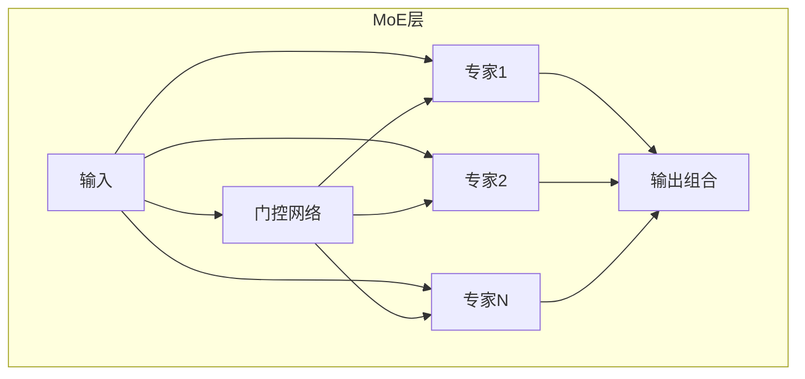
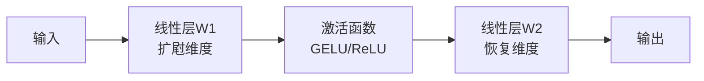
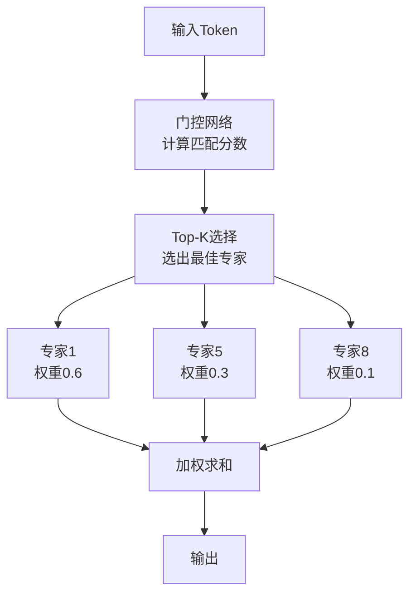
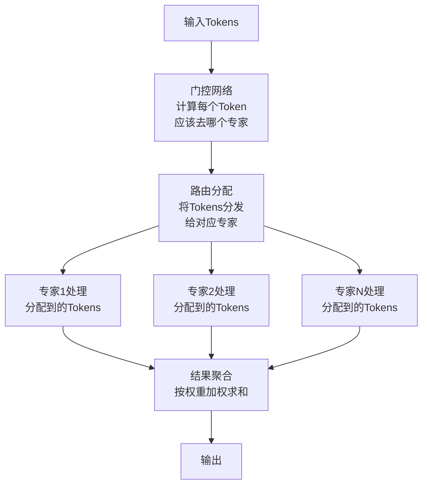

# 15.2 MoE：专家混合模型架构

> **设计思想**：掌握MoE混合专家模型的设计思想和实现方法，理解稀疏激活的规模扩展技术

## 本节概述

**生活类比**：想象一个大型医院，如果每个病人都要看遍所有科室的医生（心内科、骨科、神经科...），效率会极其低下。更聪明的做法是：先由分诊台（门控）判断病情，然后只派病人去找最相关的2-3个专科医生（激活的专家）。这样既节省了时间，又能集中优质医疗资源。

MoE（Mixture of Experts，混合专家模型）正是采用了这种思路。传统的密集模型就像让所有医生都参与每个病例，而MoE通过智能的"分诊机制"，让每个输入只激活少数几个最合适的"专家网络"。这使得我们可以大幅增加模型容量（更多专家），但计算成本几乎不增加（每次只用几个）。

**现实应用**：Google的Switch Transformer使用MoE技术，用与T5-Large相同的计算资源，训练出了参数量大7倍的模型，性能显著提升。本节将带你理解MoE如何实现这种"以少胜多"的魔法。

## 学习目标

完成本节学习后，你将：

- ✅ **理解MoE的设计动机**：掌握稀疏激活在规模扩展中的作用
- ✅ **掌握MoE的架构实现**：理解专家层和门控网络的设计
- ✅ **学会门控机制的实现**：掌握路由算法和负载均衡技术
- ✅ **理解MoE的优化策略**：掌握通信优化和训练稳定性技术
- ✅ **具备MoE实现能力**：能够编写完整的MoE模型代码

## MoE的设计动机：智能分工的力量

### 密集模型的困境

**生活类比**：假设你经营一家餐厅，雇了10个大厨。传统密集模型的做法是：无论做什么菜，10个大厨都要参与。做个炒鸡蛋也要调动全部人力，这显然很浪费。

传统密集模型的问题：
- **全员参与**：所有参数每次都计算，就像所有大厨都要参与每道菜
- **内存压力**：要记住每个人的操作细节，内存占用巨大
- **难以扩展**：想增加大厨数量，成本线性增长

### MoE的智慧：专业的人做专业的事

**MoE的解决方案**就像智能排班：
- 做川菜 → 只调动川菜专家（2-3位大厨）
- 做西餐 → 只调动西餐专家（2-3位大厨）
- 做烘焙 → 只调动烘焙专家（2-3位大厨）

这样，即使有100个大厨（专家），每次做菜（前向传播）也只用3个，计算成本几乎不变！

**核心优势**：
✓ **计算成本稳定**：总专家数N，每次只用K个，成本∝K（而非∝N）
✓ **容量大幅提升**：可以轻松扩展到上百个专家
✓ **专业化分工**：每个专家专注某类模式，学习更精准

### MoE的基本架构



## MoE的核心组件

### 专家网络：各司其职的处理单元

每个专家通常是一个简单的前馈网络（FFN），结构如下：



**简化实现**：
```java
public class Expert extends Layer {
    private LinearLayer w1;     // 第一层：扩屗维度
    private LinearLayer w2;     // 第二层：恒复原始维度
    private ActivationFunction activation;
    
    @Override
    public Variable forward(Variable x) {
        x = w1.forward(x);          // 扩屗
        x = activation.forward(x);   // 非线性变换
        x = w2.forward(x);          // 恒复
        return x;
    }
}
```

### 门控网络：智能分诊台

**生活类比**：门控网络就像医院的智能分诊系统，根据病人症状（输入特征）自动判断应该去哪几个科室（激活哪些专家）。

**工作原理**：
1. 计算每个专家的"匹配度分数"
2. 选出分数最高的Top-K个专家
3. 给这K个专家分配权重（越匹配权重越大）



**简化实现**：
```java
public class GatingNetwork extends Layer {
    private int numExperts;  // 总专家数
    private int topK;        // 每次激活K个
    private LinearLayer gate; // 门控线性层
    
    @Override
    public Variable forward(Variable x) {
        // 1. 计算每个专家的分数
        Variable gateLogits = gate.forward(x);  // [batch, numExperts]
        
        // 2. Top-K选择：只保留分数最高的K个
        Variable topKWeights = selectTopK(gateLogits, topK);
        
        // 3. Softmax归一化：确保权重和为1
        return softmax(topKWeights);
    }
}
```

**关键技巧**：添加噪声（Noisy Top-K）避免专家负载不均，就像给分诊台加入随机性，避免某些科室太忙而其他科室太闲。

## MoE层实现：整合门控与专家

### 工作流程



### 简化实现

```java
public class MoELayer extends Layer {
    private List<Expert> experts;        // 专家列表
    private GatingNetwork gatingNetwork;  // 门控网络
    private int numExperts;
    private int topK;
    
    @Override
    public Variable forward(Variable x) {
        // 第1步：门控网络决定路由
        Variable gateWeights = gatingNetwork.forward(x);  // [tokens, numExperts]
        
        // 第2步：将tokens分发给对应的专家
        List<Variable> expertInputs = routeToExperts(x, gateWeights);
        
        // 第3步：各专家并行处理
        List<Variable> expertOutputs = new ArrayList<>();
        for (int i = 0; i < numExperts; i++) {
            if (expertInputs.get(i) != null) {
                expertOutputs.add(experts.get(i).forward(expertInputs.get(i)));
            } else {
                expertOutputs.add(null);
            }
        }
        
        // 第4步：按权重聚合结果
        return combineExpertOutputs(expertOutputs, gateWeights);
    }
}
```

**性能关键点**：
- 专家并行计算：多个专家同时工作，提升速度
- 稀疏激活：大部分专家闲置，节省计算

## 负载均衡和专家利用率优化

### 问题：专家忙闲不均

**生活类比**：想象一家餐厅有多个大厨，如果没有合理分配，可能出现：
- 某个大厨太忙，菜品积压成山
- 其他大厨闲着，浪费人力

在MoE中也会出现这种问题：某几个专家被频繁使用，其他专家几乎不用。

### 解决方案：负载均衡损失

**核心思想**：在损失函数中加入“均衡惩罚项”，就像给太忙的大厨加班费、给太闲的大厨扣工资，促使系统自动调整到均衡状态。

```java
public class LoadBalancer {
    private double balanceLossWeight;  // 均衡损失的权重
    
    public Variable computeBalanceLoss(Variable gateWeights) {
        // 计算每个专家的使用率
        Variable expertUsage = gateWeights.sum(0);  // 求和得到各专家被使用次数
        
        // 计算方差：使用率越不均衡，方差越大
        Variable meanUsage = expertUsage.mean();
        Variable variance = expertUsage.sub(meanUsage).pow(2).mean();
        
        // 返回均衡损失：鼓励系统减小方差
        return variance.mul(balanceLossWeight);
    }
}
```

**效果**：总损失 = 主任务损失 + 均衡损失，模型为了降低总损失，会自动学习均衡使用各个专家。

## MoE训练优化

### 通信开销：分布式训练的挑战

**生活类比**：想象一个连锁餐厅，总部需要将订单分发到各分店（专家），各分店做好后再汇总回总部。这个"配送"过程就是通信开销。

MoE在分布式训练中的主要通信操作：
1. **All-to-All**：将tokens分发到不同GPU上的专家
2. **All-Gather**：收集各GPU上专家的输出结果

**简化实现思路**（通常依赖底层通信库）：
```java
public class MoECommunicator {
    public Variable allToAll(Variable tokens, int[] expertAssignment) {
        // 根据分配方案，将tokens发送到对应设备的专家
        return performAllToAll(tokens, expertAssignment);
    }
    
    public Variable allGather(Variable expertOutputs) {
        // 收集所有设备上专家的输出结果
        return performAllGather(expertOutputs);
    }
}
```

### 训练流程简化

```java
public void train(DataLoader dataLoader, int epochs) {
    for (int epoch = 0; epoch < epochs; epoch++) {
        for (Batch batch : dataLoader) {
            // 前向传播
            Variable logits = model.forward(batch.getInputIds());
            
            // 计算主任务损失
            Variable mainLoss = computeLoss(logits, batch.getLabels());
            
            // 计算负载均衡损失
            Variable balanceLoss = loadBalancer.computeBalanceLoss(
                model.getGateWeights()
            );
            
            // 总损失 = 主损失 + 均衡损失
            Variable totalLoss = mainLoss.add(balanceLoss);
            
            // 反向传播和优化
            totalLoss.backward();
            optimizer.step();
            optimizer.zeroGrad();
        }
    }
}
```

## 本节小结

通过本节学习，我们掌握了MoE这一革命性的模型扩展技术：

**核心思想**：MoE通过“专业分工+稀疏激活”，就像医院的智能分诊系统，让每个输入只找最相关的几个专家。这使得我们可以大幅增加模型容量，而计算成本几乎不增加。

**关键组件**：
1. **专家网络**：各司其职的处理单元，通常是前馈网络
2. **门控机制**：智能路由系统，决定激活哪些专家
3. **负载均衡**：防止某些专家过忙而其他闲置

**关键优势**：
- **计算效率**：每次只用K个专家，成本与总专家数N无关
- **容量可扩展**：可轻松扩展到上百个专家，极大提升模型容量
- **专业化学习**：不同专家学习不同模式，提升整体表现

**实际应用案例**：
- **Switch Transformer**：1.6万亿参数，但激活比率仅3.7%
- **GLaM**：Google的MoE模型，参数是GPT-3的3倍，但训练成本只有1/3

**挑战与解决**：
- 负载不均 → 负载均衡损失
- 通信开销 → 优化All-to-All通信
- 训练不稳定 → 添加噪声、梯度裁剪

MoE已成为超大规模模型训练的标配技术，是突破计算资源限制、实现模型规模跨越式增长的重要手段！