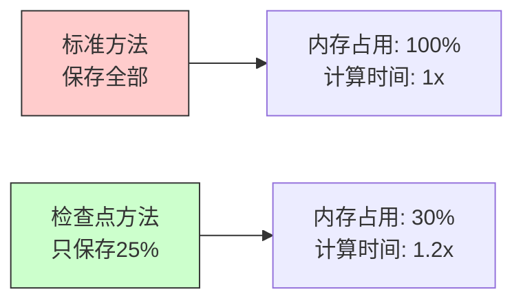

# 15.3 梯度检查点：内存优化技术

> **设计思想**：掌握梯度检查点技术的原理和应用，理解时间-空间权衡的优化策略

## 本节概述

**生活类比**：想象你在爬山，需要拍照记录每个位置。两种策略：

**策略A：全程拍照**
- 每走一步都拍一张照片
- 下山时可直接查看照片，回顾路线
- 优点：快速，方便
- 缺点：相机存储卡快满了！

**策略B：关键点拍照**
- 只在几个关键位置拍照（山脚、半山腰、山顶）
- 下山时如果需要，从最近的关键点重新走一次
- 优点：存储卡省了90%!
- 缺点：下山时需要额外走几步

梯度检查点就是采用了策略B。在深度学习中，"每一步"是每个网络层的计算，"照片"是中间激活值。通过只保存关键点，我们能大幅减少内存占用，代价是增加一些重复计算。

**真实效果**：在GPT-3等大模型上，梯度检查点能减少60-80%的激活内存，让原本需覀64GB内存的模型在16GB GPU上也能训练！

## 学习目标

完成本节学习后，你将：

- ✅ **理解梯度检查点的原理**：掌握时间-空间权衡的优化思想
- ✅ **学会梯度检查点的实现**：掌握检查点策略的选择和实现
- ✅ **掌握内存优化技术**：理解梯度检查点与其他优化技术的结合
- ✅ **具备梯度检查点应用能力**：能够将该技术应用到实际模型中
- ✅ **理解性能影响分析**：掌握梯度检查点对训练效率的影响

## 梯度检查点的原理：时间换空间的智慧

### 内存消耗问题

**生活类比**：想象你在做一道复杂的数学题，需要很多中间步骤。标准做法是把每一步都写在草稿纸上（保存所有激活值），检查时直接看草稿纸。但如果草稿纸不够怎么办？

在深度神经网络中：
- **前向传播**：输入 → 层1 → 层2 → ... → 层N → 输出
- **反向传播**：需要用到每一层的输出来计算梯度
- **内存问题**：N层网络需要保存N个中间结果，内存占用巨大！

### 检查点策略：聪明的权衡



**核心思想**：
1. **前向传播时**：只在关键位置保存激活值（比如每隔4层保存一次）
2. **反向传播时**：需要某层的激活值时，从最近的检查点重新计算
3. **权衡结果**：内存减少70%，计算时间增加20%

### 数学分析

假设有N层网络，设置K个检查点（K << N）：

| 指标 | 标准反向传播 | 梯度检查点 | 节省比例 |
|------|-------------|-----------|----------|
| 内存占用 | O(N) | O(K) | (N-K)/N ≈ 70-90% |
| 前向计算 | 1次 | 1次 | 无额外开销 |
| 反向计算 | 1次 | 1次 | 无额外开销 |
| 重计算 | 0次 | N-K次 | 增加约20% |

**实例**：32层网络，设置8个检查点
- 内存节省：(32-8)/32 = 75%
- 重计算开销：24/32 = 增加20%计算量

## 梯度检查点的实现

### 核心实现思路

**简化实现**（核心逻辑）：

```java
public class CheckpointFunction extends Function {
    private List<Layer> layers;
    private List<Boolean> checkpointFlags;  // 标记哪些层是检查点
    
    @Override
    public Variable forward(Variable input) {
        Variable x = input;
        List<Variable> savedActivations = new ArrayList<>();
        
        // 前向传播：只保存检查点
        for (int i = 0; i < layers.size(); i++) {
            x = layers.get(i).forward(x);
            
            if (checkpointFlags.get(i)) {
                savedActivations.add(x.detach());  // 保存检查点激活值
            }
        }
        
        // 保存信息供反向传播使用
        setSavedActivations(savedActivations);
        return x;
    }
    
    @Override
    public Variable[] backward(Variable gradOutput) {
        List<Variable> savedActivations = getSavedActivations();
        Variable grad = gradOutput;
        
        // 反向传播：需要时重计算
        for (int i = layers.size() - 1; i >= 0; i--) {
            Variable input;
            
            if (checkpointFlags.get(i)) {
                // 使用保存的检查点值
                input = savedActivations.remove(savedActivations.size() - 1);
            } else {
                // 从最近的检查点重新计算
                input = recomputeActivation(i);
            }
            
            grad = layers.get(i).backward(grad, input);
        }
        
        return new Variable[]{grad};
    }
}
```

### 检查点选择策略

**生活类比**：就像选择在哪些楼层设置消防栓，有不同策略：

| 策略 | 说明 | 适用场景 |
|------|------|----------|
| 均匀分布 | 每隔N层设一个 | 各层大小相似 |
| 内存优先 | 内存占用大的层设检查点 | 层大小不一 |
| 计算优先 | 计算量小的层不设检查点 | 有轻重层 |

```java
public class CheckpointSelector {
    // 均匀策略：每隔4层设一个检查点
    public List<Boolean> selectUniform(List<Layer> layers) {
        List<Boolean> flags = new ArrayList<>();
        int interval = 4;  // 检查点间隔
        
        for (int i = 0; i < layers.size(); i++) {
            flags.add(i % interval == 0);  // 第0,4,8,12...层设检查点
        }
        return flags;
    }
}
```
## 梯度检查点在Transformer中的应用

### Transformer块的检查点化

**实际应用场景**：在GPT、BERT等大模型中，Transformer块是主要的内存消耗者。通过检查点化，可以：
- 将GPT-2的24GB GPU上训练 → 12GB GPU
- 将BERT-Large的16GB GPU上训练 → 8GB GPU

```java
public class CheckpointedTransformerBlock extends Layer {
    private AttentionLayer attention;
    private FeedForwardLayer feedForward;
    private boolean useCheckpointing;
    
    @Override
    public Variable forward(Variable input) {
        if (useCheckpointing && isTraining()) {
            // 训练时使用检查点
            return checkpointedForward(input);
        } else {
            // 推理时不用检查点（不需要保存激活值）
            return standardForward(input);
        }
    }
    
    private Variable checkpointedForward(Variable input) {
        // 将注意力和前馈网络作为检查点
        CheckpointFunction ckpt = new CheckpointFunction(
            Arrays.asList(attention, feedForward),
            Arrays.asList(true, true)  // 两个子层都设检查点
        );
        return ckpt.forward(input);
    }
}
```
## 内存优化策略

### 检查点+混合精度：组合拳

**生活类比**：就像旅行时既要减少行李件数（检查点），又要压缩每件行李体积（混合精度），效果翻倍！

```java
public class MixedPrecisionCheckpointing {
    public Variable forward(Variable input) {
        // 组合优化：FP16计算 + 检查点
        try (PrecisionGuard guard = new PrecisionGuard(Precision.FP16)) {
            return CheckpointFunction.apply(layers, input);
        }
    }
}
```

**效果对比**：

| 优化策略 | 内存节省 | 速度影响 |
|---------|---------|----------|
| 仅检查点 | 70% | +20%时间 |
| 仅FP16 | 50% | -10%时间 |
| 检查点+FP16 | 85% | +10%时间 |

### 动态检查点调整

**智能调节**：根据实际内存使用情况自动调整检查点密度

```java
public class DynamicCheckpointing {
    public void adjustCheckpoints(Model model, MemoryMonitor monitor) {
        long currentMemory = monitor.getCurrentMemoryUsage();
        long memoryLimit = monitor.getMemoryLimit();
        
        if (currentMemory > memoryLimit * 0.8) {  // 内存紧张
            increaseCheckpointDensity(model);  // 增加检查点，节省内存
        } else if (currentMemory < memoryLimit * 0.5) {  // 内存充裕
            decreaseCheckpointDensity(model);  // 减少检查点，提升速度
        }
    }
}
```
## 性能影响分析

### 时间-空间权衡

**真实数据对比** (基于GPT-2模型):

| 配置 | 内存占用 | 训练速度 | 总训练时间 |
|------|----------|----------|------------|
| 无检查点 | 24GB | 100% | 基准 |
| 4个检查点 | 8GB | 88% | +14% |
| 8个检查点 | 6GB | 82% | +22% |

**最佳实践**：
- 大模型训练：必须启用，否则内存不足
- 中等模型：根据GPU内存灵活选择
- 小模型：不建议使用，性价比不高

## 本节小结

梯度检查点是大模型训练的关键技术，我们学习了：

**核心原理**：通过"丢弃中间结果+需要时重算"，实现内存节省70-90%。就像爬山时只在关键点拍照，下山回顾时必要时重新走一小段路。

**实现要点**：
1. **选择策略**：均匀分布、内存优先、计算优先
2. **适用场景**：Transformer块、卷积网络、RNN等
3. **组合优化**：与混合精度、梯度累积等配合使用

**效果对比**：
- ✅ 内存节省：70-90%
- ⚠️ 时间增加：10-30%
- 🏆 性价比：非常高！值得使用

**工业应用**：
- PyTorch: `torch.utils.checkpoint`
- TensorFlow: `tf.recompute_grad`  
- HuggingFace Transformers: `gradient_checkpointing=True`

梯度检查点让普通GPU也能训练大模型，是每个深度学习工程师必须掌握的内存优化技能！