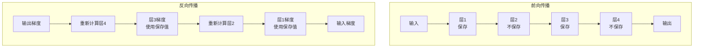

# 15.3 梯度检查点：内存优化技术

> **设计思想**：掌握梯度检查点技术的原理和应用，理解时间-空间权衡的优化策略

## 本节概述

随着深度学习模型规模的不断增长，训练过程中的内存消耗成为了一个重要瓶颈。梯度检查点（Gradient Checkpointing）是一种通过时间换空间的内存优化技术，它通过在前向传播过程中只保存部分中间激活值，在反向传播时重新计算未保存的激活值，从而显著减少内存使用。

本节将深入探讨梯度检查点的数学原理、实现方法、优化策略以及在大模型训练中的应用。

## 学习目标

完成本节学习后，你将：

- ✅ **理解梯度检查点的原理**：掌握时间-空间权衡的优化思想
- ✅ **学会梯度检查点的实现**：掌握检查点策略的选择和实现
- ✅ **掌握内存优化技术**：理解梯度检查点与其他优化技术的结合
- ✅ **具备梯度检查点应用能力**：能够将该技术应用到实际模型中
- ✅ **理解性能影响分析**：掌握梯度检查点对训练效率的影响

## 梯度检查点的原理

### 内存消耗分析

在标准的反向传播过程中，需要保存所有中间激活值以计算梯度：

```java
// 标准前向传播（保存所有激活值）
public Variable standardForward(Variable input) {
    Variable h1 = layer1.forward(input);    // 保存h1
    Variable h2 = layer2.forward(h1);       // 保存h2
    Variable h3 = layer3.forward(h2);       // 保存h3
    Variable output = layer4.forward(h3);   // 保存output
    
    return output;
}

// 标准反向传播（使用保存的激活值）
public void standardBackward(Variable gradOutput) {
    Variable gradH3 = layer4.backward(gradOutput, h3);  // 使用h3
    Variable gradH2 = layer3.backward(gradH3, h2);      // 使用h2
    Variable gradH1 = layer2.backward(gradH2, h1);      // 使用h1
    Variable gradInput = layer1.backward(gradH1, input); // 使用input
}
```

### 梯度检查点思想

梯度检查点通过只保存部分激活值，在反向传播时重新计算未保存的值：



### 数学原理

对于函数组合 f(x) = fₙ(fₙ₋₁(...f₁(x)...))，标准反向传播需要：
- 存储：n个中间激活值
- 计算：n次前向传播 + n次反向传播

梯度检查点将函数分段，只在检查点保存激活值：
- 存储：k个检查点激活值（k < n）
- 计算：n次前向传播 + n次反向传播 + (n-k)次重计算

## 梯度检查点的实现

### 基础检查点实现

```java
public class CheckpointFunction extends Function {
    private List<Layer> layers;
    private List<Boolean> checkpointFlags;
    
    public CheckpointFunction(List<Layer> layers, List<Boolean> checkpointFlags) {
        this.layers = layers;
        this.checkpointFlags = checkpointFlags;
    }
    
    @Override
    public Variable forward(Variable... inputs) {
        Variable x = inputs[0];
        List<Variable> savedActivations = new ArrayList<>();
        
        // 前向传播，只保存检查点激活值
        for (int i = 0; i < layers.size(); i++) {
            x = layers.get(i).forward(x);
            
            if (checkpointFlags.get(i)) {
                savedActivations.add(x.detach());  // 保存检查点
            }
        }
        
        // 保存检查点信息用于反向传播
        setSavedActivations(savedActivations);
        setIntermediateOutputs(getAllOutputs());  // 用于重计算
        
        return x;
    }
    
    @Override
    public Variable[] backward(Variable gradOutput) {
        List<Variable> savedActivations = getSavedActivations();
        List<Variable> intermediateOutputs = getIntermediateOutputs();
        
        Variable grad = gradOutput;
        
        // 反向传播
        for (int i = layers.size() - 1; i >= 0; i--) {
            Variable input = null;
            
            if (checkpointFlags.get(i)) {
                // 使用保存的激活值
                input = savedActivations.remove(savedActivations.size() - 1);
            } else {
                // 重新计算激活值
                input = recomputeActivation(i, intermediateOutputs);
            }
            
            grad = layers.get(i).backward(grad, input);
        }
        
        return new Variable[]{grad};
    }
    
    private Variable recomputeActivation(int layerIdx, 
                                       List<Variable> intermediateOutputs) {
        // 从最近的检查点重新计算到当前层
        Variable input = findNearestCheckpoint(layerIdx, intermediateOutputs);
        
        for (int i = findCheckpointIndex(layerIdx) + 1; i <= layerIdx; i++) {
            input = layers.get(i).forward(input);
        }
        
        return input;
    }
}
```

### 自动检查点选择

```java
public class CheckpointSelector {
    public List<Boolean> selectCheckpoints(List<Layer> layers, 
                                         CheckpointStrategy strategy) {
        List<Boolean> checkpointFlags = new ArrayList<>();
        
        switch (strategy) {
            case UNIFORM:
                return selectUniformCheckpoints(layers);
            case MEMORY_BASED:
                return selectMemoryBasedCheckpoints(layers);
            case COMPUTE_BASED:
                return selectComputeBasedCheckpoints(layers);
            case HYBRID:
                return selectHybridCheckpoints(layers);
            default:
                return selectUniformCheckpoints(layers);
        }
    }
    
    private List<Boolean> selectUniformCheckpoints(List<Layer> layers) {
        List<Boolean> flags = new ArrayList<>();
        int interval = Math.max(1, layers.size() / 4);  // 每隔n层设置一个检查点
        
        for (int i = 0; i < layers.size(); i++) {
            flags.add(i % interval == 0 || i == layers.size() - 1);
        }
        
        return flags;
    }
    
    private List<Boolean> selectMemoryBasedCheckpoints(List<Layer> layers) {
        List<Boolean> flags = new ArrayList<>();
        
        for (int i = 0; i < layers.size(); i++) {
            Layer layer = layers.get(i);
            long memoryCost = estimateMemoryCost(layer);
            
            // 根据内存消耗决定是否设置检查点
            boolean shouldCheckpoint = memoryCost > MEMORY_THRESHOLD;
            flags.add(shouldCheckpoint);
        }
        
        return flags;
    }
    
    private List<Boolean> selectComputeBasedCheckpoints(List<Layer> layers) {
        List<Boolean> flags = new ArrayList<>();
        double totalCompute = estimateTotalCompute(layers);
        
        for (int i = 0; i < layers.size(); i++) {
            double layerCompute = estimateComputeCost(layers.get(i));
            double relativeCost = layerCompute / totalCompute;
            
            // 根据计算成本决定检查点密度
            boolean shouldCheckpoint = relativeCost > COMPUTE_THRESHOLD;
            flags.add(shouldCheckpoint);
        }
        
        return flags;
    }
}
```

## 梯度检查点在Transformer中的应用

### Transformer块检查点

```java
public class CheckpointedTransformerBlock extends Layer {
    private AttentionLayer attention;
    private FeedForwardLayer feedForward;
    private boolean useCheckpointing;
    
    public CheckpointedTransformerBlock(String name, TransformerConfig config) {
        super(name);
        this.useCheckpointing = config.isUseGradientCheckpointing();
        
        this.attention = new AttentionLayer(name + "_attention", config);
        this.feedForward = new FeedForwardLayer(name + "_ff", config);
    }
    
    @Override
    public Variable forward(Variable... inputs) {
        if (useCheckpointing && isTraining()) {
            return checkpointedForward(inputs);
        } else {
            return standardForward(inputs);
        }
    }
    
    private Variable standardForward(Variable... inputs) {
        Variable hiddenStates = inputs[0];
        Variable attentionMask = inputs[1];
        
        // 注意力子层
        Variable attentionOutput = attention.forward(hiddenStates, attentionMask);
        hiddenStates = hiddenStates.add(attentionOutput);
        
        // 前馈网络子层
        Variable ffOutput = feedForward.forward(hiddenStates);
        hiddenStates = hiddenStates.add(ffOutput);
        
        return hiddenStates;
    }
    
    private Variable checkpointedForward(Variable... inputs) {
        // 使用检查点函数包装前向传播
        CheckpointFunction checkpointFn = new CheckpointFunction(
            Arrays.asList(attention, feedForward),
            Arrays.asList(true, true)  // 两个子层都设置检查点
        );
        
        return checkpointFn.apply(inputs[0], inputs[1]);
    }
}
```

### 完整的检查点Transformer

```java
public class CheckpointedTransformer extends Model {
    private List<CheckpointedTransformerBlock> blocks;
    private CheckpointStrategy checkpointStrategy;
    
    public CheckpointedTransformer(TransformerConfig config) {
        super("CheckpointedTransformer");
        this.checkpointStrategy = config.getCheckpointStrategy();
        
        this.blocks = new ArrayList<>();
        CheckpointSelector selector = new CheckpointSelector();
        
        for (int i = 0; i < config.getNumLayers(); i++) {
            // 为每层选择不同的检查点策略
            List<Boolean> layerCheckpoints = selector.selectCheckpoints(
                getLayerComponents(i), checkpointStrategy
            );
            
            blocks.add(new CheckpointedTransformerBlock(
                "block_" + i, config, layerCheckpoints
            ));
        }
    }
    
    @Override
    public Variable forward(Variable... inputs) {
        Variable hiddenStates = inputs[0];
        Variable attentionMask = inputs[1];
        
        // 逐层处理
        for (CheckpointedTransformerBlock block : blocks) {
            hiddenStates = block.forward(hiddenStates, attentionMask);
        }
        
        return hiddenStates;
    }
    
    private List<Layer> getLayerComponents(int layerIdx) {
        // 返回指定层的所有组件
        CheckpointedTransformerBlock block = blocks.get(layerIdx);
        return block.getComponents();
    }
}
```

## 内存优化策略

### 混合精度与检查点结合

```java
public class MixedPrecisionCheckpointing {
    private boolean useMixedPrecision;
    private GradScaler gradScaler;
    
    public Variable checkpointedForward(Function function, Variable... inputs) {
        if (useMixedPrecision) {
            // 在FP16下执行前向传播
            try (PrecisionGuard guard = new PrecisionGuard(Precision.FP16)) {
                return CheckpointFunction.apply(function, inputs);
            }
        } else {
            return CheckpointFunction.apply(function, inputs);
        }
    }
    
    public void backwardWithScaling(Variable loss) {
        if (useMixedPrecision) {
            // 缩放损失并执行反向传播
            Variable scaledLoss = gradScaler.scale(loss);
            scaledLoss.backward();
        } else {
            loss.backward();
        }
    }
}
```

### 动态检查点调整

```java
public class DynamicCheckpointing {
    private MemoryMonitor memoryMonitor;
    private CheckpointSelector checkpointSelector;
    
    public void adjustCheckpoints(Model model, TrainingContext context) {
        // 监控当前内存使用情况
        long currentMemory = memoryMonitor.getCurrentMemoryUsage();
        long memoryLimit = memoryMonitor.getMemoryLimit();
        
        if (currentMemory > memoryLimit * 0.8) {  // 内存使用超过80%
            // 增加检查点密度
            increaseCheckpointDensity(model);
        } else if (currentMemory < memoryLimit * 0.5) {  // 内存使用低于50%
            // 减少检查点密度
            decreaseCheckpointDensity(model);
        }
    }
    
    private void increaseCheckpointDensity(Model model) {
        // 动态增加检查点
        for (Layer layer : model.getLayers()) {
            if (layer instanceof CheckpointedLayer) {
                ((CheckpointedLayer) layer).increaseCheckpoints();
            }
        }
    }
    
    private void decreaseCheckpointDensity(Model model) {
        // 动态减少检查点
        for (Layer layer : model.getLayers()) {
            if (layer instanceof CheckpointedLayer) {
                ((CheckpointedLayer) layer).decreaseCheckpoints();
            }
        }
    }
}
```

## 性能影响分析

### 时间-空间权衡分析

```java
public class CheckpointingAnalyzer {
    public CheckpointingPerformance analyzePerformance(Model model, 
                                                     List<CheckpointStrategy> strategies) {
        CheckpointingPerformance performance = new CheckpointingPerformance();
        
        for (CheckpointStrategy strategy : strategies) {
            // 测量内存使用
            long memoryUsage = measureMemoryUsage(model, strategy);
            
            // 测量训练时间
            long trainingTime = measureTrainingTime(model, strategy);
            
            // 测量吞吐量
            double throughput = measureThroughput(model, strategy);
            
            performance.addResult(strategy, memoryUsage, trainingTime, throughput);
        }
        
        return performance;
    }
    
    private long measureMemoryUsage(Model model, CheckpointStrategy strategy) {
        // 模拟不同检查点策略的内存使用
        CheckpointedModel checkpointedModel = applyCheckpointing(model, strategy);
        
        MemoryProfiler profiler = new MemoryProfiler();
        return profiler.estimatePeakMemory(checkpointedModel);
    }
    
    private long measureTrainingTime(Model model, CheckpointStrategy strategy) {
        // 测量训练时间
        CheckpointedModel checkpointedModel = applyCheckpointing(model, strategy);
        
        long startTime = System.currentTimeMillis();
        trainModel(checkpointedModel);
        long endTime = System.currentTimeMillis();
        
        return endTime - startTime;
    }
}
```

### 优化建议

```java
public class CheckpointingOptimizer {
    public CheckpointingRecommendation recommendStrategy(ModelCharacteristics characteristics) {
        // 基于模型特征推荐检查点策略
        if (characteristics.getModelSize() > 10e9) {  // > 10B参数
            if (characteristics.getMemoryBudget() < 16e9) {  // < 16GB
                return new CheckpointingRecommendation(
                    CheckpointStrategy.MEMORY_BASED,
                    "High model size with limited memory"
                );
            } else {
                return new CheckpointingRecommendation(
                    CheckpointStrategy.HYBRID,
                    "High model size with adequate memory"
                );
            }
        } else if (characteristics.getSequenceLength() > 1024) {
            return new CheckpointingRecommendation(
                CheckpointStrategy.UNIFORM,
                "Long sequence length"
            );
        } else {
            return new CheckpointingRecommendation(
                CheckpointStrategy.COMPUTE_BASED,
                "Standard model configuration"
            );
        }
    }
}
```

## 实际应用案例

### 大模型训练优化

```java
public class LargeModelTrainer {
    private Model model;
    private Optimizer optimizer;
    private CheckpointingStrategy strategy;
    
    public LargeModelTrainer(LargeModelConfig config) {
        this.model = new CheckpointedTransformer(config.getTransformerConfig());
        this.strategy = config.getCheckpointingStrategy();
        
        // 应用检查点策略
        applyCheckpointingStrategy(model, strategy);
        
        // 初始化优化器
        this.optimizer = new AdamWOptimizer(
            config.getLearningRate(),
            config.getBeta1(),
            config.getBeta2(),
            config.getWeightDecay()
        );
    }
    
    public void train(DataLoader dataLoader, int epochs) {
        MemoryMonitor memoryMonitor = new MemoryMonitor();
        
        for (int epoch = 0; epoch < epochs; epoch++) {
            // 动态调整检查点策略
            dynamicCheckpointingAdjustment(memoryMonitor);
            
            trainEpoch(dataLoader);
            
            // 记录性能指标
            logPerformanceMetrics(epoch, memoryMonitor);
        }
    }
    
    private void dynamicCheckpointingAdjustment(MemoryMonitor memoryMonitor) {
        DynamicCheckpointing dynamicCkpt = new DynamicCheckpointing();
        dynamicCkpt.adjustCheckpoints(model, new TrainingContext());
    }
}
```

### 推理阶段的检查点应用

```java
public class CheckpointedInference {
    public Variable inference(Model model, Variable input) {
        // 在推理阶段也可以使用检查点来减少内存使用
        try (InferenceMode mode = new InferenceMode()) {
            // 禁用梯度计算但仍使用检查点减少内存
            return model.forward(input);
        }
    }
    
    public List<Variable> batchInference(Model model, List<Variable> inputs) {
        List<Variable> outputs = new ArrayList<>();
        
        // 批处理推理，结合检查点优化内存
        for (Variable input : inputs) {
            Variable output = inference(model, input);
            outputs.add(output);
        }
        
        return outputs;
    }
}
```

## 本节小结

本节深入探讨了梯度检查点技术的原理和应用，我们学习了：

1. **梯度检查点的原理**：理解了时间-空间权衡的优化思想
2. **梯度检查点的实现**：掌握了检查点策略的选择和实现方法
3. **Transformer中的应用**：学会了在大模型中应用检查点技术
4. **内存优化策略**：理解了混合精度与检查点的结合使用
5. **性能影响分析**：掌握了检查点对训练效率的影响评估

梯度检查点是一种重要的内存优化技术，它通过牺牲一定的计算时间来显著减少内存使用，使得训练大规模模型成为可能。在实际应用中，需要根据具体场景选择合适的检查点策略，以在内存节省和计算开销之间找到最佳平衡点。

在下一节中，我们将学习模型并行技术，掌握突破单机内存限制的并行训练方法。