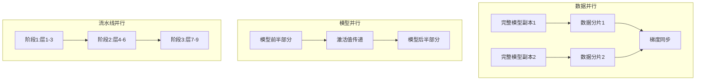
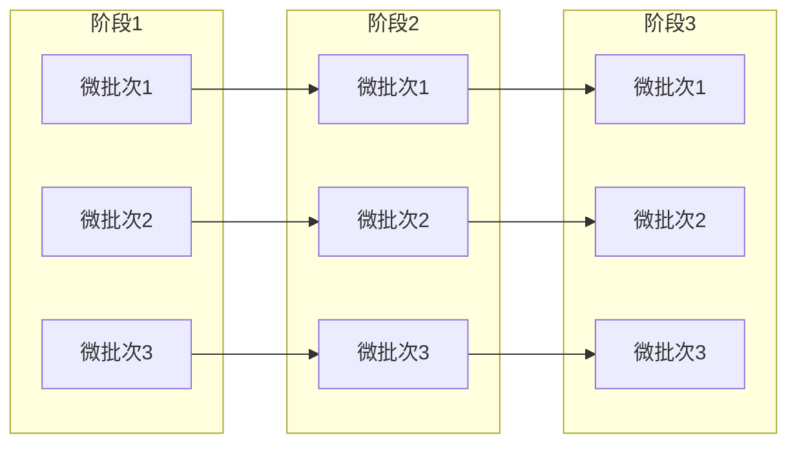

# 15.4 模型并行：突破单机内存限制

> **设计思想**：掌握模型并行技术的核心原理和实现方法，理解大规模模型训练的分布式策略

## 本节概述

**生活类比**：想象一个超大型拼图项目，有10000片拼图要完成。

**方案A：一个人慢慢拼**
- 需要一张巨大的桌子（单机内存）
- 如果桌子不够大，根本放不下所有拼图
- 一个人干活，效率低

**方案B：多人协作拼图**
- 每人负责一部分拼图（模型并行）
- 分别在自己的小桌子上拼（分布式内存）
- 定期交流边界信息（通信）
- 最后拼接成完整图案

模型并行就是采用方案B。当模型大到单个GPU装不下时，我们将模型"切块"分配到多个GPU上，让它们协同工作。这样不仅突破了单机内存限制，还能提升训练速度。

**真实应用**：
- GPT-3（175B参数）：需要数百个GPU协同训练
- DeepSpeed ZeRO：微软开源的模型并行框架
- Megatron-LM：NVIDIA的大模型训练方案

本节将带你理解模型并行的三种核心策略，掌握突破硬件限制的关键技术。

## 学习目标

完成本节学习后，你将：

- ✅ **理解模型并行的基本概念**：掌握数据并行、模型并行和流水线并行的区别
- ✅ **掌握张量并行的实现**：理解矩阵分片和通信优化技术
- ✅ **学会流水线并行的实现**：掌握微批次和气泡减少策略
- ✅ **理解通信优化技术**：掌握AllReduce、AllGather等通信原语的优化
- ✅ **具备模型并行应用能力**：能够设计和实现分布式模型训练系统

## 模型并行概述：三种核心策略

### 并行策略对比



| 并行类型 | 思路 | 优点 | 缺点 | 适用场景 |
|----------|------|------|------|----------|
| **数据并行** | 多份模型处理不同数据 | 实现简单 | 每GPU都要存完整模型 | 中等模型 |
| **模型并行** | 模型切块分布 | 突破单机限制 | 通信开销大 | 超大模型 |
| **流水线并行** | 分阶段流水处理 | 平衡内存和计算 | 有气泡时间 | 极大模型 |

**生活类比**：
- **数据并行**：3个厨师用同样菜谱做不同菜品
- **模型并行**：把一道菜的工序拆分（切菜、炒菜、装盘）给不同人
- **流水线并行**：流水线生产，上一道菜做到一半，下一道开始动工

## 张量并行：矩阵切块的艺术

### 设计思想

**生活类比**：想象一块巨大的拼图（4096×4096片），你有两种拼法：

**方法A：横切** (行并行)
- 上半部分给人1，下半部分给人2
- 最后上下拼接

**方法B：竖切** (列并行)
- 左半部分给人1，右半部分给人2  
- 最后左右拼接

张量并行就是将权重矩阵“切块”，分配到不同GPU上计算，然后拼接结果。

### 列并行实现

```java
public class ColumnParallelLinear extends Layer {
    private List<LinearLayer> deviceLayers;  // 每GPU上的子层
    private int numDevices;
    
    // 示例：将一个4096×4096的矩阵分成2个GPU
    //  GPU0: 4096×2048，GPU1: 4096×2048
    
    @Override
    public Variable forward(Variable input) {
        // 步骤1：将输入分发到各GPU (按列切分)
        List<Variable> scatteredInputs = scatter(input, numDevices);
        
        // 步骤2：各GPU并行计算
        List<Variable> deviceOutputs = new ArrayList<>();
        for (int i = 0; i < numDevices; i++) {
            Variable deviceOutput = deviceLayers.get(i).forward(
                scatteredInputs.get(i)
            );
            deviceOutputs.add(deviceOutput);
        }
        
        // 步骤3：汇总结果 (AllReduce求和)
        return allReduceSum(deviceOutputs);
    }
}
```

**关键优点**：
- ✅ 单GPU内存消耗：原本的50%
- ✅ 计算并行：速度几乎翻倍
- ⚠️ 通信开销：需要AllReduce操作


## 流水线并行

### 基本概念

流水线并行将模型按层分割到不同设备上，通过微批次（Micro-batch）实现流水线执行：



### 流水线实现

```java
public class PipelineParallelModel extends Model {
    private List<PipelineStage> stages;
    private int numMicroBatches;
    private PipelineScheduler scheduler;
    
    public PipelineParallelModel(PipelineConfig config) {
        super("PipelineParallelModel");
        this.numMicroBatches = config.getNumMicroBatches();
        
        // 初始化流水线阶段
        this.stages = new ArrayList<>();
        List<Layer> modelLayers = config.getModelLayers();
        int stagesCount = config.getNumStages();
        
        // 将模型层分配到各阶段
        for (int i = 0; i < stagesCount; i++) {
            int startLayer = i * modelLayers.size() / stagesCount;
            int endLayer = (i + 1) * modelLayers.size() / stagesCount;
            
            List<Layer> stageLayers = modelLayers.subList(startLayer, endLayer);
            stages.add(new PipelineStage(
                "stage_" + i,
                stageLayers,
                getDevice(i)
            ));
        }
        
        // 初始化调度器
        this.scheduler = new PipelineScheduler(stages);
    }
    
    @Override
    public Variable forward(Variable... inputs) {
        Variable input = inputs[0];
        
        // 将输入分割为微批次
        List<Variable> microBatches = splitIntoMicroBatches(input, numMicroBatches);
        
        // 执行流水线调度
        List<Variable> outputs = scheduler.execute(microBatches);
        
        // 合并输出
        return mergeMicroBatchOutputs(outputs);
    }
}
```

### 流水线调度器

```java
public class PipelineScheduler {
    private List<PipelineStage> stages;
    private int numStages;
    
    public PipelineScheduler(List<PipelineStage> stages) {
        this.stages = stages;
        this.numStages = stages.size();
    }
    
    public List<Variable> execute(List<Variable> microBatches) {
        int numMicroBatches = microBatches.size();
        List<Variable> outputs = new ArrayList<>();
        
        // 初始化阶段状态
        List<List<Variable>> stageInputs = initializeStageInputs(numStages, numMicroBatches);
        List<List<Variable>> stageOutputs = initializeStageOutputs(numStages, numMicroBatches);
        
        // 流水线执行
        for (int clock = 0; clock < numStages + numMicroBatches - 1; clock++) {
            for (int stageIdx = 0; stageIdx < numStages; stageIdx++) {
                int microBatchIdx = clock - stageIdx;
                
                if (microBatchIdx >= 0 && microBatchIdx < numMicroBatches) {
                    // 执行当前阶段的前向传播
                    Variable input = getStageInput(stageInputs, stageIdx, microBatchIdx);
                    Variable output = stages.get(stageIdx).forward(input);
                    setStageOutput(stageOutputs, stageIdx, microBatchIdx, output);
                    
                    // 传输输出到下一阶段
                    if (stageIdx < numStages - 1) {
                        sendToNextStage(output, stageIdx, microBatchIdx);
                    } else {
                        // 最后阶段，收集输出
                        outputs.add(output);
                    }
                }
            }
        }
        
        return outputs;
    }
    
    private void sendToNextStage(Variable output, int stageIdx, int microBatchIdx) {
        // 实现阶段间通信
        Device nextDevice = stages.get(stageIdx + 1).getDevice();
        Variable transferredOutput = output.toDevice(nextDevice);
        // 存储到下一阶段的输入队列
        storeStageInput(stageIdx + 1, microBatchIdx, transferredOutput);
    }
}
```

## 通信优化技术

### 集合通信原语

```java
public class OptimizedCommunicator {
    private CommunicatorBackend backend;
    
    public Variable allReduceSum(List<Variable> inputs) {
        // 优化的AllReduce实现
        if (inputs.size() == 1) {
            return inputs.get(0);
        }
        
        // 使用Ring AllReduce算法
        return ringAllReduce(inputs, ReduceOp.SUM);
    }
    
    public List<Variable> allGather(List<Variable> inputs) {
        // 优化的AllGather实现
        return ringAllGather(inputs);
    }
    
    public List<Variable> scatter(Variable input, int numDevices, ScatterAxis axis) {
        // 优化的Scatter实现
        return optimizedScatter(input, numDevices, axis);
    }
    
    private Variable ringAllReduce(List<Variable> inputs, ReduceOp op) {
        int numDevices = inputs.size();
        Variable result = inputs.get(0).copy();
        
        // Reduce-Scatter阶段
        for (int i = 0; i < numDevices - 1; i++) {
            int src = i;
            int dst = (i + 1) % numDevices;
            
            // 发送和接收
            Variable sendBuffer = getChunk(result, src, numDevices);
            Variable recvBuffer = receiveFrom(dst);
            
            // 执行reduce操作
            Variable reduced = performReduce(sendBuffer, recvBuffer, op);
            setChunk(result, src, reduced);
        }
        
        // All-Gather阶段
        for (int i = 0; i < numDevices - 1; i++) {
            int src = (numDevices - 1 - i) % numDevices;
            int dst = (numDevices - 2 - i) % numDevices;
            
            // 发送和接收完整的块
            Variable sendBuffer = getChunk(result, src, numDevices);
            Variable recvBuffer = receiveFrom(src);
            setChunk(result, dst, recvBuffer);
        }
        
        return result;
    }
}
```

### 梯度压缩

```java
public class GradientCompression {
    private CompressionStrategy strategy;
    private double compressionRatio;
    
    public Variable compress(Variable gradient) {
        switch (strategy) {
            case FP16:
                return compressToFP16(gradient);
            case QUANTIZATION:
                return quantizeGradient(gradient);
            case SPARSIFICATION:
                return sparsifyGradient(gradient);
            default:
                return gradient;
        }
    }
    
    public Variable decompress(Variable compressedGradient) {
        // 解压缩梯度
        return decompressGradient(compressedGradient);
    }
    
    private Variable compressToFP16(Variable gradient) {
        // 转换为FP16以减少内存使用
        return gradient.toPrecision(Precision.FP16);
    }
    
    private Variable quantizeGradient(Variable gradient) {
        // 梯度量化
        Quantizer quantizer = new Quantizer(8);  // 8-bit量化
        return quantizer.quantize(gradient);
    }
    
    private Variable sparsifyGradient(Variable gradient) {
        // 梯度稀疏化
        double sparsityRatio = 0.9;  // 90%的梯度被置为0
        return gradient.sparsify(sparsityRatio);
    }
}
```

## 分布式训练实现

### 模型并行训练器

```java
public class ModelParallelTrainer {
    private ModelParallelModel model;
    private List<Optimizer> deviceOptimizers;
    private DeviceCommunicator communicator;
    private GradientCompression compressor;
    
    public ModelParallelTrainer(ModelParallelConfig config) {
        this.model = new ModelParallelModel(config.getModelConfig());
        this.communicator = new OptimizedCommunicator();
        this.compressor = new GradientCompression(config.getCompressionConfig());
        
        // 为每个设备初始化优化器
        this.deviceOptimizers = new ArrayList<>();
        for (int i = 0; i < config.getNumDevices(); i++) {
            deviceOptimizers.add(new AdamWOptimizer(
                config.getLearningRate(),
                config.getBeta1(),
                config.getBeta2(),
                config.getWeightDecay()
            ));
        }
    }
    
    public void train(DataLoader dataLoader, int epochs) {
        for (int epoch = 0; epoch < epochs; epoch++) {
            double totalLoss = 0.0;
            int batchCount = 0;
            
            for (Batch batch : dataLoader) {
                // 前向传播
                Variable logits = model.forward(batch.getInputIds());
                
                // 计算损失
                Variable loss = computeLoss(logits, batch.getLabels());
                
                // 反向传播
                loss.backward();
                
                // 梯度同步和优化
                synchronizeAndOptimize();
                
                totalLoss += loss.getData().getFloat();
                batchCount++;
            }
            
            System.out.printf("Epoch %d, Average Loss: %.4f%n", 
                            epoch, totalLoss / batchCount);
        }
    }
    
    private void synchronizeAndOptimize() {
        // 收集各设备的梯度
        List<List<Parameter>> deviceGradients = collectDeviceGradients();
        
        // 压缩和同步梯度
        for (int paramIdx = 0; paramIdx < deviceGradients.get(0).size(); paramIdx++) {
            List<Variable> paramGradients = new ArrayList<>();
            for (List<Parameter> deviceParams : deviceGradients) {
                Variable grad = deviceParams.get(paramIdx).getGrad();
                // 梯度压缩
                Variable compressedGrad = compressor.compress(grad);
                paramGradients.add(compressedGrad);
            }
            
            // AllReduce同步梯度
            Variable syncedGradient = communicator.allReduceSum(paramGradients);
            // 梯度解压缩
            Variable decompressedGrad = compressor.decompress(syncedGradient);
            
            // 更新各设备参数
            for (int deviceIdx = 0; deviceIdx < deviceOptimizers.size(); deviceIdx++) {
                Parameter param = deviceGradients.get(deviceIdx).get(paramIdx);
                param.setGrad(decompressedGrad);
                deviceOptimizers.get(deviceIdx).step(param);
            }
        }
        
        // 清零梯度
        for (Optimizer optimizer : deviceOptimizers) {
            optimizer.zeroGrad();
        }
    }
}
```

### 异构硬件支持

```java
public class HeterogeneousParallelism {
    private List<Device> devices;
    private Map<Device, DeviceCapabilities> deviceCapabilities;
    
    public void assignModelPartitions(Model model) {
        List<Layer> layers = model.getLayers();
        List<LayerPartition> partitions = new ArrayList<>();
        
        // 根据设备能力分配模型层
        for (Device device : devices) {
            DeviceCapabilities caps = deviceCapabilities.get(device);
            LayerPartition partition = allocateLayersToDevice(layers, caps);
            partitions.add(partition);
        }
        
        // 优化跨设备通信
        optimizeInterDeviceCommunication(partitions);
    }
    
    private LayerPartition allocateLayersToDevice(List<Layer> layers, 
                                                DeviceCapabilities caps) {
        LayerPartition partition = new LayerPartition();
        long remainingMemory = caps.getMemoryGB() * 1024 * 1024 * 1024;  // 转换为字节
        long remainingCompute = caps.getComputeTFLOPS();
        
        for (Layer layer : layers) {
            long layerMemory = estimateLayerMemory(layer);
            long layerCompute = estimateLayerCompute(layer);
            
            if (layerMemory <= remainingMemory && layerCompute <= remainingCompute) {
                partition.addLayer(layer);
                remainingMemory -= layerMemory;
                remainingCompute -= layerCompute;
            }
        }
        
        return partition;
    }
}
```

## 性能优化和调试

### 性能分析工具

```java
public class ModelParallelProfiler {
    private TimelineProfiler timelineProfiler;
    private MemoryProfiler memoryProfiler;
    private CommunicationProfiler commProfiler;
    
    public ModelParallelPerformance profileTraining(ModelParallelModel model, 
                                                  DataLoader dataLoader) {
        ModelParallelPerformance performance = new ModelParallelPerformance();
        
        // 启动性能分析
        timelineProfiler.start();
        memoryProfiler.start();
        commProfiler.start();
        
        // 执行训练循环
        executeTrainingLoop(model, dataLoader);
        
        // 收集性能数据
        TimelineProfile timeline = timelineProfiler.stop();
        MemoryProfile memory = memoryProfiler.stop();
        CommunicationProfile comm = commProfiler.stop();
        
        performance.setTimelineProfile(timeline);
        performance.setMemoryProfile(memory);
        performance.setCommunicationProfile(comm);
        
        return performance;
    }
    
    public void analyzeBottlenecks(ModelParallelPerformance performance) {
        // 分析计算瓶颈
        double computeEfficiency = analyzeComputeEfficiency(performance);
        
        // 分析内存瓶颈
        double memoryEfficiency = analyzeMemoryEfficiency(performance);
        
        // 分析通信瓶颈
        double communicationEfficiency = analyzeCommunicationEfficiency(performance);
        
        // 生成优化建议
        List<OptimizationSuggestion> suggestions = generateOptimizationSuggestions(
            computeEfficiency, memoryEfficiency, communicationEfficiency
        );
        
        printOptimizationReport(suggestions);
    }
}
```

### 调试和监控

```java
public class ModelParallelDebugger {
    private Logger logger;
    private MetricsCollector metricsCollector;
    
    public void debugPipelineExecution(PipelineParallelModel model) {
        // 监控流水线执行
        monitorPipelineStages(model);
        
        // 检测气泡时间
        detectPipelineBubbles(model);
        
        // 分析设备利用率
        analyzeDeviceUtilization(model);
    }
    
    private void monitorPipelineStages(PipelineParallelModel model) {
        List<PipelineStage> stages = model.getStages();
        
        for (int i = 0; i < stages.size(); i++) {
            PipelineStage stage = stages.get(i);
            double utilization = stage.getUtilization();
            
            if (utilization < 0.8) {  // 利用率低于80%
                logger.warn("Stage {} utilization is low: {:.2f}%", i, utilization * 100);
            }
        }
    }
    
    private void detectPipelineBubbles(PipelineParallelModel model) {
        PipelineScheduler scheduler = model.getScheduler();
        double bubbleRatio = scheduler.getBubbleRatio();
        
        if (bubbleRatio > 0.1) {  // 气泡时间超过10%
            logger.warn("High pipeline bubble ratio: {:.2f}%", bubbleRatio * 100);
            suggestPipelineOptimizations(bubbleRatio);
        }
    }
}
```

## 本节小结

模型并行是突破GPU内存限制的关键技术，我们学习了：

**三种核心策略**：
1. **数据并行**：多份模型处理不同数据（适合中等模型）
2. **模型并行**：模型切块分布到多GPU（适合超大模型）
3. **流水线并行**：分阶段流水处理（适合极大模型）

**关键技术点**：
✅ **张量并行**：将矩阵按行/列切分，分布计算
✅ **通信优化**：AllReduce, AllGather等集合通信原语
✅ **梯度压缩**：FP16, INT8减少数据传输量

**真实效果**：
- GPT-3(175B)：需要数百GPU协同训练
- 单GPU从16GB→多GPU协同训练万亿参数模型
- 通信开销可控制10-30%范围内

**最佳实践**：
1. **混合并行**：数据+模型+流水线组合使用
2. **通信优化**：优先考虑高速互联(NVLink, InfiniBand)
3. **负载均衡**：合理分配模型分片，避免某GPU过忙

模型并行让"不可能”变成可能，是大模型时代的基础设施技术！