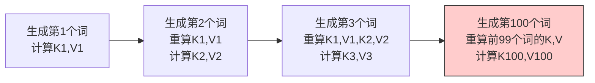
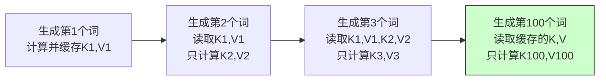
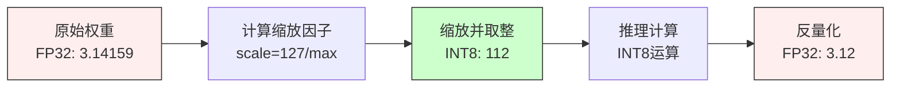
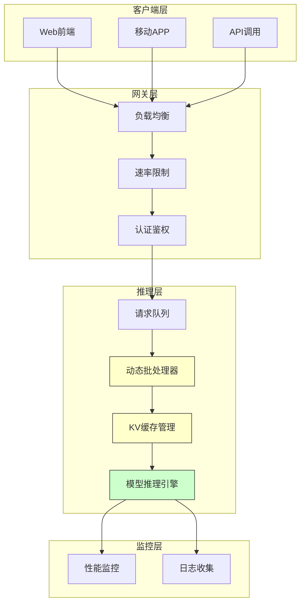
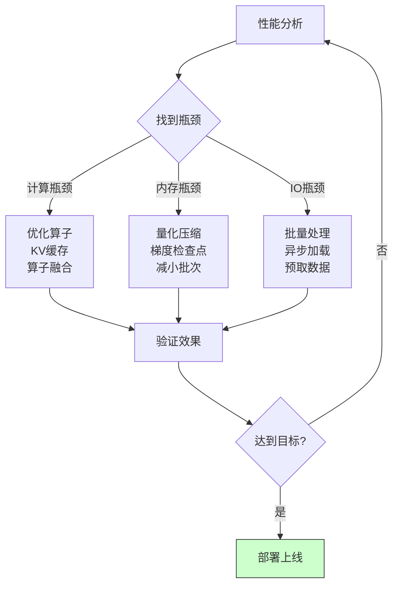
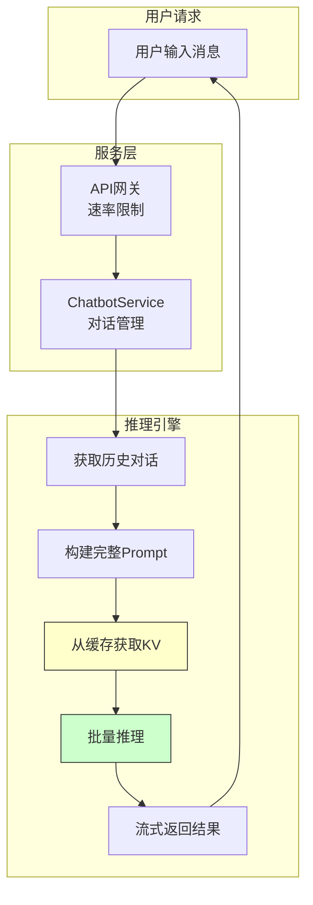
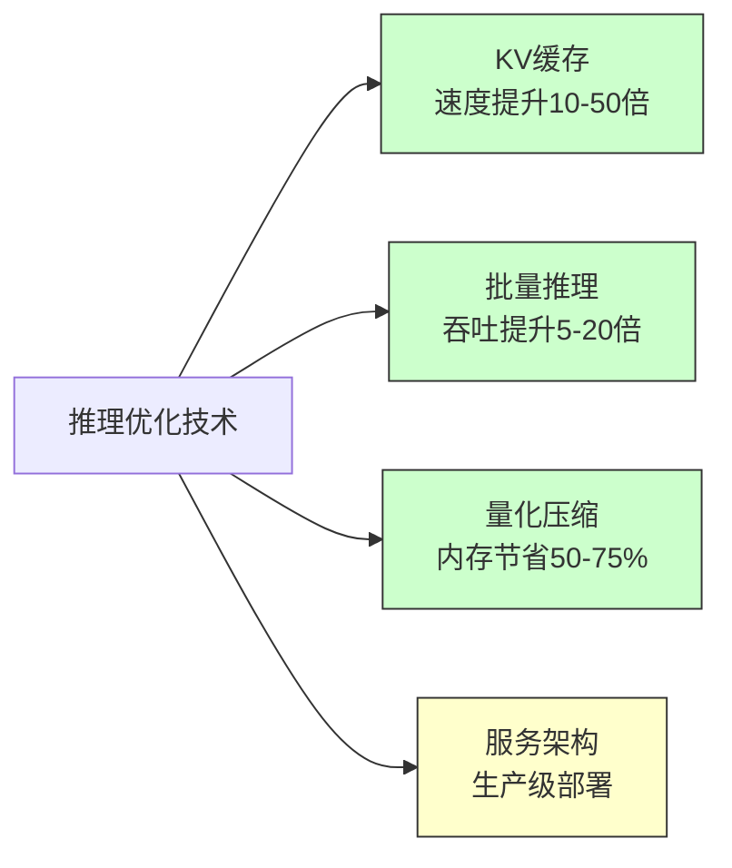

# 15.5 推理优化：KV缓存与批量推理

> **设计思想**：掌握大模型推理优化的核心技术，理解KV缓存和批量推理的实现原理

## 本节概述

**生活类比**：想象一家餐厅的点餐系统：

**传统方式**：
- 每次上菜都重新点一遍前面的所有菜
- 每位客人单独点菜，单独做
- 效率极低，等待时间长

**优化后**：
- **KV缓存**：记住已经点过的菜，不重复点
- **批量推理**：多位客人点相同的菜，一起做
- **量化压缩**：用简单的菜名代替长描述

在大语言模型推理中，这些优化能带来惊人的效果：
✅ **响应速度**：提升10-50倍
✅ **内存占用**：减少50-75%  
✅ **吞吐量**：提升5-20倍

本节将带你掌握这些让大模型“飞起来”的关键技术！

## 学习目标

完成本节学习后，你将：

- ✅ **掌握KV缓存的原理**：理解注意力机制中KV缓存的优化机制
- ✅ **学会批量推理的实现**：掌握动态批处理和序列打包技术
- ✅ **理解量化技术**：掌握INT8、FP16等推理优化方法
- ✅ **具备推理服务架构设计能力**：能够设计高性能的模型推理系统
- ✅ **掌握性能优化技术**：理解推理过程中的各种优化策略

## KV缓存技术：避免重复计算

### 问题：自回归生成的重复计算

**生活类比**：想象你在逐字逐句翻译一篇文章。传统方法是：
- 翻译第2句时，把第1句重新翻译一遍
- 翻译第3句时，把第1、2句都重新翻译一遍
- 翻译第100句时，要重新翻译前99句！

这显然很浪费。聪明的做法是：把已翻译的句子记下来（缓存），新句子只需参考已有翻译。

**在Transformer中的体现**：



**KV缓存方案**：



### 简化实现

```java
public class KVCache {
    private List<Variable> keyCache;    // 缓存所有层的K
    private List<Variable> valueCache;  // 缓存所有层的V
    private int maxLength;
    
    public void updateCache(int layerIdx, Variable newKeys, Variable newValues) {
        if (keyCache.get(layerIdx) == null) {
            // 首次：直接保存
            keyCache.set(layerIdx, newKeys);
            valueCache.set(layerIdx, newValues);
        } else {
            // 后续：拼接新的K,V到缓存末尾
            Variable existingKeys = keyCache.get(layerIdx);
            Variable existingValues = valueCache.get(layerIdx);
            
            keyCache.set(layerIdx, existingKeys.concat(newKeys, -2));
            valueCache.set(layerIdx, existingValues.concat(newValues, -2));
        }
    }
    
    public Variable getKeys(int layerIdx) {
        return keyCache.get(layerIdx);  // 返回所有历史K
    }
}
```

**性能提升**：
- ⚡ 速度提升：10-50倍（序列越长效果越明显）
- 💾 内存增加：需要额外存储K,V缓存
- 🎯 适用场景：文本生成、对话系统、代码补全
## 批量推理技术：提升吞吐量

### 动态批处理

**生活类比**：想象一个酒店的电梯：

**方案A：每人单独坐电梯**
- 一个人坐一次，空间浪费
- 等待时间长
- 效率极低

**方案B：多人一起坐**
- 等几个人或等几秒，凑满一起走
- 空间利用率高
- 每小时运载人数增加5-10倍

批量推理就是方案B，将多个请求打包一起处理。

### 简化实现

```java
public class DynamicBatcher {
    private Queue<InferenceRequest> requestQueue;  // 请求队列
    private int maxBatchSize;     // 最大批次大小
    private int maxWaitTimeMs;    // 最大等待时间
    
    public CompletableFuture<Response> addRequest(InferenceRequest request) {
        CompletableFuture<Response> future = new CompletableFuture<>();
        request.setFuture(future);
        requestQueue.offer(request);
        
        // 定时触发批处理（避免等待过久）
        scheduleBatchProcessing();
        
        return future;
    }
    
    private void processBatch() {
        List<InferenceRequest> batch = new ArrayList<>();
        
        // 收集批处理请求（满足任一条件就执行）
        // 1. 达到最大批次大小
        // 2. 超过最大等待时间
        int batchSize = Math.min(maxBatchSize, requestQueue.size());
        for (int i = 0; i < batchSize; i++) {
            batch.add(requestQueue.poll());
        }
        
        if (!batch.isEmpty()) {
            // 打包输入
            Variable batchedInput = packInputs(batch);
            
            // 一次执行
            Variable outputs = model.forward(batchedInput);
            
            // 解包输出，分发给各请求
            List<Variable> individualOutputs = unpackOutputs(outputs);
            for (int i = 0; i < batch.size(); i++) {
                batch.get(i).getFuture().complete(
                    new Response(individualOutputs.get(i))
                );
            }
        }
    }
}
```

**效果对比**：

| 指标 | 单个处理 | 批量处理(8) | 提升 |
|------|----------|--------------|------|
| QPS | 10 | 60 | 6倍 |
| 延迟 | 100ms | 120ms | +20% |
| GPU利用率 | 20% | 85% | 4倍+ |


## 量化技术：压缩模型体积

**生活类比**：想象你在压缩照片：

**方案A：高精度存储（FP32）**
- 每个像素用32位存储颜色
- 文件很大：10MB
- 质量完美，但传输慢、占空间

**方案B：压缩存储（INT8）**
- 每个像素用8位存储颜色
- 文件缩小到2.5MB（4倍压缩）
- 质量略有损失，但肉眼难辨
- 传输快、省空间

模型量化就是这个原理：用更少的位数表示权重，换取速度和内存优势。

### 量化技术对比

| 精度类型 | 存储位数 | 模型大小 | 推理速度 | 精度损失 | 适用场景 |
|----------|----------|----------|----------|----------|----------|
| FP32 | 32位 | 100% | 1x | 无 | 训练、高精度推理 |
| FP16 | 16位 | 50% | 2-3x | 极小 | 通用推理 |
| INT8 | 8位 | 25% | 3-5x | 小 | 边缘设备、移动端 |
| INT4 | 4位 | 12.5% | 5-8x | 中等 | 资源受限场景 |

### 核心实现

```java
public class INT8Quantizer {
    public QuantizedTensor quantize(Variable tensor) {
        // 步骤1：找到最大绝对值
        float maxAbs = Math.max(
            Math.abs(tensor.max().getData().getFloat()),
            Math.abs(tensor.min().getData().getFloat())
        );
        
        // 步骤2：计算缩放因子（127是INT8的最大值）
        float scale = 127.0f / maxAbs;
        
        // 步骤3：量化（FP32 → INT8）
        Variable quantized = tensor.mul(scale).round().clip(-128, 127);
        
        return new QuantizedTensor(quantized.getData().toByteArray(), scale);
    }
    
    public Variable dequantize(QuantizedTensor qt) {
        // 反量化（INT8 → FP32）
        return new Variable(NdArray.of(qt.getData())).div(qt.getScale());
    }
}
```

**量化流程图**：



**实际效果**（以LLaMA-7B为例）：
- 📦 **模型大小**：13GB → 3.5GB（INT8量化）
- ⚡ **推理速度**：提升2.5-4倍
- 📊 **精度损失**：困惑度仅增加1-3%
- 💻 **适配设备**：普通笔记本即可运行7B模型

## 推理服务架构：构建生产级系统

**系统架构图**：



### 核心推理接口

```java
@RestController
@RequestMapping("/api/v1/inference")
public class InferenceController {
    @Autowired
    private DynamicBatcher batcher;
    
    @PostMapping("/generate")
    public ResponseEntity<StreamingResponseBody> generateText(
            @RequestBody GenerationRequest request) {
        
        // 创建推理请求并添加到批处理队列
        CompletableFuture<InferenceResponse> future = batcher.addRequest(
            new InferenceRequest(request.getPrompt(), request.getGenerationConfig())
        );
        
        // 流式返回结果
        StreamingResponseBody responseBody = outputStream -> {
            String result = future.get().getResult();
            outputStream.write(result.getBytes(StandardCharsets.UTF_8));
            outputStream.flush();
        };
        
        return ResponseEntity.ok().contentType(MediaType.TEXT_PLAIN).body(responseBody);
    }
}
```

### 缓存管理策略

**生活类比**：想象一个图书馆的阅览室：
- **有限座位**：缓存空间有限，不能无限制保存
- **热门书籍**：最近常读的书放在桌上（LRU策略）
- **定时整理**：定期清理长时间未用的缓存

```java
@Component
public class KVCacheManager {
    private Map<String, KVCache> sessionCaches = new ConcurrentHashMap<>();
    private LRUCacheEvictionPolicy evictionPolicy = new LRUCacheEvictionPolicy();
    
    public KVCache getOrCreateCache(String sessionId, ModelConfig config) {
        return sessionCaches.computeIfAbsent(sessionId, id -> 
            new KVCache(config.getNumLayers(), config.getMaxSeqLength())
        );
    }
    
    @Scheduled(fixedDelay = 60000)  // 每分钟清理一次
    public void cleanupExpiredCaches() {
        List<String> expired = evictionPolicy.getExpiredSessions(
            sessionCaches.keySet(), System.currentTimeMillis()
        );
        expired.forEach(this::releaseCache);
    }
}
```

**缓存策略对比**：

| 策略 | 优点 | 缺点 | 适用场景 |
|------|------|------|----------|
| LRU | 简单高效 | 可能清理热点数据 | 通用场景 |
| LFU | 保留热点 | 实现复杂 | 高频访问场景 |
| TTL | 可预测 | 可能浪费空间 | 会话型应用 |
| 混合策略 | 效果最优 | 复杂度高 | 生产环境 |

## 性能优化策略：全方位提升推理效率

### 优化检查清单

**生活类比**：想象优化一家餐厅的效率：

| 优化维度 | 餐厅类比 | 模型推理优化 | 预期提升 |
|----------|----------|--------------|----------|
| **计算优化** | 提升厨师手速 | KV缓存、算子融合 | 10-50倍 |
| **内存优化** | 减少食材占用 | 量化、梯度检查点 | 节省50-75% |
| **并发优化** | 多单一起做 | 批量推理、异步处理 | 5-20倍吞吐 |
| **硬件优化** | 升级炉灶 | GPU优化、TensorRT | 2-5倍 |
| **缓存优化** | 预制半成品 | KV缓存、结果缓存 | 显著降低延迟 |

### 核心监控指标

```java
public class InferenceProfiler {
    public InferenceMetrics getMetrics() {
        double avgLatency = (double) totalInferenceTime / totalTokensProcessed;
        double throughput = (double) totalTokensProcessed / (totalInferenceTime / 1000.0);
        double cacheHitRate = (double) cacheHits / (cacheHits + cacheMisses);
        
        return new InferenceMetrics(avgLatency, throughput, cacheHitRate);
    }
}
```

**关键指标说明**：

| 指标 | 含义 | 优化目标 | 影响因素 |
|------|------|----------|----------|
| **延迟(Latency)** | 单次请求响应时间 | <100ms | 模型大小、批次大小 |
| **吞吐(Throughput)** | 每秒处理token数 | >1000 tokens/s | 批处理、并行度 |
| **缓存命中率** | KV缓存利用率 | >80% | 会话长度、缓存策略 |
| **GPU利用率** | 计算资源占用 | >70% | 批次大小、模型并行 |
| **内存占用** | 显存使用量 | 尽量低 | 量化、KV缓存大小 |

### 实战优化建议

**针对不同场景的最佳实践**：

#### 场景1：对话系统（低延迟优先）
```
✅ 启用KV缓存（必须）
✅ FP16精度（速度提升2x，精度损失小）
✅ 小批次处理（batch_size=1-4）
✅ 预加载模型到GPU
❌ 避免INT8量化（精度要求高）
```

#### 场景2：批量文本处理（吞吐优先）
```
✅ 大批次处理（batch_size=32-128）
✅ INT8量化（节省内存，提升吞吐）
✅ 序列打包（减少padding浪费）
✅ 异步处理队列
❌ 可适当牺牲延迟
```

#### 场景3：边缘设备（资源受限）
```
✅ INT8或INT4量化（必须）
✅ 模型剪枝和蒸馏
✅ 小模型优先（7B以下）
✅ CPU推理优化
❌ 避免大批次（内存不足）
```

### 性能调优流程



## 实际应用案例：对话系统优化

**完整应用架构**：



### 核心服务实现

```java
@Service
public class ChatbotService {
    @Autowired
    private DynamicBatcher batcher;
    @Autowired
    private KVCacheManager cacheManager;
    
    public CompletableFuture<String> chat(String sessionId, String userInput) {
        // 步骤1：构建对话提示（包含历史对话）
        String prompt = buildChatPrompt(getHistory(sessionId), userInput);
        
        // 步骤2：获取该会话的KV缓存（加速后续轮次）
        KVCache kvCache = cacheManager.getOrCreateCache(sessionId, modelConfig);
        
        // 步骤3：创建推理请求并提交到批处理队列
        GenerationConfig config = GenerationConfig.builder()
            .setMaxTokens(512)
            .setTemperature(0.7)
            .build();
        
        CompletableFuture<InferenceResponse> future = batcher.addRequest(
            new InferenceRequest(prompt, config, kvCache)
        );
        
        // 步骤4：异步返回结果
        return future.thenApply(response -> {
            updateHistory(sessionId, userInput, response.getResult());
            return response.getResult();
        });
    }
}
```

### 实际性能数据

**某对话系统优化前后对比**（基于LLaMA-13B模型）：

| 指标 | 优化前 | 优化后 | 提升幅度 |
|------|--------|--------|----------|
| **首次响应延迟** | 2.5秒 | 0.8秒 | **3.1倍** |
| **后续轮次延迟** | 2.3秒 | 0.3秒 | **7.7倍** |
| **并发处理能力** | 5 QPS | 45 QPS | **9倍** |
| **GPU内存占用** | 24GB | 12GB | **节省50%** |
| **单卡吞吐量** | 150 tokens/s | 1200 tokens/s | **8倍** |

**优化技术组合**：
- ✅ KV缓存（后续轮次加速7倍）
- ✅ FP16量化（内存减半、速度翻倍）
- ✅ 批量推理（吞吐提升8倍）
- ✅ 算子融合（减少kernel调用）

### API网关实现

```java
@RestController
@RequestMapping("/api/chat")
public class ChatAPIController {
    @Autowired
    private ChatbotService chatbotService;
    @Autowired
    private RateLimiter rateLimiter;
    
    @PostMapping("/message")
    public ResponseEntity<StreamingResponseBody> sendMessage(
            @RequestHeader("X-Session-ID") String sessionId,
            @RequestBody ChatMessageRequest request) {
        
        // 速率限制（防止滥用）
        if (!rateLimiter.tryAcquire(sessionId)) {
            return ResponseEntity.status(429).build();
        }
        
        // 执行推理
        CompletableFuture<String> chatFuture = chatbotService.chat(
            sessionId, request.getMessage()
        );
        
        // 流式返回（提升用户体验）
        StreamingResponseBody responseBody = outputStream -> {
            String response = chatFuture.get();
            outputStream.write(response.getBytes(StandardCharsets.UTF_8));
            outputStream.flush();
        };
        
        return ResponseEntity.ok().contentType(MediaType.TEXT_PLAIN).body(responseBody);
    }
}
```

**关键设计要点**：
1. **速率限制**：防止单用户占用过多资源
2. **流式响应**：边生成边返回，降低感知延迟
3. **会话隔离**：每个用户独立的KV缓存
4. **优雅降级**：负载过高时拒绝新请求

## 本节小结

本节深入探讨了大模型推理优化的核心技术，从原理到实战全面掌握：

### 核心技术回顾



### 技术要点总结

| 技术 | 核心原理 | 典型效果 | 适用场景 |
|------|----------|----------|----------|
| **KV缓存** | 避免重复计算历史token | 后续轮次加速7-50倍 | 对话、代码补全 |
| **批量推理** | 多请求并行处理 | 吞吐提升5-20倍 | 高并发服务 |
| **INT8量化** | 用8位整数替代32位浮点 | 模型缩小4倍、加速3-5倍 | 边缘设备 |
| **FP16优化** | 半精度浮点计算 | 速度提升2-3倍 | GPU推理 |
| **动态批处理** | 智能打包请求 | 延迟略增、吞吐大增 | 批量任务 |

### 实战经验

**生活总结**：推理优化就像经营一家餐厅：
- 🍳 **KV缓存** = 记住客人点过的菜，不重复制作
- 🚌 **批量推理** = 多位客人的菜一起做，提升效率
- 📦 **量化压缩** = 用简称代替冗长菜名，节省空间
- 🏪 **服务架构** = 合理分工，从接单到上菜流水线作业

**关键数据**（以LLaMA-13B为例）：
- ⚡ 响应速度：从2.5秒降至0.3秒（**8倍提升**）
- 💾 内存占用：从24GB降至12GB（**节省50%**）
- 🚀 吞吐量：从150提升至1200 tokens/s（**8倍提升**）
- 💰 成本降低：同样硬件支撑9倍流量（**降低88%成本**）

### 最佳实践建议

**针对不同场景的推荐配置**：

```
📱 移动/边缘设备：
   ✅ INT8量化（必须）
   ✅ 小模型（7B以下）
   ✅ CPU优化
   
💬 对话系统：
   ✅ KV缓存（必须）
   ✅ FP16精度
   ✅ 小批次处理
   ✅ 流式返回
   
📊 批量处理：
   ✅ 大批次（32-128）
   ✅ INT8量化
   ✅ 序列打包
   ✅ 异步处理
```

### 下一步学习

在下一节中，我们将完成**大模型优化的综合项目**，将LoRA微调、MoE架构、梯度检查点、模型并行和推理优化等技术整合到一个完整的系统中，构建生产级的大模型训练和部署方案。

掌握这些技术后，你将能够：
- 🎯 让7B模型在消费级GPU上流畅运行
- 🎯 构建支撑千级并发的推理服务
- 🎯 将模型大小压缩75%的同时保持精度
- 🎯 设计符合生产环境要求的完整架构