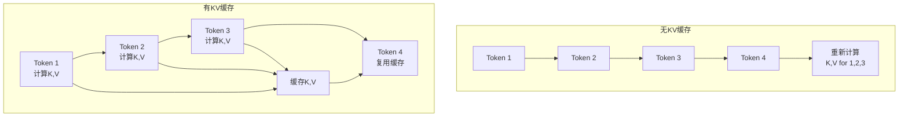

# 15.5 推理优化：KV缓存与批量推理

> **设计思想**：掌握大模型推理优化的核心技术，理解KV缓存和批量推理的实现原理

## 本节概述

大语言模型的推理阶段面临着计算效率和响应延迟的双重挑战。KV缓存技术通过缓存注意力机制中的Key和Value矩阵，避免重复计算，显著提升自回归生成的效率。批量推理技术通过并行处理多个请求，提高系统吞吐量。本节将深入探讨这些推理优化技术的原理、实现和应用。

## 学习目标

完成本节学习后，你将：

- ✅ **掌握KV缓存的原理**：理解注意力机制中KV缓存的优化机制
- ✅ **学会批量推理的实现**：掌握动态批处理和序列打包技术
- ✅ **理解量化技术**：掌握INT8、FP16等推理优化方法
- ✅ **具备推理服务架构设计能力**：能够设计高性能的模型推理系统
- ✅ **掌握性能优化技术**：理解推理过程中的各种优化策略

## KV缓存技术

### 设计原理

在自回归生成过程中，每个新token的生成都需要重新计算所有历史token的Key和Value矩阵。KV缓存通过缓存这些计算结果，避免重复计算：



### KV缓存实现

```java
public class KVCache {
    private List<Variable> keyCache;
    private List<Variable> valueCache;
    private int maxLength;
    private int numLayers;
    private int numHeads;
    private int headDim;
    
    public KVCache(int numLayers, int numHeads, int headDim, int maxLength) {
        this.numLayers = numLayers;
        this.numHeads = numHeads;
        this.headDim = headDim;
        this.maxLength = maxLength;
        
        // 初始化缓存
        this.keyCache = new ArrayList<>(numLayers);
        this.valueCache = new ArrayList<>(numLayers);
        
        for (int i = 0; i < numLayers; i++) {
            keyCache.add(null);
            valueCache.add(null);
        }
    }
    
    public void updateCache(int layerIdx, Variable keys, Variable values) {
        // 更新指定层的KV缓存
        if (keyCache.get(layerIdx) == null) {
            // 首次初始化
            keyCache.set(layerIdx, keys);
            valueCache.set(layerIdx, values);
        } else {
            // 拼接新的K,V到缓存中
            Variable existingKeys = keyCache.get(layerIdx);
            Variable existingValues = valueCache.get(layerIdx);
            
            // 沿序列维度拼接
            Variable newKeys = existingKeys.concat(keys, -2);
            Variable newValues = existingValues.concat(values, -2);
            
            keyCache.set(layerIdx, newKeys);
            valueCache.set(layerIdx, newValues);
        }
    }
    
    public Variable getKeys(int layerIdx) {
        return keyCache.get(layerIdx);
    }
    
    public Variable getValues(int layerIdx) {
        return valueCache.get(layerIdx);
    }
    
    public void clearCache() {
        // 清空缓存
        for (int i = 0; i < numLayers; i++) {
            keyCache.set(i, null);
            valueCache.set(i, null);
        }
    }
    
    public int getCurrentLength() {
        // 获取当前缓存长度
        if (keyCache.get(0) != null) {
            return keyCache.get(0).getShape().get(-2);
        }
        return 0;
    }
}
```

### 带KV缓存的注意力计算

```java
public class CachedAttention extends MultiHeadAttention {
    private KVCache kvCache;
    private boolean useCache;
    
    public CachedAttention(String name, int numHeads, int dModel, KVCache kvCache) {
        super(name, numHeads, dModel);
        this.kvCache = kvCache;
        this.useCache = (kvCache != null);
    }
    
    @Override
    public Variable forward(Variable... inputs) {
        Variable query = inputs[0];
        Variable key = inputs[1];
        Variable value = inputs[2];
        int layerIdx = inputs.length > 3 ? inputs[3].getData().toInt() : 0;
        
        // 线性投影
        Variable Q = queryProjection.forward(query);
        Variable K = keyProjection.forward(key);
        Variable V = valueProjection.forward(value);
        
        // 重塑为多头形式
        Q = reshapeToMultiHead(Q);
        K = reshapeToMultiHead(K);
        V = reshapeToMultiHead(V);
        
        if (useCache && kvCache.getCurrentLength() > 0) {
            // 使用缓存的K,V
            Variable cachedKeys = kvCache.getKeys(layerIdx);
            Variable cachedValues = kvCache.getValues(layerIdx);
            
            // 拼接当前K,V到缓存中
            Variable allKeys = cachedKeys.concat(K, -2);
            Variable allValues = cachedValues.concat(V, -2);
            
            // 更新缓存
            kvCache.updateCache(layerIdx, K, V);
            
            // 使用所有K,V计算注意力
            Variable attention = scaledDotProductAttention(Q, allKeys, allValues);
            return outputProjection.forward(attention);
        } else {
            // 不使用缓存，直接计算
            if (useCache) {
                // 首次计算，更新缓存
                kvCache.updateCache(layerIdx, K, V);
            }
            
            Variable attention = scaledDotProductAttention(Q, K, V);
            return outputProjection.forward(attention);
        }
    }
}
```

## 批量推理技术

### 动态批处理

```java
public class DynamicBatcher {
    private int maxBatchSize;
    private int maxWaitTimeMs;
    private Queue<InferenceRequest> requestQueue;
    private ScheduledExecutorService scheduler;
    
    public DynamicBatcher(int maxBatchSize, int maxWaitTimeMs) {
        this.maxBatchSize = maxBatchSize;
        this.maxWaitTimeMs = maxWaitTimeMs;
        this.requestQueue = new ConcurrentLinkedQueue<>();
        this.scheduler = Executors.newScheduledThreadPool(1);
    }
    
    public CompletableFuture<InferenceResponse> addRequest(InferenceRequest request) {
        CompletableFuture<InferenceResponse> future = new CompletableFuture<>();
        request.setFuture(future);
        requestQueue.offer(request);
        
        // 定时触发批处理
        scheduleBatchProcessing();
        
        return future;
    }
    
    private void scheduleBatchProcessing() {
        scheduler.schedule(() -> {
            if (!requestQueue.isEmpty()) {
                processBatch();
            }
        }, maxWaitTimeMs, TimeUnit.MILLISECONDS);
    }
    
    private void processBatch() {
        List<InferenceRequest> batchRequests = new ArrayList<>();
        
        // 收集批处理请求
        int batchSize = Math.min(maxBatchSize, requestQueue.size());
        for (int i = 0; i < batchSize; i++) {
            InferenceRequest request = requestQueue.poll();
            if (request != null) {
                batchRequests.add(request);
            }
        }
        
        if (!batchRequests.isEmpty()) {
            // 执行批处理推理
            executeBatchInference(batchRequests);
        }
    }
    
    private void executeBatchInference(List<InferenceRequest> requests) {
        try {
            // 打包输入
            Variable batchedInput = packInputs(requests);
            
            // 执行模型推理
            Variable outputs = model.forward(batchedInput);
            
            // 解包输出
            List<Variable> individualOutputs = unpackOutputs(outputs, requests.size());
            
            // 完成各请求
            for (int i = 0; i < requests.size(); i++) {
                InferenceRequest request = requests.get(i);
                InferenceResponse response = new InferenceResponse(individualOutputs.get(i));
                request.getFuture().complete(response);
            }
        } catch (Exception e) {
            // 处理错误
            for (InferenceRequest request : requests) {
                request.getFuture().completeExceptionally(e);
            }
        }
    }
}
```

### 序列打包优化

```java
public class SequencePacker {
    public PackedBatch packSequences(List<Variable> sequences) {
        // 计算最大序列长度
        int maxLen = sequences.stream()
            .mapToInt(seq -> seq.getShape().get(-1))
            .max()
            .orElse(0);
        
        // 创建填充后的批处理输入
        List<int[]> paddedSequences = new ArrayList<>();
        List<int[]> attentionMasks = new ArrayList<>();
        
        for (Variable sequence : sequences) {
            int[] tokens = sequence.getData().toIntArray();
            int seqLen = tokens.length;
            
            // 填充序列
            int[] paddedTokens = new int[maxLen];
            int[] mask = new int[maxLen];
            
            System.arraycopy(tokens, 0, paddedTokens, 0, seqLen);
            Arrays.fill(mask, 0, seqLen, 1);  // 有效位置为1
            
            paddedSequences.add(paddedTokens);
            attentionMasks.add(mask);
        }
        
        return new PackedBatch(
            new Variable(NdArray.of(paddedSequences.toArray(new int[0][]))),
            new Variable(NdArray.of(attentionMasks.toArray(new int[0][])))
        );
    }
    
    public List<Variable> unpackSequences(Variable packedOutput, 
                                        List<Integer> originalLengths) {
        List<Variable> unpacked = new ArrayList<>();
        
        for (int i = 0; i < originalLengths.size(); i++) {
            int originalLen = originalLengths.get(i);
            // 提取原始长度的输出
            Variable output = packedOutput.slice(i, i + 1).slice(0, originalLen);
            unpacked.add(output);
        }
        
        return unpacked;
    }
}
```

## 量化技术

### INT8量化

```java
public class INT8Quantizer {
    public QuantizedTensor quantize(Variable tensor) {
        // 计算量化参数
        float maxVal = tensor.max().getData().getFloat();
        float minVal = tensor.min().getData().getFloat();
        
        float scale = 127.0f / Math.max(Math.abs(maxVal), Math.abs(minVal));
        float zeroPoint = 0.0f;
        
        // 量化到INT8
        Variable scaledTensor = tensor.mul(scale);
        Variable quantized = scaledTensor.round().clip(-128, 127);
        
        return new QuantizedTensor(
            quantized.getData().toByteArray(),
            scale,
            zeroPoint
        );
    }
    
    public Variable dequantize(QuantizedTensor quantizedTensor) {
        // 反量化
        Variable quantized = new Variable(NdArray.of(quantizedTensor.getData()));
        Variable dequantized = quantized.div(quantizedTensor.getScale())
                                    .add(quantizedTensor.getZeroPoint());
        
        return dequantized;
    }
}
```

### FP16优化

```java
public class FP16Optimizer {
    public Variable convertToFP16(Variable tensor) {
        // 转换为半精度浮点数
        return tensor.toPrecision(Precision.FP16);
    }
    
    public Variable convertToFP32(Variable fp16Tensor) {
        // 转换回单精度浮点数
        return fp16Tensor.toPrecision(Precision.FP32);
    }
    
    public void optimizeModelForFP16(Model model) {
        // 将模型参数转换为FP16
        for (Parameter param : model.getParameters()) {
            param.setValue(convertToFP16(param.getValue()));
        }
    }
}
```

## 推理服务架构

### 高性能推理服务器

```java
@RestController
@RequestMapping("/api/v1/inference")
public class InferenceController {
    private Model model;
    private DynamicBatcher batcher;
    private KVCacheManager cacheManager;
    private MetricsCollector metricsCollector;
    
    @PostMapping("/generate")
    public ResponseEntity<StreamingResponseBody> generateText(
            @RequestBody GenerationRequest request) {
        
        // 创建推理请求
        InferenceRequest inferenceRequest = new InferenceRequest(
            request.getPrompt(),
            request.getGenerationConfig()
        );
        
        // 添加到批处理队列
        CompletableFuture<InferenceResponse> future = batcher.addRequest(inferenceRequest);
        
        // 返回流式响应
        StreamingResponseBody responseBody = outputStream -> {
            try {
                InferenceResponse response = future.get();
                String result = response.getResult();
                
                // 流式输出结果
                outputStream.write(result.getBytes(StandardCharsets.UTF_8));
                outputStream.flush();
            } catch (Exception e) {
                throw new RuntimeException("Generation failed", e);
            }
        };
        
        return ResponseEntity.ok()
            .contentType(MediaType.TEXT_PLAIN)
            .body(responseBody);
    }
    
    @PostMapping("/batch-generate")
    public ResponseEntity<List<GenerationResponse>> batchGenerate(
            @RequestBody BatchGenerationRequest request) {
        
        List<CompletableFuture<InferenceResponse>> futures = new ArrayList<>();
        
        // 批量添加请求
        for (String prompt : request.getPrompts()) {
            InferenceRequest inferenceRequest = new InferenceRequest(
                prompt, request.getGenerationConfig()
            );
            CompletableFuture<InferenceResponse> future = batcher.addRequest(inferenceRequest);
            futures.add(future);
        }
        
        // 等待所有结果
        List<GenerationResponse> responses = new ArrayList<>();
        for (CompletableFuture<InferenceResponse> future : futures) {
            try {
                InferenceResponse response = future.get();
                responses.add(new GenerationResponse(response.getResult()));
            } catch (Exception e) {
                responses.add(new GenerationResponse("Error: " + e.getMessage()));
            }
        }
        
        return ResponseEntity.ok(responses);
    }
}
```

### KV缓存管理

```java
@Component
public class KVCacheManager {
    private Map<String, KVCache> sessionCaches;
    private int maxCacheSize;
    private CacheEvictionPolicy evictionPolicy;
    
    public KVCacheManager(int maxCacheSize) {
        this.maxCacheSize = maxCacheSize;
        this.sessionCaches = new ConcurrentHashMap<>();
        this.evictionPolicy = new LRUCacheEvictionPolicy();
    }
    
    public KVCache getOrCreateCache(String sessionId, ModelConfig config) {
        return sessionCaches.computeIfAbsent(sessionId, id -> 
            new KVCache(
                config.getNumLayers(),
                config.getNumHeads(),
                config.getHeadDim(),
                config.getMaxSeqLength()
            )
        );
    }
    
    public void releaseCache(String sessionId) {
        KVCache cache = sessionCaches.remove(sessionId);
        if (cache != null) {
            cache.clearCache();
        }
    }
    
    public void cleanupExpiredCaches() {
        // 清理过期的缓存
        List<String> expiredSessions = evictionPolicy.getExpiredSessions(
            sessionCaches.keySet(), System.currentTimeMillis()
        );
        
        for (String sessionId : expiredSessions) {
            releaseCache(sessionId);
        }
    }
}
```

## 性能优化策略

### 推理性能分析

```java
public class InferenceProfiler {
    private long totalInferenceTime;
    private long totalTokensProcessed;
    private long cacheHits;
    private long cacheMisses;
    
    public void startProfiling() {
        totalInferenceTime = 0;
        totalTokensProcessed = 0;
        cacheHits = 0;
        cacheMisses = 0;
    }
    
    public InferenceMetrics getMetrics() {
        double avgLatency = (double) totalInferenceTime / totalTokensProcessed;
        double throughput = (double) totalTokensProcessed / 
                          (totalInferenceTime / 1000.0);  // tokens/sec
        double cacheHitRate = (double) cacheHits / (cacheHits + cacheMisses);
        
        return new InferenceMetrics(avgLatency, throughput, cacheHitRate);
    }
    
    public void recordTokenGeneration(long generationTime, boolean cacheHit) {
        totalInferenceTime += generationTime;
        totalTokensProcessed++;
        
        if (cacheHit) {
            cacheHits++;
        } else {
            cacheMisses++;
        }
    }
}
```

### 内存优化

```java
public class MemoryOptimizer {
    public void optimizeInferenceMemory(Model model, InferenceConfig config) {
        // 应用FP16优化
        if (config.isUseFP16()) {
            FP16Optimizer fp16Optimizer = new FP16Optimizer();
            fp16Optimizer.optimizeModelForFP16(model);
        }
        
        // 应用量化优化
        if (config.isUseQuantization()) {
            applyQuantization(model, config.getQuantizationLevel());
        }
        
        // 优化KV缓存大小
        optimizeKVCacheSize(config);
    }
    
    private void applyQuantization(Model model, QuantizationLevel level) {
        INT8Quantizer quantizer = new INT8Quantizer();
        
        for (Parameter param : model.getParameters()) {
            if (shouldQuantize(param, level)) {
                QuantizedTensor quantized = quantizer.quantize(param.getValue());
                param.setQuantizedValue(quantized);
            }
        }
    }
    
    private boolean shouldQuantize(Parameter param, QuantizationLevel level) {
        // 根据量化级别决定是否量化参数
        switch (level) {
            case INT8_WEIGHTS_ONLY:
                return param.getName().contains("weight");
            case INT8_ALL:
                return true;
            default:
                return false;
        }
    }
}
```

## 实际应用案例

### 聊天机器人服务

```java
@Service
public class ChatbotService {
    private Model chatModel;
    private KVCacheManager cacheManager;
    private DynamicBatcher batcher;
    private ConversationManager conversationManager;
    
    public CompletableFuture<String> chat(String sessionId, String userInput) {
        // 获取对话历史
        List<String> history = conversationManager.getHistory(sessionId);
        
        // 构建提示
        String prompt = buildChatPrompt(history, userInput);
        
        // 创建生成配置
        GenerationConfig config = GenerationConfig.builder()
            .setMaxTokens(512)
            .setTemperature(0.7)
            .setTopP(0.9)
            .build();
        
        // 获取KV缓存
        KVCache kvCache = cacheManager.getOrCreateCache(sessionId, modelConfig);
        
        // 创建推理请求
        InferenceRequest request = new InferenceRequest(prompt, config, kvCache);
        
        // 添加到批处理
        CompletableFuture<InferenceResponse> future = batcher.addRequest(request);
        
        return future.thenApply(response -> {
            String botResponse = response.getResult();
            // 更新对话历史
            conversationManager.updateHistory(sessionId, userInput, botResponse);
            return botResponse;
        });
    }
    
    private String buildChatPrompt(List<String> history, String userInput) {
        StringBuilder prompt = new StringBuilder();
        prompt.append("You are a helpful AI assistant.\n\n");
        
        for (int i = 0; i < history.size(); i += 2) {
            prompt.append("Human: ").append(history.get(i)).append("\n");
            if (i + 1 < history.size()) {
                prompt.append("Assistant: ").append(history.get(i + 1)).append("\n");
            }
        }
        
        prompt.append("Human: ").append(userInput).append("\n");
        prompt.append("Assistant: ");
        
        return prompt.toString();
    }
}
```

### API网关集成

```java
@RestController
@RequestMapping("/api/chat")
public class ChatAPIController {
    private ChatbotService chatbotService;
    private RateLimiter rateLimiter;
    private MetricsCollector metricsCollector;
    
    @PostMapping("/message")
    public ResponseEntity<StreamingResponseBody> sendMessage(
            @RequestHeader("X-Session-ID") String sessionId,
            @RequestBody ChatMessageRequest request) {
        
        // 速率限制检查
        if (!rateLimiter.tryAcquire(sessionId)) {
            return ResponseEntity.status(429).build();  // Too Many Requests
        }
        
        // 记录请求
        long startTime = System.currentTimeMillis();
        metricsCollector.recordRequest();
        
        // 执行聊天
        CompletableFuture<String> chatFuture = chatbotService.chat(
            sessionId, request.getMessage()
        );
        
        // 流式响应
        StreamingResponseBody responseBody = outputStream -> {
            try {
                String response = chatFuture.get();
                
                // 流式输出
                outputStream.write(response.getBytes(StandardCharsets.UTF_8));
                outputStream.flush();
                
                // 记录响应时间
                long endTime = System.currentTimeMillis();
                metricsCollector.recordResponseTime(endTime - startTime);
                
            } catch (Exception e) {
                metricsCollector.recordError();
                throw new RuntimeException("Chat failed", e);
            }
        };
        
        return ResponseEntity.ok()
            .contentType(MediaType.TEXT_PLAIN)
            .body(responseBody);
    }
}
```

## 本节小结

本节深入探讨了大模型推理优化的核心技术，我们学习了：

1. **KV缓存技术**：掌握了注意力机制中KV缓存的优化原理和实现
2. **批量推理技术**：学会了动态批处理和序列打包优化方法
3. **量化技术**：理解了INT8、FP16等推理优化技术
4. **推理服务架构**：具备了高性能模型推理系统的设计能力
5. **性能优化策略**：掌握了推理过程中的各种优化技术

推理优化技术对于大语言模型的实际应用至关重要，通过KV缓存、批量推理和量化等技术，可以显著提升推理效率和系统吞吐量，降低响应延迟和资源消耗。在实际部署中，需要根据具体应用场景选择合适的优化策略，并持续监控和调优系统性能。

在下一节中，我们将完成大模型优化的综合项目，将所学技术整合到完整的系统中。