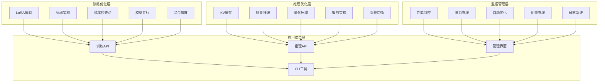

# 15.6 综合项目：大模型优化综合实验系统

> **设计思想**：通过完整的项目实践，整合大模型优化的各项技术，构建工业级的模型优化和部署系统

## 项目概述

在本章的前几节中，我们学习了LoRA微调、MoE架构、梯度检查点、模型并行和推理优化等大模型优化技术。为了将这些技术整合应用，本项目将指导读者构建一个完整的大模型优化综合实验系统。该系统将涵盖模型训练优化、推理部署优化和性能监控等完整生命周期。

## 项目目标

完成本项目后，你将：

- ✅ **实现完整的模型优化流水线**：掌握从训练到部署的全流程优化
- ✅ **构建多种优化技术的集成**：理解LoRA、MoE、检查点等技术的协同应用
- ✅ **实现高性能推理服务**：掌握KV缓存、批量推理等部署优化技术
- ✅ **构建自动化优化系统**：具备智能选择和应用优化策略的能力
- ✅ **掌握性能监控和调优**：理解系统性能分析和持续优化方法

## 项目架构设计

### 系统架构



## 核心实现

### 1. 统一优化配置管理

```java
public class OptimizationConfig {
    // LoRA配置
    private LoRAConfig loraConfig;
    
    // MoE配置
    private MoEConfig moeConfig;
    
    // 梯度检查点配置
    private CheckpointConfig checkpointConfig;
    
    // 模型并行配置
    private ModelParallelConfig parallelConfig;
    
    // 推理优化配置
    private InferenceOptimizationConfig inferenceConfig;
    
    // 训练配置
    private TrainingConfig trainingConfig;
    
    // 构建器模式
    public static class Builder {
        private OptimizationConfig config = new OptimizationConfig();
        
        public Builder withLoRA(LoRAConfig loraConfig) {
            config.loraConfig = loraConfig;
            return this;
        }
        
        public Builder withMoE(MoEConfig moeConfig) {
            config.moeConfig = moeConfig;
            return this;
        }
        
        public Builder withCheckpoint(CheckpointConfig checkpointConfig) {
            config.checkpointConfig = checkpointConfig;
            return this;
        }
        
        public Builder withParallel(ModelParallelConfig parallelConfig) {
            config.parallelConfig = parallelConfig;
            return this;
        }
        
        public Builder withInference(InferenceOptimizationConfig inferenceConfig) {
            config.inferenceConfig = inferenceConfig;
            return this;
        }
        
        public OptimizationConfig build() {
            return config;
        }
    }
}

public class OptimizationConfigManager {
    private Map<String, OptimizationConfig> configTemplates;
    private ConfigValidator validator;
    
    public OptimizationConfigManager() {
        this.configTemplates = new HashMap<>();
        this.validator = new ConfigValidator();
        initializeTemplates();
    }
    
    private void initializeTemplates() {
        // 小模型优化模板
        configTemplates.put("small_model", new OptimizationConfig.Builder()
            .withLoRA(new LoRAConfig.Builder().rank(8).alpha(8.0).build())
            .withCheckpoint(new CheckpointConfig.Builder()
                .strategy(CheckpointStrategy.UNIFORM).build())
            .build()
        );
        
        // 大模型优化模板
        configTemplates.put("large_model", new OptimizationConfig.Builder()
            .withLoRA(new LoRAConfig.Builder().rank(64).alpha(64.0).build())
            .withMoE(new MoEConfig.Builder().numExperts(32).topK(2).build())
            .withCheckpoint(new CheckpointConfig.Builder()
                .strategy(CheckpointStrategy.MEMORY_BASED).build())
            .withParallel(new ModelParallelConfig.Builder()
                .tensorParallelSize(4).pipelineParallelSize(2).build())
            .build()
        );
        
        // 推理优化模板
        configTemplates.put("inference_optimized", new OptimizationConfig.Builder()
            .withInference(new InferenceOptimizationConfig.Builder()
                .useKVCache(true)
                .useFP16(true)
                .useQuantization(true)
                .batchSize(8)
                .build())
            .build()
        );
    }
    
    public OptimizationConfig getOptimalConfig(ModelCharacteristics characteristics) {
        // 根据模型特征自动选择最优配置
        if (characteristics.getParameterCount() > 10e9) {  // > 10B参数
            return configTemplates.get("large_model");
        } else if (characteristics.isInferenceMode()) {
            return configTemplates.get("inference_optimized");
        } else {
            return configTemplates.get("small_model");
        }
    }
}
```

### 2. 统一优化训练器

```java
public class UnifiedOptimizer {
    private Model model;
    private OptimizationConfig config;
    private Optimizer optimizer;
    private List<OptimizationStrategy> strategies;
    
    public UnifiedOptimizer(Model model, OptimizationConfig config) {
        this.model = model;
        this.config = config;
        this.strategies = new ArrayList<>();
        
        // 初始化优化策略
        initializeStrategies();
        
        // 应用优化策略
        applyOptimizations();
    }
    
    private void initializeStrategies() {
        // 添加各种优化策略
        if (config.getLoraConfig() != null) {
            strategies.add(new LoRAOptimizationStrategy(config.getLoraConfig()));
        }
        
        if (config.getMoeConfig() != null) {
            strategies.add(new MoEOptimizationStrategy(config.getMoeConfig()));
        }
        
        if (config.getCheckpointConfig() != null) {
            strategies.add(new CheckpointOptimizationStrategy(config.getCheckpointConfig()));
        }
        
        if (config.getParallelConfig() != null) {
            strategies.add(new ParallelOptimizationStrategy(config.getParallelConfig()));
        }
    }
    
    private void applyOptimizations() {
        for (OptimizationStrategy strategy : strategies) {
            strategy.apply(model);
        }
        
        // 初始化优化器（只优化可训练参数）
        List<Parameter> trainableParams = extractTrainableParameters(model);
        this.optimizer = new AdamWOptimizer(
            config.getTrainingConfig().getLearningRate(),
            config.getTrainingConfig().getBeta1(),
            config.getTrainingConfig().getBeta2(),
            config.getTrainingConfig().getWeightDecay(),
            trainableParams
        );
    }
    
    public void train(DataLoader dataLoader, int epochs) {
        TrainingMonitor monitor = new TrainingMonitor();
        
        for (int epoch = 0; epoch < epochs; epoch++) {
            long epochStartTime = System.currentTimeMillis();
            
            // 训练循环
            trainEpoch(dataLoader, epoch);
            
            long epochEndTime = System.currentTimeMillis();
            double epochTime = (epochEndTime - epochStartTime) / 1000.0;
            
            // 记录性能指标
            monitor.recordEpochMetrics(epoch, epochTime);
            
            // 自适应优化调整
            adaptiveOptimizationAdjustment(monitor);
        }
    }
    
    private void trainEpoch(DataLoader dataLoader, int epoch) {
        model.train();
        double totalLoss = 0.0;
        int batchCount = 0;
        
        for (Batch batch : dataLoader) {
            long batchStartTime = System.currentTimeMillis();
            
            // 前向传播
            Variable logits = model.forward(batch.getInputIds(), batch.getAttentionMask());
            
            // 计算损失
            Variable loss = computeLoss(logits, batch.getLabels());
            
            // 反向传播
            loss.backward();
            
            // 优化步骤
            optimizer.step();
            optimizer.zeroGrad();
            
            totalLoss += loss.getData().getFloat();
            batchCount++;
            
            long batchEndTime = System.currentTimeMillis();
            double batchTime = (batchEndTime - batchStartTime) / 1000.0;
            
            if (batchCount % 100 == 0) {
                System.out.printf("Epoch %d, Batch %d, Loss: %.4f, Time: %.2fs%n", 
                                epoch, batchCount, totalLoss / batchCount, batchTime);
            }
        }
    }
    
    private void adaptiveOptimizationAdjustment(TrainingMonitor monitor) {
        // 根据性能监控结果自适应调整优化策略
        PerformanceMetrics metrics = monitor.getCurrentMetrics();
        
        if (metrics.getMemoryUsage() > 0.9) {  // 内存使用超过90%
            // 增加检查点密度
            increaseCheckpointDensity();
        }
        
        if (metrics.getTrainingSpeed() < 0.8 * monitor.getBaselineSpeed()) {
            // 训练速度下降，调整并行策略
            adjustParallelStrategy();
        }
    }
}
```

### 3. 高性能推理服务

```java
@RestController
@RequestMapping("/api/v1/model")
public class HighPerformanceInferenceService {
    private Model model;
    private KVCacheManager cacheManager;
    private DynamicBatcher batcher;
    private InferenceOptimizer optimizer;
    private PerformanceMonitor performanceMonitor;
    
    public HighPerformanceInferenceService(InferenceConfig config) {
        // 初始化模型
        this.model = loadModel(config.getModelPath());
        
        // 应用推理优化
        this.optimizer = new InferenceOptimizer(config.getOptimizationConfig());
        this.optimizer.optimizeModel(model);
        
        // 初始化缓存管理器
        this.cacheManager = new KVCacheManager(config.getCacheConfig());
        
        // 初始化动态批处理器
        this.batcher = new DynamicBatcher(
            config.getBatchConfig().getMaxBatchSize(),
            config.getBatchConfig().getMaxWaitTimeMs()
        );
        
        // 初始化性能监控
        this.performanceMonitor = new PerformanceMonitor();
    }
    
    @PostMapping("/generate")
    public ResponseEntity<StreamingResponseBody> generateText(
            @RequestBody GenerationRequest request,
            @RequestHeader(value = "X-Session-ID", required = false) String sessionId) {
        
        long startTime = System.currentTimeMillis();
        performanceMonitor.recordRequest();
        
        // 获取KV缓存
        KVCache kvCache = null;
        if (sessionId != null && request.isUseCache()) {
            kvCache = cacheManager.getOrCreateCache(sessionId, model.getConfig());
        }
        
        // 创建推理请求
        InferenceRequest inferenceRequest = new InferenceRequest(
            request.getPrompt(),
            request.getGenerationConfig(),
            kvCache
        );
        
        // 添加到批处理队列
        CompletableFuture<InferenceResponse> future = batcher.addRequest(inferenceRequest);
        
        // 流式响应
        StreamingResponseBody responseBody = outputStream -> {
            try {
                InferenceResponse response = future.get();
                String result = response.getResult();
                
                // 流式输出结果
                outputStream.write(result.getBytes(StandardCharsets.UTF_8));
                outputStream.flush();
                
                long endTime = System.currentTimeMillis();
                performanceMonitor.recordResponse(endTime - startTime, result.length());
                
            } catch (Exception e) {
                performanceMonitor.recordError();
                throw new RuntimeException("Generation failed", e);
            }
        };
        
        return ResponseEntity.ok()
            .contentType(MediaType.TEXT_PLAIN)
            .header("X-Generation-Time", String.valueOf(System.currentTimeMillis() - startTime))
            .body(responseBody);
    }
    
    @PostMapping("/batch-generate")
    public ResponseEntity<List<GenerationResponse>> batchGenerate(
            @RequestBody BatchGenerationRequest request) {
        
        long startTime = System.currentTimeMillis();
        List<CompletableFuture<InferenceResponse>> futures = new ArrayList<>();
        
        // 批量处理请求
        for (int i = 0; i < request.getPrompts().size(); i++) {
            String prompt = request.getPrompts().get(i);
            String sessionId = request.getSessionIds() != null ? 
                             request.getSessionIds().get(i) : null;
            
            // 获取KV缓存
            KVCache kvCache = null;
            if (sessionId != null && request.isUseCache()) {
                kvCache = cacheManager.getOrCreateCache(sessionId, model.getConfig());
            }
            
            // 创建推理请求
            InferenceRequest inferenceRequest = new InferenceRequest(
                prompt,
                request.getGenerationConfig(),
                kvCache
            );
            
            CompletableFuture<InferenceResponse> future = batcher.addRequest(inferenceRequest);
            futures.add(future);
        }
        
        // 等待所有结果
        List<GenerationResponse> responses = new ArrayList<>();
        for (CompletableFuture<InferenceResponse> future : futures) {
            try {
                InferenceResponse response = future.get();
                responses.add(new GenerationResponse(response.getResult(), "success"));
            } catch (Exception e) {
                responses.add(new GenerationResponse("", "error: " + e.getMessage()));
            }
        }
        
        long endTime = System.currentTimeMillis();
        performanceMonitor.recordBatchResponse(endTime - startTime, responses.size());
        
        return ResponseEntity.ok(responses);
    }
}
```

### 4. 自动优化系统

```java
@Component
public class AutoOptimizationSystem {
    private ModelAnalyzer modelAnalyzer;
    private OptimizationConfigManager configManager;
    private PerformancePredictor performancePredictor;
    private OptimizationExecutor optimizationExecutor;
    
    public AutoOptimizationSystem() {
        this.modelAnalyzer = new ModelAnalyzer();
        this.configManager = new OptimizationConfigManager();
        this.performancePredictor = new PerformancePredictor();
        this.optimizationExecutor = new OptimizationExecutor();
    }
    
    public OptimizationRecommendation analyzeAndRecommend(Model model, 
                                                       OptimizationContext context) {
        // 1. 分析模型特征
        ModelCharacteristics characteristics = modelAnalyzer.analyze(model);
        
        // 2. 预测不同优化策略的性能
        Map<OptimizationStrategy, PerformancePrediction> predictions = 
            predictPerformance(characteristics, context);
        
        // 3. 选择最优策略组合
        List<OptimizationStrategy> optimalStrategies = 
            selectOptimalStrategies(predictions, context.getConstraints());
        
        // 4. 生成配置建议
        OptimizationConfig config = configManager.generateConfig(optimalStrategies);
        
        return new OptimizationRecommendation(optimalStrategies, config, predictions);
    }
    
    private Map<OptimizationStrategy, PerformancePrediction> predictPerformance(
            ModelCharacteristics characteristics, OptimizationContext context) {
        Map<OptimizationStrategy, PerformancePrediction> predictions = new HashMap<>();
        
        // 预测各种优化策略的性能
        predictions.put(
            OptimizationStrategy.LORA,
            performancePredictor.predictLoRA(characteristics, context)
        );
        
        predictions.put(
            OptimizationStrategy.MOE,
            performancePredictor.predictMoE(characteristics, context)
        );
        
        predictions.put(
            OptimizationStrategy.CHECKPOINTING,
            performancePredictor.predictCheckpointing(characteristics, context)
        );
        
        predictions.put(
            OptimizationStrategy.PARALLEL,
            performancePredictor.predictParallel(characteristics, context)
        );
        
        return predictions;
    }
    
    public void applyOptimization(Model model, OptimizationRecommendation recommendation) {
        // 执行优化策略
        optimizationExecutor.execute(model, recommendation.getStrategies());
        
        // 验证优化效果
        validateOptimization(model, recommendation);
    }
    
    private void validateOptimization(Model model, OptimizationRecommendation recommendation) {
        // 性能基准测试
        PerformanceBenchmark benchmark = new PerformanceBenchmark();
        PerformanceMetrics baseline = benchmark.benchmark(model);
        
        // 验证优化效果是否符合预期
        PerformancePrediction prediction = recommendation.getPredictions()
            .get(recommendation.getStrategies().get(0));
        
        if (baseline.getMemoryUsage() > prediction.getExpectedMemoryUsage() * 1.1) {
            // 内存使用超出预期，需要调整
            adjustOptimization(model, recommendation);
        }
    }
}
```

## 性能监控和调优

### 实时性能监控

```java
@Component
public class RealTimePerformanceMonitor {
    private MetricsCollector metricsCollector;
    private AlertManager alertManager;
    private PerformanceAnalyzer performanceAnalyzer;
    
    public RealTimePerformanceMonitor() {
        this.metricsCollector = new MetricsCollector();
        this.alertManager = new AlertManager();
        this.performanceAnalyzer = new PerformanceAnalyzer();
    }
    
    @Scheduled(fixedRate = 1000)  // 每秒收集一次指标
    public void collectMetrics() {
        // 收集系统指标
        SystemMetrics systemMetrics = collectSystemMetrics();
        
        // 收集模型指标
        ModelMetrics modelMetrics = collectModelMetrics();
        
        // 收集业务指标
        BusinessMetrics businessMetrics = collectBusinessMetrics();
        
        // 存储指标
        metricsCollector.storeMetrics(systemMetrics, modelMetrics, businessMetrics);
        
        // 实时分析
        analyzeAndAlert(systemMetrics, modelMetrics, businessMetrics);
    }
    
    private void analyzeAndAlert(SystemMetrics systemMetrics, 
                               ModelMetrics modelMetrics,
                               BusinessMetrics businessMetrics) {
        // 分析性能趋势
        PerformanceTrend trend = performanceAnalyzer.analyzeTrend(
            systemMetrics, modelMetrics, businessMetrics
        );
        
        // 检查异常
        List<Alert> alerts = performanceAnalyzer.detectAnomalies(
            systemMetrics, modelMetrics, businessMetrics
        );
        
        // 发送告警
        for (Alert alert : alerts) {
            alertManager.sendAlert(alert);
        }
        
        // 自适应调整
        if (trend.getPerformanceDegradationRate() > 0.05) {  // 性能下降超过5%
            triggerAutoOptimization();
        }
    }
    
    private void triggerAutoOptimization() {
        // 触发自动优化流程
        AutoOptimizationTrigger.trigger();
    }
}
```

### 性能基准测试

```java
public class PerformanceBenchmark {
    private Model model;
    private BenchmarkConfig config;
    
    public PerformanceBenchmark(Model model, BenchmarkConfig config) {
        this.model = model;
        this.config = config;
    }
    
    public BenchmarkResult runBenchmark() {
        BenchmarkResult result = new BenchmarkResult();
        
        // 内存使用基准测试
        MemoryBenchmarkResult memoryResult = benchmarkMemoryUsage();
        result.setMemoryResult(memoryResult);
        
        // 计算性能基准测试
        ComputeBenchmarkResult computeResult = benchmarkComputePerformance();
        result.setComputeResult(computeResult);
        
        // 推理延迟基准测试
        LatencyBenchmarkResult latencyResult = benchmarkInferenceLatency();
        result.setLatencyResult(latencyResult);
        
        // 吞吐量基准测试
        ThroughputBenchmarkResult throughputResult = benchmarkThroughput();
        result.setThroughputResult(throughputResult);
        
        return result;
    }
    
    private MemoryBenchmarkResult benchmarkMemoryUsage() {
        MemoryProfiler profiler = new MemoryProfiler();
        
        // 测量不同输入大小的内存使用
        List<Integer> inputSizes = Arrays.asList(64, 128, 256, 512, 1024);
        Map<Integer, Long> memoryUsage = new HashMap<>();
        
        for (int inputSize : inputSizes) {
            long memory = profiler.measurePeakMemory(() -> {
                Variable dummyInput = createDummyInput(inputSize);
                return model.forward(dummyInput);
            });
            memoryUsage.put(inputSize, memory);
        }
        
        return new MemoryBenchmarkResult(memoryUsage);
    }
    
    private ComputeBenchmarkResult benchmarkComputePerformance() {
        // 测量不同计算密集度的性能
        long startTime = System.nanoTime();
        
        // 执行一系列计算密集型操作
        for (int i = 0; i < 1000; i++) {
            Variable dummyInput = createDummyInput(256);
            Variable output = model.forward(dummyInput);
            // 模拟反向传播
            output.backward();
        }
        
        long endTime = System.nanoTime();
        double totalTime = (endTime - startTime) / 1_000_000_000.0;  // 转换为秒
        
        return new ComputeBenchmarkResult(totalTime, 1000);
    }
    
    private LatencyBenchmarkResult benchmarkInferenceLatency() {
        List<Double> latencies = new ArrayList<>();
        
        // 测量多次推理的延迟
        for (int i = 0; i < 100; i++) {
            long startTime = System.nanoTime();
            Variable dummyInput = createDummyInput(128);
            Variable output = model.forward(dummyInput);
            long endTime = System.nanoTime();
            
            double latency = (endTime - startTime) / 1_000_000.0;  // 转换为毫秒
            latencies.add(latency);
        }
        
        // 计算统计指标
        double avgLatency = latencies.stream().mapToDouble(Double::doubleValue).average().orElse(0.0);
        double p95Latency = latencies.stream().sorted().skip((int) (latencies.size() * 0.95)).findFirst().orElse(0.0);
        double p99Latency = latencies.stream().sorted().skip((int) (latencies.size() * 0.99)).findFirst().orElse(0.0);
        
        return new LatencyBenchmarkResult(avgLatency, p95Latency, p99Latency);
    }
}
```

## 项目部署和运维

### 容器化部署

```dockerfile
# Dockerfile
FROM openjdk:11-jre-slim

# 安装依赖
RUN apt-get update && apt-get install -y \
    python3 \
    python3-pip \
    && rm -rf /var/lib/apt/lists/*

# 复制应用文件
COPY target/model-optimization-system.jar /app/model-optimization-system.jar
COPY config/ /app/config/
COPY models/ /app/models/

# 设置工作目录
WORKDIR /app

# 暴露端口
EXPOSE 8080

# 启动命令
ENTRYPOINT ["java", "-jar", "model-optimization-system.jar"]
```

### Kubernetes部署配置

```yaml
# deployment.yaml
apiVersion: apps/v1
kind: Deployment
metadata:
  name: model-optimization-service
spec:
  replicas: 3
  selector:
    matchLabels:
      app: model-optimization-service
  template:
    metadata:
      labels:
        app: model-optimization-service
    spec:
      containers:
      - name: model-optimization-service
        image: model-optimization-service:latest
        ports:
        - containerPort: 8080
        resources:
          requests:
            memory: "8Gi"
            cpu: "4"
          limits:
            memory: "16Gi"
            cpu: "8"
        env:
        - name: MODEL_PATH
          value: "/app/models/optimized_model.bin"
        - name: OPTIMIZATION_CONFIG
          value: "/app/config/production.json"
        volumeMounts:
        - name: model-storage
          mountPath: /app/models
      volumes:
      - name: model-storage
        persistentVolumeClaim:
          claimName: model-pvc
---
apiVersion: v1
kind: Service
metadata:
  name: model-optimization-service
spec:
  selector:
    app: model-optimization-service
  ports:
  - port: 80
    targetPort: 8080
  type: LoadBalancer
```

## 项目总结

通过本项目的完整实现，我们构建了一个工业级的大模型优化综合实验系统，涵盖了：

1. **统一优化配置管理**：实现了灵活的优化策略配置和管理
2. **统一优化训练器**：整合了LoRA、MoE、检查点等多种优化技术
3. **高性能推理服务**：构建了支持KV缓存、批量推理的高性能服务
4. **自动优化系统**：实现了智能化的优化策略选择和应用
5. **性能监控和调优**：建立了完整的性能监控和持续优化体系

这个系统不仅巩固了我们对各种大模型优化技术的理解，更重要的是培养了实际的AI系统工程能力，为构建和部署大规模AI应用奠定了坚实基础。

## 扩展思考

1. **多模型管理**：如何支持多个不同模型的统一管理和优化
2. **边缘部署**：如何将优化技术应用到边缘设备和移动端
3. **联邦学习**：如何在分布式环境中应用这些优化技术
4. **自动化ML**：如何进一步自动化模型选择和超参数优化
5. **绿色AI**：如何通过优化技术减少AI系统的能耗和碳足迹

通过不断实践和优化，我们可以构建出更加高效、智能、可持续的AI系统，为AI技术的广泛应用提供强大的技术支撑。