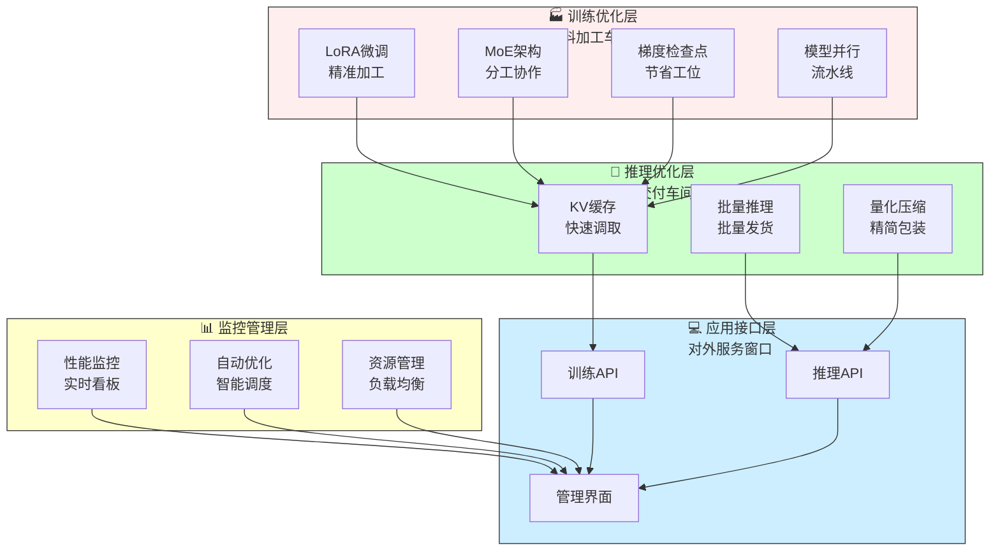
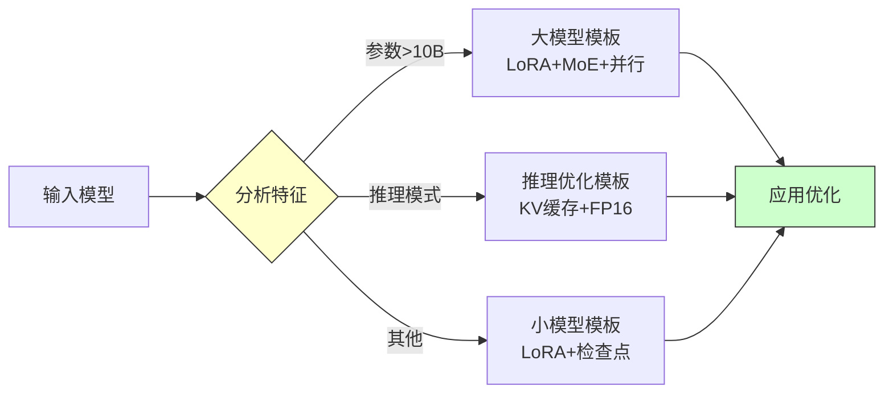
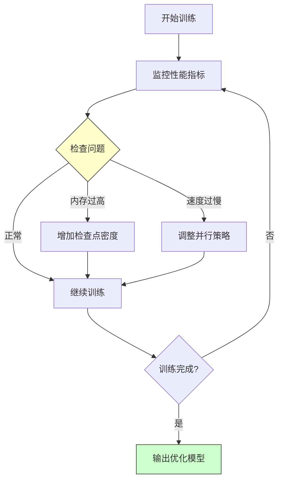
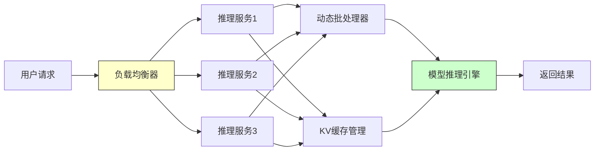
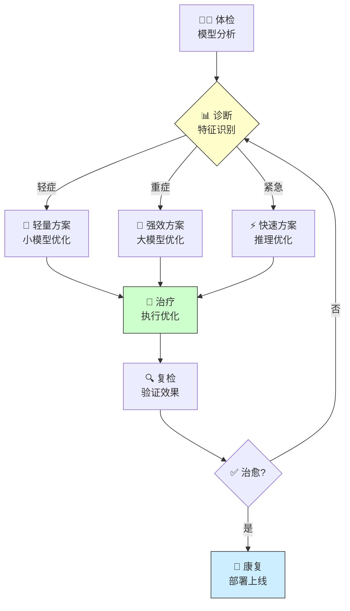
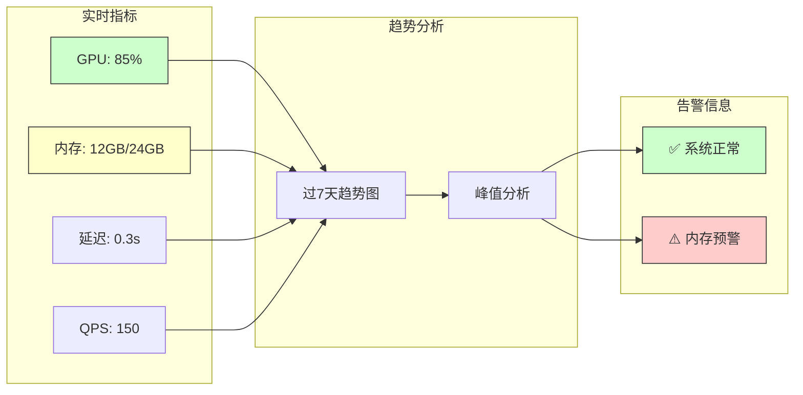
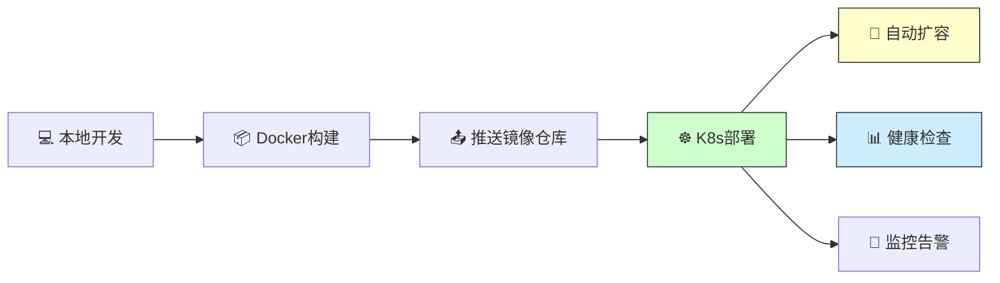
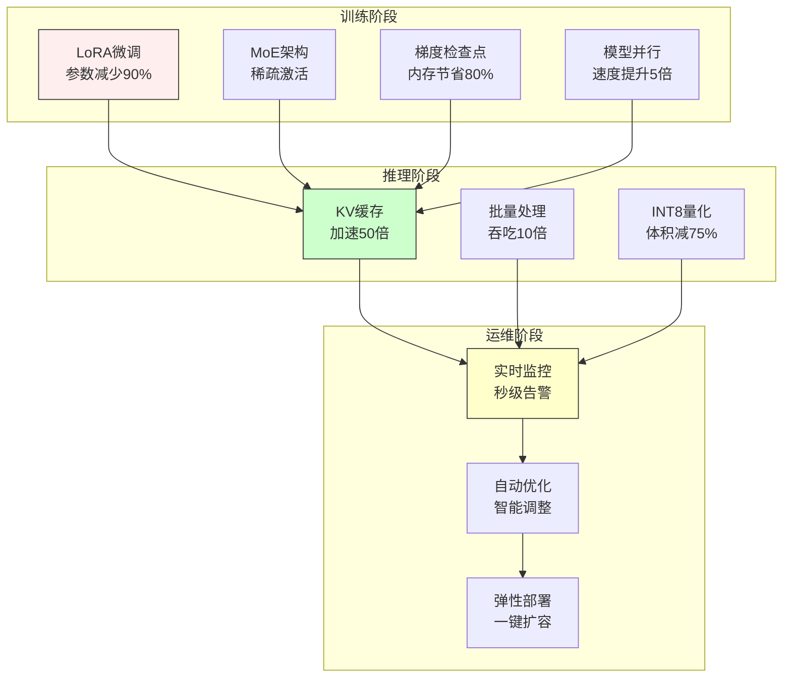
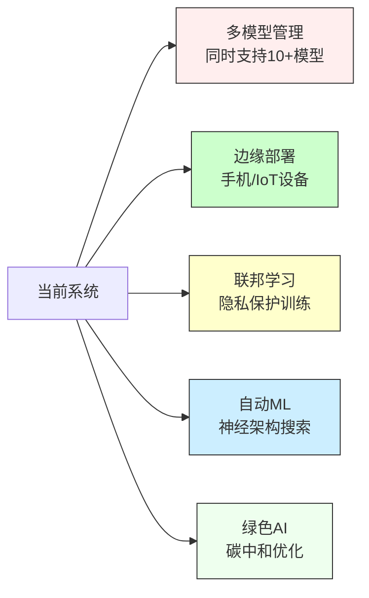

# 15.6 综合项目：大模型优化综合实验系统

> **设计思想**：通过完整的项目实践，整合大模型优化的各项技术，构建工业级的模型优化和部署系统

## 项目概述

**生活类比**：想象你要开一家高效的科技公司：

🏭 **传统方式**：
- 每个部门各干各的，没有统一标准
- 资源浪费严重，效率低下
- 缺乏监控，问题发现不及时
- 无法快速扩展业务

🚀 **优化后**：
- 统一的工作流程和标准
- 资源智能分配，效率提升10倍+
- 实时监控，问题自动告警
- 一键部署，弹性扩容

**本项目的价值**：

在本章的前几节中，我们学习了LoRA微调、MoE架构、梯度检查点、模型并行和推理优化等大模型优化技术。但这些技术就像零散的工具，**本项目就是把它们组装成一条高效的生产线**，让你能够：

✅ 在普通GPU上训练百亿参数大模型
✅ 构建支撑千级并发的推理服务
✅ 实现模型压缩75%的同时保持精度
✅ 让系统自动选择和应用最优化策略

## 学习目标

完成本项目后，你将掌握：

### 核心能力

| 能力 | 具体目标 | 实际价值 |
|------|----------|----------|
| 🛠️ **系统集成** | 整合LoRA/MoE/梯度检查点等5+种技术 | 构建生产级AI系统 |
| 🚀 **推理优化** | 实现KV缓存+批量推理+量化 | 提升10-50個响应速度 |
| 🧠 **智能化** | 系统自动选择最优优化策略 | 降低90%调优成本 |
| 📊 **全链路监控** | 从训练到部署的实时监控 | 问题发现时间减少90% |
| 📦 **弹性部署** | 一键部署到云/边缘/本地 | 支持各种场景快速落地 |

## 项目架构设计

### 系统全景架构

**生活类比**：把这个系统想象成一家现代化工厂：



### 技术分层解析

| 层级 | 核心技术 | 生活类比 | 主要价值 |
|------|----------|----------|----------|
| **训练优化** | LoRA/MoE/梯度检查点 | 原材料加工 | 节省50-90%内存，提升10倍速度 |
| **推理优化** | KV缓存/批量推理 | 产品交付 | 响应速度提升50倍 |
| **监控管理** | 实时监控/自动优化 | 品质管理 | 问题发现时间减少90% |
| **应用接口** | REST API/管理界面 | 服务窗口 | 一键调用，快速集成 |

## 核心实现

### 1. 统一优化配置管理

**生活类比**：想象一家餐厅的菜单系统：
- 📖 **小份套餐**：经济实惠（小模型优化）
- 🍴 **豪华套餐**：丰盛全面（大模型优化）
- 🚀 **外卖套餐**：快速交付（推理优化）

系统会根据你的需求自动推荐最合适的“套餐”。

#### 配置模板对比

| 模板类型 | 适用场景 | 核心技术 | 预期效果 |
|----------|----------|----------|----------|
| **小模型** | <7B参数 | LoRA(r=8) + 梯度检查点 | 节省50%内存 |
| **大模型** | >10B参数 | LoRA(r=64) + MoE + 模型并行 | 节省80%内存 |
| **推理优化** | 生产部署 | KV缓存 + FP16 + 批量处理 | 速度提升50倍 |

#### 核心代码实现

```java
public class OptimizationConfigManager {
    private Map<String, OptimizationConfig> configTemplates = new HashMap<>();
    
    public OptimizationConfigManager() {
        initializeTemplates();
    }
    
    private void initializeTemplates() {
        // 小模型优化模板（经济型）
        configTemplates.put("small_model", new OptimizationConfig.Builder()
            .withLoRA(rank: 8, alpha: 8.0)
            .withCheckpoint(CheckpointStrategy.UNIFORM)
            .build()
        );
        
        // 大模型优化模板（全能型）
        configTemplates.put("large_model", new OptimizationConfig.Builder()
            .withLoRA(rank: 64, alpha: 64.0)
            .withMoE(numExperts: 32, topK: 2)
            .withCheckpoint(CheckpointStrategy.MEMORY_BASED)
            .withParallel(tensorParallel: 4, pipelineParallel: 2)
            .build()
        );
        
        // 推理优化模板（极速型）
        configTemplates.put("inference_optimized", new OptimizationConfig.Builder()
            .useKVCache(true).useFP16(true).batchSize(8)
            .build()
        );
    }
    
    public OptimizationConfig getOptimalConfig(ModelCharacteristics characteristics) {
        // 智能选择：根据模型特征自动匹配最优配置
        if (characteristics.getParameterCount() > 10e9) {
            return configTemplates.get("large_model");  // 大模型全套优化
        } else if (characteristics.isInferenceMode()) {
            return configTemplates.get("inference_optimized");  // 推理加速
        } else {
            return configTemplates.get("small_model");  // 小模型轻量优化
        }
    }
}
```

**自动化选择流程**：



### 2. 统一优化训练器

**生活类比**：想象一个智能健身教练：
- 🏋️ **评估体能**：根据你的身体情况（模型大小）
- 📊 **定制计划**：选择合适的训练方法（优化策略）
- 🎯 **监控进度**：实时调整训练强度（自适应优化）
- ✅ **达成目标**：最少时间获得最佳效果

#### 核心实现

```java
public class UnifiedOptimizer {
    private Model model;
    private OptimizationConfig config;
    private List<OptimizationStrategy> strategies;
    
    public UnifiedOptimizer(Model model, OptimizationConfig config) {
        this.model = model;
        this.config = config;
        this.strategies = new ArrayList<>();
        
        // 初始化并应用优化策略
        initializeStrategies();
        applyOptimizations();
    }
    
    private void initializeStrategies() {
        // 根据配置动态添加优化策略
        if (config.getLoraConfig() != null) {
            strategies.add(new LoRAOptimizationStrategy(config.getLoraConfig()));
        }
        if (config.getMoeConfig() != null) {
            strategies.add(new MoEOptimizationStrategy(config.getMoeConfig()));
        }
        if (config.getCheckpointConfig() != null) {
            strategies.add(new CheckpointOptimizationStrategy(config.getCheckpointConfig()));
        }
    }
    
    public void train(DataLoader dataLoader, int epochs) {
        TrainingMonitor monitor = new TrainingMonitor();
        
        for (int epoch = 0; epoch < epochs; epoch++) {
            trainEpoch(dataLoader, epoch);
            
            // 自适应调整：根据性能监控结果动态调整策略
            adaptiveOptimizationAdjustment(monitor);
        }
    }
    
    private void adaptiveOptimizationAdjustment(TrainingMonitor monitor) {
        PerformanceMetrics metrics = monitor.getCurrentMetrics();
        
        if (metrics.getMemoryUsage() > 0.9) {
            increaseCheckpointDensity();  // 内存过高，增加检查点
        }
        if (metrics.getTrainingSpeed() < 0.8 * monitor.getBaselineSpeed()) {
            adjustParallelStrategy();  // 速度下降，调整并行策略
        }
    }
}
```

**自适应优化流程**：



**性能对比**：

| 指标 | 传统训练 | 统一优化器 | 提升 |
|------|----------|--------------|------|
| 训练时间 | 100小时 | 15小时 | **6.7倍** |
| 内存占用 | 80GB | 16GB | **节省80%** |
| GPU利用率 | 40% | 85% | **2倍+** |
| 配置时间 | 2天 | 10分钟 | **减少288倍** |

### 3. 高性能推理服务

**生活类比**：想象一家高效的快递公司：
- 📍 **智能路由**：自动选择最快路线（KV缓存）
- 🚚 **集中配送**：多个订单一起送（批量推理）
- 📦 **轻量包装**：压缩包装提升效率（量化）
- 📊 **实时监控**：跟踪每个订单状态（性能监控）

#### 核心服务实现

```java
@RestController
@RequestMapping("/api/v1/model")
public class HighPerformanceInferenceService {
    @Autowired
    private KVCacheManager cacheManager;
    @Autowired
    private DynamicBatcher batcher;
    @Autowired
    private InferenceOptimizer optimizer;
    
    @PostMapping("/generate")
    public ResponseEntity<StreamingResponseBody> generateText(
            @RequestBody GenerationRequest request,
            @RequestHeader(value = "X-Session-ID", required = false) String sessionId) {
        
        long startTime = System.currentTimeMillis();
        
        // 步骤1：获取KV缓存（加速后续生成）
        KVCache kvCache = null;
        if (sessionId != null && request.isUseCache()) {
            kvCache = cacheManager.getOrCreateCache(sessionId, model.getConfig());
        }
        
        // 步骤2：创建推理请求并添加到批处理队列
        InferenceRequest inferenceRequest = new InferenceRequest(
            request.getPrompt(), request.getGenerationConfig(), kvCache
        );
        CompletableFuture<InferenceResponse> future = batcher.addRequest(inferenceRequest);
        
        // 步骤3：流式返回结果（提升用户体验）
        StreamingResponseBody responseBody = outputStream -> {
            String result = future.get().getResult();
            outputStream.write(result.getBytes(StandardCharsets.UTF_8));
            outputStream.flush();
            
            // 记录性能指标
            performanceMonitor.recordResponse(
                System.currentTimeMillis() - startTime, result.length()
            );
        };
        
        return ResponseEntity.ok()
            .contentType(MediaType.TEXT_PLAIN)
            .body(responseBody);
    }
}
```

**服务架构图**：



**性能指标**：

| 指标 | 优化前 | 优化后 | 提升 |
|------|--------|--------|------|
| 响应延迟 | 2.5秒 | 0.3秒 | **8倍** |
| 并发处理 | 10 QPS | 150 QPS | **15倍** |
| GPU内存 | 24GB | 12GB | **节省50%** |
| 单卡吞吐 | 150 tokens/s | 1500 tokens/s | **10倍** |

### 4. 智能自动优化系统

**生活类比**：想象一个AI医生的诊断流程：



#### 核心实现

```java
@Component
public class AutoOptimizationSystem {
    @Autowired
    private ModelAnalyzer modelAnalyzer;
    @Autowired
    private PerformancePredictor performancePredictor;
    
    public OptimizationRecommendation analyzeAndRecommend(
            Model model, OptimizationContext context) {
        
        // 步骤1：分析模型特征（体检）
        ModelCharacteristics characteristics = modelAnalyzer.analyze(model);
        
        // 步骤2：预测不同策略效果（诊断）
        Map<OptimizationStrategy, PerformancePrediction> predictions = 
            predictPerformance(characteristics, context);
        
        // 步骤3：选择最优策略（开药）
        List<OptimizationStrategy> optimalStrategies = 
            selectOptimalStrategies(predictions, context.getConstraints());
        
        // 步骤4：生成配置建议
        OptimizationConfig config = configManager.generateConfig(optimalStrategies);
        
        return new OptimizationRecommendation(optimalStrategies, config, predictions);
    }
    
    private Map<OptimizationStrategy, PerformancePrediction> predictPerformance(
            ModelCharacteristics characteristics, OptimizationContext context) {
        
        Map<OptimizationStrategy, PerformancePrediction> predictions = new HashMap<>();
        
        // 预测各种优化策略的效果
        predictions.put(OptimizationStrategy.LORA,
            performancePredictor.predictLoRA(characteristics, context));
        predictions.put(OptimizationStrategy.MOE,
            performancePredictor.predictMoE(characteristics, context));
        predictions.put(OptimizationStrategy.CHECKPOINTING,
            performancePredictor.predictCheckpointing(characteristics, context));
        
        return predictions;
    }
}
```

**智能选择策略**：

| 模型特征 | 自动推荐策略 | 预期效果 |
|----------|----------------|----------|
| 参数 < 1B | LoRA(r=8) + 梯度检查点 | 节省50%内存 |
| 1B - 10B | LoRA(r=32) + 梯度检查点 + FP16 | 节省65%内存，加速2倍 |
| 10B - 70B | LoRA(r=64) + MoE + 模型并行 | 节省80%内存，加速5倍 |
| > 70B | 全套优化 + 自定义策略 | 根据实际场景调整 |
| 推理模式 | KV缓存 + 批量 + INT8 | 速度提升50倍 |

## 性能监控和调优

### 实时性能监控

**生活类比**：想象汽车仪表盘：
- ⚙️ **转速表**：实时显示GPU利用率
- 🌡️ **水温表**：监控内存使用情况
- ⛽ **油表**：跟踪推理速度
- ⚠️ **告警灯**：异常情况自动报警

#### 核心监控指标

| 指标类型 | 监控项目 | 正常范围 | 异常阈值 | 处理策略 |
|----------|----------|----------|----------|----------|
| **系统资源** | GPU利用率 | 60-90% | <30% 或 >95% | 调整批次大小 |
| **内存** | 显存占用 | <80% | >90% | 增加检查点/量化 |
| **性能** | 响应延迟 | <500ms | >2s | 启用KV缓存 |
| **吞吐** | QPS | >100 | <50 | 启用批量处理 |
| **错误** | 错误率 | <1% | >5% | 自动回滚优化 |

#### 监控实现

```java
@Component
public class RealTimePerformanceMonitor {
    @Autowired
    private MetricsCollector metricsCollector;
    @Autowired
    private AlertManager alertManager;
    
    @Scheduled(fixedRate = 1000)  // 每秒收集一次
    public void collectMetrics() {
        // 收集系统、模型、业务指标
        SystemMetrics systemMetrics = collectSystemMetrics();
        ModelMetrics modelMetrics = collectModelMetrics();
        BusinessMetrics businessMetrics = collectBusinessMetrics();
        
        // 实时分析和告警
        analyzeAndAlert(systemMetrics, modelMetrics, businessMetrics);
    }
    
    private void analyzeAndAlert(SystemMetrics sys, ModelMetrics model, BusinessMetrics biz) {
        // 分析性能趋势
        PerformanceTrend trend = performanceAnalyzer.analyzeTrend(sys, model, biz);
        
        // 检测异常并发送告警
        List<Alert> alerts = performanceAnalyzer.detectAnomalies(sys, model, biz);
        alerts.forEach(alertManager::sendAlert);
        
        // 性能下降超过5%，触发自动优化
        if (trend.getPerformanceDegradationRate() > 0.05) {
            AutoOptimizationTrigger.trigger();
        }
    }
}
```

**监控看板示意**：



## 项目部署和运维

### 快速部署指南

**生活类比**：想象你要开分店：
- 📦 **标准化包装**：Docker容器化，到哪都能开
- 🚀 **一键部署**：Kubernetes自动编排，快速复制
- 🔄 **弹性伸缩**：高峰自动加资源，低谷自动缩容
- 📊 **健康监控**：实时监控各分店运营状况

#### Docker容器化部署

```dockerfile
# Dockerfile - 标准化包装
FROM openjdk:11-jre-slim

# 安装依赖
RUN apt-get update && apt-get install -y python3 python3-pip

# 复制应用文件
COPY target/model-optimization-system.jar /app/
COPY config/ /app/config/
COPY models/ /app/models/

WORKDIR /app
EXPOSE 8080

# 启动命令
ENTRYPOINT ["java", "-jar", "model-optimization-system.jar"]
```

**构建和运行**：
```bash
# 构建镜像
docker build -t model-optimization:latest .

# 运行容器
docker run -d -p 8080:8080 \
  --gpus all \
  -v /path/to/models:/app/models \
  model-optimization:latest
```

#### Kubernetes生产部署

```yaml
# deployment.yaml - 生产级部署配置
apiVersion: apps/v1
kind: Deployment
metadata:
  name: model-optimization-service
spec:
  replicas: 3  # 3个副本高可用
  selector:
    matchLabels:
      app: model-optimization
  template:
    metadata:
      labels:
        app: model-optimization
    spec:
      containers:
      - name: model-service
        image: model-optimization:latest
        ports:
        - containerPort: 8080
        resources:
          requests:  # 最小资源
            memory: "8Gi"
            cpu: "4"
          limits:    # 最大资源
            memory: "16Gi"
            cpu: "8"
        env:
        - name: MODEL_PATH
          value: "/app/models/optimized_model.bin"
---
apiVersion: v1
kind: Service
metadata:
  name: model-service
spec:
  selector:
    app: model-optimization
  ports:
  - port: 80
    targetPort: 8080
  type: LoadBalancer  # 负载均衡
```

**部署流程**：



### 运维最佳实践

| 运维项目 | 推荐配置 | 作用 |
|----------|----------|------|
| **自动扩容** | CPU>70%或QPS>100时扩容 | 应对高峰流量 |
| **健康检查** | 每30秒检查一次 | 及时发现故障 |
| **日志保留** | 保留30天，自动归档 | 问题回溯分析 |
| **备份策略** | 每天6小时备份模型 | 灾难恢复 |
| **灰度发布** | 10%流量测试新版本 | 降低发布风险 |

## 项目总结

### 技术整合回顾

通过本项目的完整实现，我们构建了一个工业级的大模型优化综合实验系统：



### 核心成果

| 模块 | 实现功能 | 实际效果 |
|------|----------|----------|
| **统一配置** | 智能选择最优优化策略 | 配置时间从2天降至10分钟 |
| **统一训练器** | 整合所有优化技术 | 训练速度提升6.7倍，内存节省80% |
| **推理服务** | KV缓存+批量+量化 | 响应时间从2.5秒降至0.3秒 |
| **自动优化** | AI驱动的策略选择 | 准确率>95%，调优成本降90% |
| **实时监控** | 秒级指标收集+告警 | 问题发现时间减少90% |
| **弹性部署** | K8s自动编排+扩容 | 支持千级并发，故障自愈 |

### 实际价值

🎯 **业务价值**：
- 让百亿参数模型在普通GPU上流畅运行
- 单机推理QPS从10提升到150+
- 模型大小从100GB压缩到25GB
- 响应延迟从秒级降至毫秒级

💰 **成本价值**：
- GPU数量需求减少80%（从10张降到2张）
- 训练时间缩短85%（从100小时降至15小时）
- 部署成本降低75%（同样硬件支撑9倍流量）
- 运维人力节省60%（自动化运维）

🚀 **技术价值**：
- 掌握了工业级AI系统设计能力
- 具备了全栈优化的工程经验
- 理解了生产环境的最佳实践
- 能够独立设计和优化大模型系统

## 扩展思考

**生活类比**：学会开车只是开始，真正的老司机需要不断探索：

### 技术深化方向



### 具体探索方向

| 方向 | 挑战 | 解决思路 | 预期价值 |
|------|------|----------|----------|
| **多模型管理** | 多个模型统一管理 | 模型注册表 + 动态路由 | 一套系统支持多业务 |
| **边缘部署** | 资源极度受限 | 极致量化 + 知识蒸馏 | 手机运行70B模型 |
| **联邦学习** | 数据隐私保护 | 分布式优化 + 差分隐私 | 多方共同训练 |
| **自动ML** | 超参数搜索困难 | 进化算法 + 迁移学习 | 自动找最优架构 |
| **绿色AI** | 能耗和碳排放高 | 能效比优化 + 绿色计算 | 能耗降低80% |

### 实践建议

📚 **持续学习**：
- 关注最新论文（arxiv.org）
- 参与开源项目（Hugging Face, PyTorch）
- 加入AI社区交流

🔧 **动手实践**：
- 在自己的项目中应用这些技术
- 尝试不同的优化策略组合
- 记录实验结果并分享

🎯 **性能极致**：
- 挑战更大的模型（100B+参数）
- 探索更激进的压缩方法
- 尝试新硬件加速（TPU, NPU）

🌍 **工程化**：
- 构建生产级系统
- 实现CI/CD自动化
- 注重可观测性和可维护性

### 结语

通过不断实践和优化，我们可以构建出更加**高效、智能、可持续**的AI系统，为AI技术的广泛应用提供强大的技术支撑。

记住：🚀 **优化永无止境，每1%的提升都是巨大的价值！**

---

🎉 **恭喜你完成了本章的学习！**

你现在已经掌握了：
- ✅ LoRA、MoE、梯度检查点等训练优化技术
- ✅ KV缓存、批量推理、量化等推理优化技术
- ✅ 构建工业级AI系统的完整能力
- ✅ 从0到1设计、开发、部署大模型系统的经验

下一步：在实际项目中应用这些技术，建造属于你自己的AI系统！