# 第15章：大模型优化与微调技术

> **设计思想**：掌握大模型的高效训练和适配技术，实现工业级应用

## 章节概述

随着大语言模型规模的不断增长，如何高效地训练和部署这些模型成为了一个重要挑战。传统的全量微调方法在面对百亿参数级别的模型时变得不可行，因此涌现出了许多参数高效微调技术。同时，为了支持更大规模的模型训练和推理，各种并行化和优化技术也得到了广泛研究和应用。

本章将深入探讨大模型的优化与微调技术，从LoRA等参数高效微调方法，到MoE混合专家模型架构，再到梯度检查点、模型并行和推理优化等技术。我们将基于TinyAI框架，通过实际的代码示例和项目实践，帮助读者掌握这些工业级应用的关键技术。

## 学习目标

完成本章学习后，你将：

- ✅ **掌握参数高效微调技术**：理解LoRA等前沿微调方法的原理和实现
- ✅ **理解MoE混合专家架构**：掌握稀疏激活的规模扩展技术
- ✅ **学习内存优化技术**：掌握梯度检查点等内存优化方法
- ✅ **掌握并行训练技术**：理解模型并行和流水线并行的实现
- ✅ **具备优化部署能力**：掌握推理优化和高性能部署技术

## 章节内容

### 15.1 LoRA：低秩适应的高效微调
**学习重点**：掌握LoRA微调技术的数学原理和实现方法
- LoRA的数学原理：低秩矩阵分解
- 参数效率：相比全量微调的优势
- LoRA的实现细节：rank选择和初始化
- LoRA在不同层的应用效果

### 15.2 MoE：专家混合模型架构
**学习重点**：掌握MoE混合专家模型的设计思想和实现
- MoE的设计动机：稀疏激活的规模扩展
- 门控网络的设计和训练
- 负载均衡和专家利用率优化
- MoE的通信开销和优化策略

### 15.3 梯度检查点：内存优化技术
**学习重点**：掌握梯度检查点技术的原理和应用
- 梯度检查点的基本原理
- 时间vs空间的权衡分析
- 检查点策略的选择和优化
- 与其他内存优化技术的结合

### 15.4 模型并行：突破单机内存限制
**学习重点**：掌握大模型的并行训练技术
- 数据并行vs模型并行vs流水线并行
- 张量并行的实现策略
- 通信优化：AllReduce、AllGather等
- 异构硬件的并行策略

### 15.5 推理优化：KV缓存与批量推理
**学习重点**：掌握大模型的推理优化技术
- KV缓存的原理和实现
- 动态批处理和序列打包
- 量化技术：INT8、FP16推理
- 推理服务的架构设计

## 技术架构图

```mermaid
graph TB
    subgraph "微调优化层"
        A[全量微调<br/>传统方法]
        B[LoRA<br/>低秩适应]
        C[Adapter<br/>适配器]
        D[Prompt Tuning<br/>提示调优]
    end
    
    subgraph "模型架构层"
        E[稠密模型<br/>全参数激活]
        F[MoE<br/>混合专家]
        G[路由机制<br/>稀疏激活]
        H[负载均衡<br/>专家调度]
    end
    
    subgraph "训练优化层"
        I[梯度检查点<br/>内存优化]
        J[模型并行<br/>规模扩展]
        K[流水线并行<br/>效率提升]
        L[通信优化<br/>带宽利用]
    end
    
    subgraph "推理优化层"
        M[KV缓存<br/>计算复用]
        N[动态批处理<br/>吞吐提升]
        O[量化压缩<br/>资源节省]
        P[服务架构<br/>高并发]
    end
    
    A --> B
    B --> C
    C --> D
    E --> F
    F --> G
    G --> H
    I --> J
    J --> K
    K --> L
    M --> N
    N --> O
    O --> P
```

## 实践项目

**项目名称**：基于TinyAI的大模型优化综合实验系统

**项目目标**：
- 实现LoRA等参数高效微调技术
- 构建MoE混合专家模型架构
- 实现梯度检查点和模型并行训练
- 构建高性能推理优化系统

**技术要求**：
- 代码质量：完整注释、单元测试覆盖率>90%
- 功能完整性：支持多种优化技术和配置选项
- 性能要求：能够显著提升训练和推理效率
- 易用性：提供简洁的API和可视化配置界面

**预期成果**：
- 可运行的完整大模型优化系统
- 详细的性能对比报告和分析
- 自动化优化建议和实现
- 技术文档和使用说明

## 本章小结

第15章将为读者建立起大模型优化与微调技术的完整知识体系，从参数高效微调到模型架构优化，再到训练和推理优化的全面覆盖。通过本章的学习，读者将具备独立进行大模型优化和工业级部署的能力，为构建高性能AI应用奠定坚实基础。

---

**第二部分总结**：我们即将完成大语言模型篇的学习，为后续的智能体系统学习打下坚实基础。