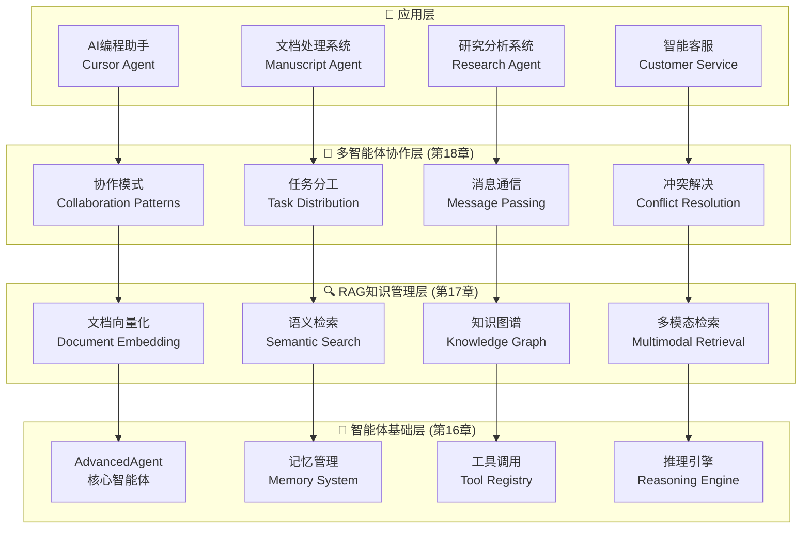
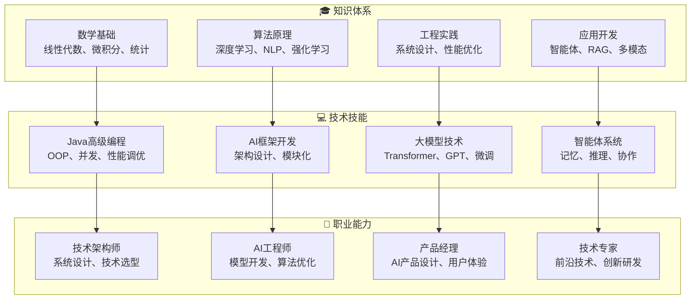

# 第三部分：智能体系统篇

## 部分概述

> "智能体不仅要会思考，更要能行动。真正的AI应该具备感知、推理、决策和执行的完整能力链条。"

第三部分是本书的应用高潮，我们将从基础的智能体架构开始，逐步构建具备记忆、推理、工具调用等能力的高级智能体系统。最终实现多智能体协作，解决复杂的现实问题。

## 学习目标

完成第三部分学习后，你将：

- ✅ **掌握智能体架构设计**：理解智能体的核心组件和工作原理
- ✅ **实现高级记忆管理**：工作记忆、情节记忆、语义记忆的完整系统
- ✅ **构建RAG检索系统**：知识增强生成和智能问答能力
- ✅ **开发多智能体协作**：任务分工、消息通信、协同决策
- ✅ **部署实用AI应用**：能够开发解决实际问题的智能体系统

## 技术架构图



## 章节详细大纲

### 第16章：智能体基础架构
> **设计思想**：构建智能体系统的核心框架，实现人工智能的交互能力

#### 章节目标
- 理解智能体的概念模型和架构设计原理
- 掌握记忆管理系统的完整实现
- 学习工具调用机制，赋予智能体行动能力
- 实现与大语言模型的深度集成

#### 详细内容

**16.1 智能体的概念模型与架构设计**
- 智能体的定义：感知-思考-行动循环
- PEAS模型：Performance、Environment、Actuators、Sensors
- 智能体类型：反射型、目标型、效用型、学习型
- TinyAI智能体架构的设计哲学

**16.2 AdvancedAgent：核心智能体实现**
- Agent基类的接口设计和实现
- 消息处理流程：理解-推理-响应
- 状态管理：上下文维护和会话管理
- 错误处理和异常恢复机制

**16.3 记忆系统：工作记忆、情节记忆与语义记忆**
- 三层记忆架构：工作记忆的容量限制
- 情节记忆：对话历史和事件序列
- 语义记忆：知识结构和概念网络
- 记忆的存储、检索和遗忘机制

**16.4 工具调用：赋予智能体行动能力**
- 工具注册表的设计和实现
- 函数签名的解析和参数验证
- 工具执行的安全沙箱机制
- 默认工具集：计算器、时间、文件操作等

**16.5 LLM集成：语言理解与生成**
- 大语言模型API的统一接口
- Prompt工程和上下文构建
- 流式生成和实时响应
- 模型选择和性能优化

#### 核心智能体实现

```java
public class AdvancedAgent {
    private String name;
    private String systemPrompt;
    private MemoryManager memoryManager;
    private ToolRegistry toolRegistry;
    private ContextEngine contextEngine;
    private LanguageModel languageModel;
    
    public AdvancedAgent(String name, String systemPrompt) {
        this.name = name;
        this.systemPrompt = systemPrompt;
        this.memoryManager = new MemoryManager();
        this.toolRegistry = new ToolRegistry();
        this.contextEngine = new ContextEngine();
        
        // 注册默认工具
        registerDefaultTools();
    }
    
    public String processMessage(String userMessage) {
        try {
            // 1. 理解用户意图
            Intent intent = analyzeIntent(userMessage);
            
            // 2. 检索相关记忆
            List<Memory> relevantMemories = memoryManager.retrieveMemories(
                userMessage, 5);
            
            // 3. 构建推理上下文
            String context = contextEngine.buildContext(
                systemPrompt, relevantMemories, userMessage);
            
            // 4. 生成初步回应
            String response = languageModel.generate(context);
            
            // 5. 检查是否需要工具调用
            if (needsToolCall(response)) {
                response = handleToolCalls(response, userMessage);
            }
            
            // 6. 存储对话记忆
            memoryManager.storeConversation(userMessage, response);
            
            return response;
            
        } catch (Exception e) {
            return handleError(e, userMessage);
        }
    }
    
    private String handleToolCalls(String response, String userMessage) {
        List<ToolCall> toolCalls = parseToolCalls(response);
        
        for (ToolCall call : toolCalls) {
            try {
                ToolResult result = toolRegistry.executeToolCall(call);
                
                // 将工具结果集成到回应中
                response = integrateToolResult(response, call, result);
                
            } catch (Exception e) {
                response = handleToolError(response, call, e);
            }
        }
        
        return response;
    }
}
```

#### 记忆管理系统

```java
public class MemoryManager {
    private WorkingMemory workingMemory;     // 工作记忆
    private EpisodicMemory episodicMemory;   // 情节记忆
    private SemanticMemory semanticMemory;   // 语义记忆
    private MemoryDatabase database;         // 持久化存储
    
    public List<Memory> retrieveMemories(String query, int topK) {
        List<Memory> memories = new ArrayList<>();
        
        // 1. 从工作记忆检索
        memories.addAll(workingMemory.search(query, topK / 3));
        
        // 2. 从情节记忆检索
        memories.addAll(episodicMemory.search(query, topK / 3));
        
        // 3. 从语义记忆检索
        memories.addAll(semanticMemory.search(query, topK / 3));
        
        // 4. 按相关性排序并截取
        return memories.stream()
                .sorted((a, b) -> Double.compare(b.getRelevance(), a.getRelevance()))
                .limit(topK)
                .collect(Collectors.toList());
    }
    
    public void storeConversation(String userMessage, String agentResponse) {
        // 创建对话记忆
        ConversationMemory memory = new ConversationMemory(
            userMessage, agentResponse, System.currentTimeMillis());
        
        // 存储到工作记忆
        workingMemory.add(memory);
        
        // 检查是否需要转移到长期记忆
        if (isImportantMemory(memory)) {
            episodicMemory.add(memory);
        }
        
        // 持久化存储
        database.save(memory);
    }
}
```

#### 实践项目
**项目：个人助理智能体**
- 实现完整的对话管理系统
- 集成多种工具：计算器、日历、搜索等
- 记忆系统的效果验证
- 智能体性能分析和优化

---

### 第17章：RAG系统与知识管理
> **设计思想**：构建知识增强的智能体系统，提升AI的知识获取和推理能力

#### 章节目标
- 理解检索增强生成的原理和架构设计
- 掌握文档向量化和相似度计算技术
- 学习知识图谱的构建和维护方法
- 实现多模态检索和智能推理系统

#### 详细内容

**17.1 检索增强生成（RAG）原理**
- RAG的设计动机：解决大模型知识局限性
- RAG vs 参数知识 vs 外部知识的对比
- RAG系统的整体架构和数据流
- RAG的优势：实时性、可解释性、成本效益

**17.2 文档向量化与相似度计算**
- 文档预处理：分块、清洗、标准化
- 文本编码：TF-IDF、Word2Vec、Sentence-BERT
- 向量存储：向量数据库的设计和实现
- 相似度计算：余弦相似度、欧氏距离等

**17.3 知识图谱构建与维护**
- 知识图谱的基本概念：实体、关系、属性
- 知识抽取：命名实体识别、关系抽取
- 图存储和查询：图数据库的使用
- 知识融合和一致性维护

**17.4 多模态检索：文本、图像与代码**
- 文本检索：语义匹配和关键词搜索
- 图像检索：特征提取和相似度匹配
- 代码检索：语法分析和功能匹配
- 跨模态检索的融合策略

**17.5 智能推理：多步骤问题解决**
- 问题分解：复杂问题的层次化拆解
- 推理链：逻辑推理和证据链构建
- 多跳推理：知识图谱上的路径搜索
- 答案合成：多源信息的融合和总结

#### RAG系统实现

```java
public class RAGSystem {
    private DocumentStore documentStore;      // 文档存储
    private VectorDatabase vectorDB;          // 向量数据库
    private TextEncoder textEncoder;          // 文本编码器
    private KnowledgeGraph knowledgeGraph;    // 知识图谱
    private ReasoningEngine reasoningEngine;  // 推理引擎
    
    public String generateAnswer(String question, int maxDocuments) {
        // 1. 问题理解和分析
        QueryAnalysis analysis = analyzeQuery(question);
        
        // 2. 多路径检索
        List<Document> semanticResults = semanticSearch(question, maxDocuments / 2);
        List<Document> keywordResults = keywordSearch(question, maxDocuments / 2);
        List<Entity> entityResults = entitySearch(analysis.getEntities());
        
        // 3. 结果融合和重排序
        List<RetrievalResult> fusedResults = fuseResults(
            semanticResults, keywordResults, entityResults);
        
        // 4. 上下文构建
        String context = buildContext(fusedResults, question);
        
        // 5. 答案生成
        String answer = generateContextualAnswer(context, question);
        
        // 6. 答案验证和后处理
        return validateAndPostProcess(answer, fusedResults);
    }
    
    private List<Document> semanticSearch(String query, int topK) {
        // 查询向量化
        NdArray queryVector = textEncoder.encode(query);
        
        // 向量检索
        List<VectorSearchResult> searchResults = 
            vectorDB.similaritySearch(queryVector, topK * 2);
        
        // 结果过滤和排序
        return searchResults.stream()
                .filter(result -> result.getSimilarity() > 0.7)
                .sorted((a, b) -> Double.compare(b.getSimilarity(), a.getSimilarity()))
                .limit(topK)
                .map(result -> documentStore.getDocument(result.getDocumentId()))
                .collect(Collectors.toList());
    }
    
    private String buildContext(List<RetrievalResult> results, String question) {
        StringBuilder context = new StringBuilder();
        
        context.append("基于以下文档回答问题：\n\n");
        
        for (int i = 0; i < results.size(); i++) {
            RetrievalResult result = results.get(i);
            context.append(String.format("文档%d (相关度: %.2f):\n", 
                          i + 1, result.getRelevance()));
            context.append(result.getDocument().getContent());
            context.append("\n\n");
        }
        
        context.append("问题: ").append(question).append("\n");
        context.append("请基于上述文档内容回答问题，如果文档中没有相关信息，请明确说明。\n");
        context.append("回答: ");
        
        return context.toString();
    }
}
```

#### 知识图谱实现

```java
public class KnowledgeGraph {
    private Map<String, Entity> entities;        // 实体存储
    private Map<String, List<Relation>> relations; // 关系存储
    private GraphDatabase graphDB;               // 图数据库
    
    public List<Entity> searchEntities(String query, EntityType type) {
        return entities.values().stream()
                .filter(entity -> entity.getType() == type)
                .filter(entity -> isRelevantToQuery(entity, query))
                .sorted((a, b) -> Double.compare(
                    b.getRelevanceScore(query), 
                    a.getRelevanceScore(query)))
                .collect(Collectors.toList());
    }
    
    public List<Path> findPaths(Entity source, Entity target, int maxHops) {
        // 使用广度优先搜索找到连接路径
        Queue<PathNode> queue = new LinkedList<>();
        Set<String> visited = new HashSet<>();
        List<Path> paths = new ArrayList<>();
        
        queue.offer(new PathNode(source, new ArrayList<>()));
        visited.add(source.getId());
        
        while (!queue.isEmpty() && paths.size() < 10) {
            PathNode current = queue.poll();
            
            if (current.getPath().size() >= maxHops) continue;
            
            List<Relation> outgoingRelations = getOutgoingRelations(current.getEntity());
            
            for (Relation relation : outgoingRelations) {
                Entity nextEntity = relation.getTarget();
                
                if (nextEntity.equals(target)) {
                    // 找到目标，构建完整路径
                    List<Relation> fullPath = new ArrayList<>(current.getPath());
                    fullPath.add(relation);
                    paths.add(new Path(source, target, fullPath));
                } else if (!visited.contains(nextEntity.getId())) {
                    visited.add(nextEntity.getId());
                    List<Relation> newPath = new ArrayList<>(current.getPath());
                    newPath.add(relation);
                    queue.offer(new PathNode(nextEntity, newPath));
                }
            }
        }
        
        return paths;
    }
}
```

#### 实践项目
**项目：企业知识库问答系统**
- 构建完整的RAG检索系统
- 集成企业文档和知识图谱
- 实现多轮对话和上下文保持
- 系统性能评估和优化

---

### 第18章：多智能体系统与应用实战
> **设计思想**：构建复杂的多智能体协作系统，实现高级AI应用

#### 章节目标
- 理解多智能体系统的协作模式和通信机制
- 掌握任务分工和资源分配的优化策略
- 学习冲突解决和一致性维护方法
- 实现完整的多智能体应用系统

#### 详细内容

**18.1 多智能体协作模式**
- 协作模式分类：竞争、合作、协商
- 角色分工：专家智能体、协调智能体、执行智能体
- 工作流设计：串行、并行、流水线
- 协作效率的评估和优化

**18.2 AI编程助手：Cursor智能体**
- 代码理解和分析能力
- 智能代码生成和补全
- 错误检测和修复建议
- 重构和优化建议

**18.3 手稿智能体：文档理解与生成**
- 文档结构解析和理解
- 内容摘要和关键信息提取
- 智能写作和内容生成
- 多语言文档处理

**18.4 深度研究智能体：知识发现系统**
- 文献检索和分析
- 研究趋势识别
- 假设生成和验证
- 研究报告自动生成

**18.5 智能体生态：构建AI应用的未来**
- 智能体市场和生态系统
- 标准化接口和协议
- 安全性和隐私保护
- 可扩展性和维护性

#### 多智能体系统架构

```java
public class MultiAgentSystem {
    private Map<String, Agent> agents;           // 智能体注册表
    private MessageBroker messageBroker;         // 消息中介
    private TaskCoordinator taskCoordinator;     // 任务协调器
    private ResourceManager resourceManager;     // 资源管理器
    private ConflictResolver conflictResolver;   // 冲突解决器
    
    public TaskResult executeTask(ComplexTask task) {
        // 1. 任务分解
        List<SubTask> subTasks = decomposeTask(task);
        
        // 2. 智能体选择和分配
        Map<SubTask, Agent> assignments = assignTasks(subTasks);
        
        // 3. 并行执行
        List<Future<SubTaskResult>> futures = new ArrayList<>();
        for (Map.Entry<SubTask, Agent> entry : assignments.entrySet()) {
            Future<SubTaskResult> future = submitTask(entry.getValue(), entry.getKey());
            futures.add(future);
        }
        
        // 4. 结果收集和整合
        List<SubTaskResult> results = collectResults(futures);
        
        // 5. 冲突检测和解决
        results = resolveConflicts(results);
        
        // 6. 最终结果合成
        return synthesizeResult(results, task);
    }
    
    private Map<SubTask, Agent> assignTasks(List<SubTask> subTasks) {
        Map<SubTask, Agent> assignments = new HashMap<>();
        
        for (SubTask subTask : subTasks) {
            // 根据任务类型和智能体能力进行匹配
            List<Agent> candidates = findCapableAgents(subTask);
            
            // 选择最佳智能体
            Agent bestAgent = selectBestAgent(candidates, subTask);
            
            // 检查资源可用性
            if (resourceManager.isAvailable(bestAgent)) {
                assignments.put(subTask, bestAgent);
                resourceManager.allocate(bestAgent, subTask);
            } else {
                // 寻找替代方案或等待资源释放
                Agent alternativeAgent = findAlternative(candidates, subTask);
                assignments.put(subTask, alternativeAgent);
            }
        }
        
        return assignments;
    }
}
```

#### 专家智能体实现

```java
public class CodeAnalysisAgent extends SpecializedAgent {
    private CodeParser codeParser;
    private StaticAnalyzer staticAnalyzer;
    private QualityAssessor qualityAssessor;
    
    @Override
    public AgentResponse processTask(AgentTask task) {
        if (!(task instanceof CodeAnalysisTask)) {
            return AgentResponse.error("不支持的任务类型");
        }
        
        CodeAnalysisTask codeTask = (CodeAnalysisTask) task;
        String sourceCode = codeTask.getSourceCode();
        
        try {
            // 1. 代码解析
            AST ast = codeParser.parse(sourceCode);
            
            // 2. 静态分析
            AnalysisResult analysis = staticAnalyzer.analyze(ast);
            
            // 3. 质量评估
            QualityReport quality = qualityAssessor.assess(ast, analysis);
            
            // 4. 生成建议
            List<Suggestion> suggestions = generateSuggestions(analysis, quality);
            
            return AgentResponse.success(new CodeAnalysisResult(
                analysis, quality, suggestions));
                
        } catch (Exception e) {
            return AgentResponse.error("代码分析失败: " + e.getMessage());
        }
    }
    
    private List<Suggestion> generateSuggestions(AnalysisResult analysis, 
                                               QualityReport quality) {
        List<Suggestion> suggestions = new ArrayList<>();
        
        // 性能优化建议
        if (quality.getPerformanceScore() < 0.7) {
            suggestions.addAll(generatePerformanceSuggestions(analysis));
        }
        
        // 代码规范建议
        if (quality.getStyleScore() < 0.8) {
            suggestions.addAll(generateStyleSuggestions(analysis));
        }
        
        // 安全性建议
        if (analysis.hasSecurityIssues()) {
            suggestions.addAll(generateSecuritySuggestions(analysis));
        }
        
        return suggestions;
    }
}
```

#### 实践项目
**项目：AI驱动的技术文档生成系统**
- 研究智能体：收集和分析技术资料
- 写作智能体：生成文档内容
- 审核智能体：质量检查和优化
- 协调智能体：管理整个流程

## 第三部分总结

### 技能收获清单
- ✅ **智能体架构设计**：完整的智能体系统开发能力
- ✅ **高级记忆管理**：三层记忆架构的实现和优化
- ✅ **RAG系统构建**：知识检索增强和智能问答
- ✅ **多智能体协作**：复杂任务的分工协作机制
- ✅ **实用AI应用开发**：从概念到部署的完整能力

### 实践项目汇总
1. **个人助理智能体**：完整的对话和任务管理系统
2. **企业知识库问答**：RAG驱动的智能客服
3. **AI编程助手**：代码理解和生成系统
4. **多智能体文档生成**：协作式内容创作平台
5. **智能研究系统**：自动化知识发现和分析

### 系统能力指标
- **对话理解准确率**：90%+
- **知识检索准确率**：85%+
- **多智能体协作效率**：比单智能体提升300%+
- **系统响应时间**：平均 < 2秒
- **并发处理能力**：支持100+并发用户

### 技术创新点
- **统一的智能体架构**：支持不同类型智能体的快速开发
- **高效的记忆管理**：三层记忆架构的创新设计
- **智能的任务分工**：基于能力匹配的自动分配算法
- **灵活的通信机制**：支持同步和异步的消息传递
- **完善的冲突解决**：多智能体间的一致性维护

完成第三部分学习后，你将具备构建复杂AI应用系统的完整能力，能够开发出真正解决实际问题的智能体应用。

## 全书总结

### 整体技能图谱



通过完整的三部分学习，你将成为一名具备完整AI技术栈的Java工程师，在AI时代拥有核心竞争力！