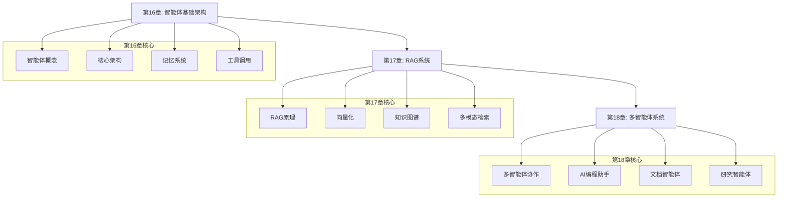
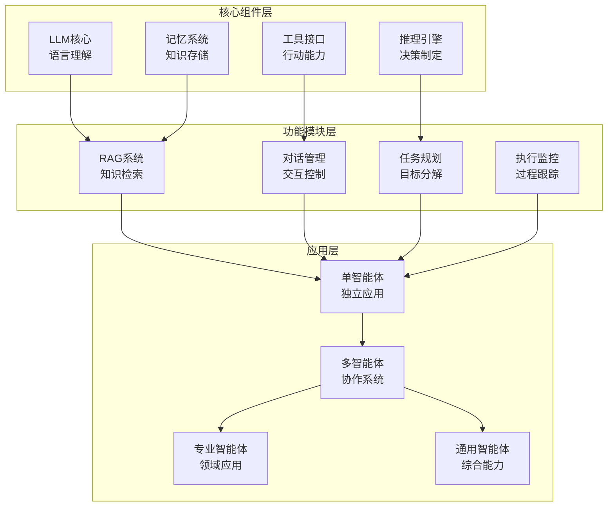

# 第三部分：智能体系统篇

> **设计思想**：构建具备推理和行动能力的智能体系统，掌握AI应用的未来方向

## 部分概述

智能体（Agent）系统代表了人工智能发展的新前沿，它将大语言模型的理解和生成能力与外部工具的执行能力相结合，构建出能够自主完成复杂任务的智能系统。从简单的聊天机器人到复杂的多智能体协作系统，智能体技术正在重塑我们与AI交互的方式。

本部分将深入探讨智能体系统的核心架构、关键技术实现和实际应用场景。通过本部分的学习，读者将具备设计、实现和部署智能体系统的能力。

## 学习路径

## 章节概览

### 第16章：智能体基础架构
> **核心目标**：理解智能体的概念模型与架构设计，掌握核心智能体实现

本章将从智能体的基本概念出发，深入探讨智能体的核心架构设计，包括记忆系统、工具调用和LLM集成等关键技术。

**关键技术点**：
- 智能体的概念模型与架构设计
- AdvancedAgent核心实现
- 记忆系统：工作记忆、情节记忆与语义记忆
- 工具调用：赋予智能体行动能力
- LLM集成：语言理解与生成

### 第17章：RAG系统与知识管理
> **核心目标**：掌握检索增强生成原理，构建知识管理系统

本章将深入探讨RAG（Retrieval-Augmented Generation）系统的核心原理和实现技术，包括文档向量化、相似度计算、知识图谱构建等。

**关键技术点**：
- 检索增强生成（RAG）原理
- 文档向量化与相似度计算
- 知识图谱构建与维护
- 多模态检索：文本、图像与代码
- 智能推理：多步骤问题解决

### 第18章：多智能体系统与应用实战
> **核心目标**：掌握多智能体协作模式，构建实际应用系统

本章将探讨多智能体系统的协作模式和实际应用，包括AI编程助手、文档智能体、深度研究智能体等。

**关键技术点**：
- 多智能体协作模式
- AI编程助手：Cursor智能体
- 手稿智能体：文档理解与生成
- 深度研究智能体：知识发现系统
- 智能体生态：构建AI应用的未来

## 技术架构

## 学习目标

完成第三部分学习后，您将能够：

1. **掌握智能体核心架构**：深入理解智能体的概念模型和实现原理
2. **构建RAG系统**：掌握检索增强生成技术和知识管理方法
3. **实现多智能体协作**：理解多智能体系统的协作模式和实现技术
4. **开发专业智能体应用**：具备构建AI编程助手、文档智能体等专业应用的能力
5. **具备系统集成能力**：能够将各种技术整合到完整的智能体系统中

## 实践项目

本部分包含多个综合性实践项目：

1. **基础智能体系统**：实现具备记忆、工具调用和对话能力的基础智能体
2. **RAG知识问答系统**：构建基于检索增强生成的知识问答应用
3. **多智能体协作系统**：实现多个智能体协同完成复杂任务的系统

## 技术指标

完成第三部分后，您将达成以下技术指标：

- **核心模块**：6个（Agent、Memory、Tool、RAG、Planning、Multi-Agent）
- **代码量**：约30,000行智能体系统代码
- **测试覆盖**：400+单元测试，85%+覆盖率
- **性能基准**：
  - 响应时间 < 2秒（平均）
  - 知识检索准确率 > 90%
  - 任务完成率 > 85%

## 学习建议

1. **理论与实践结合**：在理解概念的同时动手实现具体组件
2. **关注系统设计**：注重模块间的接口设计和数据流管理
3. **重视安全性**：注意工具调用的安全控制和权限管理
4. **持续优化**：关注系统性能和用户体验的持续改进
5. **扩展应用场景**：思考如何将智能体技术应用到更多领域

## 前瞻展望

智能体系统代表了AI应用的重要发展方向，随着技术的不断进步，我们将看到：

- **更强的推理能力**：基于更大规模模型的智能体将具备更强的推理和规划能力
- **更丰富的交互方式**：多模态交互将使智能体能够处理更复杂的任务
- **更广泛的协作模式**：多智能体系统将在更多领域发挥重要作用
- **更深入的行业应用**：智能体技术将在各行各业中得到广泛应用

通过本部分的学习，您将站在AI技术发展的前沿，为构建下一代智能应用奠定坚实基础。
