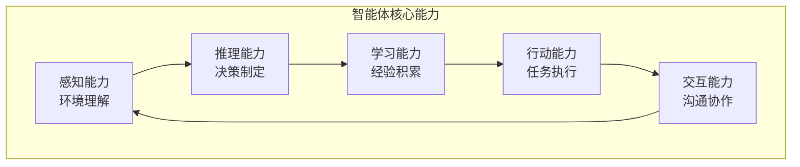
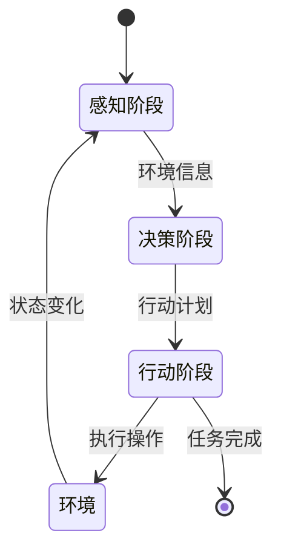

# 16.1 智能体的概念模型与架构设计

> **设计思想**：从基础概念出发，建立对智能体系统的全面理解

## 本节概述

智能体（Agent）是人工智能领域的一个核心概念，它代表了一个能够自主感知环境、进行决策并采取行动的实体。在大语言模型时代，智能体系统将LLM的强大语言处理能力与外部工具的执行能力相结合，构建出能够自主完成复杂任务的智能系统。

本节将从智能体的基本概念出发，深入探讨智能体的核心特征、分类方法和架构设计原则，为后续的实现工作奠定理论基础。

## 学习目标

完成本节学习后，你将：

- ✅ **理解智能体的基本概念**：掌握智能体的定义、特征和核心能力
- ✅ **掌握智能体的分类方法**：理解不同类型智能体的特点和应用场景
- ✅ **理解智能体架构设计原则**：掌握智能体系统的核心组件和设计模式
- ✅ **掌握感知-决策-行动循环**：理解智能体的基本工作流程
- ✅ **具备智能体系统分析能力**：能够分析和设计智能体系统架构

## 智能体的基本概念

### 智能体的定义

智能体是一个能够感知环境、进行决策并采取行动的计算实体。根据Russell和Norvig在《人工智能：一种现代的方法》中的定义，智能体是一个通过传感器感知环境并通过执行器作用于环境的实体。

在现代AI系统中，智能体通常具备以下特征：

1. **自主性**：能够在没有人类直接干预的情况下运行
2. **反应性**：能够及时响应环境变化
3. **主动性**：能够主动采取行动以实现目标
4. **社会性**：能够与其他智能体或人类进行交互

### 智能体的核心能力

智能体的核心能力可以类比为人类的认知系统,它包含五个相互关联的维度。这些能力不是孤立存在的,而是形成一个闭环系统,每个环节的输出都会成为下一个环节的输入,从而实现持续的感知-决策-行动循环。



#### 感知能力:智能体的输入层

感知能力是智能体获取环境信息的基础,相当于人类的五感系统。在AI智能体中,感知能力主要包括:

- **语言理解**:处理自然语言输入,理解用户意图和上下文含义
- **视觉感知**:处理图像和视频信息,识别物体、场景和动作
- **听觉感知**:处理语音和声音信息,进行语音识别和情感分析
- **环境感知**:通过API、传感器等获取系统状态和环境参数

**设计要点**:良好的感知能力需要支持多模态输入,能够处理噪声和不完整信息,并具备一定的容错能力

#### 推理能力:智能体的大脑

推理能力是智能体的核心,它使智能体能够基于感知到的信息进行分析和决策。推理能力的强弱直接决定了智能体的智能水平。

推理能力包含四个层次:
- **逻辑推理**:基于规则和逻辑进行演绎推理,适用于明确定义的问题域
- **概率推理**:处理不确定性和概率信息,在信息不完整时做出最优判断
- **类比推理**:基于相似性进行推断,将已知领域的知识迁移到新领域
- **因果推理**:理解因果关系链条,预测行动的后果和影响

#### 学习能力:智能体的进化引擎

学习能力使智能体能够从经验中不断改进,这是AI系统区别于传统软件的关键特征。学习能力可以分为:

- **监督学习**:从带标签的数据中学习输入-输出映射关系
- **无监督学习**:从未标注数据中发现隐藏的模式和结构
- **强化学习**:通过与环境交互,从奖励信号中学习最优策略
- **元学习**:学习如何更快更好地学习,提升学习效率

**技术要点**:现代智能体通常采用在线学习和离线学习相结合的方式,既能快速适应新场景,又能保持整体性能稳定。

#### 行动能力:智能体的执行器

行动能力将智能体的决策转化为实际的操作和影响。这是智能体产生价值的关键环节。

- **工具使用**:调用各种外部工具和API,如搜索引擎、数据库、计算服务等
- **物理行动**:控制机器人或其他物理设备,在真实世界中产生影响
- **数字行动**:执行计算机操作,如文件操作、网络请求、程序调用等
- **通信行动**:向用户或其他系统发送消息和指令

#### 交互能力:智能体的社交接口

交互能力使智能体能够与人类和其他智能体有效协作,这对于构建实用的AI系统至关重要。

- **自然语言交互**:通过对话与人类自然沟通,理解意图并清晰表达
- **多智能体协作**:与其他智能体协调分工,共同完成复杂任务
- **人机协作**:理解人类的工作习惯,提供恰当的辅助和建议
- **社会规范遵循**:遵循礼貌、隐私等社会规范,避免不当行为

## 智能体的分类方法

### 按智能水平分类

智能体可以根据其智能水平和架构复杂度分为四个等级,从简单到复杂,每个等级都在前一等级的基础上增加了新的能力。

#### 1. 简单反射智能体：条件-动作模式

这是最基础的智能体类型,基于 **if-then** 规则直接将感知映射到行动,不维护内部状态。这种智能体在环境完全可观察且规则明确的场景中非常有效。

**优点**:
- 简单高效,响应速度快
- 行为可预测,易于调试
- 资源占用少

**局限**:
- 无法处理部分可观察环境
- 不能学习和适应
- 适用场景有限

**应用场景**:扫地机器人、自动回复系统、简单规则引擎。

#### 2. 基于模型的反射智能体：状态跟踪模式

在简单反射智能体的基础上,增加了**内部状态跟踪**能力。智能体维护一个世界模型,通过结合当前感知和历史信息来推断世界状态。

**核心概念**:
- **世界模型**:对环境状态的内部表示
- **状态更新**:根据新信息更新模型
- **状态依赖决策**:基于当前状态选择行动

**应用场景**:导航系统、游戏AI、资源管理系统。

#### 3. 基于目标的智能体：目标导向模式

在状态跟踪的基础上,增加了**目标设定和规划**能力。智能体不仅知道当前状态,还能设定目标并规划达成目标的行动序列。

**技术要点**:
- **目标表示**:明确期望达到的状态
- **搜索算法**:在状态空间中搜索最优路径
- **计划生成**:制定从当前状态到目标状态的行动序列
- **计划重新评估**:当环境变化时动态调整计划

**应用场景**:路径规划、任务调度、机器人动作规划。

#### 4. 基于效用的智能体：最优决策模式

这是最高级的智能体类型,在多个可选目标或行动中,选择能够**最大化预期效用**的方案。效用函数量化了智能体的偏好和价值观。

**核心组件**:
- **效用函数**:将状态映射到实数值,表示“好”的程度
- **决策理论**:利用期望效用最大化原则选择行动
- **风险管理**:处理不确定性和风险平衡

**应用场景**:自动驾驶、金融交易、医疗诊断、资源优化配置。

### 按应用领域分类

根据不同的应用场景和功能侧重,智能体可以分为三种主要类型:

#### 1. 对话智能体

对话智能体专注于**自然语言交互**,其核心是通过对话的方式为用户提供服务。

**核心特征**:
- 完全依赖语言理解和生成
- 保持对话上下文和连贯性
- 支持多轮交互和澄清机制

**应用示例**:客服机器人、虚拟助手、智能问答系统。

#### 2. 任务智能体

任务智能体专注于**完成特定任务**,强调执行能力和结果交付。

**核心特征**:
- 任务规划和分解能力强
- 工具调用和执行是核心
- 需要外部系统集成能力

**应用示例**:自动化测试工具、代码生成助手、数据分析智能体。

#### 3. 混合智能体

混合智能体结合了对话和任务的能力,是当前最主流的智能体形态。

**核心特征**:
- 同时具备交互和执行能力
- 可以通过对话控制任务执行
- 需要更复杂的架构设计

**应用示例**:ChatGPT、Claude、全能型个人助手。


## 智能体架构设计原则

设计一个健壮、可扩展的智能体系统需要遵循一些核心设计原则。这些原则源自软件工程的最佳实践,但需要根据智能体系统的特点进行调整。

### 1. 模块化设计原则

模块化是应对复杂性的有效手段。将智能体系统分解为多个功能模块,每个模块专注于一个明确的职责。

**核心要点**:
- **高内聚**:模块内部的组件紧密相关,共同完成一个职责
- **低耦合**:模块之间的依赖关系尽量简单,减少相互影响
- **单一职责**:每个模块只负责一个明确的功能领域

**实践建议**:
- 感知模块:负责所有的输入处理和理解
- 推理模块:负责决策和规划
- 记忆模块:统一管理所有的状态和信息存储
- 执行模块:负责所有的对外操作和工具调用

### 2. 松耦合设计原则

松耦合使系统更加灵活,易于扩展和维护。模块之间通过标准接口和事件机制进行通信。

**关键技术**:
- **接口与实现分离**:定义清晰的接口约定,实现可替换
- **依赖注入**:通过配置来管理依赖关系
- **事件驱动**:使用事件总线实现异步通信

**设计模式**:
- **观察者模式**:用于组件间的状态通知
- **策略模式**:用于算法的动态切换
- **工厂模式**:用于对象的创建和管理

### 3. 可扩展性设计原则

系统应该支持功能扩展和组件替换,无需修改核心架构。

**扩展点设计**:
- 工具注册机制:允许动态添加新工具
- 模型适配器:支持多种 LLM 接入
- 插件系统:允许第三方扩展

**开放-封闭原则**:
- 对扩展开放:可以添加新功能
- 对修改封闭:不需修改现有代码

## 感知-决策-行动循环

感知-决策-行动循环(Sense-Decide-Act Cycle)是智能体系统的核心工作模式,源自控制论和人工智能的基础理论。这个循环描述了智能体与环境交互的基本过程。

### 循环原理

智能体通过不断重复"感知→决策→行动"的过程来适应环境并完成任务。这个循环具有以下特点:

1. **持续性**:循环不断运行,直到任务完成或系统终止
2. **反馈性**:行动的结果会影响下一次感知,形成闭环反馈
3. **适应性**:通过学习机制,智能体可以优化决策过程
4. **实时性**:需要在合理的时间内完成一个循环

### 循环的三个阶段



#### 1. 感知阶段(Sense)

在感知阶段,智能体从环境中获取信息:
- **数据采集**:通过传感器或API获取原始数据
- **数据预处理**:清洗、归一化、特征提取
- **状态更新**:更新内部世界模型的状态表示

#### 2. 决策阶段(Decide)

基于感知到的信息,智能体进行推理和决策:
- **情境分析**:理解当前状态和上下文
- **目标评估**:确定当前最重要的目标
- **方案生成**:产生可能的行动方案
- **方案评估**:评估每个方案的预期效果
- **决策选择**:选择最优方案

#### 3. 行动阶段(Act)

执行选定的行动并观察结果:
- **行动执行**:调用工具或控制执行器
- **结果监控**:观察行动的实际效果
- **经验记录**:记录行动和结果用于学习

### 循环的高级特性

#### 异步处理

在复杂系统中,三个阶段可以异步执行:
- **并行感知**:多个传感器同时工作
- **后台推理**:在行动执行时进行下一步规划
- **异步执行**:多个行动并行执行

#### 多层循环

实际的智能体系统往往包含多个嵌套的循环:
- **战略层循环**:长期目标规划(小时/天级别)
- **战术层循环**:中期任务执行(分钟级别)
- **反应层循环**:即时响应(秒/毫秒级别)

### 实现要点

一个基本的循环实现框架:

```java
public class AgentCycle {
    private PerceptionModule perception;
    private ReasoningModule reasoning;
    private ActionModule action;
    
    public void runCycle() {
        while (shouldContinue()) {
            // 1. 感知环境
            Percept percept = perception.sense();
            
            // 2. 推理决策
            Action decision = reasoning.decide(percept);
            
            // 3. 执行行动
            ActionResult result = action.execute(decision);
            
            // 4. 学习改进
            learnFromResult(percept, decision, result);
        }
    }
}
```

**设计建议**:
- 控制每个循环的执行时间,避免阻塞
- 实现graceful shutdown机制
- 添加异常处理和恢复逻辑
- 记录详细的执行日志用于调试


## 智能体系统分析方法

设计一个智能体系统需要系统化的分析方法。我们可以从多个维度来分析和规划智能体系统。

### 系统分析维度

#### 1. 功能性分析

明确智能体需要完成的任务和提供的能力:

**问题清单**:
- 智能体的主要任务是什么?
- 需要处理哪些类型的输入?
- 期望产生什么样的输出?
- 有哪些关键的功能需求?
- 成功的标准是什么?

#### 2. 环境特征分析

理解智能体运行的环境特点:

| 环境特征 | 说明 | 对设计的影响 |
|---------|------|-------------|
| 可观察性 | 环境状态能否完全感知 | 决定是否需要状态估计 |
| 确定性 | 行动结果是否确定 | 影响决策算法选择 |
| 连续性 | 时间和状态是否连续 | 影响感知和行动的频率 |
| 动态性 | 环境是否会自主变化 | 决定响应速度要求 |
| 单/多智能体 | 是否有其他智能体 | 影响协作机制设计 |

#### 3. 非功能性需求分析

考虑系统的质量属性:
- **性能要求**:响应时间、吞吐量、并发能力
- **可靠性要求**:容错能力、恢复机制、数据一致性
- **安全性要求**:访问控制、数据加密、审计日志
- **可维护性**:代码质量、文档完整性、测试覆盖率
- **可扩展性**:支持的用户规模、功能扩展能力

#### 4. 约束条件分析

识别设计和实现的限制:
- **技术约束**:可用的技术栈、LLM模型限制
- **资源约束**:计算资源、存储空间、网络带宽
- **时间约束**:项目周期、上线时间
- **成本约束**:开发成本、运营成本

### 设计模式的应用

在智能体系统中,几个关键的设计模式特别有用:

#### 观察者模式(Observer Pattern)

**应用场景**:组件间的状态同步和事件通知

**价值**:
- 降低组件间的耦合度
- 支持一对多的依赖关系
- 便于添加新的观察者

**示例**:状态变更通知
```java
public interface StateObserver {
    void onStateChange(AgentState newState);
}

public class Agent {
    private List<StateObserver> observers = new ArrayList<>();
    
    public void addObserver(StateObserver observer) {
        observers.add(observer);
    }
    
    private void notifyStateChange(AgentState newState) {
        observers.forEach(obs -> obs.onStateChange(newState));
    }
}
```

#### 策略模式(Strategy Pattern)

**应用场景**:算法的动态选择和切换

**价值**:
- 将算法的定义与使用分离
- 支持运行时切换策略
- 便于添加新策略

**示例**:规划算法切换
```java
public interface PlanningStrategy {
    ActionPlan plan(Task task, Context context);
}

public class Planner {
    private PlanningStrategy strategy;
    
    public void setStrategy(PlanningStrategy strategy) {
        this.strategy = strategy;
    }
    
    public ActionPlan plan(Task task, Context context) {
        return strategy.plan(task, context);
    }
}
```

### 架构评估方法

评估智能体架构设计的质量:

1. **模块性评估**:各模块职责是否单一清晰?
2. **可测试性评估**:能否方便地进行单元测试和集成测试?
3. **性能评估**:是否满足响应时间和吞吐量要求?
4. **扩展性评估**:添加新功能是否需要大量修改?
5. **维护性评估**:代码是否易于理解和修改?


## 本节小结

本节从基础概念出发，全面介绍了智能体系统的核心要素：

1. **智能体的基本概念**：理解了智能体的定义、特征和核心能力
2. **智能体的分类方法**：掌握了不同类型智能体的特点和应用场景
3. **架构设计原则**：学习了模块化、松耦合和可扩展性等设计原则
4. **感知-决策-行动循环**：理解了智能体的基本工作流程
5. **系统分析方法**：具备了分析和设计智能体系统的能力

通过本节的学习，我们建立了对智能体系统的全面认识，为后续章节中具体的实现工作奠定了坚实的理论基础。

在下一节中，我们将开始实现AdvancedAgent核心，掌握智能体核心功能的具体实现方法。