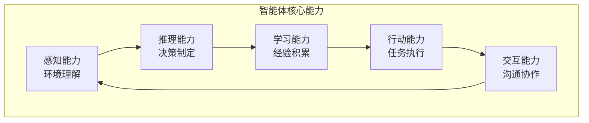
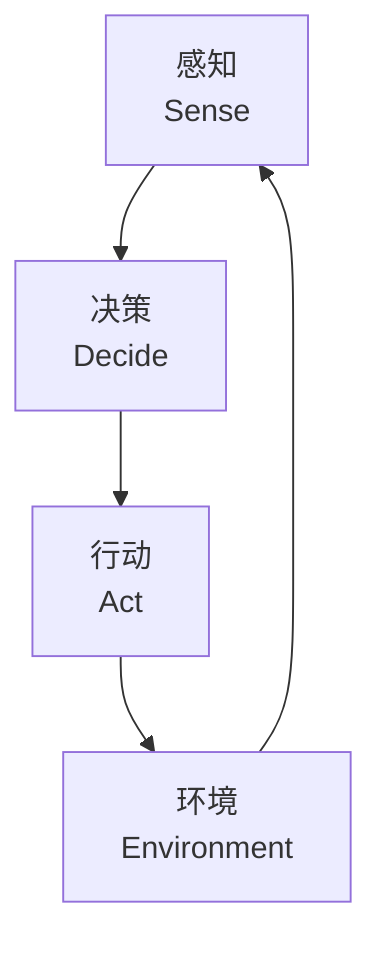

# 16.1 智能体的概念模型与架构设计

> **设计思想**：从基础概念出发，建立对智能体系统的全面理解

## 本节概述

智能体（Agent）是人工智能领域的一个核心概念，它代表了一个能够自主感知环境、进行决策并采取行动的实体。在大语言模型时代，智能体系统将LLM的强大语言处理能力与外部工具的执行能力相结合，构建出能够自主完成复杂任务的智能系统。

本节将从智能体的基本概念出发，深入探讨智能体的核心特征、分类方法和架构设计原则，为后续的实现工作奠定理论基础。

## 学习目标

完成本节学习后，你将：

- ✅ **理解智能体的基本概念**：掌握智能体的定义、特征和核心能力
- ✅ **掌握智能体的分类方法**：理解不同类型智能体的特点和应用场景
- ✅ **理解智能体架构设计原则**：掌握智能体系统的核心组件和设计模式
- ✅ **掌握感知-决策-行动循环**：理解智能体的基本工作流程
- ✅ **具备智能体系统分析能力**：能够分析和设计智能体系统架构

## 智能体的基本概念

### 智能体的定义

智能体是一个能够感知环境、进行决策并采取行动的计算实体。根据Russell和Norvig在《人工智能：一种现代的方法》中的定义，智能体是一个通过传感器感知环境并通过执行器作用于环境的实体。

在现代AI系统中，智能体通常具备以下特征：

1. **自主性**：能够在没有人类直接干预的情况下运行
2. **反应性**：能够及时响应环境变化
3. **主动性**：能够主动采取行动以实现目标
4. **社会性**：能够与其他智能体或人类进行交互

### 智能体的核心能力



#### 感知能力

感知能力是智能体获取环境信息的基础，包括：
- **语言理解**：处理自然语言输入，理解用户意图
- **视觉感知**：处理图像和视频信息
- **听觉感知**：处理语音和声音信息
- **环境感知**：通过传感器获取物理环境信息

#### 推理能力

推理能力使智能体能够基于已有信息进行逻辑推断：
- **逻辑推理**：基于规则和逻辑进行推断
- **概率推理**：处理不确定性和概率信息
- **类比推理**：基于相似性进行推断
- **因果推理**：理解因果关系和影响

#### 学习能力

学习能力使智能体能够从经验中改进性能：
- **监督学习**：从标注数据中学习
- **无监督学习**：从未标注数据中发现模式
- **强化学习**：通过试错学习最优策略
- **元学习**：学习如何学习

#### 行动能力

行动能力使智能体能够执行具体任务：
- **工具使用**：调用外部工具和API
- **物理行动**：控制机器人或其他物理设备
- **数字行动**：执行计算机操作
- **通信行动**：与其他实体进行信息交换

#### 交互能力

交互能力使智能体能够与环境中的其他实体协作：
- **自然语言交互**：与人类进行自然对话
- **多智能体协作**：与其他智能体协同工作
- **人机协作**：与人类用户协作完成任务
- **社会规范遵循**：遵循社会规则和礼仪

## 智能体的分类方法

### 按智能水平分类

#### 简单反射智能体

简单反射智能体基于当前感知状态直接选择行动，不维护内部状态：

```java
public class SimpleReflexAgent {
    private Map<Percept, Action> rules;
    
    public SimpleReflexAgent() {
        this.rules = new HashMap<>();
        initializeRules();
    }
    
    public Action selectAction(Percept percept) {
        return rules.getOrDefault(percept, Action.DEFAULT);
    }
    
    private void initializeRules() {
        // 定义简单的if-then规则
        rules.put(new Percept("dirty"), Action.CLEAN);
        rules.put(new Percept("clean"), Action.MOVE);
    }
}
```

#### 基于模型的反射智能体

基于模型的反射智能体维护内部状态来跟踪世界状态：

```java
public class ModelBasedReflexAgent {
    private WorldModel worldModel;
    private Map<State, Action> rules;
    
    public ModelBasedReflexAgent() {
        this.worldModel = new WorldModel();
        this.rules = new HashMap<>();
        initializeRules();
    }
    
    public Action selectAction(Percept percept) {
        // 更新世界模型
        worldModel.update(percept);
        
        // 基于当前状态选择行动
        State currentState = worldModel.getCurrentState();
        return rules.getOrDefault(currentState, Action.DEFAULT);
    }
}
```

#### 基于目标的智能体

基于目标的智能体除了当前状态外，还考虑目标状态：

```java
public class GoalBasedAgent {
    private WorldModel worldModel;
    private Goal goal;
    private Planner planner;
    
    public GoalBasedAgent(Goal goal) {
        this.worldModel = new WorldModel();
        this.goal = goal;
        this.planner = new Planner();
    }
    
    public Action selectAction(Percept percept) {
        // 更新世界模型
        worldModel.update(percept);
        
        // 如果已达到目标，返回空行动
        if (worldModel.isGoalAchieved(goal)) {
            return Action.NO_OP;
        }
        
        // 规划行动序列
        List<Action> plan = planner.plan(worldModel, goal);
        
        // 执行计划中的第一个行动
        return plan.isEmpty() ? Action.NO_OP : plan.get(0);
    }
}
```

#### 基于效用的智能体

基于效用的智能体选择能够最大化预期效用的行动：

```java
public class UtilityBasedAgent {
    private WorldModel worldModel;
    private UtilityFunction utilityFunction;
    private ActionSelector actionSelector;
    
    public UtilityBasedAgent(UtilityFunction utilityFunction) {
        this.worldModel = new WorldModel();
        this.utilityFunction = utilityFunction;
        this.actionSelector = new ActionSelector();
    }
    
    public Action selectAction(Percept percept) {
        // 更新世界模型
        worldModel.update(percept);
        
        // 计算各行动的预期效用
        List<Action> possibleActions = getPossibleActions();
        Action bestAction = actionSelector.selectBestAction(
            possibleActions, worldModel, utilityFunction
        );
        
        return bestAction;
    }
}
```

### 按应用领域分类

#### 对话智能体

对话智能体专注于自然语言交互：

```java
public class DialogueAgent {
    private LanguageModel languageModel;
    private DialogueManager dialogueManager;
    private ContextManager contextManager;
    
    public DialogueAgent(LanguageModel languageModel) {
        this.languageModel = languageModel;
        this.dialogueManager = new DialogueManager();
        this.contextManager = new ContextManager();
    }
    
    public String respond(String userInput) {
        // 更新对话上下文
        contextManager.updateContext(userInput);
        
        // 生成响应
        String prompt = buildPrompt(userInput);
        String response = languageModel.generate(prompt);
        
        // 管理对话状态
        dialogueManager.updateState(userInput, response);
        
        return response;
    }
}
```

#### 任务智能体

任务智能体专注于完成特定任务：

```java
public class TaskAgent {
    private TaskPlanner taskPlanner;
    private ToolExecutor toolExecutor;
    private KnowledgeBase knowledgeBase;
    
    public TaskAgent() {
        this.taskPlanner = new TaskPlanner();
        this.toolExecutor = new ToolExecutor();
        this.knowledgeBase = new KnowledgeBase();
    }
    
    public TaskResult executeTask(String taskDescription) {
        // 解析任务
        Task task = parseTask(taskDescription);
        
        // 规划执行步骤
        List<TaskStep> plan = taskPlanner.plan(task);
        
        // 执行计划
        TaskResult result = executePlan(plan);
        
        return result;
    }
}
```

#### 混合智能体

混合智能体结合多种能力：

```java
public class HybridAgent {
    private LanguageModel languageModel;
    private ToolManager toolManager;
    private MemorySystem memorySystem;
    private ReasoningEngine reasoningEngine;
    
    public HybridAgent() {
        this.languageModel = new LanguageModel();
        this.toolManager = new ToolManager();
        this.memorySystem = new MemorySystem();
        this.reasoningEngine = new ReasoningEngine();
    }
    
    public AgentResponse processRequest(AgentRequest request) {
        // 语言理解
        Intent intent = languageModel.understand(request.getInput());
        
        // 上下文检索
        Context context = memorySystem.retrieveContext(request.getSessionId());
        
        // 推理决策
        ActionPlan plan = reasoningEngine.reason(intent, context);
        
        // 工具执行
        ExecutionResult result = toolManager.execute(plan);
        
        // 响应生成
        String response = languageModel.generateResponse(result, context);
        
        // 上下文更新
        memorySystem.updateContext(request.getSessionId(), request.getInput(), response);
        
        return new AgentResponse(response, result);
    }
}
```

## 智能体架构设计原则

### 模块化设计

智能体系统应该采用模块化设计，各组件职责明确：

```java
public abstract class AgentComponent {
    protected String componentName;
    protected AgentContext context;
    
    public AgentComponent(String componentName) {
        this.componentName = componentName;
    }
    
    public abstract void initialize(AgentContext context);
    public abstract void process(AgentInput input);
    public abstract AgentOutput generateOutput();
}

public class PerceptionComponent extends AgentComponent {
    private SensorManager sensorManager;
    private Preprocessor preprocessor;
    
    public PerceptionComponent() {
        super("Perception");
    }
    
    @Override
    public void process(AgentInput input) {
        // 感知处理逻辑
        Percept percept = sensorManager.sense(input);
        Percept processedPercept = preprocessor.preprocess(percept);
        context.updatePercept(processedPercept);
    }
}

public class ReasoningComponent extends AgentComponent {
    private KnowledgeBase knowledgeBase;
    private InferenceEngine inferenceEngine;
    
    public ReasoningComponent() {
        super("Reasoning");
    }
    
    @Override
    public void process(AgentInput input) {
        // 推理处理逻辑
        Knowledge knowledge = knowledgeBase.retrieve(input);
        Decision decision = inferenceEngine.infer(knowledge, context.getPercepts());
        context.updateDecision(decision);
    }
}
```

### 松耦合设计

组件之间应该保持松耦合，通过标准接口进行交互：

```java
public interface AgentComponent {
    String getName();
    void initialize(AgentContext context);
    void process(Event event);
    List<Event> getOutputEvents();
}

public class EventBus {
    private Map<String, List<AgentComponent>> subscribers;
    
    public void subscribe(String eventType, AgentComponent component) {
        subscribers.computeIfAbsent(eventType, k -> new ArrayList<>()).add(component);
    }
    
    public void publish(Event event) {
        List<AgentComponent> subscribers = this.subscribers.get(event.getType());
        if (subscribers != null) {
            for (AgentComponent component : subscribers) {
                component.process(event);
            }
        }
    }
}
```

### 可扩展性设计

架构应该支持功能扩展和组件替换：

```java
public class ExtensibleAgent {
    private List<AgentModule> modules;
    private ModuleManager moduleManager;
    
    public void addModule(AgentModule module) {
        modules.add(module);
        moduleManager.registerModule(module);
    }
    
    public void removeModule(String moduleName) {
        modules.removeIf(module -> module.getName().equals(moduleName));
        moduleManager.unregisterModule(moduleName);
    }
}
```

## 感知-决策-行动循环

### 基本循环结构

智能体的基本工作流程遵循感知-决策-行动循环：



### 详细实现

```java
public class AgentCycle {
    private PerceptionModule perception;
    private ReasoningModule reasoning;
    private ActionModule action;
    private Environment environment;
    
    public void runCycle() {
        while (shouldContinue()) {
            // 1. 感知阶段
            Percept percept = perception.sense(environment);
            
            // 2. 决策阶段
            Action actionPlan = reasoning.decide(percept);
            
            // 3. 行动阶段
            ActionResult result = action.execute(actionPlan, environment);
            
            // 4. 学习和适应
            learnFromResult(percept, actionPlan, result);
            
            // 5. 等待下一个周期
            waitForNextCycle();
        }
    }
    
    private void learnFromResult(Percept percept, Action action, ActionResult result) {
        // 基于结果更新内部模型
        perception.updateModel(percept, result);
        reasoning.updateKnowledge(action, result);
        action.updateStrategy(result);
    }
}
```

### 异步处理模式

对于复杂系统，可以采用异步处理模式：

```java
public class AsyncAgent {
    private ExecutorService executor;
    private BlockingQueue<Percept> perceptQueue;
    private BlockingQueue<Action> actionQueue;
    
    public AsyncAgent() {
        this.executor = Executors.newFixedThreadPool(4);
        this.perceptQueue = new LinkedBlockingQueue<>();
        this.actionQueue = new LinkedBlockingQueue<>();
    }
    
    public void start() {
        // 启动感知线程
        executor.submit(this::perceptionLoop);
        
        // 启动决策线程
        executor.submit(this::reasoningLoop);
        
        // 启动行动线程
        executor.submit(this::actionLoop);
    }
    
    private void perceptionLoop() {
        while (running) {
            try {
                Percept percept = perceptQueue.take();
                processPerception(percept);
            } catch (InterruptedException e) {
                Thread.currentThread().interrupt();
                break;
            }
        }
    }
}
```

## 智能体系统分析方法

### 系统架构分析

分析智能体系统时需要考虑以下维度：

1. **功能性需求**：系统需要完成哪些任务
2. **非功能性需求**：性能、可靠性、安全性等要求
3. **环境特征**：系统运行的环境特点
4. **约束条件**：技术、资源、时间等限制

### 设计模式应用

在智能体系统设计中常用的模式：

#### 观察者模式

用于组件间的状态通知：

```java
public interface Observer {
    void update(Observable observable, Object arg);
}

public class AgentState implements Observable {
    private List<Observer> observers = new ArrayList<>();
    
    public void addObserver(Observer observer) {
        observers.add(observer);
    }
    
    public void setState(AgentState newState) {
        // 更新状态
        notifyObservers(newState);
    }
    
    private void notifyObservers(Object arg) {
        for (Observer observer : observers) {
            observer.update(this, arg);
        }
    }
}
```

#### 策略模式

用于算法的动态切换：

```java
public interface PlanningStrategy {
    ActionPlan plan(Task task, Context context);
}

public class AgentPlanner {
    private PlanningStrategy strategy;
    
    public void setStrategy(PlanningStrategy strategy) {
        this.strategy = strategy;
    }
    
    public ActionPlan plan(Task task, Context context) {
        return strategy.plan(task, context);
    }
}
```

## 本节小结

本节从基础概念出发，全面介绍了智能体系统的核心要素：

1. **智能体的基本概念**：理解了智能体的定义、特征和核心能力
2. **智能体的分类方法**：掌握了不同类型智能体的特点和应用场景
3. **架构设计原则**：学习了模块化、松耦合和可扩展性等设计原则
4. **感知-决策-行动循环**：理解了智能体的基本工作流程
5. **系统分析方法**：具备了分析和设计智能体系统的能力

通过本节的学习，我们建立了对智能体系统的全面认识，为后续章节中具体的实现工作奠定了坚实的理论基础。

在下一节中，我们将开始实现AdvancedAgent核心，掌握智能体核心功能的具体实现方法。