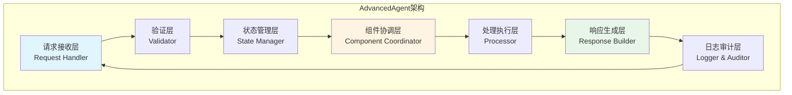
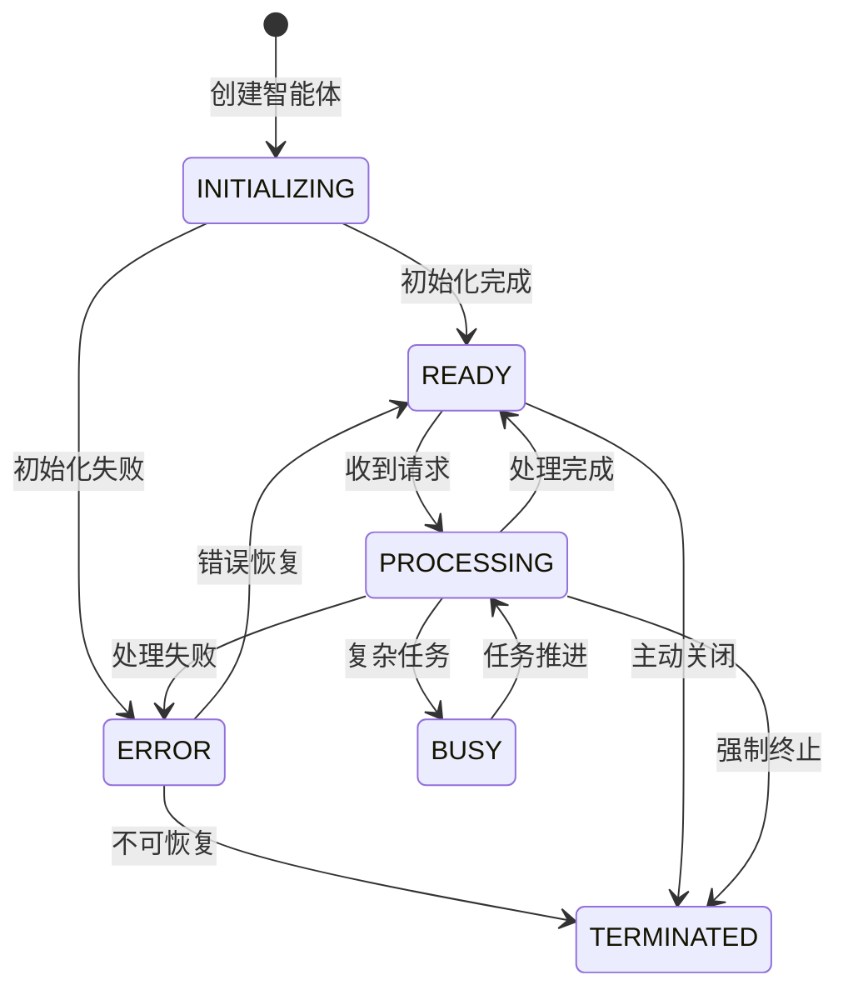

# 16.2 AdvancedAgent：核心智能体实现

> **设计思想**：实现一个功能完整、可扩展的智能体核心框架

## 本节概述

在上一节中，我们学习了智能体的基本概念和架构设计原则。本节将基于这些理论知识，实现一个功能完整的AdvancedAgent核心框架。该框架将包含智能体的基本组件、状态管理、生命周期控制等核心功能，为后续的高级功能实现奠定基础。

## 学习目标

完成本节学习后，你将：

- ✅ **掌握智能体核心类设计**：理解Agent类的基本结构和设计模式
- ✅ **实现状态管理机制**：掌握智能体状态的管理和更新方法
- ✅ **掌握生命周期控制**：理解智能体的初始化、运行和终止过程
- ✅ **实现输入处理机制**：学会处理各种类型的输入数据
- ✅ **掌握输出生成方法**：理解智能体响应的生成和格式化
- ✅ **具备错误处理能力**：掌握异常处理和错误恢复机制

## AdvancedAgent核心类设计

### 设计理念

AdvancedAgent采用**模板方法模式**和**组件化架构**,将智能体的核心流程标准化,同时保持高度的可扩展性。这种设计使得:

1. **流程标准化**:所有智能体遵循统一的请求处理流程
2. **职责清晰**:每个组件专注于特定的功能领域
3. **易于扩展**:可以通过添加组件来扩展功能
4. **便于测试**:各组件可以独立测试

### 架构层次



### 核心类结构

#### 基础框架

AdvancedAgent定义了智能体的基本结构和标准处理流程:

```java
public abstract class AdvancedAgent {
    protected String agentId;           // 智能体唯一标识
    protected String name;              // 智能体名称
    protected AgentState currentState;  // 当前状态
    protected AgentContext context;     // 执行上下文
    protected List<AgentComponent> components;  // 组件列表
    protected EventBus eventBus;        // 事件总线
    protected Logger logger;            // 日志记录器
    
    // 抽象方法:子类实现具体的处理逻辑
    public abstract AgentResponse processRequest(AgentRequest request);
    
    // 模板方法:定义标准的请求处理流程
    public final AgentResponse handleRequest(AgentRequest request) {
        try {
            validateRequest(request);              // 1. 验证
            updateState(AgentState.PROCESSING);    // 2. 状态更新
            AgentResponse response = processRequest(request);  // 3. 处理
            logRequestResponse(request, response); // 4. 日志
            updateState(AgentState.READY);         // 5. 恢复状态
            return response;
        } catch (Exception e) {
            handleError(e, request);               // 错误处理
            return createErrorResponse(e);
        }
    }
    
    // ... 其他辅助方法
}
```

### Agent状态管理

#### 状态模型设计

智能体的状态管理采用**有限状态机(FSM)**模型,明确定义了各种状态及其转换规则。这种设计确保了:
- **状态可追踪**:每次状态变化都有记录
- **行为可预测**:状态转换遵循明确的规则
- **异常可恢复**:错误状态可以被识别和处理



#### 状态定义

```java
public enum AgentState {
    INITIALIZING("初始化"),   // 启动阶段,加载组件
    READY("就绪"),           // 空闲状态,等待请求
    PROCESSING("处理中"),    // 正在处理单个请求
    BUSY("忙碌"),           // 处理复杂任务或多个请求
    ERROR("错误"),          // 发生错误,等待恢复
    TERMINATED("终止");     // 已关闭,不再接受请求
    
    private final String description;
    
    AgentState(String description) {
        this.description = description;
    }
    
    public String getDescription() { return description; }
}
```

#### 执行上下文管理

AgentContext维护智能体的运行时状态和交互历史,支持:
- **属性存储**:临时数据和配置信息
- **历史追踪**:记录交互历史用于上下文理解
- **性能监控**:追踪运行时间和活跃度

**核心功能**:
```java
public class AgentContext {
    private Map<String, Object> attributes;              // 属性存储
    private List<Interaction> interactionHistory;       // 交互历史
    private long startTime;                             // 启动时间
    private long lastActivityTime;                      // 最后活动时间
    
    // 属性管理
    public void setAttribute(String key, Object value) { /* ... */ }
    public <T> T getAttribute(String key, Class<T> type) { /* ... */ }
    
    // 历史管理
    public void addInteraction(Interaction interaction) { /* ... */ }
    public List<Interaction> getRecentInteractions(int count) { /* ... */ }
    
    // 性能指标
    public long getUptime() { /* ... */ }
    public long getIdleTime() { /* ... */ }
}
```

**设计要点**:
- 使用ConcurrentHashMap确保线程安全
- 限制历史记录数量防止内存溢出
- 提供清理机制释放过期数据


### 请求和响应模型

#### 数据模型设计原则

智能体的输入输出采用**统一的数据模型**,支持多种内容类型和元数据扩展:

**设计目标**:
1. **类型安全**:使用强类型枚举区分不同的请求/响应类型
2. **可追溯性**:每个请求都有唯一ID和时间戳
3. **可扩展性**:通过metadata支持自定义字段
4. **会话管理**:通过sessionId关联多轮对话

#### 请求模型

```java
public class AgentRequest {
    private String requestId;           // 请求唯一ID
    private String sessionId;           // 会话ID(多轮对话)
    private String input;               // 主要输入内容
    private Map<String, Object> metadata;  // 扩展元数据
    private long timestamp;             // 请求时间戳
    private RequestType type;           // 请求类型
    
    public AgentRequest(String input) {
        this.requestId = UUID.randomUUID().toString();
        this.input = input;
        this.timestamp = System.currentTimeMillis();
        this.metadata = new HashMap<>();
        this.type = RequestType.TEXT;
    }
    
    // 主要方法
    public void addMetadata(String key, Object value) { /* ... */ }
    // ... getters/setters
}
```

**支持的请求类型**:
```java
public enum RequestType {
    TEXT,     // 文本输入(最常用)
    VOICE,    // 语音输入
    IMAGE,    // 图像输入
    VIDEO,    // 视频输入
    FILE      // 文件输入
}
```

#### 响应模型

```java
public class AgentResponse {
    private String output;                  // 主要输出内容
    private ResponseType type;              // 响应类型
    private long timestamp;                 // 响应时间戳
    private Map<String, Object> metadata;   // 扩展元数据
    private List<ToolCall> toolCalls;       // 工具调用列表
    
    // 构造器支持快速创建
    public AgentResponse(String output) {
        this(output, ResponseType.TEXT, System.currentTimeMillis());
    }
    
    // 支持工具调用的响应
    public void addToolCall(ToolCall toolCall) { /* ... */ }
    // ... 其他方法
}
```

**支持的响应类型**:
```java
public enum ResponseType {
    TEXT,       // 文本响应
    VOICE,      // 语音响应
    IMAGE,      // 图像响应
    JSON,       // 结构化数据
    TOOL_CALL,  // 工具调用请求
    ERROR       // 错误响应
}
```

#### 元数据扩展示例

```java
// 请求中添加用户信息
request.addMetadata("userId", "user123");
request.addMetadata("language", "zh-CN");
request.addMetadata("priority", "high");

// 响应中添加性能指标
response.addMetadata("processingTime", 1250L);
response.addMetadata("modelUsed", "gpt-4");
response.addMetadata("tokensUsed", 350);
```

## 核心组件实现

### 组件管理器

```java
public abstract class AgentComponent {
    protected String componentName;
    protected boolean enabled;
    protected AgentContext context;
    protected EventBus eventBus;
    
    public AgentComponent(String componentName) {
        this.componentName = componentName;
        this.enabled = true;
    }
    
    public abstract void initialize(AgentContext context, EventBus eventBus);
    public abstract void process(AgentRequest request, AgentResponse response);
    public abstract void cleanup();
    
    public String getComponentName() {
        return componentName;
    }
    
    public boolean isEnabled() {
        return enabled;
    }
    
    public void setEnabled(boolean enabled) {
        this.enabled = enabled;
    }
    
    protected void publishEvent(Event event) {
        if (eventBus != null) {
            eventBus.publish(event);
        }
    }
}

public class ComponentManager {
    private List<AgentComponent> components;
    private Map<String, AgentComponent> componentMap;
    
    public ComponentManager() {
        this.components = new ArrayList<>();
        this.componentMap = new HashMap<>();
    }
    
    public void registerComponent(AgentComponent component) {
        components.add(component);
        componentMap.put(component.getComponentName(), component);
    }
    
    public void unregisterComponent(String componentName) {
        AgentComponent component = componentMap.remove(componentName);
        if (component != null) {
            components.remove(component);
            component.cleanup();
        }
    }
    
    public <T extends AgentComponent> T getComponent(String name, Class<T> type) {
        AgentComponent component = componentMap.get(name);
        if (component != null && type.isInstance(component)) {
            return type.cast(component);
        }
        return null;
    }
    
    public void initializeComponents(AgentContext context, EventBus eventBus) {
        for (AgentComponent component : components) {
            try {
                component.initialize(context, eventBus);
            } catch (Exception e) {
                // 记录初始化错误，但不中断其他组件初始化
                LoggerFactory.getLogger(ComponentManager.class)
                    .error("Failed to initialize component: " + component.getComponentName(), e);
            }
        }
    }
    
    public void processComponents(AgentRequest request, AgentResponse response) {
        for (AgentComponent component : components) {
            if (component.isEnabled()) {
                try {
                    component.process(request, response);
                } catch (Exception e) {
                    // 记录处理错误，但继续处理其他组件
                    LoggerFactory.getLogger(ComponentManager.class)
                        .error("Component " + component.getComponentName() + " failed to process request", e);
                }
            }
        }
    }
}
```

### 事件总线

```java
public class EventBus {
    private Map<String, List<EventListener>> listeners;
    private ExecutorService executorService;
    
    public EventBus() {
        this.listeners = new ConcurrentHashMap<>();
        this.executorService = Executors.newCachedThreadPool();
    }
    
    public void subscribe(String eventType, EventListener listener) {
        listeners.computeIfAbsent(eventType, k -> new CopyOnWriteArrayList<>()).add(listener);
    }
    
    public void unsubscribe(String eventType, EventListener listener) {
        List<EventListener> eventListeners = listeners.get(eventType);
        if (eventListeners != null) {
            eventListeners.remove(listener);
        }
    }
    
    public void publish(Event event) {
        publish(event, false);
    }
    
    public void publishAsync(Event event) {
        publish(event, true);
    }
    
    private void publish(Event event, boolean async) {
        List<EventListener> eventListeners = listeners.get(event.getType());
        if (eventListeners != null) {
            for (EventListener listener : eventListeners) {
                if (async) {
                    executorService.submit(() -> notifyListener(listener, event));
                } else {
                    notifyListener(listener, event);
                }
            }
        }
    }
    
    private void notifyListener(EventListener listener, Event event) {
        try {
            listener.onEvent(event);
        } catch (Exception e) {
            // 记录监听器错误，但不中断其他监听器
            LoggerFactory.getLogger(EventBus.class)
                .error("Event listener failed to handle event: " + event.getType(), e);
        }
    }
}

public interface EventListener {
    void onEvent(Event event);
}

public abstract class Event {
    protected String type;
    protected long timestamp;
    protected Object source;
    
    public Event(String type, Object source) {
        this.type = type;
        this.timestamp = System.currentTimeMillis();
        this.source = source;
    }
    
    public String getType() { return type; }
    public long getTimestamp() { return timestamp; }
    public Object getSource() { return source; }
}

public class StateChangeEvent extends Event {
    private AgentState oldState;
    private AgentState newState;
    
    public StateChangeEvent(Object source, AgentState oldState, AgentState newState) {
        super("STATE_CHANGE", source);
        this.oldState = oldState;
        this.newState = newState;
    }
    
    public AgentState getOldState() { return oldState; }
    public AgentState getNewState() { return newState; }
}
```

## 完整的AdvancedAgent实现

### 实现思路

一个完整的AdvancedAgent实现需要整合所有核心组件,并提供统一的对外接口。实现时需要考虑:

1. **初始化顺序**:确保组件按正确的顺序初始化
2. **错误处理**:实现健壮的异常处理机制
3. **资源管理**:正确管理线程池、连接等资源
4. **生命周期**:提供完整的启动和关闭机制

### 核心实现框架

```java
public class AdvancedAgentImpl extends AdvancedAgent {
    private ComponentManager componentManager;
    private Configuration configuration;
    private HealthMonitor healthMonitor;
    
    @Override
    public AgentResponse processRequest(AgentRequest request) {
        AgentResponse response = new AgentResponse("");
        context.addInteraction(new Interaction(request, response));
        componentManager.processComponents(request, response);
        return response;
    }
    
    // 组件管理、健康检查、关闭等方法...
}
```

### 使用示例

```java
// 创建配置
Configuration config = new Configuration();
config.setProperty("model.name", "gpt-3.5-turbo");
config.setProperty("max.tokens", 1000);

// 创建智能体
AdvancedAgent agent = new AdvancedAgentImpl("agent-001", "MyAgent", config);

// 添加组件
agent.addComponent(new LanguageProcessingComponent());
agent.addComponent(new ToolExecutionComponent());

// 处理请求
AgentRequest request = new AgentRequest("Hello, how are you?");
AgentResponse response = agent.handleRequest(request);

// 检查健康状态
AgentHealth health = agent.getHealthStatus();

// 关闭智能体
agent.shutdown();
```

## 本节小结
本节我们实现了一个功能完整的AdvancedAgent核心框架,主要包括:

### 核心成果

1. **基础架构设计**
   - 采用模板方法模式定义标准处理流程
   - 实现了分层的架构设计(接收、验证、状态、协调、响应)
   - 提供了可扩展的抽象基类

2. **状态管理系统**
   - 设计了有限状态机模型
   - 实现了完整的状态转换机制
   - 提供了执行上下文管理

3. **请求响应模型**
   - 定义了统一的数据结构
   - 支持多种输入输出类型
   - 提供了元数据扩展能力

4. **组件化系统**
   - 实现了组件的注册和管理机制
   - 构建了事件总线通信机制
   - 支持组件的动态加载和卸载

5. **健康监控机制**
   - 实现了定期健康检查
   - 提供了多维度的监控指标
   - 支持自定义健康检查项

### 设计亮点

- **健壮性**:完善的错误处理和恢复机制
- **灵活性**:通过组件化设计实现高度可配置
- **可维护性**:清晰的代码结构和封装
- **可观测性**:丰富的日志和健康检查

### 关键技术点

| 技术点 | 作用 | 价值 |
|---------|------|------|
| 模板方法模式 | 标准化处理流程 | 确保一致性 |
| 状态机模型 | 管理状态转换 | 提高可预测性 |
| 组件化架构 | 功能模块化 | 增强可扩展性 |
| 事件驱动 | 组件间通信 | 降低耦合度 |
| 健康监控 | 系统可观测性 | 便于运维管理 |

通过本节的实现,我们建立了一个坚实的基础框架,为后续章节中记忆系统、工具调用、LLM集成等高级功能的实现做好了准备。

在下一节中,我们将学习记忆系统的设计与实现,掌握工作记忆、情节记忆和语义记忆的构建方法。