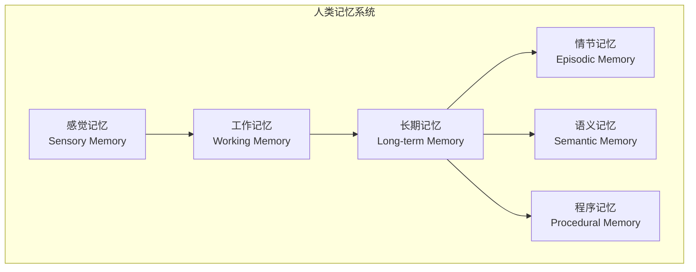

# 16.3 记忆系统：工作记忆、情节记忆与语义记忆

> **设计思想**：构建完整的记忆管理系统，实现智能体的长期学习和上下文理解能力

## 本节概述

记忆是智能体系统的核心组件之一，它使智能体能够存储和检索信息，从而实现上下文理解、经验学习和知识积累。在认知科学中，人类记忆系统通常被分为工作记忆、情节记忆和语义记忆三种类型。本节将借鉴这一理论框架，设计并实现一个完整的智能体记忆系统。

## 学习目标

完成本节学习后，你将：

- ✅ **理解记忆系统的理论基础**：掌握工作记忆、情节记忆和语义记忆的概念和特点
- ✅ **掌握工作记忆的实现**：学会实现短期信息存储和处理机制
- ✅ **实现情节记忆系统**：掌握历史交互记录的管理和检索
- ✅ **构建语义记忆系统**：理解知识和概念的存储与应用
- ✅ **掌握记忆检索和更新机制**：学会高效的记忆管理和优化策略
- ✅ **具备记忆系统集成能力**：能够将记忆系统集成到智能体框架中

## 记忆系统的理论基础

### 认知科学中的记忆分类



#### 工作记忆（Working Memory）

工作记忆是短期记忆系统，用于临时存储和处理当前任务所需的信息。它的特点是：
- **容量有限**：通常只能同时处理5-9个信息单元
- **持续时间短**：信息保持时间通常为几秒到几分钟
- **处理功能强**：能够对信息进行操作和转换

#### 情节记忆（Episodic Memory）

情节记忆存储个人经历和事件的记忆，具有时间、地点和情境特征。它的特点是：
- **自传体性质**：存储个人的特定经历
- **时间序列性**：按时间顺序组织记忆
- **情境依赖性**：与特定情境相关联

#### 语义记忆（Semantic Memory）

语义记忆存储关于世界的一般知识和概念，包括事实、概念和规则。它的特点是：
- **抽象性**：存储抽象的知识和概念
- **稳定性**：相对稳定，不易遗忘
- **共享性**：可以被多人共享的知识

## 工作记忆实现

### 设计原理

工作记忆在智能体中主要用于存储当前对话或任务的上下文信息：

```java
public class WorkingMemory {
    private final int capacity;
    private final Deque<MemoryItem> items;
    private final Map<String, MemoryItem> itemMap;
    private final long ttl; // Time to live in milliseconds
    
    public WorkingMemory(int capacity, long ttl) {
        this.capacity = capacity;
        this.items = new LinkedList<>();
        this.itemMap = new HashMap<>();
        this.ttl = ttl;
    }
    
    public void add(String key, Object value) {
        long timestamp = System.currentTimeMillis();
        MemoryItem item = new MemoryItem(key, value, timestamp);
        
        // 如果已存在，更新值和时间戳
        if (itemMap.containsKey(key)) {
            items.remove(itemMap.get(key));
        } else if (items.size() >= capacity) {
            // 如果达到容量限制，移除最老的项
            MemoryItem oldest = items.pollFirst();
            if (oldest != null) {
                itemMap.remove(oldest.getKey());
            }
        }
        
        items.offerLast(item);
        itemMap.put(key, item);
    }
    
    public <T> T get(String key, Class<T> type) {
        MemoryItem item = itemMap.get(key);
        if (item != null) {
            // 检查是否过期
            if (System.currentTimeMillis() - item.getTimestamp() > ttl) {
                remove(key);
                return null;
            }
            if (type.isInstance(item.getValue())) {
                return type.cast(item.getValue());
            }
        }
        return null;
    }
    
    public void remove(String key) {
        MemoryItem item = itemMap.remove(key);
        if (item != null) {
            items.remove(item);
        }
    }
    
    public List<MemoryItem> getAllItems() {
        // 过滤过期项
        long currentTime = System.currentTimeMillis();
        return items.stream()
            .filter(item -> currentTime - item.getTimestamp() <= ttl)
            .collect(Collectors.toList());
    }
    
    public void clear() {
        items.clear();
        itemMap.clear();
    }
    
    public int size() {
        return items.size();
    }
}

class MemoryItem {
    private final String key;
    private final Object value;
    private final long timestamp;
    
    public MemoryItem(String key, Object value, long timestamp) {
        this.key = key;
        this.value = value;
        this.timestamp = timestamp;
    }
    
    // Getters
    public String getKey() { return key; }
    public Object getValue() { return value; }
    public long getTimestamp() { return timestamp; }
}
```

### 上下文管理

```java
public class ContextManager {
    private WorkingMemory workingMemory;
    private int maxContextLength;
    
    public ContextManager(int capacity, long ttl, int maxContextLength) {
        this.workingMemory = new WorkingMemory(capacity, ttl);
        this.maxContextLength = maxContextLength;
    }
    
    public void updateContext(String userInput, String agentResponse) {
        // 更新对话历史
        List<Interaction> history = workingMemory.get("dialogue_history", List.class);
        if (history == null) {
            history = new ArrayList<>();
        }
        
        Interaction interaction = new Interaction(userInput, agentResponse, System.currentTimeMillis());
        history.add(interaction);
        
        // 限制历史长度
        if (history.size() > maxContextLength) {
            history = history.subList(history.size() - maxContextLength, history.size());
        }
        
        workingMemory.add("dialogue_history", history);
        
        // 更新最近的用户输入
        workingMemory.add("last_user_input", userInput);
        
        // 更新最近的代理响应
        workingMemory.add("last_agent_response", agentResponse);
    }
    
    public String buildContextPrompt() {
        List<Interaction> history = workingMemory.get("dialogue_history", List.class);
        if (history == null || history.isEmpty()) {
            return "";
        }
        
        StringBuilder prompt = new StringBuilder();
        prompt.append("Previous conversation:\n");
        
        for (Interaction interaction : history) {
            prompt.append("User: ").append(interaction.getUserInput()).append("\n");
            prompt.append("Agent: ").append(interaction.getAgentResponse()).append("\n");
        }
        
        prompt.append("\nCurrent context:\n");
        return prompt.toString();
    }
    
    public String getLastUserInput() {
        return workingMemory.get("last_user_input", String.class);
    }
    
    public String getLastAgentResponse() {
        return workingMemory.get("last_agent_response", String.class);
    }
}
```

## 情节记忆系统

### 设计原理

情节记忆用于存储智能体的历史交互记录，支持基于时间、内容和情境的检索：

```java
public class EpisodicMemory {
    private final StorageBackend storage;
    private final EmbeddingModel embeddingModel;
    private final int maxRetrievedEpisodes;
    
    public EpisodicMemory(StorageBackend storage, EmbeddingModel embeddingModel, 
                         int maxRetrievedEpisodes) {
        this.storage = storage;
        this.embeddingModel = embeddingModel;
        this.maxRetrievedEpisodes = maxRetrievedEpisodes;
    }
    
    public void storeEpisode(Episode episode) {
        // 生成内容嵌入
        float[] embedding = embeddingModel.encode(episode.getContent());
        episode.setEmbedding(embedding);
        
        // 存储到后端
        storage.save(episode.getId(), episode);
    }
    
    public List<Episode> retrieveEpisodes(String query, int limit) {
        // 生成查询嵌入
        float[] queryEmbedding = embeddingModel.encode(query);
        
        // 从存储中检索相似的事件
        List<Episode> candidates = storage.searchSimilar(queryEmbedding, limit * 2);
        
        // 重新排序并返回最相关的事件
        return rerankEpisodes(candidates, queryEmbedding, limit);
    }
    
    public List<Episode> retrieveRecentEpisodes(long startTime, long endTime) {
        return storage.searchByTimeRange(startTime, endTime);
    }
    
    private List<Episode> rerankEpisodes(List<Episode> candidates, 
                                       float[] queryEmbedding, int limit) {
        // 基于余弦相似度重新排序
        candidates.sort((e1, e2) -> {
            double sim1 = cosineSimilarity(queryEmbedding, e1.getEmbedding());
            double sim2 = cosineSimilarity(queryEmbedding, e2.getEmbedding());
            return Double.compare(sim2, sim1); // 降序排列
        });
        
        return candidates.subList(0, Math.min(limit, candidates.size()));
    }
    
    private double cosineSimilarity(float[] a, float[] b) {
        double dotProduct = 0.0;
        double normA = 0.0;
        double normB = 0.0;
        
        for (int i = 0; i < a.length; i++) {
            dotProduct += a[i] * b[i];
            normA += a[i] * a[i];
            normB += b[i] * b[i];
        }
        
        return dotProduct / (Math.sqrt(normA) * Math.sqrt(normB));
    }
}

public class Episode {
    private String id;
    private String content;
    private Map<String, Object> metadata;
    private float[] embedding;
    private long timestamp;
    private String sessionId;
    private List<String> tags;
    
    public Episode(String content) {
        this.id = UUID.randomUUID().toString();
        this.content = content;
        this.metadata = new HashMap<>();
        this.timestamp = System.currentTimeMillis();
        this.tags = new ArrayList<>();
    }
    
    // Getters and setters
    public String getId() { return id; }
    public String getContent() { return content; }
    public void setContent(String content) { this.content = content; }
    public Map<String, Object> getMetadata() { return metadata; }
    public float[] getEmbedding() { return embedding; }
    public void setEmbedding(float[] embedding) { this.embedding = embedding; }
    public long getTimestamp() { return timestamp; }
    public void setTimestamp(long timestamp) { this.timestamp = timestamp; }
    public String getSessionId() { return sessionId; }
    public void setSessionId(String sessionId) { this.sessionId = sessionId; }
    public List<String> getTags() { return tags; }
    public void addTag(String tag) { this.tags.add(tag); }
}
```

### 存储后端实现

```java
public interface StorageBackend {
    void save(String key, Object value);
    <T> T load(String key, Class<T> type);
    void delete(String key);
    List<Object> searchSimilar(float[] embedding, int limit);
    List<Object> searchByTimeRange(long startTime, long endTime);
    List<Object> searchByTags(List<String> tags);
}

public class InMemoryStorage implements StorageBackend {
    private final Map<String, Object> storage;
    private final List<IndexedEpisode> index;
    private final ReadWriteLock lock;
    
    public InMemoryStorage() {
        this.storage = new ConcurrentHashMap<>();
        this.index = new ArrayList<>();
        this.lock = new ReentrantReadWriteLock();
    }
    
    @Override
    public void save(String key, Object value) {
        lock.writeLock().lock();
        try {
            storage.put(key, value);
            
            if (value instanceof Episode) {
                Episode episode = (Episode) value;
                index.add(new IndexedEpisode(key, episode.getEmbedding(), 
                                           episode.getTimestamp(), episode.getTags()));
            }
        } finally {
            lock.writeLock().unlock();
        }
    }
    
    @Override
    public <T> T load(String key, Class<T> type) {
        lock.readLock().lock();
        try {
            Object value = storage.get(key);
            if (value != null && type.isInstance(value)) {
                return type.cast(value);
            }
            return null;
        } finally {
            lock.readLock().unlock();
        }
    }
    
    @Override
    public List<Object> searchSimilar(float[] embedding, int limit) {
        lock.readLock().lock();
        try {
            // 计算相似度并排序
            List<IndexedEpisode> similarities = new ArrayList<>();
            for (IndexedEpisode indexed : index) {
                double similarity = cosineSimilarity(embedding, indexed.getEmbedding());
                similarities.add(new IndexedEpisode(indexed.getKey(), similarity));
            }
            
            similarities.sort((a, b) -> Double.compare(b.getSimilarity(), a.getSimilarity()));
            
            // 返回最相似的项
            List<Object> results = new ArrayList<>();
            for (int i = 0; i < Math.min(limit, similarities.size()); i++) {
                String key = similarities.get(i).getKey();
                results.add(storage.get(key));
            }
            
            return results;
        } finally {
            lock.readLock().unlock();
        }
    }
    
    private double cosineSimilarity(float[] a, float[] b) {
        // 实现余弦相似度计算
        // ... 与前面相同
        return 0.0;
    }
}

class IndexedEpisode {
    private String key;
    private float[] embedding;
    private long timestamp;
    private List<String> tags;
    private double similarity;
    
    public IndexedEpisode(String key, float[] embedding, long timestamp, List<String> tags) {
        this.key = key;
        this.embedding = embedding;
        this.timestamp = timestamp;
        this.tags = tags;
    }
    
    public IndexedEpisode(String key, double similarity) {
        this.key = key;
        this.similarity = similarity;
    }
    
    // Getters
    public String getKey() { return key; }
    public float[] getEmbedding() { return embedding; }
    public long getTimestamp() { return timestamp; }
    public List<String> getTags() { return tags; }
    public double getSimilarity() { return similarity; }
}
```

## 语义记忆系统

### 设计原理

语义记忆存储关于世界的通用知识和概念，支持知识推理和概念关联：

```java
public class SemanticMemory {
    private final KnowledgeGraph knowledgeGraph;
    private final EmbeddingModel embeddingModel;
    private final Map<String, Concept> conceptCache;
    
    public SemanticMemory(KnowledgeGraph knowledgeGraph, EmbeddingModel embeddingModel) {
        this.knowledgeGraph = knowledgeGraph;
        this.embeddingModel = embeddingModel;
        this.conceptCache = new ConcurrentHashMap<>();
    }
    
    public void addConcept(Concept concept) {
        // 生成概念嵌入
        float[] embedding = embeddingModel.encode(concept.getDescription());
        concept.setEmbedding(embedding);
        
        // 添加到知识图谱
        knowledgeGraph.addNode(concept.getId(), concept);
        
        // 缓存概念
        conceptCache.put(concept.getId(), concept);
    }
    
    public void addRelationship(String sourceId, String targetId, String relationship) {
        knowledgeGraph.addEdge(sourceId, targetId, relationship);
    }
    
    public List<Concept> retrieveConcepts(String query, int limit) {
        // 生成查询嵌入
        float[] queryEmbedding = embeddingModel.encode(query);
        
        // 从知识图谱中检索相似概念
        List<Concept> candidates = knowledgeGraph.searchSimilarConcepts(queryEmbedding, limit * 2);
        
        // 重新排序
        return rerankConcepts(candidates, queryEmbedding, limit);
    }
    
    public List<Concept> getRelatedConcepts(String conceptId, int limit) {
        return knowledgeGraph.getNeighbors(conceptId, limit);
    }
    
    public Concept getConcept(String conceptId) {
        // 先从缓存获取
        Concept concept = conceptCache.get(conceptId);
        if (concept == null) {
            // 从知识图谱获取
            concept = knowledgeGraph.getNode(conceptId);
            if (concept != null) {
                conceptCache.put(conceptId, concept);
            }
        }
        return concept;
    }
    
    private List<Concept> rerankConcepts(List<Concept> candidates, 
                                       float[] queryEmbedding, int limit) {
        candidates.sort((c1, c2) -> {
            double sim1 = cosineSimilarity(queryEmbedding, c1.getEmbedding());
            double sim2 = cosineSimilarity(queryEmbedding, c2.getEmbedding());
            return Double.compare(sim2, sim1);
        });
        
        return candidates.subList(0, Math.min(limit, candidates.size()));
    }
}

public class Concept {
    private String id;
    private String name;
    private String description;
    private Map<String, Object> attributes;
    private float[] embedding;
    private List<String> categories;
    
    public Concept(String name, String description) {
        this.id = UUID.randomUUID().toString();
        this.name = name;
        this.description = description;
        this.attributes = new HashMap<>();
        this.categories = new ArrayList<>();
    }
    
    // Getters and setters
    public String getId() { return id; }
    public String getName() { return name; }
    public String getDescription() { return description; }
    public void setDescription(String description) { this.description = description; }
    public Map<String, Object> getAttributes() { return attributes; }
    public float[] getEmbedding() { return embedding; }
    public void setEmbedding(float[] embedding) { this.embedding = embedding; }
    public List<String> getCategories() { return categories; }
    public void addCategory(String category) { this.categories.add(category); }
}
```

### 知识图谱实现

```java
public class KnowledgeGraph {
    private final Map<String, Object> nodes;
    private final Map<String, List<Edge>> edges;
    private final ReadWriteLock lock;
    
    public KnowledgeGraph() {
        this.nodes = new ConcurrentHashMap<>();
        this.edges = new ConcurrentHashMap<>();
        this.lock = new ReentrantReadWriteLock();
    }
    
    public void addNode(String nodeId, Object node) {
        lock.writeLock().lock();
        try {
            nodes.put(nodeId, node);
            edges.putIfAbsent(nodeId, new ArrayList<>());
        } finally {
            lock.writeLock().unlock();
        }
    }
    
    public Object getNode(String nodeId) {
        lock.readLock().lock();
        try {
            return nodes.get(nodeId);
        } finally {
            lock.readLock().unlock();
        }
    }
    
    public void addEdge(String sourceId, String targetId, String relationship) {
        lock.writeLock().lock();
        try {
            Edge edge = new Edge(sourceId, targetId, relationship);
            edges.computeIfAbsent(sourceId, k -> new ArrayList<>()).add(edge);
            // 添加反向边以便反向查询
            edges.computeIfAbsent(targetId, k -> new ArrayList<>())
                 .add(new Edge(targetId, sourceId, "inverse_" + relationship));
        } finally {
            lock.writeLock().unlock();
        }
    }
    
    public List<Object> getNeighbors(String nodeId, int limit) {
        lock.readLock().lock();
        try {
            List<Edge> nodeEdges = edges.get(nodeId);
            if (nodeEdges == null) {
                return new ArrayList<>();
            }
            
            List<Object> neighbors = new ArrayList<>();
            for (Edge edge : nodeEdges) {
                Object neighbor = nodes.get(edge.getTargetId());
                if (neighbor != null) {
                    neighbors.add(neighbor);
                    if (neighbors.size() >= limit) {
                        break;
                    }
                }
            }
            
            return neighbors;
        } finally {
            lock.readLock().unlock();
        }
    }
    
    public List<Concept> searchSimilarConcepts(float[] queryEmbedding, int limit) {
        lock.readLock().lock();
        try {
            List<Concept> similarConcepts = new ArrayList<>();
            
            for (Object node : nodes.values()) {
                if (node instanceof Concept) {
                    Concept concept = (Concept) node;
                    similarConcepts.add(concept);
                }
            }
            
            return similarConcepts;
        } finally {
            lock.readLock().unlock();
        }
    }
}

class Edge {
    private String sourceId;
    private String targetId;
    private String relationship;
    
    public Edge(String sourceId, String targetId, String relationship) {
        this.sourceId = sourceId;
        this.targetId = targetId;
        this.relationship = relationship;
    }
    
    // Getters
    public String getSourceId() { return sourceId; }
    public String getTargetId() { return targetId; }
    public String getRelationship() { return relationship; }
}
```

## 统一记忆管理系统

### 集成实现

```java
public class UnifiedMemorySystem {
    private final WorkingMemory workingMemory;
    private final EpisodicMemory episodicMemory;
    private final SemanticMemory semanticMemory;
    private final MemoryConfig config;
    
    public UnifiedMemorySystem(MemoryConfig config) {
        this.config = config;
        this.workingMemory = new WorkingMemory(
            config.getWorkingMemoryCapacity(), 
            config.getWorkingMemoryTTL()
        );
        this.episodicMemory = new EpisodicMemory(
            config.getEpisodicStorage(), 
            config.getEmbeddingModel(),
            config.getMaxRetrievedEpisodes()
        );
        this.semanticMemory = new SemanticMemory(
            config.getKnowledgeGraph(), 
            config.getEmbeddingModel()
        );
    }
    
    public void storeWorkingMemory(String key, Object value) {
        workingMemory.add(key, value);
    }
    
    public <T> T getWorkingMemory(String key, Class<T> type) {
        return workingMemory.get(key, type);
    }
    
    public void storeEpisode(Episode episode) {
        episodicMemory.storeEpisode(episode);
    }
    
    public List<Episode> retrieveEpisodes(String query, int limit) {
        return episodicMemory.retrieveEpisodes(query, limit);
    }
    
    public void storeConcept(Concept concept) {
        semanticMemory.addConcept(concept);
    }
    
    public List<Concept> retrieveConcepts(String query, int limit) {
        return semanticMemory.retrieveConcepts(query, limit);
    }
    
    public MemoryRetrievalResult retrieveRelevantMemories(String query, 
                                                        RetrievalContext context) {
        MemoryRetrievalResult result = new MemoryRetrievalResult();
        
        // 检索工作记忆
        if (context.isIncludeWorkingMemory()) {
            result.setWorkingMemoryItems(workingMemory.getAllItems());
        }
        
        // 检索情节记忆
        if (context.isIncludeEpisodicMemory()) {
            result.setEpisodes(episodicMemory.retrieveEpisodes(query, 
                             context.getMaxEpisodes()));
        }
        
        // 检索语义记忆
        if (context.isIncludeSemanticMemory()) {
            result.setConcepts(semanticMemory.retrieveConcepts(query, 
                             context.getMaxConcepts()));
        }
        
        return result;
    }
    
    public void clearWorkingMemory() {
        workingMemory.clear();
    }
    
    public MemoryStats getMemoryStats() {
        return new MemoryStats(
            workingMemory.size(),
            episodicMemory.getStorage().size(),
            semanticMemory.getKnowledgeGraph().getNodeCount()
        );
    }
}

public class MemoryConfig {
    private int workingMemoryCapacity = 100;
    private long workingMemoryTTL = 300000; // 5 minutes
    private int maxRetrievedEpisodes = 10;
    private int maxRetrievedConcepts = 20;
    private StorageBackend episodicStorage;
    private KnowledgeGraph knowledgeGraph;
    private EmbeddingModel embeddingModel;
    
    // Getters and setters
    public int getWorkingMemoryCapacity() { return workingMemoryCapacity; }
    public void setWorkingMemoryCapacity(int workingMemoryCapacity) { 
        this.workingMemoryCapacity = workingMemoryCapacity; 
    }
    
    public long getWorkingMemoryTTL() { return workingMemoryTTL; }
    public void setWorkingMemoryTTL(long workingMemoryTTL) { 
        this.workingMemoryTTL = workingMemoryTTL; 
    }
    
    public int getMaxRetrievedEpisodes() { return maxRetrievedEpisodes; }
    public void setMaxRetrievedEpisodes(int maxRetrievedEpisodes) { 
        this.maxRetrievedEpisodes = maxRetrievedEpisodes; 
    }
    
    public StorageBackend getEpisodicStorage() { return episodicStorage; }
    public void setEpisodicStorage(StorageBackend episodicStorage) { 
        this.episodicStorage = episodicStorage; 
    }
    
    public KnowledgeGraph getKnowledgeGraph() { return knowledgeGraph; }
    public void setKnowledgeGraph(KnowledgeGraph knowledgeGraph) { 
        this.knowledgeGraph = knowledgeGraph; 
    }
    
    public EmbeddingModel getEmbeddingModel() { return embeddingModel; }
    public void setEmbeddingModel(EmbeddingModel embeddingModel) { 
        this.embeddingModel = embeddingModel; 
    }
}

public class MemoryRetrievalResult {
    private List<MemoryItem> workingMemoryItems;
    private List<Episode> episodes;
    private List<Concept> concepts;
    
    // Getters and setters
    public List<MemoryItem> getWorkingMemoryItems() { return workingMemoryItems; }
    public void setWorkingMemoryItems(List<MemoryItem> workingMemoryItems) { 
        this.workingMemoryItems = workingMemoryItems; 
    }
    
    public List<Episode> getEpisodes() { return episodes; }
    public void setEpisodes(List<Episode> episodes) { this.episodes = episodes; }
    
    public List<Concept> getConcepts() { return concepts; }
    public void setConcepts(List<Concept> concepts) { this.concepts = concepts; }
}

public class RetrievalContext {
    private boolean includeWorkingMemory = true;
    private boolean includeEpisodicMemory = true;
    private boolean includeSemanticMemory = true;
    private int maxEpisodes = 5;
    private int maxConcepts = 10;
    
    // Getters and setters
    public boolean isIncludeWorkingMemory() { return includeWorkingMemory; }
    public void setIncludeWorkingMemory(boolean includeWorkingMemory) { 
        this.includeWorkingMemory = includeWorkingMemory; 
    }
    
    public boolean isIncludeEpisodicMemory() { return includeEpisodicMemory; }
    public void setIncludeEpisodicMemory(boolean includeEpisodicMemory) { 
        this.includeEpisodicMemory = includeEpisodicMemory; 
    }
    
    public boolean isIncludeSemanticMemory() { return includeSemanticMemory; }
    public void setIncludeSemanticMemory(boolean includeSemanticMemory) { 
        this.includeSemanticMemory = includeSemanticMemory; 
    }
    
    public int getMaxEpisodes() { return maxEpisodes; }
    public void setMaxEpisodes(int maxEpisodes) { this.maxEpisodes = maxEpisodes; }
    
    public int getMaxConcepts() { return maxConcepts; }
    public void setMaxConcepts(int maxConcepts) { this.maxConcepts = maxConcepts; }
}
```

## 本节小结

本节我们设计并实现了一个完整的智能体记忆系统，包括：

1. **理论基础**：理解了工作记忆、情节记忆和语义记忆的概念和特点
2. **工作记忆实现**：构建了短期信息存储和处理机制
3. **情节记忆系统**：实现了历史交互记录的管理和检索
4. **语义记忆系统**：构建了知识和概念的存储与应用系统
5. **统一管理**：集成了三种记忆系统，提供了统一的访问接口

通过本节的实现，我们为智能体提供了强大的记忆能力，使其能够：
- 维护对话上下文（工作记忆）
- 学习和回忆历史交互（情节记忆）
- 存储和应用通用知识（语义记忆）

这些记忆系统将显著提升智能体的理解能力和交互质量，为构建更加智能和人性化的AI系统奠定基础。

在下一节中，我们将学习工具调用技术，掌握如何赋予智能体行动能力。