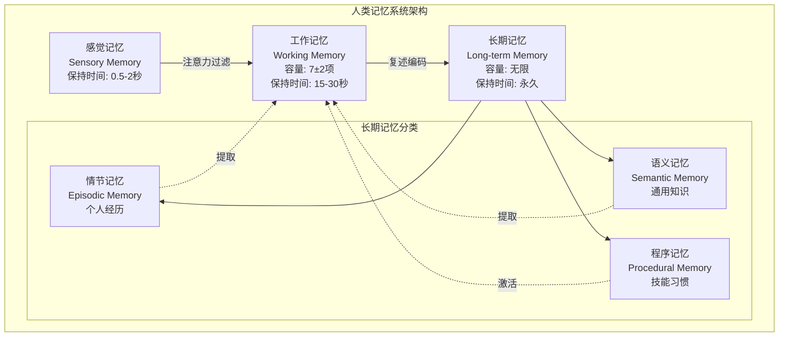
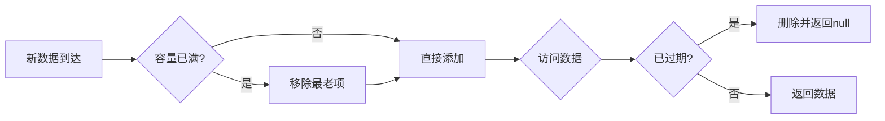
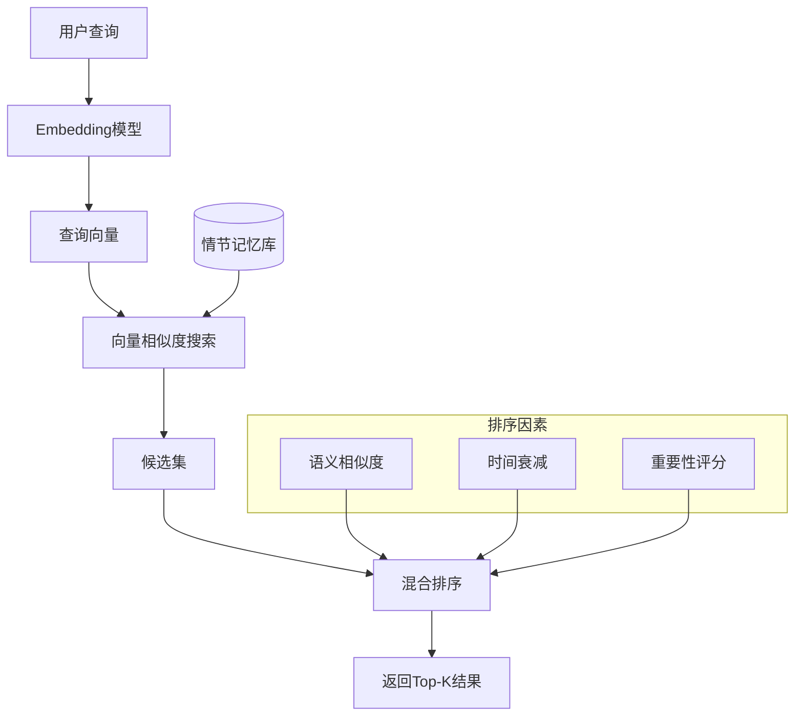
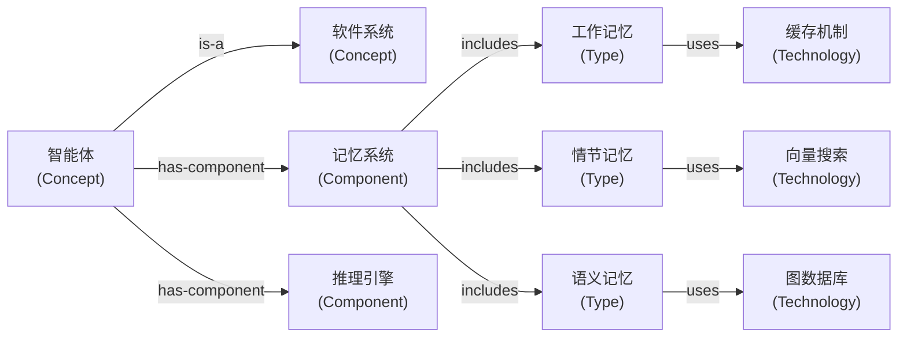
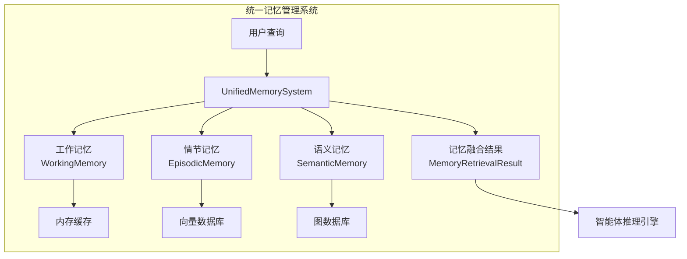

# 16.3 记忆系统：工作记忆、情节记忆与语义记忆

> **设计思想**：构建完整的记忆管理系统，实现智能体的长期学习和上下文理解能力

## 本节概述

记忆是智能体系统的核心组件之一，它使智能体能够存储和检索信息，从而实现上下文理解、经验学习和知识积累。在认知科学中，人类记忆系统通常被分为工作记忆、情节记忆和语义记忆三种类型。本节将借鉴这一理论框架，设计并实现一个完整的智能体记忆系统。

## 学习目标

完成本节学习后，你将：

- ✅ **理解记忆系统的理论基础**：掌握工作记忆、情节记忆和语义记忆的概念和特点
- ✅ **掌握工作记忆的实现**：学会实现短期信息存储和处理机制
- ✅ **实现情节记忆系统**：掌握历史交互记录的管理和检索
- ✅ **构建语义记忆系统**：理解知识和概念的存储与应用
- ✅ **掌握记忆检索和更新机制**：学会高效的记忆管理和优化策略
- ✅ **具备记忆系统集成能力**：能够将记忆系统集成到智能体框架中

## 记忆系统的理论基础

### 认知科学中的记忆分类

人类记忆系统是一个复杂的多层次结构,从感觉输入到长期保存涉及多个阶段和组件。理解这一理论框架对于设计智能体记忆系统至关重要。



### 三种记忆类型的对比与特征

#### 工作记忆(Working Memory):智能体的活动上下文

工作记忆是短期记忆系统,用于临时存储和处理当前任务所需的信息。在智能体系统中,工作记忆相当于**对话上下文窗口**。

**核心特征**:
- **容量有限**:通常只能同时处理5-9个信息单元(Miller's Law)
- **持续时间短**:信息保持时间通常为15-30秒,需要主动复述才能保持
- **处理功能强**:不仅存储信息,还能对信息进行操作、转换和推理
- **快速访问**:存取速度极快,支持即时检索

**在AI智能体中的应用**:
- 维护当前对话的上下文信息
- 存储最近几轮交互的用户输入和智能体响应
- 缓存当前任务的中间结果和状态
- 管理临时变量和计算结果

#### 情节记忆(Episodic Memory):智能体的经验档案

情节记忆存储个人经历和事件的记忆,具有明确的时间、地点和情境特征。它是**基于时间序列的事件记录**。

**核心特征**:
- **自传体性质**:存储特定的个人经历(对智能体而言,是其交互历史)
- **时间序列性**:按时间顺序组织记忆,支持时间范围检索
- **情境依赖性**:与特定情境相关联,包含丰富的上下文信息
- **可遗忘性**:随着时间推移,不重要的情节会被遗忘或压缩

**在AI智能体中的应用**:
- 存储历史对话记录和交互事件
- 记录任务执行的详细过程
- 支持基于相似场景的经验回忆
- 提供个性化的用户交互历史

#### 语义记忆(Semantic Memory):智能体的知识库

语义记忆存储关于世界的一般知识和概念,不依赖于特定的学习情境。它是**去情境化的概念性知识**。

**核心特征**:
- **抽象性**:存储抽象的知识、概念、规则和关系
- **稳定性**:相对稳定,不易遗忘,可长期保持
- **共享性**:可以被多个个体共享的通用知识
- **结构化**:通常以概念网络或知识图谱的形式组织

**在AI智能体中的应用**:
- 存储领域知识和专业概念
- 构建实体关系网络
- 支持知识推理和概念关联
- 提供背景知识支持

### 三种记忆的对比表

| 维度 | 工作记忆 | 情节记忆 | 语义记忆 |
|------|---------|---------|----------|
| **存储内容** | 当前任务信息 | 历史事件经历 | 通用知识概念 |
| **容量** | 极小(5-9项) | 大 | 极大 |
| **持续时间** | 秒级 | 长期 | 长期 |
| **组织方式** | 队列/栈 | 时间序列 | 知识图谱 |
| **访问速度** | 极快 | 快 | 中等 |
| **典型实现** | 内存缓存 | 向量数据库 | 图数据库 |
| **更新频率** | 极高 | 高 | 低 |
| **遗忘机制** | FIFO/TTL | 重要性衰减 | 很少遗忘 |

## 工作记忆实现

### 设计原理与架构

工作记忆在智能体中主要用于存储当前对话或任务的上下文信息。其设计遵循**有界缓存**原则,结合了**FIFO(先进先出)**和**TTL(生存时间)**两种淘汰策略。

**核心设计要点**:
1. **容量限制**: 限制最大存储项数,防止内存溢出
2. **时间过期**: 自动清理过期数据,保证信息时效性
3. **快速访问**: 使用HashMap实现O(1)的查询性能
4. **顺序维护**: 使用Deque维护插入顺序,支持FIFO淘汰



### 核心实现:WorkingMemory类

```java
public class WorkingMemory {
    private final int capacity;              // 最大容量
    private final Deque<MemoryItem> items;   // 维护顺序的双端队列
    private final Map<String, MemoryItem> itemMap; // 快速查找的映射
    private final long ttl;                  // 生存时间(毫秒)
    
    public WorkingMemory(int capacity, long ttl) {
        this.capacity = capacity;
        this.items = new LinkedList<>();
        this.itemMap = new HashMap<>();
        this.ttl = ttl;
    }
    
    public void add(String key, Object value) {
        MemoryItem item = new MemoryItem(key, value, System.currentTimeMillis());
        
        if (itemMap.containsKey(key)) {
            items.remove(itemMap.get(key));  // 更新已存在项
        } else if (items.size() >= capacity) {
            MemoryItem oldest = items.pollFirst();  // FIFO淘汰
            if (oldest != null) itemMap.remove(oldest.getKey());
        }
        
        items.offerLast(item);
        itemMap.put(key, item);
    }
    
    public <T> T get(String key, Class<T> type) {
        MemoryItem item = itemMap.get(key);
        if (item != null) {
            // TTL过期检查
            if (System.currentTimeMillis() - item.getTimestamp() > ttl) {
                remove(key);
                return null;
            }
            if (type.isInstance(item.getValue())) {
                return type.cast(item.getValue());
            }
        }
        return null;
    }
    
    /* ... 其他方法:remove、getAllItems、clear、size等 ... */
}

class MemoryItem {
    private final String key;
    private final Object value;
    private final long timestamp;
    
    // 构造函数和Getter方法
    /* ... */
}
```

### 上下文管理:ContextManager

上下文管理器负责维护对话历史,并将其转换为可供LLM使用的提示词格式。它实现了**滑动窗口**策略,只保留最近N轮对话。

**设计要点**:
- **窗口大小控制**: 限制对话轮数,避免超出LLM的上下文长度限制
- **自动截断**: 当历史超过限制时,自动移除最早的对话
- **快速访问**: 缓存最近的输入和响应,支持快速检索

```java
public class ContextManager {
    private WorkingMemory workingMemory;
    private int maxContextLength;  // 最大对话轮数
    
    public ContextManager(int capacity, long ttl, int maxContextLength) {
        this.workingMemory = new WorkingMemory(capacity, ttl);
        this.maxContextLength = maxContextLength;
    }
    
    public void updateContext(String userInput, String agentResponse) {
        List<Interaction> history = workingMemory.get("dialogue_history", List.class);
        if (history == null) history = new ArrayList<>();
        
        history.add(new Interaction(userInput, agentResponse, System.currentTimeMillis()));
        
        // 滑动窗口:只保留最近N轮
        if (history.size() > maxContextLength) {
            history = history.subList(history.size() - maxContextLength, history.size());
        }
        
        workingMemory.add("dialogue_history", history);
        workingMemory.add("last_user_input", userInput);
        workingMemory.add("last_agent_response", agentResponse);
    }
    
    public String buildContextPrompt() {
        List<Interaction> history = workingMemory.get("dialogue_history", List.class);
        if (history == null || history.isEmpty()) return "";
        
        StringBuilder prompt = new StringBuilder("Previous conversation:\n");
        for (Interaction interaction : history) {
            prompt.append("User: ").append(interaction.getUserInput()).append("\n");
            prompt.append("Agent: ").append(interaction.getAgentResponse()).append("\n");
        }
        return prompt.toString();
    }
    
    /* ... 其他辅助方法 ... */
}
```

## 情节记忆系统

### 设计原理与检索算法

情节记忆用于存储智能体的历史交互记录,支持基于**语义相似度**和**时间范围**的检索。其核心是**向量相似度搜索**(Vector Similarity Search)。

**关键技术**:
1. **Embedding编码**: 将文本内容转换为高维向量,捕捉语义信息
2. **余弦相似度**: 计算向量间的相似程度,范围[0,1]
3. **混合排序**: 结合相似度、时间衰减等多个因素
4. **分块存储**: 按session/时间分块,提高检索效率



### 核心实现:EpisodicMemory类

```java
public class EpisodicMemory {
    private final StorageBackend storage;       // 存储后端
    private final EmbeddingModel embeddingModel; // Embedding模型
    private final int maxRetrievedEpisodes;     // 最大检索数量
    
    public void storeEpisode(Episode episode) {
        // 1. 生成内容嵌入向量
        float[] embedding = embeddingModel.encode(episode.getContent());
        episode.setEmbedding(embedding);
        
        // 2. 存储到后端(向量数据库)
        storage.save(episode.getId(), episode);
    }
    
    public List<Episode> retrieveEpisodes(String query, int limit) {
        // 1. 将查询转换为向量
        float[] queryEmbedding = embeddingModel.encode(query);
        
        // 2. 向量相似度搜索(过采样)
        List<Episode> candidates = storage.searchSimilar(queryEmbedding, limit * 2);
        
        // 3. 混合排序:相似度 + 时间衰减
        return rerankEpisodes(candidates, queryEmbedding, limit);
    }
    
    public List<Episode> retrieveRecentEpisodes(long startTime, long endTime) {
        // 基于时间范围的检索
        return storage.searchByTimeRange(startTime, endTime);
    }
    
    private List<Episode> rerankEpisodes(List<Episode> candidates, 
                                       float[] queryEmbedding, int limit) {
        // 余弦相似度排序
        candidates.sort((e1, e2) -> {
            double sim1 = cosineSimilarity(queryEmbedding, e1.getEmbedding());
            double sim2 = cosineSimilarity(queryEmbedding, e2.getEmbedding());
            return Double.compare(sim2, sim1);  // 降序
        });
        
        return candidates.subList(0, Math.min(limit, candidates.size()));
    }
    
    private double cosineSimilarity(float[] a, float[] b) {
        double dotProduct = 0.0, normA = 0.0, normB = 0.0;
        for (int i = 0; i < a.length; i++) {
            dotProduct += a[i] * b[i];
            normA += a[i] * a[i];
            normB += b[i] * b[i];
        }
        return dotProduct / (Math.sqrt(normA) * Math.sqrt(normB));
    }
}

public class Episode {
    private String id;
    private String content;              // 情节内容
    private Map<String, Object> metadata; // 元数据
    private float[] embedding;           // 向量表示
    private long timestamp;              // 时间戳
    private String sessionId;            // 会话 ID
    private List<String> tags;           // 标签
    
    /* ... 构造函数和Getter/Setter方法 ... */
}
```

### 存储后端接口与实现

存储后端提供统一的数据存储和检索接口,支持多种实现(内存、文件、向量数据库)。这里展示**内存实现**,适用于小规模场景。

**设计要点**:
- **接口抽象**: 便于替换为Pinecone、Milvus等专业向量数据库
- **索引结构**: 维护独立的索引,加速向量检索
- **并发控制**: 使用读写锁保证线程安全

```java
public interface StorageBackend {
    void save(String key, Object value);
    <T> T load(String key, Class<T> type);
    void delete(String key);
    List<Object> searchSimilar(float[] embedding, int limit);
    List<Object> searchByTimeRange(long startTime, long endTime);
    List<Object> searchByTags(List<String> tags);
}

public class InMemoryStorage implements StorageBackend {
    private final Map<String, Object> storage;        // 实际存储
    private final List<IndexedEpisode> index;         // 向量索引
    private final ReadWriteLock lock;                 // 读写锁
    
    @Override
    public void save(String key, Object value) {
        lock.writeLock().lock();
        try {
            storage.put(key, value);
            if (value instanceof Episode) {
                Episode episode = (Episode) value;
                index.add(new IndexedEpisode(key, episode.getEmbedding(), 
                                           episode.getTimestamp(), episode.getTags()));
            }
        } finally {
            lock.writeLock().unlock();
        }
    }
    
    @Override
    public List<Object> searchSimilar(float[] embedding, int limit) {
        lock.readLock().lock();
        try {
            // 计算所有项的相似度
            List<IndexedEpisode> similarities = new ArrayList<>();
            for (IndexedEpisode indexed : index) {
                double similarity = cosineSimilarity(embedding, indexed.getEmbedding());
                similarities.add(new IndexedEpisode(indexed.getKey(), similarity));
            }
            
            // 按相似度排序
            similarities.sort((a, b) -> 
                Double.compare(b.getSimilarity(), a.getSimilarity()));
            
            // 返回Top-K
            List<Object> results = new ArrayList<>();
            for (int i = 0; i < Math.min(limit, similarities.size()); i++) {
                results.add(storage.get(similarities.get(i).getKey()));
            }
            return results;
        } finally {
            lock.readLock().unlock();
        }
    }
    
    /* ... 其他方法实现 ... */
}
```

## 语义记忆系统

### 设计原理与知识图谱

语义记忆存储关于世界的通用知识和概念,支持知识推理和概念关联。其核心是**知识图谱**(Knowledge Graph),以图结构组织概念和关系。

**知识图谱基本概念**:
- **节点(Node)**: 代表概念、实体或知识点
- **边(Edge)**: 代表节点间的关系(如is-a, part-of, related-to)
- **属性(Property)**: 节点和边的附加信息



**设计优势**:
1. **语义关联**: 通过关系连接相关概念,支持联想检索
2. **推理能力**: 支持基于关系的逻辑推理
3. **可解释性**: 明确的知识结构,便于理解和调试
4. **扩展性**: 可持续添加新概念和关系

### 核心实现:SemanticMemory类

```java
public class SemanticMemory {
    private final KnowledgeGraph knowledgeGraph;      // 知识图谱
    private final EmbeddingModel embeddingModel;      // Embedding模型
    private final Map<String, Concept> conceptCache;  // 概念缓存
    
    public void addConcept(Concept concept) {
        // 1. 生成概念向量
        float[] embedding = embeddingModel.encode(concept.getDescription());
        concept.setEmbedding(embedding);
        
        // 2. 添加到知识图谱
        knowledgeGraph.addNode(concept.getId(), concept);
        
        // 3. 缓存概念
        conceptCache.put(concept.getId(), concept);
    }
    
    public void addRelationship(String sourceId, String targetId, String relationship) {
        // 添加概念间的关系(边)
        knowledgeGraph.addEdge(sourceId, targetId, relationship);
    }
    
    public List<Concept> retrieveConcepts(String query, int limit) {
        // 1. 语义检索:基于向量相似度
        float[] queryEmbedding = embeddingModel.encode(query);
        List<Concept> candidates = knowledgeGraph.searchSimilarConcepts(queryEmbedding, limit * 2);
        
        // 2. 重排序
        return rerankConcepts(candidates, queryEmbedding, limit);
    }
    
    public List<Concept> getRelatedConcepts(String conceptId, int limit) {
        // 基于关系的检索:图遍历
        return knowledgeGraph.getNeighbors(conceptId, limit);
    }
    
    public Concept getConcept(String conceptId) {
        // 先从缓存获取,再从图中查询
        Concept concept = conceptCache.get(conceptId);
        if (concept == null) {
            concept = knowledgeGraph.getNode(conceptId);
            if (concept != null) conceptCache.put(conceptId, concept);
        }
        return concept;
    }
    
    /* ... 其他方法 ... */
}

public class Concept {
    private String id;
    private String name;                    // 概念名称
    private String description;             // 概念描述
    private Map<String, Object> attributes; // 属性
    private float[] embedding;              // 向量表示
    private List<String> categories;        // 分类
    
    /* ... 构造函数和Getter/Setter方法 ... */
}
```

### 知识图谱实现:KnowledgeGraph类

知识图谱提供基础的图存储和遍历功能。这里展示的是**邻接表**实现,适合稀疏图。

**图遍历算法**:
- **BFS(广度优先)**: 用于查找最近邻居
- **DFS(深度优先)**: 用于路径搜索和关系推理

```java
public class KnowledgeGraph {
    private final Map<String, Object> nodes;         // 节点存储
    private final Map<String, List<Edge>> edges;     // 邻接表
    private final ReadWriteLock lock;                // 并发控制
    
    public void addNode(String nodeId, Object node) {
        lock.writeLock().lock();
        try {
            nodes.put(nodeId, node);
            edges.putIfAbsent(nodeId, new ArrayList<>());
        } finally {
            lock.writeLock().unlock();
        }
    }
    
    public void addEdge(String sourceId, String targetId, String relationship) {
        lock.writeLock().lock();
        try {
            Edge edge = new Edge(sourceId, targetId, relationship);
            edges.computeIfAbsent(sourceId, k -> new ArrayList<>()).add(edge);
            
            // 添加双向边,支持双向遍历
            edges.computeIfAbsent(targetId, k -> new ArrayList<>())
                 .add(new Edge(targetId, sourceId, "inverse_" + relationship));
        } finally {
            lock.writeLock().unlock();
        }
    }
    
    public List<Object> getNeighbors(String nodeId, int limit) {
        lock.readLock().lock();
        try {
            List<Edge> nodeEdges = edges.get(nodeId);
            if (nodeEdges == null) return new ArrayList<>();
            
            // BFS遍历获取邻居
            List<Object> neighbors = new ArrayList<>();
            for (Edge edge : nodeEdges) {
                Object neighbor = nodes.get(edge.getTargetId());
                if (neighbor != null) {
                    neighbors.add(neighbor);
                    if (neighbors.size() >= limit) break;
                }
            }
            return neighbors;
        } finally {
            lock.readLock().unlock();
        }
    }
    
    public List<Concept> searchSimilarConcepts(float[] queryEmbedding, int limit) {
        // 遍历所有Concept节点,计算相似度
        /* ... 向量检索逻辑 ... */
        return new ArrayList<>();
    }
    
    /* ... 其他方法:getNode、deleteNode等 ... */
}

class Edge {
    private String sourceId;
    private String targetId;
    private String relationship;  // 关系类型
    
    /* ... 构造函数和Getter方法 ... */
}
```

## 统一记忆管理系统

### 集成设计与架构

统一记忆系统整合三种记忆类型,提供一致的访问接口和智能检索能力。它是智能体的**记忆中枢**。



**融合策略**:
- **分层检索**: 先工作记忆,再情节记忆,最后语义记忆
- **权重分配**: 根据任务类型动态调整各类记忆比重
- **去重合并**: 合并相似记忆,避免信息冗余

### 核心实现

```java
public class UnifiedMemorySystem {
    private final WorkingMemory workingMemory;
    private final EpisodicMemory episodicMemory;
    private final SemanticMemory semanticMemory;
    private final MemoryConfig config;
    
    public UnifiedMemorySystem(MemoryConfig config) {
        this.config = config;
        this.workingMemory = new WorkingMemory(
            config.getWorkingMemoryCapacity(), 
            config.getWorkingMemoryTTL()
        );
        this.episodicMemory = new EpisodicMemory(
            config.getEpisodicStorage(), 
            config.getEmbeddingModel(),
            config.getMaxRetrievedEpisodes()
        );
        this.semanticMemory = new SemanticMemory(
            config.getKnowledgeGraph(), 
            config.getEmbeddingModel()
        );
    }
    
    // 存储接口
    public void storeWorkingMemory(String key, Object value) {
        workingMemory.add(key, value);
    }
    
    public void storeEpisode(Episode episode) {
        episodicMemory.storeEpisode(episode);
    }
    
    public void storeConcept(Concept concept) {
        semanticMemory.addConcept(concept);
    }
    
    // 智能检索:融合三种记忆
    public MemoryRetrievalResult retrieveRelevantMemories(
            String query, RetrievalContext context) {
        MemoryRetrievalResult result = new MemoryRetrievalResult();
        
        // 1. 工作记忆:当前上下文
        if (context.isIncludeWorkingMemory()) {
            result.setWorkingMemoryItems(workingMemory.getAllItems());
        }
        
        // 2. 情节记忆:历史经验
        if (context.isIncludeEpisodicMemory()) {
            result.setEpisodes(episodicMemory.retrieveEpisodes(
                query, context.getMaxEpisodes()));
        }
        
        // 3. 语义记忆:背景知识
        if (context.isIncludeSemanticMemory()) {
            result.setConcepts(semanticMemory.retrieveConcepts(
                query, context.getMaxConcepts()));
        }
        
        return result;
    }
    
    /* ... 其他方法:clearWorkingMemory、getMemoryStats等 ... */
}

// 配置类
public class MemoryConfig {
    private int workingMemoryCapacity = 100;
    private long workingMemoryTTL = 300000; // 5分钟
    private int maxRetrievedEpisodes = 10;
    private int maxRetrievedConcepts = 20;
    private StorageBackend episodicStorage;
    private KnowledgeGraph knowledgeGraph;
    private EmbeddingModel embeddingModel;
    
    /* ... Getter/Setter方法 ... */
}

// 检索结果类
public class MemoryRetrievalResult {
    private List<MemoryItem> workingMemoryItems;  // 工作记忆
    private List<Episode> episodes;               // 情节记忆
    private List<Concept> concepts;               // 语义记忆
    
    /* ... Getter/Setter方法 ... */
}

// 检索上下文:control what to retrieve
public class RetrievalContext {
    private boolean includeWorkingMemory = true;
    private boolean includeEpisodicMemory = true;
    private boolean includeSemanticMemory = true;
    private int maxEpisodes = 5;
    private int maxConcepts = 10;
    
    /* ... Getter/Setter方法 ... */
}
```

## 本节小结

本节我们设计并实现了一个完整的智能体记忆系统,核心内容包括:

### 1. 理论基础
- **认知科学框架**: 借鉴人类记忆系统的三分法,建立科学的记忆模型
- **记忆分类**: 深入理解工作记忆、情节记忆、语义记忆的特征和差异
- **应用场景**: 掌握不同记忆类型在AI智能体中的具体应用

### 2. 核心实现

**工作记忆**:
- 实现了FIFO + TTL的混合淘汰策略
- 提供了快速O(1)的存取性能
- 支持滑动窗口的上下文管理

**情节记忆**:
- 基于Embedding的语义相似度搜索
- 支持时间范围和标签的多维检索
- 实现了混合排序算法提升检索质量

**语义记忆**:
- 构建了知识图谱存储结构
- 支持概念关联和关系推理
- 结合向量检索和图遍历的混合策略

### 3. 统一管理与优化
- **统一接口**: 集成三种记忆,提供一致的API
- **智能检索**: 自动融合多种记忆源,返回最相关结果
- **性能优化**: 实现了遗忘机制、分块索引、缓存策略

### 4. 实际应用价值

通过本节的实现,我们为智能体提供了强大的记忆能力:

- ✅ **维护对话上下文**: 通过工作记忆跟踪当前任务状态
- ✅ **学习历史经验**: 通过情节记忆积累交互经验
- ✅ **运用领域知识**: 通过语义记忆提供知识支持
- ✅ **个性化交互**: 基于历史记忆提供个性化服务
- ✅ **连续学习**: 支持长期经验积累和知识迭代

### 5. 下一步学习

记忆系统为智能体提供了“记忆”能力,但智能体还需要“行动”能力。**在下一节中**,我们将学习**工具调用技术**,掌握如何赋予智能体与外部世界交互和操作的能力,从而构建更加实用的AI系统。