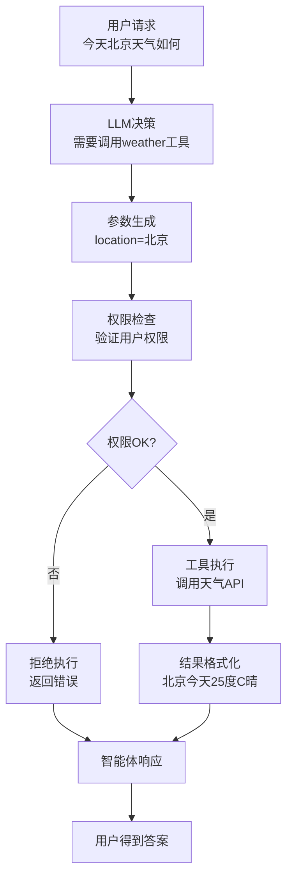
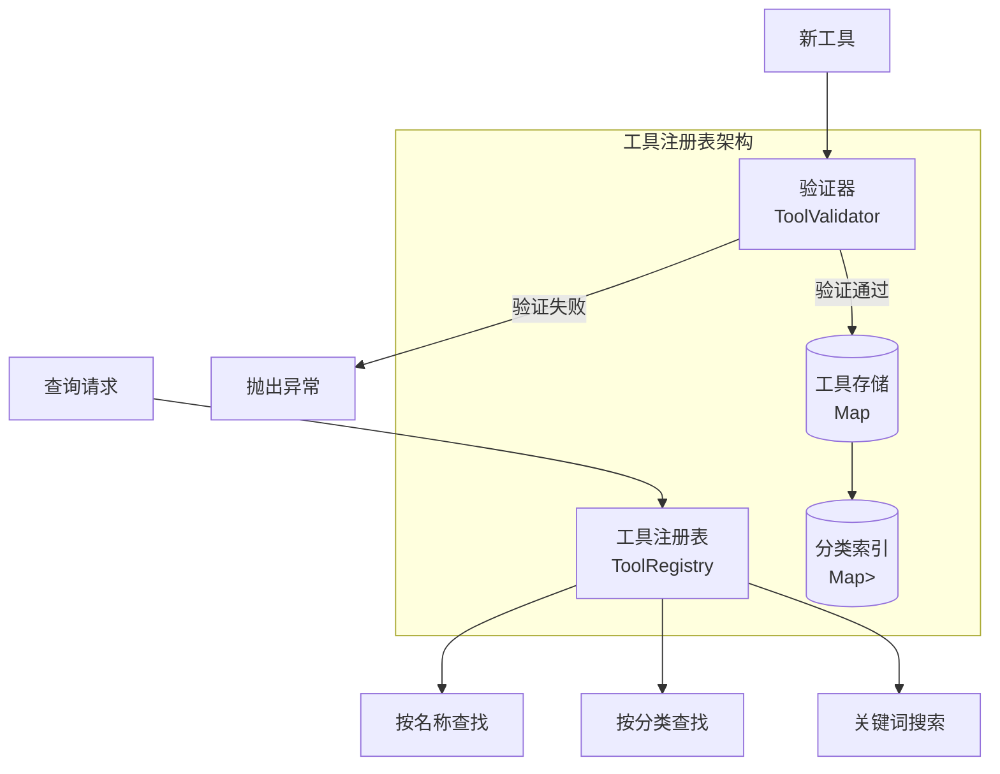
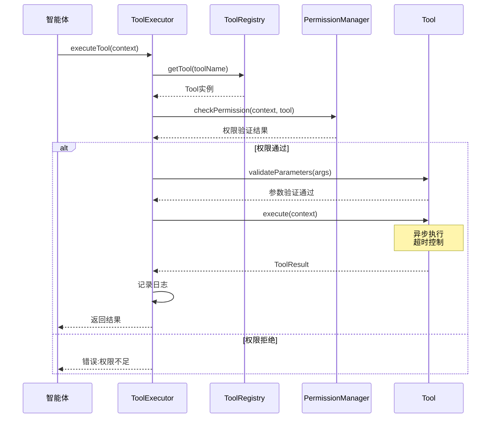
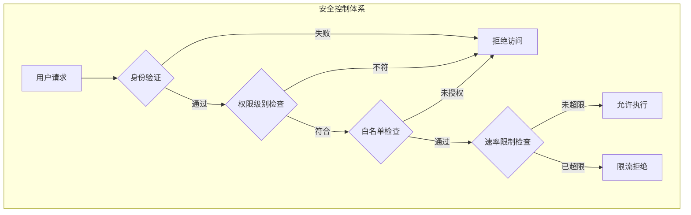
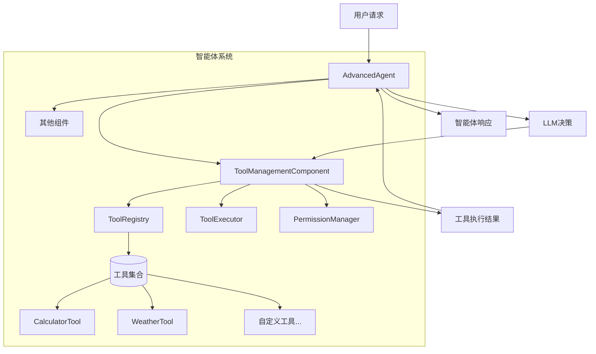

# 16.4 工具调用：赋予智能体行动能力

> **设计思想**：构建灵活的工具调用框架，使智能体能够与外部系统交互并执行实际任务

## 本节概述

工具调用是智能体系统的核心能力之一，它使智能体能够超越纯语言处理的范畴，通过调用外部工具来执行实际操作。从简单的计算器到复杂的API调用，工具调用能力极大地扩展了智能体的应用范围和实用性。本节将设计并实现一个灵活、安全、可扩展的工具调用框架。

## 学习目标

完成本节学习后，你将：

- ✅ **理解工具调用的核心概念**：掌握工具注册、调用和结果处理的完整流程
- ✅ **掌握工具注册和管理机制**：学会如何动态注册和管理各种类型的工具
- ✅ **实现工具调用的解析和执行**：掌握工具调用参数的解析和安全执行
- ✅ **学会工具执行结果的处理**：理解如何处理和格式化工具执行结果
- ✅ **掌握安全性和权限控制**：学会实现工具调用的安全控制机制
- ✅ **具备工具系统扩展能力**：能够开发自定义工具并集成到系统中

## 工具调用的核心概念

### 工具调用的理论基础

工具调用(Tool Calling/Function Calling)是智能体系统中实现**感知-决策-执行**闭环的关键机制。它允许大语言模型突破纯文本生成的限制,通过调用外部函数和API来完成实际任务。

**核心价值**:
1. **能力扩展**: LLM获得访问外部数据、执行计算、控制系统的能力
2. **实时性**: 获取最新信息,而不依赖训练数据
3. **可控性**: 通过结构化接口约束LLM行为,提高可靠性
4. **可审计**: 每次工具调用都有明确记录,便于调试和监控

### 工具调用的工作流程



### 工具调用的技术要素

| 要素 | 说明 | 实现方式 |
|------|------|----------|
| **工具定义** | 描述工具的名称、功能、参数模式 | JSON Schema / 函数签名 |
| **工具注册** | 将可用工具告知LLM | 系统提示词 / API元数据 |
| **意图识别** | LLM判断是否需要调用工具 | Few-shot提示 / Fine-tuning |
| **参数提取** | 从对话中提取工具参数 | LLM JSON生成 |
| **执行控制** | 管理工具调用的生命周期 | 超时、重试、熔断 |
| **结果处理** | 将工具输出转为自然语言 | LLM后处理 |

## 工具定义和注册机制

### 工具接口设计原理

工具接口需要满足**开放-封闭原则**:对扩展开放(易于添加新工具),对修改封闭(不影响现有工具)。我们采用**抽象基类 + 元数据描述**的设计模式。

**设计要点**:
1. **类型安全**: 使用强类型参数定义,编译时检查
2. **自描述**: 工具自带元数据,可自动生成文档
3. **验证机制**: 内置参数校验,防止非法调用
4. **权限分级**: 支持PUBLIC/USER/ADMIN/SYSTEM四级权限

```java
public abstract class Tool {
    protected String name;              // 工具名称
    protected String description;       // 功能描述
    protected List<ToolParameter> parameters;  // 参数定义
    protected ToolMetadata metadata;    // 元数据
    protected PermissionLevel permissionLevel; // 权限级别
    
    // 核心执行方法,子类必须实现
    public abstract ToolResult execute(ToolCallContext context) throws ToolException;
    
    // 参数验证:检查必填项和类型
    public void validateParameters(Map<String, Object> arguments) throws ToolException {
        for (ToolParameter param : parameters) {
            Object value = arguments.get(param.getName());
            
            if (param.isRequired() && value == null) {
                throw new ToolException("Missing required parameter: " + param.getName());
            }
            
            if (value != null && !param.validate(value)) {
                throw new ToolException("Invalid value for parameter: " + param.getName());
            }
        }
    }
    
    /* ... Getter方法和其他辅助方法 ... */
}

public class ToolParameter {
    private String name;                // 参数名
    private DataType type;              // 数据类型
    private String description;         // 参数说明
    private boolean required;           // 是否必填
    private Object defaultValue;        // 默认值
    private List<Object> allowedValues; // 枚举值
    private Map<String, Object> constraints; // 约束条件
    
    // 参数验证:类型检查 + 约束检查
    public boolean validate(Object value) {
        if (value == null) return !required;
        
        // 类型检查
        if (!isCorrectType(value)) return false;
        
        // 枚举值检查
        if (allowedValues != null && !allowedValues.contains(value)) {
            return false;
        }
        
        // 自定义约束(如minLength、maxLength、minimum、maximum等)
        return validateConstraints(value);
    }
    
    /* ... 类型检查和约束验证的具体实现 ... */
}

public enum DataType {
    STRING, INTEGER, NUMBER, BOOLEAN, ARRAY, OBJECT
}

public enum PermissionLevel {
    PUBLIC,   // 公开可用
    USER,     // 需要用户登录
    ADMIN,    // 需要管理员权限
    SYSTEM    // 仅系统内部调用
}
```

### 工具注册管理器

工具注册表采用**注册中心模式**,提供统一的工具发现和管理服务。它支持**动态注册**、**分类管理**和**关键词搜索**。



**设计特点**:
- **线程安全**: 使用ReadWriteLock支持并发读取
- **名称唯一性**: 防止工具名冲突
- **分类管理**: 支持按功能分类(工具、搜索、数据处理等)
- **动态更新**: 运行时注册/注销工具

```java
public class ToolRegistry {
    private final Map<String, Tool> tools;
    private final Map<String, List<Tool>> categoryTools;  // 分类索引
    private final ReadWriteLock lock;                      // 并发控制
    private final ToolValidator validator;                 // 验证器
    
    public void registerTool(Tool tool) throws ToolException {
        validator.validate(tool);  // 1. 验证工具
        
        lock.writeLock().lock();
        try {
            // 2. 检查名称冲突
            if (tools.containsKey(tool.getName())) {
                throw new ToolException("Tool already exists: " + tool.getName());
            }
            
            // 3. 注册工具
            tools.put(tool.getName(), tool);
            
            // 4. 按分类索引
            String category = tool.getMetadata().getCategory();
            if (category != null) {
                categoryTools.computeIfAbsent(category, k -> new ArrayList<>())
                            .add(tool);
            }
        } finally {
            lock.writeLock().unlock();
        }
    }
    
    // 查询接口
    public Tool getTool(String toolName) { /* ... */ }
    public List<Tool> getToolsByCategory(String category) { /* ... */ }
    public List<Tool> searchTools(String keyword) { /* ... */ }
    
    /* ... 其他管理方法 ... */
}

public class ToolValidator {
    public void validate(Tool tool) throws ToolException {
        // 1. 名称验证
        if (tool.getName() == null || tool.getName().trim().isEmpty()) {
            throw new ToolException("Tool name cannot be null or empty");
        }
        
        // 2. 描述验证
        if (tool.getDescription() == null || tool.getDescription().trim().isEmpty()) {
            throw new ToolException("Tool description cannot be null or empty");
        }
        
        // 3. 参数名称唯一性
        Set<String> paramNames = new HashSet<>();
        for (ToolParameter param : tool.getParameters()) {
            if (!paramNames.add(param.getName())) {
                throw new ToolException("Duplicate parameter name: " + param.getName());
            }
        }
    }
}
```

## 工具调用解析和执行

### 工具执行流程设计

工具执行采用**责任链模式**,通过多个处理节点确保调用的安全性和可靠性。整个流程包括**参数解析**、**权限验证**、**超时控制**、**异常处理**等环节。



### 工具调用上下文

```java
// 工具调用上下文:封装调用所需的所有信息
public class ToolCallContext {
    private String toolName;                    // 工具名称
    private Map<String, Object> arguments;      // 调用参数
    private String sessionId;                   // 会话ID
    private String userId;                      // 用户ID
    private PermissionLevel userPermissionLevel; // 用户权限级别
    private Map<String, Object> context;        // 上下文信息
    private long timeout;                       // 超时时间(毫秒)
    
    public ToolCallContext(String toolName, Map<String, Object> arguments) {
        this.toolName = toolName;
        this.arguments = arguments != null ? arguments : new HashMap<>();
        this.context = new HashMap<>();
        this.timeout = 30000; // 默认30秒
    }
    
    /* ... Getter/Setter方法 ... */
}

// 工具调用记录:用于追踪和日志
public class ToolCall {
    private String id;                          // 唯一ID
    private String toolName;                    // 工具名
    private Map<String, Object> arguments;      // 参数
    private long timestamp;                     // 时间戳
    
    /* ... 构造函数和Getter方法 ... */
}

// 工具执行结果:统一的返回格式
public class ToolResult {
    private String toolCallId;       // 调用ID
    private Object result;           // 执行结果
    private boolean success;         // 是否成功
    private String errorMessage;     // 错误信息
    private long executionTime;      // 执行耗时
    private Map<String, Object> metadata; // 元数据
    
    // 工厂方法
    public static ToolResult success(String toolCallId, Object result) { /* ... */ }
    public static ToolResult error(String toolCallId, String errorMessage) { /* ... */ }
    
    /* ... Getter/Setter方法 ... */
}
```

### 工具执行器:异步执行与生命周期管理

工具执行器负责管理工具的完整执行生命周期,采用**异步执行模型**提高并发性能。

**核心功能**:
- **异步执行**: 使用CompletableFuture避免阻塞
- **超时控制**: 防止工具执行时间过长
- **任务追踪**: 记录正在运行的任务,支持取消操作
- **日志记录**: 记录所有执行历史,便于审计

```java
public class ToolExecutor {
    private final ToolRegistry toolRegistry;
    private final PermissionManager permissionManager;
    private final ToolExecutionLogger logger;
    private final ExecutorService executorService;           // 线程池
    private final Map<String, ToolExecutionTask> runningTasks; // 运行中任务
    
    // 异步执行工具
    public CompletableFuture<ToolResult> executeTool(ToolCallContext context) {
        return CompletableFuture.supplyAsync(() -> {
            try {
                return executeToolSync(context);
            } catch (Exception e) {
                return ToolResult.error(context.getToolName(), e.getMessage());
            }
        }, executorService);
    }
    
    // 同步执行逻辑(5步流程)
    private ToolResult executeToolSync(ToolCallContext context) throws ToolException {
        long startTime = System.currentTimeMillis();
        String toolCallId = UUID.randomUUID().toString();
        
        try {
            // 1. 查找工具
            Tool tool = toolRegistry.getTool(context.getToolName());
            if (tool == null) throw new ToolException("Tool not found");
            
            // 2. 权限检查
            if (!permissionManager.checkPermission(context, tool)) {
                throw new ToolException("Permission denied");
            }
            
            // 3. 参数验证
            tool.validateParameters(context.getArguments());
            
            // 4. 执行工具(追踪任务)
            ToolExecutionTask task = new ToolExecutionTask(tool, context, toolCallId);
            runningTasks.put(toolCallId, task);
            ToolResult result = tool.execute(context);
            result.setExecutionTime(System.currentTimeMillis() - startTime);
            
            // 5. 记录日志
            logger.logExecution(tool, context, result);
            return result;
        } catch (Exception e) {
            /* ... 异常处理 ... */
        } finally {
            runningTasks.remove(toolCallId);
        }
    }
    
    // 取消执行
    public void cancelExecution(String toolCallId) { /* ... */ }
    
    // 查询运行中的任务
    public List<ToolExecutionInfo> getRunningExecutions() { /* ... */ }
    
    /* ... 其他方法 ... */
}
```

## 权限管理和安全控制

### 权限管理原理

工具调用的安全性至关重要。我们采用**RBAC(基于角色的访问控制)**模型,结合**速率限制**和**白名单**机制。

**安全分层**:



### 权限级别体系

| 权限级别 | 适用场景 | 典型工具示例 |
|----------|----------|----------------|
| **PUBLIC** | 无需认证 | 时间查询、单位转换 |
| **USER** | 普通用户 | 搜索、计算器、天气查询 |
| **ADMIN** | 管理员 | 系统配置、用户管理 |
| **SYSTEM** | 系统内部 | 数据库操作、文件系统访问 |

### 核心实现

```java
public class PermissionManager {
    private final Map<String, UserPermissions> userPermissions;    // 用户权限
    private final Map<String, ToolPermission> toolPermissions;     // 工具权限
    private final ReadWriteLock lock;
    
    // 检查用户是否有权调用某工具
    public boolean checkPermission(ToolCallContext context, Tool tool) {
        // 1. 获取用户权限
        UserPermissions userPerms = getUserPermissions(context.getUserId());
        if (userPerms == null) return false;
        
        // 2. 检查工具权限
        ToolPermission toolPerm = getToolPermission(tool.getName());
        if (toolPerm == null) {
            // 默认策略:PUBLIC工具允许所有人访问
            return tool.getPermissionLevel() == PermissionLevel.PUBLIC;
        }
        
        // 3. 权限级别匹配
        if (!hasRequiredPermission(userPerms.getPermissionLevel(), 
                                   tool.getPermissionLevel())) {
            return false;
        }
        
        // 4. 白名单检查(如果有)
        if (!toolPerm.getAllowedUsers().isEmpty()) {
            if (!toolPerm.getAllowedUsers().contains(context.getUserId())) {
                return false;
            }
        }
        
        // 5. 速率限制检查
        RateLimit rateLimit = toolPerm.getRateLimit();
        if (rateLimit != null) {
            return rateLimit.isAllowed(context.getUserId());
        }
        
        return true;
    }
    
    // 权限级别匹配逻辑
    private boolean hasRequiredPermission(PermissionLevel userLevel, 
                                         PermissionLevel requiredLevel) {
        // SYSTEM > ADMIN > USER > PUBLIC
        switch (requiredLevel) {
            case PUBLIC: return true;
            case USER: return userLevel != PermissionLevel.PUBLIC;
            case ADMIN: return userLevel == PermissionLevel.ADMIN || 
                              userLevel == PermissionLevel.SYSTEM;
            case SYSTEM: return userLevel == PermissionLevel.SYSTEM;
            default: return false;
        }
    }
    
    /* ... 权限管理方法:setUserPermission、setToolPermission等 ... */
}

// 速率限制:Token Bucket算法
class RateLimit {
    private int maxCalls;              // 最大调用次数
    private long timeWindow;           // 时间窗口(毫秒)
    private Map<String, List<Long>> callHistory;  // 调用历史
    
    public boolean isAllowed(String userId) {
        long now = System.currentTimeMillis();
        List<Long> calls = callHistory.computeIfAbsent(userId, k -> new ArrayList<>());
        
        // 清理过期记录
        calls.removeIf(callTime -> now - callTime > timeWindow);
        
        // 检查是否超限
        if (calls.size() >= maxCalls) return false;
        
        // 记录本次调用
        calls.add(now);
        return true;
    }
}
```

## 实际工具实现示例

### 工具开发最佳实践

**设计原则**:
1. **单一职责**: 每个工具只做一件事,做好一件事
2. **幂等性**: 多次调用相同参数应得到相同结果
3. **错误处理**: 明确的异常信息,便于LLM理解
4. **参数验证**: 严格的输入检查,防止恶意调用
5. **性能优化**: 避免长时间阻塞,设置合理超时

### 示例1:计算器工具

```java
public class CalculatorTool extends Tool {
    public CalculatorTool() {
        super("calculator", "Perform basic mathematical calculations");
        
        // 定义参数
        ToolParameter expressionParam = new ToolParameter(
            "expression", DataType.STRING, 
            "Mathematical expression (e.g., '2 + 3 * 4')"  
        );
        expressionParam.setRequired(true);
        addParameter(expressionParam);
        
        getMetadata().setCategory("utility");
    }
    
    @Override
    public ToolResult execute(ToolCallContext context) throws ToolException {
        String expression = (String) context.getArguments().get("expression");
        
        // 安全性检查:只允许数字和运算符
        if (!expression.matches("[0-9+\\-*/().\\s]+")) {
            throw new ToolException("Invalid characters in expression");
        }
        
        try {
            // 使用安全的表达式解析器(实际应用中使用专业库)
            double result = evaluateExpression(expression);
            return ToolResult.success(context.getToolName(), result);
        } catch (Exception e) {
            throw new ToolException("Evaluation failed: " + e.getMessage());
        }
    }
    
    private double evaluateExpression(String expression) {
        /* ... 安全的表达式计算实现 ... */
    }
}
```

### 示例2:天气查询工具

```java
public class WeatherTool extends Tool {
    private final HttpClient httpClient;
    private final String apiKey;
    
    public WeatherTool(String apiKey) {
        super("weather", "Get current weather for a location");
        this.apiKey = apiKey;
        this.httpClient = HttpClient.newHttpClient();
        
        // 定义参数
        addParameter(new ToolParameter(
            "location", DataType.STRING, "City name or coordinates"
        ).setRequired(true));
        
        ToolParameter unitsParam = new ToolParameter(
            "units", DataType.STRING, "Temperature units"
        );
        unitsParam.setAllowedValues(Arrays.asList("metric", "imperial", "kelvin"));
        unitsParam.setDefaultValue("metric");
        addParameter(unitsParam);
        
        getMetadata().setCategory("utility");
        getMetadata().setExternalService("OpenWeatherMap");
    }
    
    @Override
    public ToolResult execute(ToolCallContext context) throws ToolException {
        String location = (String) context.getArguments().get("location");
        String units = (String) context.getArguments().getOrDefault("units", "metric");
        
        try {
            // 构建API请求
            String url = buildApiUrl(location, units);
            HttpRequest request = HttpRequest.newBuilder()
                .uri(URI.create(url))
                .timeout(Duration.ofSeconds(10))  // 超时控制
                .build();
            
            // 发送请求
            HttpResponse<String> response = httpClient.send(
                request, HttpResponse.BodyHandlers.ofString()
            );
            
            if (response.statusCode() == 200) {
                Map<String, Object> weatherData = parseResponse(response.body());
                return ToolResult.success(context.getToolName(), weatherData);
            } else {
                throw new ToolException("API error: " + response.statusCode());
            }
        } catch (Exception e) {
            throw new ToolException("Failed to get weather: " + e.getMessage());
        }
    }
    
    /* ... 辅助方法 ... */
}
```

## 工具调用集成到智能体

### 集成架构设计

工具调用作为智能体的一个**组件**(Component),采用**插件式架构**集成到AdvancedAgent中。



### 核心组件实现

```java
public class ToolManagementComponent extends AgentComponent {
    private ToolRegistry toolRegistry;
    private ToolExecutor toolExecutor;
    private PermissionManager permissionManager;
    
    public ToolManagementComponent() {
        super("ToolManagement");
    }
    
    @Override
    public void initialize(AgentContext context, EventBus eventBus) {
        // 初始化各个管理器
        this.toolRegistry = new ToolRegistry();
        this.permissionManager = new PermissionManager();
        this.toolExecutor = new ToolExecutor(toolRegistry, permissionManager);
        
        // 注册默认工具
        registerDefaultTools();
        
        // 设置默认权限
        setupDefaultPermissions();
    }
    
    @Override
    public void process(AgentRequest request, AgentResponse response) {
        // 1. 解析工具调用请求
        List<ToolCall> toolCalls = parseToolCalls(request);
        if (toolCalls.isEmpty()) return;
        
        // 2. 异步执行所有工具
        List<CompletableFuture<ToolResult>> futures = new ArrayList<>();
        for (ToolCall toolCall : toolCalls) {
            ToolCallContext context = buildContext(toolCall, request);
            futures.add(toolExecutor.executeTool(context));
        }
        
        // 3. 等待执行完成
        try {
            CompletableFuture.allOf(futures.toArray(new CompletableFuture[0]))
                           .get(30, TimeUnit.SECONDS);
            
            // 4. 收集结果
            for (CompletableFuture<ToolResult> future : futures) {
                response.addToolCallResult(future.get());
            }
        } catch (Exception e) {
            logger.error("Tool execution failed", e);
            response.addMetadata("tool_error", e.getMessage());
        }
    }
    
    private List<ToolCall> parseToolCalls(AgentRequest request) {
        // 从请求中提取工具调用(例如从JSON格式解析)
        /* ... */
    }
    
    private ToolCallContext buildContext(ToolCall toolCall, AgentRequest request) {
        ToolCallContext context = new ToolCallContext(
            toolCall.getToolName(), 
            toolCall.getArguments()
        );
        context.setUserId(request.getUserId());
        context.setSessionId(request.getSessionId());
        return context;
    }
    
    // 公共API:允许动态注册工具
    public void registerTool(Tool tool) throws ToolException {
        toolRegistry.registerTool(tool);
    }
    
    /* ... 其他管理方法 ... */
}
```

## 本节小结

本节我们设计并实现了一个完整的工具调用框架,核心内容包括:

### 1. 理论基础与流程设计
- **工具调用价值**: 能力扩展、实时性、可控性、可审计
- **完整工作流程**: 意图识别 → 参数生成 → 权限验证 → 工具执行 → 结果处理
- **技术要素表**: 工具定义、注册、意图识别、参数提取、执行控制、结果处理

### 2. 核心组件实现

**工具定义系统**:
- 抽象基类Tool,支持开放-封闭原则
- 强类型参数定义,内置验证机制
- 四级权限体系:PUBLIC/USER/ADMIN/SYSTEM

**注册管理系统**:
- 注册中心模式,统一的发现和管理
- 支持分类索引和关键词搜索
- 线程安全的并发访问

**执行引擎**:
- 异步执行模型,CompletableFuture实现
- 5步流程:查找工具 → 权限检查 → 参数验证 → 执行工具 → 记录日志
- 超时控制、任务追踪、取消支持

### 3. 安全与权限控制
- **RBAC模型**: 基于角色的访问控制
- **分层防御**: 身份验证 → 权限级别 → 白名单 → 速率限制
- **Token Bucket算法**: 实现流量控制,防止滥用

### 4. 实践最佳实践
- **设计原则**: 单一职责、幂等性、错误处理、参数验证、性能优化
- **工具示例**: 计算器(安全表达式解析)、天气查询(HTTP API调用)
- **集成模式**: 插件式组件,无侵入集成

### 5. 关键技术点

| 技术点 | 实现方式 | 作用 |
|--------|----------|------|
| **异步执行** | CompletableFuture | 提高并发性能 |
| **参数验证** | JSON Schema / Constraints | 防止非法输入 |
| **权限控制** | RBAC + 白名单 | 保障安全性 |
| **速率限制** | Token Bucket | 防止滥用 |
| **错误处理** | 结构化异常 | 提高可调试性 |
| **日志记录** | 全链路追踪 | 支持审计 |

### 6. 实际应用价值

通过本节的实现,我们为智能体赋予了强大的行动能力:

- ✅ **跨系统集成**: 调用外部API和服务
- ✅ **实际操作**: 执行计算、查询、数据处理等任务
- ✅ **安全可控**: 分级权限、速率限制、全链路审计
- ✅ **灵活扩展**: 插件化架构,易于添加新工具
- ✅ **高性能**: 异步执行,支持并发调用

### 7. 下一步学习

工具调用使智能体从“智能对话”跨越到“智能行动”,但如何让智能体**自主决策**调用哪个工具?这需要大语言模型的支持。**在下一节中**,我们将学习**LLM集成技术**,掌握如何将大语言模型与智能体系统有机结合,构建真正智能的AI应用。